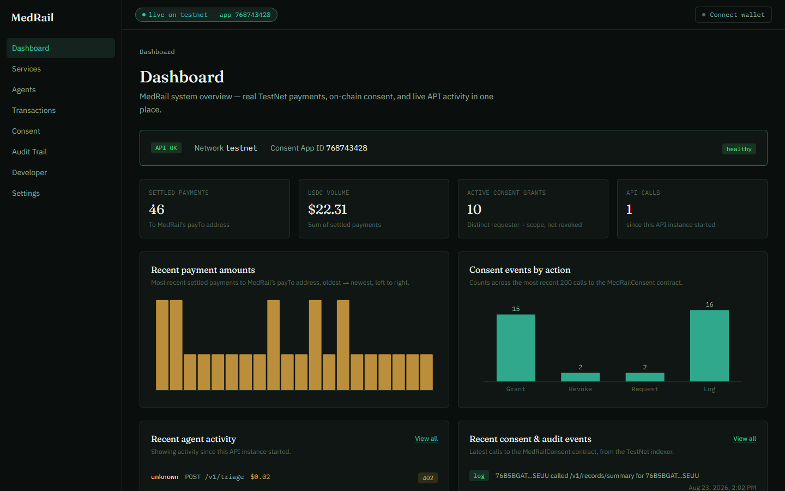
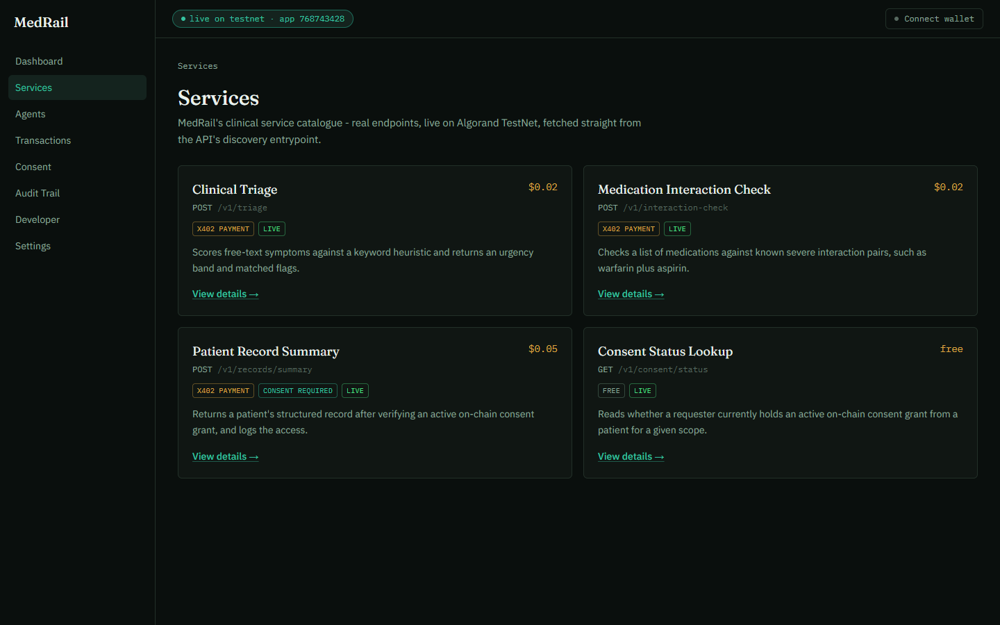

<div align="center">

# 🩺 MedRail

### Pay-per-call clinical services, gated by patient consent.

**No accounts or API keys · Patients grant and revoke access on-chain · Every record access is logged on the ledger**

[](https://medrail-1.onrender.com)




</div>

MedRail sells three clinical services to software agents, one call at a time: a symptom red-flag check, a drug-interaction check, and a patient record summary. Callers pay a few cents in USDC over the x402 protocol, so there is no signup, contract, or API key. The record summary works only if the patient has granted that caller access on the Algorand blockchain, and each access is written to the patient's on-chain audit trail. It was built for the [Algorand Foundation Global x402 Challenge](https://algorand.co/global-x402-challenge) and runs on Algorand TestNet with demo data only.

## 💡 Why you'll like it

| | |
|---|---|
| 🔑 **No signup** | An agent reads the price list at `GET /`, pays per call, and gets its answer. |
| 🪙 **Cents per call** | $0.02 for triage or an interaction check, $0.05 for a record summary. |
| 🙋 **Patient decides** | Only the patient's own wallet can grant or revoke access. The server never holds their key. |
| 📜 **Audit trail no one can edit** | Each record access, and each request refused for lack of consent, is appended to the patient's log on the ledger. |
| 🛡️ **No paying to impersonate** | The wallet that pays must be the one the patient granted, or the call is refused and not charged. |
| 🆓 **Check before you pay** | A free consent lookup tells an agent whether a paid record call would succeed. |
| 🔍 **Everything checkable** | Payments, grants, and audit entries link to public TestNet transactions. |

## 🚀 Three steps



1. **Connect a wallet.** Use Pera, Lute, or a throwaway demo account from the top bar.
2. **Grant consent.** On the Consent page, act as the patient and approve a requester or grant yourself access.
3. **Pay for a call.** On the Developer page, run a paid call and follow its transaction on-chain.

## 🌐 Try it or run it

The demo is live at **https://medrail-1.onrender.com**. Nothing to install.

1. Open the site. The hosted demo sleeps when idle, so the first load can take up to a minute.
2. Click **Connect wallet**. Pick Pera or Lute set to TestNet, or **Use a demo account**. A demo account is a new keypair kept in your browser tab.
3. Get free TestNet ALGO from the [Lora dispenser](https://lora.algokit.io/testnet/fund).
4. Click **Opt in to TestNet USDC** and approve it. Algorand accounts must opt in before they can receive USDC, so a faucet send fails without this step.
5. Get free TestNet USDC from [Circle's faucet](https://faucet.circle.com) (choose Algorand Testnet).
6. Open **Developer**, pick a service, and click **Run this call as the agent**. With Pera or Lute, you approve each payment and consent transaction in the wallet app.

You can browse the Dashboard, Services, Transactions, Consent, and Audit Trail pages without a wallet. To run everything on your own machine, see Development below.

| Requirement | Details |
|---|---|
| Browser | A current desktop browser |
| Wallet | Pera or Lute on TestNet, or the built-in demo account |
| Funds | TestNet ALGO and TestNet USDC. Both are free and have no real value. |
| Local run | Node.js 20 for the API and web app. Python 3.12 for the smart contract. |
| Not supported | Algorand MainNet (no contract is deployed there). Defly wallet. Real patient data. Mobile browsers are not tested. |

## 🔍 What it does

| Stage | What happens |
|---|---|
| Discover | `GET /` returns every endpoint with its price and gate, plus the consent contract's App ID. |
| Quote | An unpaid call to a priced endpoint returns HTTP 402 with the price in TestNet USDC. |
| Pay | The caller's wallet signs a USDC transfer. The GoPlausible facilitator verifies it and settles it on Algorand. |
| Check consent | For a record summary, the paying wallet must match the requester, and the contract must hold an active, unexpired grant from the patient. |
| Answer | Triage returns a score, an urgency band, and the matched red flags. The interaction check returns flagged drug pairs. The record summary returns a fixed synthetic record. |
| Audit | The API writes a `log_access` entry to the patient's on-chain trail, for allowed requests and for requests refused for lack of consent. A refused call is not charged. |
| Summarize (optional) | In the Consent page's hospital panel, a record can be summarized in a few sentences by Google Gemini. This call is free and rate-limited. |
| Review | Dashboard, Transactions, Consent, and Audit Trail pages read settled payments and contract calls from the public TestNet indexer. |

## ⚙️ How it works

```text
 agent / browser ──► MedRail API (Hono) ──► GoPlausible facilitator ──► Algorand TestNet
       │                   │                  (verify + settle USDC)          ▲
       │                   ├──► check_access (simulated, free) ───────────────┤
       │                   └──► log_access (operator-signed audit entry) ─────┤
       │                                                                      │
       └── patient wallet ──► grant_access / revoke_access (signed in browser)┘
                                        MedRailConsent contract · App 768743428
```

| Component | Purpose | License |
|---|---|---|
| `contracts/` MedRailConsent | Consent grants, revocations, expiry, and the per-patient audit log in box storage | MIT (this repo) |
| Algorand Python, PuyaPy, algorand-python-testing | Write, compile, and unit-test the contract | AGPL-3.0-or-later |
| AlgoKit Utils, py-algorand-sdk | Deploy and exercise the contract | MIT |
| python-dotenv, pytest | Config loading and tests for the contract scripts | BSD-3-Clause, MIT |
| Hono, @hono/node-server | API server | MIT |
| @x402/core, @x402/avm, @x402/hono, @x402/fetch, @x402/extensions | x402 payments on Algorand, and Bazaar discovery metadata | Apache-2.0 |
| algosdk | Algorand transactions and contract calls in the API and browser | MIT |
| zod, dotenv | Request validation and config loading | MIT, BSD-2-Clause |
| Next.js, React, Tailwind CSS | Web app | MIT |
| @txnlab/use-wallet (react, pera, lute) | Wallet connection | MIT |
| TypeScript, Vitest, tsx | Types, tests, scripts | Apache-2.0, MIT, MIT |
| Fraunces, IBM Plex Sans, IBM Plex Mono | Fonts, served via `next/font/google` | SIL Open Font License 1.1 |
| GoPlausible facilitator, AlgoNode, Google Gemini API | External services called at run time. Nothing is bundled. | Their own terms of service |

The triage and interaction checks are plain rules, not a machine-learning model: 11 weighted red-flag keyword groups and a table of 14 severe drug pairs. The only AI model involved is the optional Gemini summary.

## 🛡️ Responsible use

- **Not a medical device.** Triage, interaction checks, and Gemini summaries are for demonstration only. Do not use them for real care decisions. Triage and interaction responses carry a disclaimer that says so.
- **Demo data only.** Every record summary is the same fixed synthetic record. There are no real patients in this system. Do not enter real health information: symptom text goes to the API, and summary requests send the record to Google's Gemini API.
- **The ledger is public and permanent.** Consent grants and audit entries show wallet addresses, scopes, and endpoints to anyone, and cannot be deleted. No health data is written on-chain.
- **TestNet only.** Payments use TestNet USDC with no real value. The demo account's key is stored in your browser tab's session storage, so never send real funds to it.

## ⚠️ Known limits

- Runs on Algorand TestNet only. There is no MainNet deployment and no x402 Bazaar listing yet.
- No outside party has paid for the service. The test wallets used in the recorded agent runs were funded by the team.
- The hosted demo sleeps when idle, so the first request can take up to a minute.
- The triage rules match keywords. They do not understand synonyms or negation, so "no chest pain" still counts as chest pain.
- The interaction check knows 14 drug pairs. Anything else comes back unflagged.
- A valid paid call has once returned HTTP 402 without settling. The cause is not known, and a retry worked.
- The Gemini summary needs a `GEMINI_API_KEY` on the server and has no automated tests.
- The deployed contract is an older build than the source. Two fixes in the source (an event with swapped fields and an under-reported storage cost) are not deployed, to keep the existing App ID and history.
- Audit writes are ordered by a lock inside one process, so the API must run as a single instance.
- The operator account pays the network fee for every audit write, including denied requests that the caller is not charged for. The record endpoint is rate-limited to contain this.
- The Agents page activity log lives in memory and resets whenever the API restarts.
- The web app has no automated tests, and its typecheck step in CI currently fails. The API has 93 tests and the contract 28. There is no coverage threshold.
- There are no metrics, tracing, or alerts.

## 🛠️ Development

Prerequisites: Git, Node.js 20, and Python 3.12 (only for the contract).

```bash
git clone https://github.com/Hydra-Of-Malice/Medrail.git
cd Medrail
```

Contract: install the toolchain and run the unit tests (AVM simulator, no network or funds needed).

```bash
cd contracts
python -m venv .venv
source .venv/bin/activate        # Windows: .venv\Scripts\activate
pip install -r requirements-dev.txt
pytest tests/ -v
```

API: runs on http://localhost:4021.

```bash
cd api
npm install
cp .env.example .env             # set PAY_TO_ADDRESS; OPERATOR_MNEMONIC for audit writes; GEMINI_API_KEY is optional
npm run dev
```

The API refuses to start without a valid `PAY_TO_ADDRESS`. `CONSENT_APP_ID` defaults to the deployed TestNet contract, read from `contracts/artifacts/deploy_testnet.json`.

Web app: runs on http://localhost:3000. There is no `.env.example` for it, so create `web/.env.local` yourself.

```bash
cd web
npm install
printf "NEXT_PUBLIC_API_BASE=http://localhost:4021\nNEXT_PUBLIC_NETWORK=testnet\n" > .env.local
npm run dev
```

| Command (in `api/`) | What it does |
|---|---|
| `npm run dev` | Start the API with reload |
| `npm test` | Run the Vitest suite |
| `npm run typecheck` | Type-check source, scripts, and tests |
| `npm run coverage` | Tests with a coverage report |
| `npm run preflight` | Check that wallets, facilitator, and consent grant are ready for the agent demo |
| `npx tsx scripts/agent-demo.ts` | An agent discovers the services, checks consent, and pays for three calls (needs funded TestNet wallets) |

| Folder / file | Contents |
|---|---|
| `api/src/` | API server: routes, x402 setup, rule engines, Algorand and Gemini clients |
| `api/scripts/` | Agent demo, end-to-end proofs, wallet provisioning, preflight |
| `api/test/` | API tests |
| `contracts/smart_contracts/` | The MedRailConsent contract in Algorand Python |
| `contracts/artifacts/` | Compiled contract: the deployed build at the top level, the current source build in `current/` |
| `contracts/scripts/`, `contracts/tests/` | Deploy and exercise scripts, contract tests |
| `web/app/`, `web/components/`, `web/lib/` | Next.js pages, UI components, wallet, x402, and indexer clients |
| `docs/` | Full project documentation, indexed in [docs/README.md](docs/README.md) |

Build for production:

```bash
cd api && npm run build && npm start
```

```bash
cd web && npm run build && npm start
```

Docker: build the API image from the repo root and the web image from `web/`. The web build needs `NEXT_PUBLIC_API_BASE` and `NEXT_PUBLIC_NETWORK` as build args, because Next.js bakes them into the bundle.

```bash
docker build -f api/Dockerfile -t medrail-api .
docker build -f web/Dockerfile -t medrail-web --build-arg NEXT_PUBLIC_API_BASE=http://localhost:4021 --build-arg NEXT_PUBLIC_NETWORK=testnet ./web
```

A Fly.io config for the API is in `api/fly.toml`. The hosted demo runs on Render.

More detail, including the recorded agent run, what has been proven on-chain, environment variables, and contract build notes, is in [docs/ARCHITECTURE.md](docs/ARCHITECTURE.md). Transaction-level evidence is in [docs/PROOF.md](docs/PROOF.md), and open issues are in [docs/ENGINEERING_GAP_REPORT.md](docs/ENGINEERING_GAP_REPORT.md).

## 📄 License

[MIT](LICENSE). See [third-party notices](THIRD_PARTY_NOTICES.md).

Built by Team Litchi: Aditya Arnav ([Hydra-Of-Malice](https://github.com/Hydra-Of-Malice)), Rudra Pratap ([rpratap2111](https://github.com/rpratap2111)), and Yuvraj Singh ([Yuvraj-025](https://github.com/Yuvraj-025)).
