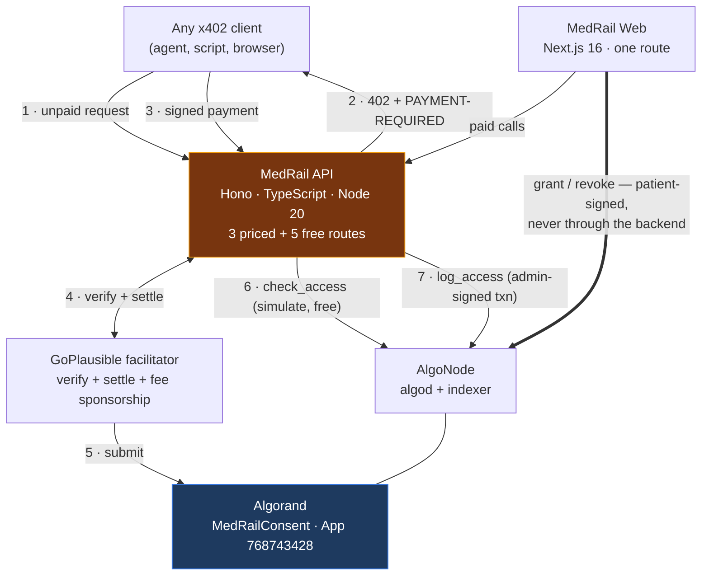

# MedRail

**Clinical services an AI agent can discover, use, and pay for — without an account, an API key, or
permission from anyone except the patient.**

Built for the [Algorand Foundation Global x402 Challenge](https://algorand.co/global-x402-challenge).
Live on Algorand TestNet — App ID [`768743428`](https://lora.algokit.io/testnet/application/768743428).

---

## The agent problem this solves

An AI agent triaging a patient case needs three things: **symptom triage**, a **drug-interaction
check**, and the **patient's record**.

Today that means three vendor signups, three API keys, three billing relationships — and even then
the agent cannot legally touch the record, because nobody can prove the patient allowed it.

MedRail sells all three **per call, over x402**, settled in USDC on Algorand. The record endpoint
adds the part no API key can give you: it is gated by a consent grant **the patient signed with
their own key on-chain**, and every access writes an immutable entry to that patient's audit trail.

So a single paid call is three things at once: **a settled stablecoin payment**, **an on-chain
authorisation check**, and **an audit-log append**. That composition is the project.

### Watch an agent actually do it

```bash
cd api && npx tsx scripts/agent-demo.ts
```

An autonomous agent with no prior knowledge of MedRail reads `GET /`, learns the catalogue and
prices, decides which services the case needs, checks the **free** consent oracle before spending on
the gated endpoint, and pays for what it uses:

```
[1] DISCOVER — reading the service index at GET /
      MedRail: 8 endpoints advertised · x402 v2 · scheme "exact"
      consent contract: App 768743428 on testnet

[2] POST /v1/triage             paid $0.02   band=EMERGENCY score=70
[3] POST /v1/interaction-check  paid $0.02   MAJOR: warfarin + aspirin
[4] GET  /v1/consent/status     cost $0.00   granted=true
[5] POST /v1/records/summary    paid $0.05   consent verified on-chain, access audited

  $0.09  total, across 3 settled Algorand transactions
  Zero accounts created. Zero API keys issued. Zero invoices.
```

Every one of those payments is a real transaction on a public ledger.
[$0.02 triage](https://lora.algokit.io/testnet/transaction/POAQNSOPPW6TB5DU76VHYZTS7X2SJQRUNVCNR55GRO7TYXOKUF4Q) ·
[$0.02 interaction](https://lora.algokit.io/testnet/transaction/W3Z55BZYCALOFZFSXI75MR22OVVEX7JRSK7T2NRATKBDU7Y4OL5A) ·
[$0.05 record](https://lora.algokit.io/testnet/transaction/5CO5XV7M5H6WLFI2D5M7UODUOF2IUQNM3FOSKH5VA66SVQTLBBDQ) ·
[the on-chain audit entry it produced](https://lora.algokit.io/testnet/transaction/5HYV5B2LO5DVHTTAOZMQKJNEYK6VICRVAINAZ5YBVW3QUR64TBKA)

## What this is

Concretely, three priced endpoints share one `payTo` address and one smart contract:

| Endpoint | Price | Gate | What it does |
|---|---|---|---|
| `POST /v1/triage` | $0.02 | x402 payment | Rule-based clinical red-flag score over free-text symptoms |
| `POST /v1/interaction-check` | $0.02 | x402 payment | Checks a medication list against a curated severe-interaction table |
| `POST /v1/records/summary` | $0.05 | x402 payment **+** on-chain consent | Returns a record summary only if the patient has an active grant for this requester and scope |

Plus five free routes: `GET /v1/consent/status`, `/v1/consent/app-info`, `/v1/consent/arc56`,
`/v1/health`, and `GET /` (a machine-readable service index).

No account. No API key. No prior relationship. Any off-the-shelf x402 client — `@x402/fetch`, or
another team's agent — can call and pay for these in one round trip.

## Why it matters

Two problems meet here.

Patients cannot grant machine-readable, independently verifiable, revocable consent over their own
clinical data. Consent today lives inside whichever organisation holds the record; the patient
cannot see who accessed what, and cannot revoke access without asking the holder to do it for them.

Separately, autonomous agents have no good way to pay for a clinical API. Accounts, API keys, and
monthly invoices assume a human signs up. An agent that needs one drug-interaction check does not
want a contract.

MedRail puts both on the same rail: **the payment authenticates the caller, and the ledger
authorises them.** The patient signs grants with their own key — the backend never holds or
proxies it — and every gated access is designed to leave a record on a public ledger that the
patient can read and nobody, including MedRail, can quietly delete.

## What is actually proven

This project is unusually careful about the difference between "built" and "proven". Every claim
below is independently checkable, and every one was re-verified against the public indexer during
the 2026-08-21 engineering review — not taken from this repository's own word.

| Claim | Evidence |
|---|---|
| Contract deployed on Algorand TestNet | App [`768743428`](https://lora.algokit.io/testnet/application/768743428), created round 66088624, `deleted: false` |
| Full consent lifecycle exercised on-chain | request → grant → `check_access=true` → revoke → `check_access=false`, every step a confirmed transaction ([`docs/PROOF.md`](docs/PROOF.md) §5) |
| A real x402 payment settled | [`OYRQRKYA…`](https://lora.algokit.io/testnet/transaction/OYRQRKYA7WUKBVLWTOFJSJMZFBW7VCNGP5VGH5EBUJGRCVFQFJRQ) — `axfer`, asset `10458941` (TestNet USDC), **20000** base units = exactly $0.02 at 6 decimals, `fee: 0` via facilitator sponsorship, round 66091768 |
| 402 challenge matches the live facilitator | Decoded `PAYMENT-REQUIRED` carries the real asset id, the real fee-payer address, and an SDK-computed unit conversion — nothing hardcoded ([`docs/PROOF.md`](docs/PROOF.md) §3) |
| **The deployed program is this repo's source** | `contract.py` → (reproducible `puyapy` 5.9.0 compile) → committed TEAL → (algod assemble) → **byte-identical** to the bytecode running at App `768743428` ([`docs/PROOF.md`](docs/PROOF.md) §7) |
| Test suites pass | **28** contract tests (AVM simulator) + **45** API tests = **73**, all green; API and web both typecheck and build |

**The full composition, proven on-chain.** One paid call to `/v1/records/summary` produced three
real transactions — the patient's [`grant_access`](https://lora.algokit.io/testnet/transaction/M26NPR32Z5YBLBBMZDTBQL6Y7EUSNS5YV4PXYEUBXIVJQGVJ3MAA),
a settled [$0.05 x402 payment](https://lora.algokit.io/testnet/transaction/5DKFUULWLTNGKLYLH3TT44F22MHKOFRCEO6K4JVEPOPETFBYOESA),
and the [immutable audit entry](https://lora.algokit.io/testnet/transaction/4YLKLQKKWXXFW3UT5APJVYKXI7T7A6OACTAWCC5YBAN3XGOGHRVQ)
(sequence 1). `total_audit_entries` went 0 → 1 on the deployed contract. Reproducible:
`npx tsx scripts/e2e-consent-proof.ts`. See [`docs/PROOF.md`](docs/PROOF.md) §9.

Also pending, deliberately: MainNet deployment, public hosting, and the Bazaar listing. Each
requires the team's own funded wallet and accounts. See [`docs/COMPLIANCE.md`](docs/COMPLIANCE.md)
for the rule-by-rule status.

## Architecture



Three deployment units, one contract, **no database, no cache, no queue, no message bus.** The
ledger is the system of record — a decision with real costs, argued in
[ADR-002](docs/03_Architecture/ADRs/ADR-002-no-database-ledger-as-system-of-record.md).

Full design: [`docs/03_Architecture/`](docs/03_Architecture/).

## About the "AI" endpoints — read this before judging them

`/v1/triage` and `/v1/interaction-check` contain **no machine-learning model of any kind.** No LLM,
no embeddings, no vector store, no inference. They are deterministic rule engines: a weighted
keyword matcher over 11 red-flag groups, and a lookup against 14 curated drug pairs.

That was a deliberate safety decision, not a shortcut. A hackathon endpoint that reads as
authoritative medical advice is a genuine harm vector, and an opaque model in a clinical decision
path cannot be audited by the clinician who would have to trust it. What the project gets in
exchange is determinism, inspectability, unit-testability, zero inference cost, and no
prompt-injection surface.

What it gives up is equally real: no generalisation, no synonym or negation handling, no clinical
validation. All of it is enumerated in
[`docs/09_Intelligence_Layer/Limitations.md`](docs/09_Intelligence_Layer/Limitations.md).
Every response carries a non-diagnostic disclaimer, and that disclaimer is asserted by the test
suite as a correctness property rather than written in prose.

## USP — what makes this different

Most x402 entries price an existing API per call. That is a payment rail bolted onto a product.
MedRail's differentiator is that **the payment and the authorisation are the same act**.

**1. The payment is the authentication.**
`/v1/records/summary` recovers the address that signed the x402 payment and refuses the request
unless it matches the requester whose consent it checks. No API key, no session, no bearer token —
the money proves who is asking. `api/scripts/verify-g01-fix.ts` runs the impersonation attack
against live TestNet and shows it rejected with a 403.

**2. The patient is the authoriser, and the backend cannot override them.**
`grant_access` and `revoke_access` are signed client-side by the patient's own key and submitted
straight to Algorand. MedRail's server never holds, sees, or proxies that key — so "the patient
controls access" is structural, not a policy promise. Revocation is one transaction and takes effect
on the next call.

**3. Every paid access writes an audit entry the operator cannot delete.**
Not a log file MedRail could edit — an append-only per-patient sequence in Algorand box storage.
The patient can read who accessed their record, when, and under what scope, without asking MedRail
for it.

**4. Off-the-shelf agents work with zero MedRail-specific code.**
This drove a real architectural decision: the audit write is a *follow-up* transaction rather than a
leg in the client's signed payment group, because requiring clients to know our App ID and method
signatures would break every generic `@x402/fetch` caller
([ADR-005](docs/03_Architecture/ADRs/ADR-005-audit-write-as-follow-up-transaction.md)). We gave up
atomicity to keep the door open to any agent.

**5. Self-describing for machines.**
`GET /` returns the catalogue with prices and gates; `/v1/consent/arc56` serves the compiled ABI spec
so an agent can build its own on-chain client without cloning this repository.

### What is *not* novel, stated plainly

x402 is a protocol we consume, not one we invented. Algorand box storage is standard. On-chain
consent registries are a known pattern. The two intelligence endpoints are deterministic rule
engines, not models — a deliberate safety choice, argued in
[ADR-007](docs/03_Architecture/ADRs/ADR-007-deterministic-rule-engines-instead-of-an-ml-model.md).
The novelty is the composition, not the parts.

## Technology

| Layer | Stack |
|---|---|
| Contract | Algorand Python (`algopy`) 3.5.1, compiled with `puyapy` 5.9.0; ARC-4 ABI, ARC-56 spec, box storage |
| API | Hono 4.7, TypeScript 5.7 (strict), Node 20, `@x402/{core,avm,hono}` 2.21.0, `algosdk` ^3.6.0, zod |
| Web | Next.js 16.3.0, React 19.2.8, Tailwind CSS 4 |
| Chain | Algorand TestNet · USDC ASA `10458941` · x402 protocol v2, scheme `exact` |
| Facilitator | GoPlausible — `https://facilitator.goplausible.xyz` |
| Test | `pytest` + `algorand-python-testing` (AVM simulator) · `vitest` |

## Quick start

```bash
# 1 — Contract: compile + test (no network, no funds)
cd contracts
python -m venv .venv && .venv/Scripts/activate      # or: source .venv/bin/activate
pip install -r requirements-dev.txt
python -m puyapy smart_contracts/consent/contract.py --out-dir artifacts
cp smart_contracts/consent/artifacts/* artifacts/    # see note below
pytest tests/ -v                                     # expect 14 passed

# 2 — API
cd ../api
npm install
cp .env.example .env                                 # fill PAY_TO_ADDRESS / OPERATOR_MNEMONIC
npm run dev                                          # http://localhost:4021

# 3 — Web
cd ../web
npm install && cp .env.example .env.local
npm run dev                                          # http://localhost:3000
```

> **Note on the copy step.** `puyapy` resolves `--out-dir` relative to the *source file*, so
> `--out-dir artifacts` writes to `contracts/smart_contracts/consent/artifacts/` — not
> `contracts/artifacts/`, which is where `deploy_testnet.py` and the `/v1/consent/arc56` route both
> read from. The committed artifacts were produced this way and copied across; the copy was
> previously undocumented. Passing `--out-dir ../../artifacts` targets the right directory but
> embeds an absolute machine-specific path in the source maps, so it is not reproducible. Tracked
> as **G-28** in [`docs/ENGINEERING_GAP_REPORT.md`](docs/ENGINEERING_GAP_REPORT.md).

Full setup including TestNet funding, the USDC opt-in step, and deployment:
[`docs/08_Deployment/Environment_Setup.md`](docs/08_Deployment/Environment_Setup.md).

### Watch an autonomous agent use the service

```bash
cd api && npx tsx src/index.ts &          # start the API
npx tsx scripts/agent-demo.ts             # the agent discovers, decides, and pays
```

Needs a TestNet account holding ALGO and USDC (see `docs/08_Deployment/Environment_Setup.md`).
Two more scripts prove specific properties:

| Script | Proves |
|---|---|
| `scripts/agent-demo.ts` | An agent completes a clinical task across 3 paid services for $0.09 |
| `scripts/e2e-consent-proof.ts` | grant → consent check → payment → on-chain audit entry, in one call |
| `scripts/verify-g01-fix.ts` | An impersonation attack against the consent gate is rejected with 403 |

### See the payment flow without any setup

```bash
curl -i -X POST http://localhost:4021/v1/triage \
  -H "Content-Type: application/json" \
  -d '{"symptoms":"Sudden chest pain and shortness of breath"}'
```

Returns a real `402` whose `payment-required` header base64-decodes to the live price, asset, and
fee-sponsorship address. Then `npx tsx scripts/e2e-proof.ts` from `api/` runs the whole
402 → sign → settle → 200 round trip against a funded TestNet account and writes the settled
transaction ID to disk.

## Environment variables

| File | Variable | Notes |
|---|---|---|
| `contracts/.env` | `DEPLOYER_ADDRESS`, `DEPLOYER_MNEMONIC` | Dedicated deploy key. Gitignored. |
| `api/.env` | `NETWORK`, `PORT`, `FACILITATOR_URL`, `PAY_TO_ADDRESS`, `CONSENT_APP_ID`, `OPERATOR_MNEMONIC`, `OPERATOR_ADDRESS` | See `api/.env.example`. `CONSENT_APP_ID` is **required in containers** — the deploy-artifact fallback is not present in the image. |
| `web/.env.local` | `NEXT_PUBLIC_API_BASE`, `NEXT_PUBLIC_NETWORK` | Public values only. |

No `.env` file is tracked by git — verified.

## Testing

```bash
cd contracts && pytest tests/ -v          # 14 passed
cd api && npx tsc --noEmit && npx vitest run   # 18 passed
cd web && npx tsc --noEmit && npm run build
```

Strategy, full case catalogue, and the honest coverage gaps:
[`docs/07_Testing/`](docs/07_Testing/).

## Security

The design gets several hard things right: patient keys never reach the backend; contract
admin functions are gated on-chain and negatively tested; no PHI touches the ledger; the attack
surface is genuinely small (no database, no templating, no shell, no model in the decision path).

It also has one finding you should know about before you evaluate anything else:
**`/v1/records/summary` does not currently bind the paying identity to the `requesterAddress` it
checks consent against**, so the consent gate does not yet function as an access control. It is
documented in full, with a compile-verified fix, as **G-01** in
[`docs/ENGINEERING_GAP_REPORT.md`](docs/ENGINEERING_GAP_REPORT.md).

Full treatment: [`docs/06_Security/`](docs/06_Security/) — architecture, STRIDE threat model,
privacy analysis, and risk register.

## Performance

**No performance benchmark exists, and none is claimed.** The only measurements taken are two
single observations on a developer laptop: ~505 ms for a cold `/v1/consent/status` (two sequential
algod round-trips) and ~15 ms to serve a warm 402. A measurement plan — rather than invented
numbers — is in
[`docs/07_Testing/Performance_Validation.md`](docs/07_Testing/Performance_Validation.md).

## Known limitations

Stated plainly, because a reviewer will find them anyway:

- `services/algorand.ts` still has thin direct test coverage, though the box-key derivation it owns
  is now pinned by golden vectors asserted from both TypeScript and Python (G-05).
- Nothing is publicly hosted; there is no MainNet deployment and no Bazaar listing.
- Exactly one payment has ever settled, and it was a self-payment.
- The record summary is a fixed synthetic constant; there are no real patients in this system.
- Audit sequencing is serialised in-process only, so the deployment is pinned to one machine (G-11).
- There is no observability: no metrics, no tracing, no alerting (G-15).

The complete register, with severities and fixes:
[`docs/ENGINEERING_GAP_REPORT.md`](docs/ENGINEERING_GAP_REPORT.md).

## Roadmap

Phase 1 is complete: every finding a reviewer can discover unaided has been fixed and verified.
Phases 2–4 cover resilience, production hardening, and genuine product direction —
[`docs/WINNING_ROADMAP.md`](docs/WINNING_ROADMAP.md).

## Documentation

**Start here:** [Executive Summary](docs/00_EXECUTIVE_SUMMARY.md) — the whole project in two minutes.
Full index: [`docs/README.md`](docs/README.md).

Every document is linked below. Click any row to open it.

<details open>
<summary><b>Overview</b></summary>

| Document | What it covers |
|---|---|
| [Executive Summary](docs/00_EXECUTIVE_SUMMARY.md) | The project in two minutes: problem, solution, evidence, maturity, roadmap |
| [For Judges](docs/JUDGES.md) | The pitch, the evidence table, and a 2-minute demo script |
| [Evidence Log](docs/PROOF.md) | Every claim with a transaction ID and a command to reproduce it |
| [Engineering Gap Report](docs/ENGINEERING_GAP_REPORT.md) | 34 findings — 22 closed, 12 open — with evidence, severities and fixes |
| [Winning Roadmap](docs/WINNING_ROADMAP.md) | Four-phase remediation plan; Phase 1 complete |
| [Compliance](docs/COMPLIANCE.md) | Rule-by-rule mapping to the Global x402 Challenge requirements |
| [Go-Live Checklist](docs/GO_LIVE_CHECKLIST.md) | Competition entry checklist |
| [Implementation Plan](docs/IMPLEMENTATION_PLAN.md) | The plan the build followed, with its verified-fact table |
| [Architecture (narrative)](docs/ARCHITECTURE.md) · [API Reference](docs/API.md) · [Security Notes](docs/SECURITY.md) · [Deployment Runbook](docs/DEPLOYMENT.md) | Original build-time documents, kept for continuity |

</details>

<details>
<summary><b>01 — Product</b> · problem, vision, personas, journeys, use cases, novelty</summary>

| Document | What it covers |
|---|---|
| [Problem Statement](docs/01_Product/Problem_Statement.md) | The consent gap and the agent-payment gap; why existing approaches fall short |
| [Project Vision](docs/01_Product/Project_Vision.md) | Vision, objectives, success criteria, maturity ladder |
| [User Personas](docs/01_Product/User_Personas.md) | The five parties the system actually serves |
| [User Journey](docs/01_Product/User_Journey.md) | End-to-end journeys for the paying agent and the consenting patient |
| [Use Cases](docs/01_Product/Use_Cases.md) | Formal use cases mapped to requirement IDs, including the abuse case |
| [Scope](docs/01_Product/Scope.md) | In scope, out of scope, assumptions, constraints, dependencies |
| [Competitive Analysis](docs/01_Product/Competitive_Analysis.md) | Against SMART-on-FHIR, FHIR Consent, and commercial clinical APIs |
| [USP & Novelty](docs/01_Product/USP_Novelty.md) | What is genuinely novel — and what is not |

</details>

<details>
<summary><b>02 — Requirements</b> · SRS, traceability, gap analysis</summary>

| Document | What it covers |
|---|---|
| [Software Requirements Specification](docs/02_Requirements/SRS.md) | Full SRS, 17 sections, every requirement with acceptance criteria and evidence |
| [Requirements Traceability Matrix](docs/02_Requirements/Requirements_Traceability_Matrix.md) | Requirement → design → code → test → evidence, forward and reverse |
| [Requirements Gap Analysis](docs/02_Requirements/Requirements_Gap_Analysis.md) | Prioritised gaps by severity with recommended fixes |
| [Requirements Registry](docs/02_Requirements/Requirements_Registry.md) | The frozen canonical ID registry every other document cites |

</details>

<details>
<summary><b>03 — Architecture</b> · HLD, LLD, diagrams, 12 decision records</summary>

| Document | What it covers |
|---|---|
| [System Architecture](docs/03_Architecture/System_Architecture.md) | Architectural style, context and container diagrams, why there is no database |
| [High-Level Design](docs/03_Architecture/HLD.md) | Components, boundaries, protocols, synchronous flows |
| [Low-Level Design](docs/03_Architecture/LLD.md) | Module-level design: the contract, chain integration, x402 wiring, the routes |
| [Component Diagram](docs/03_Architecture/Component_Diagram.md) | Component graphs plus dependency and failure-impact tables |
| [Sequence Diagrams](docs/03_Architecture/Sequence_Diagrams.md) | Nine flows including the rejected attack path and both failure paths |
| [Activity Diagrams](docs/03_Architecture/Activity_Diagrams.md) | Request lifecycle, consent state machine, CI pipeline |
| [Data Flow Diagrams](docs/03_Architecture/Data_Flow_Diagrams.md) | DFD levels 0–2 with trust boundaries and data classification |
| [**ADR Index**](docs/03_Architecture/ADRs/README.md) | All twelve decision records, indexed |

**Decision records** — each separates *recorded* from *reconstructed* rationale, and states what the decision cost.

| ADR | Decision |
|---|---|
| [ADR-001](docs/03_Architecture/ADRs/ADR-001-backend-framework.md) | Backend framework — Hono + TypeScript on Node 20 |
| [ADR-002](docs/03_Architecture/ADRs/ADR-002-no-database-ledger-as-system-of-record.md) | No database — the ledger is the system of record |
| [ADR-003](docs/03_Architecture/ADRs/ADR-003-box-storage-over-local-state.md) | Box storage over local state |
| [ADR-004](docs/03_Architecture/ADRs/ADR-004-x402-v2-exact-scheme-with-external-facilitator.md) | x402 v2 `exact` scheme with an external facilitator |
| [ADR-005](docs/03_Architecture/ADRs/ADR-005-audit-write-as-follow-up-transaction.md) | Audit write as a follow-up transaction, not an atomic group |
| [ADR-006](docs/03_Architecture/ADRs/ADR-006-admin-only-audit-log.md) | Admin-only audit log |
| [ADR-007](docs/03_Architecture/ADRs/ADR-007-deterministic-rule-engines-instead-of-an-ml-model.md) | Deterministic rule engines instead of an ML model |
| [ADR-008](docs/03_Architecture/ADRs/ADR-008-open-plus-gated-endpoint-split.md) | The open plus consent-gated endpoint split |
| [ADR-009](docs/03_Architecture/ADRs/ADR-009-in-process-per-patient-lock-for-audit-sequencing.md) | In-process per-patient lock for audit sequencing |
| [ADR-010](docs/03_Architecture/ADRs/ADR-010-client-side-key-custody-and-the-demo-wallet.md) | Client-side key custody and the demo wallet |
| [ADR-011](docs/03_Architecture/ADRs/ADR-011-deployment-target-docker-and-fly-io.md) | Deployment target — Docker and Fly.io |
| [ADR-012](docs/03_Architecture/ADRs/ADR-012-observability-strategy.md) | Observability strategy (proposed) |

</details>

<details>
<summary><b>04 — Data</b> · box-storage model, ER diagram, dictionary, indexing</summary>

| Document | What it covers |
|---|---|
| [Database Design](docs/04_Data/Database_Design.md) | Algorand box storage as the system of record; MBR economics |
| [ER Diagram](docs/04_Data/ER_Diagram.md) | Entity model and physical box-key byte layout |
| [Data Dictionary](docs/04_Data/Data_Dictionary.md) | Every field, on-chain and over HTTP |
| [Data Flow](docs/04_Data/Data_Flow.md) | Lineage, retention, visibility, and what is publicly readable |
| [Indexing & Query Strategy](docs/04_Data/Indexing_And_Query_Strategy.md) | Query patterns the design serves — and the ones it cannot |

</details>

<details>
<summary><b>05 — API</b> · endpoint reference, OpenAPI 3.1, error catalogue</summary>

| Document | What it covers |
|---|---|
| [API Documentation](docs/05_API/API_Documentation.md) | All eight routes plus the 13-method on-chain ABI |
| [OpenAPI Specification](docs/05_API/OpenAPI.yaml) | OpenAPI 3.1, authored from the implementation |
| [API Error Catalogue](docs/05_API/API_Error_Catalog.md) | Every error the API can produce, with cause and retryability |

</details>

<details>
<summary><b>06 — Security</b> · architecture, STRIDE threat model, privacy, risk register</summary>

| Document | What it covers |
|---|---|
| [Security Architecture](docs/06_Security/Security_Architecture.md) | Controls by domain, each with an honest status |
| [Threat Model](docs/06_Security/Threat_Model.md) | STRIDE register across 35 threats |
| [Privacy](docs/06_Security/Privacy.md) | What reaches the permanent public ledger, and the tensions that creates |
| [Risk Register](docs/06_Security/Risk_Register.md) | Technical, security, operational and demo risks |

</details>

<details>
<summary><b>07 — Testing</b> · strategy, plan, cases, results, performance</summary>

| Document | What it covers |
|---|---|
| [Test Strategy](docs/07_Testing/Test_Strategy.md) | The testing philosophy and the pyramid as it actually is |
| [Test Plan](docs/07_Testing/Test_Plan.md) | Per-level plan, CI execution, environment matrix |
| [Test Cases](docs/07_Testing/Test_Cases.md) | The full case catalogue, existing and missing |
| [Test Results](docs/07_Testing/Test_Results.md) | Real results only, plus an explicit evidence-gaps section |
| [Performance Validation](docs/07_Testing/Performance_Validation.md) | A measurement plan — no invented benchmarks |

</details>

<details>
<summary><b>08 — Deployment</b> · go-live runbook, Docker, CI/CD, rollback</summary>

| Document | What it covers |
|---|---|
| [**Go-Live Runbook**](docs/08_Deployment/GO_LIVE_RUNBOOK.md) | **Exact commands to deploy publicly** — Fly.io, Vercel, secrets, verification, MainNet |
| [Deployment Architecture](docs/08_Deployment/Deployment_Architecture.md) | Actual vs intended topology; environment-variable reference |
| [Environment Setup](docs/08_Deployment/Environment_Setup.md) | Local setup with real troubleshooting |
| [Docker](docs/08_Deployment/Docker.md) | Both Dockerfiles analysed line by line |
| [CI/CD](docs/08_Deployment/CI_CD.md) | The pipeline, its history, and the recommended production version |
| [Rollback Strategy](docs/08_Deployment/Rollback_Strategy.md) | Including why a deployed contract cannot be rolled back |

</details>

<details>
<summary><b>09 — Intelligence Layer</b> · the rule engines, honestly documented</summary>

Deliberately **not** named `09_AI_ML`, because there is no AI or ML in this system —
[see why](docs/09_Intelligence_Layer/README.md).

| Document | What it covers |
|---|---|
| [Overview](docs/09_Intelligence_Layer/README.md) | What this layer is, and the naming decision |
| [Intelligence Architecture](docs/09_Intelligence_Layer/Intelligence_Architecture.md) | Where it sits; rule engine vs model, compared fairly |
| [Algorithm Inventory](docs/09_Intelligence_Layer/Algorithm_Inventory.md) | Both engines in full, plus an explicit "models used: none" |
| [Processing Pipeline](docs/09_Intelligence_Layer/Processing_Pipeline.md) | Input to output, with worked arithmetic |
| [Evaluation](docs/09_Intelligence_Layer/Evaluation.md) | What is verified, what is not, and what real evaluation would require |
| [Prompt Architecture](docs/09_Intelligence_Layer/Prompt_Architecture.md) | There are no prompts — and why that is a security property |
| [Limitations](docs/09_Intelligence_Layer/Limitations.md) | Enumerated failure modes and appropriate-use boundaries |

</details>

<details>
<summary><b>10 — Operations</b> · monitoring, logging, incidents, disaster recovery</summary>

| Document | What it covers |
|---|---|
| [Monitoring](docs/10_Operations/Monitoring.md) | What an operator can see today, and the blind spots |
| [Logging](docs/10_Operations/Logging.md) | Current state plus a design with an explicit never-log list |
| [Incident Response](docs/10_Operations/Incident_Response.md) | Runbooks for the failure modes that actually exist |
| [Disaster Recovery](docs/10_Operations/Disaster_Recovery.md) | Key custody is the real risk; RPO/RTO are not established |

</details>

<details>
<summary><b>11 — Hackathon</b> · judge evaluation, strategy, demo, pitch</summary>

| Document | What it covers |
|---|---|
| [Judge Evaluation](docs/11_Hackathon/Judge_Evaluation.md) | Adversarial scoring; why this could win and why it could lose |
| [Winning Strategy](docs/11_Hackathon/Winning_Strategy.md) | Ranked actions by judge-perception impact |
| [Demo Script](docs/11_Hackathon/Demo_Script.md) | 2-minute and 5-minute runs of show |
| [**Demo Video Script**](docs/11_Hackathon/Demo_Video_Script.md) | **Shot-by-shot script for the 3-minute submission video** |
| [Demo Runbook](docs/11_Hackathon/Demo_Runbook.md) | Pre-flight checklist and failure fallbacks |
| [Pitch Architecture](docs/11_Hackathon/Pitch_Architecture.md) | How to present the design, plus a hard-question Q&A bank |

</details>

<details>
<summary><b>Future work</b></summary>

| Document | What it covers |
|---|---|
| [Sentinel Exchange Proposal](docs/future/SENTINEL_EXCHANGE_PROPOSAL.md) | **Unbuilt proposal** for a different product. Nothing in it exists in this repository. Retained for design continuity only. |

</details>

## Entry classification

**Composite** — three priced endpoints, one `payTo` address.
Not Orchestrator: MedRail does not pay other x402 endpoints, and does not claim to.
[`docs/COMPLIANCE.md`](docs/COMPLIANCE.md) has the rule-by-rule mapping.

## Repository layout

```
contracts/   Algorand Python contract (algopy/puya), 28 unit tests, deploy + proof scripts
api/         Hono/TypeScript x402 resource server, 45 tests
web/         Next.js demo — live payment flow and on-chain consent UI
docs/        Product, requirements, architecture, data, API, security,
             testing, deployment, intelligence layer, operations, hackathon
```

## License

MIT — see [`LICENSE`](LICENSE).
