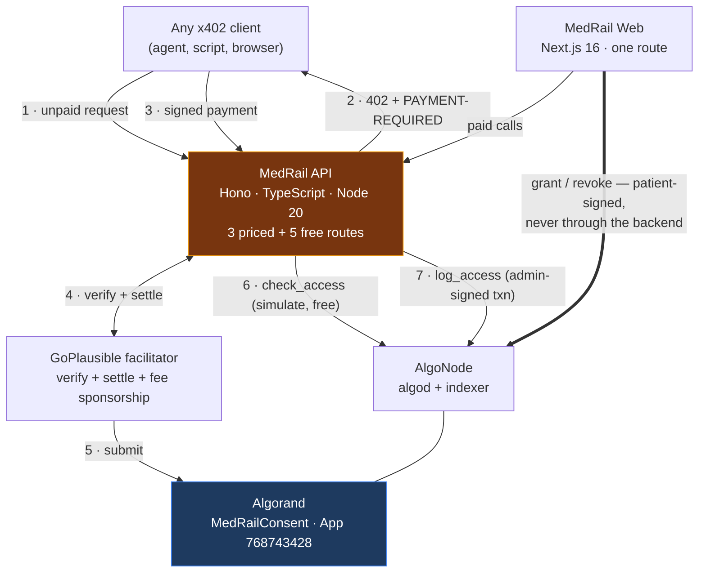

# MedRail

**A patient-consent layer on Algorand, underneath a family of x402-paid clinical-intelligence
endpoints.**

Built for the [Algorand Foundation Global x402 Challenge](https://algorand.co/global-x402-challenge).

Live on Algorand TestNet — App ID [`768743428`](https://lora.algokit.io/testnet/application/768743428),
with a real settled x402 payment you can check on a public indexer.

---

## What this is

A single HTTP call to MedRail can be three things at once: **a settled stablecoin payment**, **an
on-chain authorisation check against a consent grant the patient signed themselves**, and **an
immutable audit-log append**. That composition is the project.

Concretely, three priced endpoints share one `payTo` address and one smart contract:

| Endpoint | Price | Gate | What it does |
|---|---|---|---|
| `POST /v1/triage` | $0.02 | x402 payment | Rule-based clinical red-flag score over free-text symptoms |
| `POST /v1/interaction-check` | $0.02 | x402 payment | Checks a medication list against a curated severe-interaction table |
| `POST /v1/records/summary` | $0.05 | x402 payment **+** on-chain consent | Returns a record summary only if the patient has an active grant for this requester and scope |

Plus five free routes: `GET /v1/consent/status`, `/v1/consent/app-info`, `/v1/consent/arc56`,
`/v1/health`, and `GET /` (a machine-readable service index).

No account. No API key. No prior relationship. Any off-the-shelf x402 client — `@x402/fetch`, or
another team's agent — can call and pay for these in one round trip.

## Why it matters

Two problems meet here.

Patients cannot grant machine-readable, independently verifiable, revocable consent over their own
clinical data. Consent today lives inside whichever organisation holds the record; the patient
cannot see who accessed what, and cannot revoke access without asking the holder to do it for them.

Separately, autonomous agents have no good way to pay for a clinical API. Accounts, API keys, and
monthly invoices assume a human signs up. An agent that needs one drug-interaction check does not
want a contract.

MedRail puts both on the same rail: **the payment authenticates the caller, and the ledger
authorises them.** The patient signs grants with their own key — the backend never holds or
proxies it — and every gated access is designed to leave a record on a public ledger that the
patient can read and nobody, including MedRail, can quietly delete.

## What is actually proven

This project is unusually careful about the difference between "built" and "proven". Every claim
below is independently checkable, and every one was re-verified against the public indexer during
the 2026-08-21 engineering review — not taken from this repository's own word.

| Claim | Evidence |
|---|---|
| Contract deployed on Algorand TestNet | App [`768743428`](https://lora.algokit.io/testnet/application/768743428), created round 66088624, `deleted: false` |
| Full consent lifecycle exercised on-chain | request → grant → `check_access=true` → revoke → `check_access=false`, every step a confirmed transaction ([`docs/PROOF.md`](docs/PROOF.md) §5) |
| A real x402 payment settled | [`OYRQRKYA…`](https://lora.algokit.io/testnet/transaction/OYRQRKYA7WUKBVLWTOFJSJMZFBW7VCNGP5VGH5EBUJGRCVFQFJRQ) — `axfer`, asset `10458941` (TestNet USDC), **20000** base units = exactly $0.02 at 6 decimals, `fee: 0` via facilitator sponsorship, round 66091768 |
| 402 challenge matches the live facilitator | Decoded `PAYMENT-REQUIRED` carries the real asset id, the real fee-payer address, and an SDK-computed unit conversion — nothing hardcoded ([`docs/PROOF.md`](docs/PROOF.md) §3) |
| **The deployed program is this repo's source** | `contract.py` → (reproducible `puyapy` 5.9.0 compile) → committed TEAL → (algod assemble) → **byte-identical** to the bytecode running at App `768743428` ([`docs/PROOF.md`](docs/PROOF.md) §7) |
| Test suites pass | **28** contract tests (AVM simulator) + **45** API tests = **73**, all green; API and web both typecheck and build |

**The full composition, proven on-chain.** One paid call to `/v1/records/summary` produced three
real transactions — the patient's [`grant_access`](https://lora.algokit.io/testnet/transaction/M26NPR32Z5YBLBBMZDTBQL6Y7EUSNS5YV4PXYEUBXIVJQGVJ3MAA),
a settled [$0.05 x402 payment](https://lora.algokit.io/testnet/transaction/5DKFUULWLTNGKLYLH3TT44F22MHKOFRCEO6K4JVEPOPETFBYOESA),
and the [immutable audit entry](https://lora.algokit.io/testnet/transaction/4YLKLQKKWXXFW3UT5APJVYKXI7T7A6OACTAWCC5YBAN3XGOGHRVQ)
(sequence 1). `total_audit_entries` went 0 → 1 on the deployed contract. Reproducible:
`npx tsx scripts/e2e-consent-proof.ts`. See [`docs/PROOF.md`](docs/PROOF.md) §9.

Also pending, deliberately: MainNet deployment, public hosting, and the Bazaar listing. Each
requires the team's own funded wallet and accounts. See [`docs/COMPLIANCE.md`](docs/COMPLIANCE.md)
for the rule-by-rule status.

## Architecture



Three deployment units, one contract, **no database, no cache, no queue, no message bus.** The
ledger is the system of record — a decision with real costs, argued in
[ADR-002](docs/03_Architecture/ADRs/ADR-002-no-database-ledger-as-system-of-record.md).

Full design: [`docs/03_Architecture/`](docs/03_Architecture/).

## About the "AI" endpoints — read this before judging them

`/v1/triage` and `/v1/interaction-check` contain **no machine-learning model of any kind.** No LLM,
no embeddings, no vector store, no inference. They are deterministic rule engines: a weighted
keyword matcher over 11 red-flag groups, and a lookup against 14 curated drug pairs.

That was a deliberate safety decision, not a shortcut. A hackathon endpoint that reads as
authoritative medical advice is a genuine harm vector, and an opaque model in a clinical decision
path cannot be audited by the clinician who would have to trust it. What the project gets in
exchange is determinism, inspectability, unit-testability, zero inference cost, and no
prompt-injection surface.

What it gives up is equally real: no generalisation, no synonym or negation handling, no clinical
validation. All of it is enumerated in
[`docs/09_Intelligence_Layer/Limitations.md`](docs/09_Intelligence_Layer/Limitations.md).
Every response carries a non-diagnostic disclaimer, and that disclaimer is asserted by the test
suite as a correctness property rather than written in prose.

## Technology

| Layer | Stack |
|---|---|
| Contract | Algorand Python (`algopy`) 3.5.1, compiled with `puyapy` 5.9.0; ARC-4 ABI, ARC-56 spec, box storage |
| API | Hono 4.7, TypeScript 5.7 (strict), Node 20, `@x402/{core,avm,hono}` 2.21.0, `algosdk` ^3.6.0, zod |
| Web | Next.js 16.3.0, React 19.2.8, Tailwind CSS 4 |
| Chain | Algorand TestNet · USDC ASA `10458941` · x402 protocol v2, scheme `exact` |
| Facilitator | GoPlausible — `https://facilitator.goplausible.xyz` |
| Test | `pytest` + `algorand-python-testing` (AVM simulator) · `vitest` |

## Quick start

```bash
# 1 — Contract: compile + test (no network, no funds)
cd contracts
python -m venv .venv && .venv/Scripts/activate      # or: source .venv/bin/activate
pip install -r requirements-dev.txt
python -m puyapy smart_contracts/consent/contract.py --out-dir artifacts
cp smart_contracts/consent/artifacts/* artifacts/    # see note below
pytest tests/ -v                                     # expect 14 passed

# 2 — API
cd ../api
npm install
cp .env.example .env                                 # fill PAY_TO_ADDRESS / OPERATOR_MNEMONIC
npm run dev                                          # http://localhost:4021

# 3 — Web
cd ../web
npm install && cp .env.example .env.local
npm run dev                                          # http://localhost:3000
```

> **Note on the copy step.** `puyapy` resolves `--out-dir` relative to the *source file*, so
> `--out-dir artifacts` writes to `contracts/smart_contracts/consent/artifacts/` — not
> `contracts/artifacts/`, which is where `deploy_testnet.py` and the `/v1/consent/arc56` route both
> read from. The committed artifacts were produced this way and copied across; the copy was
> previously undocumented. Passing `--out-dir ../../artifacts` targets the right directory but
> embeds an absolute machine-specific path in the source maps, so it is not reproducible. Tracked
> as **G-28** in [`docs/ENGINEERING_GAP_REPORT.md`](docs/ENGINEERING_GAP_REPORT.md).

Full setup including TestNet funding, the USDC opt-in step, and deployment:
[`docs/08_Deployment/Environment_Setup.md`](docs/08_Deployment/Environment_Setup.md).

### See the payment flow without any setup

```bash
curl -i -X POST http://localhost:4021/v1/triage \
  -H "Content-Type: application/json" \
  -d '{"symptoms":"Sudden chest pain and shortness of breath"}'
```

Returns a real `402` whose `payment-required` header base64-decodes to the live price, asset, and
fee-sponsorship address. Then `npx tsx scripts/e2e-proof.ts` from `api/` runs the whole
402 → sign → settle → 200 round trip against a funded TestNet account and writes the settled
transaction ID to disk.

## Environment variables

| File | Variable | Notes |
|---|---|---|
| `contracts/.env` | `DEPLOYER_ADDRESS`, `DEPLOYER_MNEMONIC` | Dedicated deploy key. Gitignored. |
| `api/.env` | `NETWORK`, `PORT`, `FACILITATOR_URL`, `PAY_TO_ADDRESS`, `CONSENT_APP_ID`, `OPERATOR_MNEMONIC`, `OPERATOR_ADDRESS` | See `api/.env.example`. `CONSENT_APP_ID` is **required in containers** — the deploy-artifact fallback is not present in the image. |
| `web/.env.local` | `NEXT_PUBLIC_API_BASE`, `NEXT_PUBLIC_NETWORK` | Public values only. |

No `.env` file is tracked by git — verified.

## Testing

```bash
cd contracts && pytest tests/ -v          # 14 passed
cd api && npx tsc --noEmit && npx vitest run   # 18 passed
cd web && npx tsc --noEmit && npm run build
```

Strategy, full case catalogue, and the honest coverage gaps:
[`docs/07_Testing/`](docs/07_Testing/).

## Security

The design gets several hard things right: patient keys never reach the backend; contract
admin functions are gated on-chain and negatively tested; no PHI touches the ledger; the attack
surface is genuinely small (no database, no templating, no shell, no model in the decision path).

It also has one finding you should know about before you evaluate anything else:
**`/v1/records/summary` does not currently bind the paying identity to the `requesterAddress` it
checks consent against**, so the consent gate does not yet function as an access control. It is
documented in full, with a compile-verified fix, as **G-01** in
[`docs/ENGINEERING_GAP_REPORT.md`](docs/ENGINEERING_GAP_REPORT.md).

Full treatment: [`docs/06_Security/`](docs/06_Security/) — architecture, STRIDE threat model,
privacy analysis, and risk register.

## Performance

**No performance benchmark exists, and none is claimed.** The only measurements taken are two
single observations on a developer laptop: ~505 ms for a cold `/v1/consent/status` (two sequential
algod round-trips) and ~15 ms to serve a warm 402. A measurement plan — rather than invented
numbers — is in
[`docs/07_Testing/Performance_Validation.md`](docs/07_Testing/Performance_Validation.md).

## Known limitations

Stated plainly, because a reviewer will find them anyway:

- `services/algorand.ts` still has thin direct test coverage, though the box-key derivation it owns
  is now pinned by golden vectors asserted from both TypeScript and Python (G-05).
- Nothing is publicly hosted; there is no MainNet deployment and no Bazaar listing.
- Exactly one payment has ever settled, and it was a self-payment.
- The record summary is a fixed synthetic constant; there are no real patients in this system.
- Audit sequencing is serialised in-process only, so the deployment is pinned to one machine (G-11).
- There is no observability: no metrics, no tracing, no alerting (G-15).

The complete register, with severities and fixes:
[`docs/ENGINEERING_GAP_REPORT.md`](docs/ENGINEERING_GAP_REPORT.md).

## Roadmap

Phase 1 is roughly six hours of work and closes every finding a reviewer can discover unaided.
Phases 2–4 cover resilience, production hardening, and genuine product direction —
[`docs/WINNING_ROADMAP.md`](docs/WINNING_ROADMAP.md).

## Documentation

Start with the [**executive summary**](docs/00_EXECUTIVE_SUMMARY.md) — the whole project in two
minutes. The full set is indexed in [`docs/README.md`](docs/README.md):

| | |
|---|---|
| [`01_Product/`](docs/01_Product/) | Problem, vision, personas, journeys, use cases, competitive analysis, novelty |
| [`02_Requirements/`](docs/02_Requirements/) | SRS, traceability matrix, requirements gap analysis |
| [`03_Architecture/`](docs/03_Architecture/) | HLD, LLD, diagrams, and 12 architecture decision records |
| [`04_Data/`](docs/04_Data/) | Box-storage data model, ER diagram, data dictionary, indexing strategy |
| [`05_API/`](docs/05_API/) | Endpoint reference (8 routes), OpenAPI 3.1 spec, error catalogue |
| [`06_Security/`](docs/06_Security/) | Security architecture, STRIDE threat model, privacy, risk register |
| [`07_Testing/`](docs/07_Testing/) | Strategy, plan, case catalogue, results, performance validation plan |
| [`08_Deployment/`](docs/08_Deployment/) | Deployment architecture, setup runbook, Docker, CI/CD, rollback |
| [`09_Intelligence_Layer/`](docs/09_Intelligence_Layer/) | The rule engines, honestly documented — including why this is not called AI/ML |
| [`10_Operations/`](docs/10_Operations/) | Monitoring, logging, incident response, disaster recovery |
| [`11_Hackathon/`](docs/11_Hackathon/) | Judge evaluation, strategy, demo script, runbook, pitch |

Judges may prefer to start at [`docs/JUDGES.md`](docs/JUDGES.md) (the pitch and a 2-minute demo),
then [`docs/PROOF.md`](docs/PROOF.md) (every claim with a transaction ID and a reproduction
command).

## Entry classification

**Composite** — three priced endpoints, one `payTo` address.
Not Orchestrator: MedRail does not pay other x402 endpoints, and does not claim to.
[`docs/COMPLIANCE.md`](docs/COMPLIANCE.md) has the rule-by-rule mapping.

## Repository layout

```
contracts/   Algorand Python contract (algopy/puya), 14 unit tests, deploy + proof scripts
api/         Hono/TypeScript x402 resource server, 18 tests
web/         Next.js demo — live payment flow and on-chain consent UI
docs/        Product, requirements, architecture, data, API, security,
             testing, deployment, intelligence layer, operations, hackathon
```

## License

MIT — see [`LICENSE`](LICENSE).
