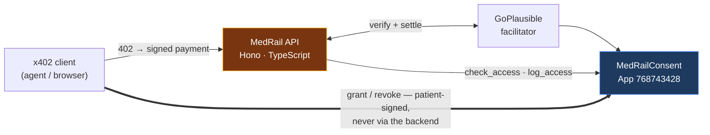

# MedRail — Executive Summary

**Purpose:** The entire project in two to three minutes — what it does, how it is built, what is
proven, and what is not.

**Status of this document:** Complete and current as of the 2026-08-21 engineering review. Every
factual claim below was independently verified against source code, executed test suites, or the
public Algorand TestNet indexer.

---

## The problem

Two gaps meet in the same place.

**Patients cannot grant verifiable consent over their own clinical data.** Consent today lives
inside whichever organisation holds the record. The patient cannot independently see who accessed
what, and cannot revoke access without asking the record-holder to do it on their behalf. Existing
mechanisms — FHIR Consent resources, SMART-on-FHIR scopes, per-organisation portals — put the
custodian in charge of enforcing the patient's wishes against the custodian's own interests.

**Autonomous agents cannot buy a single clinical API call.** Accounts, API keys, and monthly
invoices assume a human signs up. An agent that needs one drug-interaction check does not want a
commercial relationship — it wants to pay two cents and get an answer.

## The solution

MedRail makes one HTTP call do three things at once: **settle a stablecoin payment**, **check an
on-chain authorisation the patient signed with their own key**, and **append to an immutable audit
record**. That composition — not any one of its parts — is the contribution.

Three priced endpoints share one `payTo` address and one Algorand smart contract:

| Endpoint | Price | Gate |
|---|---|---|
| `POST /v1/triage` | $0.02 | x402 payment |
| `POST /v1/interaction-check` | $0.02 | x402 payment |
| `POST /v1/records/summary` | $0.05 | x402 payment **+** on-chain consent grant |

Plus five free routes: consent status, contract discovery, the ARC-56 spec, health, and a
machine-readable service index at `GET /`.

The endpoint split is deliberate and is the project's central design argument: a consent-gated-only
service cannot generate real payment volume by construction — one patient granting one clinician
access a few times a year is not usage. So two open endpoints carry the volume, and one gated
endpoint carries the ownership proof, over a shared trust layer.

## Architecture

Three deployment units — an Algorand Python smart contract, a Hono/TypeScript resource server, and
a Next.js demo — with **no database, no cache, no queue, and no message bus.** The ledger is the
only system of record. Consent state lives in Algorand box storage keyed by
`sha256(patient ‖ requester ‖ scope)`; the audit log is a per-patient append-only sequence.

The single most important architectural property: **the backend never holds or proxies a patient's
private key.** `grant_access` and `revoke_access` are constructed and signed in the patient's own
client and submitted straight to Algorand. This makes "the patient owns their consent"
structurally true rather than a policy promise.

## Key technologies

Algorand Python (`algopy` 3.5.1 / `puyapy` 5.9.0), ARC-4 ABI with ARC-56 spec, box storage ·
Hono 4.7 + TypeScript 5.7 strict on Node 20 · `@x402/{core,avm,hono}` 2.21.0, x402 protocol v2,
scheme `exact` · GoPlausible facilitator with fee sponsorship · USDC ASA `10458941` ·
Next.js 16.3 / React 19.2 · `pytest` with the official AVM simulator, and `vitest`.

## Innovation — stated precisely

**What is genuinely novel:** the composition. A single paid HTTP request that is simultaneously a
settled payment, an on-chain authorisation decision, and an audit append, callable by an
*off-the-shelf* x402 client that knows nothing about MedRail. Achieving that last property drove a
real, documented architectural decision — the audit write is a follow-up transaction rather than a
leg in the client's signed payment group, precisely so generic clients remain compatible.

**What is not novel, and is not claimed to be:** x402 is a protocol the project consumes, not one
it invented. Algorand box storage is standard. On-chain consent registries are a known pattern.
The rule engines are simple by design. The project's own documentation says so.

## Measurable evidence

Every item below was re-verified against `testnet-idx.algonode.cloud` during the review — not taken
from the repository's own documentation.

| Claim | Evidence |
|---|---|
| Contract live on TestNet | App **768743428**, created round 66088624, `deleted: false` |
| Consent lifecycle exercised on-chain | request → grant → revoke, three confirmed transactions with matching ARC-4 selectors |
| A real x402 payment settled | Tx `OYRQRKYA…` — `axfer`, asset `10458941`, **20000** base units (exactly $0.02 at 6 decimals), `fee: 0`, round 66091768 |
| **Deployed bytecode = this repository's source** | `contract.py` compiles reproducibly to the committed TEAL, which assembles to bytecode **byte-identical** to the deployed program — 1404 base64 chars, exact match ([`PROOF.md`](PROOF.md) §7) |
| **Consent-gated composition proven on-chain** | grant `M26NPR32…` → check `true` → paid $0.05 `5DKFUULW…` → audit `4YLKLQKK…` seq 1; `total_audit_entries` 0 → **1** ([`PROOF.md`](PROOF.md) §9) |
| Automated tests | **28** contract (AVM simulator) + **45** API = **73**, all passing (was 32) |
| Builds | API typecheck + build, web typecheck + build — all clean |

**No performance benchmark exists and none is claimed.** The only measurements taken are two single
observations: ~505 ms for a cold consent lookup (two sequential algod round-trips) and ~15 ms to
serve a warm 402.

## Security posture

**Genuinely strong:** patient keys never reach the backend; contract admin functions are gated
on-chain with `assert Txn.sender == self.admin.value` and negatively tested; no PHI touches the
ledger; secret hygiene is verified clean (no `.env` tracked by git); and the attack surface is
structurally small — no database, no templating, no shell execution, no model in the decision path,
therefore no SQL injection, no SSTI, and no prompt-injection surface.

**The critical finding is closed.** `/v1/records/summary` previously read `requesterAddress` from
the request body without binding it to whoever paid — and because `grant_access` transactions
publicly expose valid `(patient, requester)` pairs to any indexer, anyone could pay $0.05 and
impersonate an authorised requester. The payment itself is now the authentication mechanism:
`api/src/x402Payer.ts` recovers the payer from the verified `PAYMENT-SIGNATURE` header and the
route rejects unless it matches. Covered by 6 unit tests and by
`api/scripts/verify-g01-fix.ts`, which performs the impersonation against live TestNet and asserts
the 403 while confirming the legitimate call still returns 200. Tracked as **G-01**.

Rate limiting, graceful facilitator degradation, checksum validation, error-message hygiene, and
cross-language box-key parity vectors were added alongside it.

## Current maturity

**Demo Ready, approaching Beta.** Both CRITICAL findings are closed and 22 of 34 total findings
are resolved. What still separates it from Beta is operational, not architectural: nothing is
publicly hosted yet, and there is no observability.

| | |
|---|---|
| **Is** | A working, independently verifiable TestNet deployment with a real settled payment, a coherent architecture with recorded rationale, 32 passing tests, and unusually honest evidence documentation |
| **Is not** | Publicly hosted · deployed to MainNet · listed on Bazaar · load-tested · observable |

One property worth surfacing, because it is easy to miss: **no error path in MedRail can consume a
settled payment.** `@x402/hono` reaches settlement only on a sub-400 response, so a 4xx or 5xx
cancels the payment before money moves. A consent denial therefore costs the caller nothing, and a
transient chain failure on the audit write returns the record with `auditStatus: "pending"` rather
than discarding a paid request.

Two facts a reviewer should still weigh: payments to date are **self-payments** from the project's
own account (the mechanism is proven; third-party volume is not), and **nothing is publicly hosted
yet**, so the challenge's public-HTTPS-endpoint requirement remains open.

*(Three earlier concerns were closed during this review: the audit write had never executed — it
now has, five times; the consent gate did not authenticate — it now does, proven by a live attack
simulation; and CI had never run — the trigger is fixed.)*

## Honest characterisation of the "AI" endpoints

There is **no machine-learning model anywhere in this system** — no LLM, no embeddings, no vector
store, no inference. `/v1/triage` is a weighted keyword matcher over 11 red-flag groups;
`/v1/interaction-check` is a lookup against 14 curated drug pairs.

This was a deliberate safety decision with recorded rationale: an endpoint that reads as
authoritative medical advice is a genuine harm vector, and an opaque model in a clinical decision
path cannot be audited by the clinician who would have to trust it. The trade is real in both
directions — determinism, inspectability, testability, zero inference cost and no injection surface,
bought at the price of no generalisation, no synonym or negation handling, and no clinical
validation. Every response carries a non-diagnostic disclaimer, and that disclaimer is asserted by
the test suite as a correctness property.

## Roadmap

**Phase 1 — complete.** Every finding a reviewer could discover unaided has been fixed and
verified: payer binding, the on-chain audit write, denial-billing semantics, the CI trigger, the
deployment config, address validation, rate limiting, facilitator resilience, and box-key parity.
Test count went 32 → 73.

**What remains is yours:** deploy publicly (runbook prepared), re-run the proof scripts against the
public URL, and list on Bazaar.

**Phase 2 —** facilitator resilience, test coverage where the risk is, a public HTTPS deployment,
rate limiting, and minimal observability.

**Phase 3 —** make the audit box reference resilient (the only hard scaling blocker), harden the
admin key beyond a single hot mnemonic, move the audit write off the response path, and establish
a latency budget before measuring against it.

**Phase 4 —** client-side encrypted payloads with on-chain pointers, an off-chain read model over
ARC-28 events, and — only once it genuinely exists — the Orchestrator entry type.

Full detail: [`WINNING_ROADMAP.md`](WINNING_ROADMAP.md).

## Where to go next

| If you want… | Read |
|---|---|
| The pitch and a 2-minute demo | [`JUDGES.md`](JUDGES.md) |
| Every claim with a transaction ID and a reproduction command | [`PROOF.md`](PROOF.md) |
| Every weakness, with severities and fixes | [`ENGINEERING_GAP_REPORT.md`](ENGINEERING_GAP_REPORT.md) |
| The technical design and why each decision was made | [`03_Architecture/`](03_Architecture/) |
| An adversarial scoring of this submission | [`11_Hackathon/Judge_Evaluation.md`](11_Hackathon/Judge_Evaluation.md) |
| The complete index | [`README.md`](README.md) |

---

*This summary states what is proven and what is not with equal prominence. Where evidence is
missing, that is said plainly rather than omitted — including for the project's own headline
claims.*
