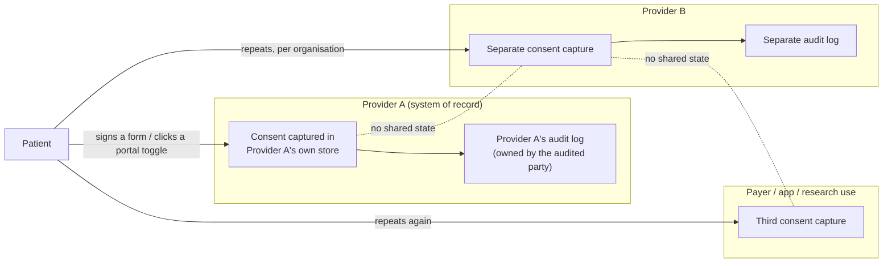

# MedRail — Problem Statement

**Purpose:** State precisely which two problems MedRail addresses, why the existing mechanisms for each are insufficient for machine-to-machine use, and — equally precisely — what this repository does *not* solve.

**Status of this document:** Authored 2026-08-21 against the verified fact ledger and the source at commit `3b387df`. Every claim about MedRail is either citation-backed (`path:line`, transaction ID) or carries a status label from the ledger's vocabulary. Claims about external standards are marked `[external — no repo evidence]` and were not re-verified as part of this work.

**Notation used in this document**

| Marker | Meaning |
|---|---|
| **IMPLEMENTED** / **VALIDATED** / **UNVALIDATED** / **PARTIALLY IMPLEMENTED** / **NOT IMPLEMENTED** / **PLANNED** / **RECOMMENDED** | Verified status labels. Definitions in the fact ledger §0. |
| `[external — no repo evidence]` | A characterisation of a standard, product category, or industry practice outside this repository. Described from its public specification. Not independently re-verified here. |
| `[REQUIRES EXTERNAL VALIDATION — no source in repo]` | A figure that would strengthen the argument but for which this repository contains no source. Deliberately left unfilled. |

---

## 1. Context

MedRail is a submission to the Algorand Foundation **Global x402 Challenge** (challenge framing per [`../COMPLIANCE.md`](../COMPLIANCE.md); not independently re-verified in this review). It is a three-part monorepo — an Algorand smart contract, an HTTP resource server, and a single-route demo web app — deployed to **Algorand TestNet only**, App ID **`768743428`**.

It exists because two problems that are normally treated separately turn out to have the same shape once the caller is a program rather than a person:

- **Problem A — consent.** A patient cannot hand a third party a permission that is simultaneously *machine-readable*, *independently verifiable*, *unilaterally revocable*, and *portable across organisations*.
- **Problem B — payment.** An autonomous software agent cannot buy a single clinical-intelligence API call without first establishing a human-mediated commercial relationship.

Both reduce to the same missing primitive: **a per-request, self-contained, verifiable authorisation-and-settlement event that neither party has to pre-register for.** MedRail's thesis is that these can be collapsed into one HTTP request.

This is a **hackathon-scale demonstration of that mechanism**, not a deployed health system. There is no real patient data anywhere in this repository (`api/src/routes/records.ts:14-21` returns one fixed synthetic constant regardless of `patientId`; disclosed in [`../SECURITY.md`](../SECURITY.md) §"There is no real patient data in this system"). Read §7 before drawing any conclusion about clinical deployability.

---

## 2. Problem A — patient consent is not a machine-readable, verifiable artefact

### 2.1 Who is affected

| Affected party | What they need and cannot get today |
|---|---|
| **Patient** | One place to see and revoke every standing permission over their record, effective everywhere at once, without contacting each holder of the data. |
| **Requesting clinician or care application** | A cheap, low-latency, authoritative answer to "am I allowed to read this, right now?" that does not depend on a bilateral integration with whichever organisation happens to hold the record. |
| **Data custodian / operator** | Defensible evidence of *who* accessed *what*, *when*, and *under which authorisation* — evidence the custodian itself cannot silently edit after the fact. |
| **Auditor / regulator** | An access trail whose integrity does not rest on trusting the audited party's own database. |

Detailed goals, proficiencies, and current gaps per persona are in [`./User_Personas.md`](./User_Personas.md).

### 2.2 The current workflow



*Current-state diagram. This depicts the situation MedRail responds to; it is **not** a diagram of MedRail. `[external — no repo evidence]`*

Consequences, each of which follows directly from the diagram rather than from any statistic:

1. **Consent is a per-organisation record.** Revocation at Provider A has no effect at Provider B. There is no single object whose state both can read.
2. **The audit trail is held by the party being audited.** Its integrity is a matter of trusting that party's operational controls.
3. **Verification requires a bilateral integration.** "Is this requester allowed?" is answerable only by the custodian, over an interface negotiated in advance between two named organisations.
4. **Revocation is a request, not an act.** The patient asks; the organisation performs. The patient cannot observe completion.

### 2.3 Pain points, and which are addressed here

| # | Pain point | Addressed in this build? | Requirement | Evidence |
|---|---|---|---|---|
| A-1 | Consent state is not readable by an uninvolved third party | **Yes** | FR-013, FR-023 | `contract.py:197-209`; `api/src/routes/consent.ts:19-31` |
| A-2 | Revocation is mediated by the custodian | **Yes** | FR-020, SEC-003 | `contract.py:178-195`; tx `OV2J2T5VWMIQG64JYGL7JEGZKKNZNKCMNIQU6AC4PDRQYZ6ZOO5A` |
| A-3 | The patient must trust the custodian to hold their key | **Yes** | NFR-008, FR-035 | `web/lib/consent.ts:44-89` signs client-side; no key-ingress path exists in `api/src` |
| A-4 | The audit trail is mutable by its owner | **Yes — mechanism proven on-chain** | FR-025, DATA-002 | `contract.py:217-236`; **VALIDATED on-chain**: first entry at tx `4YLKLQKKWXXFW3UT5APJVYKXI7T7A6OACTAWCC5YBAN3XGOGHRVQ` sequence 1, `total_audit_entries = 5` on App `768743428` ([`../PROOF.md`](../PROOF.md) §9) |
| A-5 | Each new requester requires the patient's counterparty to opt in first | **Yes** | DATA-001 | Box-keyed by `sha256(patient‖requester‖scope)` — `contract.py:95-98`; rationale at `contract.py:11-17` |
| A-6 | The access decision must attribute the *actual* accessor | **Yes** | SEC-007, SEC-008, FR-039 **VALIDATED** | `api/src/x402Payer.ts` recovers the address that signed the payment; `api/src/routes/records.ts:41-51` returns 403 unless it equals the asserted `requesterAddress`. Verified live by `api/scripts/verify-g01-fix.ts` |
| A-7 | Records themselves need protection, not just the permission over them | **No** | DATA-006 **PLANNED** | No encryption pipeline exists; the payload is a constant (`records.ts:17-23`) |

**A-6 was the load-bearing failure, and it is the one worth understanding.** MedRail checked a real on-chain grant against an identity the caller asserted about itself, so any paying stranger could name an authorised requester and be admitted — and the resulting audit entry would have recorded a *false attribution* in a log whose entire value is that it cannot be rewritten. The fix is available only because of the shape of the problem: a system with no accounts and no API keys nonetheless receives a **signed Algorand transaction** with every paid request, and a signature is an identity assertion. Recovering the payer from the `PAYMENT-SIGNATURE` header turns the paywall into an authorisation check without introducing any account system at all. See [`./Use_Cases.md`](./Use_Cases.md) UC-011 for the abuse case and the live verification that rejects it.

---

## 3. Problem B — an agent cannot buy one API call

### 3.1 Who is affected

An autonomous agent, or the developer integrating one, that needs a single clinical-intelligence result — a red-flag triage score, an interaction check — and has no prior relationship with the provider.

### 3.2 The current workflow

The prevailing commercial model for clinical reference APIs `[external — no repo evidence]`:

```
discover vendor → contact sales → negotiate contract → sign → receive credentials
→ provision an API key → embed the key in the caller → consume against a quota
→ receive an invoice on a billing cycle → reconcile
```

Every step before "consume" is human, organisational, and measured in business days. Every step after it presumes a durable account.

### 3.3 Why that model does not fit an agent caller

| # | Property of the API-key + invoice model | Why an agent cannot satisfy it |
|---|---|---|
| B-1 | Requires a legal counterparty to contract with | An ephemeral agent has no legal identity to sign with. |
| B-2 | Requires a long-lived shared secret | A key must be provisioned, stored, rotated, and revoked out-of-band. A one-shot caller has nowhere to keep it. |
| B-3 | Bills on a cycle, not per call | The agent cannot know its own marginal cost at call time, so it cannot budget or bid. |
| B-4 | Onboarding latency is human-scale | An agent that discovers a need at runtime cannot wait for procurement. |
| B-5 | Minimum commitments and tiers | Pricing is designed around predictable human-organisation volume, not one-off machine demand. `[REQUIRES EXTERNAL VALIDATION — no source in repo]` |
| B-6 | Identity is the account, not the payment | Access is granted to whoever holds the key, decoupled from whoever pays. |

### 3.4 What MedRail demonstrates against Problem B

Two endpoints — `POST /v1/triage` and `POST /v1/interaction-check`, `$0.02` each — that require **no account, no API key, and no prior relationship**. An unpaid call returns `402 Payment Required` with a machine-readable `PAYMENT-REQUIRED` header describing exactly what to pay and where; the caller signs a USDC transfer and resends; the resource server settles it through the facilitator and returns the result in the same logical round trip.

- **VALIDATED** — the 402 challenge (FR-001, FR-002), asserted by `api/test/x402-flow.spec.ts`; live capture in ledger §4.
- **VALIDATED** — a real settlement (FR-003): tx `OYRQRKYA7WUKBVLWTOFJSJMZFBW7VCNGP5VGH5EBUJGRCVFQFJRQ`, `axfer` of **20000** base units of ASA `10458941` (TestNet USDC), round 66091768, `fee: 0` (facilitator-sponsored).
- **Honest qualification:** every settled payment on record is a self-payment — sender and receiver are the same account (`2WDV2J2FTWF535SMSUVEBOF5IGXF2OTV7ZZTLTCRBXPVS32UMLOPTI64GE`), disclosed in [`../PROOF.md`](../PROOF.md) §6. This is a proof that the *mechanism* settles. It is not payment volume and must never be described as such.

Because the facilitator supplies `extra.feePayer`, a caller needs USDC but not ALGO — the network fee is sponsored (ledger §4). That materially lowers what a first-time agent caller must hold, and it is the facilitator's feature, not MedRail's.

---

## 4. Why the existing approaches are insufficient — mechanism by mechanism

Full comparison with capability/limitation/deployment columns is in [`./Competitive_Analysis.md`](./Competitive_Analysis.md). The condensed argument:

| Approach | What it does well | Why it is insufficient for a machine-to-machine agent economy |
|---|---|---|
| **HL7 FHIR `Consent` resource** `[external — no repo evidence]` | A rich, standardised, expressive data model for recording a consent directive, including scope, period, and provisions. | It is a *representation*, not an *enforcement point* and not a *shared state machine*. The resource lives inside whichever server holds it; two organisations hold two copies with no protocol for agreeing which is current. Revocation propagates only as far as replication does. Verification still requires an authenticated session with that particular server. |
| **OAuth 2.0 / SMART-on-FHIR scopes** `[external — no repo evidence]` | A genuinely good machine-to-machine authorisation mechanism: scoped, short-lived, cryptographically verifiable bearer tokens with a defined issuance flow. | The authority is the **authorisation server**, which is operated by the data-holding organisation. The patient's permission is an input to that server's policy, not an object the patient controls. Registration is required before a client may request anything; a stranger's agent cannot participate. There is no cross-organisation revocation: revoking at issuer A says nothing at issuer B. And the token proves *the client*, not *the patient's current intent* — the two can diverge silently between issuance and use. |
| **Per-organisation patient portals** `[external — no repo evidence]` | Direct, human-legible patient control within one organisation, usually with an access history view. | N organisations means N portals, N consent states, N audit logs, and no shared vocabulary. Not machine-callable. The audit history is rendered by the party being audited. |
| **API key + monthly invoice clinical APIs** `[external — no repo evidence]` | Predictable for a human-operated integration with steady volume; simple to implement; supports rich entitlement models. | Fails B-1 through B-6 above. The fundamental mismatch: the unit of commerce is an *account*, but the unit of demand for an agent is a *call*. |
| **Blockchain health-record projects, as a category** `[external — no repo evidence]` | Establish shared, tamper-evident state across organisational boundaries without a central custodian. | As a category they address the consent/audit half but not the settlement half — access remains free-at-the-point-of-use, so there is no metering, no abuse cost, and no revenue mechanism attached to the same act. Whether any specific project also settles payment in the same call is `[unverified]` here. |

**The gap none of them closes:** a single HTTP interaction in which payment settlement, authorisation evaluation, and audit inscription are the *same event*, requiring no pre-registration from either side. That is the composition MedRail is a demonstration of — and the honest statement of its current standing is in [`./USP_Novelty.md`](./USP_Novelty.md), which records all three legs as proven on TestNet and the adoption as entirely unproven.

---

## 5. Restatement of the problem, in a form the build can be judged against

> Given (a) a patient who wants to grant, observe, and withdraw a specific permission over their record without depending on any single organisation, and (b) an unaffiliated software agent that wants exactly one clinical-intelligence result and holds no account, no key, and no contract — **is there a single HTTP call that can settle payment, evaluate the patient's current authorisation, and inscribe the access into a trail neither party can rewrite?**

MedRail's answer, stated with its current status:

| Leg of the composition | Mechanism | Status |
|---|---|---|
| 1. Settled payment | x402 v2, scheme `exact`, GoPlausible facilitator, USDC ASA `10458941` | **VALIDATED** — settled transactions on TestNet, all self-payments (FR-003) |
| 2. Authorisation evaluation | `MedRailConsent.check_access` via `simulate()` — zero fee, nothing submitted — behind a payer-identity binding | **VALIDATED** (SEC-006, SEC-007, SEC-008, FR-039); the read itself is **IMPLEMENTED** (FR-013, SEC-009) |
| 3. Audit inscription | `MedRailConsent.log_access`, admin-gated, per-patient append-only sequence | **VALIDATED on-chain** (FR-025) — `total_audit_entries = 5`, first entry at tx `4YLKLQKK…` |

All three legs have been exercised on live infrastructure, in a single repeatable call (`api/scripts/e2e-consent-proof.ts`). What has *not* been exercised is anything resembling adoption: every payment is a self-payment, nothing is publicly hosted, and there is no MainNet deployment or Bazaar listing. Any evaluation of this submission should start by separating those two facts.

---

## 6. Constraints that shaped the problem framing

Full treatment in [`./Scope.md`](./Scope.md). The three that most change what "solving the problem" could mean here:

1. **No real PHI, by construction.** The record payload is a constant (DATA-004). This removes the entire class of problems around encryption, key escrow, minimum-necessary disclosure, and breach handling — and therefore removes them from what this build can claim to have solved.
2. **TestNet only.** Every transaction cited is play money on a network whose genesis hash is `SGO1GKSzyE7IEPItTxCByw9x8FmnrCDexi9/cOUJOiI=`. No MainNet deployment of `MedRailConsent` exists.
3. **Hackathon timeline, one operator key.** `OPERATOR_MNEMONIC` is a single hot key in an environment variable that is simultaneously the contract admin (SEC-012 **NOT IMPLEMENTED**). Whoever holds it can forge audit entries, rotate `set_admin`, and drain the app account. This is acknowledged in [`../SECURITY.md`](../SECURITY.md) and remains unmitigated.

---

## 7. What this project does **not** solve

Stated plainly, because a hostile reviewer will find each of these anyway and it is cheaper to concede them than to be caught by them.

| # | Not solved | Why not / current state |
|---|---|---|
| N-1 | **Real-world identity behind an address.** | The payer *is* now authenticated — `api/src/x402Payer.ts` recovers the address that signed the payment and `records.ts:41-51` rejects any mismatch with the asserted `requesterAddress` (FR-039 / SEC-007 / SEC-008 **VALIDATED**). What that proves is control of a keypair, nothing more. Nothing verifies that the holder of an address is a licensed clinician, an authorised care application, or the person the record concerns. See also N-9. |
| N-2 | **Adoption of the proven mechanism.** | The audit mechanism itself now works on real infrastructure: `total_audit_entries = 5` on App `768743428`, first entry at tx `4YLKLQKK…`, with `s`- and `a`-prefixed boxes present and the MBR arithmetic reconciling exactly (FR-025 **VALIDATED on-chain**). But every one of those entries, and every settled payment, was generated by this project's own scripts against its own accounts. Nothing is publicly hosted, there is no MainNet deployment, and there is no Bazaar listing. |
| N-3 | **Storing, encrypting, or transmitting real health records.** | One synthetic constant, patient-independent. No datastore of any kind exists in this repository. DATA-006 **PLANNED**. |
| N-4 | **Clinical validity of the intelligence endpoints.** | Two deterministic rule engines: 11 hard-coded keyword groups (`api/src/services/triageScorer.ts:32-44`) and 14 curated interaction pairs (`api/src/data/interactions.json`). **There is no LLM, no ML model, no embeddings, and no vector store anywhere in this repository.** No sensitivity, specificity, or coverage has been measured against any labelled dataset — AI-005 **NOT IMPLEMENTED**, and no such claim is made. Matching is unanchored bidirectional substring containment (`interactionChecker.ts:42-43`), so short or malformed medication names can produce false positives — AI-006 **NOT IMPLEMENTED**. |
| N-5 | **Regulatory compliance of any kind.** | No HIPAA, GDPR, SOC 2, or ISO work has been done, claimed, or certified. There is no PHI to protect, so the question has not arisen. Any privacy design in [`../SECURITY.md`](../SECURITY.md) describes what a production version *would* require and is **RECOMMENDED**, not implemented. |
| N-6 | **Production operability.** | Structured JSON error logs with generated request IDs now exist (`api/src/app.ts:113-139`), and the free and refundable surface is rate-limited (`api/src/rateLimit.ts`; SEC-013 **IMPLEMENTED**). Everything above that is still absent: **no metrics, no tracing, no alerting, no dashboards** — nothing consumes the logs (OPS-003…OPS-005 **NOT IMPLEMENTED**). No RPO/RTO has been defined (OPS-008). |
| N-7 | **Availability under dependency failure.** | A facilitator outage is now classified rather than opaque: priced routes return **503 with `Retry-After: 30`** and `{"error":{"code":"PAYMENT_FACILITATOR_UNAVAILABLE","retryable":true}}` (`api/src/app.ts:73-105`; REL-001 **IMPLEMENTED**), and free routes stay up (REL-005 **VALIDATED**). The dependency itself is unchanged — the 402 cannot be constructed without the facilitator's `/supported` — and there is still no timeout, retry, or circuit breaker on any outbound call (REL-003 **NOT IMPLEMENTED**). |
| N-8 | *(Withdrawn — the finding was wrong.)* | An earlier review recorded a lost-settled-payment defect on the `/v1/records/summary` success path. It does not exist and never did: `@x402/hono` reaches `processSettlement` only when the handler returns a status below 400, and cancels the payment on any throw or any 4xx/5xx. **No error path in MedRail can consume a settled payment.** REL-002 **VALIDATED — satisfied structurally by the SDK**, and credited to x402 v2 rather than to MedRail. The real exposure was the *sale*, not the caller's money, and `logAccess` is now wrapped in `try/catch` (`records.ts:83-99`) so a chain failure returns 200 with `auditStatus: "pending"` instead of an error. |
| N-9 | **Identity, in any sense beyond a keypair.** | An Algorand address is the only identity primitive. The payer binding proves the caller controls the address the patient granted (N-1) — it says nothing about who or what that address belongs to. There is no notion of a real-world patient, clinician, organisation, credential, or licence. |
| N-10 | **Cross-organisation adoption.** | Nothing here is deployed publicly, listed on Bazaar, or integrated with any external system. The single-writer audit design (`withPatientLock`, `api/src/services/algorand.ts:129-138`) is in-process only and does not survive horizontal scaling; `api/fly.toml` now sets `max_machines_running = 1` to match, which makes the constraint explicit rather than removing it (G-11; REL-004 **PARTIALLY IMPLEMENTED**). |
| N-11 | **The "Sentinel Exchange" pharma supply-chain system.** | `docs/SENTINEL_ARCHITECTURE.md` (647 lines, untracked) describes a **different, entirely unbuilt product**. No `engine/`, no `sim/`, no SQLite, no forecasting model, no second contract, no additional frontend routes exist. It is a **PLANNED** proposal for a different project and must not be read as part of this submission. |
| N-12 | **Market sizing, adoption, or unit economics.** | `[REQUIRES EXTERNAL VALIDATION — no source in repo]`. No market, adoption, cost, or willingness-to-pay figure exists in this repository, and none is asserted anywhere in this document set. |

---

## 8. Where to go next

| Question | Document |
|---|---|
| What is this trying to become, and how would we know it got there? | [`./Project_Vision.md`](./Project_Vision.md) |
| Who touches which endpoint, and what is missing for them? | [`./User_Personas.md`](./User_Personas.md) |
| What does the end-to-end flow actually look like? | [`./User_Journey.md`](./User_Journey.md) |
| What exactly must the system do, formally? | [`./Use_Cases.md`](./Use_Cases.md) |
| What is in and out of the boundary? | [`./Scope.md`](./Scope.md) |
| How does this compare to what already exists? | [`./Competitive_Analysis.md`](./Competitive_Analysis.md) |
| What here is actually new, and what isn't? | [`./USP_Novelty.md`](./USP_Novelty.md) |
| The raw evidence trail | [`../PROOF.md`](../PROOF.md) |
