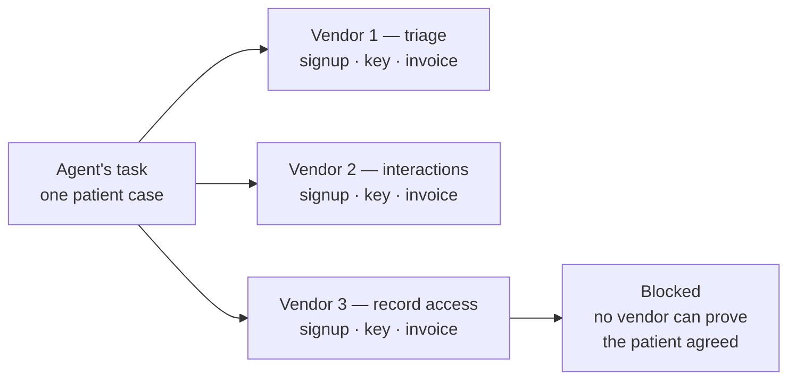
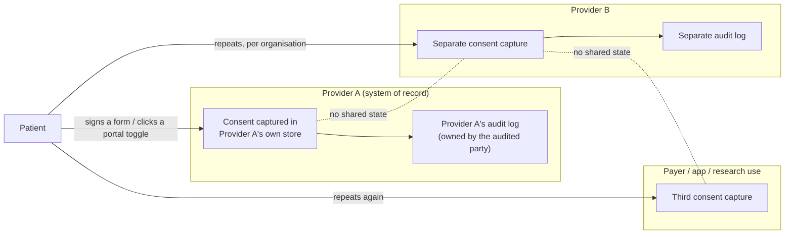

# MedRail — Problem Statement

**Purpose:** State precisely which problem MedRail addresses — an autonomous agent that cannot buy a multi-service clinical task — why the existing mechanisms are insufficient for machine-to-machine use, and — equally precisely — what this repository does *not* solve.

**Status of this document:** Authored 2026-08-21 against the verified fact ledger and the source at commit `3b387df`, and restructured to lead with the agent problem once `api/scripts/agent-demo.ts` had been run against live TestNet. Every claim about MedRail is either citation-backed (`path:line`, transaction ID) or carries a status label from the ledger's vocabulary. Claims about external standards are marked `[external — no repo evidence]` and were not re-verified as part of this work.

**Notation used in this document**

| Marker | Meaning |
|---|---|
| **IMPLEMENTED** / **VALIDATED** / **UNVALIDATED** / **PARTIALLY IMPLEMENTED** / **NOT IMPLEMENTED** / **PLANNED** / **RECOMMENDED** | Verified status labels. Definitions in the fact ledger §0. |
| `[external — no repo evidence]` | A characterisation of a standard, product category, or industry practice outside this repository. Described from its public specification. Not independently re-verified here. |
| `[REQUIRES EXTERNAL VALIDATION — no source in repo]` | A figure that would strengthen the argument but for which this repository contains no source. Deliberately left unfilled. |

---

## 1. Context

MedRail is a submission to the Algorand Foundation **Global x402 Challenge** (challenge framing per [`../COMPLIANCE.md`](../COMPLIANCE.md); not independently re-verified in this review). It is a three-part monorepo — an Algorand smart contract, an HTTP resource server, and a single-route demo web app — deployed to **Algorand TestNet only**, App ID **`768743428`**.

The challenge's own framing is the one this document is written against: **x402 is a machine-to-machine protocol, not a human-to-machine one.** The question is therefore not "what could be sold?" but *what service would an AI agent need, and can it be built so the agent can discover it, use it, and pay for it through x402?* MedRail starts from one concrete agent task and works backwards from it.

> An AI agent triaging a patient case needs three things: **symptom triage**, a **drug-interaction check**, and the **patient's record**. Today that is three vendor signups, three API keys, three billing relationships — and even then the agent cannot legally touch the record, because nobody can prove the patient allowed it. MedRail sells all three **per call over x402**, settled in USDC on Algorand. The record endpoint adds what no API key can give: it is gated by a consent grant **the patient signed with their own key on-chain**, and every access writes an immutable entry to that patient's audit trail.

That one task decomposes into a primary problem and an enabling constraint. They are normally treated as separate fields, and they turn out to have the same shape once the caller is a program rather than a person:

- **The primary problem — the agent cannot buy the task.** An autonomous caller that discovers a need at runtime cannot establish three commercial relationships to satisfy it. Detailed in §2, pain points indexed `B-…`.
- **The enabling constraint — consent is not a machine-readable, verifiable artefact.** This is not a second product bolted on. It is the reason the *third* of those three services can exist at all: an agent that has paid for a record still has no way to prove it was allowed to read one, and no vendor can sell it that proof. Detailed in §3, pain points indexed `A-…`.

Both reduce to the same missing primitive: **a per-request, self-contained, verifiable authorisation-and-settlement event that neither party has to pre-register for.** MedRail's thesis is that these can be collapsed into one HTTP request.

*(The `A-…` and `B-…` pain-point prefixes are carried over unchanged from the previous revision of this document, so its internal cross-references still resolve. The section ordering has changed to put the agent first; the identifiers have not.)*

This is a **hackathon-scale demonstration of that mechanism**, not a deployed health system. There is no real patient data anywhere in this repository (`api/src/routes/records.ts:14-21` returns one fixed synthetic constant regardless of `patientId`; disclosed in [`../SECURITY.md`](../SECURITY.md) §"There is no real patient data in this system"). Read §7 before drawing any conclusion about clinical deployability.

---

## 2. The primary problem — an agent cannot buy the task

### 2.1 The task, stated concretely

A clinical triage agent is handed one case: *sudden crushing chest pain and shortness of breath since this morning; the patient is on warfarin and aspirin 81mg.* To produce a defensible assessment it needs three things it does not have.

| # | What the agent needs | Why the task fails without it |
|---|---|---|
| 1 | An urgency score for the presentation | Without it the agent cannot rank this case against the others in its queue. |
| 2 | An interaction check over the medication list | An anticoagulant plus an antiplatelet materially changes the management of a suspected cardiac event. |
| 3 | The patient's record — allergies, comorbidities, current medications | Without it the assessment is made blind to a penicillin allergy and a diabetes diagnosis. |

Three services. Under the prevailing commercial model, three vendors — and the third one cannot be bought on those terms at all (§3).

### 2.2 Who is affected

An autonomous agent, or the developer integrating one, that needs these results at runtime and has no prior relationship with any provider. Concretely: another challenge entrant's orchestrator, a triage bot, a script. This is persona **P-1**; goals, proficiencies, and remaining gaps are in [`./User_Personas.md`](./User_Personas.md).

The parties in §3.1 — patient, custodian, auditor — are affected too, but *downstream*: they become reachable only once the agent has a way to buy access at all.

### 2.3 The current workflow

The prevailing commercial model for clinical reference APIs `[external — no repo evidence]`, run once per service:

```
discover vendor → contact sales → negotiate contract → sign → receive credentials
→ provision an API key → embed the key in the caller → consume against a quota
→ receive an invoice on a billing cycle → reconcile
```



*Current-state diagram. This depicts the situation MedRail responds to; it is **not** a diagram of MedRail. `[external — no repo evidence]`*

Every step before "consume" is human, organisational, and measured in business days. Every step after it presumes a durable account. The agent runs that pipeline three times — and then discovers that the third leg terminates in a wall, because an API key entitles whoever *holds* it, and nothing in a key says the *patient* agreed.

### 2.4 Why the API-key + invoice model does not fit an agent caller

| # | Property of the API-key + invoice model | Why an agent cannot satisfy it |
|---|---|---|
| B-1 | Requires a legal counterparty to contract with | An ephemeral agent has no legal identity to sign with. |
| B-2 | Requires a long-lived shared secret | A key must be provisioned, stored, rotated, and revoked out-of-band. A one-shot caller has nowhere to keep it. |
| B-3 | Bills on a cycle, not per call | The agent cannot know its own marginal cost at call time, so it cannot budget or bid. |
| B-4 | Onboarding latency is human-scale | An agent that discovers a need at runtime cannot wait for procurement. |
| B-5 | Minimum commitments and tiers | Pricing is designed around predictable human-organisation volume, not one-off machine demand. `[REQUIRES EXTERNAL VALIDATION — no source in repo]` |
| B-6 | Identity is the account, not the payment | Access is granted to whoever holds the key, decoupled from whoever pays. |

B-6 is the one that reaches into §3. An account model cannot express "this specific caller, right now, with this patient's live permission", because the account was provisioned once and the permission changes independently of it.

### 2.5 What MedRail demonstrates against this problem

Three endpoints, one protocol, **no account, no API key, and no prior relationship** with any of them:

| Endpoint | Price | Gate | Serves |
|---|---|---|---|
| `POST /v1/triage` | $0.02 | x402 only | Need 1 |
| `POST /v1/interaction-check` | $0.02 | x402 only | Need 2 |
| `POST /v1/records/summary` | $0.05 | x402 **and** on-chain consent | Need 3 |

An unpaid call returns `402 Payment Required` with a machine-readable `PAYMENT-REQUIRED` header describing exactly what to pay and where; the caller signs a USDC transfer and resends; the resource server settles it through the facilitator and returns the result in the same logical round trip. `GET /` is a free, machine-readable service index: all eight routes with `method`, `path`, `price` and `gate`, plus the consent contract's App ID, its CAIP-2 network, and the URL of its ARC-56 spec (`api/src/app.ts:149-177`, asserted against the mounted route set by `api/test/app.spec.ts`). An agent needs one URL; everything else it can read.

- **VALIDATED** — the 402 challenge (FR-001, FR-002), asserted by `api/test/x402-flow.spec.ts`; live capture in ledger §4.
- **VALIDATED** — a real settlement (FR-003): tx `OYRQRKYA7WUKBVLWTOFJSJMZFBW7VCNGP5VGH5EBUJGRCVFQFJRQ`, `axfer` of **20000** base units of ASA `10458941` (TestNet USDC), round 66091768, `fee: 0` (facilitator-sponsored).

Because the facilitator supplies `extra.feePayer`, a caller needs USDC but not ALGO — the network fee is sponsored (ledger §4). That materially lowers what a first-time agent caller must hold, and it is the facilitator's feature, not MedRail's.

### 2.6 The task in §2.1, executed by an agent, end to end

`api/scripts/agent-demo.ts` is the argument above run rather than asserted. It is an autonomous caller with **no prior knowledge of MedRail** — nothing about the service is hard-coded in it except the base URL — and it walks the whole task:

| # | What the agent does | Cost |
|---|---|---|
| 1 | **Discovers** the service from `GET /`: 8 endpoints, their prices, which are gated, the consent contract's App ID `768743428`, and the ARC-56 spec URL it would need to build its own ABI client against that contract | free |
| 2 | Selects and pays for triage → `band=EMERGENCY`, `score=70`, flags *possible cardiac chest pain · respiratory distress* | $0.02 |
| 3 | Pays for the interaction check → `MAJOR: warfarin + aspirin` | $0.02 |
| 4 | **Checks the free consent oracle before spending on the gated endpoint** — `GET /v1/consent/status` → `granted=true` | $0.00 |
| 5 | Pays for the record summary → `consentVerifiedOnChain: true`, `auditStatus: recorded` | $0.05 |
| 6 | Synthesises one assessment and reports exactly what it spent | — |

**$0.09 total, across 3 settled Algorand transactions. Zero accounts created, zero API keys issued, zero invoices.** The agent pays from **its own keypair, `UYBTLPHS6APCXVBDPASQMUIQCEORDIR6EMTVMNSDPSVRSR5HEPKQ5GO4YQ`, which this service does not control**, to the `payTo` address `2WDV2J2F…` — so sender ≠ receiver, re-verified against the public indexer:

| Leg | Transaction | Amount | Round |
|---|---|---|---|
| $0.02 triage | `DOSKCNKJRXIMY2UDSDZ377LKPZQIZJW5JHCGUAGKOYV6KUCFYKIA` | 20000 µUSDC, `fee: 0` | 66563930 |
| $0.02 interactions | `PLBFDDADW576IUCH62HGGYI4AJQNO3QXSENNDIBKAORWVMP7NVHQ` | 20000 µUSDC | — |
| $0.05 record | `COMJ3TQOGTKP6LXDJS7HZY7B45QZJQWXXJ23HQ3IDDQYD7GRK36A` | 50000 µUSDC, `fee: 0` | 66563944 |
| the grant that made leg 3 legal | `IG4XEBTMRCKI724ZVHSYUN4ECTYBXAGZM5N35NP4Y3ZVWECG7WUQ` | `grant_access(UYBTLPHS…, "records:summary")` on App `768743428`, signed by the patient `56LFG5EE…` | 66563915 |

The first run of the same script was self-paid (`POAQNSOP…`, `W3Z55BZY…`, `5CO5XV7M…`, audit entry `5HYV5B2L…`), and two runs after it paid from the agent's own key while the service still stood in as the patient. All are retained rather than deleted, because a proof log that quietly replaces its own weaker evidence stops being checkable ([`../PROOF.md`](../PROOF.md) §10).

**Step 4 is the step worth pausing on.** The consent oracle is free precisely so that an agent can discover whether it is permitted *before* it pays. If the grant is not active, the agent declines the gated call, spends nothing, and reports what it has (`agent-demo.ts`, the `if (!status.granted)` branch). An agent that reasons about cost is a different thing from a script that retries — and the free/priced split in §2.5 is what makes that reasoning possible.

**Honest qualification, stated precisely because the details matter.** Three things are true at once here and they are easy to blur:

1. **The payer is genuinely independent.** The agent holds its own keypair; the service does not have it. `check_access` therefore evaluates a grant the patient made to a *different* address, and the payer binding (§3.3, A-6) is load-bearing rather than decorative.
2. **So is the patient.** The grant is signed by `56LFG5EE…`, an account created by `api/scripts/provision-patient-wallet.ts` that is neither the payer nor the payee — so the run is **three separate accounts with three separate keypairs**, not three roles rehearsed by fewer. The rejection half of the same property — a mismatched payer turned away while a matched control is admitted — is proven separately by `api/scripts/verify-g01-fix.ts`.
3. **The money is still ours.** The agent's TestNet USDC float was seeded from the project's own wallet, and the patient wallet was funded the same way, because TestNet ALGO and USDC have no other practical source. **No external or unrelated party has paid for this service.** Disclosed in [`../PROOF.md`](../PROOF.md) §10.

These are genuine facilitator-settled x402 payments and a genuine unassisted discovery-to-synthesis run. They are **not** payment volume and must never be described as such.

---

## 3. The enabling constraint — patient consent is not a machine-readable, verifiable artefact

The record endpoint in §2.1 is the one an API key cannot sell. This section is why.

### 3.1 Who is affected

| Affected party | What they need and cannot get today |
|---|---|
| **Patient** | One place to see and revoke every standing permission over their record, effective everywhere at once, without contacting each holder of the data. |
| **Requesting clinician or care application** | A cheap, low-latency, authoritative answer to "am I allowed to read this, right now?" that does not depend on a bilateral integration with whichever organisation happens to hold the record. |
| **Data custodian / operator** | Defensible evidence of *who* accessed *what*, *when*, and *under which authorisation* — evidence the custodian itself cannot silently edit after the fact. |
| **Auditor / regulator** | An access trail whose integrity does not rest on trusting the audited party's own database. |

These are personas **P-2**, **P-3**, **P-4** and **P-5** in [`./User_Personas.md`](./User_Personas.md), where the goals, proficiencies and current gaps of each are set out in full.

### 3.2 The current workflow



*Current-state diagram. This depicts the situation MedRail responds to; it is **not** a diagram of MedRail. `[external — no repo evidence]`*

Consequences, each of which follows directly from the diagram rather than from any statistic:

1. **Consent is a per-organisation record.** Revocation at Provider A has no effect at Provider B. There is no single object whose state both can read.
2. **The audit trail is held by the party being audited.** Its integrity is a matter of trusting that party's operational controls.
3. **Verification requires a bilateral integration.** "Is this requester allowed?" is answerable only by the custodian, over an interface negotiated in advance between two named organisations.
4. **Revocation is a request, not an act.** The patient asks; the organisation performs. The patient cannot observe completion.

### 3.3 Pain points, and which are addressed here

| # | Pain point | Addressed in this build? | Requirement | Evidence |
|---|---|---|---|---|
| A-1 | Consent state is not readable by an uninvolved third party | **Yes** | FR-013, FR-023 | `contract.py:197-209`; `api/src/routes/consent.ts:19-31` |
| A-2 | Revocation is mediated by the custodian | **Yes** | FR-020, SEC-003 | `contract.py:178-195`; tx `OV2J2T5VWMIQG64JYGL7JEGZKKNZNKCMNIQU6AC4PDRQYZ6ZOO5A` |
| A-3 | The patient must trust the custodian to hold their key | **Yes** | NFR-008, FR-035 | `web/lib/consent.ts:44-89` signs client-side; no key-ingress path exists in `api/src` |
| A-4 | The audit trail is mutable by its owner | **Yes — mechanism proven on-chain** | FR-025, DATA-002 | `contract.py:217-236`; **VALIDATED on-chain**: first entry at tx `4YLKLQKKWXXFW3UT5APJVYKXI7T7A6OACTAWCC5YBAN3XGOGHRVQ` sequence 1, `total_audit_entries = 5` on App `768743428` ([`../PROOF.md`](../PROOF.md) §9) |
| A-5 | Each new requester requires the patient's counterparty to opt in first | **Yes** | DATA-001 | Box-keyed by `sha256(patient‖requester‖scope)` — `contract.py:95-98`; rationale at `contract.py:11-17` |
| A-6 | The access decision must attribute the *actual* accessor | **Yes** | SEC-007, SEC-008, FR-039 **VALIDATED** | `api/src/x402Payer.ts` recovers the address that signed the payment; `api/src/routes/records.ts:41-51` returns 403 unless it equals the asserted `requesterAddress`. Verified live by `api/scripts/verify-g01-fix.ts` |
| A-7 | Records themselves need protection, not just the permission over them | **No** | DATA-006 **PLANNED** | No encryption pipeline exists; the payload is a constant (`records.ts:17-23`) |

**A-6 was the load-bearing failure, and it is the one worth understanding.** MedRail checked a real on-chain grant against an identity the caller asserted about itself, so any paying stranger could name an authorised requester and be admitted — and the resulting audit entry would have recorded a *false attribution* in a log whose entire value is that it cannot be rewritten. The fix is available only because of the shape of the problem: a system with no accounts and no API keys nonetheless receives a **signed Algorand transaction** with every paid request, and a signature is an identity assertion. Recovering the payer from the `PAYMENT-SIGNATURE` header turns the paywall into an authorisation check without introducing any account system at all. See [`./Use_Cases.md`](./Use_Cases.md) UC-011 for the abuse case and the live verification that rejects it.

### 3.4 Why this is the *enabling* half, not a second product

Needs 1 and 2 in §2.1 are ordinary paid compute: any vendor could sell them per call if it wanted to, and the only thing in the way is the commercial model (§2.4). Need 3 is different in kind. A vendor can sell an agent *access to a record*; it cannot sell the agent *the patient's permission*, because the permission is not the vendor's to issue and no artefact exists that the agent could carry to prove it holds one. That is why the record endpoint is the one that had to be built on a consent registry rather than on a key — and why the same registry that answers "is this caller allowed?" is also the thing that makes the third service sellable at all.

The `A-…` pain points above are therefore not a parallel track. Each one is a precondition for the third row of the table in §2.5 existing.

---

## 4. Why the existing approaches are insufficient — mechanism by mechanism

Full comparison with capability/limitation/deployment columns is in [`./Competitive_Analysis.md`](./Competitive_Analysis.md). The condensed argument, with each mechanism judged the only way that matters here — **put the agent from §2.1 in front of it and see how far it gets**:

| Approach | What it does well | Where the agent from §2.1 stops |
|---|---|---|
| **HL7 FHIR `Consent` resource** `[external — no repo evidence]` | A rich, standardised, expressive data model for recording a consent directive, including scope, period, and provisions. | The agent can *read* a `Consent` resource — from one server, after authenticating to it. It is a *representation*, not an *enforcement point* and not a *shared state machine*. Two organisations hold two copies with no protocol for agreeing which is current, so the agent has no way to ask "is this permission live?" without first choosing whose copy to believe. Revocation propagates only as far as replication does. |
| **OAuth 2.0 / SMART-on-FHIR scopes** `[external — no repo evidence]` | A genuinely good machine-to-machine authorisation mechanism: scoped, short-lived, cryptographically verifiable bearer tokens with a defined issuance flow. | The agent must be a **registered client** before it may request anything, which is B-1 and B-4 in a different costume — a stranger's agent cannot participate at all. The authority is the authorisation server, operated by the data-holding organisation, so the patient's permission is an input to someone else's policy rather than an object the patient controls. Revoking at issuer A says nothing at issuer B. And the token proves *the client*, not *the patient's current intent*; the two can diverge silently between issuance and use, and the agent cannot tell. |
| **Per-organisation patient portals** `[external — no repo evidence]` | Direct, human-legible patient control within one organisation, usually with an access history view. | Not machine-callable at all — this is the human-to-machine assumption made explicit. N organisations means N portals, N consent states, N audit logs, and no shared vocabulary. The audit history is rendered by the party being audited. |
| **API key + monthly invoice clinical APIs** `[external — no repo evidence]` | Predictable for a human-operated integration with steady volume; simple to implement; supports rich entitlement models. | Fails B-1 through B-6 above, three times over for the three-service task. The fundamental mismatch: the unit of commerce is an *account*, but the unit of demand for an agent is a *call*. And per B-6, even a successfully provisioned key cannot carry the one fact the record endpoint needs — that the patient agreed. |
| **Blockchain health-record projects, as a category** `[external — no repo evidence]` | Establish shared, tamper-evident state across organisational boundaries without a central custodian. | The agent can verify a permission but cannot *buy* the call. As a category they address the consent/audit half and not the settlement half — access remains free-at-the-point-of-use, so there is no metering, no abuse cost, and no revenue mechanism attached to the same act. Whether any specific project also settles payment in the same call is `[unverified]` here. |

**The gap none of them closes:** a single HTTP interaction in which payment settlement, authorisation evaluation, and audit inscription are the *same event*, requiring no pre-registration from either side — reachable by a caller that knew nothing about the service one request ago. That is the composition MedRail is a demonstration of, and §2.6 is a recording of a program walking it. The honest statement of its current standing is in [`./USP_Novelty.md`](./USP_Novelty.md), which records all three legs as proven on TestNet and the adoption as entirely unproven.

---

## 5. Restatement of the problem, in a form the build can be judged against

> Given an unaffiliated software agent that holds no account, no API key and no contract, and needs three clinical services — two of them ordinary paid compute, the third gated on a permission only the patient can give — **can it discover those services, decide which it needs, pay for each per call, and read the gated one under a live, patient-controlled authorisation, in a way that leaves a trail neither it nor the operator can rewrite?**

Restated as the mechanism question the build has to answer: **is there a single HTTP call that can settle payment, evaluate the patient's current authorisation, and inscribe the access into a trail neither party can rewrite?**

MedRail's answer, stated with its current status:

| Leg of the composition | Mechanism | Status |
|---|---|---|
| 0. Machine discovery | `GET /` — all eight routes with `price` and `gate`, plus App ID, CAIP-2 network and the ARC-56 spec URL; `GET /v1/consent/arc56` serves the spec itself | **VALIDATED** (FR-017) — asserted against the mounted route set by `api/test/app.spec.ts`; consumed unassisted by `api/scripts/agent-demo.ts` |
| 1. Settled payment | x402 v2, scheme `exact`, GoPlausible facilitator, USDC ASA `10458941` | **VALIDATED** — settled transactions on TestNet (FR-003). The agent run settles between **distinct accounts** (`UYBTLPHS…` → `2WDV2J2F…`, sender ≠ receiver on the indexer); earlier runs were self-payments. The agent's float was seeded from the project's own wallet either way |
| 2. Authorisation evaluation | `MedRailConsent.check_access` via `simulate()` — zero fee, nothing submitted — behind a payer-identity binding | **VALIDATED** (SEC-006, SEC-007, SEC-008, FR-039); the read itself is **IMPLEMENTED** (FR-013, SEC-009) |
| 3. Audit inscription | `MedRailConsent.log_access`, admin-gated, per-patient append-only sequence | **VALIDATED on-chain** (FR-025) — `total_audit_entries = 5`, first entry at tx `4YLKLQKK…` |

Legs 1–3 have been exercised on live infrastructure, in a single repeatable call (`api/scripts/e2e-consent-proof.ts`). Leg 0 through leg 3 have been exercised *by a program that started with only a URL*, in one run, across the whole three-service task (`api/scripts/agent-demo.ts`, §2.6). What has *not* been exercised is anything resembling adoption. Payments now move between distinct accounts, which removes an objection without adding a claim: the paying agent's TestNet USDC float was seeded from the project's own wallet, so **no external or unrelated party has paid for this service**; nothing is publicly hosted; and there is no MainNet deployment or Bazaar listing. Any evaluation of this submission should start by separating those two facts.

---

## 6. Constraints that shaped the problem framing

Full treatment in [`./Scope.md`](./Scope.md). The three that most change what "solving the problem" could mean here:

1. **No real PHI, by construction.** The record payload is a constant (DATA-004). This removes the entire class of problems around encryption, key escrow, minimum-necessary disclosure, and breach handling — and therefore removes them from what this build can claim to have solved.
2. **TestNet only.** Every transaction cited is play money on a network whose genesis hash is `SGO1GKSzyE7IEPItTxCByw9x8FmnrCDexi9/cOUJOiI=`. No MainNet deployment of `MedRailConsent` exists.
3. **Hackathon timeline, one operator key.** `OPERATOR_MNEMONIC` is a single hot key in an environment variable that is simultaneously the contract admin (SEC-012 **NOT IMPLEMENTED**). Whoever holds it can forge audit entries, rotate `set_admin`, and drain the app account. This is acknowledged in [`../SECURITY.md`](../SECURITY.md) and remains unmitigated.

---

## 7. What this project does **not** solve

Stated plainly, because a hostile reviewer will find each of these anyway and it is cheaper to concede them than to be caught by them.

| # | Not solved | Why not / current state |
|---|---|---|
| N-1 | **Real-world identity behind an address.** | The payer *is* now authenticated — `api/src/x402Payer.ts` recovers the address that signed the payment and `records.ts:41-51` rejects any mismatch with the asserted `requesterAddress` (FR-039 / SEC-007 / SEC-008 **VALIDATED**). What that proves is control of a keypair, nothing more. Nothing verifies that the holder of an address is a licensed clinician, an authorised care application, or the person the record concerns. See also N-9. |
| N-2 | **Adoption of the proven mechanism.** | The audit mechanism itself now works on real infrastructure: `total_audit_entries = 5` on App `768743428`, first entry at tx `4YLKLQKK…`, with `s`- and `a`-prefixed boxes present and the MBR arithmetic reconciling exactly (FR-025 **VALIDATED on-chain**). But every one of those entries, and every settled payment, was generated by this project's own scripts against its own accounts. Nothing is publicly hosted, there is no MainNet deployment, and there is no Bazaar listing. |
| N-3 | **Storing, encrypting, or transmitting real health records.** | One synthetic constant, patient-independent. No datastore of any kind exists in this repository. DATA-006 **PLANNED**. |
| N-4 | **Clinical validity of the intelligence endpoints.** | Two deterministic rule engines: 11 hard-coded keyword groups (`api/src/services/triageScorer.ts:32-44`) and 14 curated interaction pairs (`api/src/data/interactions.json`). **There is no LLM, no ML model, no embeddings, and no vector store anywhere in this repository.** No sensitivity, specificity, or coverage has been measured against any labelled dataset — AI-005 **NOT IMPLEMENTED**, and no such claim is made. Matching is unanchored bidirectional substring containment (`interactionChecker.ts:42-43`), so short or malformed medication names can produce false positives — AI-006 **NOT IMPLEMENTED**. |
| N-5 | **Regulatory compliance of any kind.** | No HIPAA, GDPR, SOC 2, or ISO work has been done, claimed, or certified. There is no PHI to protect, so the question has not arisen. Any privacy design in [`../SECURITY.md`](../SECURITY.md) describes what a production version *would* require and is **RECOMMENDED**, not implemented. |
| N-6 | **Production operability.** | Structured JSON error logs with generated request IDs now exist (`api/src/app.ts:113-139`), and the free and refundable surface is rate-limited (`api/src/rateLimit.ts`; SEC-013 **IMPLEMENTED**). Everything above that is still absent: **no metrics, no tracing, no alerting, no dashboards** — nothing consumes the logs (OPS-003…OPS-005 **NOT IMPLEMENTED**). No RPO/RTO has been defined (OPS-008). |
| N-7 | **Availability under dependency failure.** | A facilitator outage is now classified rather than opaque: priced routes return **503 with `Retry-After: 30`** and `{"error":{"code":"PAYMENT_FACILITATOR_UNAVAILABLE","retryable":true}}` (`api/src/app.ts:73-105`; REL-001 **IMPLEMENTED**), and free routes stay up (REL-005 **VALIDATED**). The dependency itself is unchanged — the 402 cannot be constructed without the facilitator's `/supported` — and there is still no timeout, retry, or circuit breaker on any outbound call (REL-003 **NOT IMPLEMENTED**). |
| N-8 | *(Withdrawn — the finding was wrong.)* | An earlier review recorded a lost-settled-payment defect on the `/v1/records/summary` success path. It does not exist and never did: `@x402/hono` reaches `processSettlement` only when the handler returns a status below 400, and cancels the payment on any throw or any 4xx/5xx. **No error path in MedRail can consume a settled payment.** REL-002 **VALIDATED — satisfied structurally by the SDK**, and credited to x402 v2 rather than to MedRail. The real exposure was the *sale*, not the caller's money, and `logAccess` is now wrapped in `try/catch` (`records.ts:83-99`) so a chain failure returns 200 with `auditStatus: "pending"` instead of an error. |
| N-9 | **Identity, in any sense beyond a keypair.** | An Algorand address is the only identity primitive. The payer binding proves the caller controls the address the patient granted (N-1) — it says nothing about who or what that address belongs to. There is no notion of a real-world patient, clinician, organisation, credential, or licence. |
| N-10 | **Cross-organisation adoption.** | Nothing here is deployed publicly, listed on Bazaar, or integrated with any external system. The single-writer audit design (`withPatientLock`, `api/src/services/algorand.ts:129-138`) is in-process only and does not survive horizontal scaling; `api/fly.toml` now sets `max_machines_running = 1` to match, which makes the constraint explicit rather than removing it (G-11; REL-004 **PARTIALLY IMPLEMENTED**). |
| N-11 | **The "Sentinel Exchange" pharma supply-chain system.** | `docs/SENTINEL_ARCHITECTURE.md` (647 lines, untracked) describes a **different, entirely unbuilt product**. No `engine/`, no `sim/`, no SQLite, no forecasting model, no second contract, no additional frontend routes exist. It is a **PLANNED** proposal for a different project and must not be read as part of this submission. |
| N-12 | **Market sizing, adoption, or unit economics.** | `[REQUIRES EXTERNAL VALIDATION — no source in repo]`. No market, adoption, cost, or willingness-to-pay figure exists in this repository, and none is asserted anywhere in this document set. |

---

## 8. Where to go next

| Question | Document |
|---|---|
| What is this trying to become, and how would we know it got there? | [`./Project_Vision.md`](./Project_Vision.md) |
| Who touches which endpoint, and what is missing for them? | [`./User_Personas.md`](./User_Personas.md) |
| What does the end-to-end flow actually look like? | [`./User_Journey.md`](./User_Journey.md) |
| What exactly must the system do, formally? | [`./Use_Cases.md`](./Use_Cases.md) |
| What is in and out of the boundary? | [`./Scope.md`](./Scope.md) |
| How does this compare to what already exists? | [`./Competitive_Analysis.md`](./Competitive_Analysis.md) |
| What here is actually new, and what isn't? | [`./USP_Novelty.md`](./USP_Novelty.md) |
| The raw evidence trail | [`../PROOF.md`](../PROOF.md) |
