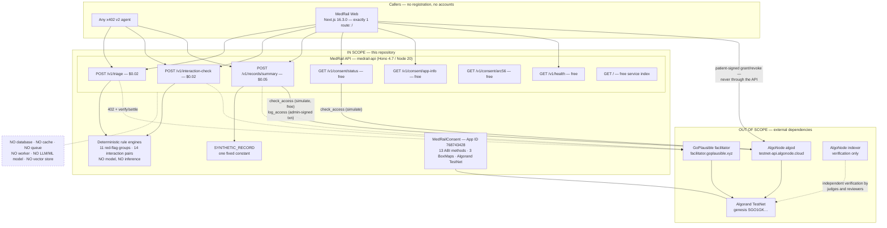

# MedRail — Scope

> **⚠ Correction notice.** Parts of this document were written against a review finding that was
> later proven wrong. Settlement in x402 v2 happens **only** on a sub-400 response, so **no error
> path in MedRail can consume a settled payment** — and consent-denied calls (HTTP 403) are **not
> charged**, contrary to `API.md`, `SECURITY.md`, and the `paidButDenied` field. The audit-sequence
> race causes a **rejected transaction**, not a corrupted log. See
> [`CORRECTIONS.md`](../CORRECTIONS.md) — it supersedes any statement here that contradicts it.

**Purpose:** Draw the boundary of this submission precisely — what is inside it, what is deliberately outside it, what it assumes, what constrains it, and exactly which external services and package versions it depends on.

**Status of this document:** Authored 2026-08-21 against the verified fact ledger and source at commit `32ffd73` (branch `master`, 2 commits). Every in-scope item carries a status label and evidence. Every dependency is named at the exact version pinned in the repository. Nothing in this document is aspirational: forward-looking items live in "Out of Scope" or are labelled **PLANNED** / **RECOMMENDED**.

---

## 1. System boundary

**Boundary facts, non-negotiable:** 3 priced endpoints · 4 free `/v1/*` endpoints plus `GET /` · 1 smart contract · 1 facilitator · 1 web route · 0 databases · 0 models.

---

## 2. In Scope

### 2.1 Smart contract — `contracts/`

| Item | Detail | Status |
|---|---|---|
| `MedRailConsent` (`ARC4Contract`) | 259 lines, Algorand Python `algopy` 3.5.1, compiled by `puyapy` 5.9.0 | **IMPLEMENTED** |
| Global state | 4 uints + 1 byteslice: `admin`, `total_requests`, `total_grants_active`, `total_revocations`, `total_audit_entries` | **IMPLEMENTED** |
| Box storage | `grants` `BoxMap(Bytes, GrantRecord)` prefix `"g"`, key `sha256(patient‖requester‖scope)`; `audit_seq` `BoxMap(Account, UInt64)` prefix `"s"`; `audit_log` `BoxMap(Bytes, AuditEntry)` prefix `"a"`, key `patient‖itob(seq)` | **IMPLEMENTED** |
| 13 ABI methods | `create`, `set_admin`, `fund_mbr`, `request_access`, `grant_access`, `revoke_access`, `check_access`*, `get_grant`*, `log_access`, `get_audit_count`*, `get_audit_entry`*, `get_grant_box_mbr`*, `withdraw_excess` (* = `readonly=True`) | **IMPLEMENTED** |
| Consent semantics | `check_access` true iff box exists **and** `status == 1` **and** (`expires_at == 0` or `latest_timestamp < expires_at`) | **VALIDATED** |
| ARC-28 events | `AccessRequested`, `AccessGranted`, `AccessRevoked` via `arc4.emit` | **PARTIALLY IMPLEMENTED** — defect C-1: `contract.py:146` emits `patient`/`requester` swapped |
| Admin gating | `assert Txn.sender == self.admin.value` on `log_access`, `set_admin`, `withdraw_excess` | **VALIDATED** — SEC-001, SEC-002 |
| Live deployment | App **768743428**, created round 66088624, `deleted: false`, app account `CCO26Y6Z…` holding 5,000,000 µALGO | **VALIDATED** |
| 14 unit tests | `contracts/tests/test_consent.py`, `algorand-python-testing` 1.1.0 AVM simulator, no network | **VALIDATED** — 14 passed, 0.41 s |
| Deploy + exercise scripts | `deploy_testnet.py` (idempotent), `exercise_contract.py`, `opt_in_usdc.py` | **IMPLEMENTED** — FR-100 |

### 2.2 Resource server — `api/`

| Item | Detail | Status |
|---|---|---|
| x402 v2 `exact` integration | `api/src/x402.ts:11-32`; only the configured CAIP-2 network is registered | **VALIDATED** (FR-001…FR-003, NFR-002) |
| 3 priced routes | `$0.02` / `$0.02` / `$0.05` = 20000 / 20000 / 50000 µUSDC, declared in one place (`api/src/app.ts:37-50`) | **VALIDATED** (FR-101) |
| 4 free `/v1/*` routes + `GET /` | status, app-info, arc56, health, service index | **IMPLEMENTED** (FR-013…FR-017) |
| Triage engine | 11 hard-coded red-flag groups, weights summed and capped at 100, 4 bands, pure function | **VALIDATED** (FR-004…FR-006) |
| Interaction engine | 14 curated pairs from `api/src/data/interactions.json`, loaded once by `readFileSync`, bidirectional substring match | **VALIDATED** (FR-007, FR-008) |
| Non-diagnostic disclaimers | Present on every intelligence response; asserted by tests | **VALIDATED** (FR-009, AI-002) |
| Chain integration | `algosdk` ATC; `simulate()` for reads (free, submits nothing), real transaction for `log_access` | **IMPLEMENTED** (SEC-009) |
| Per-patient write serialisation | `withPatientLock` — in-process promise chain (`algorand.ts:129-138`) | **PARTIALLY IMPLEMENTED** (REL-004) |
| Request validation | zod on all four route schemas | **PARTIALLY IMPLEMENTED** — length-only address validation (FR-038, SEC-010) |
| CORS | `origin: "*"`, methods `GET,POST,OPTIONS`, `allowHeaders` deliberately unset so Hono reflects the browser's preflight; documented regression note at `app.ts:25-30` | **IMPLEMENTED** (NFR-006) |
| 18 tests | 7 triage + 6 interaction + 5 x402 structural | **VALIDATED** — 18 passed, 4.08 s. **Not hermetic**: `x402-flow.spec.ts` makes a live facilitator call at module import. |
| E2E proof script | `api/scripts/e2e-proof.ts` → `contracts/artifacts/e2e-proof.json` | **IMPLEMENTED** (FR-040), not run in CI |

### 2.3 Web demo — `web/`

| Item | Detail | Status |
|---|---|---|
| Single route `/` | Next.js 16.3.0 App Router, React 19.2.8, Tailwind 4, dark theme | **IMPLEMENTED** |
| `NetworkBadge` | Polls `GET /v1/health` | **IMPLEMENTED** (FR-036) |
| `LiveDemoPanel` + `DemoWalletCard` | Endpoint picker, browser-signed paid call, balance and dispenser link | **IMPLEMENTED** (FR-033, FR-034) |
| `ConsentChecker` | Grant / revoke / check, patient-signed directly to Algorand | **IMPLEMENTED** (FR-035) |
| `PricingTable` | Static 4-row endpoint/price/gate table | **IMPLEMENTED** (FR-037) |
| Demo wallet | Browser-generated keypair; `{address, mnemonic}` as plaintext JSON in `sessionStorage` under `medrail-demo-wallet-v1`; TestNet-only and disclosed as such | **IMPLEMENTED** |
| Automated tests | **None.** No Vitest, Jest, Playwright, or Cypress configuration exists in `web/`. | **NOT IMPLEMENTED** |

### 2.4 Verification and documentation

| Item | Status |
|---|---|
| 32 automated tests (14 contract + 18 API), all passing | **VALIDATED** |
| Strict TypeScript, zero errors in both `api/` and `web/` | **VALIDATED** (NFR-005) |
| Both builds pass locally (`api` tsc/build; `web` Next 16.3.0 Turbopack, 2 static routes prerendered) | **VALIDATED** |
| CI workflow with 3 jobs (contract / api / web) | **PARTIALLY IMPLEMENTED** — triggers on `main`; the only branch is `master`, so **no push has ever triggered CI** (CI-1) |
| Evidence-linked documentation | **IMPLEMENTED** (NFR-010) — with defects DOC-1…DOC-9 outstanding |
| Dockerfiles for `api` and `web`, `api/fly.toml` | **UNVALIDATED** (NFR-007) — never built in CI; D-1…D-6 outstanding |

---

## 3. Out of Scope

### 3.1 Deliberately excluded on principle

Per [`../IMPLEMENTATION_PLAN.md`](../IMPLEMENTATION_PLAN.md) §5 — boundaries, not time savings.

| Excluded | Reason |
|---|---|
| **MainNet deployment** | Moves real money and constitutes entry into the competition under the operator's identity. The parameterised script and full runbook exist; the operator runs them. |
| **Hosting / public HTTPS endpoint** | Requires an account and possibly billing details belonging to the operator. Configs are prepared (with defects D-1, D-2 to fix first). |
| **Bazaar listing and the `x402-global-challenge` tag** | The actual competition-entry action, tied to the operator's identity. |

### 3.2 Excluded by design

| Excluded | Note |
|---|---|
| **Any database, cache, queue, or background worker** | None exists. All durable state is on Algorand; the only local state is two static files. NFR-001. |
| **Any LLM, ML model, embeddings, RAG, or vector store** | **None exists anywhere in this repository.** The "AI endpoints" are two deterministic rule engines. AI-001, NFR-009. |
| **Real patient data of any kind** | `SYNTHETIC_RECORD` is a fixed constant returned regardless of `patientId`. DATA-004. |
| **Record storage, retrieval, or encryption** | No pipeline exists. DATA-006 **PLANNED**. |
| **Clinical decision support** | Explicitly disclaimed in every response; AI-003. |
| **Orchestrator entry type** | MedRail does not pay other x402 endpoints. Explicitly not claimed. |
| **Consent grant/revoke as backend endpoints** | Deliberate: they are patient-signed transactions straight to Algorand. NFR-008. |
| **Server-side sessions, accounts, or API keys** | The whole point is that none are required. |

### 3.3 Excluded because unbuilt — and must not be presented otherwise

| Excluded | Note |
|---|---|
| **"Sentinel Exchange"** (`docs/SENTINEL_ARCHITECTURE.md`, 647 lines, untracked) | A **different, entirely unbuilt product** — pharma supply chain, FastAPI `engine/`, SQLite `data/sentinel.db`, `sim/` generators, XGBoost forecasting, contract-net auction, a second contract `SentinelProvenance`, five new frontend routes, an SSE bus, Twilio/WhatsApp notifiers. **None of it exists.** It also instructs "rewrite README around Sentinel Exchange". **RECOMMENDED:** relocate to `docs/future/SENTINEL_EXCHANGE_PROPOSAL.md` with a bold **PROPOSAL — NOT IMPLEMENTED** banner, or delete before submission. `docs/future/` exists and is empty. DOC-1, **HIGH**. |
| **Real wallet integration (Pera / Defly / WalletConnect)** | **Does not exist anywhere in `web/`.** `web/lib/demoWallet.ts:12` references `lib/walletConnect.ts`, which is absent, and `docs/IMPLEMENTATION_PLAN.md` §4 claims the path "is also implemented" — it is not. DOC-4. |
| **Bazaar discovery-extension implementation** | `@x402/extensions` is declared in `api/package.json` but **imported nowhere** in `api/src`, `api/scripts`, `web/lib`, or `web/components`. Route metadata is well-shaped; "implements the discovery extension" is not supported by code. **PARTIALLY IMPLEMENTED / unused dependency.** DOC-9. |
| **Repo-level orchestration scripts** | `scripts/` exists at the repository root and is **empty**, despite `IMPLEMENTATION_PLAN.md` §7 listing it as "repo-level orchestration (setup, smoke tests)". DOC-6. |
| **OpenAPI specification** | None exists. `docs/API.md` is hand-written. |
| **Audit-trail read surface** | `get_audit_count` / `get_audit_entry` exist on-chain and `getAuditCount` exists in the backend, but no endpoint and no UI expose either — and there is nothing to show (`total_audit_entries == 0`). |

### 3.4 Excluded as beyond a hackathon build

All **NOT IMPLEMENTED**: rate limiting (SEC-013) · authentication of any kind on free endpoints · structured logging and correlation IDs (OPS-002) · metrics (OPS-003) · distributed tracing (OPS-004) · alerting (OPS-005) · dependency vulnerability scanning (SEC-014) · SAST/CodeQL/Dependabot · coverage measurement or thresholds · load, latency, or concurrency testing (PERF-003) · security headers (HSTS/CSP/X-Content-Type-Options; `fly.toml`'s `force_https = true` is the one transport control present, SEC-016) · multisig or HSM key custody (SEC-012) · defined RPO/RTO (OPS-008) · any regulatory compliance programme.

---

## 4. Assumptions

Each is a real dependency of correctness. If one is false, the named consequence follows.

| # | Assumption | If false |
|---|---|---|
| A-1 | The GoPlausible facilitator is reachable and its `/supported` lists an Algorand payment kind. | All three priced routes return **HTTP 500** with no `PAYMENT-REQUIRED` and no `Retry-After` — the asset id and `extra.feePayer` come from `/supported`, so the 402 cannot be constructed offline (R-1). Free routes stay up (REL-005 **VALIDATED**). |
| A-2 | AlgoNode's public algod endpoint is reachable, low-latency, and unmetered, with no API key needed. | `/v1/consent/status` and `/v1/records/summary` 500. No timeout, retry, or circuit breaker exists (R-4). |
| A-3 | The facilitator's settlement verdict is authoritative. | The API does **not** independently re-verify the settled transaction against algod. This is the standard x402 trust model, correctly framed as such in [`../SECURITY.md`](../SECURITY.md) — a residual risk, not a defect. |
| A-4 | Exactly one `medrail-api` process runs against a given operator account. | `withPatientLock` is in-process only; a second instance reintroduces the audit-sequence race. `api/fly.toml` permits more than one machine (D-7). |
| A-5 | The three box-key derivations stay byte-identical. | Contract Python (`contract.py:95-98`), Node (`algorand.ts:63-79`) and browser (`web/lib/consent.ts:26-34`) each implement it independently, **with no cross-implementation test**. A change to the prefix or hash input silently breaks the other two. NFR-011 **UNVALIDATED**, severity MEDIUM. |
| A-6 | The operator/admin key is not compromised. | The holder can forge arbitrary audit entries, rotate `set_admin` to lock out the owner, and drain the app account via `withdraw_excess`. SEC-012 **NOT IMPLEMENTED**. |
| A-7 | The application account holds enough ALGO for box MBR. | `log_access` fails; on the allowed path that becomes a 500 **after** the payment settled (R-2). No monitoring exists. The advertised per-box MBR is also 400 µALGO too low (C-2). |
| A-8 | Callers pass genuine, checksum-valid Algorand addresses. | A malformed-but-58-character address yields **500** with `{"error":"wrong checksum for address"}` — a client error misreported as a server error, with the internal message leaked (R-3). |
| A-9 | Callers do not misrepresent their own identity. | **This assumption is false and exploitable.** `requesterAddress` is caller-asserted; grants are public on-chain; any paying stranger can impersonate an authorised requester (S-1, [`./Use_Cases.md`](./Use_Cases.md) UC-011). |
| A-10 | Algorand TestNet remains available and its genesis hash is stable. | The CAIP-2 network id, and therefore every 402 challenge, is invalidated. |
| A-11 | The pinned `@x402/*` 2.21.0 line remains protocol-compatible with the live facilitator. | Payments stop settling. No version-compatibility test exists. |
| A-12 | Demo users understand that the browser wallet is play money. | Stated in `web/lib/demoWallet.ts:10-12` and in the UI ("has zero real-world value"). Impact is bounded to TestNet. |

---

## 5. Constraints

### 5.1 Hackathon timeline

Two commits (`d2a5f7f`, `32ffd73`) on branch `master`. The build deliberately favours depth on a small surface over breadth — [`../IMPLEMENTATION_PLAN.md`](../IMPLEMENTATION_PLAN.md) §0: "Depth and correctness on a smaller surface beats breadth with anything faked." Direct consequences, all verified: no test for `routes/records.ts` or `services/algorand.ts` (the two highest-risk modules); no frontend tests; no load testing; no security scanning; no coverage measurement; no OpenAPI spec.

### 5.2 No real PHI — by construction

`/v1/records/summary` returns one fixed synthetic constant regardless of `patientId` (`api/src/routes/records.ts:15-21`). There is no patient datastore. This removes encryption, key escrow, minimum-necessary disclosure, and breach handling from what can be claimed — and it is why S-1 leaks nothing sensitive *in this build*, which is not a control.

### 5.3 TestNet only

Every transaction cited anywhere in this repository is on Algorand TestNet (genesis `SGO1GKSzyE7IEPItTxCByw9x8FmnrCDexi9/cOUJOiI=`), settled in TestNet USDC (ASA `10458941`). **No MainNet deployment of `MedRailConsent` exists.** Note that `api/fly.toml` nevertheless hard-codes `NETWORK = "mainnet"` (D-2, **HIGH**) — a `fly deploy` today points the service at a network where the contract does not exist, with no App ID configured (D-1).

### 5.4 Facilitator dependency

MedRail configures scheme, network, price, and `payTo`; the facilitator supplies the asset id and `extra.feePayer`. That coupling is what makes fee sponsorship work — and it is why a facilitator outage becomes an unrecoverable 500 rather than a degraded 402 (R-1), and why CI depends on a third-party service being reachable from a GitHub runner (CI-2). There is no timeout, retry, circuit breaker, or cached-`/supported` fallback.

### 5.5 Single operator key

`OPERATOR_MNEMONIC` is one hot key in an environment variable that is simultaneously the contract `admin`. It signs `log_access` **and** is required for the free, unauthenticated `/v1/consent/status`, because `simulate()` needs a sender and signer. No multisig, no HSM, no rotation policy, no rotation runbook. SEC-012 **NOT IMPLEMENTED**; acknowledged in [`../SECURITY.md`](../SECURITY.md).

### 5.6 No hosting deployed

There is no public URL. `api/Dockerfile` and `api/fly.toml` exist but have **never been built by CI** (CI-3, NFR-007 **UNVALIDATED**); `web/` has no `vercel.json` and the runbook suggests `vercel --prod`. Both Dockerfiles use `npm install` rather than `npm ci` despite committed lockfiles (D-4), and there is **no `.dockerignore` anywhere in the repository** — `api/Dockerfile`'s build context is the repository root, so `api/.env` and `contracts/.env` (both containing live mnemonics) enter the build context. Nothing `COPY`s them into a layer today, so no secret currently lands in an image, but the margin is one careless `COPY api/ ./api/` wide (D-3, D-5, SEC-015).

### 5.7 Protocol and platform constraints

| Constraint | Consequence |
|---|---|
| Algorand box MBR is `2500 + 400 * (len(key) + len(value))`, and a `BoxMap` prefix counts toward the key | The app account must fund every box. `GRANT_BOX_MBR` at `contract.py:52` omits the 1-byte `"g"` prefix and under-reports by 400 µALGO/box (C-2). |
| Every account must opt in to an ASA before receiving it | Callers must opt in to USDC `10458941` before they can pay. `contracts/scripts/opt_in_usdc.py` exists for the operator side. |
| `readonly=True` ABI methods must still be simulated with a sender and signer | The free consent endpoint depends on the operator private key. |
| A payment group may hold up to 16 transactions, but generic x402 clients construct only what `paymentRequirements` describes | `log_access` is a **follow-up** transaction rather than part of the payment's atomic group — a deliberate interoperability trade-off argued in [`../ARCHITECTURE.md`](../ARCHITECTURE.md) and [`../IMPLEMENTATION_PLAN.md`](../IMPLEMENTATION_PLAN.md) §3. Payment and audit are two real transactions moments apart, not one atomic unit. |
| `atc.execute(algod, 4)` waits 4 rounds | An audit write blocks the paid response path (PERF-004 **NOT IMPLEMENTED**) and then throws (R-4). |

### 5.8 Measurement constraint — read this before quoting any number

**No performance requirement in this system has an agreed target, a benchmark, or a measurement.** The only numbers that exist anywhere are four single observations: `GET /v1/consent/status` cold at **505 ms**; 402 generation on `/v1/triage` warm at **~15 ms**; API suite **4.08 s**; contract suite **0.41 s**. All are single samples on a developer laptop against live TestNet. **No p50/p95/p99, throughput, uptime, concurrency, or capacity figure exists**, and none may be quoted. Likewise, no market-size, adoption, accuracy, precision, recall, or cost figure exists in this repository: `[REQUIRES EXTERNAL VALIDATION — no source in repo]`.

---

## 6. Dependencies

### 6.1 External services

| Service | Endpoint | Used for | Criticality | Fallback |
|---|---|---|---|---|
| **GoPlausible facilitator** | `https://facilitator.goplausible.xyz` (`api/src/config.ts:47`, overridable via `FACILITATOR_URL`) | 402 payment-kind discovery at `initialize()`; verify + settle on every priced call; supplies the asset id and `extra.feePayer` = `ZMFK2OI7ZBD2U27ISERZC4S6LKM6WMFJPZQ4MYNJDZ2VNBNMBA67RA22AA` | **Critical** — all 3 priced routes | **None.** Outage ⇒ 500 (R-1) |
| **AlgoNode algod** | `https://testnet-api.algonode.cloud` / `https://mainnet-api.algonode.cloud` (`config.ts:21-24`) | `getTransactionParams`, `simulate()` for consent reads, submission of `log_access`; also used directly by the browser for grant/revoke | **Critical** — `/v1/consent/status`, `/v1/records/summary`, all consent transactions | **None.** No API key, no timeout, no retry, no circuit breaker (R-4) |
| **Algorand TestNet** | genesis `SGO1GKSzyE7IEPItTxCByw9x8FmnrCDexi9/cOUJOiI=`; CAIP-2 `algorand:SGO1GK…` | The ledger itself; hosts App `768743428` | **Critical** | MainNet maps exist in config (`config.ts:8-19`) but no MainNet contract is deployed |
| **AlgoNode indexer** | `https://testnet-idx.algonode.cloud` / `https://mainnet-idx.algonode.cloud` | **Verification only** — used by reviewers, judges, and explorers to confirm claims independently. `config.indexerServer` is declared at `config.ts:51` but is **not referenced by any module in `api/src`**; the running service does not call the indexer. | Non-critical at runtime; **critical to the evidence story** | Any Algorand indexer, or Lora |
| **Lora explorer** | `https://lora.algokit.io/{network}/…` (`web/lib/config.ts:7-11`) | Human-readable transaction/account/application links in the UI and docs | Cosmetic | Any explorer |
| **Lora TestNet ALGO dispenser** | `https://lora.algokit.io/testnet/fund` (`web/lib/config.ts:13`) | Funding demo wallets and the deployer with TestNet ALGO. Free email login, no wallet needed; per [`../DEPLOYMENT.md`](../DEPLOYMENT.md) every legacy unauthenticated faucet is dead. | Required for the live demo | — |
| **Circle TestNet USDC faucet** | `https://faucet.circle.com` — network must be set to "Algorand Testnet" (it defaults elsewhere); rate-limited per IP | Obtaining TestNet USDC to actually pay an endpoint | Required to reproduce a payment | `https://testnet.folks.finance/faucet` (needs a connected wallet + CAPTCHA; human-in-the-loop) |
| **npm registry** | `registry.npmjs.org` | `api/` and `web/` dependencies | Build-time | Lockfiles committed — but both Dockerfiles use `npm install`, not `npm ci` (D-4) |
| **PyPI** | `pypi.org` | `contracts/` dependencies | Build-time | Pins are exact in `requirements.txt` / `requirements-dev.txt` |
| **GitHub Actions** | `ubuntu-latest` runners | CI (contract / api / web) | Non-critical | Triggers on `main`; the only branch is `master`, so it has **never run** (CI-1) |

### 6.2 Pinned package versions

**`api/` — runtime**

| Package | Version |
|---|---|
| `@x402/core` | `2.21.0` (exact) |
| `@x402/avm` | `2.21.0` (exact) |
| `@x402/hono` | `2.21.0` (exact) |
| `@x402/extensions` | `2.21.0` (exact) — **declared but imported nowhere in `api/src`** (DOC-9) |
| `@x402/fetch` | `^2.21.0` |
| `algosdk` | `^3.6.0` |
| `hono` | `^4.7.1` |
| `@hono/node-server` | `^2.1.0` |
| `zod` | `^3.24.1` |
| `dotenv` | `^16.4.7` |

**`api/` — dev:** `typescript ^5.7.2` · `vitest ^4.1.10` · `tsx ^4.19.2` · `@types/node ^22.10.0`

**`web/` — runtime:** `next 16.3.0` (exact) · `react 19.2.8` (exact) · `react-dom 19.2.8` (exact) · `algosdk ^3.6.0` · `@x402/avm ^2.21.0` · `@x402/core ^2.21.0` · `@x402/fetch ^2.21.0`

**`web/` — dev:** `tailwindcss ^4` · `@tailwindcss/postcss ^4` · `eslint ^9` · `eslint-config-next 16.3.0` (exact) · `typescript ^5` · `@types/node ^20` · `@types/react ^19` · `@types/react-dom ^19`

**`contracts/` — runtime (`requirements.txt`):** `algorand-python==3.5.1` · `algokit-utils==4.2.3` · `py-algorand-sdk==2.11.1` · `python-dotenv`

**`contracts/` — dev (`requirements-dev.txt`):** `puyapy==5.9.0` · `algorand-python-testing==1.1.0` · `pytest`

> **DOC-2:** `docs/IMPLEMENTATION_PLAN.md` §1 lists **"puya 0.6.0 (compiler)"**. The pinned compiler is **`puyapy==5.9.0`**, matching `docs/PROOF.md` §1. The `IMPLEMENTATION_PLAN.md` entry is stale and should be corrected.

**Runtimes:** Node **20** (CI and both Dockerfiles, `node:20-slim`) · Python **3.12** (CI; `contracts/.venv` locally).

### 6.3 Internal dependencies

| Dependency | Direction | Risk |
|---|---|---|
| `api/src/config.ts:31-40` reads `contracts/artifacts/deploy_{network}.json` for the App ID fallback | api → contracts artefact | **HIGH** — that file is not copied into the Docker image and `api/fly.toml` sets no `CONSENT_APP_ID` ⇒ `requireConsentAppId()` throws ⇒ two routes 500 (D-1) |
| `api/src/app.ts:63-69` reads `contracts/artifacts/MedRailConsent.arc56.json` | api → contracts artefact | Low — `api/Dockerfile` **does** copy this one; a 404 with a clear message otherwise |
| Box-key derivation replicated in Python, Node, and the browser | 3-way | **MEDIUM** — no cross-implementation test (NFR-011, A-5) |
| ABI method signatures hand-constructed in `api/src/services/algorand.ts:20-46` rather than parsed from the ARC-56 spec | api → contract ABI | Deliberate (avoids algosdk ARC-56-vs-ARC-4 parsing drift, documented at `:16-19`); the cost is that a contract signature change is not caught by a type error |
| `web/lib/consent.ts:36-41` fetches the App ID from `GET /v1/consent/app-info` | web → api | The consent UI cannot function if the API is down, even though the transaction itself goes straight to Algorand |
| `api/test/x402-flow.spec.ts` requires a live facilitator at module import | tests → external | **MEDIUM** — non-hermetic tests; a facilitator outage becomes a misleading red build (CI-2) |

### 6.4 Environment variables

Never print a secret value. Keys only.

| Variable | Component | Required? |
|---|---|---|
| `NETWORK`, `PORT`, `FACILITATOR_URL` | `api` | Defaulted (`testnet`, `4021`, GoPlausible) |
| `PAY_TO_ADDRESS` | `api` | Required for payments; falls back to `OPERATOR_ADDRESS` |
| `CONSENT_APP_ID` | `api` | Required in a container (D-1); locally falls back to `deploy_testnet.json` |
| `OPERATOR_MNEMONIC`, `OPERATOR_ADDRESS` | `api` | Required for `/v1/consent/status` **and** `/v1/records/summary` |
| `DEPLOYER_ADDRESS`, `DEPLOYER_MNEMONIC` | `contracts` | Required to deploy or exercise |
| `NEXT_PUBLIC_API_BASE`, `NEXT_PUBLIC_NETWORK` | `web` | Defaulted (`http://localhost:4021`, `testnet`) |

**Secret hygiene — verified and genuinely good.** `.gitignore` covers `.env`, `.env.local`, `*.mnemonic`, and `contracts/.env`; `git ls-files` confirms **no `.env` file is tracked** — only `.env.example`. SEC-005 **VALIDATED**. The gap is the missing `.dockerignore` (SEC-015), not the gitignore.

---

## 7. Scope change log

| Change | Where recorded |
|---|---|
| Gated endpoint moved from `/v1/records/:patientId/summary` to `POST /v1/records/summary` with the patient in the JSON body | `docs/API.md` and `docs/ARCHITECTURE.md` are correct; `docs/IMPLEMENTATION_PLAN.md` §0 and §2 are **stale** (DOC-3) |
| Scoped down from the "55-endpoint catalog" of an earlier strategy document to 3 priced + 4 free endpoints | [`../IMPLEMENTATION_PLAN.md`](../IMPLEMENTATION_PLAN.md) §0 |
| Orchestrator entry type deliberately not claimed | [`../COMPLIANCE.md`](../COMPLIANCE.md) |
| "Sentinel Exchange" proposed as a different product | `docs/SENTINEL_ARCHITECTURE.md` — **out of scope**, unbuilt, untracked (DOC-1) |

---

## 8. Related documents

[`./Problem_Statement.md`](./Problem_Statement.md) · [`./Project_Vision.md`](./Project_Vision.md) · [`./User_Personas.md`](./User_Personas.md) · [`./User_Journey.md`](./User_Journey.md) · [`./Use_Cases.md`](./Use_Cases.md) · [`./Competitive_Analysis.md`](./Competitive_Analysis.md) · [`./USP_Novelty.md`](./USP_Novelty.md) · [`../ARCHITECTURE.md`](../ARCHITECTURE.md) · [`../DEPLOYMENT.md`](../DEPLOYMENT.md) · [`../SECURITY.md`](../SECURITY.md) · [`../COMPLIANCE.md`](../COMPLIANCE.md)
