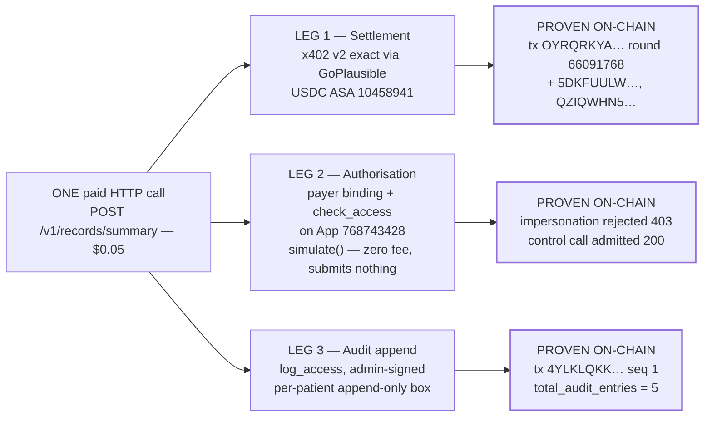

# MedRail — Unique Selling Proposition and Novelty Assessment

**Purpose:** Separate, with no benefit of the doubt, what in MedRail is genuinely new from what is standard practice, borrowed, or simply small — and state exactly how much of the defensible claim is currently proven.

**Status of this document:** Authored 2026-08-21 against the verified fact ledger and source at commit `3b387df`. This is written to be read by a hostile reviewer. Every novelty claim below is stated with the evidence for it **and** the strongest available argument against it. Where a claim is weak, the weakness is in the same paragraph, not in a footnote. **All three legs of the central claim have now executed on Algorand TestNet**, and §0 states exactly how many times and by whom.

---

## 0. The claim, stated once, precisely

> **MedRail's defensible novelty is a composition, not a component.** A single paid HTTP call is simultaneously (1) a settled stablecoin payment, (2) an on-chain authorisation evaluation against a permission the patient controls, and (3) an immutable append to a per-patient audit trail — with no account, API key, or prior relationship required from either party. Around that, a deliberate architectural split — open endpoints priced for volume, one consent-gated endpoint priced for the ownership proof, both underwritten by the same contract — reconciles two goals that are otherwise in direct tension: "the patient owns their data" and "generate real payment volume."

**The state of that claim today:**

| Leg | Mechanism | Proven on live infrastructure? |
|---|---|---|
| 1. Settled payment | x402 v2 `exact`, GoPlausible facilitator, USDC ASA `10458941` | **Yes** — first at tx `OYRQRKYA7WUKBVLWTOFJSJMZFBW7VCNGP5VGH5EBUJGRCVFQFJRQ`, 20000 base units, round 66091768, `fee: 0`, and repeatedly since on the gated route (`5DKFUULW…`, `QZIQWHN5…`). **Every payment is a self-payment from the project's own account.** |
| 2. Authorisation evaluation | `check_access` via `simulate()` — free, submits nothing — behind a payer-identity binding | **Yes.** The contract read is proven (tx `X2BQ5FD4…` → `check_access = True` → tx `OV2J2T5V…` → `False`), and the gate around it is now an access control: `payerFromRequest` binds the asserted requester to the address that signed the payment (`api/src/x402Payer.ts`), verified live with both an attack and a control by `api/scripts/verify-g01-fix.ts`. |
| 3. Audit append | `log_access`, admin-gated, per-patient append-only | **Yes.** First at tx `4YLKLQKKWXXFW3UT5APJVYKXI7T7A6OACTAWCC5YBAN3XGOGHRVQ`, sequence 1. `total_audit_entries` on App `768743428` now reads **5**, with `s`- and `a`-prefixed boxes present and the app account's minimum balance reconciling exactly against the box inventory. |

**All three legs have touched real infrastructure, in a single call, repeatably** — `api/scripts/e2e-consent-proof.ts` performs grant → check → paid call → audit append end to end and can be re-run at will. What remains unproven is not the mechanism but the *adoption*: every payment is a self-payment, nothing is publicly hosted, and there is no MainNet deployment or Bazaar listing. Everything below is written on that footing.

---

## 1. (i) Genuine technical novelty

### N-1 — The authorisation check is free, submits nothing, and is inside the request path

`check_access` is declared `readonly=True` (`contract.py:197`) and executed through `AtomicTransactionComposer.simulate()` (`api/src/services/algorand.ts:98`). No fee, no transaction, no state change — a live contract read used as a per-request authorisation oracle inside an HTTP handler.

**Novelty grade: LOW-MEDIUM.** `readonly` + `simulate()` is documented, standard Algorand practice. What is mildly unusual is the *placement*: using it as an inline authorisation decision for an HTTP paywall, rather than as a client-side convenience read. That is a composition choice, not a new capability.

**Counter-argument a reviewer will make, and it is correct:** the read is free but not fast in absolute terms — one cold observation of **505 ms** through the endpoint, from two sequential algod round-trips (a single sample; no benchmark, load test, or latency budget exists — PERF-002, PERF-003 **NOT IMPLEMENTED**). Any real deployment would need to answer for that, and this build has not measured it.

### N-2 — Permissionless triples: neither party opts in to the application

Consent is stored in `BoxMap(Bytes, GrantRecord, key_prefix="g")` keyed by `sha256(patient ‖ requester ‖ scope)` (`contract.py:95-98`, `:114`). Because boxes are owned by the *application account*, funded by the app itself (`fund_mbr`, `:129-138`), a `(patient, requester, scope)` triple can exist without either party opting in to the application.

The reasoning is in the contract's own header (`contract.py:11-17`): local state would force every requester — including a stranger's read-only agent — to opt in, which is incoherent for a pay-per-call endpoint.

**Novelty grade: LOW as a technique, MEDIUM as a design argument.** Box storage over local state is a standard Algorand decision. The *argument* — that opt-in requirements are fundamentally incompatible with a stranger-callable paid endpoint — is a genuinely clean piece of reasoning, correctly implemented, and it is the reason the consent layer composes with the payment layer at all. Being right for an articulated reason is worth something; it is not an invention.

### N-3 — Deriving one non-enumerable key from three identities

`sha256(patient ‖ requester ‖ scope)` yields a fixed 32-byte key for an unbounded relationship space, with `scope` free-form so a new endpoint needs no contract change (DATA-003).

**Novelty grade: LOW.** Hashing a composite key is elementary. Worth noting the **real cost, and how it is now paid**: three independent implementations of this derivation exist — `contract.py:95-98` (Python/AVM), `api/src/services/algorand.ts:63-79` (Node `crypto`), `web/lib/consent.ts:26-34` (browser `crypto.subtle`) — and a change to the prefix or hash input would silently break two of the three. That is pinned by a single shared golden-vector fixture, `api/test/fixtures/box-key-vectors.json`, asserted from **both** sides of the language boundary: `api/test/boxKeyParity.spec.ts` checks the Node and browser-`crypto.subtle` paths and `contracts/tests/test_box_keys.py` checks the Python path, against the same bytes. The tests also cover order-sensitivity (swapping patient and requester changes the key) and scope-sensitivity. NFR-011 **VALIDATED** (G-08 closed). The clever key derivation created a triplication problem, and the fixture is the cheapest honest answer to it: one file that all three runtimes must agree with.

### N-4 — Per-patient monotonic audit sequencing in box storage

`audit_seq[patient]` holds a counter; `audit_log[patient ‖ itob(seq)]` holds the entry. Sequences are independent per patient (FR-027 **VALIDATED** in simulator), no method mutates an existing entry, and the sequence only increments (DATA-002).

**Novelty grade: LOW-MEDIUM.** An append-only log keyed by `(subject, sequence)` is a textbook pattern. The Algorand-specific wrinkle is real: the backend must **predict** the next box key before submitting, because box references must be declared in the transaction. That produces a read-then-write race, mitigated by `withPatientLock` — an in-process per-patient promise chain (`algorand.ts:129-138`).

**Counter-argument:** the mitigation is honest but weak, and it now constrains the deployment rather than being contradicted by it. `api/fly.toml` sets `max_machines_running = 1` deliberately, so the configuration no longer promises horizontal scaling the lock cannot survive — but that is a ceiling accepted to preserve correctness, which is a real limitation, not a fix. It is tracked as an open finding (G-11; REL-004 **PARTIALLY IMPLEMENTED**). Worth being precise about the failure mode: two instances racing would produce a **rejected transaction**, not a corrupted log — the contract's own sequence assertion refuses the second write — so this is an availability problem, not an integrity one. With the audit write now guarded (§N-5), a rejection degrades to `auditStatus: "pending"` rather than an error. The correct fix — move sequence assignment fully on-chain — is named in [`../SECURITY.md`](../SECURITY.md) and still not implemented.

### N-5 — The composition itself

This is the only claim worth defending as technically novel.

Three properties normally produced by three different systems, on three different timescales, under three different trust models — payment settlement (a payments provider, batched), authorisation (an identity provider, session-scoped), and audit (a logging system, eventually consistent) — are produced here as three facts about **one HTTP request**, verifiable by anyone against a public ledger, with no account on either side.

**Novelty grade: MEDIUM-HIGH as a design; PROVEN as an artefact, at demonstration scale.**

**The most interesting property of the composition, and the one worth leading with: the payment *is* the authentication.** MedRail issues no API keys, holds no sessions, and has no user table, so there is apparently no identity to check the asserted `requesterAddress` against — which is exactly why the first version of this endpoint took the caller's word for it. But an x402 payment is a *signed Algorand transaction*, and a signature is an identity assertion. The credential was already inside the request, unread. `payerFromRequest` (`api/src/x402Payer.ts`) decodes the verified `PAYMENT-SIGNATURE` header, reads the AVM `exact` payload `{paymentGroup, paymentIndex}`, and recovers the sender of the one leg the caller signed — the rest of the atomic group is the facilitator's fee-payer transactions and identifies nobody relevant. `records.ts:41-51` returns **403** unless that address equals `requesterAddress`, and treats a failed recovery as a mismatch rather than a fallback. Turning a paywall into an authorisation check therefore costs one header decode and **no account system, no credential issuance, and no server-side state at all**. The stranger-callable property that created the attack surface is what makes the defence free — which is the composition arguing for itself.

Everything a hostile reviewer should still say against it:

1. **Leg 3 has run five times, all self-initiated.** `total_audit_entries = 5` on App `768743428`, first at tx `4YLKLQKK…` sequence 1, with the `s`- and `a`-prefixed boxes present and the MBR arithmetic reconciling exactly (`docs/PROOF.md` §9). That closes the evidence gap. It does not make it usage: every one of those entries was written by the project's own scripts against its own accounts. FR-025 **VALIDATED on-chain**, and no more than that.
2. **Leg 2's gate holds, and was tested adversarially rather than assumed.** `api/scripts/verify-g01-fix.ts` grants a genuine third-party requester consent, pays from a *different* key while asserting that third party, and confirms the **403** — then runs a control with payer and requester matched and confirms the **200**. A gate that rejects everything is not a fix, so the control is the half that makes the result meaningful. Six unit cases in `api/test/x402Payer.spec.ts` cover the recovery itself, including facilitator legs ahead of the payment, a merely-asserted address, an absent header, a malformed header, and an out-of-range index. SEC-006, SEC-007, SEC-008 and FR-039 **VALIDATED**. See [`./Use_Cases.md`](./Use_Cases.md) UC-011.
3. **The composition is not atomic.** Payment settles through the facilitator; `log_access` is a follow-up transaction moments earlier in the same handler. This is a deliberate interoperability trade-off — a generic x402 client cannot know MedRail's App ID or method signature, so bundling would break off-the-shelf callers ([`../ARCHITECTURE.md`](../ARCHITECTURE.md); [`../IMPLEMENTATION_PLAN.md`](../IMPLEMENTATION_PLAN.md) §3). It is argued well and disclosed plainly. It still means "one call" is a description of the HTTP interaction, not of the ledger.
4. **The non-atomicity has no money consequence, and this was misdiagnosed for a while.** An earlier review recorded it as a lost-payment defect. That was factually wrong: `@x402/hono` (`node_modules/@x402/hono/dist/esm/index.mjs:203-232`) reaches `processSettlement` only when the handler returns a status below 400, and dispatches `cancellationDispatcher.cancel(...)` otherwise. **No error path in MedRail can consume a settled payment.** REL-002 is **VALIDATED — satisfied structurally by the SDK**, and that credit belongs to x402 v2, not to MedRail. What *was* genuinely at risk was the sale rather than the caller's money: an unguarded `logAccess` turned a legitimate paid request into a 500. It is now wrapped in `try/catch` (`records.ts:83-99`), returning **200** with `auditStatus: "pending"`, null `auditTxId`/`auditSequence`, and a structured `audit_write_failed` log. The caller gets the data and can see the receipt is outstanding.
5. **The coverage is real but uneven.** `api/src/routes/records.ts` is now exercised by `x402Payer.spec.ts`, `app.spec.ts` and two live scripts; the box-key derivation is pinned across three runtimes. **`api/src/services/algorand.ts` still has no dedicated unit-test file** (G-05), and the frontend has no automated tests of any kind.

**Honest summary of N-5:** the composition is a good idea, coherently designed, argued from first principles, and **now demonstrated end to end on live infrastructure with its central attack tested and rejected**. What it is not is adopted: the volume is self-generated, nothing is hosted, and the deployed contract still runs pre-fix bytecode for two low-severity defects (§3). A reviewer who marks it "proven mechanism, unproven traction" is correct, and this document does not ask for better.

---

## 2. (ii) Product novelty

### P-1 — The open/gated split as an explicit answer to a structural tension

The clearest original thinking in the project, and it is a product insight rather than a technical one.

The observation: a consent-gated-only design **cannot** generate meaningful payment volume by construction, because every call requires a pre-existing patient–requester relationship. One patient granting one clinician access a few times a year is not usage. But an open-endpoints-only design has no ownership story and demonstrates nothing about patient control.

The resolution: two categories, one trust layer.

| | `/v1/triage`, `/v1/interaction-check` | `/v1/records/summary` |
|---|---|---|
| Price | $0.02 | $0.05 |
| Gate | x402 only | x402 **and** on-chain consent |
| Caller | anyone's agent, no relationship | a requester the patient granted |
| Purpose | broad repeatable volume | the ownership proof |
| State touched | none — pure compute | `check_access` + `log_access` |

Argued in [`../JUDGES.md`](../JUDGES.md) and [`../ARCHITECTURE.md`](../ARCHITECTURE.md), and reflected in the code: `api/src/app.ts:50-60` declares all three prices in one place, `GET /` advertises every route with its `price` and `gate`, and `web/components/PricingTable.tsx` publishes the gate for each.

**Novelty grade: MEDIUM-HIGH.** It identifies a real structural tension, names it, and resolves it with an architecture rather than a slogan. It is also *falsifiable*, which is the mark of a real claim: if consent-gated calls were high-volume, the split would be unnecessary.

**Counter-arguments:**
- The split is partly a competition artefact. It optimises for a leaderboard that scores payment volume. A different scoring rule might not justify it.
- **The volume half has not materialised.** Every settled payment on record is a self-payment from the project's own account (disclosed in [`../PROOF.md`](../PROOF.md) §6). The strategy is sound; the outcome is unrealised. Nothing here may be described as "payment volume."
- [`../ARCHITECTURE.md`](../ARCHITECTURE.md) says "Both categories write to the same audit log" and then corrects itself in the same sentence. The correction is the accurate half: only the consent-gated category writes to the trail, and the open endpoints are pure compute that persist nothing (DOC-5). Any restatement of this claim must carry the correction.

### P-2 — Pricing the verification, not the data

The intent was that `/v1/records/summary` charge $0.05 whether or not consent is valid: the fee covers a real on-chain lookup either way, the same way a paid lookup API charges for a miss ([`../SECURITY.md`](../SECURITY.md)). **The implementation has never actually done this**, and the documentation has now been corrected to match the code rather than the other way round. A denial returns 403, and `@x402/hono` cancels settlement on any status ≥ 400 — so the caller pays nothing. The response says so explicitly (`charged: false`) and points at the free pre-flight check (`api/src/routes/records.ts:59-70`); the old `charged` field is gone.

**Novelty grade: LOW-MEDIUM as an idea, and it is worth noting that the idea is not what shipped.** Charging for a miss is not new. What is slightly unusual is what is being sold: the *authorisation verdict* is the product, and the record is a by-product of a positive verdict. That reframing is coherent — but the system as built gives the verdict away on the negative branch and charges only for the positive one.

**Counter-argument, now pointing the other way.** The party that pays for a denial is MedRail: `records.ts:58` submits a real `logAccess` transaction whose Algorand fee the operator account covers, so an attacker can make the operator spend money for free. That is bounded rather than eliminated — `POST /v1/records/summary` carries a 30 requests/minute limit (`api/src/app.ts:46`, `api/src/rateLimit.ts`) — and the limiter is in-memory and keyed on a spoofable `X-Forwarded-For`, so it is a courtesy guard, not a security boundary. And per UC-007 E1, if the denial's audit write fails it is still swallowed by `.catch(() => undefined)` with no log, metric, or alert (G-15) — so the record that justifies the spend can vanish silently, on the one path that did not get the structured-logging treatment.

### P-3 — Consent as infrastructure rather than as a feature

`scope` is a free-form string throughout (DATA-003), and the ARC-56 spec is served over HTTP at `GET /v1/consent/arc56` (`api/src/app.ts:63-69`) so any third party can build ABI calls against App `768743428` without cloning this repository. The contract is positioned as a public integration surface, not an internal dependency.

**Novelty grade: LOW-MEDIUM.** Publishing an app spec is good practice, not invention. It does show the right instinct.

**Counter-argument:** no scope vocabulary is published, and the only consumer hard-codes `SCOPE = "records:summary"` (`records.ts:10`). A third party can construct calls but cannot discover what to ask for. And note the internal inconsistency: `api/src/services/algorand.ts:20-46` deliberately does **not** parse the spec it publishes, hand-constructing `ABIMethod` literals instead (documented at `:16-19` as avoiding algosdk ARC-56-vs-ARC-4 parsing drift). The spec is published for others and not consumed internally.

---

## 3. (iii) Engineering novelty

Held to a strict standard: *novel*, not merely *competent*. By that standard, **there is no engineering novelty in this repository.** There is competent engineering, which is listed here because it is real and should be credited — and mislabelling it would be the exact failure this document exists to avoid.

| Practice | Where | Assessment |
|---|---|---|
| Hand-constructed `ABIMethod` literals instead of parsing ARC-56, with the reason in a comment | `api/src/services/algorand.ts:16-46` | **Defensive, not novel.** Correct call for SDK-version stability; the cost is that a contract signature change produces no type error. |
| CORS `allowHeaders` deliberately unset so Hono reflects the browser's preflight, with a documented note about a prior regression | `api/src/app.ts:25-30` | **Good engineering evidence.** A comment that records a real bug and why the fix is shaped that way is worth more than the fix. Not novel. |
| Per-patient in-process promise-chain lock | `api/src/services/algorand.ts:129-138` | **Pragmatic and honestly bounded**, and the deployment configuration now agrees with it: `api/fly.toml` sets `max_machines_running = 1` deliberately. That is a limitation accepted openly rather than a contradiction papered over — and it remains an open finding (G-11). |
| Payer identity recovered from the payment itself, rather than trusted from the body | `api/src/x402Payer.ts`; `api/src/routes/records.ts:41-51` | **The single best change in the codebase.** Not novel — the SDK exports every primitive it uses — but it is the right ten lines in the right place, it fails closed on an unreadable header, and it was verified adversarially with a control rather than assumed. |
| Shared golden-vector fixture asserted from three runtimes | `api/test/fixtures/box-key-vectors.json` + `boxKeyParity.spec.ts` + `contracts/tests/test_box_keys.py` | **Correct answer to a triplication problem.** One file that Python, Node and the browser must all agree with, rather than three tests that each agree with themselves. |
| Errors classified by cause: 400 for bad input, 403 for a failed authorisation, 429 for rate limit, 503 + `Retry-After` for a facilitator outage, generic 500 with a `requestId` for anything else | `api/src/app.ts:73-105`, `:113-139`; `api/src/validation.ts` | **Competent and, for an agent caller, load-bearing.** A program cannot ask a human what a 500 meant. Not novel. |
| Idempotent deployment that preserves `fund_txid` across re-runs and funds only on `Create` | `contracts/scripts/deploy_testnet.py:99-137` | **Correct.** FR-100. This is also why `create_txid` in `deploy_testnet.json` is `null` — the recorded run detected an existing app rather than creating one. The app genuinely exists; the create transaction ID simply was not captured. Worth stating rather than glossing. |
| Counter keyed off prior *status*, not prior *existence*, so a re-grant after revoke reactivates without double-counting | `contract.py:157-167`, with the reasoning in a comment | **A genuinely subtle correctness detail, correctly handled and tested.** `test_regrant_after_revoke_reactivates`. Not novel; simply right. |
| Deliberately not hard-coding the audit-box MBR because `AuditEntry` is variable-length | `contract.py:53-55` | **Correct restraint.** Notable because the *fixed* constant next to it is wrong — see below. |
| Disclaimers treated as correctness properties, asserted by tests | `triageScorer.ts:18-21`, `interactionChecker.ts:20-23`; both spec files | **A real safety choice**, argued as harm reduction in [`../IMPLEMENTATION_PLAN.md`](../IMPLEMENTATION_PLAN.md) §4, not as liability hedging. AI-002 **VALIDATED**. |
| Evidence-first documentation | [`../PROOF.md`](../PROOF.md) | **The repository's strongest cultural property.** NFR-010. Undercut by DOC-1, DOC-4, DOC-9. |
| Network-scoped scheme registration so a payment signed for the other network is not accepted | `api/src/x402.ts:11-14` | **Correct and small.** NFR-002. |

**Engineering defects that a novelty claim must not paper over:**

- **C-1 / G-12 (MEDIUM) — fixed in source, redeploy deferred by design.** The contract previously emitted `AccessRequested(Txn.sender, patient, scope)` against a struct declared `patient, requester`, so every event labelled the two parties backwards and any ARC-28 consumer received inverted data. It now emits `AccessRequested(patient, Txn.sender, scope)`, with a regression test that inspects the payload rather than only the counter, verified to fail against the old code. **App `768743428` still runs the pre-fix bytecode**, because `deploy_testnet.py` uses `OnUpdate.AppendApp` — redeploying would mint a new App ID and discard the on-chain history every proof in this document set cites. That is a deliberate trade, and it means the *deployed* application retains this defect.
- **C-2 / G-20 (LOW) — same status.** `GRANT_BOX_MBR` omitted the BoxMap's one-byte `"g"` prefix from the key length, computing 22,100 µALGO where the true cost is **22,500** (confirmed on-chain at the two-box stage: 145,000 − 100,000 base = 45,000 = 2 × 22,500). The source now reads `2_500 + 400 * (33 + 17)`, with a regression test. The deployed `get_grant_box_mbr()` still under-reports by ~1.8% per box.
- **CI-2 (MEDIUM) — still open.** `api/test/x402-flow.spec.ts` makes a live call to `facilitator.goplausible.xyz` at module import, so CI depends on a third party being reachable from a GitHub runner.
- **AI-006 / G-21 (LOW-MEDIUM) — still open.** Unanchored bidirectional substring matching (`interactionChecker.ts:42-43`) produces false positives on short or malformed medication names; the existing test passes `["a","b"]` and asserts only the disclaimer.
- **G-05 (MEDIUM) — still open.** `api/src/services/algorand.ts` — the module that talks to the chain on every gated call — has no dedicated unit-test file.
- **G-15 (MEDIUM) — still open.** No metrics, no tracing, no alerting. Structured JSON logs exist and nothing consumes them.

**Resolved since the review, and credited rather than quietly dropped:** the CI workflow now triggers on `main` and `master` plus `workflow_dispatch`, with dependency caching, `npm audit --audit-level=high` on both packages and an artifact-freshness gate (G-06); `api/fly.toml` sets `NETWORK = "testnet"`, `CONSENT_APP_ID = "768743428"`, a `/v1/health` check and `max_machines_running = 1`, with `.dockerignore` files and `npm ci` in both Dockerfiles (G-07, G-13, G-14); and `npm audit fix` has been run in both packages, which now report **0 vulnerabilities** (G-16, G-27).

---

## 4. (iv) Integration novelty

### I-1 — The consent contract as a public HTTP-discoverable ABI

`GET /v1/consent/app-info` returns network, CAIP-2 id, App ID, and the spec URL; `GET /v1/consent/arc56` serves the compiled spec from disk, with a clear 404 if the contract has not been compiled. Together they let a third party integrate with App `768743428` directly, bypassing MedRail's own API.

**Novelty grade: LOW-MEDIUM.** Uncommon in hackathon submissions; not new. A submission that makes itself bypassable is showing confidence in the contract rather than in the wrapper, which is the right instinct.

### I-2 — The backend proves it cannot hold a patient key

`grant_access` and `revoke_access` are signed in the browser and submitted straight to AlgoNode (`web/lib/consent.ts:44-89`). There is **no key-ingress path in `api/src` at all** — not "we choose not to", but "there is nowhere for it to go." NFR-008 **IMPLEMENTED**; the claim was checked and holds.

**Novelty grade: LOW as architecture, MEDIUM as discipline.** Client-side signing is normal in web3. What is slightly unusual is designing the *server* so the capability is absent rather than merely unused.

**Counter-argument:** the demo wallet stores `{address, mnemonic}` as plaintext JSON in `sessionStorage` under `medrail-demo-wallet-v1` (`web/lib/demoWallet.ts:3`, `:25`), so any XSS on the demo page exfiltrates the key. Bounded to TestNet play money and disclosed in the UI — but the strong claim is about the *backend*, and it should not be allowed to imply the *frontend* has good key hygiene. It does not. And the referenced production path (`lib/walletConnect.ts`) **does not exist**, while [`../IMPLEMENTATION_PLAN.md`](../IMPLEMENTATION_PLAN.md) §4 claims it "is also implemented" (DOC-4). That must be corrected before submission.

### I-3 — Fee sponsorship makes callers ALGO-free

The 402 carries `extra.feePayer = ZMFK2OI7ZBD2U27ISERZC4S6LKM6WMFJPZQ4MYNJDZ2VNBNMBA67RA22AA` and the settled transaction shows `fee: 0`, so a caller needs USDC but not ALGO.

**Novelty grade: ZERO for MedRail.** This is the **facilitator's** feature. MedRail neither built nor configured it — `accepts[].asset` and `extra.feePayer` are fetched from the facilitator's `/supported` at startup and are not in MedRail's configuration at all. Benefiting from someone else's infrastructure is not novelty. The same coupling means the 402 genuinely cannot be constructed offline, so a facilitator outage still takes the priced routes down; what MedRail added is only the classification — that condition is now a **503 with `Retry-After: 30`** and a `PAYMENT_FACILITATOR_UNAVAILABLE` code rather than an opaque 500 (`api/src/app.ts:73-105`). Telling a calling agent "retry shortly" instead of "broken" is competent error handling, not novelty.

### I-4 — A single artefact bridging three runtimes

One contract's semantics are consumed by Algorand Python (AVM), Node/TypeScript (`algosdk` + ATC), and the browser (`algosdk` + `crypto.subtle`) — with byte-identical box-key derivation required across all three.

**Novelty grade: LOW, and it stopped being a liability once it was pinned.** Three implementations against one shared golden-vector fixture, asserted from the Node, browser and Python paths (NFR-011 **VALIDATED**, G-08). The triplication is still a cost — three places to change — but it is now a cost with a tripwire rather than a silent divergence risk.

---

## 5. (v) UX differentiation

| # | Differentiator | Evidence | Assessment |
|---|---|---|---|
| U-1 | **Zero-install paid call.** A visitor makes a real, signed, settled Algorand payment from a page with no wallet extension: the browser generates a keypair on first load. | `web/lib/demoWallet.ts:13-27`; `web/components/DemoWalletCard.tsx` | **Genuine, and the strongest UX property.** Trade-off: plaintext mnemonic in `sessionStorage`, TestNet-only, disclosed in the UI as having "zero real-world value". |
| U-2 | **402 presented as a state, not an error.** A rejected settlement is explained — "a real payment was constructed and signed by your demo wallet, but settlement was rejected — almost always because the wallet has no TestNet USDC yet" — with a link to the dispenser. | `web/components/LiveDemoPanel.tsx:165-170`, `:131-140` | **Good.** Protocol-literate UX. The client also deliberately skips `getPaymentSettleResponse` on a non-200, because there is no `PAYMENT-RESPONSE` to parse (`web/lib/x402Client.ts:31-34`). |
| U-3 | **Every result links to the chain.** Settled payment and consent transactions both render an explorer link. | `LiveDemoPanel.tsx:154-163`; `ConsentChecker.tsx:95-104` | **Good.** Verification is one click, not a curl command. |
| U-4 | **The consent lifecycle is three buttons.** Grant → Check → Revoke, each a real signed transaction, with the status re-read from chain after every action. | `ConsentChecker.tsx:30-48` | **Good demonstration.** But it only supports **self-granting** (`:32` passes `wallet.address` as both parties) with duration hard-coded to `0`, so the two-party flow and the expiry feature — both **VALIDATED** in the contract — are unreachable from the UI. |
| U-5 | **Live network state, not a static badge.** | `web/components/NetworkBadge.tsx` polls `GET /v1/health` | **Small and correct.** |
| U-6 | **Non-diagnostic framing is visible in the product**, not only in the terms. | Every intelligence response carries a `disclaimer`; tests assert it | **A real safety property.** AI-002, AI-003. |

**UX gaps:** exactly one web route exists (`/`); there is no audit-trail view, and now that there are five entries on-chain that absence is a missing feature rather than an empty one; no grant-management view; no real wallet; and `web/` has **zero automated tests** — no Vitest, Jest, Playwright, or Cypress configuration exists.

---

## 6. (vi) What is **not** novel

The section that decides whether the rest of this document is credible.

| # | Not novel | Statement |
|---|---|---|
| NN-1 | **x402 itself.** | MedRail **consumes** the protocol; it did not invent, extend, or contribute to it. `@x402/core`, `@x402/avm`, `@x402/hono`, `@x402/extensions` are pinned at `2.21.0` and `@x402/fetch` at `^2.21.0`. HTTP 402 has been in the specification since HTTP/1.1. The `exact` scheme, the `PAYMENT-SIGNATURE`/`PAYMENT-REQUIRED`/`PAYMENT-RESPONSE` header triple, and the verify/settle flow are all the SDK's. |
| NN-2 | **The facilitator, and everything it provides.** | GoPlausible verifies, settles, sponsors fees, and supplies the asset id. MedRail configures scheme, network, price, and `payTo` — nothing more. `api/src/x402.ts:16-32`. |
| NN-3 | **Algorand box storage, `BoxMap`, ARC-4 structs, ARC-28 events, `readonly` + `simulate()`, inner transactions.** | Every one is standard, documented platform capability used as intended. |
| NN-4 | **On-chain consent registries.** | A known and well-explored pattern. MedRail's variant is smaller than most. |
| NN-5 | **The rule engines.** | 11 hard-coded keyword groups with integer weights and a 4-band threshold; 14 curated interaction pairs with substring matching. Roughly 25 static rules, written in an afternoon by construction. **There is no LLM, no ML model, no embeddings, no RAG, and no vector store anywhere in this repository.** Any description of these as "AI" beyond "deterministic rule engine" is inaccurate. AI-005 **NOT IMPLEMENTED** — no dataset, no evaluation harness, no metric — and none is claimed. |
| NN-6 | **The record payload.** | One hard-coded constant returned regardless of `patientId` (`records.ts:15-21`). There is no retrieval, no storage, and no encryption to be novel about. DATA-006 **PLANNED**. |
| NN-7 | **Stablecoin micropayments for APIs.** | The general idea long predates this submission. |
| NN-8 | **Patient-controlled health records as a concept.** | Decades old. MedRail contributes a mechanism sketch, not the idea. |
| NN-9 | **The tech stack.** | Hono, Next.js 16, React 19, Tailwind 4, zod, vitest, Algorand Python. Current and sensibly chosen; entirely conventional. |
| NN-10 | **"Immutable audit trail on a blockchain."** | The oldest claim in the category. It is now proven here — `total_audit_entries = 5`, first entry at tx `4YLKLQKK…` — which moves it from *unproven* to *unremarkable*, not to *novel*. Five self-generated entries is a working mechanism, not a track record. |
| NN-11 | **Being deployed on TestNet.** | Expected of every entrant. Not a differentiator. |
| NN-12 | **Having settled payments at all.** | A minimum bar, not an achievement — and every one of them is a self-payment. |
| NN-13 | **Recovering the payer from a signed payment.** | `decodePaymentSignatureHeader` and `getSenderFromTransaction` are both SDK exports. Using them is the correct thing to do, and the *idea* that a payment can serve as authentication is the interesting half (§N-5) — but the mechanism is fifteen lines of documented API calls. |

---

## 7. The USP, in the form it can actually be defended

**Defensible today, with evidence:**

> MedRail places a patient-controlled, publicly verifiable consent registry directly inside the request path of a stranger-callable, per-call-paid HTTP API — so that one call is both a settled payment and a live authorisation evaluation against a permission no organisation mediates. It pairs that with a deliberate two-tier endpoint design that makes the patient-ownership story and real payment volume achievable in the same system rather than trading one against the other.

Every clause above is backed: FR-001…FR-003 (**VALIDATED**), FR-013 / SEC-009 (**IMPLEMENTED**), FR-018 / FR-020 / SEC-003 (**VALIDATED**, three transaction IDs), FR-039 / SEC-007 / SEC-008 (**VALIDATED**, `contracts/artifacts/g01-verification.json`), FR-012 / FR-025 (**VALIDATED on-chain**, audit tx `4YLKLQKK…`), NFR-008 (**IMPLEMENTED**), NFR-011 (**VALIDATED**), FR-101 (**IMPLEMENTED**).

And one clause can now be added to it:

> The requester's identity is not asserted, it is recovered — from the signature on the payment that bought the call. The consent gate is an authorisation check with no account system behind it, and the impersonation attack it was built against has been executed against the live service and rejected, alongside a control call proving the legitimate path still works.

**Not defensible today, and must be said in the same breath:**

> Nothing is publicly hosted. There is no MainNet deployment, no Bazaar listing, and no third-party payment volume — every settled payment on record is a self-payment from the project's own account, and every one of the five audit entries was written by the project's own scripts. The deployed contract at App `768743428` still runs bytecode that predates two source fixes (C-1, C-2), because redeploying would mint a new App ID and discard the very history these proofs rest on. Twelve engineering findings remain open, including no observability of any kind and no direct test coverage of the chain client.

**What that costs the claim.** The composition is **three proven legs and no traction.** As an argument it is strong; as a demonstration it is complete at hackathon scale; as a product it has one user, and that user is the author. A reviewer who marks it "proven mechanism, unproven traction" is correct, and this document does not ask for better.

**What would raise it further** — none of this is implemented, and none of it is a code change:

1. **A public deployment**, so a third party can call the endpoints without cloning the repository. The Fly configuration is correct and nothing is running on it.
2. **A payment from an account that is not the project's own.** That, and only that, converts "the mechanism settles" into "someone bought something."
3. **A read surface for the audit trail.** Five entries exist on-chain and no endpoint or UI exposes them, so the patient-facing half of the ownership story is still told rather than shown.

---

## 8. Novelty scorecard

| Category | Grade | One-line justification |
|---|---|---|
| Technical novelty | **MEDIUM-HIGH as design, MEDIUM as proven artefact** | The composition is the idea, and all three legs now run on live infrastructure — at demonstration scale, self-generated. |
| Product novelty | **MEDIUM-HIGH** | The open/gated split is a real, falsifiable answer to a real structural tension — with the volume half unrealised. |
| Engineering novelty | **NONE** | Competent, well-commented, honestly bounded. The best change in the codebase (payer binding) is fifteen lines of documented SDK calls, and twelve findings remain open. |
| Integration novelty | **LOW-MEDIUM** | Publishing the ABI and designing out key ingress are good instincts; fee sponsorship is the facilitator's. |
| UX differentiation | **MEDIUM** | Zero-install real payment and protocol-literate error states are genuine; the surface is one route with no tests and no audit-trail view. |
| Overall | **A strong thesis with a proven mechanism and no traction.** | |

---

## 9. Related documents

[`./Problem_Statement.md`](./Problem_Statement.md) · [`./Project_Vision.md`](./Project_Vision.md) · [`./User_Personas.md`](./User_Personas.md) · [`./User_Journey.md`](./User_Journey.md) · [`./Use_Cases.md`](./Use_Cases.md) · [`./Scope.md`](./Scope.md) · [`./Competitive_Analysis.md`](./Competitive_Analysis.md) · [`../ARCHITECTURE.md`](../ARCHITECTURE.md) · [`../SECURITY.md`](../SECURITY.md) · [`../PROOF.md`](../PROOF.md) · [`../JUDGES.md`](../JUDGES.md)
