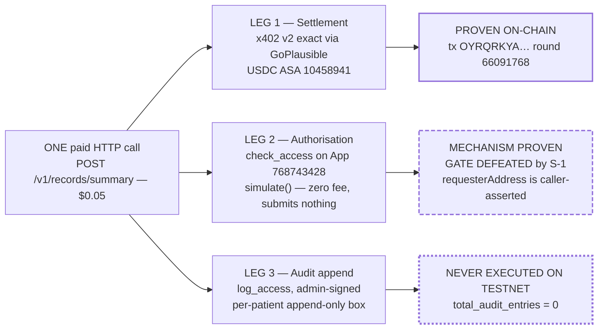

# MedRail — Unique Selling Proposition and Novelty Assessment

> **⚠ Correction notice.** Parts of this document were written against a review finding that was
> later proven wrong. Settlement in x402 v2 happens **only** on a sub-400 response, so **no error
> path in MedRail can consume a settled payment** — and consent-denied calls (HTTP 403) are **not
> charged**, contrary to `API.md`, `SECURITY.md`, and the `paidButDenied` field. The audit-sequence
> race causes a **rejected transaction**, not a corrupted log. See
> [`CORRECTIONS.md`](../CORRECTIONS.md) — it supersedes any statement here that contradicts it.

**Purpose:** Separate, with no benefit of the doubt, what in MedRail is genuinely new from what is standard practice, borrowed, or simply small — and state exactly how much of the defensible claim is currently proven.

**Status of this document:** Authored 2026-08-21 against the verified fact ledger and source at commit `32ffd73`. This is written to be read by a hostile reviewer. Every novelty claim below is stated with the evidence for it **and** the strongest available argument against it. Where a claim is weak, the weakness is in the same paragraph, not in a footnote. **The central claim's third leg has never executed on Algorand TestNet**, which is disclosed in §1 rather than buried.

---

## 0. The claim, stated once, precisely

> **MedRail's defensible novelty is a composition, not a component.** A single paid HTTP call is simultaneously (1) a settled stablecoin payment, (2) an on-chain authorisation evaluation against a permission the patient controls, and (3) an immutable append to a per-patient audit trail — with no account, API key, or prior relationship required from either party. Around that, a deliberate architectural split — open endpoints priced for volume, one consent-gated endpoint priced for the ownership proof, both underwritten by the same contract — reconciles two goals that are otherwise in direct tension: "the patient owns their data" and "generate real payment volume."

**The state of that claim today:**

| Leg | Mechanism | Proven on live infrastructure? |
|---|---|---|
| 1. Settled payment | x402 v2 `exact`, GoPlausible facilitator, USDC ASA `10458941` | **Yes** — tx `OYRQRKYA7WUKBVLWTOFJSJMZFBW7VCNGP5VGH5EBUJGRCVFQFJRQ`, 20000 base units, round 66091768, `fee: 0`. **One payment; sender == receiver.** |
| 2. Authorisation evaluation | `check_access` via `simulate()` — free, submits nothing | **Partially.** The contract read is proven (tx `X2BQ5FD4…` → `check_access = True` → tx `OV2J2T5V…` → `False`). **The gate around it is not an access control** — finding S-1. |
| 3. Audit append | `log_access`, admin-gated, per-patient append-only | **No. Never executed on Algorand TestNet.** `total_audit_entries == 0` on App `768743428`; zero `s`- or `a`-prefixed boxes exist. Coverage is AVM-simulator unit tests only. |

Two of three legs have touched real infrastructure. **The composition as a whole has never run.** Everything below is written on that footing.

---

## 1. (i) Genuine technical novelty

### N-1 — The authorisation check is free, submits nothing, and is inside the request path

`check_access` is declared `readonly=True` (`contract.py:197`) and executed through `AtomicTransactionComposer.simulate()` (`api/src/services/algorand.ts:98`). No fee, no transaction, no state change — a live contract read used as a per-request authorisation oracle inside an HTTP handler.

**Novelty grade: LOW-MEDIUM.** `readonly` + `simulate()` is documented, standard Algorand practice. What is mildly unusual is the *placement*: using it as an inline authorisation decision for an HTTP paywall, rather than as a client-side convenience read. That is a composition choice, not a new capability.

**Counter-argument a reviewer will make, and it is correct:** the read is free but not fast in absolute terms — one cold observation of **505 ms** through the endpoint, from two sequential algod round-trips (a single sample; no benchmark, load test, or latency budget exists — PERF-002, PERF-003 **NOT IMPLEMENTED**). Any real deployment would need to answer for that, and this build has not measured it.

### N-2 — Permissionless triples: neither party opts in to the application

Consent is stored in `BoxMap(Bytes, GrantRecord, key_prefix="g")` keyed by `sha256(patient ‖ requester ‖ scope)` (`contract.py:95-98`, `:114`). Because boxes are owned by the *application account*, funded by the app itself (`fund_mbr`, `:129-138`), a `(patient, requester, scope)` triple can exist without either party opting in to the application.

The reasoning is in the contract's own header (`contract.py:11-17`): local state would force every requester — including a stranger's read-only agent — to opt in, which is incoherent for a pay-per-call endpoint.

**Novelty grade: LOW as a technique, MEDIUM as a design argument.** Box storage over local state is a standard Algorand decision. The *argument* — that opt-in requirements are fundamentally incompatible with a stranger-callable paid endpoint — is a genuinely clean piece of reasoning, correctly implemented, and it is the reason the consent layer composes with the payment layer at all. Being right for an articulated reason is worth something; it is not an invention.

### N-3 — Deriving one non-enumerable key from three identities

`sha256(patient ‖ requester ‖ scope)` yields a fixed 32-byte key for an unbounded relationship space, with `scope` free-form so a new endpoint needs no contract change (DATA-003).

**Novelty grade: LOW.** Hashing a composite key is elementary. Worth noting the **real cost**: three independent implementations of this derivation exist — `contract.py:95-98` (Python/AVM), `api/src/services/algorand.ts:63-79` (Node `crypto`), `web/lib/consent.ts:26-34` (browser `crypto.subtle`) — with **no cross-implementation test**. NFR-011 **UNVALIDATED**, severity MEDIUM. A change to the prefix or hash input silently breaks two of the three. The clever key derivation created a triplication problem the repository has not solved.

### N-4 — Per-patient monotonic audit sequencing in box storage

`audit_seq[patient]` holds a counter; `audit_log[patient ‖ itob(seq)]` holds the entry. Sequences are independent per patient (FR-027 **VALIDATED** in simulator), no method mutates an existing entry, and the sequence only increments (DATA-002).

**Novelty grade: LOW-MEDIUM.** An append-only log keyed by `(subject, sequence)` is a textbook pattern. The Algorand-specific wrinkle is real: the backend must **predict** the next box key before submitting, because box references must be declared in the transaction. That produces a read-then-write race, mitigated by `withPatientLock` — an in-process per-patient promise chain (`algorand.ts:129-138`).

**Counter-argument:** the mitigation is honest but weak, and it is contradicted by the deployment configuration. `api/fly.toml` sets `auto_start_machines = true` with `min_machines_running = 1` — a floor, not a ceiling — so horizontal scaling silently reintroduces the race that [`../SECURITY.md`](../SECURITY.md) describes as mitigated (D-7; REL-004 **PARTIALLY IMPLEMENTED**). The document names the correct fix — move sequence assignment fully on-chain — and does not implement it.

### N-5 — The composition itself

This is the only claim worth defending as technically novel.

Three properties normally produced by three different systems, on three different timescales, under three different trust models — payment settlement (a payments provider, batched), authorisation (an identity provider, session-scoped), and audit (a logging system, eventually consistent) — are produced here as three facts about **one HTTP request**, verifiable by anyone against a public ledger, with no account on either side.

**Novelty grade: MEDIUM-HIGH as a design; UNPROVEN as an artefact.**

Everything a hostile reviewer should say against it:

1. **Leg 3 has never run.** `total_audit_entries == 0`. The differentiator's most distinctive component has been exercised only in an AVM simulator. FR-025 **UNVALIDATED on-chain**.
2. **Leg 2's gate is broken.** `requesterAddress` is read from the request body (`api/src/routes/records.ts:5-8`) and never bound to the payer. Grants are public on Algorand — patient = sender, requester = ABI arg 0 — so an attacker enumerates pairs from the app's own transaction history, pays the ordinary $0.05, and is admitted, because the grant genuinely exists. SEC-006 **DEFEATED BY S-1**; SEC-007, SEC-008, FR-039 **NOT IMPLEMENTED**. See [`./Use_Cases.md`](./Use_Cases.md) UC-011.
3. **The composition is not atomic.** Payment settles through the facilitator; `log_access` is a follow-up transaction moments later. This is a deliberate interoperability trade-off — a generic x402 client cannot know MedRail's App ID or method signature, so bundling would break off-the-shelf callers ([`../ARCHITECTURE.md`](../ARCHITECTURE.md); [`../IMPLEMENTATION_PLAN.md`](../IMPLEMENTATION_PLAN.md) §3). It is argued well and disclosed plainly. It still means "one call" is a description of the HTTP interaction, not of the ledger.
4. **The non-atomicity has a money consequence.** `logAccess` on the allowed path is awaited without a catch (`records.ts:49`), unlike the denied path (`:37`). A failure there returns HTTP 500 *after* settlement: the caller has paid $0.05 and receives nothing, with no refund path and no retry token. REL-002 **NOT IMPLEMENTED** (R-2).
5. **There is no test for any of it.** `api/src/routes/records.ts` and `api/src/services/algorand.ts` — the two modules that implement the composition — have **zero automated coverage**.

**Honest summary of N-5:** the composition is a good idea, coherently designed, argued from first principles, and **currently unproven, insecure, and untested**. It is a strong *thesis* with a weak *artefact*. A reviewer who accepts the thesis and rejects the artefact is being fair.

---

## 2. (ii) Product novelty

### P-1 — The open/gated split as an explicit answer to a structural tension

The clearest original thinking in the project, and it is a product insight rather than a technical one.

The observation: a consent-gated-only design **cannot** generate meaningful payment volume by construction, because every call requires a pre-existing patient–requester relationship. One patient granting one clinician access a few times a year is not usage. But an open-endpoints-only design has no ownership story and demonstrates nothing about patient control.

The resolution: two categories, one trust layer.

| | `/v1/triage`, `/v1/interaction-check` | `/v1/records/summary` |
|---|---|---|
| Price | $0.02 | $0.05 |
| Gate | x402 only | x402 **and** on-chain consent |
| Caller | anyone's agent, no relationship | a requester the patient granted |
| Purpose | broad repeatable volume | the ownership proof |
| State touched | none — pure compute | `check_access` + `log_access` |

Argued in [`../JUDGES.md`](../JUDGES.md) and [`../ARCHITECTURE.md`](../ARCHITECTURE.md), and reflected in the code: `api/src/app.ts:37-50` declares all three prices in one place, and `web/components/PricingTable.tsx` publishes the gate for each.

**Novelty grade: MEDIUM-HIGH.** It identifies a real structural tension, names it, and resolves it with an architecture rather than a slogan. It is also *falsifiable*, which is the mark of a real claim: if consent-gated calls were high-volume, the split would be unnecessary.

**Counter-arguments:**
- The split is partly a competition artefact. It optimises for a leaderboard that scores payment volume. A different scoring rule might not justify it.
- **The volume half has not materialised.** Exactly one settled payment exists, and its sender equals its receiver (disclosed in [`../PROOF.md`](../PROOF.md) §6). The strategy is sound; the outcome is unrealised. Nothing here may be described as "payment volume."
- [`../ARCHITECTURE.md`](../ARCHITECTURE.md) says "Both categories write to the same audit log" and then corrects itself in the same sentence. The correction is the accurate half — and since `total_audit_entries == 0`, **neither** category has ever written to it on-chain (DOC-5). Any restatement of this claim must carry the correction.

### P-2 — Pricing the verification, not the data

`/v1/records/summary` charges $0.05 whether or not consent is valid, returning `403` with `paidButDenied: true` (`api/src/routes/records.ts:38-46`). The stated rationale: the fee covers a real on-chain lookup either way, the same way a paid lookup API charges for a miss ([`../SECURITY.md`](../SECURITY.md)).

**Novelty grade: LOW-MEDIUM.** Charging for a miss is not new. What is slightly unusual is what is being sold: the *authorisation verdict* is the product, and the record is a by-product of a positive verdict. That reframing is coherent and is stated in the response body rather than buried in terms of service — which is the right way to do it.

**Counter-argument:** a requester whose grant was silently revoked pays to be told so, with no in-call free path to discover it beforehand. `GET /v1/consent/status` provides a free pre-flight check, but nothing in the paid flow points a caller at it. And per UC-007 E1, if the denial's audit write fails it is swallowed by `.catch(() => undefined)` with no log, metric, or alert — so the very record that justifies the charge can vanish silently.

### P-3 — Consent as infrastructure rather than as a feature

`scope` is a free-form string throughout (DATA-003), and the ARC-56 spec is served over HTTP at `GET /v1/consent/arc56` (`api/src/app.ts:63-69`) so any third party can build ABI calls against App `768743428` without cloning this repository. The contract is positioned as a public integration surface, not an internal dependency.

**Novelty grade: LOW-MEDIUM.** Publishing an app spec is good practice, not invention. It does show the right instinct.

**Counter-argument:** no scope vocabulary is published, and the only consumer hard-codes `SCOPE = "records:summary"` (`records.ts:10`). A third party can construct calls but cannot discover what to ask for. And note the internal inconsistency: `api/src/services/algorand.ts:20-46` deliberately does **not** parse the spec it publishes, hand-constructing `ABIMethod` literals instead (documented at `:16-19` as avoiding algosdk ARC-56-vs-ARC-4 parsing drift). The spec is published for others and not consumed internally.

---

## 3. (iii) Engineering novelty

Held to a strict standard: *novel*, not merely *competent*. By that standard, **there is no engineering novelty in this repository.** There is competent engineering, which is listed here because it is real and should be credited — and mislabelling it would be the exact failure this document exists to avoid.

| Practice | Where | Assessment |
|---|---|---|
| Hand-constructed `ABIMethod` literals instead of parsing ARC-56, with the reason in a comment | `api/src/services/algorand.ts:16-46` | **Defensive, not novel.** Correct call for SDK-version stability; the cost is that a contract signature change produces no type error. |
| CORS `allowHeaders` deliberately unset so Hono reflects the browser's preflight, with a documented note about a prior regression | `api/src/app.ts:25-30` | **Good engineering evidence.** A comment that records a real bug and why the fix is shaped that way is worth more than the fix. Not novel. |
| Per-patient in-process promise-chain lock | `api/src/services/algorand.ts:129-138` | **Pragmatic and honestly bounded.** Contradicted by `fly.toml` (D-7). |
| Idempotent deployment that preserves `fund_txid` across re-runs and funds only on `Create` | `contracts/scripts/deploy_testnet.py:99-137` | **Correct.** FR-100. This is also why `create_txid` in `deploy_testnet.json` is `null` — the recorded run detected an existing app rather than creating one. The app genuinely exists; the create transaction ID simply was not captured. Worth stating rather than glossing. |
| Counter keyed off prior *status*, not prior *existence*, so a re-grant after revoke reactivates without double-counting | `contract.py:157-167`, with the reasoning in a comment | **A genuinely subtle correctness detail, correctly handled and tested.** `test_regrant_after_revoke_reactivates`. Not novel; simply right. |
| Deliberately not hard-coding the audit-box MBR because `AuditEntry` is variable-length | `contract.py:53-55` | **Correct restraint.** Notable because the *fixed* constant next to it is wrong — see below. |
| Disclaimers treated as correctness properties, asserted by tests | `triageScorer.ts:18-21`, `interactionChecker.ts:20-23`; both spec files | **A real safety choice**, argued as harm reduction in [`../IMPLEMENTATION_PLAN.md`](../IMPLEMENTATION_PLAN.md) §4, not as liability hedging. AI-002 **VALIDATED**. |
| Evidence-first documentation | [`../PROOF.md`](../PROOF.md) | **The repository's strongest cultural property.** NFR-010. Undercut by DOC-1, DOC-4, DOC-9. |
| Network-scoped scheme registration so a payment signed for the other network is not accepted | `api/src/x402.ts:11-14` | **Correct and small.** NFR-002. |

**Engineering defects that a novelty claim must not paper over:**

- **C-1 (MEDIUM):** `contract.py:146` emits `AccessRequested(Txn.sender, patient, scope)` while the struct is declared `patient, requester`. `Txn.sender` is the *requester*, so every emitted event labels the two parties backwards. Any ARC-28 consumer receives inverted data. Survives because `test_request_access_emits_event_and_counts` asserts only the counter and never inspects the payload. One-line fix.
- **C-2 (LOW):** `contract.py:52` computes `GRANT_BOX_MBR = 2_500 + 400 * (32 + 17)` = 22,100 µALGO, omitting the BoxMap's one-byte `"g"` prefix from the key length. True cost is **22,500**, confirmed on-chain: app min-balance 145,000 − 100,000 base = 45,000 = 2 × 22,500. The public ABI method `get_grant_box_mbr()`, advertised at `:249-252` as a constant the backend can quote, under-reports by ~1.8% per box.
- **CI-1 (HIGH):** the workflow triggers on `push: branches: [main]`; the only branch is `master`. Every job passes locally (ledger §18) — the code is not failing, the trigger is wrong — but **no push has ever triggered CI**.
- **CI-2 (MEDIUM):** `api/test/x402-flow.spec.ts` makes a live call to `facilitator.goplausible.xyz` at module import, so CI depends on a third party being reachable from a GitHub runner.
- **D-1/D-2 (HIGH):** `contracts/artifacts/deploy_testnet.json` is not copied into the image and `api/fly.toml` sets no `CONSENT_APP_ID`, while hard-coding `NETWORK = "mainnet"` where no contract exists. A `fly deploy` today produces a broken service.
- **AI-006 (LOW-MEDIUM):** unanchored bidirectional substring matching (`interactionChecker.ts:42-43`) produces false positives on short or malformed medication names; the existing test passes `["a","b"]` and asserts only the disclaimer.

---

## 4. (iv) Integration novelty

### I-1 — The consent contract as a public HTTP-discoverable ABI

`GET /v1/consent/app-info` returns network, CAIP-2 id, App ID, and the spec URL; `GET /v1/consent/arc56` serves the compiled spec from disk, with a clear 404 if the contract has not been compiled. Together they let a third party integrate with App `768743428` directly, bypassing MedRail's own API.

**Novelty grade: LOW-MEDIUM.** Uncommon in hackathon submissions; not new. A submission that makes itself bypassable is showing confidence in the contract rather than in the wrapper, which is the right instinct.

### I-2 — The backend proves it cannot hold a patient key

`grant_access` and `revoke_access` are signed in the browser and submitted straight to AlgoNode (`web/lib/consent.ts:44-89`). There is **no key-ingress path in `api/src` at all** — not "we choose not to", but "there is nowhere for it to go." NFR-008 **IMPLEMENTED**; the claim was checked and holds.

**Novelty grade: LOW as architecture, MEDIUM as discipline.** Client-side signing is normal in web3. What is slightly unusual is designing the *server* so the capability is absent rather than merely unused.

**Counter-argument:** the demo wallet stores `{address, mnemonic}` as plaintext JSON in `sessionStorage` under `medrail-demo-wallet-v1` (`web/lib/demoWallet.ts:3`, `:25`), so any XSS on the demo page exfiltrates the key. Bounded to TestNet play money and disclosed in the UI — but the strong claim is about the *backend*, and it should not be allowed to imply the *frontend* has good key hygiene. It does not. And the referenced production path (`lib/walletConnect.ts`) **does not exist**, while [`../IMPLEMENTATION_PLAN.md`](../IMPLEMENTATION_PLAN.md) §4 claims it "is also implemented" (DOC-4). That must be corrected before submission.

### I-3 — Fee sponsorship makes callers ALGO-free

The 402 carries `extra.feePayer = ZMFK2OI7ZBD2U27ISERZC4S6LKM6WMFJPZQ4MYNJDZ2VNBNMBA67RA22AA` and the settled transaction shows `fee: 0`, so a caller needs USDC but not ALGO.

**Novelty grade: ZERO for MedRail.** This is the **facilitator's** feature. MedRail neither built nor configured it — `accepts[].asset` and `extra.feePayer` are fetched from the facilitator's `/supported` at startup and are not in MedRail's configuration at all. Benefiting from someone else's infrastructure is not novelty, and the same coupling is the root cause of R-1: with the facilitator unreachable, the 402 cannot be constructed offline and all three priced routes return **HTTP 500 with no `PAYMENT-REQUIRED` and no `Retry-After`**.

### I-4 — A single artefact bridging three runtimes

One contract's semantics are consumed by Algorand Python (AVM), Node/TypeScript (`algosdk` + ATC), and the browser (`algosdk` + `crypto.subtle`) — with byte-identical box-key derivation required across all three.

**Novelty grade: LOW, and it is currently a liability rather than an asset.** Three implementations, no cross-check test (NFR-011 **UNVALIDATED**). This belongs in the risk register as much as in a novelty assessment.

---

## 5. (v) UX differentiation

| # | Differentiator | Evidence | Assessment |
|---|---|---|---|
| U-1 | **Zero-install paid call.** A visitor makes a real, signed, settled Algorand payment from a page with no wallet extension: the browser generates a keypair on first load. | `web/lib/demoWallet.ts:13-27`; `web/components/DemoWalletCard.tsx` | **Genuine, and the strongest UX property.** Trade-off: plaintext mnemonic in `sessionStorage`, TestNet-only, disclosed in the UI as having "zero real-world value". |
| U-2 | **402 presented as a state, not an error.** A rejected settlement is explained — "a real payment was constructed and signed by your demo wallet, but settlement was rejected — almost always because the wallet has no TestNet USDC yet" — with a link to the dispenser. | `web/components/LiveDemoPanel.tsx:165-170`, `:131-140` | **Good.** Protocol-literate UX. The client also deliberately skips `getPaymentSettleResponse` on a non-200, because there is no `PAYMENT-RESPONSE` to parse (`web/lib/x402Client.ts:31-34`). |
| U-3 | **Every result links to the chain.** Settled payment and consent transactions both render an explorer link. | `LiveDemoPanel.tsx:154-163`; `ConsentChecker.tsx:95-104` | **Good.** Verification is one click, not a curl command. |
| U-4 | **The consent lifecycle is three buttons.** Grant → Check → Revoke, each a real signed transaction, with the status re-read from chain after every action. | `ConsentChecker.tsx:30-48` | **Good demonstration.** But it only supports **self-granting** (`:32` passes `wallet.address` as both parties) with duration hard-coded to `0`, so the two-party flow and the expiry feature — both **VALIDATED** in the contract — are unreachable from the UI. |
| U-5 | **Live network state, not a static badge.** | `web/components/NetworkBadge.tsx` polls `GET /v1/health` | **Small and correct.** |
| U-6 | **Non-diagnostic framing is visible in the product**, not only in the terms. | Every intelligence response carries a `disclaimer`; tests assert it | **A real safety property.** AI-002, AI-003. |

**UX gaps:** exactly one web route exists (`/`); there is no audit-trail view (and nothing to show in it); no grant-management view; no real wallet; and `web/` has **zero automated tests** — no Vitest, Jest, Playwright, or Cypress configuration exists.

---

## 6. (vi) What is **not** novel

The section that decides whether the rest of this document is credible.

| # | Not novel | Statement |
|---|---|---|
| NN-1 | **x402 itself.** | MedRail **consumes** the protocol; it did not invent, extend, or contribute to it. `@x402/core`, `@x402/avm`, `@x402/hono`, `@x402/extensions` are pinned at `2.21.0` and `@x402/fetch` at `^2.21.0`. HTTP 402 has been in the specification since HTTP/1.1. The `exact` scheme, the `PAYMENT-SIGNATURE`/`PAYMENT-REQUIRED`/`PAYMENT-RESPONSE` header triple, and the verify/settle flow are all the SDK's. |
| NN-2 | **The facilitator, and everything it provides.** | GoPlausible verifies, settles, sponsors fees, and supplies the asset id. MedRail configures scheme, network, price, and `payTo` — nothing more. `api/src/x402.ts:16-32`. |
| NN-3 | **Algorand box storage, `BoxMap`, ARC-4 structs, ARC-28 events, `readonly` + `simulate()`, inner transactions.** | Every one is standard, documented platform capability used as intended. |
| NN-4 | **On-chain consent registries.** | A known and well-explored pattern. MedRail's variant is smaller than most. |
| NN-5 | **The rule engines.** | 11 hard-coded keyword groups with integer weights and a 4-band threshold; 14 curated interaction pairs with substring matching. Roughly 25 static rules, written in an afternoon by construction. **There is no LLM, no ML model, no embeddings, no RAG, and no vector store anywhere in this repository.** Any description of these as "AI" beyond "deterministic rule engine" is inaccurate. AI-005 **NOT IMPLEMENTED** — no dataset, no evaluation harness, no metric — and none is claimed. |
| NN-6 | **The record payload.** | One hard-coded constant returned regardless of `patientId` (`records.ts:15-21`). There is no retrieval, no storage, and no encryption to be novel about. DATA-006 **PLANNED**. |
| NN-7 | **Stablecoin micropayments for APIs.** | The general idea long predates this submission. |
| NN-8 | **Patient-controlled health records as a concept.** | Decades old. MedRail contributes a mechanism sketch, not the idea. |
| NN-9 | **The tech stack.** | Hono, Next.js 16, React 19, Tailwind 4, zod, vitest, Algorand Python. Current and sensibly chosen; entirely conventional. |
| NN-10 | **"Immutable audit trail on a blockchain."** | The oldest claim in the category — and here it is the **least proven** part of the system: `log_access` has never executed on TestNet. |
| NN-11 | **Being deployed on TestNet.** | Expected of every entrant. Not a differentiator. |
| NN-12 | **Having one settled payment.** | A minimum bar, not an achievement — and this one is a self-payment. |

---

## 7. The USP, in the form it can actually be defended

**Defensible today, with evidence:**

> MedRail places a patient-controlled, publicly verifiable consent registry directly inside the request path of a stranger-callable, per-call-paid HTTP API — so that one call is both a settled payment and a live authorisation evaluation against a permission no organisation mediates. It pairs that with a deliberate two-tier endpoint design that makes the patient-ownership story and real payment volume achievable in the same system rather than trading one against the other.

Every clause above is backed: FR-001…FR-003 (**VALIDATED**), FR-013 / SEC-009 (**IMPLEMENTED**), FR-018 / FR-020 / SEC-003 (**VALIDATED**, three transaction IDs), NFR-008 (**IMPLEMENTED**), FR-101 (**IMPLEMENTED**).

**Not defensible today, and must be said in the same breath:**

> The composition's third leg — the immutable audit append — has never executed on Algorand TestNet. `total_audit_entries == 0`. And the authorisation leg is not an access control: the requester identity is caller-asserted, so any paying stranger can impersonate any party the patient has authorised, and a successful impersonation writes a false attribution into the very audit trail whose value depends on being trustworthy.

**What that costs the claim.** The composition is currently **one proven leg, one designed-but-defeated leg, and one designed-but-never-executed leg.** As an argument it is strong. As a demonstration it is one-third complete. A reviewer who marks it as "promising design, unproven artefact" is correct, and this document does not ask for better.

**What would make it fully defensible** — both changes are small, and neither is implemented:

1. **Bind payer to requester.** Decode the `PAYMENT-SIGNATURE` header with `decodePaymentSignatureHeader` (`@x402/core/http`), recover the payer with `getSenderFromTransaction` (`@x402/avm`), and return 403 unless `payer === requesterAddress` — or use `.onProtectedRequest(...)` from `@x402/hono` to stash the verified payer on the context. Both APIs are verified present in the installed SDK. Roughly 10–15 lines plus a test. Closes FR-039, SEC-007, SEC-008.
2. **Run the flagship endpoint once, successfully, against App `768743428`.** Record the `auditTxId` and `auditSequence` in [`../PROOF.md`](../PROOF.md). Moves FR-012 and FR-025 from **UNVALIDATED** to **VALIDATED** and completes the composition.

Until both land, the correct description of MedRail is: **a well-reasoned composition, proven in two of three legs, with a known critical authorisation flaw and a documented path to closing it.**

---

## 8. Novelty scorecard

| Category | Grade | One-line justification |
|---|---|---|
| Technical novelty | **MEDIUM-HIGH as design, LOW as proven artefact** | The composition is the idea; one leg never ran and one is defeated. |
| Product novelty | **MEDIUM-HIGH** | The open/gated split is a real, falsifiable answer to a real structural tension — with the volume half unrealised. |
| Engineering novelty | **NONE** | Competent, well-commented, honestly bounded. Not novel, and six verified defects (C-1, C-2, CI-1, CI-2, D-1/D-2, AI-006) remain open. |
| Integration novelty | **LOW-MEDIUM** | Publishing the ABI and designing out key ingress are good instincts; fee sponsorship is the facilitator's. |
| UX differentiation | **MEDIUM** | Zero-install real payment and protocol-literate error states are genuine; the surface is one route with no tests. |
| Overall | **A strong thesis with a one-third-proven artefact.** | |

---

## 9. Related documents

[`./Problem_Statement.md`](./Problem_Statement.md) · [`./Project_Vision.md`](./Project_Vision.md) · [`./User_Personas.md`](./User_Personas.md) · [`./User_Journey.md`](./User_Journey.md) · [`./Use_Cases.md`](./Use_Cases.md) · [`./Scope.md`](./Scope.md) · [`./Competitive_Analysis.md`](./Competitive_Analysis.md) · [`../ARCHITECTURE.md`](../ARCHITECTURE.md) · [`../SECURITY.md`](../SECURITY.md) · [`../PROOF.md`](../PROOF.md) · [`../JUDGES.md`](../JUDGES.md)
