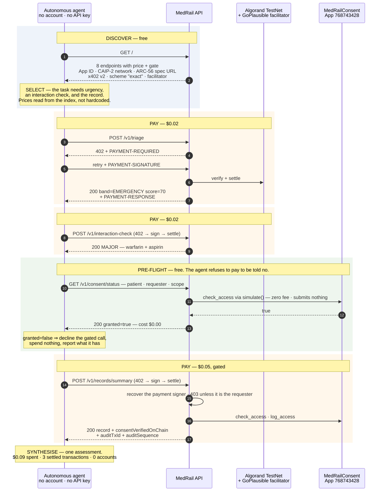
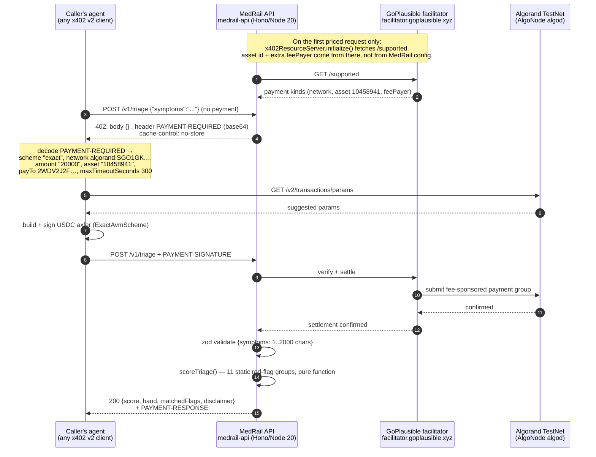
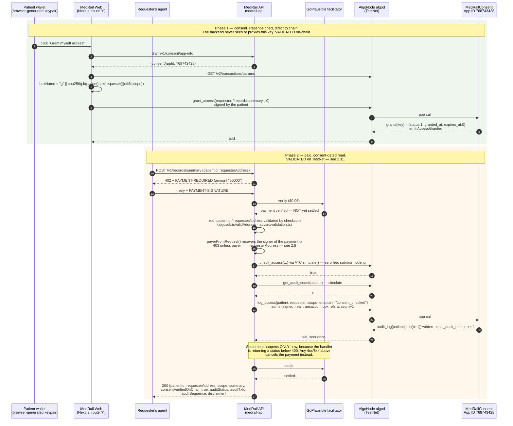
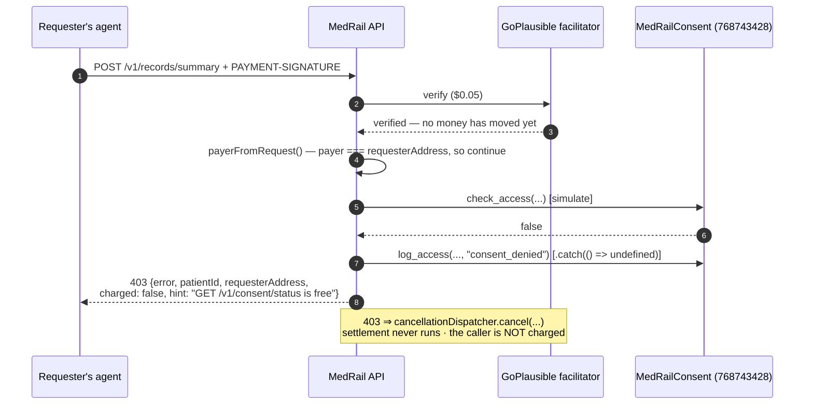
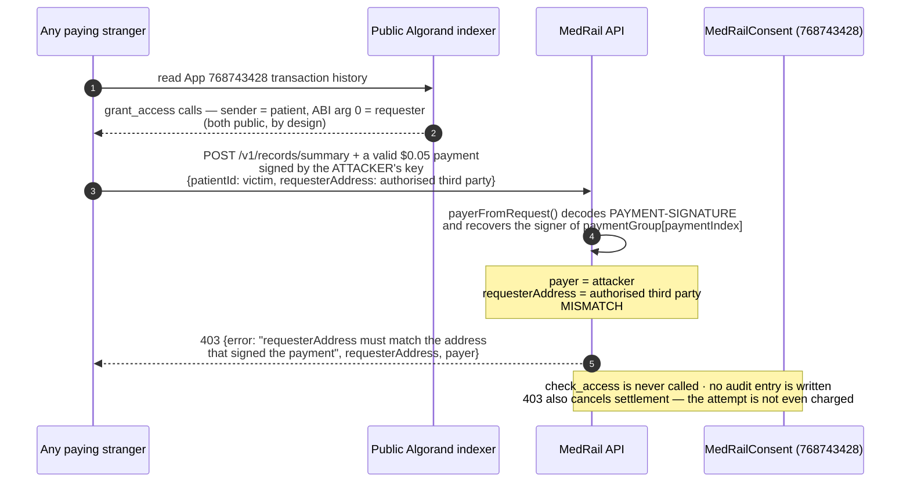
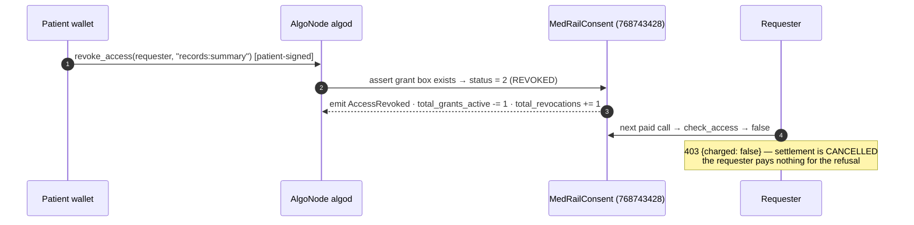

# MedRail — User Journeys

**Purpose:** Trace the two end-to-end journeys the system supports — an autonomous agent completing a multi-service clinical task, and a patient granting consent so a requester can read a record summary — from discovery through repeat, against the endpoints that actually exist.

**Status of this document:** Authored 2026-08-21 against the verified fact ledger and source at commit `3b387df`, with **Journey A promoted from a single paid call to the full agent arc** once `api/scripts/agent-demo.ts` had been run against live TestNet. Every step is marked with its verification status. **Journey B's success path has also been executed on Algorand TestNet** — `total_audit_entries = 5` on App `768743428`, with both `s`- and `a`-prefixed boxes present (`docs/PROOF.md` §9). No latency, throughput, or duration figure appears here except the measurements that exist in the ledger, each labelled as a single observation.

---

## 0. The system these journeys run against

Fixed and non-negotiable for every diagram below:

| Element | Count | Detail |
|---|---|---|
| Priced endpoints | **3** | `POST /v1/triage` $0.02 · `POST /v1/interaction-check` $0.02 · `POST /v1/records/summary` $0.05 |
| Free `/v1/*` endpoints | **4** | `GET /v1/consent/status` · `GET /v1/consent/app-info` · `GET /v1/consent/arc56` · `GET /v1/health` |
| Free service index | 1 | `GET /` (`api/src/app.ts:149-177`) — listed separately from the four `/v1/*` routes so the counts reconcile. **This is the machine-readable entry point to everything below** |
| Smart contracts | **1** | `MedRailConsent`, App ID **768743428**, Algorand TestNet |
| Facilitators | **1** | GoPlausible, `https://facilitator.goplausible.xyz` |
| Databases, caches, queues, workers, models | **0** | None exist. State lives in Algorand box storage and two static files. |
| Web routes | **1** | `/` (`web/app/page.tsx`) |

---

## 1. Journey A — an autonomous agent completes a multi-service task

**Actor:** P-1, the autonomous agent and the primary persona ([`./User_Personas.md`](./User_Personas.md)).
**Overall status:** **VALIDATED** — walked end to end on live infrastructure by `api/scripts/agent-demo.ts`, and the underlying single-call settlement proven independently at tx `OYRQRKYA7WUKBVLWTOFJSJMZFBW7VCNGP5VGH5EBUJGRCVFQFJRQ`.

### 1.0 The whole arc, before the detail

The agent is handed one task — *sudden crushing chest pain and shortness of breath since this morning; the patient is on warfarin and aspirin 81mg* — and knows exactly one thing about MedRail: a base URL. Everything else it reads at runtime.



**The recorded run: $0.09 total, across 3 settled Algorand transactions. Zero accounts created, zero API keys issued, zero invoices.** The agent pays from its own keypair `UYBTLPHS6APCXVBDPASQMUIQCEORDIR6EMTVMNSDPSVRSR5HEPKQ5GO4YQ` — which this service does not control — to `payTo` `2WDV2J2F…`:

| Leg | Transaction | Amount | Round |
|---|---|---|---|
| $0.02 triage | `DOSKCNKJRXIMY2UDSDZ377LKPZQIZJW5JHCGUAGKOYV6KUCFYKIA` | 20000 µUSDC, `fee: 0` | 66563930 |
| $0.02 interactions | `PLBFDDADW576IUCH62HGGYI4AJQNO3QXSENNDIBKAORWVMP7NVHQ` | 20000 µUSDC | — |
| $0.05 record | `COMJ3TQOGTKP6LXDJS7HZY7B45QZJQWXXJ23HQ3IDDQYD7GRK36A` | 50000 µUSDC, `fee: 0` | 66563944 |
| the patient's grant to that agent | `IG4XEBTMRCKI724ZVHSYUN4ECTYBXAGZM5N35NP4Y3ZVWECG7WUQ` | `grant_access(UYBTLPHS…, "records:summary")` on App `768743428`, signed by the patient `56LFG5EE…` | 66563915 |

Sender ≠ receiver on every payment, confirmable on any public Algorand indexer. The earlier self-paid run of the same script (`POAQNSOP…`, `W3Z55BZY…`, `5CO5XV7M…`, audit entry `5HYV5B2L…`), and the two after it in which the service still stood in as the patient, are retained rather than replaced. Reproduce with `cd api && npx tsx scripts/agent-demo.ts`.

**What this still is not.** The three roles are three separate accounts with three separate keypairs — the patient `56LFG5EE…` signs its own grant and is neither the payer nor the payee — but the agent's TestNet USDC float was seeded from the project's own wallet, and the patient wallet was funded the same way, because TestNet ALGO and USDC have no other practical source. **No external or unrelated party has paid for this service** ([`../PROOF.md`](../PROOF.md) §10).

**Two things about this arc are worth naming before the step-by-step detail.**

*The free pre-flight is a design decision, not a convenience.* An agent that pays $0.05 to receive a 403 has learned the same thing for money that it could have learned for nothing. `GET /v1/consent/status` exists so the spend decision can be made before the spend. Note that the caller is protected either way — a 403 cancels settlement, so a refused gated call costs nothing (§2.7) — so the pre-flight saves a round trip rather than a refund. What it actually buys is the ability to *reason*: `agent-demo.ts`'s `if (!status.granted)` branch declines the call, spends nothing, and reports the assessment it can still make. That is the difference between an agent and a retry loop.

*Nothing in this journey requires MedRail-specific client code.* The agent uses a stock `@x402/fetch` client. That is a consequence of ADR-005: the audit write is a **follow-up transaction submitted by MedRail**, not a leg in the caller's signed payment group, precisely because bundling it would force every caller to know MedRail's App ID, the `log_access` ABI signature, and a *predicted* box reference — which off-the-shelf x402 clients cannot produce. The cost of that choice is that "one call" describes the HTTP interaction and not the ledger (two transactions, moments apart). The benefit is this journey being walkable by a program that had never heard of MedRail one request earlier.

### 1.1 Discovery

| Step | Surface | Status |
|---|---|---|
| Agent learns the base URL | Out of band today. Bazaar listing and the `x402-global-challenge` tag are pending operator action; `@x402/extensions` is declared in `api/package.json` but imported nowhere in `api/src` | **NOT IMPLEMENTED** (DOC-9) |
| Agent reads the endpoint catalogue | `GET /` → `{service, description, endpoints[8], contract, x402, docs}` (`api/src/app.ts:149-177`). Each entry carries `method`, `path`, `price` and `gate`; `contract` supplies `appId`, `network`, `networkCaip2` and `arc56SpecUrl`, and `x402` supplies `version: 2`, `scheme: "exact"` and the facilitator. An earlier revision advertised only five routes and omitted both blocks; `api/test/app.spec.ts` now asserts the advertised list equals the mounted set, so it cannot drift again (G-34 closed) | FR-017 **VALIDATED** |
| Agent confirms liveness and network | `GET /v1/health` → `{ok, service:"medrail-api", network, consentAppId, time}` | FR-016 **VALIDATED** |
| Agent learns the price | **From the 402 itself.** No pre-registration, no price list to fetch. | FR-002 **VALIDATED** |

Discovery has no human step. There is no sign-up page, because there is no account. **Proven unassisted:** `agent-demo.ts` step 1 fetches `GET /` and prints back the endpoint count, the x402 version and scheme, the facilitator, the App ID and the ARC-56 spec URL — none of which appear anywhere in the script.

**The one unsolved step in this journey.** Everything after "the agent has the base URL" is demonstrated. Obtaining the base URL is not: nothing is publicly hosted, there is no Bazaar listing, and `@x402/extensions` is a declared dependency that `api/src` never imports (DOC-9). An agent that already knows where to look can do the rest by itself; an agent that does not, cannot start. That is the honest shape of the discovery claim (F-1 in §4).

### 1.1a Capability selection — deciding what the task needs

Between reading the catalogue and spending anything, the agent chooses. This is a real step, not a formality, and it is what the shape of `GET /` is designed to support.

| Signal in the index | What the agent does with it |
|---|---|
| `price` per endpoint | Budgets before calling. `agent-demo.ts` resolves each price out of the discovered index (`priceOf`) rather than hard-coding it, so a server-side price change changes the agent's spend with no client change. |
| `gate` per endpoint — `"x402"` vs `"x402 + on-chain consent"` | Distinguishes *"I can buy this"* from *"I can buy this only if the patient allowed me."* That single field is why the agent knows to run the free pre-flight in §1.1b before the third call rather than discovering the refusal by paying for it. |
| `contract.appId` + `contract.arc56SpecUrl` | Reserves the option of bypassing MedRail's API entirely and reading the consent registry directly. Not exercised by the demo — but advertised, and sufficient (UC-009). |
| `x402.version`, `x402.scheme`, `x402.facilitator` | Confirms it holds a compatible client before constructing anything. |

Status: **VALIDATED** (FR-017) — the index is asserted against the mounted route set by `api/test/app.spec.ts`, and consumed unassisted by `agent-demo.ts`.

### 1.1b Free pre-flight — the agent refuses to pay to be told no

*Grouped here with selection because it is a decision step, not a purchase. In the run it happens later — after the two open calls and immediately before the gated one (§1.0, step 5), because it is the only endpoint whose `gate` says money alone is not enough.*

Before the one gated call, the agent spends nothing to find out whether it is permitted:

```
GET /v1/consent/status?patient=<addr>&requester=<addr>&scope=records:summary  →  {granted: true|false}
```

Free, unauthenticated, no chain fee: `check_access` is `readonly=True` and runs through `AtomicTransactionComposer.simulate()`, which submits nothing (`api/src/services/algorand.ts:82-100`; FR-013, SEC-009). On `false` the agent declines the gated call, spends nothing, and reports the assessment it can make without the record.

Two clarifications that keep this claim honest. First, the caller is protected regardless — a 403 from the gated route cancels settlement, so a refused paid call costs nothing either (§2.7). The pre-flight saves a **round trip and a decision**, not a refund; the 403 body's `hint` points at this endpoint for exactly that reason. Second, "free" is free *to the agent*: the endpoint makes two outbound algod calls per request and is rate-limited to 60/min per client precisely because it is free (`api/src/rateLimit.ts`; SEC-013).

### 1.2 Onboarding

There is no onboarding *with MedRail*. What the agent needs is chain-side:

| Prerequisite | Why | Note |
|---|---|---|
| An Algorand account | To sign the payment transaction | Any keypair |
| Opted in to USDC ASA `10458941` | Algorand protocol rule: an account must opt in to an ASA before it can hold or send it | `contracts/scripts/opt_in_usdc.py` does this for the operator side |
| A USDC balance ≥ the price | 20000 base units for $0.02 at 6 decimals | TestNet USDC via `https://faucet.circle.com` (network "Algorand Testnet") per [`../DEPLOYMENT.md`](../DEPLOYMENT.md) |
| **No ALGO required** | The facilitator supplies `extra.feePayer` = `ZMFK2OI7ZBD2U27ISERZC4S6LKM6WMFJPZQ4MYNJDZ2VNBNMBA67RA22AA`; the settled transaction carries `fee: 0` | Facilitator feature, not MedRail's |
| An x402 v2 client | To parse `PAYMENT-REQUIRED` and emit `PAYMENT-SIGNATURE` | `@x402/fetch` or equivalent |

### 1.3–1.6 Primary workflow, system interaction, output

The arc in §1.0 makes three paid calls. They are the same handshake three times, so it is specified once here, against `POST /v1/triage`. `POST /v1/interaction-check` is identical but for the body and the handler; `POST /v1/records/summary` is the same handshake plus the payer binding, the consent read and the audit append, and is specified in full in §2.3–2.6.



**Evidence for each leg**

| Leg | Evidence | Status |
|---|---|---|
| 402 shape and headers | Live capture in ledger §4; asserted by `api/test/x402-flow.spec.ts` (`amount == "20000"`, `network` matches `/^algorand:/`) | FR-001, FR-002 **VALIDATED** |
| Facilitator registration | `api/src/x402.ts:6-14` — only the configured CAIP-2 network is registered, so a payment signed for the other network is not accepted (NFR-002) | **IMPLEMENTED** |
| Settlement | tx `OYRQRKYA7WUKBVLWTOFJSJMZFBW7VCNGP5VGH5EBUJGRCVFQFJRQ` — `axfer`, asset `10458941`, amount 20000, round 66091768, `fee: 0`, group `XQzhbjBAqt0AjC5AByQsCxGbMdEuca3ZZFMyFBTb7K4=`, note `x402-payment-v2-1786140083822` | FR-003 **VALIDATED** |
| Validation | `api/src/routes/triage.ts:5-7`. A rejection here is a 400, and a 400 cancels settlement — so a malformed body costs the caller nothing | FR-038 **IMPLEMENTED** |
| Scoring | `api/src/services/triageScorer.ts:53-73`; bands at `:46-51` | FR-004, FR-005, FR-006 **VALIDATED** |
| Disclaimer | `triageScorer.ts:18-21`, asserted by test | FR-009, AI-002 **VALIDATED** |

**Output.** A real recorded response (`contracts/artifacts/e2e-proof.json`, from `api/scripts/e2e-proof.ts`):

```json
{ "score": 70, "band": "emergency",
  "matchedFlags": ["possible cardiac chest pain", "respiratory distress"],
  "disclaimer": "MedRail triage is a transparent keyword heuristic for hackathon demonstration only. …" }
```

70 = 35 (chest pain) + 35 (respiratory distress), capped at 100 — reconstructible by hand from `triageScorer.ts:33-34`. That reconstructibility is the point of AI-001.

### 1.6a Synthesis — the step the whole journey exists for

Buying three results is not the task; producing one assessment is. `agent-demo.ts` closes by combining what it bought:

```
Urgency        : EMERGENCY (score 70/100)
Medication risk: MAJOR — warfarin + aspirin
Known allergies: penicillin
Comorbidities  : type 2 diabetes (controlled)

$0.02  triage              …
$0.02  interaction-check   …
$0.05  records/summary     …
─────
$0.09  total, across 3 settled Algorand transactions
```

Three things are worth stating plainly about that output, because they are exactly what a hostile reader should check:

- **The synthesis is the agent's, not MedRail's.** MedRail sells three results. It does not sell a combined judgement, and there is no orchestrator endpoint. Composition happens in the caller.
- **Neither intelligence endpoint is a model.** Both are deterministic rule engines — 11 hard-coded red-flag groups and 14 curated interaction pairs. **There is no LLM, no ML model, no embeddings and no vector store anywhere in this repository**, and each response carries a `disclaimer` saying so, asserted by test (AI-002 **VALIDATED**).
- **The record is a fixed synthetic constant.** `SYNTHETIC_RECORD` is returned regardless of `patientId` (`records.ts:17-23`). The allergies and comorbidities above are the same for every caller and every patient. There are no real patients in this system (DATA-004).

What the run does demonstrate is the thing the challenge asks about: a program discovered a service it had never seen, decided which parts of it the task required, paid for each per call, checked a permission before spending on a gated one, and finished — with no account, no API key, no invoice, and no human anywhere in the loop.

### 1.7 Feedback

| Signal | Where | Status |
|---|---|---|
| Settled transaction ID | `PAYMENT-RESPONSE` header on the 200 | **VALIDATED** |
| Independent confirmation | `curl https://testnet-idx.algonode.cloud/v2/transactions/<txid>`; explorer at `https://lora.algokit.io/testnet/transaction/<txid>` | **VALIDATED** |
| In the browser demo | `web/components/LiveDemoPanel.tsx:154-163` renders "view settled transaction on-chain →" | FR-034 **IMPLEMENTED** |
| Failure detail | `app.onError` (`api/src/app.ts:113-139`) logs the exception server-side against a generated `requestId` and returns a stable envelope — `{"error":{"code":"INTERNAL_ERROR","message":"An internal error occurred. Quote the requestId when reporting this.","retryable":true,"requestId":"…"}}`. Machine-actionable, and no internal exception text reaches the caller. Facilitator outages get their own code and a `Retry-After` (§1.8) | SEC-011 **IMPLEMENTED**; OPS-002 **PARTIALLY IMPLEMENTED** — structured error logs exist, but there are still no metrics, tracing, or alerting (G-15) |

### 1.8 Repeat

The server holds **no session, account, or persistent request state** (NFR-001 **IMPLEMENTED** — there is no datastore to hold it in). Every call repeats the full 402 → sign → settle handshake. That is a deliberate property: the unit of commerce is the call.

**What breaks on repeat**

| Condition | Actual behaviour | ID |
|---|---|---|
| Facilitator unreachable | **HTTP 503** with `Retry-After: 30` and `{"error":{"code":"PAYMENT_FACILITATOR_UNAVAILABLE","retryable":true,"facilitator":"…"}}`. A wrapper around the payment middleware (`api/src/app.ts:73-105`) matches exactly the `"no supported payment kinds" / "Failed to initialize"` condition and re-throws everything else. The underlying coupling is unavoidable — `accepts[].asset` and `extra.feePayer` come from `/supported`, so the 402 genuinely cannot be constructed offline — but a retryable outage now *reads* as a retryable outage to an agent | REL-001 **IMPLEMENTED** (G-04 closed) |
| Free routes during that outage | `/v1/health`, `/`, `/v1/consent/app-info` verified still 200 | REL-005 **VALIDATED** |
| High call rate on the free surface | **429** with `Retry-After` and `{"error":{"code":"RATE_LIMITED",…}}`. Fixed-window, in-memory: `/v1/consent/status` 60/min, `/v1/consent/arc56` and `/v1/records/summary` 30/min (`api/src/app.ts:44-46`, `api/src/rateLimit.ts`). Priced happy paths are deliberately unthrottled — a caller must settle USDC for each one, so they are economically self-limiting | SEC-013 **IMPLEMENTED** (G-09 closed) |
| Malformed body | 400 with `zod` flatten output (`triage.ts:13-15`), settlement cancelled | Correct |

### 1.9 Journey A in the browser

`web/components/LiveDemoPanel.tsx` runs the same flow from a page: pick an endpoint, click *Pay $0.02 and call live*. The payment is signed by a keypair the browser generated (`web/lib/demoWallet.ts:13-27`, stored as plaintext JSON in `sessionStorage`, TestNet-only and disclosed as such). A `402` on the retry is surfaced as an explanation rather than an error — "a real payment was constructed and signed by your demo wallet, but settlement was rejected — almost always because the wallet has no TestNet USDC yet" (`LiveDemoPanel.tsx:165-170`), matching the captured behaviour in [`../PROOF.md`](../PROOF.md) §4. `web/lib/x402Client.ts:33-34` deliberately skips `getPaymentSettleResponse` on a non-200, because a 402 means signed-but-unsettled and there is no `PAYMENT-RESPONSE` to parse.

---

## 2. Journey B — a patient grants consent, then a requester reads a record summary

**Actors:** P-2 (patient) and P-3 (requesting clinician / care app).
**Overall status:** **VALIDATED.** Both halves are proven on-chain. The consent lifecycle was demonstrated first; the paid-read half has since completed successfully against the deployed contract, producing a settled payment and an audit append in the same call (`docs/PROOF.md` §9).

### 2.1 Discovery

| Step | Surface | Status |
|---|---|---|
| Patient finds the demo | `web/app/page.tsx` — one route, `/` | FR-033/FR-036/FR-037 **IMPLEMENTED** |
| Patient/requester learns the App ID | `GET /v1/consent/app-info` → `{network, networkCaip2, consentAppId, arc56SpecUrl}` | FR-014 **IMPLEMENTED** |
| A third party learns the ABI without cloning the repo | `GET /v1/consent/arc56` serves the compiled ARC-56 spec from disk (`api/src/app.ts:63-69`); 404 if the contract has not been compiled | FR-015 **IMPLEMENTED** |
| Requester checks a grant before paying | `GET /v1/consent/status?patient=&requester=&scope=` — free | FR-013 **IMPLEMENTED** |

### 2.2 Onboarding

| Party | Needs | Evidence |
|---|---|---|
| Patient | An Algorand keypair and enough ALGO for one app-call fee | Demo: `web/lib/demoWallet.ts:13-27`; fund at `https://lora.algokit.io/testnet/fund` (`web/lib/config.ts:13`) |
| Requester | A funded, USDC-opted-in account for the $0.05 call | As Journey A |
| Neither | **Any opt-in to the application.** Box storage means a `(patient, requester, scope)` triple exists without either party opting in — rationale at `contract.py:11-17` | — |
| App account | Enough ALGO for box MBR — the app funds its own boxes | `contract.py:129-138` (`fund_mbr`); app account holds 5,000,000 µALGO, min-balance 145,000 with 2 boxes |

**Gap:** there is no real-wallet path. `web/lib/demoWallet.ts:12` references `lib/walletConnect.ts`, which **does not exist**; `docs/IMPLEMENTATION_PLAN.md` §4 claims that path "is also implemented" — it is not (DOC-4). Outside the TestNet demo, this persona has no way in.

### 2.3–2.6 Primary workflow, system interaction, output



**Read the ordering carefully — it is the opposite of what it looks like.** `paymentMiddleware` is registered on `*` ahead of every route, so it is natural to assume the money moves before the handler runs. It does not. `@x402/hono` *verifies* on the way in and *settles* on the way out, and it reaches `processSettlement` only when the handler returns a status below 400 — anything else dispatches `cancellationDispatcher.cancel(...)` and returns first. Every rejection in this diagram therefore costs the caller nothing, and no error path in MedRail can consume a settled payment. That is an inherited property of x402 v2, not MedRail engineering, and it is worth naming as such: **REL-002 is VALIDATED, satisfied structurally by the SDK.**

**Evidence, leg by leg**

| Leg | Evidence | Status |
|---|---|---|
| Patient-signed grant | `web/lib/consent.ts:44-68`; `contract.py:148-176`; tx `X2BQ5FD4MW52B75WQGDB67TEULYLN7FHVFO6ZOBNI74PNCAKVOUA` round 66088672 | FR-018, FR-035, SEC-003 **VALIDATED** |
| Backend never holds the key | No key-ingress path in `api/src`; verified | NFR-008 **IMPLEMENTED** |
| Box-key derivation | `contract.py:95-98` · `api/src/services/algorand.ts:63-79` · `web/lib/consent.ts:26-34` — three independent implementations, now pinned to **one shared golden-vector fixture**, `api/test/fixtures/box-key-vectors.json`, asserted by `api/test/boxKeyParity.spec.ts` (Node `createHash` *and* browser `crypto.subtle` paths) and by `contracts/tests/test_box_keys.py` (Python path) | NFR-011 **VALIDATED** (G-08 closed) |
| Payer binding | `api/src/x402Payer.ts` → `records.ts:41-51`; `api/test/x402Payer.spec.ts` (6 cases); verified live by `api/scripts/verify-g01-fix.ts` | FR-039, SEC-007, SEC-008 **VALIDATED** (G-01 closed) |
| 402 at $0.05 | `api/src/app.ts:54-57`; `x402-flow.spec.ts` asserts `amount == "50000"` | FR-001 **VALIDATED** |
| Consent evaluation | `api/src/routes/records.ts:53` → `algorand.ts:82-100`, `atc.simulate()` | FR-010 **VALIDATED**; SEC-009 **IMPLEMENTED** |
| Audit append | `api/src/routes/records.ts:83-99` → `algorand.ts:146-179`; `contract.py:217-236`; audit tx `4YLKLQKKWXXFW3UT5APJVYKXI7T7A6OACTAWCC5YBAN3XGOGHRVQ` at sequence 1 | FR-012, FR-025 **VALIDATED on-chain** |
| Response payload | `records.ts:101-111`; `summary` is the fixed `SYNTHETIC_RECORD` (`:17-23`) regardless of `patientId` | DATA-004 **IMPLEMENTED** |

### 2.7 The denied branch



**Who actually pays for a denial.** Earlier project documentation — `../API.md`, `../SECURITY.md` §"consent-denied calls are not charged" — described the caller as billed either way, and the response carried `charged: false`. **That was never what the code did.** A 403 cancels settlement, so the caller pays nothing; the field is gone, replaced by `charged: false` and a pointer to the free pre-flight check. The real cost runs the other way: `records.ts:58` submits a genuine `logAccess` transaction whose Algorand fee MedRail's operator account pays. A denial is free to the caller and costs MedRail one chain fee — which is why this route carries a **30 requests/minute** limit (`api/src/app.ts:46`). FR-011 **VALIDATED**.

**Note the asymmetry, which has narrowed but not closed.** On the denied path `logAccess` is wrapped in `.catch(() => undefined)` (`records.ts:58`) — silent, with no log, metric, or alert, so a lost denial record is invisible (G-15). On the allowed path it is now wrapped in `try/catch` (`records.ts:83-99`), which returns **200** with `auditStatus: "pending"` and emits a structured `audit_write_failed` event. Neither path can cost the caller money — settlement is cancelled on any status ≥ 400 — but only one of them tells anybody when the trail failed to record.

### 2.8 The impersonation branch — the attack this journey is designed to reject



The x402 middleware proves *a* payment is valid; it does not tell the handler *who* paid. `payerFromRequest` (`api/src/x402Payer.ts`) asks. It decodes the verified `PAYMENT-SIGNATURE` header, reads the AVM `exact` payload `{paymentGroup, paymentIndex}`, and recovers the sender of the one leg the caller actually signed — the other legs of the atomic group are the facilitator's fee-payer transactions and identify nobody relevant. `records.ts:41-51` then returns 403 unless that address equals the asserted `requesterAddress`, and treats a `null` recovery as a mismatch, so an unreadable header denies rather than defaults.

**Why this is a satisfying fix rather than a patch.** MedRail has no accounts, no API keys, and no sessions, so there is apparently no identity to check `requesterAddress` against. But an x402 payment *is* a signed Algorand transaction, and a signature is an identity assertion — the credential was already in the request, unread. Recovering it costs one header decode and converts a paywall into an authorisation check with no account system and no server-side state. The same stranger-callable property that created the attack surface is what makes the defence free.

**Verified live, with a control.** `api/scripts/verify-g01-fix.ts` grants a real third-party requester consent on App `768743428` (grant tx `PCPVK3FLKP55L3FHCFIIF7QBYUPV5BHKSKYJTUIL6J4Q23HKNFDQ`), pays from a different key while asserting that third party, and confirms the **403**; it then repeats with payer and requester matched and confirms a **200** carrying settled tx `QZIQWHN553Q3QYJ4NJ5GP3QIROP6BE2DD45P3IUSHUOGEB7VLVSQ` and audit tx `OYNWBHJTS4LCIW2KQKOM2CEZGIFPRCZLVBVCDDG3GGNWKWDKNBGA`. Raw output in `contracts/artifacts/g01-verification.json`.

**Status:** SEC-006, SEC-007, SEC-008 and FR-039 **VALIDATED**. See [`./Use_Cases.md`](./Use_Cases.md) UC-011.

### 2.9 Output and feedback — and what is not there

| Signal | Intended | Actual |
|---|---|---|
| `consentVerifiedOnChain: true` | Confirms a live contract read | Present in the response shape (`records.ts:106`) and produced by real runs |
| `auditTxId`, `auditSequence` | A verifiable receipt of the access | Documented in [`../API.md`](../API.md) and **produced by real runs** — first at `4YLKLQKK…` / sequence `1` |
| `auditStatus` | Tells the caller whether the receipt is real yet | `"recorded"` when the append confirmed, `"pending"` when it failed — in which case the record is still returned with HTTP 200 and null `auditTxId`/`auditSequence` (`records.ts:83-99`). A caller can distinguish "you have a receipt" from "you have the data, the receipt is outstanding" without parsing an error |
| Patient sees the access | `get_audit_count` / `get_audit_entry` exist on-chain (FR-028 **VALIDATED**) and `getAuditCount` exists in the backend (`algorand.ts:103-121`) | **No endpoint and no UI exposes either.** There are now 5 entries to show and no surface that shows them |
| Grant status read-back | `GET /v1/consent/status`; `ConsentChecker.tsx:44-48` re-checks after every grant/revoke | **IMPLEMENTED**. One cold observation of 505 ms (two sequential algod round-trips) — a single sample, **not** a p50/p95/p99 and not a benchmark |

### 2.10 Repeat and revocation



- Revocation: `contract.py:178-195`; tx `OV2J2T5VWMIQG64JYGL7JEGZKKNZNKCMNIQU6AC4PDRQYZ6ZOO5A` round 66088674. FR-020 **VALIDATED**.
- Revoking a non-existent grant fails atomically (`contract.py:182`). FR-021 **VALIDATED**.
- Re-granting reactivates the same box and restores the active counter exactly once — the counter keys off prior *status*, not prior *existence* (`contract.py:157-167`). FR-022 **VALIDATED**.
- Expiry: `duration_seconds == 0` never expires; otherwise `Global.latest_timestamp < expires_at` (`contract.py:206-209`). FR-019 **VALIDATED** — **but unreachable from the UI**, which hard-codes `0` (`ConsentChecker.tsx:32`).

### 2.11 The live state of App 768743428, read from the indexer

```
total_requests       = 2
total_grants_active  = 4
total_revocations    = 2
total_audit_entries  = 5     ← the audit path has run, repeatedly
boxes                  "g"-prefixed grants, plus "s" audit-sequence and "a" audit-entry boxes
```

Journey B has been walked end to end and is repeatable: `api/scripts/e2e-consent-proof.ts` performs grant → free status check → paid call → audit append against the live contract in one run. The box shapes match what the design predicts — `a` entries at `1 + 32 (patient) + 8 (itob seq)` = 41 bytes, `s` sequences at `1 + 32` = 33 bytes, `g` grants at `1 + 32 (sha256)` = 33 bytes — and the app account's minimum balance reconciles exactly against `2500 × boxes + 400 × box-bytes` (`docs/PROOF.md` §9).

**What still must be said in any presentation of Journey B:** the gated call now settles between distinct accounts — the agent `UYBTLPHS…` pays, `2WDV2J2F…` receives (`COMJ3TQO…`, round 66563944) — but that agent's TestNet USDC float came from the project's own wallet, so **no external or unrelated party has paid**; earlier runs were outright self-payments; nothing is publicly hosted; there is no MainNet deployment and no Bazaar listing. The mechanism is proven. The adoption is not.

---

## 3. Journey comparison

Journey A's third paid call *is* Journey B's second half — the same route, seen from the agent's side rather than the patient's. The comparison below is therefore between the two **open** intelligence calls that carry Journey A's volume and the **gated** call that carries Journey B's ownership proof.

| Dimension | Journey A — open intelligence calls | Journey B — consent-gated read |
|---|---|---|
| Price | $0.02 (20000 µUSDC) each | $0.05 (50000 µUSDC) |
| Prerequisite relationship | None | An existing on-chain grant |
| Chain reads per call | 0 | 2 simulated (`check_access`, `get_audit_count`) |
| Chain writes per call | 0 (beyond the payment itself) | 1 (`log_access`, admin-signed) |
| Server state | None | None — everything is on-chain |
| Proven end-to-end on TestNet | **Yes** | **Yes** |
| Test coverage | 5 structural x402 tests + 13 pure-function tests | 6 payer-binding tests, 14 box-key parity tests, 7 app-surface tests, plus the live `e2e-consent-proof.ts` and `verify-g01-fix.ts` runs |
| Volume potential | Any agent, any time | Bounded by real patient–requester relationships |
| Failure with facilitator down | 503 + `Retry-After` | 503 + `Retry-After` |
| Worst remaining failure mode | A rejected transaction on a thinly-covered chain client (G-05) | Audit append silently deferred to `auditStatus: "pending"` with no alerting (G-15) |

The asymmetry is the product argument, made in [`../JUDGES.md`](../JUDGES.md) and analysed in [`./USP_Novelty.md`](./USP_Novelty.md): the gated call is the story, the open calls are the volume, and the same contract underwrites both. What §1.0 adds is that **one agent, on one task, uses both** — so the split is not two products sharing a repository, it is one catalogue an agent shops from.

---

## 4. Cross-journey friction log

Resolved entries are kept rather than deleted, because a friction log that quietly drops its own closed items stops being checkable.

| # | Friction | Journey | Status |
|---|---|---|---|
| F-1 | No external discovery mechanism — the URL must be known already | A, B | **Half closed.** *Self*-discovery works and is proven: `GET /` describes all eight routes with prices and gates plus the contract's App ID and ARC-56 spec URL, and `agent-demo.ts` consumes it with nothing hardcoded but the base URL (§1.1). *Finding* the URL is still unsolved — nothing is publicly hosted, there is no Bazaar listing, and `@x402/extensions` is declared but never imported (DOC-9) |
| F-2 | No public endpoint deployed | A, B | **Partly closed.** `api/fly.toml` now sets `NETWORK = "testnet"`, `CONSENT_APP_ID = "768743428"`, a `/v1/health` check and `max_machines_running = 1`; both Dockerfiles use `npm ci` and `.dockerignore` files exist. The configuration is correct — nothing is deployed to it yet |
| F-3 | Facilitator outage ⇒ 500, not 503 | A, B | **Closed** (G-04). 503 + `Retry-After: 30` + `PAYMENT_FACILITATOR_UNAVAILABLE` |
| F-4 | Invalid-but-58-char address ⇒ 500 with an internal message leaked | B | **Closed** (G-10). Checksum validation in `api/src/validation.ts` ⇒ 400; `app.onError` returns a generic body with a `requestId` |
| F-5 | Settled payment can be lost on the success path | B | **Withdrawn — the finding was wrong.** Settlement is unreachable on a status ≥ 400. REL-002 **VALIDATED** by the SDK. The residual risk was the lost *sale*, and that is now handled by `auditStatus: "pending"` |
| F-6 | Requester identity unauthenticated | B | **Closed** (G-01). `api/src/x402Payer.ts`, verified live by `api/scripts/verify-g01-fix.ts` |
| F-7 | No real wallet; the demo keypair is the only path | B | **Open** (DOC-4). `web/lib/demoWallet.ts:12` still references a `lib/walletConnect.ts` that does not exist |
| F-8 | The audit trail has no read surface | B | **Half closed.** There are 5 entries on-chain now, and still no endpoint or UI that reads them |
| F-9 | No rate limiting on the free consent lookup | B | **Closed** (G-09). 60/min on `/v1/consent/status`, 30/min on `/v1/consent/arc56` and `/v1/records/summary` |
| F-10 | UI supports only self-granting, duration hard-coded to 0 | B | **Open.** The two-party flow and the expiry behaviour are both **VALIDATED** in the contract and unreachable from the browser |
| F-11 | Three independent box-key derivations with no cross-check test | B | **Closed** (G-08). One shared golden-vector fixture asserted from all three runtimes |
| F-12 | No metrics, tracing, or alerting anywhere | A, B | **Open** (G-15). Structured JSON error logs exist; nothing consumes them |

---

## 5. Related documents

[`./Problem_Statement.md`](./Problem_Statement.md) · [`./Project_Vision.md`](./Project_Vision.md) · [`./User_Personas.md`](./User_Personas.md) · [`./Use_Cases.md`](./Use_Cases.md) · [`./Scope.md`](./Scope.md) · [`./USP_Novelty.md`](./USP_Novelty.md) · [`../API.md`](../API.md) · [`../ARCHITECTURE.md`](../ARCHITECTURE.md) · [`../PROOF.md`](../PROOF.md)
