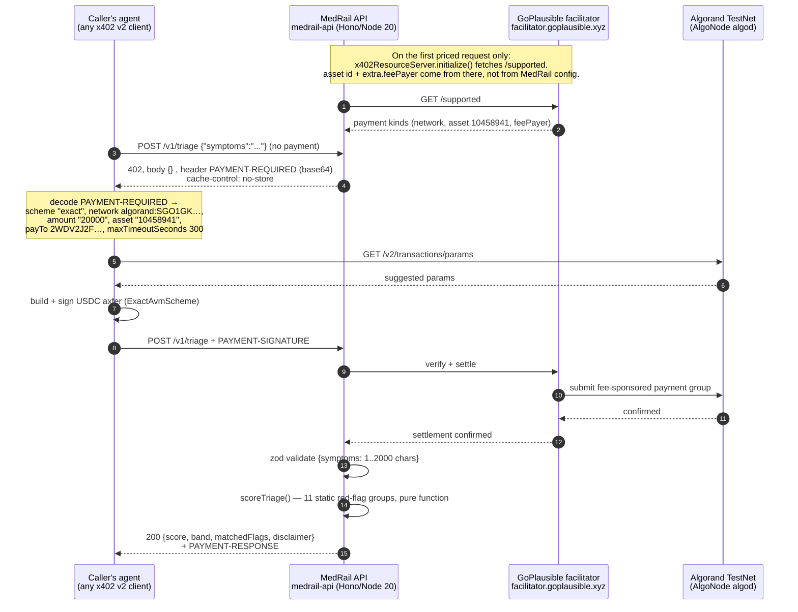
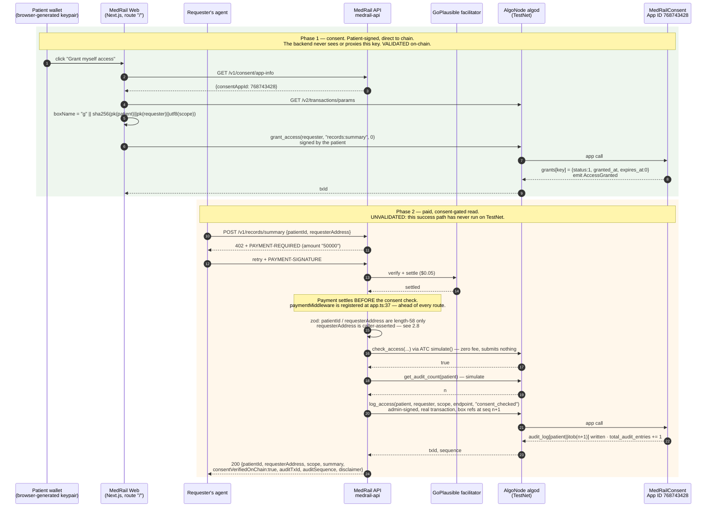
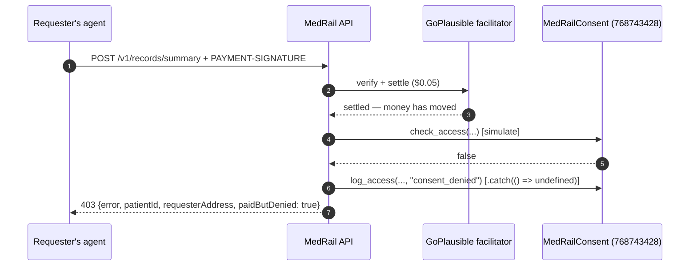
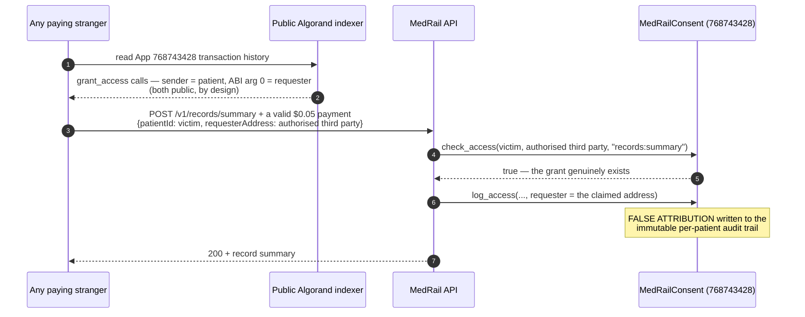
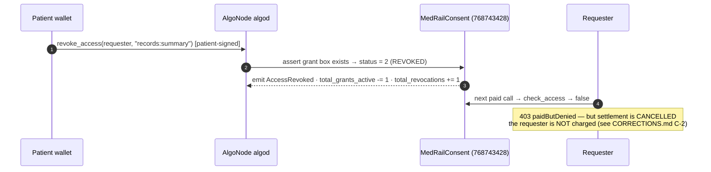

# MedRail — User Journeys


> **⚠ Correction notice.** Parts of this document were written against a review finding that was
> later proven wrong. Settlement in x402 v2 happens **only** on a sub-400 response, so **no error
> path in MedRail can consume a settled payment** — and consent-denied calls (HTTP 403) are **not
> charged**, contrary to `API.md`, `SECURITY.md`, and the `paidButDenied` field. The audit-sequence
> race causes a **rejected transaction**, not a corrupted log. See
> [`CORRECTIONS.md`](../CORRECTIONS.md) — it supersedes any statement here that contradicts it.

**Purpose:** Trace the two end-to-end journeys the system supports — an agent paying for a triage call, and a patient granting consent so a requester can read a record summary — from discovery through repeat, against the endpoints that actually exist.

**Status of this document:** Authored 2026-08-21 against the verified fact ledger and source at commit `32ffd73`. Every step is marked with its verification status. **Journey B's success path has never been executed on Algorand TestNet** — `total_audit_entries == 0` on App `768743428` and there are zero `s`- or `a`-prefixed boxes (ledger §3, finding E-1). Read §3.9 before treating Journey B as demonstrated. No latency, throughput, or duration figure appears here except the four measurements that exist in the ledger, each labelled as a single observation.

---

## 0. The system these journeys run against

Fixed and non-negotiable for every diagram below:

| Element | Count | Detail |
|---|---|---|
| Priced endpoints | **3** | `POST /v1/triage` $0.02 · `POST /v1/interaction-check` $0.02 · `POST /v1/records/summary` $0.05 |
| Free `/v1/*` endpoints | **4** | `GET /v1/consent/status` · `GET /v1/consent/app-info` · `GET /v1/consent/arc56` · `GET /v1/health` |
| Free service index | 1 | `GET /` (`api/src/app.ts:71-84`) — listed separately from the four `/v1/*` routes so the counts reconcile |
| Smart contracts | **1** | `MedRailConsent`, App ID **768743428**, Algorand TestNet |
| Facilitators | **1** | GoPlausible, `https://facilitator.goplausible.xyz` |
| Databases, caches, queues, workers, models | **0** | None exist. State lives in Algorand box storage and two static files. |
| Web routes | **1** | `/` (`web/app/page.tsx`) |

---

## 1. Journey A — an agent pays for a triage call

**Actor:** P-1, autonomous agent / third-party developer ([`./User_Personas.md`](./User_Personas.md)).
**Overall status:** **VALIDATED** — this is the only journey proven end-to-end on live infrastructure (tx `OYRQRKYA7WUKBVLWTOFJSJMZFBW7VCNGP5VGH5EBUJGRCVFQFJRQ`).

### 1.1 Discovery

| Step | Surface | Status |
|---|---|---|
| Agent learns the base URL | Out of band today. Bazaar listing and the `x402-global-challenge` tag are pending operator action; `@x402/extensions` is declared in `api/package.json` but imported nowhere in `api/src` | **NOT IMPLEMENTED** (DOC-9) |
| Agent reads the endpoint catalogue | `GET /` → `{service, description, endpoints[5], docs}` (`api/src/app.ts:71-84`) | FR-017 **IMPLEMENTED** |
| Agent confirms liveness and network | `GET /v1/health` → `{ok, service:"medrail-api", network, consentAppId, time}` | FR-016 **VALIDATED** |
| Agent learns the price | **From the 402 itself.** No pre-registration, no price list to fetch. | FR-002 **VALIDATED** |

Discovery has no human step. There is no sign-up page, because there is no account.

### 1.2 Onboarding

There is no onboarding *with MedRail*. What the agent needs is chain-side:

| Prerequisite | Why | Note |
|---|---|---|
| An Algorand account | To sign the payment transaction | Any keypair |
| Opted in to USDC ASA `10458941` | Algorand protocol rule: an account must opt in to an ASA before it can hold or send it | `contracts/scripts/opt_in_usdc.py` does this for the operator side |
| A USDC balance ≥ the price | 20000 base units for $0.02 at 6 decimals | TestNet USDC via `https://faucet.circle.com` (network "Algorand Testnet") per [`../DEPLOYMENT.md`](../DEPLOYMENT.md) |
| **No ALGO required** | The facilitator supplies `extra.feePayer` = `ZMFK2OI7ZBD2U27ISERZC4S6LKM6WMFJPZQ4MYNJDZ2VNBNMBA67RA22AA`; the settled transaction carries `fee: 0` | Facilitator feature, not MedRail's |
| An x402 v2 client | To parse `PAYMENT-REQUIRED` and emit `PAYMENT-SIGNATURE` | `@x402/fetch` or equivalent |

### 1.3–1.6 Primary workflow, system interaction, output



**Evidence for each leg**

| Leg | Evidence | Status |
|---|---|---|
| 402 shape and headers | Live capture in ledger §4; asserted by `api/test/x402-flow.spec.ts` (`amount == "20000"`, `network` matches `/^algorand:/`) | FR-001, FR-002 **VALIDATED** |
| Facilitator registration | `api/src/x402.ts:6-14` — only the configured CAIP-2 network is registered, so a payment signed for the other network is not accepted (NFR-002) | **IMPLEMENTED** |
| Settlement | tx `OYRQRKYA7WUKBVLWTOFJSJMZFBW7VCNGP5VGH5EBUJGRCVFQFJRQ` — `axfer`, asset `10458941`, amount 20000, round 66091768, `fee: 0`, group `XQzhbjBAqt0AjC5AByQsCxGbMdEuca3ZZFMyFBTb7K4=`, note `x402-payment-v2-1786140083822` | FR-003 **VALIDATED** |
| Validation | `api/src/routes/triage.ts:5-7` | FR-038 **PARTIALLY IMPLEMENTED** |
| Scoring | `api/src/services/triageScorer.ts:53-73`; bands at `:46-51` | FR-004, FR-005, FR-006 **VALIDATED** |
| Disclaimer | `triageScorer.ts:18-21`, asserted by test | FR-009, AI-002 **VALIDATED** |

**Output.** A real recorded response (`contracts/artifacts/e2e-proof.json`, from `api/scripts/e2e-proof.ts`):

```json
{ "score": 70, "band": "emergency",
  "matchedFlags": ["possible cardiac chest pain", "respiratory distress"],
  "disclaimer": "MedRail triage is a transparent keyword heuristic for hackathon demonstration only. …" }
```

70 = 35 (chest pain) + 35 (respiratory distress), capped at 100 — reconstructible by hand from `triageScorer.ts:33-34`. That reconstructibility is the point of AI-001.

### 1.7 Feedback

| Signal | Where | Status |
|---|---|---|
| Settled transaction ID | `PAYMENT-RESPONSE` header on the 200 | **VALIDATED** |
| Independent confirmation | `curl https://testnet-idx.algonode.cloud/v2/transactions/<txid>`; explorer at `https://lora.algokit.io/testnet/transaction/<txid>` | **VALIDATED** |
| In the browser demo | `web/components/LiveDemoPanel.tsx:154-163` renders "view settled transaction on-chain →" | FR-034 **IMPLEMENTED** |
| Rich failure detail | **Missing.** `app.onError` returns `err.message` verbatim with status 500 (`api/src/app.ts:58-61`) — no error code, no correlation ID, no `Retry-After` | SEC-011, OPS-002 **NOT IMPLEMENTED** |

### 1.8 Repeat

The server holds **no session, account, or persistent request state** (NFR-001 **IMPLEMENTED** — there is no datastore to hold it in). Every call repeats the full 402 → sign → settle handshake. That is a deliberate property: the unit of commerce is the call.

**What breaks on repeat**

| Condition | Actual behaviour | Should be | ID |
|---|---|---|---|
| Facilitator unreachable | **HTTP 500**, no `PAYMENT-REQUIRED`, no `Retry-After`. Reproduced by the reviewer: `initialize()` throws `"no supported payment kinds loaded from any facilitator."` Root cause: `accepts[].asset` and `extra.feePayer` come from `/supported`, so the 402 cannot be constructed offline. | 503 + `Retry-After`, or a cached `/supported` | REL-001 **NOT IMPLEMENTED** (R-1) |
| Free routes during that outage | `/v1/health`, `/`, `/v1/consent/app-info` verified still 200 | — | REL-005 **VALIDATED** |
| High call rate | No throttle of any kind | A documented quota | SEC-013 **NOT IMPLEMENTED** |
| Malformed body | 400 with `zod` flatten output (`triage.ts:13-15`) | — | Correct |

### 1.9 Journey A in the browser

`web/components/LiveDemoPanel.tsx` runs the same flow from a page: pick an endpoint, click *Pay $0.02 and call live*. The payment is signed by a keypair the browser generated (`web/lib/demoWallet.ts:13-27`, stored as plaintext JSON in `sessionStorage`, TestNet-only and disclosed as such). A `402` on the retry is surfaced as an explanation rather than an error — "a real payment was constructed and signed by your demo wallet, but settlement was rejected — almost always because the wallet has no TestNet USDC yet" (`LiveDemoPanel.tsx:165-170`), matching the captured behaviour in [`../PROOF.md`](../PROOF.md) §4. `web/lib/x402Client.ts:33-34` deliberately skips `getPaymentSettleResponse` on a non-200, because a 402 means signed-but-unsettled and there is no `PAYMENT-RESPONSE` to parse.

---

## 2. Journey B — a patient grants consent, then a requester reads a record summary

**Actors:** P-2 (patient) and P-3 (requesting clinician / care app).
**Overall status:** **PARTIALLY VALIDATED.** The consent half is proven on-chain. The paid-read half is **UNVALIDATED**: it has never completed successfully against the deployed contract.

### 2.1 Discovery

| Step | Surface | Status |
|---|---|---|
| Patient finds the demo | `web/app/page.tsx` — one route, `/` | FR-033/FR-036/FR-037 **IMPLEMENTED** |
| Patient/requester learns the App ID | `GET /v1/consent/app-info` → `{network, networkCaip2, consentAppId, arc56SpecUrl}` | FR-014 **IMPLEMENTED** |
| A third party learns the ABI without cloning the repo | `GET /v1/consent/arc56` serves the compiled ARC-56 spec from disk (`api/src/app.ts:63-69`); 404 if the contract has not been compiled | FR-015 **IMPLEMENTED** |
| Requester checks a grant before paying | `GET /v1/consent/status?patient=&requester=&scope=` — free | FR-013 **IMPLEMENTED** |

### 2.2 Onboarding

| Party | Needs | Evidence |
|---|---|---|
| Patient | An Algorand keypair and enough ALGO for one app-call fee | Demo: `web/lib/demoWallet.ts:13-27`; fund at `https://lora.algokit.io/testnet/fund` (`web/lib/config.ts:13`) |
| Requester | A funded, USDC-opted-in account for the $0.05 call | As Journey A |
| Neither | **Any opt-in to the application.** Box storage means a `(patient, requester, scope)` triple exists without either party opting in — rationale at `contract.py:11-17` | — |
| App account | Enough ALGO for box MBR — the app funds its own boxes | `contract.py:129-138` (`fund_mbr`); app account holds 5,000,000 µALGO, min-balance 145,000 with 2 boxes |

**Gap:** there is no real-wallet path. `web/lib/demoWallet.ts:12` references `lib/walletConnect.ts`, which **does not exist**; `docs/IMPLEMENTATION_PLAN.md` §4 claims that path "is also implemented" — it is not (DOC-4). Outside the TestNet demo, this persona has no way in.

### 2.3–2.6 Primary workflow, system interaction, output



**Evidence, leg by leg**

| Leg | Evidence | Status |
|---|---|---|
| Patient-signed grant | `web/lib/consent.ts:44-68`; `contract.py:148-176`; tx `X2BQ5FD4MW52B75WQGDB67TEULYLN7FHVFO6ZOBNI74PNCAKVOUA` round 66088672 | FR-018, FR-035, SEC-003 **VALIDATED** |
| Backend never holds the key | No key-ingress path in `api/src`; verified | NFR-008 **IMPLEMENTED** |
| Box-key derivation | `contract.py:95-98` · `api/src/services/algorand.ts:63-79` · `web/lib/consent.ts:26-34` — **three independent implementations, no cross-check test** | NFR-011 **UNVALIDATED** |
| 402 at $0.05 | `api/src/app.ts:43-46`; `x402-flow.spec.ts` asserts `amount == "50000"` | FR-001 **VALIDATED** |
| Consent evaluation | `api/src/routes/records.ts:32` → `algorand.ts:82-100`, `atc.simulate()` | FR-010 **UNVALIDATED**; SEC-009 **IMPLEMENTED** |
| Audit append | `api/src/routes/records.ts:49` → `algorand.ts:146-179`; `contract.py:217-236` | FR-012, FR-025 **UNVALIDATED on-chain** |
| Response payload | `records.ts:51-60`; `summary` is the fixed `SYNTHETIC_RECORD` (`:15-21`) regardless of `patientId` | DATA-004 **IMPLEMENTED** |

### 2.7 The denied branch



**Corrected — see [`../CORRECTIONS.md`](../CORRECTIONS.md) §C-2.** The project documents this as "the caller is charged whether or not consent is valid" (`../SECURITY.md` §"consent-denied calls are still charged"; `../API.md`), and the response carries `paidButDenied: true`. **That is not what happens.** The denial returns HTTP 403, and `@x402/hono` cancels settlement on any status ≥ 400 — so the caller pays **nothing**. Meanwhile `records.ts:38` submits a real `logAccess` transaction whose fee MedRail's operator account pays. A denial therefore costs the caller nothing and costs MedRail a chain fee. FR-011 **UNVALIDATED** — no test covers this route, which is exactly why the mismatch survived.

**Note the asymmetry.** On the denied path `logAccess` is wrapped in `.catch(() => undefined)` (`records.ts:37`). On the allowed path it is not (`records.ts:49`). If the on-chain write throws there — operator out of ALGO, app account out of box MBR, algod 5xx, validity-window expiry, or a rejected box reference — the request falls through to `app.onError` and returns **HTTP 500**. **Corrected:** settlement is cancelled on any status ≥ 400, so the caller is **not** charged — REL-002 is satisfied structurally by the SDK. What is lost is the *sale*: a legitimate, authorised, payable request becomes an error. The defensive branch is still on the path that matters less.

### 2.8 The impersonation branch — this journey's real failure mode



`requesterAddress` is read from the request body (`api/src/routes/records.ts:5-8`) and is never bound to the identity that paid. The x402 middleware proves *a* payment settled; it does not tell the handler *who* paid, and the handler never asks.

**Why it is invisible today:** the response is a fixed synthetic constant, so nothing sensitive leaks in this build; and `web/components/LiveDemoPanel.tsx:38` sends `requesterAddress: wallet.address`, so in the demo payer and requester coincide.

**Status:** SEC-006 **PARTIALLY IMPLEMENTED — DEFEATED BY S-1**; SEC-007, SEC-008, FR-039 **NOT IMPLEMENTED**. See [`./Use_Cases.md`](./Use_Cases.md) UC-011.

### 2.9 Output and feedback — and what is not there

| Signal | Intended | Actual |
|---|---|---|
| `consentVerifiedOnChain: true` | Confirms a live contract read | Present in the response shape (`records.ts:56`); never produced by a real run |
| `auditTxId`, `auditSequence` | A verifiable receipt of the access | Documented in [`../API.md`](../API.md); **have never been produced by a real run** (E-1) |
| Patient sees the access | `get_audit_count` / `get_audit_entry` exist on-chain (FR-028 **VALIDATED**) and `getAuditCount` exists in the backend (`algorand.ts:103-121`) | **No endpoint and no UI exposes either**, and there are zero entries to show |
| Grant status read-back | `GET /v1/consent/status`; `ConsentChecker.tsx:44-48` re-checks after every grant/revoke | **IMPLEMENTED**. One cold observation of 505 ms (two sequential algod round-trips) — a single sample, **not** a p50/p95/p99 and not a benchmark |

### 2.10 Repeat and revocation



- Revocation: `contract.py:178-195`; tx `OV2J2T5VWMIQG64JYGL7JEGZKKNZNKCMNIQU6AC4PDRQYZ6ZOO5A` round 66088674. FR-020 **VALIDATED**.
- Revoking a non-existent grant fails atomically (`contract.py:182`). FR-021 **VALIDATED**.
- Re-granting reactivates the same box and restores the active counter exactly once — the counter keys off prior *status*, not prior *existence* (`contract.py:157-167`). FR-022 **VALIDATED**.
- Expiry: `duration_seconds == 0` never expires; otherwise `Global.latest_timestamp < expires_at` (`contract.py:206-209`). FR-019 **VALIDATED** — **but unreachable from the UI**, which hard-codes `0` (`ConsentChecker.tsx:32`).

### 2.11 The live state of App 768743428, read from the indexer

```
total_requests       = 2
total_grants_active  = 0
total_revocations    = 2
total_audit_entries  = 0     ← the audit path has never run
boxes                = 2     (both "g"-prefixed grants, both revoked; 100 total box bytes)
```

Journey B has been walked to the end of Phase 1, twice, and **never past it**. Any presentation of Journey B must say so.

---

## 3. Journey comparison

| Dimension | Journey A — paid triage | Journey B — consent-gated read |
|---|---|---|
| Price | $0.02 (20000 µUSDC) | $0.05 (50000 µUSDC) |
| Prerequisite relationship | None | An existing on-chain grant |
| Chain reads per call | 0 | 2 simulated (`check_access`, `get_audit_count`) |
| Chain writes per call | 0 (beyond the payment itself) | 1 (`log_access`, admin-signed) |
| Server state | None | None — everything is on-chain |
| Proven end-to-end on TestNet | **Yes** | **No** |
| Test coverage | 5 structural x402 tests + 13 pure-function tests | **Zero** |
| Volume potential | Any agent, any time | Bounded by real patient–requester relationships |
| Failure with facilitator down | 500 (R-1) | 500 (R-1) |
| Worst failure mode | Lost 500 with a leaked exception message (R-3) | Impersonation (S-1) and lost payment (R-2) |

The asymmetry is the product argument, made in [`../JUDGES.md`](../JUDGES.md) and analysed in [`./USP_Novelty.md`](./USP_Novelty.md): Journey B is the story, Journey A is the volume, and the same contract underwrites both.

---

## 4. Cross-journey friction log

| # | Friction | Journey | ID |
|---|---|---|---|
| F-1 | No discovery mechanism; the URL must be known already | A, B | DOC-9 |
| F-2 | No public endpoint deployed; `fly deploy` today yields a broken service | A, B | D-1, D-2 |
| F-3 | Facilitator outage ⇒ 500, not 402/503 | A, B | REL-001 |
| F-4 | Invalid-but-58-char address ⇒ 500 with an internal message leaked | B | SEC-010, SEC-011 (R-3) |
| F-5 | Settled payment can be lost on the success path | B | REL-002 (R-2) |
| F-6 | Requester identity unauthenticated | B | SEC-007 (S-1) |
| F-7 | No real wallet; the demo keypair is the only path | B | DOC-4 |
| F-8 | The audit trail has no read surface and no entries | B | E-1 |
| F-9 | No rate limiting on the free consent lookup | B | SEC-013 |
| F-10 | UI supports only self-granting, duration hard-coded to 0 | B | — |
| F-11 | Three independent box-key derivations with no cross-check test | B | NFR-011 |

---

## 5. Related documents

[`./Problem_Statement.md`](./Problem_Statement.md) · [`./Project_Vision.md`](./Project_Vision.md) · [`./User_Personas.md`](./User_Personas.md) · [`./Use_Cases.md`](./Use_Cases.md) · [`./Scope.md`](./Scope.md) · [`./USP_Novelty.md`](./USP_Novelty.md) · [`../API.md`](../API.md) · [`../ARCHITECTURE.md`](../ARCHITECTURE.md) · [`../PROOF.md`](../PROOF.md)
