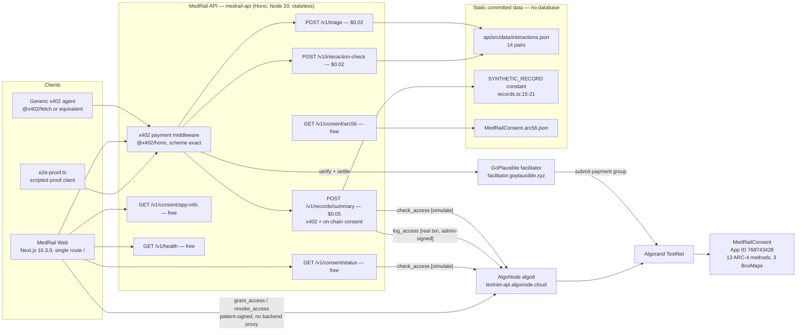

# MedRail — Software Requirements Specification (SRS)


> **⚠ Correction notice.** Parts of this document were written against a review finding that was
> later proven wrong. Settlement in x402 v2 happens **only** on a sub-400 response, so **no error
> path in MedRail can consume a settled payment** — and consent-denied calls (HTTP 403) are **not
> charged**, contrary to `API.md`, `SECURITY.md`, and the `paidButDenied` field. The audit-sequence
> race causes a **rejected transaction**, not a corrupted log. See
> [`CORRECTIONS.md`](../CORRECTIONS.md) — it supersedes any statement here that contradicts it.

**Purpose of this document.** Define, in IEEE-830 form, every requirement MedRail is held to, each atomic, testable, and traceable to source evidence or explicitly marked as having no evidence.

**Status of this document.** Authored 2026-08-21 against commit `32ffd73` on branch `master`. Requirement IDs, statements, and statuses are reproduced verbatim from the frozen canonical registry (`REQUIREMENTS_REGISTRY.md`); this SRS adds rationale, inputs/outputs, acceptance criteria, and file-level evidence only. **No new requirement IDs are allocated by this document** — the reserved blocks in registry §9 are left intact for the documents that own them. Where a genuine requirement gap was found, it is recorded in `Requirements_Gap_Analysis.md`, not invented here as a requirement.

---

## 1 Introduction

### 1.1 Purpose

This SRS specifies the functional and non-functional requirements of **MedRail**, an on-chain patient-consent registry and access audit log fronted by HTTP endpoints that are paywalled per call using the **x402** protocol. It is the traceability backbone for the MedRail documentation set: every other document cites the IDs defined here.

It is written for hostile technical review. Accordingly:

- Every requirement is atomic and testable, or is explicitly marked as **not yet testable** with the reason stated.
- Where the project has defined no numeric target, this document says so rather than inventing one. There are exactly four measured numbers in the entire project (§7.1); no percentile, throughput, uptime, capacity, or accuracy figure exists.
- Status labels are the frozen vocabulary of §1.3.3 and are used with no softening.

### 1.2 Scope

**In scope.** The three-component monorepo at `D:\MedRail`:

| Component | Technology | Role |
|---|---|---|
| `contracts/` | Algorand Python (`algopy`) 3.5.1, compiled by `puyapy` 5.9.0 | `MedRailConsent` smart contract — consent state machine + per-patient audit log |
| `api/` | Hono 4.7 + TypeScript 5.7 on Node 20, `@x402/*` 2.21.0, `algosdk` ^3.6.0 | `medrail-api` — x402 resource server, 3 priced + 5 unpriced routes |
| `web/` | Next.js 16.3.0, React 19.2.8, Tailwind 4 | `MedRail Web` — single-route judge-facing demo UI |

**Explicitly out of scope, because it does not exist.** There is no database, no cache, no message queue, no background worker, no ORM, no migration system, no LLM, no ML model, no embedding store, and no vector database anywhere in this repository. Durable state lives in exactly two places: Algorand box storage, and two static committed files (`api/src/data/interactions.json`, the `SYNTHETIC_RECORD` constant at `api/src/routes/records.ts:15-21`). No requirement in this document describes a component that does not exist, except where explicitly labelled **RECOMMENDED** or **PLANNED**.

**Also out of scope.** `docs/SENTINEL_ARCHITECTURE.md` describes a different, unbuilt product ("Sentinel Exchange"). None of it is implemented and none of it is specified here. See `Requirements_Gap_Analysis.md` gap **DOC-1**.

### 1.3 Definitions, acronyms and glossary

#### 1.3.1 Protocol and platform terms

| Term | Definition as used in this system |
|---|---|
| **x402** | An HTTP payment protocol built on status code `402 Payment Required`. The server answers an unpaid request with `402` plus machine-readable payment requirements; the client constructs and signs a payment, retries with a payment header, and the server settles it through a facilitator before returning the resource. MedRail speaks **x402 protocol version 2**: request header `PAYMENT-SIGNATURE`, `402` header `PAYMENT-REQUIRED`, success header `PAYMENT-RESPONSE`. |
| **scheme `exact`** | The x402 payment scheme in which the client pays an exact, server-quoted amount of a named asset to a named address. It is the only scheme MedRail registers (`api/src/x402.ts:11-14`, `:22`). |
| **`payTo`** | The address in the `402` challenge's `accepts[]` entry to which settlement must transfer funds. MedRail sources it from `PAY_TO_ADDRESS`, falling back to `OPERATOR_ADDRESS` (`api/src/config.ts:53`). All three priced routes share one `payTo`, which is what makes the entry **Composite** rather than three Standard entries. |
| **facilitator** | The third-party service that verifies a presented payment and settles it on-chain on the resource server's behalf. MedRail uses GoPlausible at `https://facilitator.goplausible.xyz` (`api/src/config.ts:47`). It also supplies, at startup, the concrete asset id and the fee-sponsorship address that the `402` challenge advertises — which is why an outage is fatal to priced routes (finding **R-1**, requirement **REL-001**). |
| **settlement** | The facilitator's act of submitting and confirming the client's signed payment transaction on Algorand. MedRail treats the facilitator's settlement verdict as authoritative and does not independently re-confirm the transaction against algod — the standard x402 trust model, listed as residual risk under **SEC-006**. |
| **CAIP-2** | Chain Agnostic Improvement Proposal 2 — a chain identifier of the form `namespace:reference`. Algorand TestNet is `algorand:SGO1GKSzyE7IEPItTxCByw9x8FmnrCDexi9/cOUJOiI=`; MainNet is `algorand:wGHE2Pwdvd7S12BL5FaOP20EGYesN73ktiC1qzkkit8=` (`api/src/config.ts:8-13`). MedRail registers exactly one CAIP-2 network per process (**NFR-002**). |
| **ASA** | Algorand Standard Asset. MedRail settles in USDC: ASA `10458941` on TestNet, `31566704` on MainNet, both 6 decimals (`api/src/config.ts:15-19`). `$0.02` therefore equals `20000` base units. |

#### 1.3.2 Algorand and contract terms

| Term | Definition as used in this system |
|---|---|
| **AVM** | Algorand Virtual Machine — the on-chain execution environment. Contract unit tests run against an AVM *simulator* (`algorand-python-testing` 1.1.0), not the live network; this distinction is the basis of the **UNVALIDATED on-chain** status on **FR-025**. |
| **algod** | An Algorand node's transaction/query API. MedRail uses the public AlgoNode endpoint `https://testnet-api.algonode.cloud` with no API key, no timeout, and no retry (`api/src/services/algorand.ts:5`) — see **REL-003**. |
| **indexer** | An Algorand historical-query API. `config.indexerServer` is defined at `api/src/config.ts:51` but is **never read anywhere in `api/src` or `api/scripts`**; the indexer was used by the reviewer for verification, not by the running system. |
| **simulate** | An algod endpoint that executes a transaction group without submitting it, charging no fee and mutating no state. MedRail executes `check_access` and `get_audit_count` this way (`api/src/services/algorand.ts:98`, `:119`) — the basis of **SEC-009**. A simulated call still needs a sender and a signer, which is why the free `/v1/consent/status` route nonetheless requires `OPERATOR_MNEMONIC`. |
| **box storage** | Per-application key/value storage on Algorand, owned and paid for by the application account rather than by callers. MedRail uses boxes so that no requester ever has to opt in to the application (`contract.py:12-17`). Three `BoxMap`s exist: `grants` (prefix `g`), `audit_seq` (prefix `s`), `audit_log` (prefix `a`) (`contract.py:114-116`). |
| **MBR** | Minimum Balance Requirement. Algorand locks `2500 + 400 × (len(key) + len(value))` µALGO in the application account per box. The contract's advertised `GRANT_BOX_MBR` omits the 1-byte `BoxMap` key prefix and so under-reports by 400 µALGO per box (`contract.py:52`) — defect **C-2**, reflected in **FR-032**. |
| **ARC-4** | The Algorand ABI standard: method selectors, typed argument encoding, structs. `MedRailConsent` subclasses `ARC4Contract` (`contract.py:106`) and exposes 13 ARC-4 methods. |
| **ARC-28** | The Algorand standard for structured, typed event logs emitted from a contract. MedRail emits `AccessRequested`, `AccessGranted`, `AccessRevoked` via `arc4.emit` (`contract.py:146`, `:169-176`, `:195`). `AccessRequested`'s payload has its first two fields transposed — defect **C-1**, reflected in **FR-024**. |
| **ARC-56** | The Algorand application-spec standard (an extension of ARC-32) describing methods, state schema, and box maps as JSON. `contracts/artifacts/MedRailConsent.arc56.json` is committed and served verbatim at `GET /v1/consent/arc56` (**FR-015**). |
| **puya / puyapy / algopy** | `algopy` is the Algorand Python dialect the contract is written in (`algorand-python==3.5.1`); `puyapy==5.9.0` is its compiler (`contracts/requirements-dev.txt`). Note `docs/IMPLEMENTATION_PLAN.md:32` states "puya 0.6.0" — that entry is stale and wrong (gap **DOC-2**). |

#### 1.3.3 MedRail-specific terms and the status vocabulary

| Term | Definition as used in this system |
|---|---|
| **Hono** | The TypeScript HTTP framework the API is built on (`hono ^4.7.1`). Its `app.request()` test harness is what `api/test/x402-flow.spec.ts` drives, which is why those tests exercise the real middleware stack. |
| **consent scope** | A free-form string naming what a grant covers. It is never an enumeration — the contract stores `scope: String` throughout, so new endpoints need no contract change (**DATA-003**). The only scope used in this build is `records:summary` (`api/src/routes/records.ts:10`). |
| **audit sequence** | A per-patient, strictly increasing integer. **The contract assigns it itself**: `log_access` reads its own `audit_seq` box and computes `next_seq = 1 if not existed else seq + 1`, then writes both the sequence and the entry (`contract.py:224-234`). No caller-supplied sequence is ever trusted. The backend's `predictedSeq` (`api/src/services/algorand.ts:158-172`) exists **only** to populate the AVM box-reference array, because Algorand requires every box a transaction touches to be declared in advance. A stale prediction therefore declares a box name that does not match the one the contract goes on to write, and the AVM **rejects the whole transaction** — the failure mode is a rejected write, not a corrupted or misordered log. See **REL-004**. |
| **`ClientAvmSigner`** | The `@x402/avm` browser signer interface, `{address: string, signTransactions(txns, indexesToSign?)}`. MedRail's demo wallet implements it directly (`web/lib/demoWallet.ts:34-37`), so substituting a real wallet is a signer-object swap, not an architectural change. |

**Status label vocabulary (frozen — used verbatim throughout this document set):**

| Label | Meaning |
|---|---|
| **VALIDATED** | Implemented **and** covered by a passing automated test or an on-chain/indexer artifact. |
| **IMPLEMENTED** | Code exists in the repository, verified by reading it. No test or on-chain proof. |
| **UNVALIDATED** | Implemented, but nothing proves it works. |
| **PARTIALLY IMPLEMENTED** | Some of the requirement exists. |
| **PLANNED** | Documented as intended; no code. |
| **NOT IMPLEMENTED** | Absent. |
| **RECOMMENDED** | The reviewer's recommendation. Never presented as existing. |

Two qualified labels appear where the registry uses them and are preserved verbatim: **UNVALIDATED on-chain** (FR-025), **IMPLEMENTED (incorrect value — defect C-2)** (FR-032), **IMPLEMENTED (breaks in container — see D-1)** (NFR-004), **PARTIALLY IMPLEMENTED — DEFEATED BY S-1** (SEC-006), **IMPLEMENTED (by construction)** (AI-008), **NOT APPLICABLE / PARTIALLY ADDRESSED** (OPS-007).

### 1.4 Stakeholders

| Stakeholder | Interest in this document |
|---|---|
| **Hackathon judges (Algorand Foundation, Global x402 Challenge)** | Whether claims are evidenced. Every requirement here carries an evidence cell or an explicit "none". |
| **Integrating agent developers** | The public contract of the seven `/v1` routes plus `GET /`, and the guarantee that a generic `@x402/fetch` client needs no MedRail-specific knowledge (§12). |
| **Patients (modelled, not real)** | **SEC-003** (only the patient may grant/revoke), **NFR-008** (the backend never holds a patient key), **SEC-004** (no PHI on-chain). No real patient exists in this system. |
| **Requesters / data consumers** | **FR-010**–**FR-012**. Note **SEC-007** is **NOT IMPLEMENTED**: a requester's asserted identity is not authenticated. |
| **MedRail operator** | **SEC-012** (single hot admin key), **REL-006** (app-account MBR headroom), **OPS-001**–**OPS-008** (all but one **NOT IMPLEMENTED**). |
| **Contract admin** | Identical to the operator in this build — the same key that deploys, signs `log_access`, rotates `set_admin`, and can drain the app account via `withdraw_excess`. |
| **Reviewers / auditors** | The traceability matrix and gap analysis that cite these IDs. |

### 1.5 References

**Internal (repository).**

| Reference | Path |
|---|---|
| Contract source | `contracts/smart_contracts/consent/contract.py` (259 lines) |
| Contract ABI spec | `contracts/artifacts/MedRailConsent.arc56.json` |
| Contract tests | `contracts/tests/test_consent.py` (14 tests) |
| API source | `api/src/**` (13 files) |
| API tests | `api/test/{triageScorer,interactionChecker,x402-flow}.spec.ts` (18 tests) |
| Web source | `web/lib/*.ts` (5 files), `web/components/*.tsx` (5 files), `web/app/page.tsx` (1 route) |
| CI workflow | `.github/workflows/ci.yml` |
| Container/deploy config | `api/Dockerfile`, `api/fly.toml`, `web/Dockerfile` |
| Deployment record | `contracts/artifacts/deploy_testnet.json` |
| Payment proof record | `contracts/artifacts/e2e-proof.json` |
| Pre-existing docs | `docs/{API,ARCHITECTURE,COMPLIANCE,DEPLOYMENT,GO_LIVE_CHECKLIST,IMPLEMENTATION_PLAN,JUDGES,PROOF,SECURITY}.md` |
| Companion documents | `docs/02_Requirements/Requirements_Traceability_Matrix.md`, `docs/02_Requirements/Requirements_Gap_Analysis.md` |

**External (as configured or claimed by the project).**

| Reference | Identifier |
|---|---|
| Deployed contract | Algorand TestNet App ID **768743428**, created round 66088624, app account `CCO26Y6Z56DDZ3OELO2UKJMIPJVSIT52I23F2MPMR52JBM3HQZZNUZNOR4` |
| Explorer | `https://lora.algokit.io/testnet/application/768743428` |
| Facilitator | `https://facilitator.goplausible.xyz` |
| algod / indexer | `https://testnet-api.algonode.cloud`, `https://testnet-idx.algonode.cloud` |
| Competition | Algorand Foundation Global x402 Challenge, `algorand.co/global-x402-challenge`. **All competition-rule claims in this document set are per `docs/COMPLIANCE.md` and were not independently re-verified against the official rules during this review.** |

---

## 2 Overall description

### 2.1 Product perspective

MedRail is a **new, self-contained system**, not a component of a larger product and not a replacement for an existing one. It composes four external dependencies and owns three artefacts:

- **Owned:** the `MedRailConsent` contract, the `medrail-api` resource server, the `MedRail Web` demo client.
- **External, hard dependencies:** the GoPlausible facilitator (verify + settle, and the source of the advertised asset id and fee-payer); AlgoNode algod (all chain reads and the one chain write); the Algorand network itself (consensus, box storage, finality); the `@x402/*` SDK family at 2.21.0.

The system's distinguishing structural claim is that **the payment layer and the authorisation layer are separate and composable**: the x402 middleware proves *that* a payment settled, and the consent contract proves *whether the named requester is allowed*. §13 of `VERIFIED_FACTS.md` establishes that these two layers are not currently joined — the payer's identity is never bound to the asserted requester (finding **S-1**, requirement **FR-039** / **SEC-007**, both **NOT IMPLEMENTED**). That is stated here in the product perspective, not buried in the security section, because it changes what the product *is*: today the consent check is an on-chain lookup, not an access control.

### 2.2 Product functions

1. **Price and settle HTTP calls** (`FR-001`–`FR-003`): answer unpaid requests to three routes with a v2 `402`, and settle presented `exact`-scheme AVM payments through the facilitator.
2. **Two deterministic intelligence endpoints** (`FR-004`–`FR-009`): keyword-weighted triage scoring and table-lookup drug-interaction checking, each returning a mandatory non-diagnostic disclaimer.
3. **One consent-gated data endpoint** (`FR-010`–`FR-012`): check an on-chain grant, then append an on-chain audit entry and return a synthetic record summary.
4. **Free read/introspection endpoints** (`FR-013`–`FR-017`): live consent status, app info, the ARC-56 spec, health, and a service index.
5. **On-chain consent lifecycle** (`FR-018`–`FR-024`): patient-signed grant, revoke, re-grant, optional expiry, requester interest signalling.
6. **On-chain audit log** (`FR-025`–`FR-028`): admin-only, per-patient, monotonically sequenced, append-only, with read-only queries.
7. **Contract administration and funding** (`FR-029`–`FR-032`): admin rotation, MBR top-up, excess withdrawal, MBR quotation.
8. **Browser demo client** (`FR-033`–`FR-037`): session keypair, real browser-side payment signing, direct patient-signed consent transactions, live health display, pricing table.
9. **Reproducible payment proof** (`FR-040`): a script that drives a real 402→pay→settle→200 round trip and writes the settled transaction id to disk.

### 2.3 User classes and characteristics

| User class | Frequency | Technical skill | Functions used | Notes |
|---|---|---|---|---|
| **Generic x402 agent** | Designed to be the highest-volume class | Programmatic; knows x402 v2 and nothing about MedRail | `FR-001`–`FR-009` | Requires no account, no key, no registration. See §12. |
| **Authorised requester** | Low by construction | Programmatic | `FR-010`–`FR-012` | Must hold a valid grant. **Identity is not authenticated (SEC-007).** |
| **Patient** | Low | Holds an Algorand key | `FR-018`–`FR-024`, `FR-035` | Signs grant/revoke client-side. Backend never sees the key (**NFR-008**). |
| **Judge / evaluator** | One-off | Browser only | `FR-013`–`FR-017`, `FR-033`–`FR-037` | Served by the single-route web app. |
| **Operator / admin** | Continuous background | Operations | `FR-025`, `FR-029`–`FR-031` | One hot mnemonic holds all admin authority (**SEC-012**). |
| **Anonymous public caller** | Unbounded | Any | `FR-013`–`FR-017` | Unauthenticated, unmetered, unthrottled (**SEC-013**). `/v1/consent/status` makes two outbound algod calls per request. |

### 2.4 Operating environment

Exact runtimes and versions, from the manifests:

| Layer | Component | Version | Source |
|---|---|---|---|
| Contract language | `algorand-python` (algopy) | 3.5.1 | `contracts/requirements.txt` |
| Contract compiler | `puyapy` | 5.9.0 | `contracts/requirements-dev.txt` |
| Contract test harness | `algorand-python-testing` | 1.1.0 | `contracts/requirements-dev.txt` |
| Contract deploy tooling | `algokit-utils` 4.2.3, `py-algorand-sdk` 2.11.1 | — | `contracts/requirements.txt` |
| Python | CPython | ≥ 3.12 (`requires-python`), CI pins 3.12 | `contracts/pyproject.toml:4`, `.github/workflows/ci.yml:16` |
| API runtime | Node.js | 20 (CI and both Dockerfiles: `node:20-slim`) | `.github/workflows/ci.yml:33`, `api/Dockerfile:5` |
| API framework | `hono` | ^4.7.1 | `api/package.json:22` |
| API server adapter | `@hono/node-server` | ^2.1.0 | `api/package.json:14` |
| x402 SDK | `@x402/core`, `@x402/avm`, `@x402/hono`, `@x402/extensions` pinned `2.21.0`; `@x402/fetch` `^2.21.0` | 2.21.0 | `api/package.json:15-19` |
| Algorand SDK (Node) | `algosdk` | ^3.6.0 | `api/package.json:20` |
| Validation | `zod` | ^3.24.1 | `api/package.json:23` |
| TypeScript | `typescript` | ^5.7.2 (API), ^5 (web) | `api/package.json:28` |
| Test runner | `vitest` | ^4.1.10 | `api/package.json:29` |
| Web framework | `next` | 16.3.0 | `web/package.json:16` |
| Web UI | `react` / `react-dom` | 19.2.8 | `web/package.json:17-18` |
| Web styling | `tailwindcss` | ^4 | `web/package.json:27` |
| Target network | Algorand TestNet (`SGO1GKSzyE7IEPItTxCByw9x8FmnrCDexi9/cOUJOiI=`) | — | `api/src/config.ts:11` |
| Default listen port | 4021 | — | `api/src/config.ts:46` |
| Container base | `node:20-slim`, 2-stage | — | `api/Dockerfile:5,13` |
| Declared hosting target | Fly.io, 1 shared CPU, 512 MB, region `iad` | — | `api/fly.toml:4,21-24` |

**`@x402/extensions` is declared at `api/package.json:17` but imported nowhere** in `api/src`, `api/scripts`, `web/lib`, `web/components`, or `web/app` (verified by exhaustive grep). It contributes nothing at runtime. See gap **DOC-9**.

**`config.usdcAssetId` (`api/src/config.ts:49`) and `config.indexerServer` (`:51`) are likewise defined and never read** anywhere in `api/src` or `api/scripts`. The asset id in the live `402` comes from the facilitator, not from this constant.

### 2.5 Design and implementation constraints

| # | Constraint | Consequence |
|---|---|---|
| DC-1 | The `402` challenge cannot be constructed offline. `accepts[].asset` and `extra.feePayer` are fetched from the facilitator's `/supported` at `x402ResourceServer.initialize()`, not held in MedRail config. | A facilitator outage yields HTTP **500** on all three priced routes, with no `PAYMENT-REQUIRED` header and no `Retry-After` (**REL-001**, finding R-1). It is also why `api/test/x402-flow.spec.ts` makes a live network call (finding CI-2). |
| DC-2 | Generic x402 clients can only construct the payment transactions described in `paymentRequirements`. | The consent check and audit write **must** be follow-up server-side calls, not extra legs in the client's signed group. Documented at `docs/ARCHITECTURE.md:95-108`. This is a deliberate compatibility trade (§12) and the direct cause of the non-atomicity behind **REL-002**. |
| DC-3 | Box MBR is charged to the application account, not the caller. | The app must stay funded; `fund_mbr` exists (**FR-030**) but has no monitoring (**REL-006**) and quotes a value 400 µALGO/box too low (**FR-032**, defect C-2). |
| DC-4 | `algopy` module-level constants must be compile-time literals. | `STATUS_*` are plain ints (`contract.py:44-48`); `GRANT_BOX_MBR` is a literal arithmetic expression (`contract.py:52`) and therefore cannot be derived from the actual key length at runtime. |
| DC-5 | Box-key derivation is implemented three times in three languages: `contract.py:96-98` (Python/AVM `op.sha256`), `api/src/services/algorand.ts:64-79` (Node `crypto.createHash`), `web/lib/consent.ts:26-34` (browser `crypto.subtle.digest`). | Byte-identity is a hard correctness requirement (**NFR-011**) with **no cross-implementation test**. A change to any prefix or hash input silently breaks two of the three. |
| DC-6 | `log_access` self-assigns the audit sequence on-chain (`contract.py:224-226`), but Algorand requires every touched box to be declared in the transaction's box-reference array in advance. The backend must therefore predict the box **name** by reading `get_audit_count` and declaring `count + 1` (`api/src/services/algorand.ts:158-172`). | A concurrent writer for the same patient invalidates the prediction, the declared box reference no longer matches the box the contract writes, and **the AVM rejects the whole transaction**. The failure mode is a rejected write, not a corrupted log. Mitigated only in-process by `withPatientLock` (`api/src/services/algorand.ts:123-138`). This is the single hard horizontal-scaling blocker (§10), and a rejection here on the success path of `/v1/records/summary` is precisely what triggers **REL-002**. |
| DC-7 | Contract unit tests run on an AVM **simulator**, not the network. | Simulator-passing is not on-chain proof. `log_access` has never executed on TestNet (`total_audit_entries == 0`), so **FR-012** and **FR-025** cannot be raised above **UNVALIDATED** by the test suite alone. |
| DC-8 | The API holds no server-side state (**NFR-001**). | No sessions, no accounts, no API keys — hence no per-caller accounting and no throttling primitive to build on (**SEC-013**). |
| DC-9 | x402 payment middleware is mounted on `"*"` ahead of every route handler (`api/src/app.ts:37-50`). | Payment is enforced before body validation. An unpaid malformed request returns `402`, not `400` — a property the test suite documents rather than assumes (`api/test/x402-flow.spec.ts:48-59`). |

### 2.6 Assumptions and dependencies

**Assumptions (each is a real assumption, not a guarantee).**

| # | Assumption | If false |
|---|---|---|
| A-1 | The GoPlausible facilitator is reachable and its `/supported` response is well-formed at process start. | All priced routes return 500 (R-1). |
| A-2 | The facilitator's settlement verdict is truthful. MedRail does not re-verify against algod. | An unpaid caller could be served. Standard x402 trust model; listed as residual risk under **SEC-006**. |
| A-3 | AlgoNode's public algod is reachable, with no key and no rate agreement. | `/v1/consent/status` and `/v1/records/summary` return 500 (**REL-003**, finding R-4). |
| A-4 | Exactly one `medrail-api` process uses a given operator account at a time. | The losing racer's box-reference prediction goes stale and the AVM rejects its `log_access` transaction (**REL-004**); on the success path of `/v1/records/summary` that rejection consumes a settled payment and returns `500` (**REL-002**). Contradicted by `api/fly.toml:18-19`. |
| A-5 | `CONSENT_APP_ID` is set, **or** `contracts/artifacts/deploy_testnet.json` is present in the process's parent directory. | `requireConsentAppId()` throws → 500. In a container neither holds (gap **D-1**). |
| A-6 | `OPERATOR_MNEMONIC` is set — required even for the free, unauthenticated `/v1/consent/status`, because `simulate` still needs a sender and signer (`api/src/services/algorand.ts:8-14`, `:84`). | `/v1/consent/status` and `/v1/records/summary` return 500. |
| A-7 | Callers submit syntactically valid Algorand addresses. Only length 58 is checked (`api/src/routes/records.ts:6-7`, `api/src/routes/consent.ts:7-8`). | A 58-character non-address yields HTTP 500 and leaks an internal message (**SEC-010**, finding R-3). |
| A-8 | Competition rules are as recorded in `docs/COMPLIANCE.md`. | Not independently re-verified in this review. |

**Dependencies.** Facilitator (verify/settle/`/supported`), AlgoNode algod (all reads + the audit write), Algorand consensus and box storage, `@x402/*` 2.21.0, `algosdk` ^3.6.0, `zod` ^3.24.1, Node 20, Python ≥3.12 + `puyapy` 5.9.0. Deployment additionally depends on a Fly.io account and a funded operator account; neither is provisioned by this repository.

---

## 3 System overview

### 3.1 Context diagram



**Diagram fidelity notes.** Three priced endpoints; four free `/v1` endpoints; one contract; one facilitator; **no database, no cache, no queue, no worker, no model**. A fifth unpriced route, `GET /` (`api/src/app.ts:71-84`), returns a static service index and is omitted above because it is outside the `/v1` API surface. The web client has exactly one route, `/` (`web/app/page.tsx`).

### 3.2 Request flows

**Priced, ungated (`/v1/triage`, `/v1/interaction-check`).** Unpaid request → middleware returns `402` + `PAYMENT-REQUIRED` → client signs an `exact` AVM payment → retry with `PAYMENT-SIGNATURE` → middleware verifies and settles via the facilitator → handler runs a pure function over static data → `200` + `PAYMENT-RESPONSE`. No chain read, no chain write, no state.

**Priced and consent-gated (`/v1/records/summary`).** As above, then: zod-validate the body (`records.ts:26-29`) → `checkAccess` via `simulate` (`records.ts:32`) → **denied**: fire-and-forget `logAccess(..., "consent_denied")` with `.catch(() => undefined)`, return `403 {paidButDenied: true}` (`records.ts:33-47`) → **allowed**: `await logAccess(..., "consent_checked")` **unguarded** (`records.ts:49`), then `200` with `auditTxId` and `auditSequence` (`records.ts:51-60`). The asymmetry between lines 37 and 49 is finding **R-2** (**REL-002**).

**Free consent read (`/v1/consent/status`).** zod-validate query → `algod.getTransactionParams()` → `atc.simulate()` → `200 {granted}`. Two sequential algod round trips per request; the single cold observation is 505 ms (§7.1).

**Patient consent transactions.** Constructed and signed entirely in the browser (`web/lib/consent.ts:44-89`) and submitted directly to AlgoNode. The API is not on this path at all except to answer `GET /v1/consent/app-info` for the App ID (`web/lib/consent.ts:36-41`).

---

## 4 Functional requirements

Every requirement below is reproduced from the frozen canonical registry. **The `Statement` field is verbatim and is not editable by this document.** Everything else — rationale, source component, inputs/outputs, acceptance criteria, evidence and test — is added here.

**How to read a requirement block.**

| Field | Meaning |
|---|---|
| **Statement** | Verbatim from the registry. This SRS may not reword, renumber, or contradict it. |
| **Rationale** | Why the requirement exists at all. Not a restatement of the statement. |
| **Source component** | Which of `contracts/`, `api/`, `web/` owns the behaviour. |
| **Inputs → outputs** | The observable interface, so the requirement can be exercised without reading source. |
| **Acceptance criteria** | Exactly what a test would have to assert. Where no numeric target exists, the criterion says so and names the decision that must be taken first. |
| **Status** | The frozen vocabulary of §1.3.3, used verbatim. |
| **Evidence** | `path:line`, a transaction id, or `none`. |
| **Test** | The automated test that verifies it, or `— none —`. A manual observation is never recorded as a test. |

**Line-number note.** Registry evidence cells were recorded against a slightly earlier read and drift by 2–5 lines in several places. Every citation below was re-verified against the working tree at commit `32ffd73`; where the two disagree, the line numbers here are the accurate ones and the registry's ID and statement are still authoritative.

**Reserved-block note.** **FR-100** and **FR-101** (§4.10) were allocated by the `01_Product/` cluster from its reserved block `FR-100…FR-119` (registry §9). They are **reproduced** here, not created here.

### 4.1 Payment and settlement (FR-001 – FR-003)

**FR-001 — A v2 `402` is served for every unpaid request to a priced route**

- **Statement.** The API shall respond `402 Payment Required` with an `x402Version: 2` `PAYMENT-REQUIRED` header to any unpaid request to a priced route.
- **Rationale.** This is the entire premise of x402: an agent that has never heard of MedRail must be able to learn the price, the asset, the network and the destination from the rejection itself. The middleware is mounted on `"*"` ahead of every handler so no priced route can be reached without passing it (constraint **DC-9**).
- **Source component.** `api/` — `paymentMiddleware` from `@x402/hono`, configured once for all three priced routes.
- **Inputs → outputs.** Any request to `POST /v1/triage`, `POST /v1/interaction-check` or `POST /v1/records/summary` carrying no `PAYMENT-SIGNATURE` header → HTTP `402`; body `{}`; headers `PAYMENT-REQUIRED` (base64-encoded JSON), `cache-control: no-store`, `access-control-expose-headers: PAYMENT-REQUIRED,PAYMENT-RESPONSE`.
- **Acceptance criteria.** (a) All three priced paths return exactly `402` when unpaid; (b) `PAYMENT-REQUIRED` is present and base64-decodes to JSON whose `x402Version` is the integer `2`; (c) no unpriced route ever returns `402`.
- **Status.** **VALIDATED**
- **Evidence.** `api/src/app.ts:37-50` (the three-route price table), `api/src/x402.ts:11-14` (resource server registration); live capture of the decoded challenge recorded in the review fact ledger §4.
- **Test.** `api/test/x402-flow.spec.ts:12-26`, `:28-35`, `:37-46` — three cases, one per priced route.

**FR-002 — The challenge advertises scheme, network, asset and `payTo`**

- **Statement.** The `402` challenge shall advertise scheme `exact`, the configured CAIP-2 network, the resolved USDC asset id, and the configured `payTo` address.
- **Rationale.** A challenge missing any of these four fields is not actionable: the client cannot pick a scheme handler, cannot choose the right chain, cannot select the asset, and has nowhere to send funds. Note that only two of the four originate in MedRail — `scheme` and `network` come from `api/src/x402.ts`, while `asset` and `extra.feePayer` are resolved from the facilitator's `/supported` at initialisation. That split is constraint **DC-1** and the direct cause of **REL-001**.
- **Source component.** `api/` — `priced()` builds `accepts[]`; `@x402/core` merges in the facilitator-supplied asset and fee payer.
- **Inputs → outputs.** Configuration (`NETWORK`, `PAY_TO_ADDRESS`/`OPERATOR_ADDRESS`, `FACILITATOR_URL`) + the facilitator's `/supported` response → one `accepts[]` entry per priced route containing `scheme: "exact"`, `network` (CAIP-2), `amount` (base units), `asset`, `payTo`, `maxTimeoutSeconds`, `extra.feePayer`.
- **Acceptance criteria.** (a) `accepts[0].scheme === "exact"`; (b) `accepts[0].network` matches `/^algorand:/` and equals `config.networkCaip2` for the configured `NETWORK`; (c) `accepts[0].amount` is `"20000"` for both $0.02 routes and `"50000"` for `/v1/records/summary`; (d) `accepts[0].payTo` equals `config.payToAddress`; (e) `accepts[0].asset` is a non-empty ASA id string.
- **Status.** **VALIDATED**
- **Evidence.** `api/src/x402.ts:16-31` (`priced()`), `api/src/config.ts:8-13` (CAIP-2 map), `:53` (`payToAddress`); live decoded challenge in the fact ledger §4 showing `asset: "10458941"` and `extra.feePayer`.
- **Test.** `api/test/x402-flow.spec.ts:23-25` asserts scheme, amount and network; `:45` asserts the higher price on the gated route. **`payTo` and `asset` are asserted by no test.**

**FR-003 — A presented payment is settled and the resource returned**

- **Statement.** The API shall settle a presented `exact`-scheme AVM payment through the configured facilitator and return the resource on success.
- **Rationale.** Without settlement the `402` is theatre. This requirement is also where the money actually moves, which makes its failure semantics the subject of **REL-002** and **§9.2**.
- **Source component.** `api/` — `@x402/hono` middleware and `HTTPFacilitatorClient`; settlement itself is performed by GoPlausible.
- **Inputs → outputs.** A retry carrying a `PAYMENT-SIGNATURE` header whose signed AVM payment matches the challenge → facilitator `verify` → handler runs → facilitator `settle` → HTTP `200`, the handler's JSON body, and a `PAYMENT-RESPONSE` header carrying the settled transaction id.
- **Acceptance criteria.** (a) A correctly signed payment for the quoted amount yields `200`; (b) the `PAYMENT-RESPONSE` header decodes to an object containing a transaction id that resolves on a public Algorand indexer; (c) the settled transfer is an `axfer` of the quoted asset for the quoted base-unit amount to the quoted `payTo`.
- **Status.** **VALIDATED**
- **Evidence.** `api/src/x402.ts:6` (facilitator client), `api/src/app.ts:37-50`; settled transaction `OYRQRKYA7WUKBVLWTOFJSJMZFBW7VCNGP5VGH5EBUJGRCVFQFJRQ` — `axfer`, asset `10458941`, amount `20000`, confirmed round 66091768, fee `0` (sponsored); recorded at `contracts/artifacts/e2e-proof.json`.
- **Test.** `api/scripts/e2e-proof.ts` — a script, run manually, **not run in CI** (`.github/workflows/ci.yml:44-46` runs `vitest` only). Exactly **one** such settlement exists, and its payer and payee are the same account; §7.1 and `docs/PROOF.md` §6 disclose this. Do not read it as payment volume.

### 4.2 Deterministic intelligence endpoints (FR-004 – FR-009)

**FR-004 — Triage endpoint contract**

- **Statement.** `POST /v1/triage` shall accept `{symptoms: string}` (1–2000 chars) and return `{score, band, matchedFlags, disclaimer}`.
- **Rationale.** The two open endpoints exist to be callable by any agent with no MedRail-specific knowledge (§12); a fixed, small, self-describing response shape is what makes that true.
- **Source component.** `api/` — `routes/triage.ts` → `services/triageScorer.ts`. Pure function; no chain call, no I/O, no state.
- **Inputs → outputs.** `{symptoms: string}` where `1 ≤ length ≤ 2000` → `{score: number, band: "routine"|"soon"|"urgent"|"emergency", matchedFlags: string[], disclaimer: string}`. A body failing the schema **after payment** yields `400`; unpaid it yields `402` (**DC-9**).
- **Acceptance criteria.** (a) All four keys present on every `200`; (b) `score` is an integer in `[0,100]`; (c) `band` is one of the four literals; (d) `symptoms` of length 0 or 2001 is rejected with `400`.
- **Status.** **VALIDATED**
- **Evidence.** `api/src/routes/triage.ts:5-7` (zod schema), `:11-18` (handler); `api/src/services/triageScorer.ts:53-73`.
- **Test.** `api/test/triageScorer.spec.ts` — 7 cases (`:5`, `:12`, `:19`, `:26`, `:32`, `:40`, `:45`). These test the scorer function, not the HTTP route; the route's `400` path has no test.

**FR-005 — Score is the capped sum of matched weights**

- **Statement.** The triage score shall be the capped (≤100) sum of the weights of all matched red-flag keyword groups.
- **Rationale.** A capped additive rule is the simplest scheme that is fully inspectable by a reader (**AI-001**) and cannot produce an out-of-range value that a caller must defend against.
- **Source component.** `api/` — `services/triageScorer.ts`.
- **Inputs → outputs.** Lower-cased symptom text → one weight added per **group** whose keyword list has any substring hit; total then `Math.min(100, …)`.
- **Acceptance criteria.** (a) Text matching a single group scores exactly that group's weight; (b) text matching two groups scores their sum (e.g. chest pain 35 + respiratory distress 35 = 70); (c) text matching enough groups to exceed 100 scores exactly 100; (d) a group is counted at most once regardless of how many of its keywords hit.
- **Status.** **VALIDATED**
- **Evidence.** `api/src/services/triageScorer.ts:32-44` (11 `RedFlag` groups with explicit weights), `:58-63` (accumulation), `:65` (`Math.min(100, score)`).
- **Test.** `api/test/triageScorer.spec.ts:32` — "caps the score at 100 even with many overlapping flags". The 35+35=70 sum is independently corroborated by `contracts/artifacts/e2e-proof.json`, whose live `200` body is byte-identical to the local computation.

**FR-006 — Band thresholds**

- **Statement.** The triage urgency band shall be `emergency ≥60`, `urgent ≥30`, `soon ≥10`, else `routine`.
- **Rationale.** The band, not the number, is what a caller acts on; fixing the thresholds in one four-line function keeps the mapping auditable and prevents drift between the endpoint and the documentation.
- **Source component.** `api/` — `services/triageScorer.ts`.
- **Inputs → outputs.** `score: number` → one of four band literals.
- **Acceptance criteria.** Boundary assertions at 9/10, 29/30 and 59/60, plus 0 → `routine` and 100 → `emergency`.
- **Status.** **VALIDATED**
- **Evidence.** `api/src/services/triageScorer.ts:46-51`.
- **Test.** `api/test/triageScorer.spec.ts:5`, `:12`, `:19`, `:26` — four band cases. **Exact threshold boundaries are not asserted**; the cases hit representative scores, not 9-vs-10.

**FR-007 — Interaction-check endpoint contract**

- **Statement.** `POST /v1/interaction-check` shall accept `{medications: string[]}` (2–20 items) and return `{flagged, matches, source, disclaimer}`.
- **Rationale.** A lower bound of 2 is semantically necessary — an interaction needs a pair — and an upper bound of 20 bounds the O(pairs × meds) scan without any need for a timeout.
- **Source component.** `api/` — `routes/interaction.ts` → `services/interactionChecker.ts`, over the 14-pair table in `api/src/data/interactions.json` loaded once at module load.
- **Inputs → outputs.** `{medications: string[]}`, `2 ≤ length ≤ 20`, each item ≥1 char → `{flagged: boolean, matches: Array<{drugs:[string,string], severity:"moderate"|"major"|"contraindicated", description:string}>, source: string, disclaimer: string}`.
- **Acceptance criteria.** (a) All four keys present; (b) `flagged === (matches.length > 0)`; (c) 1 item or 21 items yields `400`; (d) every `matches[].severity` is one of the three literals.
- **Status.** **VALIDATED**
- **Evidence.** `api/src/routes/interaction.ts:5-7`, `:11-18`; `api/src/services/interactionChecker.ts:18` (synchronous table load), `:36-55`.
- **Test.** `api/test/interactionChecker.spec.ts` — 6 cases (`:5`, `:11`, `:17`, `:23`, `:28`, `:33`).

**FR-008 — Case-insensitive, partial-name matching**

- **Statement.** Interaction matching shall be case-insensitive and tolerate partial medication names.
- **Rationale.** Callers pass free-text medication lists transcribed by humans or by other agents; exact-string matching would silently miss the majority of real inputs. **The chosen rule over-corrects** — see **AI-006**, which records the resulting false-positive class as **NOT IMPLEMENTED**.
- **Source component.** `api/` — `services/interactionChecker.ts`.
- **Inputs → outputs.** Each supplied name is trimmed and lower-cased, then matched against each table drug by **bidirectional** substring containment (`m.includes(a) || a.includes(m)`).
- **Acceptance criteria.** (a) `"WARFARIN"` matches the `warfarin` entry; (b) a truncated name such as `"warfar"` matches; (c) — *and this is the criterion the suite does not assert* — a 1–2 character name must **not** match unrelated entries. Criterion (c) currently fails: `checkInteractions(["a","b"])` returns 5 matches.
- **Status.** **VALIDATED** (for the stated requirement; the unstated safety property is **AI-006**, **NOT IMPLEMENTED**)
- **Evidence.** `api/src/services/interactionChecker.ts:32-34` (`normalize`), `:42-43` (the bidirectional containment test).
- **Test.** `api/test/interactionChecker.spec.ts:23` — "matches case-insensitively and with partial names".

**FR-009 — Mandatory non-diagnostic disclaimer**

- **Statement.** Every intelligence-endpoint response shall carry a non-diagnostic `disclaimer` field.
- **Rationale.** A health-adjacent endpoint that reads as authoritative is a real harm surface, not a polish item; the source says so in its own header comment. Treating the disclaimer as a **tested correctness property** rather than as copy is the control that makes the claim durable.
- **Source component.** `api/` — both services emit a module-level constant string.
- **Inputs → outputs.** Any successful call to `/v1/triage` or `/v1/interaction-check` → a `disclaimer` string stating the result is not a diagnosis and not a substitute for professional judgement.
- **Acceptance criteria.** (a) `disclaimer` is present and non-empty on every `200` from both endpoints; (b) it is invariant across inputs; (c) it contains an explicit non-diagnostic assertion.
- **Status.** **VALIDATED**
- **Evidence.** `api/src/services/triageScorer.ts:18-21`, `:71`; `api/src/services/interactionChecker.ts:20-23`, `:53`; rationale comment at `triageScorer.ts:1-7`.
- **Test.** `api/test/triageScorer.spec.ts:40`; `api/test/interactionChecker.spec.ts:33`.

### 4.3 Consent-gated record access (FR-010 – FR-012)

> **Scope note.** These three requirements describe the flagship endpoint and are the **only** functional requirements in the system with **zero automated coverage**. `total_audit_entries == 0` on App ID 768743428, so the success path has additionally never executed against the live contract (evidence gap **E-1**, gap **G-02**). Read every acceptance criterion below as *not yet demonstrated*.

**FR-010 — Payment and consent are both required**

- **Statement.** `POST /v1/records/summary` shall require a settled x402 payment **and** a currently-valid on-chain consent grant before returning a record summary.
- **Rationale.** This is the product thesis: payment proves *that* someone paid, the contract proves *whether they are allowed*. The two are deliberately separate layers (§2.1). They are also, today, **not joined** — see **FR-039**/**SEC-007**.
- **Source component.** `api/` — `routes/records.ts` (handler) + `services/algorand.ts::checkAccess` (an algod `simulate`), against `MedRailConsent::check_access`.
- **Inputs → outputs.** `PAYMENT-SIGNATURE` header + `{patientId: string(58), requesterAddress: string(58)}` → `200` with the synthetic summary if `check_access(patientId, requesterAddress, "records:summary")` returns true; `403` if not; `402` if unpaid.
- **Acceptance criteria.** (a) Unpaid → `402` regardless of grant state; (b) paid with no grant → `403`; (c) paid with an active grant → `200`; (d) paid with a **revoked** or **expired** grant → `403`; (e) `SCOPE` sent to the contract is exactly `"records:summary"`.
- **Status.** **UNVALIDATED**
- **Evidence.** `api/src/routes/records.ts:25-61` (handler), `:32` (`checkAccess`), `:10` (`SCOPE = "records:summary"`); `api/src/services/algorand.ts:82-100`.
- **Test.** — none — · No test file references `routes/records.ts`. Criteria (b)–(e) are untested in every form.
- **Known contract defect.** Criterion (b) is satisfied *as a status code* but the requirement it is documented under is not what the code does — see **FR-011**.

**FR-011 — Denial behaviour**

- **Statement.** When no valid grant exists, `/v1/records/summary` shall return `403` with `paidButDenied: true` and shall still attempt an on-chain audit entry.
- **Rationale.** A refusal is itself an access event worth recording on the patient's own trail — a patient should be able to see who *tried*, not only who succeeded. The denied-path audit write is deliberately best-effort (`.catch(() => undefined)`) so a chain failure cannot turn a correct refusal into a `500`.
- **Source component.** `api/` — `routes/records.ts`; the audit write goes through `services/algorand.ts::logAccess`, signed by the operator/admin account.
- **Inputs → outputs.** A settled-payment request whose `check_access` returns false → fire-and-forget `logAccess(patientId, requesterAddress, "records:summary", "/v1/records/summary", "consent_denied")` → HTTP `403` with `{error, patientId, requesterAddress, paidButDenied: true}`.
- **Acceptance criteria.** (a) Status is exactly `403`; (b) body carries `paidButDenied: true`; (c) an audit write is *attempted*; (d) a failing audit write does **not** change the `403`.
- **Status.** **UNVALIDATED**
- **Evidence.** `api/src/routes/records.ts:33-47`; the guarded write at `:37`; `paidButDenied` at `:43`.
- **Test.** — none —

> #### ⚠ FR-011 · Documented-versus-actual contract mismatch (defect, new to this SRS)
>
> **The `paidButDenied` field is false, and three documents repeat the same false claim.**
>
> `docs/API.md`, `docs/SECURITY.md` (under the heading *"consent-denied calls are still charged"*) and the response field `paidButDenied: true` itself (`api/src/routes/records.ts:43`) all assert that a consent-denied call is billed, on the stated rationale that "the fee already paid covers this on-chain verification regardless of outcome" (`records.ts:34-36`).
>
> **It is not billed.** The denial returns `403`, and `@x402/hono` reaches `processSettlement` only when the handler's response status is `< 400`; any status ≥ 400 calls `cancellationDispatcher.cancel({reason: "handler_failed"})` and returns before settlement (`node_modules/@x402/hono/dist/esm/index.mjs:203-232`). Verification and settlement are distinct phases and the `403` lands in the phase before money moves. **The caller pays nothing.**
>
> **And the cost runs the other way.** Before returning `403`, the handler submits a *real* `logAccess` transaction at `records.ts:37`, whose Algorand fee is paid by MedRail's own operator account.
>
> | | Documented | Actual |
> |---|---|---|
> | Caller pays | $0.05 | **nothing** |
> | MedRail pays | nothing | **one Algorand transaction fee** |
> | Net | MedRail earns $0.05 | **MedRail pays to say no** |
>
> **Security consequence.** Because there is no authentication and no rate limiting anywhere (**SEC-013**, **NOT IMPLEMENTED**), any stranger can invoke the denied path repeatedly at zero cost to themselves and non-zero cost to MedRail. This is an **unauthenticated fee-drain vector against the operator account**, and if that account empties, `log_access` stops working for *every* patient — a single-account availability dependency. Tracked as **G-03**; see also **SEC-013** in §8.5.
>
> **The fix is a product decision, not a bug fix.** Either return `200` with `{granted: false, …}` so settlement proceeds and the documented rationale becomes true (this changes the public API contract), or keep the `403`, correct `API.md` and `SECURITY.md`, remove the misleading `paidButDenied` field, and treat the denied-path audit write as a cost that must be rate-limited. **This SRS does not choose**; the registry statement above is preserved verbatim and the mismatch is recorded against it.

**FR-012 — Successful access appends an audit entry**

- **Statement.** On a granted access, `/v1/records/summary` shall append an on-chain audit entry and return its `auditTxId` and `auditSequence`.
- **Rationale.** Returning the transaction id in the response is what makes the audit claim independently checkable by the caller on a public explorer, rather than a promise. It is also the property most damaged by **SEC-008**: the entry attributes the access to a self-asserted address.
- **Source component.** `api/` — `routes/records.ts:49` → `services/algorand.ts::logAccess` (a real, admin-signed transaction, serialized per patient by `withPatientLock`) → `MedRailConsent::log_access`.
- **Inputs → outputs.** A settled-payment request whose `check_access` returns true → `log_access(patient, requester, "records:summary", "/v1/records/summary", "consent_checked")` → HTTP `200` with `{patientId, requesterAddress, scope, summary, consentVerifiedOnChain: true, auditTxId, auditSequence, disclaimer}`.
- **Acceptance criteria.** (a) `auditTxId` resolves on a public Algorand indexer as an application call to App ID 768743428; (b) `auditSequence` equals the contract's returned `next_seq`; (c) `get_audit_count(patient)` increases by exactly 1; (d) `get_audit_entry(patient, auditSequence)` returns an entry whose `endpoint` is `/v1/records/summary` and whose `action` is `consent_checked`.
- **Status.** **UNVALIDATED**
- **Evidence.** `api/src/routes/records.ts:49`, `:51-60`; `api/src/services/algorand.ts:146-179`; `contracts/smart_contracts/consent/contract.py:217-236`.
- **Test.** — none — · **`total_audit_entries == 0` on App ID 768743428, and the app holds zero `s`- and `a`-prefixed boxes: `log_access` has never executed on TestNet.** The path is covered only by AVM-simulator unit tests of the contract method (**FR-025**), never of this route. Evidence gap **E-1**.
- **Availability note.** `logAccess` is awaited unguarded at `:49`, unlike the denied path at `:37`. Per §9.2 this cannot consume a settled payment, but it does convert a transient chain failure into a `500` on a legitimate paid request — see **REL-002**.

### 4.4 Free read and introspection endpoints (FR-013 – FR-017)

**FR-013 — Live consent status, free**

- **Statement.** `GET /v1/consent/status` shall return the live on-chain grant validity for a `(patient, requester, scope)` triple, free of charge.
- **Rationale.** Consent status is the patient's own state; charging to read it would be perverse, and a requester that can cheaply pre-check will not pay for a call it is going to be refused. It is free because `check_access` is `readonly` and therefore runs under algod `simulate`, costing no fee and submitting nothing (**SEC-009**).
- **Source component.** `api/` — `routes/consent.ts` → `services/algorand.ts::checkAccess`.
- **Inputs → outputs.** `?patient=<58>&requester=<58>&scope=<≥1 char>` → `200 {patient, requester, scope, granted: boolean}`; schema failure → `400`.
- **Acceptance criteria.** (a) `granted` is `true` only for a present, `STATUS_GRANTED`, unexpired grant; (b) no transaction is submitted and no fee is charged; (c) a missing or short query parameter yields `400`; (d) the route is reachable with no payment header.
- **Status.** **IMPLEMENTED**
- **Evidence.** `api/src/routes/consent.ts:6-10` (query schema), `:19-31` (handler); `api/src/services/algorand.ts:82-100`, `:98` (`atc.simulate`).
- **Test.** — none — · Manually exercised once by the reviewer: `200` in ≈505 ms cold (§7.1). A single manual observation is not a test.
- **Caveats.** (i) Despite being free and unauthenticated, the route has a hard dependency on `OPERATOR_MNEMONIC`, because a simulated call still needs a sender and a signer (`api/src/services/algorand.ts:8-14`, `:84`) — assumption **A-6**. (ii) It makes **two** sequential outbound algod calls per request (`getTransactionParams` at `:85`, `simulate` at `:98`) with no authentication and no rate limit, which is the amplification vector in **SEC-013**. (iii) A 58-character non-address yields `500`, not `400` (**SEC-010**, finding R-3).

**FR-014 — Application metadata**

- **Statement.** `GET /v1/consent/app-info` shall return the network, CAIP-2 id, App ID and ARC-56 spec URL.
- **Rationale.** This is the bootstrap endpoint for anyone building their own client: it is how `web/lib/consent.ts:36-41` learns the App ID rather than hard-coding it, and it is the pointer to **FR-015**.
- **Source component.** `api/` — `routes/consent.ts`; pure configuration read, no chain call.
- **Inputs → outputs.** No parameters → `200 {network, networkCaip2, consentAppId, arc56SpecUrl}`. `consentAppId` is `null` when unset rather than `0`.
- **Acceptance criteria.** (a) All four keys present; (b) `networkCaip2` matches the configured `network`; (c) `consentAppId` is `null` or a positive integer; (d) `arc56SpecUrl` resolves to a `200` on the same host.
- **Status.** **IMPLEMENTED**
- **Evidence.** `api/src/routes/consent.ts:33-40`.
- **Test.** — none — · Verified available during a facilitator outage (**REL-005**).

**FR-015 — ARC-56 spec is served verbatim**

- **Statement.** `GET /v1/consent/arc56` shall serve the compiled ARC-56 application spec so third parties can build their own ABI calls.
- **Rationale.** Publishing the machine-readable app spec is what makes the contract independently integrable without reading MedRail's TypeScript. It also lets a reviewer diff the served spec against the committed artifact.
- **Source component.** `api/` — `app.ts` reads `contracts/artifacts/MedRailConsent.arc56.json` from disk on each request.
- **Inputs → outputs.** No parameters → `200` with the parsed ARC-56 JSON, or `404 {error: "ARC-56 spec not found — has the contract been compiled?"}` when the file is absent.
- **Acceptance criteria.** (a) The response parses as JSON declaring 13 methods; (b) it is byte-equivalent in content to the committed artifact; (c) a missing artifact yields `404`, not `500`.
- **Status.** **IMPLEMENTED**
- **Evidence.** `api/src/app.ts:63-69`; path resolution `__dirname/../../contracts/artifacts`, matched by the container copy at `api/Dockerfile:20`.
- **Test.** — none —

**FR-016 — Health endpoint**

- **Statement.** `GET /v1/health` shall report service liveness, active network and configured App ID.
- **Rationale.** One unauthenticated, dependency-free endpoint that answers "is this process up and what is it pointed at" is the minimum an operator or an orchestrator needs. It deliberately performs no chain and no facilitator call, which is why it survives a facilitator outage (**REL-005**).
- **Source component.** `api/` — `routes/health.ts`; configuration read only.
- **Inputs → outputs.** No parameters → `200 {ok: true, service: "medrail-api", network, consentAppId, time}`.
- **Acceptance criteria.** (a) `200` with `ok === true` with no payment header; (b) `service === "medrail-api"`; (c) the response does not depend on algod or the facilitator being reachable.
- **Status.** **VALIDATED**
- **Evidence.** `api/src/routes/health.ts:6-14`.
- **Test.** `api/test/x402-flow.spec.ts:5-10` — "health check is free and unpaid".
- **Operability note.** The endpoint exists and is suitable for a probe, but **nothing calls it**: neither `api/Dockerfile` nor `api/fly.toml` declares a healthcheck (**OPS-001**, defect D-6).

**FR-017 — Machine-readable service index**

- **Statement.** `GET /` shall return a machine-readable service index listing the public endpoints.
- **Rationale.** A caller that lands on the root should be able to discover the surface without documentation. This is the fifth unpriced route and sits outside the `/v1` namespace.
- **Source component.** `api/` — `app.ts`; static object literal.
- **Inputs → outputs.** No parameters → `200 {service: "MedRail", description, endpoints: string[], docs}`.
- **Acceptance criteria.** (a) `200` with no payment header; (b) `endpoints` is a non-empty array of `"<METHOD> <path>"` strings; (c) **every element resolves to a mounted route**; (d) **every mounted public route appears.**
- **Status.** **IMPLEMENTED**
- **Evidence.** `api/src/app.ts:71-84`.
- **Test.** — none —
- **Accuracy defect (new to this SRS).** Criterion (d) **fails**. The index lists five routes (`api/src/app.ts:75-81`) but the service exposes **eight**: it omits `GET /v1/consent/app-info`, `GET /v1/consent/arc56`, and `GET /` itself. Two of the three omissions are precisely the endpoints a third party needs in order to build its own ABI client (**FR-014**, **FR-015**). Criterion (c) passes. This does not change the registry status — the requirement as stated is implemented — but the index is incomplete and should be corrected to the eight routes enumerated in §6.1.

### 4.5 On-chain consent lifecycle (FR-018 – FR-024)

> All seven requirements in this group are contract-side. Six are **VALIDATED** — the strongest-evidenced block in the system, with 14 simulator unit tests and three confirmed TestNet transactions behind them. The seventh, **FR-024**, carries a confirmed defect.

**FR-018 — Patient-signed grant**

- **Statement.** The contract shall let a patient grant a requester a named scope, optionally time-limited, signed by the patient's own key.
- **Rationale.** "Patient-signed" is the whole ownership claim: if the backend could grant on a patient's behalf, consent would be an administrative record rather than an act. The contract enforces it structurally by using `Txn.sender` — not an argument — as the patient identity, so there is no representation in which a third party can be the grantor.
- **Source component.** `contracts/` — `MedRailConsent::grant_access(address requester, string scope, uint64 duration_seconds) → void`. Client side: `web/lib/consent.ts:44-68` signs in the browser.
- **Inputs → outputs.** `Txn.sender` (the patient) + `requester` + `scope` + `duration_seconds` → a `grants` box at `"g" ‖ sha256(patient ‖ requester ‖ scope)` holding `GrantRecord{status: 1, granted_at, expires_at}`; `total_grants_active` incremented if the grant was not already active; an `AccessGranted` ARC-28 event emitted.
- **Acceptance criteria.** (a) After `grant_access`, `check_access(sender, requester, scope)` is true; (b) the box key is the sha256 of the concatenated triple; (c) a caller cannot name a patient other than itself; (d) `total_grants_active` increases by exactly 1 for a newly active grant.
- **Status.** **VALIDATED**
- **Evidence.** `contracts/smart_contracts/consent/contract.py:148-176`; key derivation `:96-98`; TestNet tx `X2BQ5FD4MW52B75WQGDB67TEULYLN7FHVFO6ZOBNI74PNCAKVOUA`, confirmed round 66088672.
- **Test.** `contracts/tests/test_consent.py:60` — `test_grant_then_check_access`.
- **Privacy note.** The grant transaction is public: sender is the patient, argument 0 is the requester, argument 1 is the scope. Consent *relationships* on this contract are therefore public by construction — a deliberate design property, and the enabler of the **SEC-006/SEC-007** discovery step (§8.3).

**FR-019 — Expiry semantics**

- **Statement.** A grant with `duration_seconds == 0` shall never expire; otherwise it shall expire at `latest_timestamp + duration_seconds`.
- **Rationale.** Time-limited consent is the normal clinical case; a never-expiring grant is the exception, so making `0` the sentinel keeps the common call simple. Expiry is evaluated at read time against `Global.latest_timestamp`, so no sweeper or scheduled job is needed — which matters because this system has no worker.
- **Source component.** `contracts/` — `grant_access` computes `expires_at`; `check_access` evaluates it.
- **Inputs → outputs.** `duration_seconds = 0` → `expires_at = 0`, and `check_access` returns true indefinitely while `STATUS_GRANTED`. `duration_seconds = n > 0` → `expires_at = latest_timestamp + n`, and `check_access` returns `latest_timestamp < expires_at`.
- **Acceptance criteria.** (a) A `0`-duration grant is still valid after an arbitrary block-time advance; (b) an `n`-second grant is valid at `t < expires_at` and invalid at `t ≥ expires_at`; (c) expiry does not delete the box or decrement `total_grants_active` — an expired grant is invalid but still present.
- **Status.** **VALIDATED**
- **Evidence.** `contract.py:152` (`expires_at` computation), `:206-209` (`check_access` expiry branch).
- **Test.** `contracts/tests/test_consent.py:80` — `test_grant_with_expiry_becomes_invalid_after_expiry`, which advances time via `patch_global_fields(latest_timestamp=…)`.

**FR-020 — Patient-signed revocation**

- **Statement.** The contract shall let a patient revoke a previously granted scope.
- **Rationale.** Revocation is what makes consent meaningful; a grant that cannot be withdrawn is a transfer. As with **FR-018**, `Txn.sender` is the patient identity, so only the patient can revoke.
- **Source component.** `contracts/` — `MedRailConsent::revoke_access(address requester, string scope) → void`. Client side: `web/lib/consent.ts:70-89`.
- **Inputs → outputs.** `Txn.sender` (patient) + `requester` + `scope` → the existing box is rewritten with `status = STATUS_REVOKED`, preserving `granted_at` and `expires_at`; `total_grants_active` decremented and `total_revocations` incremented **only if it was active**; an `AccessRevoked` event emitted.
- **Acceptance criteria.** (a) After revocation `check_access` is false; (b) the box still exists (revocation is a state change, not a deletion); (c) counters move by exactly 1 each, and only when the grant was active; (d) a non-patient cannot revoke.
- **Status.** **VALIDATED**
- **Evidence.** `contract.py:178-195`; counter guard `:191-193`.
- **Test.** `contracts/tests/test_consent.py:96` — `test_revoke_access`; TestNet tx `OV2J2T5VWMIQG64JYGL7JEGZKKNZNKCMNIQU6AC4PDRQYZ6ZOO5A`, confirmed round 66088674.

**FR-021 — Revoking nothing fails atomically**

- **Statement.** Revoking a non-existent grant shall fail atomically.
- **Rationale.** A silent no-op would let a patient believe they had revoked something they never granted — a false sense of control, and the kind of failure that is invisible until it matters. An AVM assert reverts the whole transaction, so there is no partial state.
- **Source component.** `contracts/` — `revoke_access` assertion.
- **Inputs → outputs.** `revoke_access(requester, scope)` with no matching `grants` box → transaction rejected with `"no such grant"`; no state change, no event, no counter movement.
- **Acceptance criteria.** (a) The call raises/rejects; (b) `total_revocations` and `total_grants_active` are unchanged afterwards; (c) no `AccessRevoked` event is emitted.
- **Status.** **VALIDATED**
- **Evidence.** `contract.py:182` — `assert self.grants.maybe(key)[1], "no such grant"`.
- **Test.** `contracts/tests/test_consent.py:114` — `test_revoke_nonexistent_grant_asserts`.

**FR-022 — Re-granting reactivates exactly once**

- **Statement.** Re-granting after a revocation shall reactivate the grant and restore the active-grant counter exactly once.
- **Rationale.** Because a revoked box still exists, "does the box exist" and "is it already counted as active" are different questions. Keying the counter off prior *existence* would under-count on re-grant and over-count on repeated grants; keying it off prior *status* is correct. The contract says so in its own comment.
- **Source component.** `contracts/` — the `was_active_before` branch in `grant_access`.
- **Inputs → outputs.** `grant → revoke → grant` for the same triple → final `status = STATUS_GRANTED`, `check_access` true, and `total_grants_active` net **+1**, not +2.
- **Acceptance criteria.** (a) After the sequence `check_access` is true; (b) `total_grants_active` is exactly 1; (c) granting twice in a row without an intervening revoke also leaves the counter at 1.
- **Status.** **VALIDATED**
- **Evidence.** `contract.py:154-159` (comment + `was_active_before`), `:166-167` (guarded increment).
- **Test.** `contracts/tests/test_consent.py:120` — `test_regrant_after_revoke_reactivates`.

**FR-023 — `check_access` truth conditions**

- **Statement.** `check_access` shall return true only for a grant that is present, `STATUS_GRANTED`, and unexpired.
- **Rationale.** This single predicate is the authorisation decision for the entire product. It is `readonly=True`, which is what lets both the API and any third party evaluate it for free via `simulate` (**SEC-009**). It fails **closed**: an absent box returns false.
- **Source component.** `contracts/` — `MedRailConsent::check_access(address,address,string) → bool`, `readonly`.
- **Inputs → outputs.** `(patient, requester, scope)` → `bool`. False if the box is absent, false if `status != STATUS_GRANTED`, false if `expires_at != 0 && latest_timestamp >= expires_at`, otherwise true.
- **Acceptance criteria.** All four branches asserted independently: absent → false; revoked → false; expired → false; granted-and-unexpired → true.
- **Status.** **VALIDATED**
- **Evidence.** `contract.py:197-209`.
- **Test.** `contracts/tests/test_consent.py:60`, `:74` (`test_check_access_false_when_no_grant`), `:80` — three cases; additionally exercised live by `contracts/scripts/exercise_contract.py`.
- **Caution.** `check_access` answers "is this requester allowed", **not** "is the caller this requester". Conflating the two is finding **S-1** — see **SEC-006**.

**FR-024 — Requester interest signalling**

- **Statement.** A requester shall be able to signal interest in a scope via `request_access`, incrementing a global counter and emitting an event.
- **Rationale.** A requester needs a way to ask before a patient can grant. It deliberately persists **no** box state — an unanswered request should not cost the app account MBR — so it is a notification event plus a counter, nothing more.
- **Source component.** `contracts/` — `MedRailConsent::request_access(address patient, string scope) → void`; callable by anyone.
- **Inputs → outputs.** `Txn.sender` (the requester) + `patient` + `scope` → `total_requests += 1` and an `AccessRequested` ARC-28 event. No box is created.
- **Acceptance criteria.** (a) `total_requests` increments by 1; (b) no box is created; (c) **an `AccessRequested` event is emitted whose `patient` field is the patient and whose `requester` field is `Txn.sender`.**
- **Status.** **PARTIALLY IMPLEMENTED**
- **Evidence.** `contract.py:140-146`; TestNet tx `5XIADMCGFP5I7H7AS656RXZS7MFEEPCVJGLA7T3SVE6XDEYSGFFA`, confirmed round 66088670; selector `d84debd0`.
- **Test.** `contracts/tests/test_consent.py:51` — `test_request_access_emits_event_and_counts`. It asserts **only** `total_requests == 1` and never inspects the event payload, which is why the defect below survives.
- **Defect C-1 (confirmed at both source and ARC-56 level).** Criterion (c) **fails**. `contract.py:146` emits `AccessRequested(arc4.Address(Txn.sender), arc4.Address(patient), arc4.String(scope))`, but `AccessRequested` is declared `patient, requester, scope` (`contract.py:76-79`, and identically in `contracts/artifacts/MedRailConsent.arc56.json`). Since `Txn.sender` is the *requester*, the emitted event labels the requester as `patient` and the patient as `requester`. Any ARC-28 subscriber receives inverted data. On-chain state is unaffected — no box is written — so the impact is confined to the off-chain event feed. `AccessGranted` (`:169-176`) and `AccessRevoked` (`:195`) are emitted **correctly**, because there `Txn.sender` genuinely is the patient. Fix: swap the first two arguments at `:146`. Tracked as **G-12**.

### 4.6 On-chain audit log (FR-025 – FR-028)

**FR-025 — Append-only, per-patient, sequenced audit entry**

- **Statement.** `log_access` shall append an immutable, per-patient, monotonically sequenced audit entry and return its sequence number.
- **Rationale.** The audit log is the system's differentiator: a patient can see who touched their data without trusting MedRail's own records. **The contract assigns the sequence itself** — it reads its own `audit_seq` box and computes `next_seq` — so no caller-supplied sequence is ever trusted, and the log's ordering integrity does not depend on the backend behaving correctly.
- **Source component.** `contracts/` — `MedRailConsent::log_access(address,address,string,string,string) → uint64`.
- **Inputs → outputs.** `(patient, requester, scope, endpoint, action)` from the admin → `audit_seq[patient] = next_seq`; `audit_log["a" ‖ patient ‖ itob(next_seq)] = AuditEntry{ts, requester, scope, endpoint, action}`; `total_audit_entries += 1`; returns `next_seq`.
- **Acceptance criteria.** (a) First entry for a patient returns sequence `1`; (b) sequences increase by exactly 1 per entry; (c) an existing `audit_log` box is never overwritten; (d) the returned sequence matches the box actually written.
- **Status.** **UNVALIDATED on-chain**
- **Evidence.** `contract.py:217-236`; self-assignment at `:224-226`; entry write at `:228-234`.
- **Test.** `contracts/tests/test_consent.py:134` (`test_log_access_admin_only`) and `:149` (`test_log_access_rejects_non_admin`) — **AVM simulator only** (`algorand-python-testing` 1.1.0, no network), per constraint **DC-7**.
- **On-chain evidence gap E-1.** `total_audit_entries == 0` on App ID 768743428 and the app holds **zero** `s`- and `a`-prefixed boxes. `log_access` has **never** executed on Algorand TestNet. Simulator-passing is not on-chain proof; this status cannot be raised by the existing suite. Tracked as **G-02**.

**FR-026 — Audit writes are admin-only**

- **Statement.** `log_access` shall be callable only by the contract admin.
- **Rationale.** If anyone could append, the log would record claims rather than events. Admin-gating is what lets the contract's own docstring say an entry is "only ever written after money has actually moved". The cost is concentration: that one key is also the fund-withdrawal and admin-rotation key (**SEC-012**).
- **Source component.** `contracts/` — assertion at the top of `log_access`.
- **Inputs → outputs.** A `log_access` call whose `Txn.sender != admin` → transaction rejected with `"only admin"`; no box write, no counter movement.
- **Acceptance criteria.** (a) A non-admin call is rejected; (b) no partial state results; (c) after `set_admin`, the *new* admin can write and the old one cannot.
- **Status.** **VALIDATED**
- **Evidence.** `contract.py:222` — `assert Txn.sender == self.admin.value, "only admin"`.
- **Test.** `contracts/tests/test_consent.py:149` — `test_log_access_rejects_non_admin`. Criterion (c) is not asserted.

**FR-027 — Per-patient sequence independence**

- **Statement.** Audit sequences shall be independent per patient.
- **Rationale.** A single global counter would leak the system's total access volume into every patient's own trail and would serialise all writers against one another. A `BoxMap` keyed by patient gives each patient a private, dense sequence starting at 1.
- **Source component.** `contracts/` — `audit_seq = BoxMap(Account, UInt64, key_prefix="s")`.
- **Inputs → outputs.** Entries for patients A and B interleaved → A's sequences are `1,2,3…` and B's are `1,2,3…`, independently.
- **Acceptance criteria.** (a) Two patients' first entries both return `1`; (b) writing for A does not change `get_audit_count(B)`.
- **Status.** **VALIDATED**
- **Evidence.** `contract.py:115` (BoxMap declaration), `:224-226` (per-patient read-modify-write).
- **Test.** `contracts/tests/test_consent.py:160` — `test_audit_log_sequence_increments_per_patient`.
- **Concurrency note.** Per-patient independence is exactly why the backend's serialisation is per patient (`withPatientLock`) and not global — see **REL-004** and §10.

**FR-028 — Read-only audit queries**

- **Statement.** The contract shall expose read-only audit queries (`get_audit_count`, `get_audit_entry`).
- **Rationale.** An audit log nobody can read is a write-only file. Both methods are `readonly=True`, so a patient — or any third party — can read the whole trail through `simulate` at zero cost and without an account (**SEC-009**).
- **Source component.** `contracts/` — `get_audit_count(address) → uint64`; `get_audit_entry(address, uint64) → (uint64,address,string,string,string)`.
- **Inputs → outputs.** `get_audit_count(patient)` → the current sequence, `0` if none. `get_audit_entry(patient, seq)` → the `AuditEntry` tuple, or rejection `"no such audit entry"`.
- **Acceptance criteria.** (a) `get_audit_count` returns 0 for an unknown patient rather than rejecting; (b) `get_audit_entry` for a written sequence returns the exact tuple stored; (c) `get_audit_entry` for an unwritten sequence is rejected.
- **Status.** **VALIDATED**
- **Evidence.** `contract.py:238-240`, `:242-246`.
- **Test.** `contracts/tests/test_consent.py:160`, `:173` (`test_get_audit_entry_missing_asserts`) — two cases.
- **Caveat.** `get_audit_count` is validated in the simulator, and the backend calls it live on every `logAccess` (`api/src/services/algorand.ts:158`); but because no entry has ever been written on TestNet, every live call has returned `0`. The non-zero branch has never run on-chain.

### 4.7 Contract administration and funding (FR-029 – FR-032)

**FR-029 — Admin rotation without redeployment**

- **Statement.** The contract admin shall be rotatable without redeployment.
- **Rationale.** The admin key is a single hot mnemonic in an environment variable (**SEC-012**). Rotation is the only compromise response that does not require redeploying the contract and abandoning every existing grant and audit entry. That it exists is genuine engineering foresight; that **no rotation runbook exists** is **OPS-007**.
- **Source component.** `contracts/` — `MedRailConsent::set_admin(address new_admin) → void`.
- **Inputs → outputs.** Admin-signed `set_admin(new)` → `admin = new`. Non-admin → rejected `"only admin"`.
- **Acceptance criteria.** (a) The admin can rotate; (b) a non-admin cannot; (c) after rotation the new admin can call `log_access` and the old admin cannot; (d) no box state changes.
- **Status.** **VALIDATED**
- **Evidence.** `contract.py:123-127`.
- **Test.** `contracts/tests/test_consent.py:40` — `test_set_admin_only_admin`. Criterion (c) is not asserted.
- **Risk note.** `set_admin` is also the fastest path for an attacker holding the mnemonic to lock the real owner out permanently — see **SEC-012**.

**FR-030 — Anyone may top up box MBR**

- **Statement.** Anyone shall be able to top up the application account's box-MBR reserve via `fund_mbr`.
- **Rationale.** Boxes are owned and paid for by the application account, not by callers (**DC-3**) — which is exactly what lets a stranger's agent transact without opting in to the app. The consequence is that the app must stay funded, and letting anyone top it up removes the operator as a single point of failure for funding.
- **Source component.** `contracts/` — `MedRailConsent::fund_mbr(pay payment) → void`.
- **Inputs → outputs.** A group containing a `PaymentTransaction` whose `receiver` is the application address → accepted; any other receiver → rejected `"must pay the app"`.
- **Acceptance criteria.** (a) A payment to the app address is accepted from a non-admin sender; (b) a payment to any other receiver is rejected; (c) the app account balance increases by the payment amount.
- **Status.** **IMPLEMENTED**
- **Evidence.** `contract.py:129-138`; assertion at `:138`.
- **Test.** — none — · No test in `contracts/tests/test_consent.py` calls `fund_mbr`. Tracked as **G-25**.
- **Operational note.** There is no monitoring of the app account's MBR headroom (**REL-006**), and the figure `fund_mbr` would be sized from is wrong by 400 µALGO per box (**FR-032**).

**FR-031 — Admin may reclaim excess ALGO**

- **Statement.** The admin shall be able to reclaim ALGO above the app's minimum balance via `withdraw_excess`.
- **Rationale.** An escape hatch for over-funding. It never touches box contents, so it cannot destroy consent or audit state — but it can drain the app account's *spendable* balance, which is why it is admin-gated and why it is part of the blast radius in **SEC-012**.
- **Source component.** `contracts/` — `MedRailConsent::withdraw_excess(uint64 amount) → void`; issues an inner `itxn.Payment(fee=0)` to the admin.
- **Inputs → outputs.** Admin-signed `withdraw_excess(amount)` → inner payment of `amount` from the app account to the admin. Non-admin → rejected `"only admin"`. An `amount` that would breach the app's minimum balance is rejected by the AVM itself, not by contract logic.
- **Acceptance criteria.** (a) A non-admin call is rejected; (b) **an admin call for a legal amount succeeds and the admin's balance increases by exactly that amount**; (c) an amount that would breach the app MBR fails and reverts.
- **Status.** **PARTIALLY IMPLEMENTED**
- **Evidence.** `contract.py:254-259`; admin assert `:258`; inner payment `:259`.
- **Test.** `contracts/tests/test_consent.py:179` — `test_withdraw_excess_admin_only`. **Negative case only.** Criteria (b) and (c) — the successful withdrawal path and the MBR-breach path — are entirely untested. Tracked as **G-25**.

**FR-032 — Per-grant box MBR is queryable**

- **Statement.** The contract shall expose the per-grant box MBR as a queryable constant.
- **Rationale.** A backend sizing a `fund_mbr` call should not have to re-derive Algorand's MBR formula or hard-code a magic number; the contract advertises it as "a compile-time constant the backend can quote". The intent is sound. The value is wrong.
- **Source component.** `contracts/` — `MedRailConsent::get_grant_box_mbr() → uint64`, `readonly`.
- **Inputs → outputs.** No arguments → `GRANT_BOX_MBR`, currently `2_500 + 400 × (32 + 17) = 22,100` µALGO.
- **Acceptance criteria.** (a) The method returns a positive integer; (b) **that integer equals the actual minimum-balance increase observed on-chain when one grant box is created.**
- **Status.** **IMPLEMENTED (incorrect value — defect C-2)**
- **Evidence.** `contract.py:248-252` (method), `:52` (the constant).
- **Test.** — none —
- **Defect C-2, verified on-chain.** Criterion (b) **fails**. Algorand's box MBR is `2500 + 400 × (len(key) + len(value))`, and the *effective* key includes the `BoxMap`'s 1-byte `key_prefix="g"` — so the real key length is **33**, not 32, and the true cost is **22,500** µALGO. Confirmed against the live app account: `CCO26Y6Z56DDZ3OELO2UKJMIPJVSIT52I23F2MPMR52JBM3HQZZNUZNOR4` reports `min-balance = 145000` with `total-boxes = 2`; `145000 − 100000` (base account MBR) `= 45000 = 2 × 22,500`. A backend sizing `fund_mbr` from this method under-funds by ≈1.8% per box. Fix: `400 * (33 + 17)` at `contract.py:52`. Severity low in magnitude, but it is an incorrect value exposed as a public ABI method explicitly advertised for this purpose. Tracked as **G-20**. The contract's decision *not* to hard-code the audit-box cost (`contract.py:53-55`) is correct and is not a defect: `AuditEntry` is variable-length.

### 4.8 Browser demo client (FR-033 – FR-037)

> Every requirement in this group is **IMPLEMENTED** and **none has an automated test**: `web/` contains no Vitest, Jest, Playwright or Cypress configuration of any kind. The CI `web` job runs a typecheck and a build only (`.github/workflows/ci.yml:48-67`).

**FR-033 — In-browser session keypair**

- **Statement.** The web client shall generate a session-scoped TestNet keypair in the browser so a visitor can transact without installing a wallet.
- **Rationale.** The evaluation audience is a judge with a browser and a few minutes. Requiring a wallet extension before anything can be demonstrated would lose most of them. The trade is explicit and disclosed: this is play money on TestNet.
- **Source component.** `web/` — `lib/demoWallet.ts`; `algosdk.generateAccount()` in the browser.
- **Inputs → outputs.** First page load → a new keypair; the `{address, mnemonic}` pair is stored as **plaintext JSON in `sessionStorage`** under `medrail-demo-wallet-v1` and reused for the rest of the session.
- **Acceptance criteria.** (a) A keypair is generated client-side with no network call; (b) it persists across a reload within one session; (c) it is scoped to `sessionStorage`, not `localStorage`, so it dies with the tab; (d) the UI states that the wallet is TestNet-only and has no real-world value.
- **Status.** **IMPLEMENTED**
- **Evidence.** `web/lib/demoWallet.ts:13-27`; storage key `:3`; `sessionStorage` write `:25`; clear path `:29-31`.
- **Test.** — none — · No frontend test infrastructure exists.
- **Residual risk.** Any XSS on the demo page exfiltrates the mnemonic. Impact is bounded to a TestNet throwaway account and is disclosed in-code and in the UI; it is recorded as residual risk, not inflated into a vulnerability.
- **Documentation defect DOC-4 / G-18.** The comment at `web/lib/demoWallet.ts:12` says "production usage goes through a real wallet (see `lib/walletConnect.ts`)". **`web/lib/walletConnect.ts` does not exist**, and `docs/IMPLEMENTATION_PLAN.md` §4's claim that the real-wallet path "is also implemented" is false. There is no wallet-connect integration anywhere in `web/`.

**FR-034 — Real browser-side payment**

- **Statement.** The web client shall construct, sign and submit a real x402 payment from the browser and display the settled transaction id.
- **Rationale.** A recorded video proves nothing a screenshot could not fake; a settled transaction id that a judge can paste into an explorer does. Displaying the id is the point of the requirement, not a nicety.
- **Source component.** `web/` — `lib/x402Client.ts` (registers `ExactAvmScheme` against `algorand:*` and wraps `fetch`) driven by `components/LiveDemoPanel.tsx`.
- **Inputs → outputs.** Endpoint choice + request body + the demo signer → `402` → signed AVM payment → retry → `200` + a decoded `PAYMENT-RESPONSE` containing the settled transaction id, rendered with an explorer link.
- **Acceptance criteria.** (a) A funded demo wallet completes 402→pay→200 from the browser; (b) the displayed transaction id resolves on a public explorer; (c) an **unfunded** wallet surfaces a comprehensible failure rather than a parser exception.
- **Status.** **IMPLEMENTED**
- **Evidence.** `web/lib/x402Client.ts:6-12` (client construction), `:20-37` (paid call); `web/components/LiveDemoPanel.tsx:12-14` (endpoint table).
- **Test.** — none automated — · Manually captured in `docs/PROOF.md` §4.
- **Good practice worth crediting.** Criterion (c) is handled deliberately: `web/lib/x402Client.ts:33-34` skips `getPaymentSettleResponse` on any non-`200`, with a comment explaining that a `402` means signed-but-unsettled and carries no `PAYMENT-RESPONSE` header to parse. That is a correctly-reasoned error path, not a swallowed exception.

**FR-035 — Patient signs consent directly**

- **Statement.** The web client shall let a patient grant and revoke consent by signing directly against Algorand, without the backend holding or proxying the key.
- **Rationale.** This is **NFR-008** made concrete, and it is the single strongest security property in the system: there is no ingress path for a patient key into `api/src` because the patient key never leaves the browser. The API is not on this path at all except to answer `GET /v1/consent/app-info` for the App ID.
- **Source component.** `web/` — `lib/consent.ts`; `algosdk.AtomicTransactionComposer` submitted straight to AlgoNode.
- **Inputs → outputs.** `(requester, scope, durationSeconds)` + the demo wallet → a locally signed `grant_access` or `revoke_access` application call → the Algorand transaction id.
- **Acceptance criteria.** (a) No request carrying a mnemonic or secret key is ever sent to `api/`; (b) the resulting transaction's `sender` is the patient address; (c) the box reference the client declares is byte-identical to the one the contract derives (**NFR-011**).
- **Status.** **IMPLEMENTED**
- **Evidence.** `web/lib/consent.ts:44-68` (grant), `:70-89` (revoke), `:26-34` (browser `crypto.subtle` box-key derivation), `:36-41` (App ID bootstrap). Confirmed by inspection: no key-ingress route exists anywhere in `api/src`.
- **Test.** — none automated — · Criterion (c) is untested in any of the three implementations (**NFR-011**, **UNVALIDATED**).
- **Architecture caveat (refines DOC-4).** `docs/ARCHITECTURE.md` records that swapping in a real wallet is "a signer-object change, not an architecture change." That is true of the **payment** path, which accepts a `ClientAvmSigner` (§6.5). It is **false of the consent path**: `web/lib/consent.ts:50` and `:71` call `algosdk.mnemonicToSecretKey(wallet.mnemonic)` directly, and a real wallet has no mnemonic to surrender. `grant_access`/`revoke_access` would need a genuine refactor to accept a signer interface. Tracked as **G-18**.

**FR-036 — Live health and network display**

- **Statement.** The web client shall display live backend health and the active network.
- **Rationale.** A visitor should be able to tell at a glance whether the thing they are about to try is up, and which chain it is pointed at — TestNet versus MainNet is the difference between play money and real money.
- **Source component.** `web/` — `components/NetworkBadge.tsx` polling `lib/api.ts::getHealth()` against `GET /v1/health`.
- **Inputs → outputs.** Periodic `GET /v1/health` → a badge showing the network and a reachable/unreachable state.
- **Acceptance criteria.** (a) The badge reflects `network` from the live health response, not a build-time constant; (b) an unreachable backend renders a degraded state rather than a blank or a crash.
- **Status.** **IMPLEMENTED**
- **Evidence.** `web/components/NetworkBadge.tsx:6-39`; `web/lib/api.ts:11-15`; served by `api/src/routes/health.ts:6-14`.
- **Test.** — none —

**FR-037 — Published pricing table**

- **Statement.** The web client shall publish the endpoint/price/gate table.
- **Rationale.** Pricing that is only discoverable by triggering a `402` is pricing a human cannot audit. The table makes the Composite entry classification — three priced endpoints, one `payTo` — legible without reading code.
- **Source component.** `web/` — `components/PricingTable.tsx`; a static four-row table.
- **Inputs → outputs.** None → a rendered table of `{method, path, price, gate, note}`.
- **Acceptance criteria.** (a) Every priced route appears with the price the `402` actually quotes; (b) the gate column distinguishes "x402 only" from "x402 + on-chain consent".
- **Status.** **IMPLEMENTED**
- **Evidence.** `web/components/PricingTable.tsx:2-5`. Prices match `api/src/app.ts:41-46` exactly: `$0.02` / `$0.02` / `$0.05`.
- **Test.** — none — · The table is a hand-maintained duplicate of the price list in `api/src/app.ts:37-50`; nothing enforces that the two stay in step.

### 4.9 Cross-cutting request handling and identity (FR-038 – FR-040)

**FR-038 — Schema validation before use**

- **Statement.** All request bodies and query parameters shall be schema-validated before use.
- **Rationale.** Every route parses untrusted input; validating at the boundary with a declared schema is what keeps handlers free of defensive checks. All four routes do this. The requirement is only **partially** met because one *class* of input — Algorand addresses — is validated for the wrong property.
- **Source component.** `api/` — `zod ^3.24.1` schemas in all four route modules.
- **Inputs → outputs.** Any request body or query string → either typed data or `400 {error, details: <zod flatten>}`.
- **Acceptance criteria.** (a) Every route rejects a malformed input with `400`; (b) no handler reads an unvalidated field; (c) **an address-shaped field that is not a valid Algorand address is rejected with `400`.**
- **Status.** **PARTIALLY IMPLEMENTED**
- **Evidence.** `api/src/routes/triage.ts:5-7`; `api/src/routes/interaction.ts:5-7`; `api/src/routes/consent.ts:6-10`; `api/src/routes/records.ts:5-8`.
- **Test.** `api/test/x402-flow.spec.ts:48-59` documents the middleware-before-validation ordering (**DC-9**). No test asserts a `400` from any route's schema.
- **Gap.** Criterion (c) **fails** on all four address fields — `z.string().length(58)` checks length only, never checksum. Reproduced: `GET /v1/consent/status?patient=AAAA…(58 chars)` returns **`500`** with body `{"error":"wrong checksum for address"}`, because `algosdk.decodeAddress` throws inside `grantBoxName` (`api/src/services/algorand.ts:48-50`) and `app.onError` echoes the message. A client error is reported as a server error, and an internal exception message is disclosed to an unauthenticated caller. See **SEC-010** and **SEC-011**; fix is `.refine(algosdk.isValidAddress)` on all four fields. Tracked as **G-10**.

**FR-039 — Payer-to-requester identity binding**

- **Statement.** The API shall bind the identity that paid to the `requesterAddress` used for the consent check.
- **Rationale.** This is the requirement that makes **FR-010** mean anything. Without it, the consent check is an on-chain *lookup* — "does a grant exist for this pair" — and not an *access control* — "is the caller entitled to this data". The registry records it explicitly because its absence is finding **S-1**.
- **Source component.** `api/` — would live in `routes/records.ts`, between the payment middleware and `checkAccess`.
- **Inputs → outputs.** The `PAYMENT-SIGNATURE` header → the payer's Algorand address → compared against the body's `requesterAddress` → `403` on mismatch, before any consent check or audit write.
- **Acceptance criteria.** (a) A paid request whose payer differs from `requesterAddress` is rejected with `403`; (b) the rejection happens before `logAccess`, so no false attribution is written; (c) a request where they match proceeds unchanged.
- **Status.** **NOT IMPLEMENTED**
- **Evidence.** none — no code performs this binding. `api/src/routes/records.ts:5-8` takes `requesterAddress` from the request body and `:32` passes it straight to `checkAccess`; nothing ties it to whoever paid.
- **Test.** — none —
- **Cross-reference.** Full threat treatment, the executed discovery step, and the compile-verified reference fix are in §8.3 (**SEC-006**, **SEC-007**, **SEC-008**). Tracked as **G-01**.

**FR-040 — Reproducible end-to-end payment proof**

- **Statement.** The system shall provide a reproducible end-to-end payment proof script that records the settled transaction id to disk.
- **Rationale.** The claim "we take real payments" is worth exactly as much as the artifact backing it. A committed script plus a committed output file lets a reviewer re-run the proof rather than believe it — this is **NFR-010** applied to the single most important claim in the submission.
- **Source component.** `api/` — `scripts/e2e-proof.ts`, driving a real `@x402/fetch` client against a running instance.
- **Inputs → outputs.** `PROOF_MNEMONIC` (a funded TestNet account holding TestNet USDC) + `API_BASE` → a live 402 → pay → settle → 200 round trip against `POST /v1/triage` → `contracts/artifacts/e2e-proof.json` containing `payerAddress`, `endpoint`, `httpStatus`, `settledTransaction`, `explorerUrl` and the full response body.
- **Acceptance criteria.** (a) The script exits non-zero on any status other than `200`; (b) the recorded `settledTransaction` resolves on a public indexer as an `axfer` of the quoted asset and amount; (c) the recorded `responseBody` matches what the local scorer produces for the same input.
- **Status.** **IMPLEMENTED**
- **Evidence.** `api/scripts/e2e-proof.ts:56-60` (the paid call), `:66-71` (non-200 abort), `:73-80` (settlement extraction and output write); output `contracts/artifacts/e2e-proof.json`.
- **Test.** — not run in CI — · `.github/workflows/ci.yml:44-46` runs `npx vitest run` only. The script requires a funded account and a live facilitator, so it is a manual gate, not an automated one.
- **Verification of criterion (c).** The recorded body is `{score: 70, band: "emergency", matchedFlags: ["possible cardiac chest pain","respiratory distress"]}` for input `"Sudden chest pain and shortness of breath"` — 35 + 35 = 70, byte-identical to the local computation from `api/src/services/triageScorer.ts:33-34`. Criterion (b) holds: transaction `OYRQRKYA7WUKBVLWTOFJSJMZFBW7VCNGP5VGH5EBUJGRCVFQFJRQ`, asset `10458941`, amount `20000`, round 66091768.
- **Scope of the claim.** Exactly **one** settled payment exists, it was made against `/v1/triage` (not the consent-gated route), and its payer and payee are the same account — disclosed in `docs/PROOF.md` §6. It proves the mechanism end to end. It is not usage, and it must never be described as payment volume.

### 4.10 Product-level requirements reproduced from the `01_Product/` block (FR-100 – FR-101)

> These two IDs were allocated by the Product / Use Cases cluster from its reserved block `FR-100…FR-119` (registry §9) and are **reproduced** here for traceability. They are defined by `docs/01_Product/Use_Cases.md:44-45`; this SRS does not own them and does not restate their status differently.

**FR-100 — Idempotent deployment with app funding** *(new, added by `docs/01_Product/Use_Cases.md`)*

- **Statement.** The deployment script shall fund the application account at creation with sufficient ALGO to cover box minimum-balance requirements, and shall be idempotent across re-runs — neither re-creating nor re-funding an application that already exists.
- **Rationale.** Boxes are paid for by the application account (**DC-3**), so an unfunded app cannot accept a single grant. Idempotence matters because the deploy script is the documented way to bring the service up: a re-run that re-funded would silently spend ALGO, and one that re-created would orphan every existing grant and audit entry.
- **Source component.** `contracts/` — `scripts/deploy_testnet.py`, using `algokit-utils` deploy semantics.
- **Inputs → outputs.** `NETWORK` + `DEPLOYER_MNEMONIC` → an application (created or detected) → on first creation only, a funding payment of `APP_FUNDING_ALGO` to the app address → `contracts/artifacts/deploy_<network>.json` recording `app_id`, `app_address`, `deployer_address`, `create_txid`, `fund_txid`, `explorer_app_url`.
- **Acceptance criteria.** (a) A second run against an existing app performs no create and no funding payment; (b) the recorded `fund_txid` is preserved across re-runs rather than nulled; (c) the app account balance after first deploy covers at least the projected box MBR.
- **Status.** **IMPLEMENTED**
- **Evidence.** `contracts/scripts/deploy_testnet.py:100` (`created` detection), `:108-126` (create-only funding, with the preserved-`fund_txid` logic at `:112-116`), `:128-141` (artifact write). Funding tx `KYH3H5CG2CCUPUUTJIBX47WD4RWSUV3QWTEUJQRQFYLWO5YAO3QA`, confirmed round 66088626; app account balance 5,000,000 µALGO against a min-balance of 145,000 µALGO.
- **Test.** — none — · No automated test drives the deploy script.
- **Observed side effect of idempotence.** `create_txid` in `contracts/artifacts/deploy_testnet.json` is `null` precisely because the recorded run detected the existing app rather than creating it (`:101` only records the id when `operation_performed == Create`). The application genuinely exists; the create transaction id is simply not captured in the repository. State this rather than glossing it.
- **Deployment caveat.** This artifact is **not copied into the API container image** and is the fallback source for `consentAppId` — see **NFR-004** and defect **D-1**.

**FR-101 — Single `payTo` across all priced endpoints** *(new, added by `docs/01_Product/`)*

- **Statement.** All priced endpoints shall settle to a single configured `payTo` address, so the submission classifies as a Composite entry.
- **Rationale.** Under the competition's entry taxonomy (per `docs/COMPLIANCE.md`; not independently re-verified), a **Composite** entry is several endpoints sharing one `payTo`, as distinct from a Standard single-endpoint entry. Sharing one address is therefore not an implementation convenience — it is the property that determines how the submission is classified.
- **Source component.** `api/` — `x402.ts::priced()` sets `payTo` for every route from one configuration value.
- **Inputs → outputs.** `PAY_TO_ADDRESS`, falling back to `OPERATOR_ADDRESS` → the identical `accepts[].payTo` in all three `402` challenges.
- **Acceptance criteria.** (a) Exactly three priced routes are registered; (b) the decoded `PAYMENT-REQUIRED` from all three carries the same `payTo`; (c) that value derives from a single environment variable.
- **Status.** **IMPLEMENTED**
- **Evidence.** `api/src/app.ts:37-50` declares exactly three priced routes; `api/src/x402.ts:26` sets `payTo: config.payToAddress` for all of them; `api/src/config.ts:53` resolves it from one variable with a documented fallback.
- **Test.** — none — · `api/test/x402-flow.spec.ts` decodes the challenge for all three routes but asserts `amount` and `network` only; **`payTo` equality across routes is never asserted**, so criterion (b) is unverified by the suite even though it is trivially assertable.
- **Registry hygiene note.** FR-101 is stated twice — `docs/01_Product/Use_Cases.md:45` and `docs/01_Product/Project_Vision.md:62` — with identical statement text but three different attribution strings. The statement is authoritative; the attribution should be reconciled to a single owning document.

---

## 5 Non-functional requirements

Twelve NFRs, covering statelessness, configuration, build discipline, key custody, determinism and portability. Field conventions are those of §4.

**NFR-001 — The API process is stateless**

- **Statement.** The API process shall hold no server-side session, user account, or persistent request state.
- **Rationale.** Statelessness is what makes the x402 model work: a caller needs no account, no key, no registration, and no prior relationship (§12). It is also the property that makes the API tier horizontally scalable (§10). It has a cost — with no per-caller identity there is no accounting primitive and therefore no throttling primitive, which is constraint **DC-8** and the reason **SEC-013** is hard rather than merely undone.
- **Acceptance criteria.** (a) No datastore client, session middleware, cookie, or in-memory user map exists in `api/src`; (b) two consecutive identical requests are served identically with no carried state; (c) restarting the process loses nothing but the facilitator's cached `/supported` payload.
- **Status.** **IMPLEMENTED**
- **Evidence.** No database, cache, queue, ORM or session store appears anywhere in `api/src` (13 files). The **only** cross-request in-process state is `operatorAccount` (a memoised keypair, `api/src/services/algorand.ts:7-14`) and `patientQueues` (the per-patient promise chain, `:129`) — neither is request state, but the second is a genuine scaling constraint (§10).
- **Test.** — none — · Statelessness is a structural property; it is verified by inspection, not by assertion.

**NFR-002 — One network registered per process**

- **Statement.** The resource server shall register only the CAIP-2 network it is configured for, so a payment signed for the other network is not accepted.
- **Rationale.** Registering both networks would let a MainNet-configured server accept a TestNet-signed payment, or the reverse — i.e. accept worthless money for real work. Restricting registration to one network makes the mistake unrepresentable rather than merely unlikely, and the source says so in a comment.
- **Acceptance criteria.** (a) `resourceServer` has exactly one registered network; (b) it equals `config.networkCaip2` for the configured `NETWORK`; (c) a payment payload naming the other CAIP-2 id is rejected before settlement.
- **Status.** **IMPLEMENTED**
- **Evidence.** `api/src/x402.ts:11-14` — a single `.register(config.networkCaip2, new ExactAvmScheme())`, with the rationale comment at `:8-10`; the network map at `api/src/config.ts:8-13`.
- **Test.** `api/test/x402-flow.spec.ts:25` asserts the advertised network matches `/^algorand:/`. **Criterion (c) — cross-network rejection — is untested.**

**NFR-003 — Environment-driven configuration**

- **Statement.** All environment-specific values shall be supplied by environment variables with documented defaults.
- **Rationale.** It is what makes **NFR-012** (network switch by configuration) possible, and it is why no secret needs to be committed (**SEC-005**).
- **Acceptance criteria.** (a) Every environment-specific value is read from `process.env`; (b) each has either a documented default or a startup error that names it; (c) `.env.example` enumerates every variable the code reads.
- **Status.** **VALIDATED**
- **Evidence.** `api/src/config.ts:44-59` (7 variables: `NETWORK`, `PORT`, `FACILITATOR_URL`, `PAY_TO_ADDRESS`, `OPERATOR_ADDRESS`, `CONSENT_APP_ID`, `OPERATOR_MNEMONIC`); `api/.env.example:1-22` documents all seven; `web/.env.example` documents `NEXT_PUBLIC_API_BASE` and `NEXT_PUBLIC_NETWORK`. Named startup errors at `api/src/config.ts:61-69` and `api/src/services/algorand.ts:9-11`.
- **Test.** Verified transitively: the CI `api` job builds and runs the suite from a clean checkout with no `.env` present (`.github/workflows/ci.yml:35-46`), which only succeeds because the defaults are real.
- **Known weakness.** `NETWORK` is read with an **unchecked cast** (`process.env.NETWORK as NetworkName`, `api/src/config.ts:42`). An unrecognised value yields `undefined` lookups in all four network maps rather than a startup refusal. Recorded by the security cluster as `SEC-050` (§8.7).

**NFR-004 — App ID falls back to the deploy artifact**

- **Statement.** When `CONSENT_APP_ID` is unset, the API shall fall back to the deploy script's recorded App ID for the active network.
- **Rationale.** So that `npm run dev` picks up a fresh deployment with no manual step — a real developer-experience win, and the source comment says exactly that. The mechanism is sound; its interaction with the container image is not.
- **Acceptance criteria.** (a) With `CONSENT_APP_ID` unset and `contracts/artifacts/deploy_<network>.json` present, `config.consentAppId` equals its `app_id`; (b) with neither, `requireConsentAppId()` throws a message naming the missing variable; (c) an explicit `CONSENT_APP_ID` always wins.
- **Status.** **IMPLEMENTED (breaks in container — see D-1)**
- **Evidence.** `api/src/config.ts:31-40` (`readDeployedAppId`), `:56` (precedence: env, then artifact, then `0`), `:61-69` (`requireConsentAppId`).
- **Test.** — none —
- **Defect D-1, and it is worse than "the artifact was not copied".** `api/Dockerfile` copies `MedRailConsent.arc56.json` (`:20`) but **not** `deploy_testnet.json`, so criterion (a) cannot hold in a container. Worse: with `WORKDIR /app/api` (`api/Dockerfile:22`), `readDeployedAppId` resolves `/app/contracts/artifacts/deploy_<network>.json`, and because `api/fly.toml:10` hard-codes `NETWORK = "mainnet"`, the file sought is **`deploy_mainnet.json`, which has never existed**. Copying the TestNet artifact in would therefore not fix that deployment. `api/fly.toml` does not set `CONSENT_APP_ID`, so a `fly deploy` today yields `consentAppId = 0`, `requireConsentAppId()` throws, and both `/v1/records/summary` and `/v1/consent/status` return `500`. Tracked as **G-07**; owned operationally as `OPS-050`/`OPS-051`.

**NFR-005 — Strict TypeScript, zero errors**

- **Statement.** All TypeScript shall compile under `strict` with zero errors.
- **Rationale.** With no runtime type checking beyond the four zod schemas, the compiler is the primary correctness net across 13 API modules and 11 web modules.
- **Acceptance criteria.** (a) `strict: true` in both `tsconfig.json` files; (b) `npx tsc --noEmit` exits 0 in `api/` and in `web/`; (c) CI runs both.
- **Status.** **VALIDATED**
- **Evidence.** `api/tsconfig.json:8` — `"strict": true`; CI steps `.github/workflows/ci.yml:38-40` (api) and `:59-61` (web).
- **Test.** Executed by the reviewer 2026-08-21: `npx tsc --noEmit` **PASS, 0 errors** in both packages; `npm run build` and `next build` also pass.
- **Caveat.** The CI job that would enforce this **has never run** — the workflow triggers on `push: branches: [main]` while the only branch is `master` (**OPS-006**, defect **CI-1**). The code passes; the gate does not fire.

**NFR-006 — Unrestricted cross-origin access**

- **Statement.** The API shall be callable cross-origin by any browser client without pre-registration.
- **Rationale.** A permissive CORS policy is the correct choice for a public, unauthenticated, payment-gated API: there is no session and no cookie to protect, so an origin allowlist would buy nothing and would break exactly the browser agents the product wants. The `allowHeaders` decision is deliberate and well-documented.
- **Acceptance criteria.** (a) `Access-Control-Allow-Origin: *` on every response; (b) a browser preflight from an arbitrary origin succeeds; (c) `PAYMENT-REQUIRED` and `PAYMENT-RESPONSE` are exposed to script, or the payment flow cannot work in a browser at all.
- **Status.** **IMPLEMENTED**
- **Evidence.** `api/src/app.ts:20-33` — `origin: "*"`, `allowMethods: ["GET","POST","OPTIONS"]`, `exposeHeaders: ["PAYMENT-REQUIRED","PAYMENT-RESPONSE"]`.
- **Test.** — none — · The reviewer's live capture shows `access-control-allow-origin: *` and `access-control-expose-headers: PAYMENT-REQUIRED,PAYMENT-RESPONSE` on a real `402`.
- **Engineering evidence worth crediting.** `allowHeaders` is deliberately **left unset** so Hono reflects the browser's own `Access-Control-Request-Headers`. The comment at `api/src/app.ts:25-30` records why: a hand-maintained allowlist previously drifted out of sync with what `@x402/fetch`'s browser client sends and broke every paid call from the frontend with a preflight failure. That is a fix with its regression documented in place.

**NFR-007 — Both components are containerisable**

- **Statement.** The API and web app shall each be buildable into a container image from a committed Dockerfile.
- **Rationale.** A committed Dockerfile is the difference between "deployable" and "deployable on the author's laptop". Both files exist and both are structurally reasonable; nothing has ever built either.
- **Acceptance criteria.** (a) `docker build -f api/Dockerfile .` from the repo root succeeds; (b) `docker build web/` succeeds; (c) the API image starts and answers `GET /v1/health`; (d) the image contains the ARC-56 artifact at the path `app.ts` resolves.
- **Status.** **UNVALIDATED**
- **Evidence.** `api/Dockerfile` (2-stage `node:20-slim`, `:5` build stage, `:13` runtime stage, `:19` data copy, `:20` ARC-56 copy, `:22-24` workdir/port/command); `web/Dockerfile` (2-stage, `:1`, `:8`).
- **Test.** — none — · **Neither image is built by CI** (`.github/workflows/ci.yml` has no docker step; defect **CI-3**), so no criterion above has ever been exercised.
- **Known defects.** **D-3** — no `.dockerignore` anywhere in the repository, so `api/.env` and `contracts/.env` (both holding live mnemonics) enter the root build context; they are not `COPY`'d into any layer today, so no secret currently lands in an image, but the margin is one careless `COPY api/ ./api/` wide (**SEC-015**). **D-4** — both Dockerfiles use `npm install`, not `npm ci` (`api/Dockerfile:8`, `:17`; `web/Dockerfile:4`), despite committed lockfiles, so builds are not reproducible and can drift from what CI validated. **D-5** — `web/Dockerfile:5` does `COPY . .` with no ignore file and does not use Next.js `output: "standalone"` (`web/next.config.ts` is an empty config), so the runtime image carries the full `node_modules` — which is also how the `nanoid` advisory reaches production (§13.4). **D-6** — no healthcheck in either Dockerfile or in `fly.toml` despite `/v1/health` existing (**OPS-001**).

**NFR-008 — The backend never holds a patient key**

- **Statement.** The backend shall never hold, receive, or proxy a patient's private key.
- **Rationale.** This is the strongest security property in the system and the one the product's entire ownership claim rests on. It holds because of an architectural decision, not a policy: there is simply no code path by which a patient key could enter the API.
- **Acceptance criteria.** (a) No route schema accepts a mnemonic, secret key or seed; (b) no module in `api/src` imports a signing function applied to caller-supplied material; (c) `grant_access` and `revoke_access` transactions are signed in the browser and submitted directly to algod, not through the API.
- **Status.** **IMPLEMENTED**
- **Evidence.** All four route schemas accept only strings, string arrays and addresses (`triage.ts:5-7`, `interaction.ts:5-7`, `consent.ts:6-10`, `records.ts:5-8`) — no key-shaped field exists. `web/lib/consent.ts:44-68` and `:70-89` sign client-side against `web/lib/config.ts:4-5`'s AlgoNode endpoint; the API appears on that path only to answer `GET /v1/consent/app-info` (`web/lib/consent.ts:36-41`). The one mnemonic the API *does* hold is `OPERATOR_MNEMONIC` — MedRail's own admin key, never a patient's (`api/src/services/algorand.ts:8-14`).
- **Test.** — none automated — · Verified by exhaustive inspection of `api/src`. A negative property of this importance deserves a test that fails if any route schema ever gains a key-shaped field.

**NFR-009 — Deterministic, inspectable intelligence**

- **Statement.** The intelligence endpoints shall be deterministic and fully inspectable — same input, same output, with the decision rule readable in source.
- **Rationale.** Determinism is not a limitation of this design, it is the design (§16). A rule set a reader can hold in their head is auditable in a way no model is, which is the right trade for a health-adjacent endpoint built in a hackathon.
- **Acceptance criteria.** (a) Both services are pure functions of their arguments — no clock, no randomness, no network, no mutable module state; (b) the same input yields a byte-identical response across processes; (c) every rule and weight is a literal in source.
- **Status.** **VALIDATED**
- **Evidence.** `api/src/services/triageScorer.ts:32-44` — 11 static `RedFlag` entries with explicit integer weights; `:53-73` is a pure function. `api/src/services/interactionChecker.ts:36-55` — pure function over 14 static pairs loaded once at module load (`:18`). Neither reads a clock, a random source, or the network.
- **Test.** `api/test/triageScorer.spec.ts` (7 cases) and `api/test/interactionChecker.spec.ts` (6 cases) assert exact outputs for fixed inputs — determinism is what makes those assertions possible. Criterion (b) is corroborated cross-process: `contracts/artifacts/e2e-proof.json`'s live HTTP body is byte-identical to the local computation.

**NFR-010 — Claims are traceable to evidence**

- **Statement.** Documentation claims shall be traceable to a file path, transaction id, or reproducible command.
- **Rationale.** A submission judged on technical credibility is judged on whether its claims survive being checked. This document set is built on the principle; so is `docs/PROOF.md`.
- **Acceptance criteria.** (a) Every non-obvious claim carries a `path:line`, a transaction id, or a runnable command; (b) claims with no evidence are labelled as having none rather than softened; (c) claims later found false are corrected in public rather than silently edited.
- **Status.** **IMPLEMENTED**
- **Evidence.** `docs/PROOF.md` is constructed entirely on this principle; this SRS carries an evidence cell or an explicit `— none —` on every requirement. Criterion (c) is met concretely by `docs/CORRECTIONS.md`, which records three claims this review asserted and later disproved, rather than editing them away.
- **Test.** — none — · Not mechanically testable as stated. To become testable it would need a link-and-citation checker in CI that resolves every `path:line` reference in `docs/`; none exists.
- **Known violations in the pre-existing set.** `docs/IMPLEMENTATION_PLAN.md:32` says "puya 0.6.0" where the pins are `puyapy==5.9.0` (**DOC-2**); `IMPLEMENTATION_PLAN.md` §0/§2 give the gated endpoint as `/v1/records/:patientId/summary` where the implementation is `POST /v1/records/summary` (**DOC-3**); `web/lib/demoWallet.ts:12` cites a file that does not exist (**DOC-4**); `docs/COMPLIANCE.md` claims the Bazaar discovery extension is implemented on the strength of a dependency that is imported nowhere (**DOC-9**).

**NFR-011 — Box-key derivation is byte-identical in three languages**

- **Statement.** Box-key derivation shall be byte-identical across the contract, the Node backend, and the browser client.
- **Rationale.** This is a hard correctness requirement, not a style preference. The three implementations must agree exactly or `check_access` reads an empty box and returns `false` — the system **fails closed, but silently**, and a patient who has genuinely granted access is indistinguishable from one who never did.
- **Acceptance criteria.** (a) For a fixed `(patient, requester, scope)`, all three implementations produce the identical 33-byte grant box name; (b) the 33-byte audit-sequence name and 41-byte audit-log name agree between contract and backend; (c) a change to any prefix or hash input breaks a test rather than production.
- **Status.** **UNVALIDATED**
- **Evidence.** Three independent implementations: `contracts/smart_contracts/consent/contract.py:96-98` (AVM `op.sha256`) with the prefixes at `:114-116`; `api/src/services/algorand.ts:63-69`, `:71-74`, `:76-79` (Node `crypto.createHash`); `web/lib/consent.ts:26-34` (browser `crypto.subtle.digest`). Constraint **DC-5**.
- **Test.** — none — · **No cross-implementation test exists.** This is the highest-leverage missing test in the repository: one golden-vector file asserting the exact 33-byte box name for a handful of fixed triples, shared by all three, is roughly thirty lines and closes the entire class. Tracked as **G-08**, risk **RT-02**, threat **T-23**.

**NFR-012 — Network switch by configuration only**

- **Statement.** The system shall run against TestNet or MainNet by configuration change only, with no code edit.
- **Rationale.** MainNet deployment is a pending user action, not a development task; the code must not be what stands in the way. Four parallel maps keyed by network name is the mechanism.
- **Acceptance criteria.** (a) Setting `NETWORK=mainnet` changes the CAIP-2 id, the USDC ASA id, the algod endpoint and the indexer endpoint with no source change; (b) the web client's `ALGOD_URL` and explorer links follow `NEXT_PUBLIC_NETWORK`; (c) no network name is hard-coded in a route or service.
- **Status.** **IMPLEMENTED**
- **Evidence.** `api/src/config.ts:8-13` (CAIP-2), `:15-19` (USDC ASA), `:21-24` (algod), `:26-29` (indexer), `:42` (`NETWORK` read); `web/lib/config.ts:2`, `:4-5`, `:7-11`. `NETWORK`/`NEXT_PUBLIC_NETWORK` appears in all three deployment paths.
- **Test.** — none — · The CI `web` job builds with `NEXT_PUBLIC_NETWORK=testnet` (`.github/workflows/ci.yml:64-66`), which exercises one value, not the switch.
- **Two caveats.** (i) The switch is complete in code but **not in reality**: no MainNet deployment of `MedRailConsent` exists, so `NETWORK=mainnet` produces a service pointed at a chain where the contract is absent — which is exactly the committed default at `api/fly.toml:10` (defect **D-2**). (ii) Two of the four maps are **dead**: `config.usdcAssetId` (`:49`) is never read — the live asset id comes from the facilitator — and `config.indexerServer` (`:51`) is never read by any module (§6.4, gap **G-29**).

---

## 6 Interface requirements

Five interfaces exist. Four are external (HTTP, ARC-4, facilitator, algod) and one is internal to the browser client (`ClientAvmSigner`). There is no database interface, no message-bus interface, no file-import interface, and no model-serving interface, because none of those components exists.

### 6.1 HTTP API — eight routes

Three priced, five free. All prices are quoted in USDC base units at 6 decimals. `Gate` is what must be satisfied *before* the handler produces a body.

| # | Method · path | Price | Gate | Request | Success response | Handler |
|---|---|---|---|---|---|---|
| 1 | `POST /v1/triage` | **$0.02** (`20000`) | x402 only | `{symptoms: string}` 1–2000 chars | `200 {score, band, matchedFlags, disclaimer}` | `routes/triage.ts:11-18` → `services/triageScorer.ts` |
| 2 | `POST /v1/interaction-check` | **$0.02** (`20000`) | x402 only | `{medications: string[]}` 2–20 items, each ≥1 char | `200 {flagged, matches, source, disclaimer}` | `routes/interaction.ts:11-18` → `services/interactionChecker.ts` |
| 3 | `POST /v1/records/summary` | **$0.05** (`50000`) | x402 **+** on-chain consent | `{patientId: string(58), requesterAddress: string(58)}` | `200 {patientId, requesterAddress, scope, summary, consentVerifiedOnChain, auditTxId, auditSequence, disclaimer}` | `routes/records.ts:25-61` |
| 4 | `GET /v1/consent/status` | free | none | `?patient=<58>&requester=<58>&scope=<≥1>` | `200 {patient, requester, scope, granted}` | `routes/consent.ts:19-31` |
| 5 | `GET /v1/consent/app-info` | free | none | — | `200 {network, networkCaip2, consentAppId, arc56SpecUrl}` | `routes/consent.ts:33-40` |
| 6 | `GET /v1/consent/arc56` | free | none | — | `200` ARC-56 JSON (13 methods) | `app.ts:63-69` |
| 7 | `GET /v1/health` | free | none | — | `200 {ok, service, network, consentAppId, time}` | `routes/health.ts:6-14` |
| 8 | `GET /` | free | none | — | `200 {service, description, endpoints[], docs}` | `app.ts:71-84` |

**Interface requirements on the HTTP surface.**

- **Middleware ordering is part of the contract.** The x402 middleware is mounted on `"*"` at `api/src/app.ts:37-50`, *ahead of* every handler. An unpaid **malformed** request to a priced route therefore returns `402`, not `400` — validation only ever runs on a request that has presented a payment. This is constraint **DC-9**, and `api/test/x402-flow.spec.ts:48-59` documents it rather than assuming it.
- **Error shapes.** Validation failure → `400 {error, details}` (zod `flatten()`). Consent denial → `403 {error, patientId, requesterAddress, paidButDenied}`. Missing ARC-56 artifact → `404 {error}`. Any uncaught exception → `500 {error: err.message}` (`api/src/app.ts:58-61`) — **which returns internal exception text verbatim to unauthenticated callers**; see **SEC-011**.
- **Response headers on priced routes.** `402` carries `PAYMENT-REQUIRED` (base64 JSON) and `cache-control: no-store`; a settled `200` carries `PAYMENT-RESPONSE`. Both are named in `exposeHeaders` (`app.ts:31`) so browser clients can read them.
- **CORS.** `Access-Control-Allow-Origin: *`, methods `GET, POST, OPTIONS`, request headers reflected from the browser's preflight (**NFR-006**).
- **No OpenAPI document is generated from the implementation.** `docs/API.md` and `docs/05_API/API_Documentation.md` are hand-written and must be kept in step with this table by hand.
- **Known interface defects.** The `GET /` index lists five of the eight routes (**FR-017**). `docs/API.md` and `docs/SECURITY.md` describe billing behaviour on route 3 that the code does not implement (**FR-011**, §4.3).

### 6.2 Algorand ARC-4 ABI — `MedRailConsent`, 13 methods

App ID **768743428** on TestNet. Signatures below are taken from the compiled `contracts/artifacts/MedRailConsent.arc56.json` and match `contract.py`. `readonly` methods are executed by MedRail through algod `simulate` and cost nothing (§6.4, **SEC-009**).

| # | ARC-4 signature | `readonly` | Authorisation | Source |
|---|---|---|---|---|
| 1 | `create()void` | no | `create="require"`; sets `admin = Txn.sender` | `contract.py:118-121` |
| 2 | `set_admin(address)void` | no | **admin only** (`assert Txn.sender == self.admin.value`) | `contract.py:123-127` |
| 3 | `fund_mbr(pay)void` | no | **anyone**; asserts `payment.receiver == Global.current_application_address` | `contract.py:129-138` |
| 4 | `request_access(address,string)void` | no | **anyone**; `Txn.sender` is the requester | `contract.py:140-146` |
| 5 | `grant_access(address,string,uint64)void` | no | **`Txn.sender` *is* the patient** — no third party can be the grantor | `contract.py:148-176` |
| 6 | `revoke_access(address,string)void` | no | **`Txn.sender` *is* the patient**; asserts the grant box exists | `contract.py:178-195` |
| 7 | `check_access(address,address,string)bool` | **yes** | none — anyone may read | `contract.py:197-209` |
| 8 | `get_grant(address,address,string)(uint8,uint64,uint64)` | **yes** | none; asserts the grant exists | `contract.py:211-215` |
| 9 | `log_access(address,address,string,string,string)uint64` | no | **admin only** | `contract.py:217-236` |
| 10 | `get_audit_count(address)uint64` | **yes** | none | `contract.py:238-240` |
| 11 | `get_audit_entry(address,uint64)(uint64,address,string,string,string)` | **yes** | none; asserts the entry exists | `contract.py:242-246` |
| 12 | `get_grant_box_mbr()uint64` | **yes** | none | `contract.py:248-252` |
| 13 | `withdraw_excess(uint64)void` | no | **admin only**; inner `itxn.Payment(fee=0)` to the admin | `contract.py:254-259` |

**Verified method selectors** (read from live TestNet transactions): `request_access` = `d84debd0`, `grant_access` = `8c3ad539`, `revoke_access` = `a67aecbc`.

**Global state schema** (4 uints, 1 byteslice): `admin` (address), `total_requests`, `total_grants_active`, `total_revocations`, `total_audit_entries`. **Local state: none** — the contract uses zero local schema by design, so no requester ever has to opt in (`contract.py:12-17`).

**Box interface** (the caller-visible part of the ABI, because every touched box must be declared in the transaction's box-reference array):

| BoxMap | Prefix | Key derivation | Value | Total key length |
|---|---|---|---|---|
| `grants` | `"g"` (0x67) | `sha256(patient.bytes ‖ requester.bytes ‖ scope.bytes)` | `GrantRecord{uint8, uint64, uint64}` — 17 B | 33 B |
| `audit_seq` | `"s"` (0x73) | patient public key | `UInt64` — 8 B | 33 B |
| `audit_log` | `"a"` (0x61) | `patient.bytes ‖ itob(seq)` | `AuditEntry{uint64, address, string, string, string}` — variable | 41 B |

**ARC-28 events**: `AccessRequested(patient: address, requester: address, scope: string)`, `AccessGranted(patient, requester, scope, expires_at: uint64)`, `AccessRevoked(patient, requester, scope)`. **`AccessRequested` is emitted with its first two fields transposed** — defect **C-1**, see **FR-024**.

**Interface requirements on the ABI.**

- The compiled ARC-56 spec **shall** be served verbatim at `GET /v1/consent/arc56` so a third party can build its own ABI calls without reading MedRail source (**FR-015**).
- MedRail's client-side ABI method objects are **hand-constructed** rather than parsed from the ARC-56 file (`api/src/services/algorand.ts:20-46`, `web/lib/consent.ts:7-24`), a deliberate choice documented at `algorand.ts:16-19` to avoid algosdk ARC-56-vs-ARC-4 parsing drift. The cost is that a signature change must be applied in three places; nothing enforces that it is.
- Every box a transaction touches **shall** be declared in advance. This is an AVM requirement, not a MedRail one, and it is the entire reason `predictedSeq` exists (**REL-004**, §9.4).

### 6.3 Facilitator interface — x402 v2, scheme `exact`

MedRail is an x402 **resource server**. It never speaks to the chain about payments; the facilitator does.

| Aspect | Value |
|---|---|
| Protocol version | **x402 v2** |
| Scheme | **`exact`** — the client pays an exact, server-quoted amount of a named asset to a named address. It is the only scheme MedRail registers. |
| Facilitator | GoPlausible, `https://facilitator.goplausible.xyz` (`api/src/config.ts:47`, overridable by `FACILITATOR_URL`) |
| Client → server header | **`PAYMENT-SIGNATURE`** — carries the signed payment payload on the retry |
| Server → client, unpaid | **`PAYMENT-REQUIRED`** — base64 JSON on the `402`, carrying `x402Version`, `resource`, and `accepts[]` |
| Server → client, settled | **`PAYMENT-RESPONSE`** — carries the settlement result, including the transaction id |
| Server → facilitator | `GET /supported` at initialisation; `verify` then `settle` per paid request |
| Asset | USDC ASA `10458941` (TestNet) / `31566704` (MainNet), 6 decimals |
| Fee sponsorship | The facilitator supplies `extra.feePayer` (observed: `ZMFK2OI7ZBD2U27ISERZC4S6LKM6WMFJPZQ4MYNJDZ2VNBNMBA67RA22AA`), so **a caller needs USDC but not ALGO** |
| `maxTimeoutSeconds` | `300`, as advertised in the live challenge |

**Interface requirements on the facilitator boundary.**

- **The `402` challenge cannot be constructed offline.** `accepts[].asset` and `extra.feePayer` are fetched from the facilitator's `/supported` at `x402ResourceServer.initialize()` and are **not** held in MedRail configuration (`api/src/x402.ts:16-31` omits `asset` deliberately, with the rationale at `:17-19`). This is constraint **DC-1**, the cause of **REL-001**, and the reason `api/test/x402-flow.spec.ts` makes a live network call at module import (defect **CI-2**).
- **Settlement is reached only on a sub-400 response.** `@x402/hono` runs the handler between `verify` and `settle`; a throw or any status ≥ 400 calls `cancellationDispatcher.cancel(...)` and returns **before** `processSettlement` (`node_modules/@x402/hono/dist/esm/index.mjs:203-232`). Verification and settlement are distinct phases. This is the structural property behind **REL-002** (§9.2) and the reason the `paidButDenied` field is false (§4.3).
- **The facilitator's verdict is authoritative.** MedRail does not independently re-confirm the settled transaction against algod. This is the standard x402 trust model, and it is listed as residual risk under **SEC-006**, not inflated into a vulnerability. Assumption **A-2**; the security cluster records the re-verification control as `SEC-057`.
- **`@x402/extensions` is declared at `api/package.json:17` and imported nowhere** in `api/src`, `api/scripts`, `web/lib`, `web/components` or `web/app` (verified by exhaustive grep). It contributes nothing at runtime; the claim in `docs/COMPLIANCE.md` that the backend "implements Bazaar's discovery-extension schema" is not supported by code and should be downgraded to an unused dependency (**DOC-9**, **G-17**).

### 6.4 algod interface — `simulate` for reads, `execute` for writes

A single unauthenticated client, constructed once: `new algosdk.Algodv2("", config.algodServer, "")` (`api/src/services/algorand.ts:5`) against AlgoNode (`https://testnet-api.algonode.cloud`).

| Operation | Mechanism | Cost | Submits a transaction | Call sites |
|---|---|---|---|---|
| `check_access` | `AtomicTransactionComposer.simulate(algod)` | none | **no** | `api/src/services/algorand.ts:98` |
| `get_audit_count` | `AtomicTransactionComposer.simulate(algod)` | none | **no** | `api/src/services/algorand.ts:119` |
| `log_access` | `AtomicTransactionComposer.execute(algod, 4)` | operator pays the fee | **yes** | `api/src/services/algorand.ts:175` |
| `getTransactionParams` | direct algod call | none | no | `:85`, `:106`, `:156` |
| `grant_access` / `revoke_access` | `execute(algod, 4)` **from the browser**, patient-signed | patient pays the fee | **yes** | `web/lib/consent.ts:66`, `:87` |

**Interface requirements on the algod boundary.**

- **All read-only ABI methods shall be executed via `simulate`**, so a consent read costs nothing and submits nothing (**SEC-009**). This is what makes `GET /v1/consent/status` free.
- **A simulated call still requires a sender and a signer.** `getOperator()` throws without `OPERATOR_MNEMONIC` (`api/src/services/algorand.ts:8-14`), so the *free, unauthenticated* `/v1/consent/status` route has a hard dependency on the operator private key being loaded (assumption **A-6**). This is a real coupling, and it is not obvious from the route's own source.
- **`/v1/consent/status` makes two sequential outbound algod calls per request** — `getTransactionParams` then `simulate`. With no authentication and no rate limiting, this is both a self-exhaustion and a third-party amplification vector (**SEC-013**).
- **No timeout, no retry, no circuit breaker, no API key, no rate agreement.** `atc.execute(algod, 4)` waits four rounds (≈14 s on Algorand) and then throws. A single AlgoNode blip becomes a user-visible `500` on both chain-touching routes (**REL-003**, finding R-4; assumption **A-3**).
- **The indexer is not a runtime dependency.** `config.indexerServer` is declared at `api/src/config.ts:51` (from the map at `:26-29`) and is **referenced by no module** — verified across `api/src`, `api/scripts`, `web/lib`, `web/components` and `web/app`. Every indexer query cited anywhere in this document set was made by the reviewer for verification, using `https://testnet-idx.algonode.cloud` directly. **The running system never contacts an indexer.** The declaration is dead configuration (gap **G-29**); this matters because a reader could otherwise conclude the system has an availability dependency it does not have. It also means the ARC-28 events of §6.2 — including the transposed `AccessRequested` — have **no consumer inside this system**, which is why defect **C-1** has no runtime effect here and would have one for any external subscriber.

### 6.5 Browser signer interface — `ClientAvmSigner`

The only internal interface worth specifying, because it is the seam a real wallet would attach to.

```ts
interface ClientAvmSigner {
  address: string;
  signTransactions(txns: Uint8Array[], indexesToSign?: number[]): Promise<(Uint8Array | null)[]>;
}
```

- **Definition.** `web/lib/demoWallet.ts:34-37`, declared to match `@x402/avm`'s own signer shape.
- **Implementation.** `demoSignerFromWallet` (`web/lib/demoWallet.ts:39-52`) returns entries only for the requested indexes and `null` for the rest, which is the contract `@x402/avm` expects.
- **Consumer.** `web/lib/x402Client.ts:6-12` passes the signer straight into `new ExactAvmScheme(signer, {algodUrl})`. The scripted proof client implements the same shape inline (`api/scripts/e2e-proof.ts:34-46`), independently confirming that the interface — not the demo wallet — is what the payment path depends on.
- **Interface requirement.** The **payment** path shall depend only on `ClientAvmSigner`, so substituting a real wallet is a signer-object swap. This holds: nothing in `x402Client.ts` reads a mnemonic.
- **Where it does not hold.** The **consent** path is *not* signer-abstracted. `web/lib/consent.ts:50` and `:71` take a `DemoWallet` and call `algosdk.mnemonicToSecretKey(wallet.mnemonic)` — a real wallet has no mnemonic to surrender. Extending `ClientAvmSigner` to cover `grant_access`/`revoke_access` is a genuine refactor, not a swap. This refines the claim in `docs/ARCHITECTURE.md`; tracked as **G-18**.

---

## 7 Performance requirements

### 7.1 The state of performance evidence — read this before the requirements

**No performance requirement in this system has an agreed target.** There is no SLO, no SLA, no latency budget, no throughput goal, no concurrency target, no capacity model, and no error-budget policy — not in the code, not in `api/fly.toml`, not in any of the pre-existing `docs/`, and not in any deployment artifact. The four PERF IDs below exist so that the absence is **traceable**, not because anything has been met.

**There is no load test, no benchmark, no profiling run, and no measurement tooling of any kind in the repository.** No `autocannon`, `k6`, `artillery`, `wrk`, or equivalent appears in either `package.json`. No `--coverage` flag, no timing assertion, no performance test file.

**Exactly four numbers about this system's timing exist, and all four were produced by the reviewer on 2026-08-21 on a developer laptop (Windows 11, Node 20) against live TestNet.** Two of them are **single observations of a single request**. They are recorded here so that no future document has to invent one.

| Measurement | Value | What it is | What it is **not** |
|---|---|---|---|
| `GET /v1/consent/status`, cold | **≈505 ms** | **One** request, cold process, covering two sequential live algod round trips (`getTransactionParams` at `api/src/services/algorand.ts:85`, then `simulate` at `:98`) | Not a p50. Not a median. Not repeatable evidence. n = 1. |
| `402` generation on `/v1/triage`, warm | **≈15 ms** | **One** request after start-up, with the facilitator's payment kinds already cached in process | Not a p50, not a throughput figure. n = 1. |
| API test suite wall time | **4.08 s** | 18 tests across 3 files, `npx vitest run` | Not application latency. Includes a live facilitator call at module import. |
| Contract test suite wall time | **0.41 s** | 14 tests, `pytest tests/ -q`, AVM simulator, no network | Not on-chain timing. |

**Rule for every document in this set: never write a percentile, a throughput number, an uptime figure, a concurrency capacity, or a cost-per-request for this system.** None has been measured. Two single observations are two single observations.

**What the two observations do legitimately support.** They show the *shape* of the cost, not its distribution: the free consent read is dominated by two serial network round trips to a third party, while the `402` path after warm-up touches no network at all. That contrast is the substance of **PERF-001** and **PERF-002** and is worth stating; the specific milliseconds are not.

### 7.2 Requirements

**PERF-001 — No per-request outbound call to generate a `402`**

- **Statement.** The `402` challenge for a priced route shall be served without a per-request outbound network call.
- **Rationale.** The `402` is the most frequently served response on a pay-per-call API — every first-contact request gets one. If constructing it required a facilitator round trip, the cheapest and most common operation would be the one most coupled to a third party, and the facilitator would take the full load of every unpaid probe.
- **Acceptance criteria.** (a) After initialisation, serving a `402` issues zero outbound HTTP requests; (b) the facilitator's `/supported` is fetched once per process, not once per request; (c) a `402` is still served after the facilitator becomes unreachable **post-initialisation**.
- **Status.** **IMPLEMENTED**
- **Evidence.** The facilitator's payment kinds are loaded at `x402ResourceServer.initialize()` and cached for the process lifetime (`api/src/x402.ts:11-14`); `priced()` (`:16-31`) is a pure object construction with no I/O. Consistent with the warm observation of ≈15 ms.
- **Test.** — none — · No test asserts the absence of an outbound call. Criterion (c) is **unverified**, and criterion (a) is inferred from source plus one timing observation, not asserted.
- **Caveat that cuts the other way.** The same caching is why a facilitator outage **before** initialisation is fatal to all three priced routes (**REL-001**): the challenge cannot be constructed offline at all, so there is nothing to serve. Good steady-state performance and bad cold-start reliability are the same design decision.

**PERF-002 — Latency budget for the free consent read**

- **Statement.** `GET /v1/consent/status` shall return within a defined latency budget under a defined workload.
- **Rationale.** This is the only free endpoint that touches the network, it is unauthenticated and unthrottled, and it is on the interactive path of the demo UI. It is the endpoint most likely to be slow and the one whose slowness is most visible.
- **Status.** **NOT IMPLEMENTED**
- **Evidence.** No budget is defined anywhere in the repository. Single cold observation: **≈505 ms**, dominated by two sequential algod round trips (`api/src/services/algorand.ts:85`, `:98`).
- **Test.** — none —
- **Why it is not yet testable, and what must be decided first.** The requirement names a "defined latency budget under a defined workload" and **neither is defined**. Before any test can exist, four decisions must be taken and written down: (1) the **percentile** the budget applies to (p50, p95, p99); (2) the **numeric value** of the budget; (3) the **workload** it holds under — request rate, concurrency, cold versus warm; (4) whether the budget is measured **at the API boundary** or **excluding** the third-party algod time the service does not control. This SRS deliberately supplies none of these values. Until they exist, **PERF-002 is a placeholder for a decision, not a requirement**.
- **Structural note for whoever takes that decision.** The two algod calls are sequential and independent enough that `getTransactionParams` could be cached for its validity window; that is a design lever, not a measurement. Tracked as **G-24**.

**PERF-003 — Measured and published paid-endpoint latency**

- **Statement.** Paid endpoint latency shall be measured and published (p50/p95/p99) under a defined concurrent workload.
- **Rationale.** A pay-per-call API is judged on real usage; a caller deciding whether to build on it needs to know what it costs them in time as well as money. This requirement exists because the project makes no such claim and must not be read as implying one.
- **Status.** **NOT IMPLEMENTED**
- **Evidence.** none — **no load test, no measurement, and no benchmarking tooling exists in the repository.** No p50, p95 or p99 has ever been computed for any endpoint of this system.
- **Test.** — none —
- **Why it is not yet testable, and what must be decided first.** The concurrent workload is undefined; so is the environment (a developer laptop against TestNet is not a deployment), and so is whether the figure includes facilitator settlement time — which is third-party, on-chain, and the dominant term on a paid request. Deciding those three things is a prerequisite to any measurement. **Any percentile appearing anywhere for this system today would be fabricated.** Tracked as **G-24**.

**PERF-004 — The audit write must not block the paid response**

- **Statement.** The audit-log write shall not block the paid response path.
- **Rationale.** On the success path of `/v1/records/summary` the handler awaits a **real on-chain transaction** before responding. `atc.execute(algod, 4)` waits up to four Algorand rounds — on the order of ten-plus seconds — before it either confirms or throws. The caller's latency is therefore bounded below by block time, for a write the caller does not need in order to receive their answer.
- **Acceptance criteria.** (a) The `200` response is produced without waiting on transaction confirmation; (b) a failed or slow audit write degrades the response body (e.g. `auditStatus: "pending"`) rather than its status code or its latency; (c) the audit entry is still eventually written.
- **Status.** **NOT IMPLEMENTED**
- **Evidence.** `api/src/routes/records.ts:49` — `const logResult = await logAccess(...)` is awaited inline, before the response is constructed at `:51-60`; the underlying wait is `atc.execute(algod, 4)` at `api/src/services/algorand.ts:175`. Note the **asymmetry**: the denied path at `:37` is `await …catch(() => undefined)` — still awaited, so still blocking, but at least non-fatal.
- **Test.** — none — · The route has no test at all.
- **Interaction with other requirements.** Satisfying PERF-004 would also satisfy the availability half of **REL-002** (§9.2) and would remove the `500`-on-transient-chain-failure path. Note it does **not** create a payment-loss risk in either direction: settlement is unreachable on any status ≥ 400 (§6.3), so neither the current blocking form nor a deferred form can charge a caller who received nothing. Blocking is a latency and availability defect here, not a billing one.

---

## 8 Security requirements

Sixteen SEC requirements. Six are **VALIDATED** or **IMPLEMENTED** and represent genuine, deliberate engineering; eight are **NOT IMPLEMENTED**; two are partial. The headline is **SEC-006**/**SEC-007**: the consent gate is checked against an identity that is never authenticated.

### 8.1 Contract-side authorisation (SEC-001 – SEC-003)

**SEC-001 — Only the admin may write audit entries**

- **Statement.** Only the contract admin shall be able to write audit entries.
- **Rationale.** An open-write audit log records claims, not events. Admin-gating is what makes an entry mean "MedRail's own operator observed this after a settled payment" rather than "somebody asserted this".
- **Acceptance criteria.** A `log_access` call from any sender other than `admin` is rejected and leaves no state behind.
- **Status.** **VALIDATED**
- **Evidence.** `contract.py:222` — `assert Txn.sender == self.admin.value, "only admin"`.
- **Test.** `contracts/tests/test_consent.py:149` — `test_log_access_rejects_non_admin`.
- **Residual.** The control is sound; the **key holding it is not protected** (**SEC-012**), and the *content* it writes is attacker-influenced (**SEC-008**).

**SEC-002 — Only the admin may withdraw funds or rotate the admin**

- **Statement.** Only the contract admin shall be able to withdraw application funds or rotate the admin.
- **Rationale.** These are the two irreversible administrative powers. Both are gated by the same assertion pattern as **SEC-001**, and both have negative tests.
- **Acceptance criteria.** (a) `withdraw_excess` from a non-admin is rejected; (b) `set_admin` from a non-admin is rejected; (c) neither leaves partial state.
- **Status.** **VALIDATED**
- **Evidence.** `contract.py:258` (`withdraw_excess`), `:126` (`set_admin`).
- **Test.** `contracts/tests/test_consent.py:179` (`test_withdraw_excess_admin_only`) and `:40` (`test_set_admin_only_admin`) — two negative tests.
- **Note.** The *positive* withdrawal path is untested (**FR-031**), and `withdraw_excess` never touches box contents, so consent and audit state cannot be destroyed by it.

**SEC-003 — Only the patient may grant or revoke their own consent**

- **Statement.** Only the patient (as `Txn.sender`) shall be able to grant or revoke consent on their own behalf.
- **Rationale.** This is enforced **structurally**, not by a check: `grant_access` and `revoke_access` take the requester and scope as arguments and use `Txn.sender` as the patient identity. There is no argument by which a caller could name a different patient, so the bypass is unrepresentable rather than merely rejected. This is the correct way to build the control, and it should be credited as such.
- **Acceptance criteria.** (a) No method signature accepts a patient argument for a grant or revoke; (b) a grant's box key is derived from `Txn.sender`; (c) the resulting on-chain transaction's sender is the patient.
- **Status.** **VALIDATED**
- **Evidence.** `contract.py:148-151` and `:178-181` — both derive `grant_key(Txn.sender, requester, scope)`; the ARC-4 signatures at §6.2 rows 5 and 6 contain no patient argument. Confirmed on-chain: tx `X2BQ5FD4MW52B75WQGDB67TEULYLN7FHVFO6ZOBNI74PNCAKVOUA` (grant) and `OV2J2T5VWMIQG64JYGL7JEGZKKNZNKCMNIQU6AC4PDRQYZ6ZOO5A` (revoke) were both sent by the patient account.
- **Test.** `contracts/tests/test_consent.py:60`, `:96` — grant and revoke happy paths under the sender-is-patient model.

### 8.2 Data protection and read safety (SEC-004, SEC-005, SEC-009)

**SEC-004 — No PHI on the public ledger**

- **Statement.** No protected health information shall be written to the public ledger.
- **Rationale.** Everything written to Algorand is public and permanent. The contract's data model was chosen so that the ledger holds *references and decisions*, never content.
- **Acceptance criteria.** (a) No contract method accepts free-text clinical content; (b) every value written to a box is an address, a digest, a status byte, a timestamp, or a constant string from a closed set; (c) no request body field from `/v1/triage` or `/v1/interaction-check` reaches a chain call.
- **Status.** **IMPLEMENTED**
- **Evidence.** The complete on-chain vocabulary is: an address, a 32-byte sha256 grant key, a status byte, two timestamps, and the `scope`/`endpoint`/`action` strings. In this build those three strings are **constants**, not caller input: `records.ts:10-11` fixes `SCOPE = "records:summary"` and `ENDPOINT = "/v1/records/summary"`, and `action` is one of the two literals `"consent_checked"` / `"consent_denied"` (`records.ts:37`, `:49`). Neither intelligence endpoint makes any chain call at all.
- **Test.** — none — · Not asserted anywhere. A test that the three ABI string arguments are drawn from a closed set would make this durable rather than incidental.
- **Boundary caveat.** `scope` is a free-form `String` at the contract level (**DATA-003**) — the closure holds because of how `records.ts` calls it, not because the contract forbids anything. A future route that forwarded caller text as `scope` would violate **SEC-004** without changing a line of contract code. See **AI-007**.
- **Privacy caveat.** No PHI is on-chain, but the *fact of a consent relationship* is: `grant_access` publishes patient, requester and scope in a public transaction (§8.3). That is a design property, not a defect, but it is a privacy property that must be a deliberate choice rather than a surprise. The security cluster records the unmet control as `SEC-056`.

**SEC-005 — No secrets in version control**

- **Statement.** Secrets shall never be committed to version control.
- **Rationale.** The system holds one catastrophic secret — `OPERATOR_MNEMONIC`, which is simultaneously the contract admin — plus a deployer mnemonic. Neither may enter git history, from which removal is effectively impossible.
- **Acceptance criteria.** (a) `.gitignore` covers every secret-bearing filename pattern; (b) `git ls-files` returns no `.env` file; (c) only `.env.example` files, containing empty values, are tracked.
- **Status.** **VALIDATED**
- **Evidence.** `.gitignore` covers `.env`, `.env.local`, `*.mnemonic` and `contracts/.env`. Verified: `git ls-files | grep .env` returns only `.env.example` files. Present-but-untracked on disk: `api/.env`, `contracts/.env`, `web/.env.local`. The gitignore discipline here is real and should be credited.
- **Test.** — none automated — · No secret-scanning step exists in CI (see **SEC-014**). The property currently holds by discipline, not by a gate.
- **Adjacent exposure.** Not-in-git is not the same as not-in-the-build-context: with no `.dockerignore` anywhere, `api/.env` and `contracts/.env` are transmitted into the Docker build context (**SEC-015**).

**SEC-009 — Consent reads cost nothing and submit nothing**

- **Statement.** Consent reads shall not require a fee or submit a transaction.
- **Rationale.** If reading consent cost money or required an account, the patient-ownership story would be unverifiable by the patient. Marking the read methods `readonly=True` and executing them through `simulate` makes verification free for anyone, including third parties who have never heard of MedRail.
- **Acceptance criteria.** (a) `check_access` and `get_audit_count` are executed via `simulate`, never `execute`; (b) no fee is paid and nothing is submitted; (c) no consent read mutates chain state.
- **Status.** **IMPLEMENTED**
- **Evidence.** `api/src/services/algorand.ts:98` and `:119` — both `atc.simulate(algod)`, with the intent documented at `:81` and `:102`. The only `execute` in the backend is `logAccess` at `:175`. Contract-side: methods 7, 8, 10, 11 and 12 are `readonly=True` (§6.2).
- **Test.** — none — · No test asserts that `checkAccess` never submits. Given that this is a money-and-state property, a test that fails if `execute` ever appears on a read path would be cheap insurance.
- **Coupling caveat.** A simulated call still needs a sender and a signer, so these free reads carry a hard dependency on `OPERATOR_MNEMONIC` (§6.4, assumption **A-6**).

### 8.3 The authorisation bypass — SEC-006 and SEC-007 (finding S-1)

> **This is the most important technical finding in the review.** It is stated in §2.1 as a property of the product, not only here, because it changes what the product *is*: today the consent check is an on-chain **lookup**, not an **access control**.

**SEC-006 — Record access is authorised against an on-chain grant**

- **Statement.** Access to a patient's record summary shall be authorised against an on-chain grant.
- **Rationale.** The grant is the patient's decision, recorded where the patient — not MedRail — controls it. Checking it before serving is the product's entire thesis.
- **Acceptance criteria.** (a) A request with no active grant is refused; (b) a request with a **revoked** or **expired** grant is refused; (c) **the grant checked is the grant belonging to the party actually making the request.**
- **Status.** **PARTIALLY IMPLEMENTED — DEFEATED BY S-1**
- **Evidence.** `api/src/routes/records.ts:32` — the grant genuinely is checked, on-chain, at request time, against the live contract. Criteria (a) and (b) are satisfied by the mechanism. **Criterion (c) is not satisfied at all**, because the identity in the check comes from the request body (`:5-8`).
- **Test.** — none — · No test exercises this route.
- **Residual risk (accepted, not a vulnerability).** MedRail treats the facilitator's settlement verdict as authoritative and does not independently re-confirm the transaction against algod (assumption **A-2**). This is the standard x402 trust model and `docs/SECURITY.md` frames it correctly. It is listed here as residual risk, not inflated; the corresponding unmet control is `SEC-057`.

**SEC-007 — The payer must be bound to the asserted requester**

- **Statement.** The paying identity shall be cryptographically bound to the asserted requester identity.
- **Rationale.** The x402 middleware proves that *a* payment settled. It does not tell the handler *who* paid, and the handler never asks. Without this binding, "check the grant" answers a question nobody asked.
- **Acceptance criteria.** (a) The payer address is recovered from the `PAYMENT-SIGNATURE` header on every request to `/v1/records/summary`; (b) a mismatch with `requesterAddress` yields `403` **before** any consent check or audit write; (c) a match proceeds unchanged.
- **Status.** **NOT IMPLEMENTED**
- **Evidence.** none — no code performs this binding.
- **Test.** — none —

**The exploit, and the fact that its discovery step was executed.**

`api/src/routes/records.ts:5-8` reads `requesterAddress` from the request body and `:32` passes it directly to `checkAccess`. Nothing ties it to whoever paid. Because grant transactions are public on Algorand — `grant_access` uses the patient as `sender` and the requester as ABI argument 0 (§6.2 row 5) — an attacker can recover valid `(patient, requester, scope)` triples from the application's own transaction history, pay the ordinary $0.05, and send `{patientId: <victim>, requesterAddress: <authorised third party>}`. `check_access` returns **true**, because that grant genuinely exists, and the API returns the record. **Any paying stranger can impersonate any authorised requester.**

**The discovery step is not theoretical. It was executed during this review, on 2026-08-21, against the live deployed application, with one unauthenticated request:**

```bash
curl -s "https://testnet-idx.algonode.cloud/v2/transactions?application-id=768743428&limit=100"
```

Decoding the ARC-4 application arguments of every transaction whose method selector is `8c3ad539` (`grant_access`) yields the triple directly, with no inference required: **patient** = the transaction `sender`; **requester** = application argument 0, a raw 32-byte public key; **scope** = application argument 1, an ARC-4 string. **Two complete `(patient, requester, scope)` triples were recovered from the seven indexed application calls, both with scope `records:summary`** — the exact scope `/v1/records/summary` checks.

**What that does and does not prove.** It proves the discovery step is trivial, unauthenticated and needs no privileged access — the part a reader might reasonably have doubted. It is not a completed exploit *here*, because both recovered grants were subsequently revoked by `exercise_contract.py`, so `check_access` currently returns false for both; the attack needs an *active* grant. That is a property of the demo data's lifecycle, not of any control in the system. **Nothing in `api/src/routes/records.ts` would have stopped it.** Note also that the sha256 grant-box key hides the triple *in box storage*; it does nothing to hide the transaction that created it.

**Why the flaw is invisible in this build.** (a) The response is a fixed synthetic constant (**DATA-004**), so nothing sensitive leaks today; (b) `web/components/LiveDemoPanel.tsx:38` sends `requesterAddress: wallet.address`, so in the demo the payer and the requester coincide and the flaw never manifests. Neither is a control.

**The fix, compile-verified against the installed SDK.** `@x402/core/http` exports `decodePaymentSignatureHeader`; `@x402/avm` exports `decodeTransaction` and `getSenderFromTransaction`; `PaymentPayload.payload` carries the AVM `{paymentGroup: string[], paymentIndex: number}` structure. Decode the `PAYMENT-SIGNATURE` header in `routes/records.ts`, recover the payer from the signed payment transaction, and reject with `403` unless `payer === requesterAddress`. Alternatively stash the verified payer on the Hono context via `x402HTTPResourceServer`'s `ProtectedRequestHook` (`.onProtectedRequest(...)`, exported from `@x402/hono`). The reference patch type-checks cleanly (`npx tsc --noEmit`, exit 0) and is roughly 10–15 lines plus a test — **the highest value-per-line change available before submission**. Full patch in `docs/ENGINEERING_GAP_REPORT.md` §4; tracked as **G-01**.

**Related, lower severity.** The same self-assertion applies to `patientId`, but that field only selects *which* grant is checked, so it is not independently exploitable.

**SEC-008 — The audit trail must attribute accurately**

- **Statement.** The audit trail shall accurately attribute each access to the party that actually made it.
- **Rationale.** This is the second-order consequence of S-1, and arguably the worse one. A successful impersonation writes the **claimed** requester into an immutable, per-patient, on-chain log — a false attribution in a record that is trusted *precisely because* it is on-chain. An audit trail that can be made to lie is worse than no audit trail, because it is believed.
- **Acceptance criteria.** (a) The `requester` field written by `log_access` is a cryptographically established identity, not a caller assertion; (b) no request can cause an entry naming a party that did not make it.
- **Status.** **NOT IMPLEMENTED**
- **Evidence.** Consequence of S-1: `api/src/routes/records.ts:49` passes the body-supplied `requesterAddress` straight into `logAccess`, which writes it as `AuditEntry.requester` (`contract.py:230`).
- **Test.** — none —
- **Interaction.** Fixing **SEC-007** fixes **SEC-008** at the same time and in the same lines — the payer check must sit *before* both `checkAccess` and `logAccess`. Note the audit log's **ordering** integrity is not at risk here (the contract self-assigns sequences, §9.4); it is the **content** that is attacker-influenced. The two genuine integrity threats to the log are therefore S-1 and admin-key compromise (**SEC-012**) — nothing else.

### 8.4 Input handling and error disclosure (SEC-010, SEC-011)

**SEC-010 — Addresses must be validated for checksum, not length**

- **Statement.** Address-shaped inputs shall be validated for checksum, not merely for length.
- **Rationale.** An Algorand address is a checksummed encoding; validating its length only means a client typo becomes a server exception. Four fields across two routes are affected.
- **Acceptance criteria.** (a) A 58-character non-address is rejected with `400`; (b) rejection happens at the schema boundary, before any chain call; (c) all four address fields are covered.
- **Status.** **NOT IMPLEMENTED**
- **Evidence.** `api/src/routes/consent.ts:7-8` and `api/src/routes/records.ts:6-7` use `z.string().length(58)`. Reproduced by the reviewer: `GET /v1/consent/status?patient=AAAA…(58 chars)` returns **`500`** with body `{"error":"wrong checksum for address"}` — `algosdk.decodeAddress` throws inside `pubkey()` (`api/src/services/algorand.ts:48-50`) on the way to `grantBoxName`.
- **Test.** — none —
- **Fix.** `.refine(algosdk.isValidAddress)` on all four fields. Tracked as **G-10**.

**SEC-011 — Internal exception messages must not reach callers**

- **Statement.** Internal exception messages shall not be returned to unauthenticated callers.
- **Rationale.** The global error handler echoes `err.message` verbatim to anyone, authenticated or not. Today those messages leak library internals and configuration state; the class is unbounded because it returns whatever any dependency happened to throw.
- **Acceptance criteria.** (a) A `500` body carries a generic message and, ideally, a correlation id; (b) the detail is logged server-side only; (c) no dependency's exception text is reachable by an anonymous caller.
- **Status.** **NOT IMPLEMENTED**
- **Evidence.** `api/src/app.ts:58-61` — `return c.json({ error: err.message || "internal error" }, 500)`. Demonstrated leaks: `"wrong checksum for address"` (**SEC-010**), and the configuration message `"CONSENT_APP_ID is not set and contracts/artifacts/deploy_testnet.json was not found…"` (`api/src/config.ts:63-66`), which discloses an internal file path and deployment state to an unauthenticated caller.
- **Test.** — none —
- **Compounding factor.** Criterion (a)'s correlation id cannot be implemented today because there is no structured logging and no request id anywhere (**OPS-002**), so the detail would have to go to `console.error` unlinked to the response. Fixing **SEC-011** properly depends on **OPS-002**.

### 8.5 Operational and supply-chain security (SEC-012 – SEC-016)

**SEC-012 — The operator key must be protected commensurate with its authority**

- **Statement.** The operator/admin key shall be protected commensurate with its authority (audit forgery + fund withdrawal + admin rotation).
- **Rationale.** `OPERATOR_MNEMONIC` is a **single hot key in an environment variable** that is simultaneously the contract admin. Its authority is the union of three powers, and there is no second factor on any of them.
- **Blast radius on compromise.** The attacker can (i) forge arbitrary audit entries for any patient via `log_access`; (ii) rotate `set_admin` to lock the real owner out **permanently**, since there is no recovery path; (iii) drain the app account via `withdraw_excess`. Boxes are untouched, so consent and audit *history* survive — but the log's future integrity does not.
- **Acceptance criteria.** (a) The audit-writing authority is separable from fund-withdrawal and admin-rotation authority; (b) the key is not a plaintext environment variable; (c) a rotation procedure exists and has been rehearsed.
- **Status.** **NOT IMPLEMENTED**
- **Evidence.** Single mnemonic loaded from `process.env` at `api/src/config.ts:58` and turned into a keypair at `api/src/services/algorand.ts:12`. No multisig, no HSM, no KMS, no rotation policy, no rotation runbook. Acknowledged honestly in `docs/SECURITY.md` — which is good practice — but acknowledgement is not mitigation.
- **Test.** — none —
- **Partial mitigation that does exist.** `set_admin` (**FR-029**) means rotation is at least *possible* without redeploying and abandoning all state. The role-separation control is recorded by the security cluster as `SEC-055`.

**SEC-013 — Public endpoints must be rate-limited**

- **Statement.** Public endpoints shall be rate-limited to prevent resource exhaustion and third-party amplification.
- **Rationale.** There is **no rate limiting anywhere in the system** — no middleware, no platform rule in `api/fly.toml`, no per-IP or per-caller counter. Because the API is stateless and has no notion of a caller (**DC-8**), there is not even a primitive to build one on.
- **Acceptance criteria.** (a) A caller exceeding a defined rate on any free endpoint receives `429`; (b) the limit is enforced before any outbound algod or chain call; (c) the limit is defined per endpoint class.
- **Status.** **NOT IMPLEMENTED**
- **Evidence.** none — verified absent across `api/src`, `api/fly.toml` and both Dockerfiles.
- **Test.** — none —
- **Three concrete abuse paths, in ascending order of cost to MedRail.**
  1. **Self-exhaustion.** `GET /v1/consent/status` is free, unauthenticated, and issues **two** outbound algod calls per request (§6.4). Unbounded concurrent callers exhaust the single Fly machine (`api/fly.toml:21-24`: 1 shared CPU, 512 MB).
  2. **Third-party amplification.** The same endpoint turns one cheap inbound request into two outbound requests to AlgoNode's **public, unauthenticated, no-rate-agreement** endpoint. MedRail can be used to attack a third party it has no agreement with.
  3. **Unauthenticated fee drain against the operator account** — *the newly identified path, and the most expensive.* Per §4.3, a consent-denied call to `/v1/records/summary` returns `403`, which **cancels settlement**, so the caller pays nothing — while `records.ts:37` has already submitted a real `logAccess` transaction whose Algorand fee **MedRail's operator account pays**. The attacker's cost per denial is zero; MedRail's is one transaction fee. Repeated at volume this drains the operator account, and when that account empties `log_access` stops working **for every patient**, taking the audit trail — the product's differentiator — offline. This is an availability failure reached through an economic asymmetry, from an unauthenticated endpoint, with no throttle in front of it.
- **Note on ordering.** Path 3 is a defect of the **denied** path, which is reachable by anyone willing to present *any* valid payment signature; it is not gated by having a grant. Whichever resolution §4.3 takes, this path must be rate-limited independently. Tracked as **G-09** together with **G-03**.

**SEC-014 — Dependencies must be scanned on every change**

- **Statement.** Dependencies shall be scanned for known vulnerabilities on every change.
- **Rationale.** The project pulls a large transitive tree (Next.js 16, the `@x402/*` family, `algosdk`, `vitest`). Without a scan, an advisory in that tree is invisible until someone happens to look.
- **Acceptance criteria.** (a) A scan runs on every push and pull request; (b) a high-severity advisory in a runtime dependency fails the build; (c) findings are triaged by whether they reach the runtime image.
- **Status.** **NOT IMPLEMENTED**
- **Evidence.** none — `.github/workflows/ci.yml` contains no `npm audit`, no `pip-audit`, no CodeQL, no Dependabot configuration, and no SAST step across all three jobs.
- **Test.** — none —
- **What the first-ever scan found.** Run during this review: `npm audit` reports **1 high-severity** finding in both packages — `nanoid@3.3.17`, [GHSA-2v37-7h3g-55p8](https://github.com/advisories/GHSA-2v37-7h3g-55p8) (custom generators can loop indefinitely when size is zero), fix available. In `api/` it arrives via `vitest → vite → postcss → nanoid`, a **devDependency** chain that the runtime stage excludes (`api/Dockerfile:17` installs `--omit=dev`), so it does not ship. In `web/` it arrives via `next@16.3.0 → postcss → nanoid` as a **production** dependency, and `web/Dockerfile:14` copies the full `node_modules` into the runtime image, so it **does** ship. Practical exploitability is low — a build-time CSS toolchain, not caller-drivable — but it is a currently-shipping high-severity advisory that **no process in this repository would have surfaced**. Tracked as **G-16** and **G-27**.

**SEC-015 — Build contexts must exclude secret material**

- **Statement.** Container build contexts shall exclude secret material.
- **Rationale.** The Docker build context is transmitted to the daemon in full, regardless of what is `COPY`'d. `api/Dockerfile`'s context is the **repository root** by design (`api/Dockerfile:1-3`), because the build must reach `contracts/artifacts`.
- **Acceptance criteria.** (a) A `.dockerignore` exists at every build root; (b) it excludes `.env*`, `**/node_modules`, `contracts/.venv` and all key material; (c) no secret-bearing file is present in either build context.
- **Status.** **NOT IMPLEMENTED**
- **Evidence.** none — **no `.dockerignore` exists anywhere in the repository** (verified by repository-wide search). `api/.env` and `contracts/.env`, both containing live mnemonics, therefore enter the root build context, as do `contracts/.venv/` and both `node_modules/` trees. `web/Dockerfile:5` does `COPY . .` with no ignore file, pulling `web/.env.local` and the host `node_modules` into the build stage.
- **Test.** — none —
- **Accurate severity.** **No secret currently lands in a published image** — nothing `COPY`s `.env` into a layer. The exposure is (i) secrets transmitted to the build daemon, and (ii) the margin: one careless `COPY api/ ./api/` turns this into a published mnemonic. `web/.env.local` today holds only `NEXT_PUBLIC_*` values. Do not overstate this; do not dismiss it either. Tracked as **G-13**; owned operationally as `OPS-052`.

**SEC-016 — HTTPS-only transport**

- **Statement.** Transport to the public API shall be HTTPS-only.
- **Rationale.** Payment signatures and consent queries traverse this transport. TLS termination is the platform's job; the security headers that harden the response are the application's, and the application sets none.
- **Acceptance criteria.** (a) Plain-HTTP requests are redirected or refused; (b) `Strict-Transport-Security` is set; (c) `X-Content-Type-Options`, `Referrer-Policy` and a web-app `Content-Security-Policy` are set.
- **Status.** **PARTIALLY IMPLEMENTED**
- **Evidence.** `api/fly.toml:16` — `force_https = true` satisfies criterion (a) at the platform layer, and is the one transport-level control that is present. **The application sets no security headers at all**: `api/src/app.ts` adds only CORS headers (`:20-33`), and `web/next.config.ts` is an empty config with no `headers()`.
- **Test.** — none —
- **Caveat.** Criterion (a) holds only on Fly.io. The service has never been publicly deployed, so no transport control has ever been exercised in the field. The missing headers are recorded by the security cluster as `SEC-051`.

### 8.6 Security properties that are genuinely good — credit where due

A hostile review should be as precise about what is right as about what is wrong. Six controls here are real, deliberate, and correctly built:

1. **The backend never holds a patient key** (**NFR-008**) — enforced by architecture, not policy. There is no ingress path.
2. **Patient-only grant and revoke** (**SEC-003**) — enforced *structurally* via `Txn.sender`, making the bypass unrepresentable rather than merely rejected.
3. **Admin-gated writes with tested negative paths** (**SEC-001**, **SEC-002**) — the rejections are unit-tested, not assumed.
4. **No PHI on-chain** (**SEC-004**) — a data model chosen so the ledger holds decisions, not content.
5. **Free, zero-side-effect consent reads** (**SEC-009**) — `readonly` ABI plus `simulate`, so verification costs nothing and submits nothing.
6. **Real gitignore discipline** (**SEC-005**) — verified, not claimed.

And one inherited for free, which §9.2 develops: **no error path in MedRail can consume a settled payment**, because `@x402/hono` reaches settlement only on a sub-400 response.

### 8.7 Security requirements owned by the Security cluster (cross-reference only)

The registry reserves `SEC-050…SEC-069` for the Security / Threat Model cluster. Nine IDs have been allocated there. They are **defined by `docs/06_Security/Security_Architecture.md` §18 (`:767-775`)**, not by this document, and their statements are owned by it. They are listed here for traceability only, so that a reader of the SRS knows the security surface does not end at **SEC-016**.

| ID | Subject | Status (per owning document) |
|---|---|---|
| `SEC-050` | Validate `NETWORK` at startup; refuse to boot on an unrecognised value | **NOT IMPLEMENTED** |
| `SEC-051` | Set HSTS, `X-Content-Type-Options`, `Referrer-Policy`, and a web CSP | **NOT IMPLEMENTED** |
| `SEC-052` | A settlement proof shall be single-use (replay resistance) | **UNVALIDATED** |
| `SEC-053` | Integrity-verify the clinical reference table; not writable at runtime | **NOT IMPLEMENTED** |
| `SEC-054` | The `402` shall state the exact price before a caller commits funds | **PARTIALLY IMPLEMENTED** |
| `SEC-055` | Separate the audit-writer role from the contract-owner role | **NOT IMPLEMENTED** |
| `SEC-056` | Consent relationships shall not be publicly correlatable to real identities | **NOT IMPLEMENTED** |
| `SEC-057` | Independently re-verify the settled transaction against algod | **NOT IMPLEMENTED / RECOMMENDED** |
| `SEC-058` | Validate `FACILITATOR_URL` against an allowlist and require `https:` | **NOT IMPLEMENTED / RECOMMENDED** |

**Two notes for whoever reconciles the registry.** (i) `SEC-057` and `SEC-058` use a compound label, `**NOT IMPLEMENTED / RECOMMENDED**`, which is outside the frozen vocabulary of §1.3.3. (ii) `Security_Architecture.md:34` states these IDs are marked `(new)`, but the rows in its own §18 table carry no such marker. Neither affects the substance; both should be tidied. **Counts in Appendix A cover `SEC-001`–`SEC-016` only**, since this document does not own the `050` block.

---

## 9 Reliability and availability requirements

> **Correction applied here.** An earlier pass of this review recorded **REL-002** as **NOT IMPLEMENTED** on the strength of finding **R-2** ("a settled payment can be consumed without delivering the resource"). **That finding was wrong and is withdrawn.** §9.2 restates REL-002 as **VALIDATED** and replaces the gap with its mirror image. Likewise **REL-004**: the failure mode is a *rejected transaction*, not a corrupted log. See `docs/CORRECTIONS.md` §C-1 and §C-3, which supersede any contrary statement anywhere in this set.

**No availability target exists.** There is no uptime objective, no error budget, no RPO, no RTO, and no defined degradation policy anywhere in the repository (**OPS-008**). The requirements below are about *failure behaviour* — what the system does when a dependency fails — which is specifiable and testable without a numeric target. Where a target would be needed, it is named as a missing decision, not invented.

**Dependency map.** Priced routes depend on the facilitator. `/v1/records/summary` and `/v1/consent/status` depend on algod and on `OPERATOR_MNEMONIC`. `/v1/health`, `/`, `/v1/consent/app-info` and `/v1/consent/arc56` depend on nothing external. That partition is the whole of the system's blast-radius story.

### 9.1 REL-001 — Facilitator outage must degrade gracefully

- **Statement.** A facilitator outage shall degrade priced endpoints gracefully (e.g. `503` + `Retry-After`), not as an opaque `500`.
- **Rationale.** The facilitator is a hard dependency of the `402` itself (**DC-1**): `accepts[].asset` and `extra.feePayer` come from its `/supported`, so the challenge cannot be constructed offline. When it is unreachable at initialisation there is genuinely nothing to serve — but *which* failure is served is entirely MedRail's choice, and `500` is the least useful one. A `503` with `Retry-After` tells an autonomous client to back off and return; a `500` tells it nothing and invites an immediate retry storm.
- **Acceptance criteria.** (a) With the facilitator unreachable, a request to a priced route returns `503`, not `500`; (b) the response carries `Retry-After`; (c) the body distinguishes "payment infrastructure unavailable" from "your request was wrong"; (d) free routes are unaffected.
- **Status.** **NOT IMPLEMENTED**
- **Evidence.** Reproduced by the reviewer: with `FACILITATOR_URL` pointed at a closed port, the first request to a priced route fails inside `x402ResourceServer.initialize()` with `"Failed to initialize: no supported payment kinds loaded from any facilitator."` The client receives **HTTP `500`, with no `PAYMENT-REQUIRED` header, no `Retry-After`, and no `503`** — the message surfaces through `api/src/app.ts:58-61`. There is no timeout, no retry, no circuit breaker, and no cached-`/supported` fallback (`api/src/x402.ts:6`, `:11-14`).
- **Test.** — none —
- **Blast radius (verified, and narrower than it first looks).** Criterion (d) **holds**: with the facilitator down, `/v1/health`, `/` and `/v1/consent/app-info` were all confirmed to still return `200`. The failure is confined to the three priced routes. That partition is **REL-005**.
- **Second-order effect.** The same coupling is why `api/test/x402-flow.spec.ts` makes a live third-party HTTP call at module import, so a facilitator outage turns into a **red CI build with a misleading failure** (defect **CI-2**). A reliability defect and a test-hermeticity defect here are the same defect. Tracked as **G-04**.

### 9.2 REL-002 — A settled payment must never be consumed without delivering the resource

- **Statement.** A settled payment shall never be consumed without either delivering the resource or recording a recoverable failure.
- **Status.** **VALIDATED** — *satisfied structurally by the SDK.*
- **Rationale.** This is the single most important correctness property of any paid API: the caller's money and the caller's answer must not come apart. It is worth stating as a requirement even though MedRail did not implement it, because MedRail depends on it and a reviewer must be able to see *why* it holds.

**Why it holds.** `@x402/hono` treats verification and settlement as **distinct phases**, and every error path in MedRail lands in the phase before money moves. From `node_modules/@x402/hono/dist/esm/index.mjs:203-232`:

```js
case "payment-verified":                    // verified — money has NOT moved yet
  try { await next(); }                     // run the route handler
  catch (error) {
    await cancellationDispatcher.cancel({ reason: "handler_threw" });
    throw error;                            // no settlement
  }
  if (c.res.status >= 400) {                // ANY 4xx or 5xx
    await cancellationDispatcher.cancel({ reason: "handler_failed" });
    return;                                 // returns BEFORE processSettlement
  }
  ... await httpServer.processSettlement(...)   // reachable only when status < 400
```

`processSettlement` is the call that moves money, and it is **structurally unreachable** on any 4xx or 5xx. Therefore:

| MedRail error path | Response | Is the caller charged? |
|---|---|---|
| Body fails zod validation after payment | `400` | **No** — settlement cancelled |
| Consent check returns false | `403` | **No** — settlement cancelled |
| `logAccess` throws on the success path | `500` (via `app.onError`) | **No** — handler threw, settlement cancelled |
| algod unreachable during `checkAccess` | `500` | **No** — settlement cancelled |
| Handler succeeds | `200` | **Yes** — the only settling path |

- **Acceptance criteria.** (a) No response with status ≥ 400 is accompanied by a settlement; (b) a `200` is always accompanied by a settlement or by an explicit settlement-failure response; (c) the property survives an SDK upgrade.
- **Evidence.** `node_modules/@x402/hono/dist/esm/index.mjs:203-232` (the cancellation branches at `:205-212` and `:215-221`; `processSettlement` at `:230`), pinned at `@x402/hono 2.21.0` (`api/package.json:19`).
- **Test.** — none in this repository — · The property is provided and presumably tested by the SDK. Criterion (c) is **unverified here**: `@x402/hono` is pinned exactly (`2.21.0`, not `^2.21.0`), which is the right hedge, but nothing in MedRail's own suite would notice if an upgrade changed the ordering.
- **Credit where due — this is an inherited strength, not a MedRail defect.** It is a real and non-obvious property of the x402 v2 design, and MedRail gets it for free by using the middleware correctly rather than hand-rolling settlement. It should be credited as such rather than treated as a gap. It also means **three documents in this set describe billing behaviour the code does not implement** (§4.3, `docs/CORRECTIONS.md` §C-2).

**What survives from the withdrawn finding — the mirror-image requirement.** The asymmetric error handling in `api/src/routes/records.ts` is still a real defect, but its severity runs the *other* way. The denied path guards its audit write (`:37`, `.catch(() => undefined)`); the success path does not (`:49`, awaited unguarded). So a transient chain failure — operator out of ALGO, app account out of box MBR, an AlgoNode `5xx`, a validity-window expiry, or the box-reference rejection of §9.4 — turns a **legitimate, authorised, payable request into a `500`**. Per the table above the caller is not charged; MedRail simply **loses the sale**. The correct classification is **availability and revenue-forgone, not caller harm.**

> **REL-002a (availability restatement, not a new registry ID).** *A transient chain failure on the authorised success path of `/v1/records/summary` shall not convert a payable request into a `500`.*
>
> - **Acceptance criteria.** (a) A failing `logAccess` on the granted path yields `200` with a degraded field (e.g. `auditStatus: "pending"`, absent `auditTxId`) rather than `500`; (b) the audit entry is still eventually written or is durably queued for retry; (c) the guarded behaviour is symmetric with the denied path at `:37`.
> - **Status.** **NOT IMPLEMENTED** — this is the live gap. Fix: guard `:49` the way `:37` is guarded and degrade the response body. Tracked as **G-03**; overlaps **PERF-004** (criterion (b) of PERF-004 is the same change).

### 9.3 REL-003 — Bounded, timed outbound chain I/O

- **Statement.** Outbound calls to algod shall have an explicit timeout and bounded retry.
- **Rationale.** Both chain-touching routes make unbounded, unretried calls to a **public, unauthenticated, no-rate-agreement** third-party endpoint. A single AlgoNode blip therefore becomes a user-visible `500`, and a slow AlgoNode becomes an unbounded hang holding a connection on a 512 MB single-CPU machine.
- **Acceptance criteria.** (a) Every algod call has an explicit timeout; (b) transient failures are retried a bounded number of times with backoff; (c) exhaustion produces `503` + `Retry-After`, not `500`; (d) a repeatedly failing dependency trips a breaker rather than being hammered.
- **Status.** **NOT IMPLEMENTED**
- **Evidence.** `api/src/services/algorand.ts:5` — `new algosdk.Algodv2("", config.algodServer, "")`: no timeout, no retry, no API key, no circuit breaker. `atc.execute(algod, 4)` at `:175` waits four rounds (≈14 s on Algorand) and then throws. Finding **R-4**; assumption **A-3**.
- **Test.** — none — · There is no test of `api/src/services/algorand.ts` at all — no box-name derivation test, no `checkAccess` test, no lock test. This is the highest-risk module in the repository and it has **zero** coverage (**G-05**).
- **Compounding factor.** `/v1/consent/status` makes **two** such calls per request and is free and unthrottled (**SEC-013**), so the failure probability per request is roughly doubled at exactly the point where load is unbounded.

### 9.4 REL-004 — Concurrent audit writes must not collide on a predicted box key

- **Statement.** Concurrent audit writes for the same patient shall not collide on a predicted box key.
- **Status.** **PARTIALLY IMPLEMENTED**

**What is actually at risk — and what is not.** The contract **self-assigns** the audit sequence. `log_access` reads its own `audit_seq` box, computes `next_seq = 1 if not existed else seq + 1`, and writes both the sequence and the entry (`contract.py:224-234`). **No caller-supplied sequence is ever trusted.** The backend's `predictedSeq` (`api/src/services/algorand.ts:158-159`) exists for one reason only: Algorand requires every box a transaction touches to be **declared in advance** in the box-reference array, so the backend must name the box the contract is *about* to write (`:169-172`).

Consequently, when two writers race for the same patient, the loser declares a box name that does not match the box the contract goes on to write, and **the AVM rejects the whole transaction**. The failure mode is a **rejected write**, not a corrupted, misordered, or overwritten log.

- **Correct classification.** **Availability / denial of service**, not **tampering**. Audit-log *ordering* integrity is stronger than the earlier framing implied and is guaranteed by the contract itself. The genuine integrity threats to the log remain exactly two: admin-key compromise (**SEC-012**) and S-1's forged `requesterAddress` (**SEC-008**).
- **Rationale.** Serialising per patient is the right granularity: sequences are per patient (**FR-027**), so a global lock would serialise unrelated patients for nothing.
- **Acceptance criteria.** (a) Two concurrent `logAccess` calls for the same patient both succeed, with sequences *n* and *n+1*; (b) concurrent calls for **different** patients are not serialised against each other; (c) a box-reference rejection is retried with a refreshed `getAuditCount` rather than surfaced to the caller.
- **Evidence.** `api/src/services/algorand.ts:123-138` — the explanatory comment (`:123-128`) and `withPatientLock`, a per-patient promise chain over `patientQueues: Map<string, Promise<unknown>>` (`:129-138`). Criteria (a) and (b) hold **within one process**.
- **Test.** — none — · No concurrency test exists for `withPatientLock`, and no test of `api/src/services/algorand.ts` exists at all.
- **The gap: the lock is in-process only.** It does not protect against a second backend instance sharing the same operator account — the source comment says so explicitly (`:126-128`), and `docs/SECURITY.md` records it as a known limitation. **This directly contradicts `api/fly.toml:17-19`**, where `auto_start_machines = true` and `min_machines_running = 1` set a *floor*, not a ceiling: the platform is permitted to run more than one machine, which silently reintroduces the race the documentation says is mitigated. This is the single hard horizontal-scaling blocker (§10). Assumption **A-4**.
- **Correct fix.** **Not** a contract change — sequencing is already on-chain. Make the box reference resilient: retry once with a refreshed `getAuditCount` on a box-reference rejection, and/or declare a small window of candidate box names in a single transaction. Combine with the **REL-002a** guard so a rejection degrades the response instead of producing a `500`. Tracked as **G-11**; owned operationally as `OPS-055`.
- **Causal chain worth stating plainly.** A rejected `logAccess` on the unguarded success path of `records.ts:49` is precisely what produces the `500` in **REL-002a**. The two defects are one failure, seen from two ends. Per §9.2 it costs MedRail the sale, not the caller their money.

### 9.5 REL-005 — Free endpoints survive a facilitator outage

- **Statement.** The free endpoints shall remain available when the facilitator is unreachable.
- **Rationale.** Payment infrastructure and read infrastructure should fail independently. That they do here is a consequence of mounting the payment middleware so it only *acts* on priced routes, and of `/v1/health` performing no outbound call at all.
- **Acceptance criteria.** (a) With the facilitator unreachable, `GET /v1/health`, `GET /` and `GET /v1/consent/app-info` all return `200`; (b) their bodies are unchanged; (c) no free route's latency is affected by the facilitator's state.
- **Status.** **VALIDATED**
- **Evidence.** Reproduced by the reviewer with `FACILITATOR_URL` pointed at a closed port: `/v1/health`, `/` and `/v1/consent/app-info` all returned `200` while all three priced routes returned `500`. Structurally supported by `api/src/routes/health.ts:6-14` and `api/src/app.ts:71-84`, neither of which performs any I/O.
- **Test.** `api/test/x402-flow.spec.ts:5-10` asserts the health route is free and unpaid, but does **not** exercise it under facilitator failure — the validation above is a reproduced manual observation, and the outage case has no automated test.
- **Scope note.** `GET /v1/consent/status` is free but is **not** in this set: it depends on algod and on `OPERATOR_MNEMONIC`, so it survives a facilitator outage but not an algod outage (**REL-003**) and not a missing operator key (**A-6**). Only three of the five free routes are dependency-free; `/v1/consent/arc56` additionally depends on the artifact being present on disk (**FR-015**).

### 9.6 REL-006 — The application account must stay funded for box MBR

- **Statement.** The application account shall hold sufficient balance to cover box MBR for the grants and audit entries it must create.
- **Rationale.** Boxes are owned and paid for by the application account, not by callers (**DC-3**) — the design decision that lets a stranger's agent transact without opting in. The price is that the app account is a shared, exhaustible resource: if it runs out of minimum-balance headroom, **no patient can grant consent and no audit entry can be written**, for anyone.
- **Acceptance criteria.** (a) The app account's spendable balance covers the projected box MBR for expected grant and audit growth; (b) headroom is monitored and alerted before exhaustion; (c) the figure used to size top-ups is the **true** per-box cost.
- **Status.** **PARTIALLY IMPLEMENTED**
- **Evidence.** Funded with 5 ALGO at deploy (tx `KYH3H5CG2CCUPUUTJIBX47WD4RWSUV3QWTEUJQRQFYLWO5YAO3QA`); current state `balance = 5,000,000 µALGO`, `min-balance = 145,000 µALGO`, `total-boxes = 2`. `fund_mbr` exists so **anyone** can top it up (**FR-030**), which correctly removes the operator as a single point of failure for funding.
- **Test.** — none — · `fund_mbr` is covered by no test at all (**G-25**).
- **Two real gaps.** (i) Criterion (b) fails completely: **there is no monitoring and no alerting of any kind** in this system (**OPS-003**, **OPS-005**), so exhaustion would be discovered by a user-visible failure. (ii) Criterion (c) fails: `get_grant_box_mbr()` returns **22,100** µALGO where the true cost is **22,500** — a backend sizing top-ups from the contract's own advertised constant under-funds by ≈1.8% per box (defect **C-2**, **FR-032**).
- **A distinct exhaustion path, on a different account.** REL-006 concerns the **application** account's box MBR. The **operator** account is separately exhaustible through transaction fees, and §8.5 path 3 shows that an unauthenticated caller can drain it for free through the consent-denied path. Both accounts are unmonitored. Note the two failures look identical from outside — `log_access` stops working — but have different causes and different fixes.

---

## 10 Scalability requirements

**No capacity target exists.** No throughput goal, no concurrent-caller target, no growth model, and no scaling policy is defined anywhere in this repository (see §7.1). This section specifies *what would have to be true* to scale, and identifies precisely what stands in the way. It invents no numbers.

### 10.1 What scales cleanly

**The API tier is stateless (NFR-001) and therefore horizontally scalable in principle.** There are no sessions, no accounts, no sticky routing requirement, no local database, no cache to invalidate, no queue to drain, and no leader to elect. Adding a machine adds capacity for:

| Route | Scales horizontally? | Why |
|---|---|---|
| `POST /v1/triage` | **Yes, cleanly** | Pure function over a static table; no chain call, no shared state |
| `POST /v1/interaction-check` | **Yes, cleanly** | Same; the 14-pair table is read-only and loaded per process at `interactionChecker.ts:18` |
| `GET /v1/health`, `GET /`, `GET /v1/consent/arc56`, `GET /v1/consent/app-info` | **Yes, cleanly** | No shared state; `arc56` reads a file each request, which is per-instance work |
| `GET /v1/consent/status` | **Yes, with a caveat** | Read-only `simulate`; no shared state — but each instance issues **two** outbound algod calls per request, so scaling the API tier scales load on a third party linearly (§8.5 path 2) |
| `POST /v1/records/summary` | **No** | See §10.2 |

The contract layer imposes no per-instance limit: box storage is per application, `check_access` is `readonly` and free, and Algorand's own throughput is far above anything this system generates.

### 10.2 The single hard blocker

**One mechanism prevents running more than one API instance against the same operator account: the in-process `withPatientLock` combined with client-side box-reference prediction.**

The chain is short and each link is verifiable:

1. Algorand requires every box a transaction touches to be **declared in advance** in the box-reference array.
2. `log_access` writes `audit_log["a" ‖ patient ‖ itob(next_seq)]`, and it chooses `next_seq` itself (`contract.py:224-226`).
3. The backend must therefore **predict** that box name before submitting: `getAuditCount(patient)` then `count + 1` (`api/src/services/algorand.ts:158-159`), declared at `:169-172`.
4. Two writers for the same patient read the same count, predict the same name, and one of them is wrong by the time its transaction executes — so **the AVM rejects it** (§9.4).
5. The only mitigation is `withPatientLock` (`api/src/services/algorand.ts:123-138`), a per-patient promise chain held in a **process-local `Map`**. It cannot see another process's queue.

**And the committed deployment configuration permits exactly that.** `api/fly.toml:17-19` sets `auto_stop_machines = false`, `auto_start_machines = true`, `min_machines_running = 1`. `min_machines_running` is a **floor, not a ceiling**: nothing there prevents the platform from running a second machine, and `auto_start_machines = true` invites it. So the documented mitigation and the committed configuration contradict each other, and the contradiction is silent — the symptom is an occasional rejected `log_access`, which today surfaces as an unexplained `500` on `/v1/records/summary` (**REL-002a**). Assumption **A-4**; defect **D-7**; tracked as **G-11**, owned operationally as `OPS-055`.

**Scalability requirements arising from this.**

- **SCA-a.** The system **shall** either (i) constrain the deployment to a single API instance per operator account, or (ii) make the audit write tolerant of a stale box-reference prediction. It shall not do neither, which is the current state.
- **SCA-b.** If (ii) is chosen, the write path **shall** retry once with a refreshed `getAuditCount` on a box-reference rejection, and/or declare a window of candidate box names. **No contract change is required** — sequencing is already on-chain.
- **SCA-c.** Whichever is chosen, the success path **shall** be guarded so a rejection degrades the response rather than producing a `500` (**REL-002a**).

*(These are lettered, not numbered: this document allocates no new requirement IDs. They restate the acceptance criteria of **REL-004** and **REL-002a** from a scalability standpoint.)*

### 10.3 Secondary limits, in order of proximity

1. **Amplification, not capacity.** Every additional API instance multiplies outbound load on AlgoNode's public endpoint, with which MedRail has no rate agreement and no API key (`api/src/services/algorand.ts:5`). Scaling out the API scales out someone else's problem. With no rate limiting (**SEC-013**) the inbound side is unbounded too.
2. **A single vertical unit.** `api/fly.toml:21-24` specifies 1 shared CPU and 512 MB. No load test exists, so the per-instance ceiling is **unknown** — not "high", not "low", unknown (§7.1).
3. **One hot key is one serialisation point.** All audit writes are signed by one operator account. Even with the box-reference problem solved, a single account's transaction ordering and fee balance is a shared bottleneck and a shared failure domain (**SEC-012**, **REL-006**).
4. **Blocking on block time.** The success path awaits an on-chain confirmation of up to four rounds inside the request (**PERF-004**), so per-instance concurrency on `/v1/records/summary` is bounded by held connections during chain latency rather than by CPU.
5. **Not a limit: the intelligence layer.** Both engines are pure functions over tables of 11 and 14 entries. They will not be the bottleneck under any plausible load, and no caching is warranted.

---

## 11 Usability requirements

The system has two distinct users with irreconcilable needs, and it is designed for both without compromise — which is worth stating explicitly, because it explains several decisions that would otherwise look inconsistent.

| Audience | What usability means to them | Where it is met |
|---|---|---|
| **A machine that has never heard of MedRail** | The `402` must be self-describing; no registration, no key, no docs | §12 — the compatibility argument |
| **A human judge with a browser and a few minutes** | Something must work end-to-end without installing anything | `web/` — the single-route demo |

**USA-a — Zero-install evaluation.** A visitor **shall** be able to complete a real payment flow without installing a wallet extension. Met by the in-browser session keypair (**FR-033**, `web/lib/demoWallet.ts:13-27`), with the trade disclosed in-code and in the UI: TestNet only, "has zero real-world value". **IMPLEMENTED.**

**USA-b — Verifiable rather than asserted.** Every claim the UI makes **shall** be checkable by the visitor. Met: settled payments render an explorer link (**FR-034**), consent transactions return real transaction ids (**FR-035**), and the pricing table matches what the `402` actually quotes (**FR-037**). `web/lib/config.ts:7-11` builds explorer URLs that follow the configured network. **IMPLEMENTED.**

**USA-c — Live state, not build-time constants.** The UI **shall** show the backend's actual health and network rather than a compiled-in value (**FR-036**, `web/components/NetworkBadge.tsx:6-39` polling `/v1/health`). **IMPLEMENTED.**

**USA-d — One route, no navigation.** The web application has exactly **one** route, `/` (`web/app/page.tsx`), with five components on it. For a one-shot evaluation this is the right shape: there is nothing to get lost in. **IMPLEMENTED.**

**USA-e — Honest failure messages.** A failure a user can act on **shall** be distinguishable from one they cannot. **PARTIALLY IMPLEMENTED.** The browser client does this well: `web/lib/x402Client.ts:33-34` deliberately skips settlement parsing on a non-`200` and comments that a `402` almost always means "the demo wallet has no TestNet USDC yet" — an actionable diagnosis. The **API** does the opposite: a client-side address typo returns `500 {"error":"wrong checksum for address"}` (**SEC-010**), and a facilitator outage returns an opaque `500` (**REL-001**). Both are client-facing usability defects as well as security and reliability ones.

**USA-f — Non-diagnostic framing.** Every intelligence response **shall** state plainly that it is not a diagnosis (**FR-009**, **AI-002**), and the score **shall not** be presented as a clinical severity measure (**AI-003**). **VALIDATED** for the disclaimer; see §16 for the ways the band label undercuts it (**AI-050**, **AI-090**).

**Known usability defects.** `web/README.md` is unmodified `create-next-app` boilerplate in a repository whose root README is otherwise carefully written (**DOC-7**, **G-22**); `web/AGENTS.md` is an auto-generated Next.js rules block, not project documentation. Neither affects the running product; both are the first files a curious reader opens.

---

## 12 Compatibility requirements

> This section describes the property the architecture was most deliberately shaped around, and the one most likely to be mistaken for a shortcut. It is neither an accident nor a limitation: it is a defended design position with a documented cost.

### 12.1 The requirement

**COM-a — Off-the-shelf x402 client compatibility.** *A generic x402 v2 client — `@x402/fetch`, or any other team's agent implementing the protocol — **shall** be able to discover, pay for, and consume every priced MedRail endpoint with **no MedRail-specific knowledge**: no App ID, no ABI, no contract method signature, no custom header, no registration, and no SDK.*

- **Acceptance criteria.** (a) A client that knows only x402 v2 and the `exact` scheme completes 402→pay→200 against all three priced routes; (b) the client constructs **only** the payment transactions described in `paymentRequirements`; (c) no MedRail identifier appears in the client's code; (d) the client needs USDC but no ALGO.
- **Status.** **IMPLEMENTED**
- **Evidence.** Criterion (b) is architectural: the challenge (§6.3) describes a single `exact` payment and nothing else. Criterion (c) is demonstrated twice, independently — `api/scripts/e2e-proof.ts:51-60` and `web/lib/x402Client.ts:6-12` both build a client from `new x402Client()` + `ExactAvmScheme` + `wrapFetchWithPayment` and reference no MedRail identifier at all. Criterion (d) holds because the facilitator supplies `extra.feePayer`, so the caller's ALGO balance is irrelevant. Criterion (a) is demonstrated for one route by the settled transaction `OYRQRKYA7WUKBVLWTOFJSJMZFBW7VCNGP5VGH5EBUJGRCVFQFJRQ`.
- **Test.** `api/test/x402-flow.spec.ts` proves the challenge is well-formed for all three routes, but **the full round trip is proven for `/v1/triage` only**, by a script that is not run in CI. Criterion (a) is unproven for `/v1/interaction-check` and `/v1/records/summary`.

### 12.2 Why it is deliberate, and what it costs

The Algorand `exact` scheme technically permits up to 16 transactions in a client's signed payment group. It would therefore be *possible* to have the client bundle a consent application call alongside its payment, making payment and consent a single atomic group. **MedRail deliberately does not do this**, and `docs/ARCHITECTURE.md:102-115` records the reasoning: a generic client only knows how to construct the payment described in `paymentRequirements`, so requiring it to also know MedRail's App ID and method signature would make the endpoint **incompatible with off-the-shelf callers** — precisely the audience the product is built for.

This is constraint **DC-2**, and it is the direct cause of the system's most awkward property: **the consent check and the audit write must be follow-up server-side calls, not legs of the client's signed group.** Payment and audit are therefore two real transactions, moments apart, not one atomic unit.

**The honest accounting of that trade:**

| | Gained | Given up |
|---|---|---|
| Client | Any x402 agent works, unmodified, with no MedRail knowledge | — |
| Atomicity | — | Payment and audit are not one ledger-atomic unit |
| Failure mode | Settlement cannot precede a failed handler (§9.2) | A failed audit write on the success path costs the sale (**REL-002a**) |
| Trust | — | The audit entry depends on the backend behaving; mitigated by admin-gating (**SEC-001**) |

The mitigation the architecture relies on is that `log_access` is admin-gated and is only ever called by MedRail's own operator account after settlement confirms (`contract.py:18-23`). That is a sound mitigation for the atomicity gap. It is **not** a mitigation for **SEC-008**, because the operator faithfully writes whatever `requesterAddress` the caller asserted.

### 12.3 Other compatibility surfaces

**COM-b — Third-party contract integration.** A third party **shall** be able to build its own ABI calls against `MedRailConsent` without reading MedRail source. Met by serving the compiled ARC-56 spec at `GET /v1/consent/arc56` (**FR-015**) and by publishing the App ID at `GET /v1/consent/app-info` (**FR-014**). **IMPLEMENTED** — though neither endpoint appears in the `GET /` index (**FR-017**).

**COM-c — Browser compatibility.** The API **shall** be callable from any browser origin without pre-registration (**NFR-006**), with the payment headers exposed to script. **IMPLEMENTED**, and the reflected-`allowHeaders` decision at `api/src/app.ts:25-30` exists specifically because a fixed allowlist previously broke browser payment clients.

**COM-d — Network portability.** The system **shall** switch between TestNet and MainNet by configuration alone (**NFR-012**). **IMPLEMENTED** in code; not exercised, since no MainNet deployment exists.

**COM-e — Runtime versions.** Node 20 across CI and both Dockerfiles; Python ≥ 3.12 with CI pinned to 3.12; `@x402/*` pinned exactly at `2.21.0` (except `@x402/fetch`, `^2.21.0`). Exact pinning of the payment SDK is the correct choice given §9.2's dependence on its internal ordering. **IMPLEMENTED**; see §2.4 for the full manifest.

**Not a compatibility surface: the Bazaar discovery extension.** `docs/COMPLIANCE.md` claims the backend "correctly implements Bazaar's discovery-extension schema" on the strength of `@x402/extensions` appearing in `api/package.json:17`. **That package is imported nowhere.** The route metadata passed to `priced()` is well-shaped, but "implements the discovery extension" is not supported by code and should be downgraded to an unused dependency (**DOC-9**, **G-17**).

---

## 13 Maintainability requirements

### 13.1 What is genuinely maintainable

**MNT-a — Small, legible, single-purpose modules.** The API is 13 files; the contract is 259 lines; the web client is 5 library modules and 5 components. Every intelligence rule is a literal in source (**NFR-009**). A reader can hold the whole system in their head, which is the most valuable maintainability property a project this size can have. **IMPLEMENTED.**

**MNT-b — Decisions are documented in place, next to the code they explain.** This is unusually well done and deserves explicit credit. Six examples, each a comment that answers "why is this like this":

| Location | What it records |
|---|---|
| `api/src/app.ts:25-30` | Why `allowHeaders` is unset — a hand-maintained allowlist previously broke every browser paid call |
| `api/src/services/algorand.ts:16-19` | Why ABI methods are hand-constructed rather than parsed from ARC-56 |
| `api/src/services/algorand.ts:123-128` | What `withPatientLock` does and, explicitly, what it does **not** protect against |
| `api/src/x402.ts:8-10` | Why exactly one network is registered |
| `web/lib/x402Client.ts:29-32` | Why settlement parsing is skipped on a non-`200` |
| `contract.py:154-156` | Why the active-grant counter keys off prior *status*, not prior *existence* |

**MNT-c — Strict typing as the primary safety net.** `strict: true` with zero errors across both packages (**NFR-005**), which is what compensates for the small test surface in the untested modules.

**MNT-d — Errors are corrected in public.** `docs/CORRECTIONS.md` records three claims this review asserted and later disproved, rather than editing them away — and this SRS carries a banner pointing there. A review that cannot correct itself in public is not a review.

### 13.2 The maintainability risks, in order of severity

**MNT-e — Triplicated box-key derivation with no cross-check (the top risk).** The same sha256 derivation is implemented three times, in three languages, with three different crypto APIs: `contract.py:96-98` (AVM `op.sha256`), `api/src/services/algorand.ts:63-69` (Node `crypto.createHash`), `web/lib/consent.ts:26-34` (browser `crypto.subtle.digest`). **Nothing tests that they agree** (**NFR-011**, **UNVALIDATED**). A one-byte divergence — a changed prefix, a reordered concatenation — makes `check_access` read an empty box and **fail closed silently**, indistinguishable from "you were never granted access". Constraint **DC-5**; tracked as **G-08**. *Requirement:* a single golden-vector file asserting the exact 33-byte box name for a handful of fixed triples, shared by all three implementations — roughly thirty lines, and it closes the entire class.

**MNT-f — Zero coverage on the two highest-risk modules.** `api/src/routes/records.ts` (the flagship endpoint) and `api/src/services/algorand.ts` (all chain integration, box derivation, and the concurrency lock) have **no tests at all**. The 32 tests that exist cover pure functions and the contract; the modules where a mistake costs money or corrupts an audit trail are the uncovered ones. Tracked as **G-05**.

**MNT-g — Hand-maintained duplicates with no enforcement.** Three pairs of facts must be kept in step by hand, with nothing checking: prices in `api/src/app.ts:41-46` versus `web/components/PricingTable.tsx:2-5`; ABI signatures in `contract.py` versus `api/src/services/algorand.ts:20-46` and `web/lib/consent.ts:7-24`; the route list in `api/src/app.ts:75-81` versus the eight routes actually mounted (already out of step — **FR-017**).

**MNT-h — Dead configuration and dead dependencies.** `config.usdcAssetId` (`api/src/config.ts:49`) and `config.indexerServer` (`:51`) are declared and read by no module; `@x402/extensions` (`api/package.json:17`) is installed and imported nowhere. Each invites a future reader to assume a dependency that does not exist — the indexer case is the harmful one, because it implies a runtime coupling the system does not have (§6.4). Tracked as **G-29** and **G-17**.

**MNT-i — Documentation that has drifted from the code.** `IMPLEMENTATION_PLAN.md:32` names the wrong compiler version (**DOC-2**); `IMPLEMENTATION_PLAN.md` §0/§2 name the wrong endpoint shape (**DOC-3**); `demoWallet.ts:12` cites a file that does not exist (**DOC-4**); `COMPLIANCE.md` claims an unimplemented integration (**DOC-9**); `API.md` and `SECURITY.md` describe billing the code does not do (§4.3). The pre-existing documentation is of genuinely high quality — evidence-linked, honest about limits, with explicit "what this document does not claim" sections — which makes these specific drifts worth fixing rather than shrugging at.

### 13.3 The CI gate that has never fired

**MNT-j — CI must verify every component on every change.** See **OPS-006**. The workflow is well-formed and all three of its jobs pass locally, but it triggers on `push: branches: [main]` while the repository's only branch is `master` (`.github/workflows/ci.yml:4-5`). **No push has ever triggered CI, and none will until the branch is renamed or the trigger is changed**; only `pull_request` events would fire, and there are no pull requests. Say exactly that: the code is not failing, the gate is not firing. Tracked as **G-06**.

### 13.4 Supply chain

**MNT-k — Reproducible builds.** Both Dockerfiles use `npm install` rather than `npm ci` despite committed lockfiles (`api/Dockerfile:8`, `:17`; `web/Dockerfile:4`), so an image can silently drift from the lockfile CI validated. **NOT IMPLEMENTED**; defect **D-4**, tracked as **G-14**, owned as `OPS-053`.

**MNT-l — Dependency currency.** No scanning exists (**SEC-014**); the first-ever scan surfaced a high-severity advisory shipping in the web runtime image (§8.5). **NOT IMPLEMENTED**; tracked as **G-16**, **G-27**.

---

## 14 Observability and operability requirements

> **The system is effectively unobservable.** Seven of the eight OPS requirements are **NOT IMPLEMENTED** or **PARTIALLY IMPLEMENTED**. The total logging in the running service is one `console.log` at startup and one `console.error(err)` in the error handler. There are no metrics, no traces, no request ids, no alerts, and no dashboards. Every failure in §9 would be discovered by a user reporting it. This is stated bluntly because it is the single largest operational gap in the system, and because none of it is hard to fix.

**OPS-001 — Health endpoint suitable for an orchestrator probe**

- **Statement.** The service shall expose a health endpoint suitable for an orchestrator probe.
- **Rationale.** A probe target must be cheap, dependency-free and unauthenticated, or the probe itself becomes a failure source. `/v1/health` is all three: it performs no chain call and no facilitator call, which is why it survives every outage in §9.
- **Acceptance criteria.** (a) The endpoint returns `200` with no authentication and no outbound dependency; (b) **a container or platform healthcheck actually calls it**; (c) an unhealthy process is removed from rotation.
- **Status.** **IMPLEMENTED**
- **Evidence.** `api/src/routes/health.ts:6-14`. Criterion (a) is met and tested (`api/test/x402-flow.spec.ts:5-10`).
- **Gap.** Criteria (b) and (c) **fail**: **nothing calls it.** Neither `api/Dockerfile` nor `api/fly.toml` declares a `HEALTHCHECK` or an `[[http_service.checks]]` block, despite `/v1/health` existing and being ideal for one. Defect **D-6**; owned as `OPS-054`. Note also that `ok: true` is a **constant** (`health.ts:8`) — the endpoint reports process liveness, not readiness. It would answer `200` while `consentAppId` is `0` and both chain-touching routes are returning `500` (defect **D-1**). A readiness signal that distinguished the two would be a genuine improvement, not merely wiring.

**OPS-002 — Structured logs with a correlation id**

- **Statement.** Application logs shall be structured and carry a request correlation id.
- **Rationale.** Without a correlation id, an HTTP request, the settlement transaction it produced, and the audit transaction that followed cannot be tied together — which is exactly the join an operator needs to answer "did this caller get what they paid for?" It is also the prerequisite for fixing **SEC-011**: you cannot return a generic error body *and* keep the detail unless the detail is logged somewhere findable.
- **Acceptance criteria.** (a) Every log line is machine-parseable (JSON) with a level; (b) every request carries an id, propagated to every log line it produces; (c) settlement and audit transaction ids are logged against that request id; (d) no secret or PHI appears in any log line.
- **Status.** **NOT IMPLEMENTED**
- **Evidence.** The complete logging surface of the running service is two calls: `api/src/index.ts:6` (`console.log` of the listen address at boot) and `api/src/app.ts:59` (`console.error(err)` in `app.onError`). No logger library, no log levels, no JSON output, no request id, no off-chain access log.
- **Test.** — none —
- **Consequences.** A `500` observed by a caller cannot be located in a log. A settled payment cannot be reconciled against the audit entry it should have produced. The `500`s described in **REL-001**, **REL-002a**, **REL-003** and **SEC-010** are indistinguishable from one another in the operator's view. Tracked as **G-15**; the correlation requirement is owned as `OPS-061`.

**OPS-003 — Metrics export**

- **Statement.** Metrics (request rate, error rate, latency, settlement outcomes) shall be exported.
- **Rationale.** Settlement outcome is the one metric this system cannot do without: it is the difference between "nobody is calling us" and "everybody is calling us and every payment is failing". Both look identical without it.
- **Acceptance criteria.** (a) Request rate and error rate per route; (b) latency distribution per route; (c) settlement success/failure/cancellation counts; (d) audit-write success/failure counts; (e) an exposition endpoint or push target.
- **Status.** **NOT IMPLEMENTED**
- **Evidence.** none — no metrics library, no counter, no histogram, no `/metrics` route anywhere in `api/src`.
- **Test.** — none —
- **Note.** Criterion (c) is more interesting here than usual because of §9.2: settlement is *cancelled* on every 4xx/5xx, so a cancellation counter would have made the `paidButDenied` contract mismatch (§4.3) visible on day one — the counter would have shown every consent denial cancelling rather than settling.

**OPS-004 — Distributed tracing**

- **Statement.** Distributed tracing shall span the API → facilitator → algod path.
- **Rationale.** A paid request to `/v1/records/summary` crosses four systems — MedRail, the facilitator, algod, and the AVM — and the dominant latency term is not MedRail's. Without a trace, attributing a slow or failed request to the right party is guesswork.
- **Acceptance criteria.** (a) One trace per request spanning the handler, the facilitator calls, and every algod call; (b) span attributes carry the settlement and audit transaction ids; (c) traces are sampled and exported.
- **Status.** **NOT IMPLEMENTED**
- **Evidence.** none — no OpenTelemetry, no tracing library, no span, no propagation header handled anywhere.
- **Test.** — none — · Tracked as **G-15**.

**OPS-005 — Alerting on the three exhaustible resources**

- **Statement.** Alerting shall exist for operator-account balance, app-account MBR headroom, and settlement failure rate.
- **Rationale.** These are precisely the three quantities whose exhaustion is silent until it is total. §9.6 and §8.5 show that two separate accounts can be drained — the **application** account through box MBR, and the **operator** account through transaction fees, the latter by an unauthenticated caller at zero cost to themselves. Both failures present identically from outside (`log_access` stops working) and both are currently invisible until a user reports it.
- **Acceptance criteria.** (a) An alert fires before the operator account can no longer pay fees; (b) an alert fires before the app account can no longer create a box; (c) an alert fires on a sustained settlement failure rate; (d) each alert names an owner and a runbook.
- **Status.** **NOT IMPLEMENTED**
- **Evidence.** none — no alerting of any kind, and no metric to alert on (**OPS-003**). Criterion (b) is additionally undermined by defect **C-2**: the contract's own advertised per-box cost is 400 µALGO too low, so a threshold computed from `get_grant_box_mbr()` would itself be wrong.
- **Test.** — none — · Tracked as **G-15**.

**OPS-006 — CI verifies every component on every change**

- **Statement.** CI shall verify every component on every change to the default branch.
- **Rationale.** A verification pipeline that does not run is worse than none, because it is mistaken for one.
- **Acceptance criteria.** (a) A workflow covers contract, API and web; (b) **it triggers on pushes to the repository's actual default branch**; (c) it fails on typecheck, build or test failure in any component.
- **Status.** **PARTIALLY IMPLEMENTED**
- **Evidence.** The workflow exists and is well-formed: three jobs on `ubuntu-latest` — `contract` (Python 3.12, `puyapy` compile, `pytest`), `api` (Node 20, `npm ci`, `tsc --noEmit`, `npm run build`, `vitest`), `web` (Node 20, `npm ci`, `tsc --noEmit`, `next build`) at `.github/workflows/ci.yml:9-25`, `:27-46`, `:48-67`. Criteria (a) and (c) are met. **Every job passes when run locally** (reviewer, 2026-08-21: API typecheck PASS 0 errors; API build PASS; 18 API tests pass in 4.08 s; 14 contract tests pass in 0.41 s; web typecheck PASS 0 errors; `next build` PASS).
- **Test.** Self-verifying by definition — when it runs.
- **Defect CI-1 (high).** Criterion (b) **fails**: `.github/workflows/ci.yml:4-5` triggers on `push: branches: [main]`, but the repository's only branch is **`master`**. **No push has ever triggered CI and none will** until the branch is renamed or the trigger changed. Only `pull_request` events would fire, and the repository has no pull requests. This is a genuine "the green badge is not green" finding: **the code is not failing, the gate is not firing.** Tracked as **G-06**.
- **Three further CI defects.** **CI-2 (medium)** — the `api` job runs `vitest`, and `x402-flow.spec.ts` requires a live HTTP call to `facilitator.goplausible.xyz` at app-module import (**DC-1**), so CI depends on a third party being reachable from a GitHub runner and an outage becomes a red build with a misleading cause. **CI-3 (medium)** — no deployment stage, no security scan (**SEC-014**), no coverage gate, no artifact publishing, no image build; `api/Dockerfile` and `api/fly.toml` exist but are never exercised, so neither has ever been proven to build (**NFR-007**). **CI-4 (low)** — no dependency caching; `actions/setup-node`'s and `setup-python`'s `cache:` options are unused.

**OPS-007 — Backup and restore for stateful components**

- **Statement.** Backup and restore procedures shall be defined for all stateful components.
- **Rationale.** The requirement is largely inapplicable *by design*, which is itself the interesting finding — but the one thing that genuinely needs a procedure has none.
- **Status.** **NOT APPLICABLE / PARTIALLY ADDRESSED**
- **Evidence and reasoning.** Durable state lives in exactly two places. (i) **Algorand box storage**, replicated by the network and recoverable from any archival node — no MedRail backup is meaningful or possible, and this is a real architectural benefit of putting state on-chain. (ii) **Two static committed files** (`api/src/data/interactions.json` and the `SYNTHETIC_RECORD` constant at `api/src/routes/records.ts:15-21`), backed up by git. There is no database, cache, queue or worker to back up because none exists.
- **The gap.** The one **irreplaceable** local secret is `OPERATOR_MNEMONIC`. If it is lost, the contract admin is unrecoverable: `set_admin` requires the current admin's signature, so there is **no recovery path** — the audit log can never be written again and the app account's excess balance can never be withdrawn, for the life of the application. **No backup, escrow, or rotation procedure is documented anywhere.** This is not a "backup the database" requirement; it is a key-custody requirement (**SEC-012**) wearing an operations label, and it is the one part of OPS-007 that is genuinely unaddressed.

**OPS-008 — RPO and RTO**

- **Statement.** RPO and RTO shall be defined.
- **Rationale.** Recovery objectives are the numbers everything else in an operations practice is sized against. They are also the easiest numbers in this document to invent, so this entry exists to make the absence explicit and permanent.
- **Status.** **NOT IMPLEMENTED**
- **Evidence.** none — **no RPO and no RTO have ever been established for this system.** State this explicitly; do not invent targets.
- **Test.** — none —
- **What is knowable without inventing anything.** RPO for on-chain state is structurally near-zero — the ledger is the record of truth and is replicated by the network, so a MedRail outage loses no committed consent or audit state. RTO is **undefined and currently unbounded**, because there is no automated deployment (**CI-3**), the committed deployment configuration is broken in two independent ways (**D-1**, **D-2**), no image has ever been built (**NFR-007**), and no rollback path exists. Those are facts about the pipeline, not recovery targets; a target still has to be chosen by a human.

### 14.1 Operations requirements owned by other clusters (cross-reference only)

The registry reserves `OPS-050…OPS-069` for the Deployment / Operations cluster. Thirteen IDs have been allocated there, across four documents. They are **defined by those documents**, not by this one, and are listed here only so that the operability surface is traceable from the SRS.

| ID | Subject | Defined in | Status (per owning document) |
|---|---|---|---|
| `OPS-050` | App ID by configuration, not a build-time artefact file (**D-1**) | `08_Deployment/Deployment_Architecture.md:438` | **NOT IMPLEMENTED** |
| `OPS-051` | The committed default config shall target a network where the contract exists (**D-2**) | `08_Deployment/Deployment_Architecture.md:439` | **NOT IMPLEMENTED** |
| `OPS-052` | A `.dockerignore` at every build root (**D-3**, **D-5**) | `08_Deployment/Deployment_Architecture.md:440` | **NOT IMPLEMENTED** |
| `OPS-053` | Install from the committed lockfile (`npm ci`) (**D-4**) | `08_Deployment/Deployment_Architecture.md:441` | **NOT IMPLEMENTED** |
| `OPS-054` | Declare a healthcheck against `/v1/health` (**D-6**) | `08_Deployment/Deployment_Architecture.md:442` | **NOT IMPLEMENTED** |
| `OPS-055` | Do not run more replicas than audit-write serialisation supports (**D-7**) | `08_Deployment/Deployment_Architecture.md:443` | **NOT IMPLEMENTED** |
| `OPS-056` | CI shall build both images and smoke-test the API image | `08_Deployment/CI_CD.md:613` | **NOT IMPLEMENTED** |
| `OPS-057` | Algod and indexer endpoints overridable by environment variable | `08_Deployment/Deployment_Architecture.md:444` | **NOT IMPLEMENTED** |
| `OPS-059` | Every deployed build identifiable and redeployable by immutable tag | `08_Deployment/Deployment_Architecture.md:445` | **NOT IMPLEMENTED** |
| `OPS-060` | A synthetic canary exercising 402 → settle → 200 on a schedule | `10_Operations/Monitoring.md:377` | **NOT IMPLEMENTED** |
| `OPS-061` | An HTTP request correlatable with its settlement and audit transactions | `10_Operations/Logging.md:400` | **NOT IMPLEMENTED** |
| `OPS-062` | Incident severity, escalation, ownership, and a published security contact | `10_Operations/Incident_Response.md:611` | **NOT IMPLEMENTED** |

**Three registry-hygiene defects for whoever reconciles this block.** (i) There is **no `OPS-058`** — the block is not contiguous. (ii) **`OPS-059` carries three different statement texts** across `Deployment_Architecture.md:445`, `CI_CD.md:614` and `Rollback_Strategy.md:408`. That is an ID collision, not a cross-reference, and one of the three must become authoritative. (iii) **`OPS-060` carries two different statuses** in its own owning document — `Monitoring.md:297` heads the section **RECOMMENDED** while `:377` and `:67` both say **NOT IMPLEMENTED**. **Counts in Appendix A cover `OPS-001`–`OPS-008` only.**

---

## 15 Data requirements

**There is no database.** No Postgres, MySQL, MongoDB, SQLite, Redis, DynamoDB, ORM, migration system, connection pool, or schema-management tool exists anywhere in this repository. Durable state lives in exactly two places, and both are enumerable:

| Store | Contents | Mutability | Backup |
|---|---|---|---|
| **Algorand box storage** (App 768743428) | 3 `BoxMap`s: `grants`, `audit_seq`, `audit_log` | `grants` mutable by the patient; `audit_*` append-only | Network replication (**OPS-007**) |
| **Two static committed files** | `api/src/data/interactions.json` (14 pairs); `SYNTHETIC_RECORD` at `api/src/routes/records.ts:15-21` | Immutable at runtime; changed only by a commit | git |

Global contract state is a further five values (4 uints + 1 byteslice): `admin`, `total_requests`, `total_grants_active`, `total_revocations`, `total_audit_entries`. Live values on TestNet: `2`, `0`, `2`, **`0`**. There is no local state schema at all.

**DATA-001 — Collision-resistant consent key**

- **Statement.** Consent state shall be keyed by a collision-resistant digest of `(patient, requester, scope)`.
- **Rationale.** A fixed-length key is required because `scope` is a free-form string of unbounded length (**DATA-003**) and Algorand box keys are bounded. sha256 gives a fixed 32 bytes, collision resistance, and — as a side effect, not a privacy control — hides the triple *within box storage*.
- **Acceptance criteria.** (a) The key is exactly 32 bytes plus the 1-byte `BoxMap` prefix; (b) it is a deterministic function of the three inputs in a fixed order; (c) distinct triples produce distinct keys.
- **Status.** **VALIDATED**
- **Evidence.** `contract.py:96-98` — `op.sha256(patient.bytes + requester.bytes + scope.bytes)`; prefix `"g"` from `contract.py:114`. Total effective key length **33 bytes** — the fact defect **C-2** overlooks (**FR-032**).
- **Test.** `contracts/tests/test_consent.py:60` and `:74` exercise the derivation implicitly through grant-then-check and no-grant-then-check.
- **Caveat.** Validated for the **contract's** derivation only. The Node and browser re-implementations are not cross-checked against it (**NFR-011**, **MNT-e**).
- **Not a privacy control.** The digest hides the triple in box storage but does nothing to hide the transaction that created it. Both the patient and the requester are recoverable from public `grant_access` transactions — the discovery step executed in §8.3.

**DATA-002 — Audit entries are append-only**

- **Statement.** Audit entries shall be append-only and never mutated or deleted by any contract method.
- **Rationale.** Immutability is the property that makes an on-chain audit log worth more than a server log. It must hold at the contract level, because anything the admin key can rewrite is not immutable.
- **Acceptance criteria.** (a) No method writes to an existing `audit_log` key; (b) no method deletes a box; (c) `audit_seq` only ever increases; (d) the property holds even for the admin.
- **Status.** **IMPLEMENTED**
- **Evidence.** `audit_log` is written at exactly one place — `contract.py:228-234`, always at the freshly computed `next_seq`. `audit_seq` is written at exactly one place, `:226`, always as `seq + 1`. **No `box.delete` or equivalent appears anywhere in the contract**, and `withdraw_excess` "never touches box contents" (`:256-257`). Criterion (d) holds: the admin can *append* forged entries but cannot *rewrite* real ones.
- **Test.** — none directly — · `contracts/tests/test_consent.py:160` asserts sequences increment per patient, which exercises (c). No test asserts that an existing entry cannot be overwritten; a test writing twice for one patient and re-reading entry 1 would close that.
- **Boundary.** Append-only protects ordering and history. It does not protect **content**: **SEC-008** means an attacker can cause a *new*, permanently immutable entry naming a party who did not make the request.

**DATA-003 — Scope is a free-form string, not an enumeration**

- **Statement.** Consent scope shall be a free-form string, not an enumeration, so new endpoints need no contract change.
- **Rationale.** A contract is the most expensive thing in the system to change: an enumeration would mean redeploying — and abandoning every existing grant and audit entry — to add one endpoint. A string makes the consent registry extensible without touching the chain.
- **Acceptance criteria.** (a) Every scope parameter is typed `String`, with no allowlist and no length constraint in the contract; (b) adding an endpoint requires no contract change.
- **Status.** **IMPLEMENTED**
- **Evidence.** `scope: String` in `grant_access` (`contract.py:149`), `revoke_access` (`:179`), `check_access` (`:198`), `get_grant` (`:212`) and `log_access` (`:218`); ARC-4 type `string` throughout §6.2. The only scope used in this build is `"records:summary"` (`api/src/routes/records.ts:10`).
- **Test.** — none — · The flexibility is structural.
- **The cost of the flexibility.** Because the contract constrains nothing, **SEC-004**'s "no PHI on-chain" guarantee rests entirely on the *backend* passing constants. A future route that forwarded caller text as `scope` would write caller free-text to the public ledger without changing one line of contract code. The right control is a backend-side allowlist of scope strings, which does not exist. See **AI-007**.

**DATA-004 — The record payload is synthetic**

- **Statement.** The record payload returned by `/v1/records/summary` shall be synthetic and contain no real patient data.
- **Rationale.** There are no real patients in this system and no patient datastore. Returning one fixed constant is the honest implementation, and `docs/SECURITY.md` discloses it plainly — that honesty should be preserved, not smoothed over.
- **Acceptance criteria.** (a) The payload is a compile-time constant; (b) it is **independent of `patientId`** — the same object is returned for every patient; (c) the response carries a disclaimer saying so.
- **Status.** **IMPLEMENTED**
- **Evidence.** `api/src/routes/records.ts:15-21` — one `SYNTHETIC_RECORD` constant (`bloodType "O+"`, allergies `["penicillin"]`, chronic `["type 2 diabetes (controlled)"]`, meds `["metformin 500mg","lisinopril 10mg"]`, `lastUpdated "2026-01-15"`), returned verbatim at `:55` regardless of `patientId`. The disclaimer at `:59` states that no real patient information exists in this system. The comment at `:13-14` says the same.
- **Test.** — none — · The route has no test.
- **Why this matters beyond honesty.** Criterion (b) is the reason **SEC-006**'s authorisation bypass leaks nothing today: an attacker who successfully impersonates an authorised requester receives the same constant everyone else receives. **That is a property of the demo data, not a control.** Put real records behind this endpoint without fixing **SEC-007** and the bypass becomes a full PHI disclosure.

**DATA-005 — Reference-table provenance in every response**

- **Statement.** The interaction reference table shall carry an explicit provenance statement in every response.
- **Rationale.** A clinical finding without a stated reference class is an assertion. Carrying provenance in the response body — rather than in documentation — means it travels with the data to whatever consumes it.
- **Acceptance criteria.** (a) Every `/v1/interaction-check` response includes a non-empty `source`; (b) it names the reference class; (c) it states the table is not exhaustive.
- **Status.** **VALIDATED**
- **Evidence.** `api/src/data/interactions.json:2` — the `source` string names "standard pharmacology references such as Lexicomp/Micromedex-class severity classifications" and states plainly that it is "not exhaustive and not a substitute for a pharmacist or prescriber review". Returned at `api/src/services/interactionChecker.ts:52`.
- **Test.** `api/test/interactionChecker.spec.ts:33` — "always includes a source citation and disclaimer".
- **Precision required when quoting this.** The `source` cites a **class** of reference, not a licensed dataset. MedRail does not license Lexicomp or Micromedex and must never be described as doing so. The unmet per-entry citation and versioning control is `AI-057` (§16.3).

**DATA-006 — Off-chain encrypted storage for real clinical payloads**

- **Statement.** Off-chain encrypted storage with on-chain content-address pointers shall hold real clinical payloads.
- **Rationale.** The only architecture in which this system could hold real records: content stays off-chain and encrypted, the ledger holds a pointer and the consent decision. It is recorded as a requirement so that the design direction is traceable and so that no reader mistakes the current synthetic constant for a step toward it.
- **Acceptance criteria.** (a) Clinical payloads are encrypted at rest off-chain; (b) the ledger holds only a content address; (c) key management binds decryption to a valid consent grant; (d) revocation has a defined effect on already-issued access.
- **Status.** **PLANNED**
- **Evidence.** Described as a design direction in `docs/SECURITY.md`. **No encryption pipeline exists** — no key management, no content addressing, no storage backend, no code. Not one criterion above is implemented.
- **Test.** — none —
- **Framing requirement.** This must always be presented as a design direction, never as a capability. Criterion (d) in particular is an unsolved problem in this design and not merely unbuilt: consent revocation cannot retract a payload a requester has already decrypted, so "revocation" would mean revoking *future* access only. Any privacy or compliance framing of this system must be written as "what a production version would require", clearly labelled **RECOMMENDED**, and must never claim HIPAA, GDPR, SOC 2 or ISO status — no real PHI exists here and no compliance work has been done.

---

## 16 Intelligence-layer requirements

### 16.1 There is no model

**There is no machine-learning model in this system.** No LLM, no neural network, no classifier, no regression, no gradient-boosted tree, no embedding, no vector store, no RAG pipeline, no prompt, no inference server, no model file, no training script, no fine-tune, and no third-party model API call — none of these exists anywhere in this repository, at any point in the request path, in any dependency that is actually imported.

**What the product's "AI endpoints" actually are:** two deterministic rule engines.

| Endpoint | Mechanism | Rule count | Source |
|---|---|---|---|
| `POST /v1/triage` | Lower-case substring scan against hard-coded keyword groups; weights summed; capped at 100; mapped to one of four bands | **11** `RedFlag` groups | `api/src/services/triageScorer.ts:32-44` |
| `POST /v1/interaction-check` | Bidirectional substring containment against a static JSON table of drug pairs | **14** pairs | `api/src/data/interactions.json`, matched at `api/src/services/interactionChecker.ts:36-55` |

Both are pure functions. Neither reads a clock, a random source, or the network. The complete decision logic of the "AI" layer is 128 lines of TypeScript that a reader can verify by eye.

**This must be stated plainly in every document that touches this layer.** The marketing framing "AI intelligence endpoints" is present in the product copy (`api/src/app.ts:74`, `web/app/page.tsx`), and it must never be allowed to imply a model. The correct description of this component is a **deterministic intelligence layer**.

**Why this is a defensible choice, not merely an absence.** For a health-adjacent endpoint built to a hackathon deadline, an opaque model in the decision path would be *worse*, not better: it could not be audited by a judge, could not be reproduced exactly, could not carry a legible explanation of why it scored what it did, and could not be tested with exact-output assertions. Transparency is the requirement (**AI-001**), and a rule table satisfies it in a way no model would. The requirements in §16.3 record what a *model-backed* implementation would additionally need — and record that none of it is claimed.

### 16.2 Requirements from the canonical registry (AI-001 – AI-008)

**AI-001 — No opaque model in the decision path**

- **Statement.** Clinical scoring logic shall be transparent and auditable — no opaque model in the decision path.
- **Rationale.** See §16.1. Auditability is the property, and it is achieved by construction.
- **Acceptance criteria.** (a) Every rule and weight is a literal in source; (b) no inference call of any kind occurs in a request; (c) a reader can reproduce any output by hand.
- **Status.** **VALIDATED**
- **Evidence.** `api/src/services/triageScorer.ts:32-44` (11 explicit weights) and `:53-73` (a pure function); `api/src/services/interactionChecker.ts:36-55` over 14 static pairs. No model dependency appears in `api/package.json`.
- **Test.** `api/test/triageScorer.spec.ts` (7 cases) and `api/test/interactionChecker.spec.ts` (6 cases) assert exact outputs for fixed inputs — possible only because there is no model. Criterion (c) is corroborated cross-process: the 35 + 35 = 70 in `contracts/artifacts/e2e-proof.json` is reproducible by hand from `triageScorer.ts:33-34`.

**AI-002 — Every response states it is not a diagnosis**

- **Statement.** Every intelligence response shall state that it is not a diagnosis and not a substitute for professional judgement.
- **Rationale.** Identical to **FR-009**, viewed as a safety property rather than a response-shape property. It is treated as a **tested correctness property**, not as copy — which is the right posture.
- **Acceptance criteria.** As **FR-009**: present, non-empty, invariant, and explicitly non-diagnostic on every successful response from both endpoints.
- **Status.** **VALIDATED**
- **Evidence.** `api/src/services/triageScorer.ts:18-21`, `api/src/services/interactionChecker.ts:20-23`; rationale comment at `triageScorer.ts:1-7` naming the harm risk directly.
- **Test.** `api/test/triageScorer.spec.ts:40`; `api/test/interactionChecker.spec.ts:33`.

**AI-003 — The score is not a clinical severity measure**

- **Statement.** The system shall not present the triage score as a clinical severity measure or a diagnosis.
- **Rationale.** A 0–100 number next to a symptom description invites exactly the reading the disclaimer forbids. The mitigations are the band names, the disclaimer text, and the documented rationale.
- **Acceptance criteria.** (a) No response or UI labels the score as severity, acuity or risk; (b) the band is presented as an urgency hint, not a clinical grade; (c) the score's provenance as a keyword-weight sum is discoverable by the caller.
- **Status.** **IMPLEMENTED**
- **Evidence.** Band names (`routine`/`soon`/`urgent`/`emergency`) plus the disclaimer at `triageScorer.ts:18-21`; documented rationale in `docs/IMPLEMENTATION_PLAN.md` §4. `matchedFlags` is returned on every response (`:70`), which partially serves criterion (c) by showing *which* rules fired.
- **Test.** — none — · The disclaimer is tested; the framing is not.
- **Where it is undercut.** Criterion (b) is materially weakened by **AI-050**/**AI-090**: a negated symptom is scored as if present, so `"I have no chest pain"` returns band `urgent`. A band that is wrong in this direction is exactly the failure the disclaimer is meant to cover, and the disclaimer is doing more work than it should have to.

**AI-004 — Interaction findings cite their reference class**

- **Statement.** Interaction findings shall cite their reference class.
- **Rationale.** Identical to **DATA-005**, viewed as a claim-integrity property. The word **class** is load-bearing.
- **Acceptance criteria.** (a) Every response carries a `source`; (b) it names the reference class; (c) it does not imply a licensed dataset.
- **Status.** **VALIDATED**
- **Evidence.** `api/src/data/interactions.json:2`, returned at `api/src/services/interactionChecker.ts:52`.
- **Test.** `api/test/interactionChecker.spec.ts:33`.
- **Precision.** The table cites "Lexicomp/Micromedex-**class** severity classifications" — a class of reference, not a licence. MedRail licenses neither and must never be described as doing so. The per-entry citation and version control that would strengthen this is `AI-057`.

**AI-005 — Measured coverage, sensitivity and specificity**

- **Statement.** Rule coverage, sensitivity and specificity shall be measured against a labelled clinical dataset.
- **Rationale.** These are the metrics a clinical tool would be judged on. The requirement exists so that the absence is permanent and traceable, and so that no reader mistakes the passing unit tests for evaluation.
- **Status.** **NOT IMPLEMENTED**
- **Evidence.** none — **no dataset, no evaluation harness, no metric, and none is claimed.** The 13 unit tests assert behaviour on hand-chosen inputs; that is regression testing, not evaluation.
- **Test.** — none —
- **Why it is not yet testable, and what must be decided first.** Four things must exist before any figure can be computed: (1) a labelled corpus with clinician-adjudicated ground truth; (2) a definition of what counts as a true positive for a *keyword* engine — matching a red flag is not the same as a correct triage decision; (3) an operating point, since the band thresholds are a tunable cut; (4) a decision on whether the two engines are evaluated separately or as one product surface. **No sensitivity, specificity, precision, recall, accuracy or AUC figure exists for this system, and any such figure appearing anywhere would be fabricated.** See `AI-053`.

**AI-006 — No false positives on short or malformed names**

- **Statement.** Matching shall not produce false positives on short or malformed medication names.
- **Rationale.** The matching rule that makes **FR-008** work — bidirectional, unanchored substring containment — is symmetric, so a very short caller-supplied name is contained by many table entries. The rule over-corrects for tolerance.
- **Acceptance criteria.** (a) A 1–2 character medication name flags no interaction; (b) a garbage token flags no interaction; (c) matching does not fire on a substring that is not a plausible drug-name fragment.
- **Status.** **NOT IMPLEMENTED**
- **Evidence.** `api/src/services/interactionChecker.ts:42-43` — `normalized.some((m) => m.includes(a) || a.includes(m))`, unanchored in both directions. **Measured by execution, 2026-08-21:** `checkInteractions(["a","b"])` → `flagged: true` with **5 matches**; `checkInteractions(["in","as"])` → **4 matches**, including `warfarin+aspirin` and `simvastatin+clarithromycin`.
- **Test.** — none — · **Worse: the existing suite exercises the defect and does not notice it.** `api/test/interactionChecker.spec.ts:33` calls exactly `checkInteractions(["a","b"])` and asserts only the disclaimer and the source. One extra line — `expect(result.flagged).toBe(false)` — in a test that already runs the failing input would have caught this on day one. See `AI-058`.
- **Fix.** Token-boundary anchoring, or an explicit synonym/RxNorm normalisation map. See `AI-052`. Tracked as **G-21**.

**AI-007 — No free-text clinical input on the ledger**

- **Statement.** Free-text clinical input shall never be written to the public ledger.
- **Rationale.** The narrower, operational form of **SEC-004**. The two intelligence endpoints are the only routes that accept clinical free text, and neither touches the chain at all — which is the cleanest possible way to satisfy this.
- **Acceptance criteria.** (a) No `symptoms` or `medications` value reaches any chain call; (b) the strings written by `log_access` are drawn from a closed set; (c) a future route cannot forward caller text as an ABI string argument without a deliberate change.
- **Status.** **IMPLEMENTED**
- **Evidence.** `api/src/routes/triage.ts` and `api/src/routes/interaction.ts` import no chain service at all — criterion (a) holds structurally. `api/src/routes/records.ts` logs only the constants `SCOPE`/`ENDPOINT` (`:10-11`) and the two literal actions `"consent_denied"` (`:37`) and `"consent_checked"` (`:49`) — criterion (b) holds.
- **Test.** — none —
- **Gap.** Criterion (c) **does not hold**: `scope` is a free-form `String` at the contract level with no allowlist (**DATA-003**), so the closure is a property of how `records.ts` happens to call `logAccess`, not a control. A backend-side allowlist of permitted scope strings would make this durable; it does not exist.

**AI-008 — The intelligence layer is swappable**

- **Statement.** The intelligence layer shall be swappable for a model-backed implementation without changing the payment or consent layers.
- **Rationale.** The payment layer, the consent layer and the intelligence layer are three separable concerns; if replacing one required touching the others, none of the three would be independently trustworthy.
- **Acceptance criteria.** (a) Each service is reached only through its route handler; (b) neither service imports the payment or chain layer; (c) replacing a service with an async, model-backed implementation requires no change to `app.ts`, `x402.ts` or `services/algorand.ts`.
- **Status.** **IMPLEMENTED (by construction)**
- **Evidence.** `api/src/services/triageScorer.ts` and `api/src/services/interactionChecker.ts` import nothing from the payment or chain layers; their route handlers are four and four lines of glue (`routes/triage.ts:16-17`, `routes/interaction.ts:16-17`). The payment gate is applied by middleware mounted on `"*"` (`app.ts:37-50`), entirely above the service boundary.
- **Test.** — none — · Structural; verified by inspection of the import graph.
- **Honest caveat.** Criterion (c) holds for the *interface*. A model-backed replacement would introduce latency, non-determinism, cost and an external dependency — invalidating **NFR-009**, **AI-001** and **PERF-001**'s "no per-request outbound call" reasoning, and requiring the timeout and retry discipline that **REL-003** shows this system does not yet have anywhere. "Swappable" describes the seam, not the consequences.

### 16.3 Requirements reproduced from the Intelligence-Layer reserved block (AI-050 – AI-059, AI-090)

> Eleven further IDs are allocated to this layer from the reserved blocks of registry §9: `AI-050…AI-059`, defined by `docs/09_Intelligence_Layer/Algorithm_Inventory.md:282-291`, and `AI-090`, defined by `docs/07_Testing/Test_Cases.md:311`. They are **reproduced** here, not created here, because they are cited throughout `docs/09_Intelligence_Layer/` and `docs/07_Testing/` and the SRS is where a reader looks for the intelligence layer's full requirement surface. Every statement is verbatim from its owning document.
>
> **Read this block as the honest limits register of the intelligence layer.** Eight of eleven are **NOT IMPLEMENTED**, two are **RECOMMENDED**, one is **PARTIALLY IMPLEMENTED**. None is a regression: they record what a rule engine of this size does not do, most of it measured by execution rather than inferred.

| ID | Statement (verbatim) | Status | Evidence |
|---|---|---|---|
| **AI-050** | Negation in symptom text shall suppress or invert the matched red-flag group. | **NOT IMPLEMENTED** | `api/src/services/triageScorer.ts:59` is a bare `normalized.includes(kw)`. **Measured 2026-08-21:** `scoreTriage("I have no chest pain")` → `{score: 35, band: "urgent", matchedFlags: ["possible cardiac chest pain"]}`. `"denies chest pain"` and `"chest pain resolved"` behave identically. |
| **AI-051** | Common lay terms, clinical abbreviations and synonyms shall resolve to the same red-flag group as their canonical phrase. | **NOT IMPLEMENTED** | **Measured 2026-08-21:** `"heart attack"`, `"MI"` and `"SOB"` all → `score 0, band routine`, because none is a literal substring of any entry in `triageScorer.ts:32-44`. |
| **AI-052** | Medication-name matching shall be anchored at token boundaries or resolved through a normalised vocabulary. | **RECOMMENDED** | The fix for **AI-006**; current rule at `api/src/services/interactionChecker.ts:42-43`. |
| **AI-053** | A labelled evaluation corpus with clinician-adjudicated ground truth shall exist before any accuracy, sensitivity or specificity claim is made about either engine. | **NOT IMPLEMENTED** | No dataset, no harness, no metric. The precondition for **AI-005**; see `docs/09_Intelligence_Layer/Evaluation.md` §4. |
| **AI-054** | Non-English symptom input shall be recognised, or explicitly rejected rather than silently scored `routine`. | **NOT IMPLEMENTED** | **Measured 2026-08-21:** `scoreTriage("dolor de pecho")` → `score 0, band routine` — the most dangerous failure shape available, since a silent `routine` is indistinguishable from a genuine all-clear. |
| **AI-055** | The triage score shall carry a documented, calibrated interpretation rather than being an uninterpreted ordinal artefact of chosen weights. | **NOT IMPLEMENTED** | The weights at `api/src/services/triageScorer.ts:33-43` (35, 35, 40, 30, 30, 45, 40, 20, 12, 10, 2) have **no stated derivation**. They are internally consistent and legible, but nothing documents why cardiac chest pain is 35 and mental-health crisis is 45, or what a score of 60 means beyond "crosses the `emergency` cut". |
| **AI-056** | Patient context (age, pregnancy, comorbidity) and prescription context (dose, route, duration) shall be accepted and used in scoring and interaction matching. | **NOT IMPLEMENTED** | No such field exists in either request schema (`api/src/routes/triage.ts:5-7`, `api/src/routes/interaction.ts:5-7`). Both engines are context-free by construction. |
| **AI-057** | Every rule-table entry shall carry a per-entry citation to a named reference edition, and the table shall carry a version and revision date. | **NOT IMPLEMENTED** | `api/src/data/interactions.json:2` carries **one collective, class-level** provenance string for all 14 pairs, and the file has no version field and no revision date. **DATA-005** and **AI-004** are satisfied at the table level; this is the per-entry strengthening neither requires. |
| **AI-058** | A regression test shall assert that a single-character or garbage medication list flags no interaction. | **RECOMMENDED** | `api/test/interactionChecker.spec.ts:33-37` already calls `checkInteractions(["a","b"])` — the exact failing input — and asserts nothing about `flagged`. One added line closes **AI-006**'s regression surface. |
| **AI-059** | Every free-text field accepted by an intelligence endpoint shall have an explicit maximum length. | **PARTIALLY IMPLEMENTED** | `api/src/routes/triage.ts:6` caps `symptoms` at 2000 chars ✓. `api/src/routes/interaction.ts:6` caps the **array** at 20 items but sets **no per-item maximum** — `z.string().min(1)` with no `.max()`, so a single medication name may be arbitrarily long. |
| **AI-090** | Triage scoring shall not score a negated symptom mention as if the symptom were present. | **NOT IMPLEMENTED** | The testing-cluster restatement of **AI-050**, allocated to make the behaviour a named test target. `api/src/services/triageScorer.ts:58-63` performs an unqualified substring scan with no negation handling. **Measured 2026-08-21:** `scoreTriage("I have no chest pain")` → `score 35`, `band "urgent"`. Test target: TC-186 (`docs/07_Testing/Test_Cases.md:253`). |

**Reading these correctly.** Every one of these is a **limitation of a deliberately simple rule engine**, not a bug in a system claiming to be more. **NFR-009** still holds throughout — the behaviour is exactly what the source says it is, which is precisely why each limitation could be *measured by execution* rather than argued about. The two that matter most in practice are **AI-050**/**AI-090** (a negation inflates the band, undercutting **AI-003**) and **AI-054** (non-English input fails silently to `routine`). Neither is hard to fix; both are currently unfixed and, more importantly, currently undetected by any test.

**Registry-hygiene note for whoever reconciles this block.** `docs/09_Intelligence_Layer/README.md:39` describes "**Nine** additional IDs" where there are **ten** (`AI-050`…`AI-059`), and directs readers to `Evaluation.md` §6 and `Limitations.md` §7 as the point of definition; neither section is a definition table. The sole definition table is `Algorithm_Inventory.md` §5. `AI-053` is additionally stated a second time, in prose, at `Evaluation.md:90`, with its status folded inside the bold span rather than in a separate cell.

### 16.4 A bound on additive weighting, stated precisely

The obvious criticism of a capped additive score is that accumulating mild symptoms could manufacture a false `emergency`. **It cannot**, and the bound is worth stating exactly rather than leaving the criticism open or waving it away.

From the eleven weights at `api/src/services/triageScorer.ts:33-43` — 35, 35, 40, 30, 30, 45, 40, 20, 12, 10, 2 — and the thresholds at `:46-51`:

- **The largest single weight is 45** (mental-health crisis) and the `emergency` cut is **60**. Therefore **no single red-flag group can reach `emergency` on its own; at least two distinct groups must match.**
- **The four lowest-weight groups sum to 44** (2 + 10 + 12 + 20), which reaches `urgent` (≥ 30) but **not** `emergency`. Mild symptoms alone cannot escalate past `urgent` no matter how many of them accumulate, because only four groups carry a weight below 30.

This bounds the criticism; it does not dismiss it. Two real weaknesses survive the bound, and both are recorded above: a **single** matched group of weight ≥ 30 reaches `urgent` on its own, so one negated mention is enough to mis-escalate (**AI-050**, **AI-090** — measured: `"I have no chest pain"` → `urgent`); and the weights themselves have no stated derivation (**AI-055**), so the bound is arithmetic about a set of numbers whose provenance is undocumented. Stating the bound is more useful than either overstating or ignoring the flaw.

---

## 17 Constraints, assumptions and dependencies

This section takes the design constraints of §2.5 and the assumptions of §2.6 and reads them at the **requirement** level: which constraint forces which requirement into the shape it has, which assumption a requirement's status silently depends on, and which dependency's failure takes which requirement with it. It does not restate those tables; it maps them.

### 17.1 Constraints, and the requirements they determine

| Constraint (§2.5) | Requirements it determines | What it forecloses |
|---|---|---|
| **DC-1** — the `402` cannot be constructed offline; `asset` and `extra.feePayer` come from the facilitator's `/supported` | **FR-002**, **PERF-001**, **REL-001**, **REL-005** | A facilitator-independent cold start. There is no cached-`/supported` fallback and no offline challenge. Also forces the live network call in CI (**CI-2**). |
| **DC-2** — generic clients can only build the payment described in `paymentRequirements` | **FR-010**, **FR-012**, **COM-a**, **REL-002a** | Ledger-level atomicity between payment and audit. This is a **deliberate, defended trade** (§12.2), not an oversight. |
| **DC-3** — box MBR is charged to the application account | **FR-030**, **REL-006**, **DATA-001** | Caller-funded storage. Buys the "no opt-in required" property; costs a shared exhaustible resource. |
| **DC-4** — `algopy` module constants must be compile-time literals | **FR-032** | Deriving `GRANT_BOX_MBR` from the actual key length at runtime — which is *why* defect **C-2** is a hard-coded arithmetic error rather than a computed value. |
| **DC-5** — box-key derivation exists three times in three languages | **NFR-011**, **MNT-e**, **DATA-001** | A single source of truth. Makes byte-identity a hard correctness requirement with **no** cross-implementation test. |
| **DC-6** — box references must be declared in advance, but the contract self-assigns the sequence | **REL-004**, **SCA-a**, **SCA-b**, **PERF-004** | Stateless multi-instance audit writing. **Note:** this constraint produces a *rejected transaction*, not a corrupted log — see §9.4. |
| **DC-7** — contract tests run on an AVM simulator | **FR-012**, **FR-025** | Raising either above **UNVALIDATED** by the test suite alone. Only a real TestNet execution can do that. |
| **DC-8** — the API holds no server-side state | **NFR-001**, **SEC-013**, §10.1 | Per-caller accounting, API keys, and any throttling primitive built on caller identity. Statelessness is bought with unthrottleability. |
| **DC-9** — payment middleware is mounted ahead of every handler | **FR-001**, **FR-038**, §6.1 | Returning `400` before `402` on an unpaid malformed request. Documented by a test rather than assumed. |

**One constraint that is *not* a constraint.** Nothing about the architecture requires an indexer. `config.indexerServer` is declared and read by no module (§6.4); every indexer query in this document set is the reviewer's, not the system's. Do not add an availability dependency the system does not have.

### 17.2 Assumptions, and what each one's failure costs

Each is a real assumption, not a guarantee. The right-hand column is the requirement that stops holding.

| Assumption (§2.6) | If it is false | Requirement affected |
|---|---|---|
| **A-1** — the facilitator is reachable and `/supported` is well-formed at process start | All three priced routes return `500` — no `PAYMENT-REQUIRED`, no `503`, no `Retry-After` | **FR-001**, **FR-002**, **FR-003**, **REL-001** |
| **A-2** — the facilitator's settlement verdict is truthful | An unpaid caller could be served. **Standard x402 trust model**; residual risk, not a vulnerability | **SEC-006** (residual), `SEC-057` |
| **A-3** — AlgoNode's public algod is reachable, with no key and no rate agreement | `/v1/consent/status` and `/v1/records/summary` return `500` | **FR-010**, **FR-013**, **REL-003** |
| **A-4** — exactly one `medrail-api` process uses a given operator account at a time | The losing racer's box-reference prediction goes stale and the AVM **rejects** its `log_access`; on the success path that surfaces as `500`. **Contradicted by `api/fly.toml:17-19`** | **REL-004**, **REL-002a**, §10.2 |
| **A-5** — `CONSENT_APP_ID` is set, **or** the deploy artifact is present in the parent directory | `requireConsentAppId()` throws → `500`. **In a container neither holds** (**D-1**), and with `NETWORK = "mainnet"` the file sought has never existed | **NFR-004**, **FR-010**, **FR-013** |
| **A-6** — `OPERATOR_MNEMONIC` is set — required even for the free, unauthenticated `/v1/consent/status`, because `simulate` still needs a sender and signer | Both chain-touching routes return `500` | **FR-013**, **SEC-009**, §6.4 |
| **A-7** — callers submit syntactically valid Algorand addresses; only length 58 is checked | A 58-character non-address yields `500` and leaks an internal message | **FR-038**, **SEC-010**, **SEC-011** |
| **A-8** — competition rules are as recorded in `docs/COMPLIANCE.md` | Entry classification and eligibility claims may be wrong | **FR-101** |

**A-8 carries a standing caveat.** All competition-rule statements in this document set are per `docs/COMPLIANCE.md` and were **not independently re-verified against the official rules** during this review.

**Two assumptions are contradicted by committed artifacts, which is the important part of this table.** **A-4** is contradicted by `api/fly.toml:17-19` (the platform is permitted more than one machine). **A-5** is contradicted by `api/Dockerfile` and `api/fly.toml:10` together (the artifact is not in the image and the network it would be sought for has no deployment). An assumption that the repository's own configuration violates is not an assumption; it is a latent defect.

### 17.3 Dependencies, and the blast radius of each

| Dependency | Version / endpoint | Used for | Failure impact | Mitigation present |
|---|---|---|---|---|
| **GoPlausible facilitator** | `facilitator.goplausible.xyz` | `/supported` at init; verify + settle per paid request | All 3 priced routes → `500`; free routes unaffected | **None** — no timeout, retry, breaker, or cache fallback |
| **AlgoNode algod** | `testnet-api.algonode.cloud`, no API key | All chain reads + the one chain write | `/v1/consent/status`, `/v1/records/summary` → `500` | **None** — no timeout, no retry (**REL-003**) |
| **Algorand network** | TestNet, genesis `SGO1GKSz…` | Consensus, box storage, finality, up to 4-round confirmation waits | Audit writes fail; consent reads fail | Network-level replication; no application-level handling |
| **`@x402/*` SDK** | `2.21.0`, exact pin (`@x402/fetch` `^2.21.0`) | Entire payment layer; **provides §9.2's settlement-cancellation guarantee** | Behavioural change on upgrade could break **REL-002** silently | Exact pinning — correct, but no test would notice a change |
| **`algosdk`** | `^3.6.0` | ABI encoding, address decode, ATC, box names | Broad | Caret range; no lockfile enforcement in either Docker build (**D-4**) |
| **`zod`** | `^3.24.1` | All request validation | **FR-038** | — |
| **Node.js** | 20 (CI + both Dockerfiles) | API and web runtime | — | Pinned consistently |
| **Python + `puyapy`** | ≥ 3.12 (CI pins 3.12); `puyapy==5.9.0`, `algorand-python==3.5.1` | Contract compilation | Build-time only | Exact pins |
| **Fly.io** | 1 shared CPU, 512 MB, `iad` | Declared hosting target | **Never deployed**; committed config is broken twice over (**D-1**, **D-2**) | `force_https = true` is the one control present |
| **Indexer** | — | **Nothing at runtime** (§6.4) | **None** | N/A — verification-only |

**Not provisioned by this repository:** a Fly.io account, a funded operator account, a funded deployer account, TestNet USDC for the proof script, and any MainNet deployment. Every one of these is a pending user action, and none may be described as complete.

**Three standing prohibitions that follow from this section.** (1) **Never claim MainNet deployment, public hosting, Bazaar listing, or leaderboard presence** — all are pending user action. (2) **Never claim `log_access` has executed on-chain** — `total_audit_entries == 0`. (3) **Never describe the single settled payment as usage or volume** — it is one self-payment, and it proves the mechanism, not the market.

---

## Appendix A — Requirement status summary

Counts are computed from the requirement blocks in §4 through §16 of this document. Every figure below is arithmetic over statuses stated above; no figure here is estimated, projected, or otherwise invented.

### A.1 Canonical registry blocks — 100 requirements

Covers `FR-001…FR-040`, `NFR-001…NFR-012`, `SEC-001…SEC-016`, `PERF-001…PERF-004`, `REL-001…REL-006`, `OPS-001…OPS-008`, `DATA-001…DATA-006`, `AI-001…AI-008`.

| Category | VALIDATED | IMPLEMENTED | UNVALIDATED | PARTIALLY IMPLEMENTED | NOT IMPLEMENTED | PLANNED | RECOMMENDED | Other* | **Total** |
|---|---:|---:|---:|---:|---:|---:|---:|---:|---:|
| **FR** (functional) | 20 | 12 | 4 | 3 | 1 | 0 | 0 | 0 | **40** |
| **NFR** (non-functional) | 3 | 7 | 2 | 0 | 0 | 0 | 0 | 0 | **12** |
| **SEC** (security) | 4 | 2 | 0 | 2 | 8 | 0 | 0 | 0 | **16** |
| **PERF** (performance) | 0 | 1 | 0 | 0 | 3 | 0 | 0 | 0 | **4** |
| **REL** (reliability) | 2 | 0 | 0 | 2 | 2 | 0 | 0 | 0 | **6** |
| **OPS** (operability) | 0 | 1 | 0 | 1 | 5 | 0 | 0 | 1 | **8** |
| **DATA** (data) | 2 | 3 | 0 | 0 | 0 | 1 | 0 | 0 | **6** |
| **AI** (intelligence) | 3 | 3 | 0 | 0 | 2 | 0 | 0 | 0 | **8** |
| **Total** | **34** | **29** | **6** | **8** | **21** | **1** | **0** | **1** | **100** |

\* **Other** is the single qualified label **NOT APPLICABLE / PARTIALLY ADDRESSED** on **OPS-007**, which sits outside the frozen vocabulary of §1.3.3 and is preserved verbatim from the registry.

**Qualified labels counted under their base status:** **FR-025** (*UNVALIDATED on-chain*) → UNVALIDATED; **FR-032** (*IMPLEMENTED (incorrect value — defect C-2)*) → IMPLEMENTED; **NFR-004** (*IMPLEMENTED (breaks in container — see D-1)*) → IMPLEMENTED; **SEC-006** (*PARTIALLY IMPLEMENTED — DEFEATED BY S-1*) → PARTIALLY IMPLEMENTED; **AI-008** (*IMPLEMENTED (by construction)*) → IMPLEMENTED.

### A.2 Reserved-block requirements reproduced in this document — 13 requirements

Allocated by other documents from the reserved blocks of registry §9, reproduced here in full because this SRS is where their subject matter lives (§4.10, §16.3).

| Block | Owner | VALIDATED | IMPLEMENTED | UNVALIDATED | PARTIALLY IMPLEMENTED | NOT IMPLEMENTED | PLANNED | RECOMMENDED | **Total** |
|---|---|---:|---:|---:|---:|---:|---:|---:|---:|
| `FR-100`, `FR-101` | `01_Product/` | 0 | 2 | 0 | 0 | 0 | 0 | 0 | **2** |
| `AI-050…AI-059` | `09_Intelligence_Layer/` | 0 | 0 | 0 | 1 | 7 | 0 | 2 | **10** |
| `AI-090` | `07_Testing/` | 0 | 0 | 0 | 0 | 1 | 0 | 0 | **1** |
| **Total** | | **0** | **2** | **0** | **1** | **8** | **0** | **2** | **13** |

### A.3 Combined — 113 requirements specified in this document

| Status | Count | Share |
|---|---:|---:|
| **VALIDATED** | 34 | 30.1% |
| **IMPLEMENTED** | 31 | 27.4% |
| **UNVALIDATED** | 6 | 5.3% |
| **PARTIALLY IMPLEMENTED** | 9 | 8.0% |
| **NOT IMPLEMENTED** | 29 | 25.7% |
| **PLANNED** | 1 | 0.9% |
| **RECOMMENDED** | 2 | 1.8% |
| **Other (qualified)** | 1 | 0.9% |
| **Total** | **113** | **100%** |

**Cross-referenced but not counted (statements owned elsewhere):** `SEC-050…SEC-058` (9, `06_Security/`, §8.7) and `OPS-050…OPS-062` (12, `08_Deployment/` and `10_Operations/`, §14.1) — **21 further requirement IDs** exist in this documentation set beyond the 113 specified here. There is **no `OPS-058`**; the block is not contiguous.

### A.4 What the distribution actually says

- **65 of 113 (57.5%) are implemented or better.** Of those, **34 carry test or on-chain proof** and 31 carry code inspection only. The strongest-evidenced block is the contract's consent lifecycle: 20 of the 40 core FRs are **VALIDATED**, backed by 14 simulator tests and three confirmed TestNet transactions.
- **The 6 UNVALIDATED requirements are not scattered — they are one hole.** Four of the six (**FR-010**, **FR-011**, **FR-012**, **FR-025**) are the consent-gated endpoint and its audit write: the product's flagship path, with **zero automated coverage** and **zero on-chain executions** (`total_audit_entries == 0`). The other two (**NFR-007**, **NFR-011**) are the container build and the triplicated box-key derivation. Every one of the six is a *testing* gap, not a *coding* gap; each has code that a reviewer can read and that nothing exercises.
- **21 of the 29 NOT IMPLEMENTED sit in three categories: SEC (8), OPS (5) and PERF (3).** That is the shape of a project built to demonstrate a mechanism rather than to run a service, and the honest reading is exactly that. Two of the eight security items — **SEC-007** and **SEC-008**, both consequences of finding S-1 — are closed by the same 10–15 line change, which is compile-verified against the installed SDK.
- **Only one FR is NOT IMPLEMENTED (FR-039), and it is the one that makes FR-010 mean anything.** A single missing binding is what separates "the consent gate is an on-chain lookup" from "the consent gate is an access control".
- **One status differs from the frozen registry.** **REL-002** is recorded here as **VALIDATED** where the registry records **NOT IMPLEMENTED**, on the correction in `docs/CORRECTIONS.md` §C-1: settlement is structurally unreachable on any status ≥ 400, so no error path in MedRail can consume a settled payment. The registry's finding **R-2** is withdrawn. The residual defect is restated as **REL-002a** (§9.2) — availability and revenue-forgone, not caller harm — and remains **NOT IMPLEMENTED**. **No other status in this document departs from the registry.**
- **The three requirements a reader should look at first** are **SEC-007** (§8.3 — the authorisation bypass, with its discovery step executed), **FR-011** (§4.3 — three documents describe billing the code does not do, and the denied path costs MedRail a chain fee per unauthenticated call), and **NFR-011** (§13.2 — three unsynchronised implementations of one key derivation, closed by roughly thirty lines of test).

### A.5 Provenance of this document

Authored 2026-08-21 against commit `32ffd73` on branch `master`. Requirement IDs and statements are reproduced verbatim from the frozen canonical registry; rationale, inputs/outputs, acceptance criteria and file-level evidence are added by this document. Every `path:line` citation was re-verified against the working tree at that commit — where the registry's evidence cells had drifted by 2–5 lines, the accurate numbers are used here and the divergences are noted in place.

**One provenance caveat a reader must know.** The frozen registry (`REQUIREMENTS_REGISTRY.md`) and the review fact ledger (`VERIFIED_FACTS.md`) are cited throughout this document set but are **not committed to this repository**; they exist as review working artifacts. A reader of `docs/` alone therefore cannot open them. Every requirement they define is reproduced in full either here or in the owning document listed in §8.7, §14.1 and §16.3, so nothing is unreachable — but the citations should be understood as pointing to review artifacts, not repository files. `docs/CORRECTIONS.md`, which supersedes both wherever they conflict, **is** in the repository and is authoritative.

---

*End of specification.*
