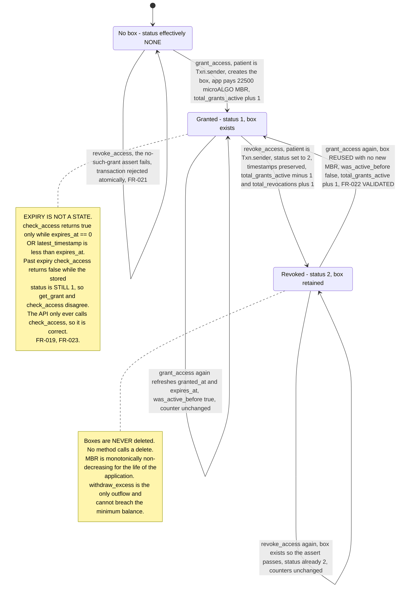
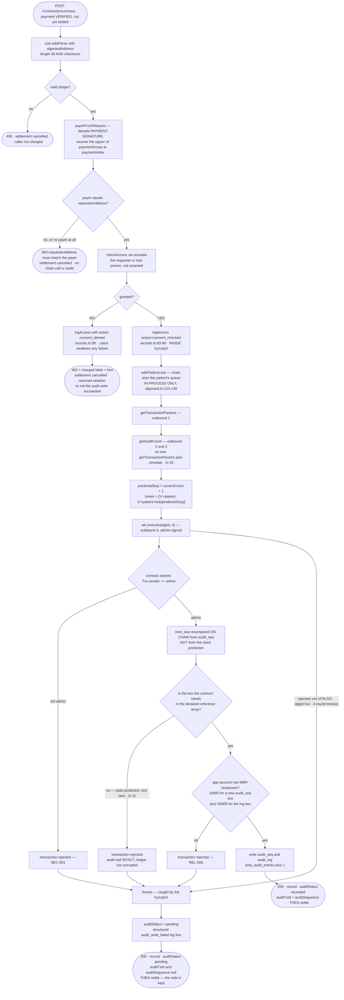
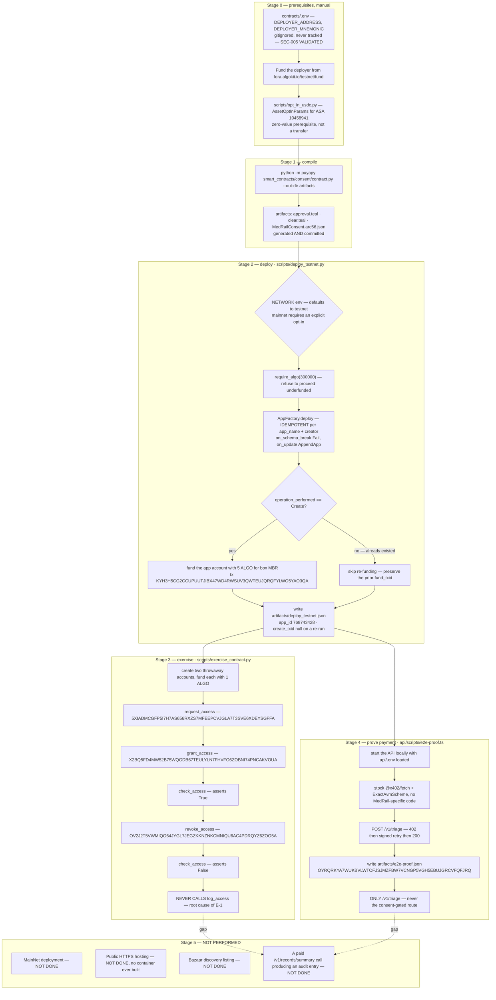
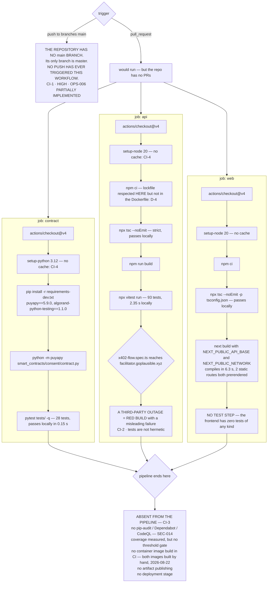

# MedRail — Activity Diagrams

**Purpose:** show the control flow of the system's five recurring processes — request handling, the consent state machine, the audit-append decision, the operational deploy-and-prove sequence, and CI.

**Status of this document:** Descriptive of the working tree on branch `main`. Status labels per the project fact ledger. Every flow is drawn with its failure branches intact rather than smoothed over — the interesting part of a control-flow diagram is what happens when a step does not succeed.

Related: [`./Sequence_Diagrams.md`](./Sequence_Diagrams.md) · [`./LLD.md`](./LLD.md) · [`./HLD.md`](./HLD.md) · [`../02_Requirements/SRS.md`](../02_Requirements/SRS.md) · [`../06_Security/Threat_Model.md`](../06_Security/Threat_Model.md)

---

## 1. Request lifecycle through the middleware stack

CORS and the payment middleware are mounted on `"*"` and run for every request; the payment middleware enforces only on the three configured route keys and passes everything else through untouched. The three rate limiters are mounted on specific paths.

```mermaid
flowchart TD
    START(["HTTP request"]) --> CORS["cors middleware<br/>origin *, methods GET POST OPTIONS<br/>allowHeaders deliberately unset<br/>app.ts:22-35"]
    CORS --> PRE{"OPTIONS preflight?"}
    PRE -->|"yes"| REFLECT["Reflect Access-Control-Request-Headers<br/>expose PAYMENT-REQUIRED, PAYMENT-RESPONSE"] --> DONE1(["204"])
    PRE -->|"no"| RLIM{"path rate-limited?<br/>consent/status 60/min · arc56 30/min<br/>records/summary 30/min · app.ts:44-46"}
    RLIM -->|"window exhausted"| C429(["HTTP 429 · Retry-After<br/>RATE_LIMITED · retryable true<br/>no facilitator call is made"])
    RLIM --> PAYMW["paymentMiddleware inside the outage wrapper<br/>app.ts:58-175, wrapped at :73-105"]

    PAYMW --> ISPRICED{"method + path in the priced map?<br/>POST /v1/triage · POST /v1/interaction-check<br/>POST /v1/records/summary"}
    ISPRICED -->|"no — the 5 free routes"| HANDLER

    ISPRICED -->|"yes"| INIT{"resourceServer already initialised?"}
    INIT -->|"no"| SUPPORTED["GET /supported from the facilitator<br/>resolves asset 10458941 and extra.feePayer"]
    SUPPORTED --> SUPOK{"fetch succeeded?"}
    SUPOK -->|"no"| C503(["HTTP 503 · Retry-After 30<br/>PAYMENT_FACILITATOR_UNAVAILABLE · retryable true<br/>structured facilitator_unavailable log"])
    SUPOK -->|"yes"| CACHE["cache payment kinds for the process lifetime<br/>PERF-001 IMPLEMENTED"]
    CACHE --> HASSIG
    INIT -->|"yes"| HASSIG

    HASSIG{"PAYMENT-SIGNATURE header present?"}
    HASSIG -->|"no"| C402(["HTTP 402 · empty body · PAYMENT-REQUIRED base64<br/>cache-control no-store<br/>HANDLER AND ZOD NEVER RUN"])
    HASSIG -->|"yes"| VERIFY["facilitator VERIFY — is this payment valid?"]
    VERIFY --> VEROK{"verified?"}
    VEROK -->|"no"| C402
    VEROK -->|"yes"| NOTYET["VERIFIED, NOT SETTLED — no money has moved"]
    NOTYET --> HANDLER

    HANDLER["route handler"] --> PARSE["parse the JSON body, falling back to an empty object<br/>then zod safeParse with algorandAddress"]
    PARSE --> VALID{"schema valid?"}
    VALID -->|"no"| C400(["HTTP 400 invalid request + zod flatten"])
    VALID -->|"yes"| LOGIC["business logic"]
    LOGIC --> THREW{"threw?"}
    THREW -->|"yes"| ONERR["app.onError · generate requestId<br/>log method, path, message, stack<br/>app.ts:113-140"]
    ONERR --> C500(["HTTP 500 INTERNAL_ERROR + requestId<br/>no exception text in the body"])
    THREW -->|"no"| OK["2xx response body composed"]

    OK --> GATE{"status below 400?"}
    C400 --> GATE
    C500 --> GATE
    GATE -->|"yes"| SETTLE(["processSettlement · 200 + PAYMENT-RESPONSE"])
    GATE -->|"no"| CANCEL(["cancellationDispatcher.cancel<br/>THE CALLER IS NOT CHARGED"])
```

**Four consequences of this ordering, all deliberate.**

1. **Settlement is last, and conditional.** `@x402/hono` verifies before the handler and settles only when the handler's status is below 400; a throw or any 4xx/5xx routes to `cancellationDispatcher.cancel(...)` instead. Every error terminal on this diagram — 429, 402, 400, 500, 503 — costs the caller nothing. REL-002 **VALIDATED — satisfied by the SDK**, an inherited property of x402 v2 rather than MedRail's own engineering.
2. **402 precedes 400.** The gate closes before any handler runs, so an unpaid malformed request returns 402. `api/test/x402-flow.spec.ts:48-59` records this in a comment and asserts `expect([400, 402]).toContain(res.status)` — documenting the ordering without freezing an incidental outcome. A *paid* malformed request returns 400 and the settlement is cancelled, so no refund path is needed.
3. **Rate limits run before the payment middleware**, so a caller who has exhausted a window cannot make MedRail talk to the facilitator either. They are scoped to the three paths that are free *to the caller*, since the priced happy paths are economically self-limiting.
4. **The two remaining error terminals are honest, not opaque.** The 503 carries a stable code, `Retry-After` and `retryable: true`, so a calling agent backs off rather than concluding the service is broken. The 500 carries a `requestId` the caller can quote and nothing else — internal exception text no longer crosses the boundary (SEC-010, SEC-011 **IMPLEMENTED**).

---

## 2. Consent state machine

Three stored status codes and **no stored expiry state**: `STATUS_NONE = 0`, `STATUS_GRANTED = 1`, `STATUS_REVOKED = 2` (`contracts/smart_contracts/consent/contract.py:46-48`). Expiry is a read-time predicate evaluated by `check_access`, never written back to the box.

**Live state on application `768743428`:** `total_grants_active = 4` and `total_audit_entries = 5`. The grant boxes come from `contracts/scripts/exercise_contract.py`; from the repeatable proof scripts `api/scripts/e2e-consent-proof.ts` and `api/scripts/verify-g01-fix.ts`, each of which issues a real grant before making its paid call; and from `api/scripts/grant-consent.ts`, which records a patient's grant to a named agent as a standalone transaction the patient signs itself — the path used for `IG4XEBTM…`, the grant that let the independent agent of [`./Sequence_Diagrams.md`](./Sequence_Diagrams.md) §10 read a record it does not own.

**Counter semantics worth stating.** Nothing decrements `total_grants_active` on expiry, so it means "grant boxes not yet revoked", not "grants currently valid". Finding **G-32** is open on exactly that: the name promises more than the counter delivers, and anyone reading it as a dashboard would be wrong.

**Why the box is reused rather than recreated.** `grant_access` keys the counter off the prior *status*, not prior *existence* (`contract.py:163-174`), with the reasoning stated in-code. A naive `if not box.exists()` would double-count reactivations. FR-022 **VALIDATED** by `test_consent.py::test_regrant_after_revoke_reactivates`.

---

## 3. Audit-append decision flow

The flagship mechanism, and the one with the most failure branches. It has executed on live TestNet — `total_audit_entries = 5`, first write `4YLKLQKK…` at sequence 1.

**Both branches are guarded, and they degrade differently on purpose.** The denied branch swallows the failure because it has nothing to report to the caller; the allowed branch catches it and *reports* it, in a field the caller can read. Before that guard existed, an unguarded `await` on the success path turned a transient chain error into a 500 — and because settlement is cancelled on a 5xx, what that 500 destroyed was **the sale**, not the caller's money. MedRail did the work, held a valid grant, and earned nothing. Trading an unrecoverable 500 for a delivered resource with a flagged audit entry is the better bargain on both sides.

**What `"pending"` promises, and what it does not.** It is an accurate label on a degraded response, not eventual consistency. There is no outbox, no retry scheduler and no replay, so a pending entry stays pending; the only trace is the `audit_write_failed` line on stdout, which nothing collects (finding **G-15**). The value of the field is that the degradation is **visible instead of silent** — a consumer needing a provable audit entry checks one field rather than inferring it from a null.

**What the contract protects.** `log_access` recomputes `next_seq` from on-chain state (`contract.py:231-233`), so a stale client-side prediction **cannot** corrupt or overwrite the audit trail. The prediction exists only because the AVM requires every touched box to be declared in advance. A lost race therefore yields a *rejected transaction*, not a bad record — and the `try/catch` converts that rejection into `auditStatus: "pending"`.

**How the flow finally got exercised on TestNet.** `log_access` has exactly one caller in the repository: `api/src/routes/records.ts`. Reaching it requires **both** a settled $0.05 payment **and** a live grant for the `records:summary` scope, and for a long time no script did both — `contracts/scripts/exercise_contract.py` stops at `revoke_access`, and `api/scripts/e2e-proof.ts` pays only `/v1/triage`. `api/scripts/e2e-consent-proof.ts` closes that gap: it grants consent from a funded account, makes the paid call, and writes `contracts/artifacts/e2e-consent-proof.json` with the grant, payment and audit transaction ids. It is repeatable, and FR-012 and FR-025 are now **VALIDATED on-chain**.

---

## 4. Operational flow — deploy, exercise, prove

The three Python scripts and one TypeScript script that produced every on-chain artefact in this repository.

**Why `create_txid` is `null`.** `deploy_testnet.py` records it only when `operation_performed == Create`. The run captured in the repository was an idempotent re-run against the already-deployed application, so the field is null while `fund_txid` is preserved from the prior run by explicit design (the script reads the existing file before rewriting it). The application genuinely exists — verified independently on the indexer at round 66088624 with `deleted: false`. State this rather than glossing it.

**Deliberate MainNet friction.** Both Python scripts default `NETWORK` to `testnet` and reject anything other than `testnet`/`mainnet`, so a bare run can never accidentally touch MainNet. `deploy_testnet.py` also changes its funding-hint text on MainNet to "a real ALGO purchase … this is MainNet, real funds". Good operational hygiene, recorded in the script docstrings.

**Nothing here is automated.** CI runs none of these stages (CI-3), `scripts/` at the repository root is empty (DOC-6), and there is no deployment stage anywhere in the pipeline.

---

## 5. CI pipeline flow

`.github/workflows/ci.yml` — three jobs, all `ubuntu-latest`, all independent and parallel.

**The precise statement of CI-1, which matters because it is easy to overstate.** The workflow is correct in content and every job it defines passes locally: API typecheck **PASS**, API build **PASS**, API tests **93 passed**, contract tests **28 passed**, web typecheck **PASS**, web build **PASS**. The problem is the trigger, not the code. `on.push.branches` is `[main]` while the repository's only branch is `master`, so the workflow has never fired on a push, and the repository has no pull requests for the `pull_request` trigger to catch. **The green badge is not green — it has never run.** The fix is one line, either way round: rename the branch, or change the trigger.

**CI-2 is a design consequence, not an accident.** `api/test/x402-flow.spec.ts` imports `api/src/app.ts`, whose payment middleware fetches `/supported` from the live facilitator — the same coupling that produces R-1 at runtime. Hermetic tests would need a stubbed facilitator client, which the SDK's `HTTPFacilitatorClient` seam makes straightforward. **RECOMMENDED**, not present.

**CI-4** — neither `setup-node` nor `setup-python` declares a `cache:` key, so every run re-downloads all dependencies. Low severity, pure wall-clock cost.
