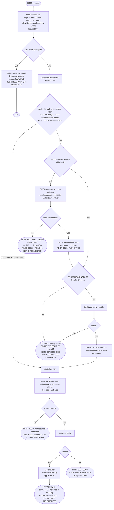
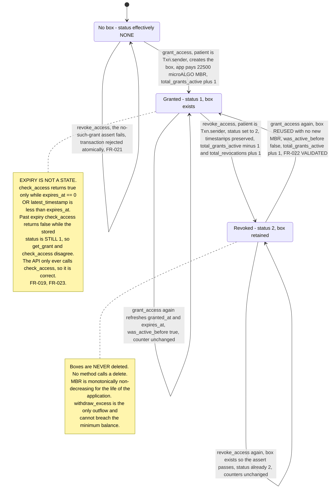
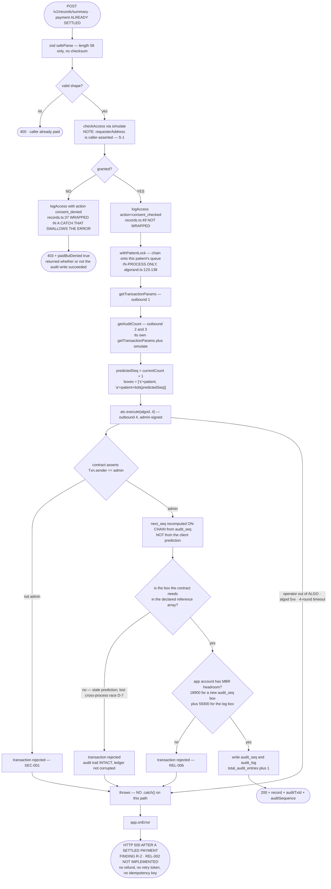
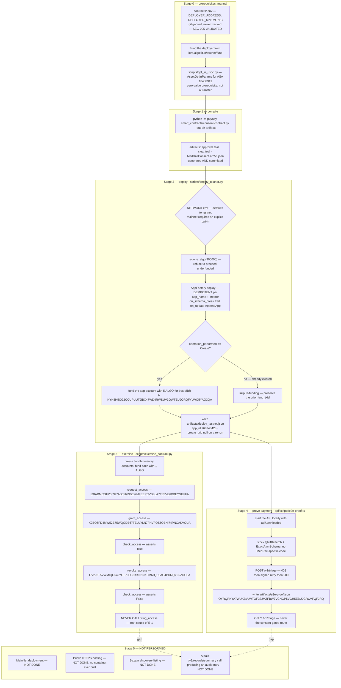
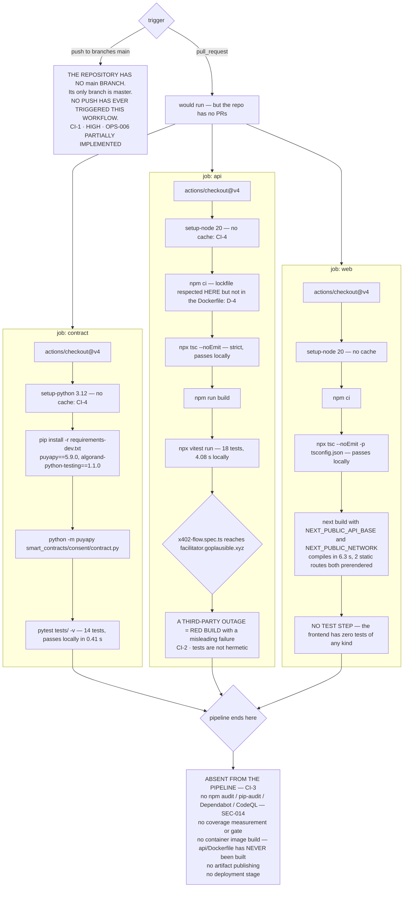

# MedRail — Activity Diagrams

> **⚠ Correction notice.** Parts of this document were written against a review finding that was
> later proven wrong. Settlement in x402 v2 happens **only** on a sub-400 response, so **no error
> path in MedRail can consume a settled payment** — and consent-denied calls (HTTP 403) are **not
> charged**, contrary to `API.md`, `SECURITY.md`, and the `paidButDenied` field. The audit-sequence
> race causes a **rejected transaction**, not a corrupted log. See
> [`CORRECTIONS.md`](../CORRECTIONS.md) — it supersedes any statement here that contradicts it.

**Purpose:** show the control flow of the system's five recurring processes — request handling, the consent state machine, the audit-append decision, the operational deploy-and-prove sequence, and CI.

**Status of this document:** Descriptive of commit `32ffd73` on branch `master`. Status labels per the project fact ledger. Two of the five flows contain a defect that is drawn explicitly rather than smoothed over: the audit-append flow (R-2) and the CI flow (CI-1).

Related: [`./Sequence_Diagrams.md`](./Sequence_Diagrams.md) · [`./LLD.md`](./LLD.md) · [`./HLD.md`](./HLD.md) · [`../02_Requirements/SRS.md`](../02_Requirements/SRS.md) · [`../06_Security/Threat_Model.md`](../06_Security/Threat_Model.md)

---

## 1. Request lifecycle through the middleware stack

Both middlewares are mounted on `"*"` and therefore run for every request; the payment middleware enforces only on the three configured route keys and passes everything else through untouched.

**Three consequences of this ordering, all deliberate or documented.**

1. **402 precedes 400.** The gate closes before any handler runs, so an unpaid malformed request returns 402. `api/test/x402-flow.spec.ts:48-59` records this in a comment and asserts `expect([400, 402]).toContain(res.status)` — documenting the ordering without freezing an incidental outcome.
2. **A paid malformed request still returns 400, after payment.** No refund path exists. Not currently a listed finding; recorded here because it is the same class of problem as R-2.
3. **The 500 branches are the system's two reliability findings.** `ERR500A` is R-1 (facilitator); `ERR500B` covers R-3 (address checksum), R-4 (algod timeout) and R-2 (post-settlement audit failure).

---

## 2. Consent state machine

Three stored status codes and **no stored expiry state**: `STATUS_NONE = 0`, `STATUS_GRANTED = 1`, `STATUS_REVOKED = 2` (`contracts/smart_contracts/consent/contract.py:46-48`). Expiry is a read-time predicate evaluated by `check_access`, never written back to the box.

**Live state on application `768743428`:** `total_requests = 2`, `total_grants_active = 0`, `total_revocations = 2`, `total_audit_entries = 0`, with **2 grant boxes present, both in the Revoked state**. The counters indicate `contracts/scripts/exercise_contract.py` was run twice; the second run's transaction ids are not recorded in the repository.

**Counter semantics worth stating.** Nothing decrements `total_grants_active` on expiry, so it means "grant boxes not yet revoked", not "grants currently valid". Anyone reading the counters as a dashboard should know that.

**Why the box is reused rather than recreated.** `grant_access` keys the counter off the prior *status*, not prior *existence* (`contract.py:156-167`), with the reasoning stated in-code. A naive `if not box.exists()` would double-count reactivations. FR-022 **VALIDATED** by `test_consent.py::test_regrant_after_revoke_reactivates`.

---

## 3. Audit-append decision flow

This is the flow that E-1 says has never run on live infrastructure.

**The asymmetry is the finding.** Both branches call the same function against the same infrastructure with the same failure modes. The denied branch swallows failure and still returns a coherent 403; the allowed branch does not. The perverse result is that refusing service is the better-engineered outcome.

**What the contract protects.** `log_access` recomputes `next_seq` from on-chain state (`contract.py:224-226`), so a stale client-side prediction **cannot** corrupt or overwrite the audit trail. The prediction exists only because the AVM requires every touched box to be declared in advance. A lost race therefore yields a *rejected transaction*, not a bad record — which on the allowed path is exactly R-2.

**Why this flow has never executed on TestNet — the causal explanation for E-1.** `log_access` has exactly one caller in the entire repository: `api/src/routes/records.ts` (verified by grep across `contracts/scripts`, `api`, `web`). Reaching it requires **both** a settled $0.05 payment **and** a live grant for the `records:summary` scope. Neither operational script does that: `contracts/scripts/exercise_contract.py` exercises `request_access` → `grant_access` → `check_access` → `revoke_access` and stops, and `api/scripts/e2e-proof.ts` pays only `/v1/triage`. **No script exercises the audit path.** That is why `total_audit_entries = 0` and why the flagship mechanism is **UNVALIDATED on-chain**. The gap is one script away from closing: grant consent from a funded account, then run the paid `/v1/records/summary` call against it.

---

## 4. Operational flow — deploy, exercise, prove

The three Python scripts and one TypeScript script that produced every on-chain artefact in this repository.

**Why `create_txid` is `null`.** `deploy_testnet.py` records it only when `operation_performed == Create`. The run captured in the repository was an idempotent re-run against the already-deployed application, so the field is null while `fund_txid` is preserved from the prior run by explicit design (the script reads the existing file before rewriting it). The application genuinely exists — verified independently on the indexer at round 66088624 with `deleted: false`. State this rather than glossing it.

**Deliberate MainNet friction.** Both Python scripts default `NETWORK` to `testnet` and reject anything other than `testnet`/`mainnet`, so a bare run can never accidentally touch MainNet. `deploy_testnet.py` also changes its funding-hint text on MainNet to "a real ALGO purchase … this is MainNet, real funds". Good operational hygiene, recorded in the script docstrings.

**Nothing here is automated.** CI runs none of these stages (CI-3), `scripts/` at the repository root is empty (DOC-6), and there is no deployment stage anywhere in the pipeline.

---

## 5. CI pipeline flow

`.github/workflows/ci.yml` — three jobs, all `ubuntu-latest`, all independent and parallel.

**The precise statement of CI-1, which matters because it is easy to overstate.** The workflow is correct in content and every job it defines passes locally: API typecheck **PASS**, API build **PASS**, API tests **18 passed**, contract tests **14 passed**, web typecheck **PASS**, web build **PASS**. The problem is the trigger, not the code. `on.push.branches` is `[main]` while the repository's only branch is `master`, so the workflow has never fired on a push, and the repository has no pull requests for the `pull_request` trigger to catch. **The green badge is not green — it has never run.** The fix is one line, either way round: rename the branch, or change the trigger.

**CI-2 is a design consequence, not an accident.** `api/test/x402-flow.spec.ts` imports `api/src/app.ts`, whose payment middleware fetches `/supported` from the live facilitator — the same coupling that produces R-1 at runtime. Hermetic tests would need a stubbed facilitator client, which the SDK's `HTTPFacilitatorClient` seam makes straightforward. **RECOMMENDED**, not present.

**CI-4** — neither `setup-node` nor `setup-python` declares a `cache:` key, so every run re-downloads all dependencies. Low severity, pure wall-clock cost.
