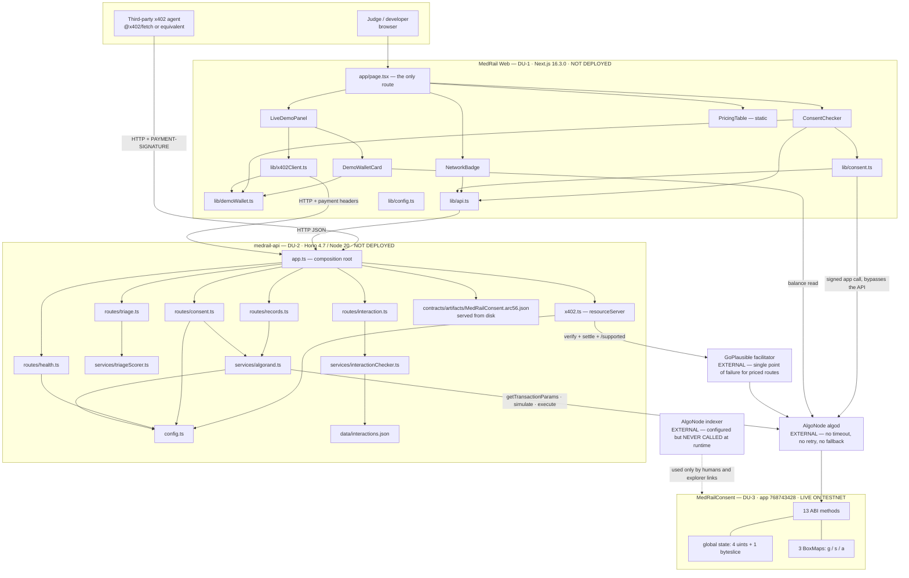
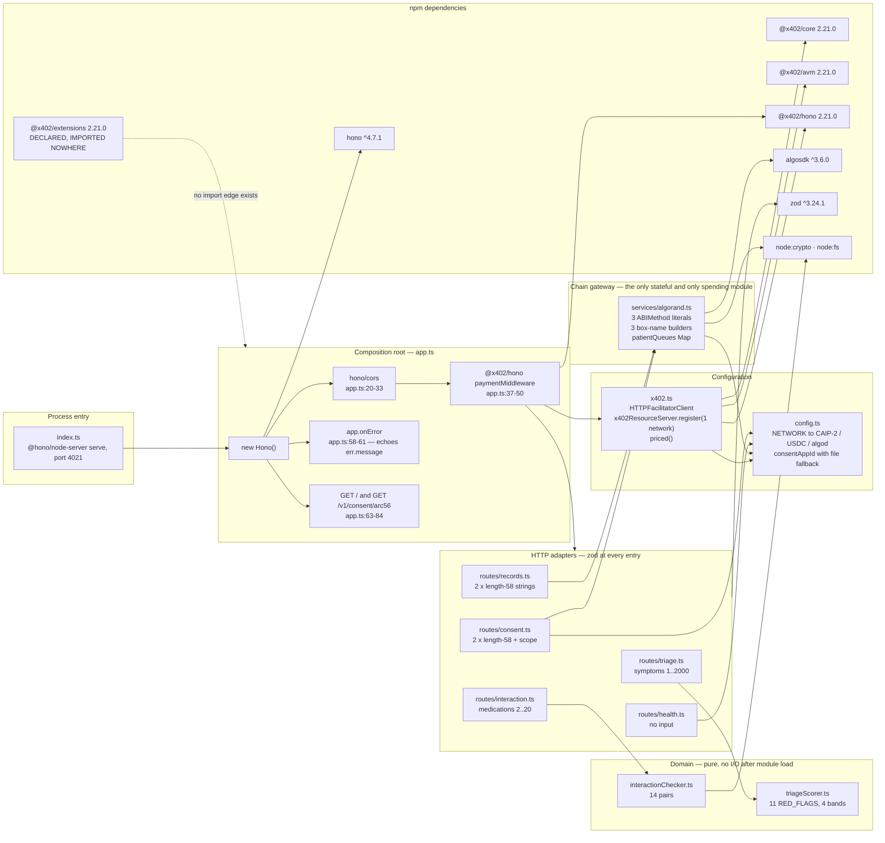
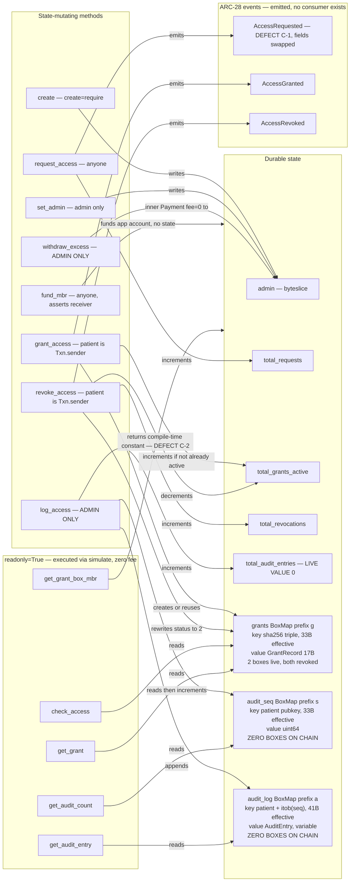
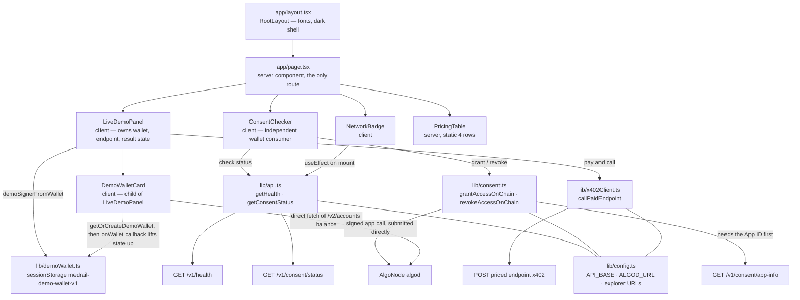

# MedRail — Component Diagrams

> **⚠ Correction notice.** Parts of this document were written against a review finding that was
> later proven wrong. Settlement in x402 v2 happens **only** on a sub-400 response, so **no error
> path in MedRail can consume a settled payment** — and consent-denied calls (HTTP 403) are **not
> charged**, contrary to `API.md`, `SECURITY.md`, and the `paidButDenied` field. The audit-sequence
> race causes a **rejected transaction**, not a corrupted log. See
> [`CORRECTIONS.md`](../CORRECTIONS.md) — it supersedes any statement here that contradicts it.

**Purpose:** enumerate every component in the system, the edges between them, and what breaks when each edge fails.

**Status of this document:** Descriptive of commit `32ffd73` on branch `master`. Every component shown exists in the repository; nothing is aspirational. There is **no database, cache, queue, worker, message bus or ML model** in any diagram because none exists in the system. Status labels per the project fact ledger.

Related: [`./System_Architecture.md`](./System_Architecture.md) · [`./HLD.md`](./HLD.md) · [`./LLD.md`](./LLD.md) · [`./Data_Flow_Diagrams.md`](./Data_Flow_Diagrams.md) · [`../02_Requirements/SRS.md`](../02_Requirements/SRS.md) · [`../06_Security/Threat_Model.md`](../06_Security/Threat_Model.md)

---

## 1. Whole-system components and dependencies

**Three edges that deserve comment.**

- `lib/consent.ts → AlgoNode algod` is drawn as bypassing the API on purpose: patient consent transactions are signed and submitted from the browser, and the backend is not on that path (`web/lib/consent.ts:44-89`). NFR-008 **IMPLEMENTED**. The dashed dependency `lib/consent.ts → lib/api.ts` is real but narrow — the browser calls `GET /v1/consent/app-info` only to learn the App ID (`web/lib/consent.ts:36-41`), so the coupling is availability, not trust.
- `AlgoNode indexer` is drawn dotted and unattached to any runtime component because it **is** unattached. `config.indexerServer` is resolved (`api/src/config.ts:51`) and no module reads it — verified by grep across `api/src`, `web/lib` and `web/components`. The indexer's only role is out-of-band human verification.
- `api/src/middleware/` is absent from the diagram because the directory is **empty**. The only two middlewares are `hono/cors` and `@x402/hono`'s `paymentMiddleware`, both mounted in `app.ts`.

---

## 2. API internal module graph

**Layering.** The graph is acyclic and three-deep: composition root → adapter → domain-or-gateway → SDK. No route imports another route, no service imports a route, and the two domain services import nothing but the standard library. `config.ts` is the only module imported by more than one layer, and it is a pure value object frozen at import (`api/src/config.ts:44-59`).

**Test coverage overlaid on this graph** — the shape of the gap is the point:

| Module | Tests | Coverage |
|---|---|---|
| `triageScorer.ts` | `api/test/triageScorer.spec.ts` | 7 tests — **VALIDATED** |
| `interactionChecker.ts` | `api/test/interactionChecker.spec.ts` | 6 tests — **VALIDATED** |
| `app.ts` + `x402.ts` (402 shape only) | `api/test/x402-flow.spec.ts` | 5 tests — **VALIDATED**, but not hermetic: makes a live facilitator call (CI-2) |
| `routes/records.ts` | — | **none** |
| `services/algorand.ts` | — | **none** — no box-name test, no lock test, no `checkAccess` test |
| `routes/consent.ts`, `config.ts` | — | **none** |

The two fully-tested modules are the two that cannot lose money. The two untested modules are the two that can. 18 API tests pass in 4.08 s; there is no coverage measurement, no threshold and no report.

---

## 3. Contract internal structure — methods to state

**Authorisation, read off the diagram.** Only two methods carry `assert Txn.sender == self.admin.value` — `log_access` (`contract.py:222`) and `withdraw_excess` (`contract.py:258`); SEC-001 and SEC-002 **VALIDATED** by two negative unit tests. Two methods derive the patient from `Txn.sender` rather than an argument — `grant_access` (`:151`) and `revoke_access` (`:181`); SEC-003 **VALIDATED**, and impersonation is impossible at this layer because there is no patient parameter to forge. Everything else is open by design: reads are public, `request_access` is a public signal, and `fund_mbr` is deliberately callable by anyone since the app owns the boxes being funded.

**The two dark boxes.** `audit_seq` and `audit_log` have **zero boxes on the deployed application** and `total_audit_entries = 0`. The entire right-hand column of the audit path — `log_access`, `get_audit_count`, `get_audit_entry` and the `s`/`a` BoxMaps — is exercised only by the AVM simulator (`contracts/tests/test_consent.py`, 14 passing, 0.41 s). Evidence gap **E-1**; FR-012 and FR-025 **UNVALIDATED on-chain**.

**Which methods the API actually calls.** Three of thirteen: `check_access` and `get_audit_count` by `simulate`, `log_access` by `execute` (`api/src/services/algorand.ts:20-46`). The browser calls two more: `grant_access` and `revoke_access` (`web/lib/consent.ts:7-24`). The remaining eight — `create`, `set_admin`, `fund_mbr`, `get_grant`, `get_audit_entry`, `get_grant_box_mbr`, `withdraw_excess` — are reachable only from the Python operational scripts or from a third party using the ARC-56 spec published at `GET /v1/consent/arc56`.

---

## 4. Frontend component tree and data flow

One route. Any diagram of MedRail Web showing more than one route is wrong — `next build` emits exactly two static entries, `/` and `/_not-found`, both prerendered.

**State ownership.** There is no state manager, no context provider and no store. `LiveDemoPanel` holds the wallet in `useState` and receives it through an `onWallet` callback from its `DemoWalletCard` child (`web/components/DemoWalletCard.tsx:12-17`) — a lift-state-up pattern. `ConsentChecker` does **not** share that state; it calls `getOrCreateDemoWallet()` independently on each action (`web/components/ConsentChecker.tsx:31`, `:38`, `:45`). Both converge on the same object because `sessionStorage` is the real source of truth. Correct, but it means the session-storage key is load-bearing shared state between two sibling components with no explicit contract between them.

**The demo's accidental defence against S-1.** `LiveDemoPanel` sends `requesterAddress: wallet.address` (`web/components/LiveDemoPanel.tsx:38`), and `ConsentChecker` grants the wallet access to itself (`web/components/ConsentChecker.tsx:32` — `grantAccessOnChain(wallet, wallet.address, SCOPE, 0)`). Payer, patient and requester are all the same address, so the missing payer-to-requester binding never manifests in the demo. That is a property of the demo, not of the API.

---

## 5. Dependency table

Coupling type: **compile** (import, checked by `tsc`) · **runtime-local** (in-process call) · **runtime-net** (network hop) · **protocol** (wire contract, not compiler-checked) · **config** (value dependency) · **filesystem**.

| # | Component | Depends on | Coupling | Failure impact | Requirement |
|---|---|---|---|---|---|
| 1 | `app.ts` | `hono`, `@x402/hono` | compile | Process will not start | — |
| 2 | `app.ts` | `x402.ts` → facilitator | runtime-net, lazy | **First priced request fails with HTTP 500, no `PAYMENT-REQUIRED`, no `Retry-After`. Free routes unaffected.** (R-1) | REL-001 **NOT IMPLEMENTED**; REL-005 **VALIDATED** |
| 3 | `app.ts` | `contracts/artifacts/MedRailConsent.arc56.json` | filesystem | `GET /v1/consent/arc56` returns 404 with a clear message (`app.ts:65-67`); nothing else affected. Handled gracefully. | FR-015 **IMPLEMENTED** |
| 4 | `x402.ts` | GoPlausible facilitator | runtime-net + protocol | Supplies `asset` and `extra.feePayer` for the 402. Sole cause of R-1 and CI-2. | — |
| 5 | `x402.ts` | `config.networkCaip2`, `config.payToAddress` | config | A missing `PAY_TO_ADDRESS`/`OPERATOR_ADDRESS` yields an empty `payTo` in the 402 with no validation (`config.ts:53`). | NFR-003 **VALIDATED** |
| 6 | `routes/triage.ts` | `triageScorer.ts` | compile + runtime-local | Deterministic, no I/O — cannot fail at runtime. | FR-004 **VALIDATED** |
| 7 | `routes/interaction.ts` | `interactionChecker.ts` | compile + runtime-local | Same. | FR-007 **VALIDATED** |
| 8 | `interactionChecker.ts` | `api/src/data/interactions.json` | filesystem, module load | A missing or malformed file throws during import and **kills the process at startup**, not per-request. Copied into the image at `api/Dockerfile:19`. | DATA-005 **VALIDATED** |
| 9 | `routes/records.ts` | `services/algorand.ts` | compile + runtime-local | Every failure mode of the gateway becomes a 500 on a paid request. | FR-010 **UNVALIDATED** |
| 10 | `routes/records.ts` | *nothing that identifies the caller* | **absent** | **S-1: `requesterAddress` is caller-asserted; any payer can impersonate any authorised requester, and the forged identity is written to the immutable audit log.** | SEC-006 **DEFEATED**; SEC-007, SEC-008, FR-039 **NOT IMPLEMENTED** |
| 11 | `routes/consent.ts` | `services/algorand.ts` → `getOperator()` | runtime-local | The **free, unauthenticated** endpoint cannot serve a request without `OPERATOR_MNEMONIC` loaded (`algorand.ts:8-14`). | FR-013 **IMPLEMENTED** |
| 12 | `services/algorand.ts` | AlgoNode algod | runtime-net | No timeout, no retry, no circuit breaker, no fallback endpoint (`algorand.ts:5`). One blip ⇒ 500 on `/v1/consent/status` and `/v1/records/summary`. | REL-003 **NOT IMPLEMENTED** (R-4) |
| 13 | `services/algorand.ts` | `config.consentAppId` | config | 0 ⇒ `requireConsentAppId()` throws ⇒ 500 on both consent-touching endpoints. In a container this is the default (D-1). | NFR-004 **IMPLEMENTED (breaks in container)** |
| 14 | `services/algorand.ts` | `MedRailConsent` ABI signatures | **protocol, hand-maintained** | A contract signature change compiles cleanly on both sides and fails only at call time. Four copies of the interface exist. | — |
| 15 | `services/algorand.ts` | `contract.py` key derivation | **protocol, hand-maintained, unverified** | Divergence produces a box reference for a non-existent key — reads as "no grant", writes to the wrong slot. Silent. No cross-implementation test. | NFR-011 **UNVALIDATED** |
| 16 | `services/algorand.ts` | `patientQueues` in-process Map | runtime-local, **process-scoped** | Guarantees per-patient ordering in one process only. `fly.toml:17-19` permits more than one machine. | REL-004 **PARTIALLY IMPLEMENTED** (D-7) |
| 17 | `services/algorand.ts` | `OPERATOR_MNEMONIC` = contract admin | config, **secret** | Compromise ⇒ forge audit entries, rotate `admin`, drain the app account. Single hot key in an env var, no rotation runbook. | SEC-012 **NOT IMPLEMENTED** |
| 18 | `MedRailConsent` | app-account MBR balance | economic | Exhaustion ⇒ `log_access` fails ⇒ on the allowed path, R-2. No monitoring, no alerting, and the advertised per-box cost is 400 µALGO low (C-2). | REL-006 **PARTIALLY IMPLEMENTED** |
| 19 | `web/lib/x402Client.ts` | `medrail-api` | runtime-net + protocol | API down ⇒ demo shows the red "API unreachable" badge (`NetworkBadge.tsx:16-23`). Handled gracefully. | FR-036 **IMPLEMENTED** |
| 20 | `web/lib/consent.ts` | `GET /v1/consent/app-info` | runtime-net | **Availability coupling only.** API down ⇒ the consent panel cannot learn the App ID and fails. The patient key is still never exposed to the backend. | NFR-008 **IMPLEMENTED** |
| 21 | `web/lib/consent.ts` | AlgoNode algod | runtime-net | Grant/revoke fail; the error surfaces in `ConsentChecker`'s error state. Independent of API availability. | FR-035 **IMPLEMENTED** |
| 22 | `web/lib/demoWallet.ts` | `sessionStorage` | runtime-local, **browser** | Cleared on tab close, by design. Plaintext mnemonic ⇒ any XSS exfiltrates a TestNet key. Bounded to play money and disclosed in the UI. | FR-033 **IMPLEMENTED** |
| 23 | `web/lib/demoWallet.ts:12` | `lib/walletConnect.ts` | **broken reference** | The file does not exist. No wallet-connect integration exists anywhere in `web/`. Documentation claiming a production wallet path is **NOT IMPLEMENTED** (DOC-4). | — |
| 24 | `api/package.json` | `@x402/extensions@2.21.0` | **declared, never imported** | Dead dependency. Any claim that MedRail implements the Bazaar discovery extension is unsupported by code (DOC-9). | **PARTIALLY IMPLEMENTED** |
| 25 | `api/Dockerfile` | repo-root build context | build | `api/.env` and `contracts/.env` enter the build context; no `.dockerignore` exists anywhere. Nothing is `COPY`'d from them today. | SEC-015 **NOT IMPLEMENTED** (D-3) |
| 26 | `api/fly.toml` | `NETWORK = "mainnet"`, no `CONSENT_APP_ID` | config | A `fly deploy` today yields a service on a network where `MedRailConsent` does not exist, with `consentAppId = 0`. | D-1, D-2 |
| 27 | `.github/workflows/ci.yml` | `push: branches: [main]` | config | The only branch is `master`. **No push has ever triggered CI.** All jobs pass locally. | OPS-006 **PARTIALLY IMPLEMENTED** (CI-1) |
| 28 | `api/test/x402-flow.spec.ts` | live facilitator | runtime-net, **in test** | Tests are not hermetic; a third-party outage produces a red build with a misleading failure (CI-2). | — |

### 5.1 Single points of failure, ranked

| Rank | Component | Blast radius | Mitigation present |
|---|---|---|---|
| 1 | `OPERATOR_MNEMONIC` | Total compromise of the audit trail, admin authority and app funds | None. No multisig, no HSM, no rotation policy. |
| 2 | GoPlausible facilitator | All three priced routes ⇒ 100% of revenue path | None. No timeout, retry, circuit breaker or cached `/supported`. |
| 3 | AlgoNode algod | `/v1/consent/status` and `/v1/records/summary` | None. No timeout, retry or secondary endpoint. |
| 4 | App-account MBR balance | All audit writes; on the allowed path this becomes R-2 | `fund_mbr` exists and is callable by anyone, but nothing monitors headroom. |
| 5 | `medrail-api` process | All seven endpoints | Stateless, so restart is safe and instant — but nothing restarts it, and no healthcheck is wired (D-6). |

Note what is **not** on this list: there is no database to lose, no cache to stampede, no queue to back up and no migration to fail. That is the compensating benefit of the "ledger is the database" choice, and it is real.
