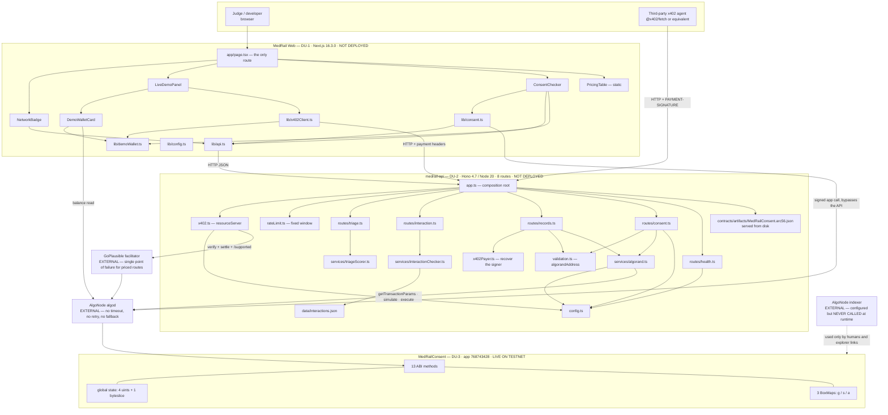
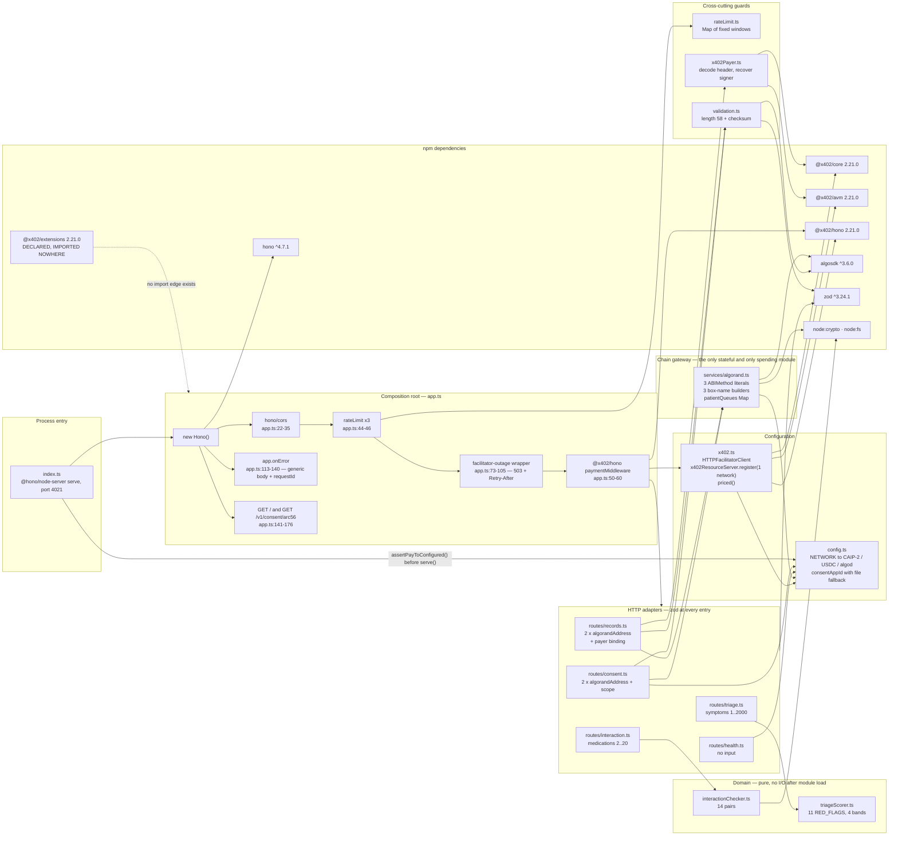
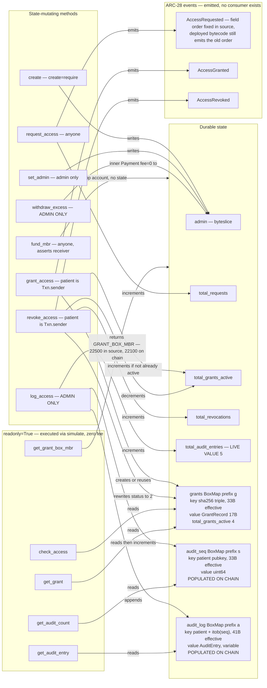
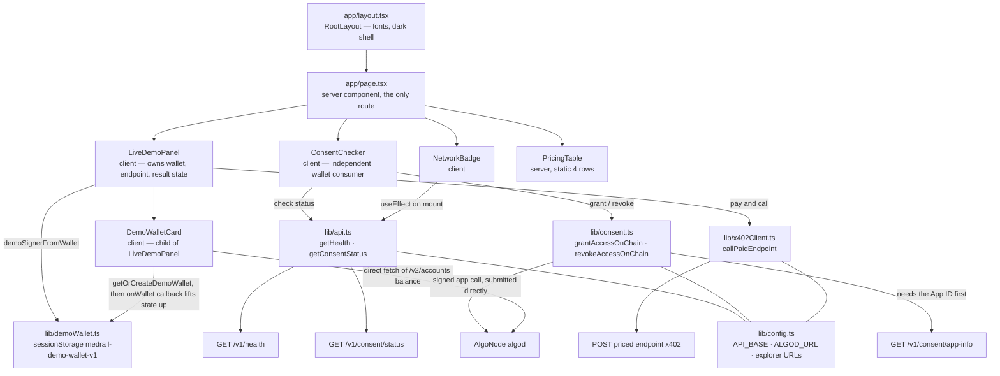

# MedRail — Component Diagrams

**Purpose:** enumerate every component in the system, the edges between them, and what breaks when each edge fails.

**Status of this document:** Descriptive of the working tree on branch `main`. Every component shown exists in the repository; nothing is aspirational. There is **no database, cache, queue, worker, message bus or ML model** in any diagram because none exists in the system. Status labels per the project fact ledger.

Related: [`./System_Architecture.md`](./System_Architecture.md) · [`./HLD.md`](./HLD.md) · [`./LLD.md`](./LLD.md) · [`./Data_Flow_Diagrams.md`](./Data_Flow_Diagrams.md) · [`../02_Requirements/SRS.md`](../02_Requirements/SRS.md) · [`../06_Security/Threat_Model.md`](../06_Security/Threat_Model.md)

---

## 1. Whole-system components and dependencies

**Four edges that deserve comment.**

- `routes/records.ts → x402Payer.ts` is the shortest edge on the diagram and the one the product rests on. It reads the `PAYMENT-SIGNATURE` header the payment middleware has already verified, recovers the address that signed the caller's payment leg, and lets the route refuse anything whose asserted `requesterAddress` does not match. Note there is **no edge from `x402Payer.ts` to anything external** — no facilitator call, no algod call, no key store. The identity is already in the request.
- `lib/consent.ts → AlgoNode algod` is drawn as bypassing the API on purpose: patient consent transactions are signed and submitted from the browser, and the backend is not on that path (`web/lib/consent.ts:44-89`). NFR-008 **IMPLEMENTED**. The dashed dependency `lib/consent.ts → lib/api.ts` is real but narrow — the browser calls `GET /v1/consent/app-info` only to learn the App ID (`web/lib/consent.ts:36-41`), so the coupling is availability, not trust.
- `AlgoNode indexer` is drawn dotted and unattached to any runtime component because it **is** unattached. `config.indexerServer` is resolved (`api/src/config.ts:55`) and no module reads it — verified by grep across `api/src`, `web/lib` and `web/components`. The indexer's only role is out-of-band human verification. Finding **G-29**, open: dead configuration implying a capability the service does not have.
- `api/src/middleware/` is absent from the diagram because the directory is **empty**. The custom middleware that does exist lives at the top level — `rateLimit.ts`, and the facilitator-outage wrapper defined inline in `app.ts:73-105` — alongside `hono/cors` and `@x402/hono`'s `paymentMiddleware`.

---

## 2. API internal module graph

**Layering.** The graph is acyclic and three-deep: composition root → adapter → guard-or-domain-or-gateway → SDK. No route imports another route, no service imports a route, and the two domain services import nothing but the standard library. The three cross-cutting guards are leaves: `validation.ts` and `x402Payer.ts` import only SDKs, and `rateLimit.ts` imports nothing but Hono's types. `config.ts` is the only module imported by more than one layer, and it is a pure value object frozen at import (`api/src/config.ts:46-64`) plus one assertion called once at boot from `index.ts`.

**Test coverage overlaid on this graph** — the shape of the gap is still the point, but the gap has moved:

| Module | Tests | Coverage |
|---|---|---|
| `triageScorer.ts` | `api/test/triageScorer.spec.ts` | 7 tests — **VALIDATED** |
| `interactionChecker.ts` | `api/test/interactionChecker.spec.ts` | 6 tests — **VALIDATED** |
| `x402Payer.ts` | `api/test/x402Payer.spec.ts` | 6 tests — **VALIDATED**, including a group with facilitator fee-payer legs ahead of the payment |
| `app.ts` route index, `validation.ts`, `rateLimit.ts` | `api/test/app.spec.ts` | 7 tests — **VALIDATED**: advertised routes equal mounted routes, bad checksum is a 400, no exception text leaks, 429 with `Retry-After`, health not throttled |
| box-key derivation (Node + WebCrypto paths) | `api/test/boxKeyParity.spec.ts` | golden vectors from `fixtures/box-key-vectors.json`, cross-checked against `contracts/tests/test_box_keys.py` |
| `app.ts` + `x402.ts` (402 shape) | `api/test/x402-flow.spec.ts` | 5 tests — **VALIDATED**, but not hermetic: makes a live facilitator call |
| `routes/records.ts` | covered at its boundaries by `app.spec.ts` and `x402Payer.spec.ts` | **no dedicated file** — the full paid path is exercised by `api/scripts/e2e-consent-proof.ts` and `verify-g01-fix.ts` against live TestNet |
| `services/algorand.ts` | box-key derivation only, via `boxKeyParity.spec.ts` | **no dedicated file** — no lock test, no `checkAccess` test. Finding **G-05**, open |
| `routes/consent.ts`, `config.ts` | `app.spec.ts` exercises `consent.ts` validation | no direct `config.ts` test |

**45 API tests and 28 contract tests — 73 in total** — plus two repeatable live-TestNet proof scripts. There is still no coverage measurement, no threshold and no report, and the frontend has no automated tests of any kind.

---

## 3. Contract internal structure — methods to state

**Authorisation, read off the diagram.** Only two methods carry `assert Txn.sender == self.admin.value` — `log_access` (`contract.py:229`) and `withdraw_excess` (`contract.py:265`); SEC-001 and SEC-002 **VALIDATED** by two negative unit tests. Two methods derive the patient from `Txn.sender` rather than an argument — `grant_access` (`:158`) and `revoke_access` (`:188`); SEC-003 **VALIDATED**, and impersonation is impossible at this layer because there is no patient parameter to forge. Everything else is open by design: reads are public, `request_access` is a public signal, and `fund_mbr` is deliberately callable by anyone since the app owns the boxes being funded.

**The audit path is no longer dark.** `audit_seq` and `audit_log` both hold boxes on the deployed application and `total_audit_entries = 5`. `log_access` first executed live in transaction `4YLKLQKKWXXFW3UT5APJVYKXI7T7A6OACTAWCC5YBAN3XGOGHRVQ` at sequence 1, and `api/scripts/e2e-consent-proof.ts` reproduces the whole grant → check → pay → append path on demand. FR-012 and FR-025 **VALIDATED on-chain**. The simulator suite remains the fast feedback loop: `contracts/tests/test_consent.py` plus `test_box_keys.py`, **28 tests**.

**Two divergences between this diagram's source and the deployed bytecode.** `AccessRequested`'s field order and `GRANT_BOX_MBR`'s value are both corrected in `contract.py` with regression tests, but app `768743428` still runs the pre-fix program. `contracts/scripts/deploy_testnet.py` uses `OnUpdate.AppendApp`, so redeploying would create a *new* application and orphan the App ID along with every transaction cited in these documents — the divergence is carried deliberately. Neither affects on-chain state: one is an event feed with no consumer, the other an advisory constant.

**Which methods the API actually calls.** Three of thirteen: `check_access` and `get_audit_count` by `simulate`, `log_access` by `execute` (`api/src/services/algorand.ts:20-46`). The browser calls two more: `grant_access` and `revoke_access` (`web/lib/consent.ts:7-24`). The remaining eight — `create`, `set_admin`, `fund_mbr`, `get_grant`, `get_audit_entry`, `get_grant_box_mbr`, `withdraw_excess` — are reachable only from the Python operational scripts or from a third party using the ARC-56 spec published at `GET /v1/consent/arc56`.

---

## 4. Frontend component tree and data flow

One route. Any diagram of MedRail Web showing more than one route is wrong — `next build` emits exactly two static entries, `/` and `/_not-found`, both prerendered.

**State ownership.** There is no state manager, no context provider and no store. `LiveDemoPanel` holds the wallet in `useState` and receives it through an `onWallet` callback from its `DemoWalletCard` child (`web/components/DemoWalletCard.tsx:12-17`) — a lift-state-up pattern. `ConsentChecker` does **not** share that state; it calls `getOrCreateDemoWallet()` independently on each action (`web/components/ConsentChecker.tsx:31`, `:38`, `:45`). Both converge on the same object because `sessionStorage` is the real source of truth. Correct, but it means the session-storage key is load-bearing shared state between two sibling components with no explicit contract between them.

**Why the demo satisfies the payer binding without doing anything special.** `LiveDemoPanel` sends `requesterAddress: wallet.address` (`web/components/LiveDemoPanel.tsx:38`) and pays with that same wallet, and `ConsentChecker` grants the wallet access to itself (`web/components/ConsentChecker.tsx:32` — `grantAccessOnChain(wallet, wallet.address, SCOPE, 0)`). Payer, patient and requester are all the same address, so `payer === requesterAddress` holds trivially. Two consequences worth separating: the demo needed no change when the binding was added, which is a good sign about the API's ergonomics — and the demo can never exercise the *rejection* branch, which is why the proof of that branch lives in `api/scripts/verify-g01-fix.ts` against live TestNet rather than in the UI.

---

## 5. Dependency table

Coupling type: **compile** (import, checked by `tsc`) · **runtime-local** (in-process call) · **runtime-net** (network hop) · **protocol** (wire contract, not compiler-checked) · **config** (value dependency) · **filesystem**.

| # | Component | Depends on | Coupling | Failure impact | Requirement |
|---|---|---|---|---|---|
| 1 | `app.ts` | `hono`, `@x402/hono` | compile | Process will not start | — |
| 2 | `app.ts` | `x402.ts` → facilitator | runtime-net, lazy | **Priced routes return 503 + `Retry-After: 30` + `PAYMENT_FACILITATOR_UNAVAILABLE`, not an opaque 500. Free routes unaffected.** The dependency itself is unchanged — no cached `/supported`, no circuit breaker, no second facilitator. | REL-001 **PARTIALLY IMPLEMENTED**; REL-005 **VALIDATED** |
| 3 | `app.ts` | `contracts/artifacts/MedRailConsent.arc56.json` | filesystem | `GET /v1/consent/arc56` returns 404 with a clear message (`app.ts:143-145`); nothing else affected. Handled gracefully. | FR-015 **IMPLEMENTED** |
| 4 | `x402.ts` | GoPlausible facilitator | runtime-net + protocol | Supplies `asset` and `extra.feePayer` for the 402, so a challenge cannot be built offline. Also why `x402-flow.spec.ts` is not hermetic. | — |
| 5 | `x402.ts` | `config.networkCaip2`, `config.payToAddress` | config | A missing or checksum-invalid `PAY_TO_ADDRESS`/`OPERATOR_ADDRESS` now **stops the process at boot** — `assertPayToConfigured()` is called from `index.ts` before `serve()`, so the service can never advertise an empty payee. G-30 closed. | NFR-003 **VALIDATED** |
| 6 | `routes/triage.ts` | `triageScorer.ts` | compile + runtime-local | Deterministic, no I/O — cannot fail at runtime. | FR-004 **VALIDATED** |
| 7 | `routes/interaction.ts` | `interactionChecker.ts` | compile + runtime-local | Same. | FR-007 **VALIDATED** |
| 8 | `interactionChecker.ts` | `api/src/data/interactions.json` | filesystem, module load | A missing or malformed file throws during import and **kills the process at startup**, not per-request. Copied into the image at `api/Dockerfile:19`. | DATA-005 **VALIDATED** |
| 9 | `routes/records.ts` | `services/algorand.ts` | compile + runtime-local | A `checkAccess` failure becomes a generic 500 with a `requestId` and cancels settlement. A `logAccess` failure is caught and degrades the response to `auditStatus: "pending"` rather than discarding the sale. | FR-010 **VALIDATED** |
| 10 | `routes/records.ts` | `x402Payer.ts` → the `PAYMENT-SIGNATURE` header | compile + runtime-local | **The authorisation edge.** The payer is recovered from `paymentGroup[paymentIndex]` and must equal `requesterAddress`, else 403 before any chain call. `null` is treated as unauthenticated. Verified live: `contracts/artifacts/g01-verification.json`. | SEC-006, SEC-007, SEC-008, FR-039 **IMPLEMENTED** |
| 11 | `routes/consent.ts` | `services/algorand.ts` → `getOperator()` | runtime-local | The **free, unauthenticated** endpoint cannot serve a request without `OPERATOR_MNEMONIC` loaded (`algorand.ts:8-14`). | FR-013 **IMPLEMENTED** |
| 12 | `services/algorand.ts` | AlgoNode algod | runtime-net | No timeout, no retry, no circuit breaker, no fallback endpoint (`algorand.ts:5`). A blip on the read path is a 500 and cancels settlement; a blip on the audit write degrades to `auditStatus: "pending"`. | REL-003 **NOT IMPLEMENTED** |
| 13 | `services/algorand.ts` | `config.consentAppId` | config | 0 ⇒ `requireConsentAppId()` throws ⇒ 500 on both consent-touching endpoints. `api/fly.toml` now sets `CONSENT_APP_ID = "768743428"` explicitly, so the container no longer relies on the artifact-file fallback. G-07 closed. | NFR-004 **IMPLEMENTED** |
| 14 | `services/algorand.ts` | `MedRailConsent` ABI signatures | **protocol, hand-maintained** | A contract signature change compiles cleanly on both sides and fails only at call time. Four copies of the interface exist. | — |
| 15 | `services/algorand.ts` | `contract.py` key derivation | **protocol, hand-maintained, now pinned** | Divergence would produce a box reference for a non-existent key — reads as "no grant", writes to the wrong slot, silently. `api/test/fixtures/box-key-vectors.json` is asserted by `boxKeyParity.spec.ts` (Node + WebCrypto) and `contracts/tests/test_box_keys.py` (Python), so a drift now fails a test. G-08 closed. | NFR-011 **VALIDATED** |
| 16 | `services/algorand.ts` | `patientQueues` in-process Map | runtime-local, **process-scoped** | Guarantees per-patient ordering in one process only. `api/fly.toml` pins `max_machines_running = 1` and names this module as the reason, so config and code agree — at the cost of a scaling ceiling. G-11 is open as exactly that. | REL-004 **IMPLEMENTED for one machine** |
| 17 | `services/algorand.ts` | `OPERATOR_MNEMONIC` = contract admin | config, **secret** | Compromise ⇒ forge audit entries, rotate `admin`, drain the app account. Single hot key in an env var, no rotation runbook. | SEC-012 **NOT IMPLEMENTED** |
| 18 | `MedRailConsent` | app-account MBR balance | economic | Exhaustion ⇒ `log_access` fails ⇒ 200 with `auditStatus: "pending"` and an `audit_write_failed` log line. Nothing monitors headroom or alerts on it (G-15). The deployed `get_grant_box_mbr()` still advertises 22100 against a true 22500 until redeploy. | REL-006 **PARTIALLY IMPLEMENTED** |
| 19 | `web/lib/x402Client.ts` | `medrail-api` | runtime-net + protocol | API down ⇒ demo shows the red "API unreachable" badge (`NetworkBadge.tsx:16-23`). Handled gracefully. | FR-036 **IMPLEMENTED** |
| 20 | `web/lib/consent.ts` | `GET /v1/consent/app-info` | runtime-net | **Availability coupling only.** API down ⇒ the consent panel cannot learn the App ID and fails. The patient key is still never exposed to the backend. | NFR-008 **IMPLEMENTED** |
| 21 | `web/lib/consent.ts` | AlgoNode algod | runtime-net | Grant/revoke fail; the error surfaces in `ConsentChecker`'s error state. Independent of API availability. | FR-035 **IMPLEMENTED** |
| 22 | `web/lib/demoWallet.ts` | `sessionStorage` | runtime-local, **browser** | Cleared on tab close, by design. Plaintext mnemonic ⇒ any XSS exfiltrates a TestNet key. Bounded to play money and disclosed in the UI. | FR-033 **IMPLEMENTED** |
| 23 | `web/lib/demoWallet.ts:12` | `lib/walletConnect.ts` | **broken reference in a comment** | The file does not exist and no wallet-connect integration exists anywhere in `web/`. The documentation over-claim has been withdrawn — `docs/IMPLEMENTATION_PLAN.md` §4 now states plainly that the real-wallet path is not implemented — closing G-18. The code comment itself is still a dangling pointer. | — |
| 24 | `api/package.json` | `@x402/extensions@2.21.0` | **declared, never imported** | Dead dependency. MedRail does **not** implement the Bazaar discovery extension — only its route metadata happens to be shape-compatible. `docs/COMPLIANCE.md` states this correctly, closing G-17. | **NOT IMPLEMENTED** |
| 25 | `api/Dockerfile` | repo-root build context | build | A `.dockerignore` now exists at the repo root and in `web/`, so `.env` files are excluded from the build context, and both Dockerfiles use `npm ci` against the committed lockfiles. G-13, G-14 closed. | SEC-015 **IMPLEMENTED** |
| 26 | `api/fly.toml` | `NETWORK = "testnet"`, `CONSENT_APP_ID = "768743428"` | config | Correct, with a `/v1/health` check every 30s and `max_machines_running = 1`. Never applied — `fly deploy` has not been run. | G-07 closed; NFR-007 **UNVALIDATED** |
| 27 | `.github/workflows/ci.yml` | `push: branches: [main, master]` + `workflow_dispatch` | config | Both branch names are listed and the repository's branch is now `main`, so pushes trigger CI. Adds pip and npm caching, `npm audit --audit-level=high` on both packages, and an artifact-freshness gate (`git diff --exit-code -- contracts/artifacts/` after recompiling). G-06 closed. | OPS-006 **IMPLEMENTED** |
| 28 | `api/test/x402-flow.spec.ts` | live facilitator | runtime-net, **in test** | These five tests are not hermetic; a third-party outage produces a red build with a misleading failure. The other 40 API tests are hermetic. | — |

### 5.1 Single points of failure, ranked

| Rank | Component | Blast radius | Mitigation present |
|---|---|---|---|
| 1 | `OPERATOR_MNEMONIC` | Total compromise of the audit trail, admin authority and app funds | None. No multisig, no HSM, no rotation policy. SEC-012 **NOT IMPLEMENTED**. |
| 2 | GoPlausible facilitator | All three priced routes ⇒ 100% of the revenue path | **Degradation, not redundancy.** 503 + `Retry-After: 30` + a stable error code, so a calling agent can back off instead of giving up. Still no timeout, circuit breaker, cached `/supported` or second facilitator. |
| 3 | AlgoNode algod | `/v1/consent/status` and `/v1/records/summary` | None on the read path. On the audit-write path the failure degrades to `auditStatus: "pending"` rather than an error. No timeout, retry or secondary endpoint. |
| 4 | App-account MBR balance | All audit writes | `fund_mbr` exists and is callable by anyone, and a write failure degrades rather than erroring — but nothing monitors headroom or alerts on it (G-15). |
| 5 | `medrail-api` process | All eight routes | Stateless, so restart is safe and instant, and `api/fly.toml` now wires a `/v1/health` check every 30 s so the platform will restart it. Pinned to `max_machines_running = 1` by the audit lock (G-11), so there is no second instance to fail over to. |

Note what is **not** on this list: there is no database to lose, no cache to stampede, no queue to back up and no migration to fail. That is the compensating benefit of the "ledger is the database" choice, and it is real. The corresponding cost is visible at rank 5 — statelessness makes restarts free, but the one piece of correctness-bearing in-process state, the audit-sequencing lock, is exactly what stops the service scaling past one machine.
