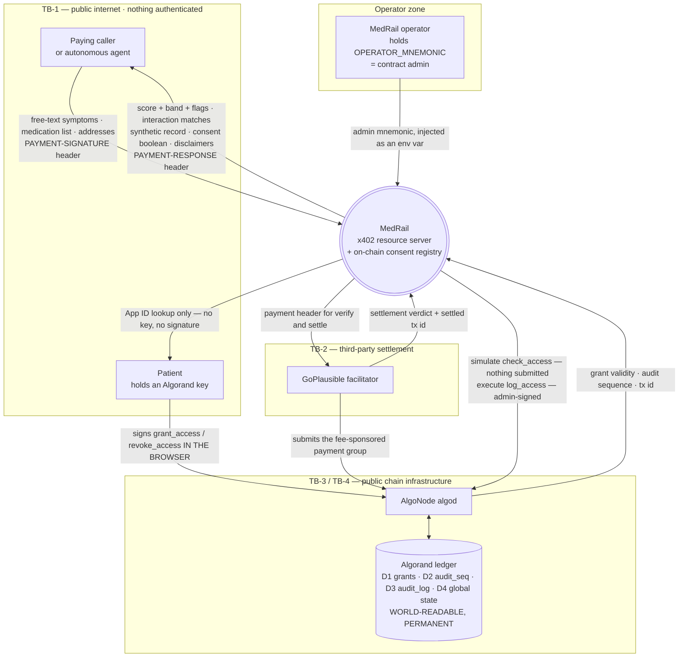
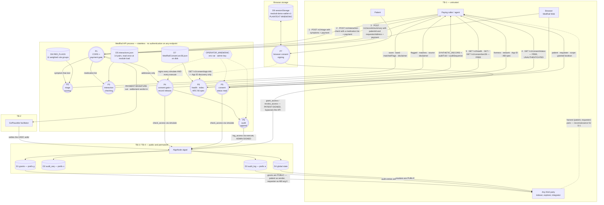
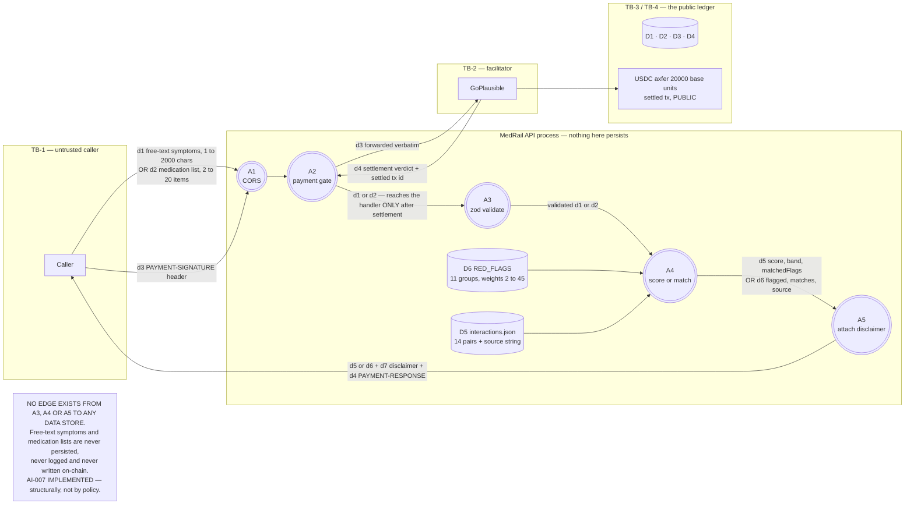
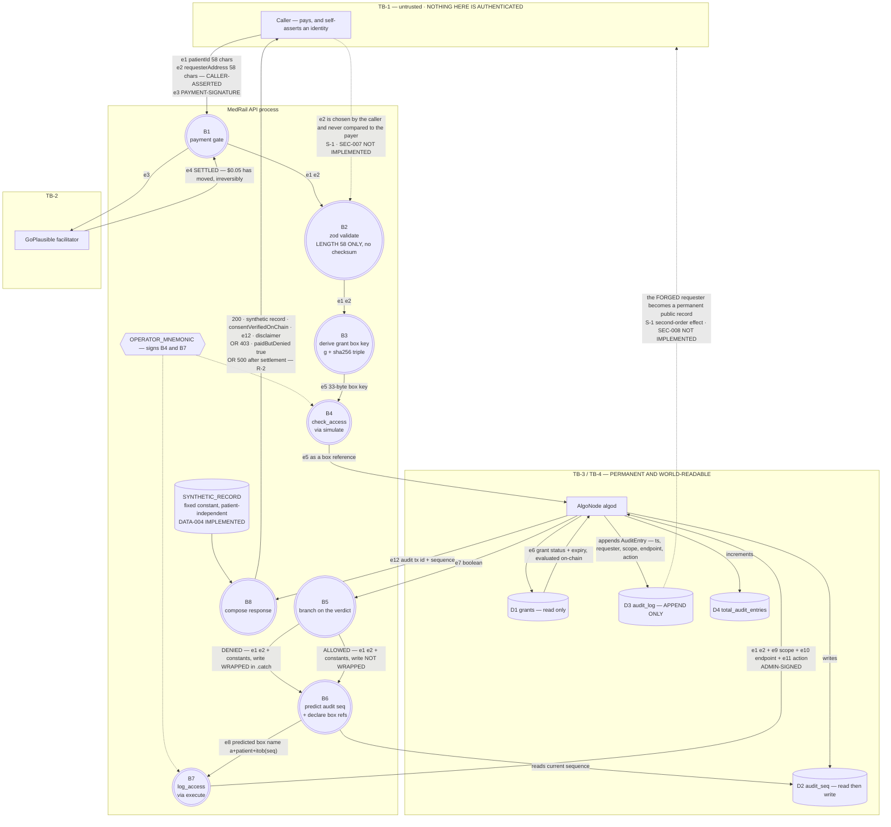

# MedRail — Data Flow Diagrams

> **⚠ Correction notice.** Parts of this document were written against a review finding that was
> later proven wrong. Settlement in x402 v2 happens **only** on a sub-400 response, so **no error
> path in MedRail can consume a settled payment** — and consent-denied calls (HTTP 403) are **not
> charged**, contrary to `API.md`, `SECURITY.md`, and the `paidButDenied` field. The audit-sequence
> race causes a **rejected transaction**, not a corrupted log. See
> [`CORRECTIONS.md`](../CORRECTIONS.md) — it supersedes any statement here that contradicts it.

**Purpose:** trace every data item through the system, name the trust boundary it crosses, and classify its sensitivity.

**Status of this document:** Descriptive of commit `32ffd73` on branch `master`. Classic DFD notation. **The data stores shown are the complete set**: three Algorand BoxMaps, Algorand global state, two static in-process reference tables, one static artefact file served from disk, and the browser's `sessionStorage`. There is no database, cache, queue, log store, session store or object store anywhere in this system. Status labels per the project fact ledger.

Related: [`./Component_Diagram.md`](./Component_Diagram.md) · [`./Sequence_Diagrams.md`](./Sequence_Diagrams.md) · [`./LLD.md`](./LLD.md) · [`../04_Data/`](../04_Data/) · [`../06_Security/Threat_Model.md`](../06_Security/Threat_Model.md) · [`../02_Requirements/SRS.md`](../02_Requirements/SRS.md)

**Notation**

| Symbol | Meaning |
|---|---|
| Rectangle | External entity — actor or external system, outside MedRail's control |
| Circle | Process — a transformation MedRail performs |
| Cylinder | Data store |
| Subgraph | Trust boundary; labels carry the boundary id from [`./System_Architecture.md`](./System_Architecture.md) §3 |

**Data-store inventory — this is the whole list**

| ID | Store | Location | Durability | Who can read it |
|---|---|---|---|---|
| **D1** | `grants` BoxMap, prefix `g` | Algorand app `768743428` | Permanent, replicated by the network | **Anyone on earth** |
| **D2** | `audit_seq` BoxMap, prefix `s` | Same | Permanent | Anyone — **currently zero boxes** |
| **D3** | `audit_log` BoxMap, prefix `a` | Same | Permanent, append-only | Anyone — **currently zero boxes** |
| **D4** | Global state: `admin` + 4 counters | Same | Permanent | Anyone |
| **D5** | `api/src/data/interactions.json` | API process memory, `readFileSync` at module load | Immutable for the process lifetime | Process only; content is published in every response's `source` field |
| **D6** | `RED_FLAGS` constant array | Compiled into the API bundle | Immutable | Process only; labels are published in `matchedFlags` |
| **D7** | `contracts/artifacts/MedRailConsent.arc56.json` | Container filesystem | Immutable | Anyone, via `GET /v1/consent/arc56` — deliberately public |
| **D8** | `sessionStorage["medrail-demo-wallet-v1"]` | The visitor's browser tab | Destroyed on tab close | The tab, and any script that achieves XSS on the page |

---

## 1. Level 0 — context diagram

**Reading the context.** Two data paths reach the ledger and they are deliberately separate. Consent *writes* originate in the patient's browser and never touch MedRail's process. Audit *writes* originate in MedRail's process under the operator key and never touch a patient key. The operator zone is drawn as its own boundary because `OPERATOR_MNEMONIC` is the single most valuable data item in the system — it is simultaneously the audit-writer, the admin-rotator and the fund-withdrawer (SEC-012 **NOT IMPLEMENTED**).

Note what does **not** flow into MedRail: no patient private key ever crosses any boundary into `api/src` — there is no ingress path for one (NFR-008 **IMPLEMENTED**, verified by reading every route).

---

## 2. Level 1 — major flows across all seven endpoints

**Five observations a reviewer should take from Level 1.**

1. **No flow reaches a database, because there is none.** Every persistent arrow terminates in D1–D4 on the public ledger. D5, D6 and D7 are read-only reference data loaded once and never written.
2. **`OPERATOR_MNEMONIC` fans out to three processes, including a free one.** P5 serves the free, unauthenticated `GET /v1/consent/status`, and it cannot run without the admin key, because `simulate` still requires a sender and signer (`api/src/services/algorand.ts:8-14`, `:84`).
3. **The dotted arrow from D1 back to the caller is the attack surface.** Grants are necessarily public, so the transparency that makes the consent layer auditable also publishes the `(patient, requester)` pairs an S-1 attacker needs. See [`./Sequence_Diagrams.md`](./Sequence_Diagrams.md) §7.
4. **P6 has never executed against the live chain.** D2 and D3 hold zero boxes on application `768743428` and `total_audit_entries = 0`. Evidence gap **E-1**.
5. **D8 holds a plaintext key in the browser.** Any XSS on the demo page exfiltrates it. Bounded to TestNet play money, disclosed in-code (`web/lib/demoWallet.ts:10-12`) and in the UI (`web/components/DemoWalletCard.tsx:74-77`).

---

## 3. Level 2 — workflow A: paid intelligence call

`POST /v1/triage` and `POST /v1/interaction-check`. **The point of this diagram is what does *not* flow.**

**AI-007, demonstrated structurally rather than asserted.** These two endpoints touch no data store other than D5 and D6, both read-only. `scoreTriage` and `checkInteractions` are pure functions: they take a string or an array, consult a constant table, and return an object (`api/src/services/triageScorer.ts:53-73`, `api/src/services/interactionChecker.ts:36-55`). Neither imports the chain gateway; neither has a code path to `logAccess`. The free-text clinical input has **nowhere to go** — it is garbage-collected with the request. This is a structural guarantee, not a policy.

**What is public about this flow.** Only the payment: an axfer of 20000 base units of ASA `10458941` to the configured `payTo`, permanently visible — for the one real call, transaction `OYRQRKYA7WUKBVLWTOFJSJMZFBW7VCNGP5VGH5EBUJGRCVFQFJRQ`. The payment reveals *that* someone paid MedRail $0.02 and *when*; it reveals nothing about the symptoms.

**Residual privacy exposure worth naming.** The symptoms are in the API process's memory and in TLS-terminated transit for the request's lifetime. There is no request logging that would capture them (`console.error(err)` in `app.onError` logs the error object, and no handler logs the body), and no structured logging exists at all — so the absence of an accidental PHI sink here is a consequence of OPS-002 being **NOT IMPLEMENTED**, not of a deliberate redaction control. If structured request logging is ever added, that is the moment this property could silently break.

---

## 4. Level 2 — workflow B: consent-gated record access

`POST /v1/records/summary`. Every data item annotated with the boundary it crosses.

**The one flow that is missing is the whole security finding.** There is no arrow from `e3` (the payment signature, which contains the payer's identity) to `B2` or `B5`. The payer is proven to the middleware and then discarded; the handler reads `e2` from the request body instead. Adding that arrow — `decodePaymentSignatureHeader` + `getSenderFromTransaction`, then reject unless `payer === requesterAddress` — is roughly 10–15 lines and closes S-1. FR-039, SEC-007 **NOT IMPLEMENTED**.

**What actually lands on the permanent public record.** Exactly five fields, from `AuditEntry` (`contracts/smart_contracts/consent/contract.py:66-73`): a timestamp, the requester address, and three strings that are **module constants**, not caller input — `scope = "records:summary"`, `endpoint = "/v1/records/summary"`, `action = "consent_checked" | "consent_denied"` (`api/src/routes/records.ts:10-11`, `:37`, `:49`). SEC-004 **IMPLEMENTED**.

**And the whole right-hand side is unproven.** D2, D3 and the `total_audit_entries` increment have never occurred on TestNet (E-1). `routes/records.ts` has no test. FR-010, FR-011, FR-012 all **UNVALIDATED**.

---

## 5. Data classification

Sensitivity scale: **Public** (on a public ledger or intended for publication) · **Pseudonymous** (an identifier, not directly identifying, but linkable and permanent) · **Caller-sensitive** (potentially health-related content supplied by the caller) · **Secret** (compromise causes direct loss).

| Item | Classification | Boundaries crossed | Persisted where | Retention | Controls present | Gaps |
|---|---|---|---|---|---|---|
| Free-text symptoms (`d1`) | **Caller-sensitive** | TB-1 inbound only | **Nowhere** | Request lifetime | Never logged, never persisted, never reaches the chain; 2000-char cap | Held in process memory and in TLS transit. AI-007 **IMPLEMENTED** structurally, not by an explicit redaction control |
| Medication list (`d2`) | **Caller-sensitive** | TB-1 inbound only | **Nowhere** | Request lifetime | Same | Same |
| Triage / interaction result (`d5`, `d6`) | Caller-sensitive, derived | TB-1 outbound only | Nowhere | Request lifetime | Always carries a non-diagnostic disclaimer, asserted by test (FR-009, AI-002 **VALIDATED**) | — |
| `patientId` (`e1`) | **Pseudonymous, permanent** | TB-1 → TB-3 → TB-4 | D2, D3 keys; D1 key input | **Forever** | Only the SHA-256 digest of the triple appears in D1's key; the raw address appears in D2/D3 keys | Length-58 validation only; no checksum (SEC-010 **NOT IMPLEMENTED**, R-3) |
| `requesterAddress` (`e2`) | **Pseudonymous, permanent** | TB-1 → TB-3 → TB-4 | D3 value, **in the clear** | **Forever** | Contract records exactly what it is given | **Caller-asserted. S-1. A forged value becomes a permanent false attribution** (SEC-008 **NOT IMPLEMENTED**) |
| `scope`, `endpoint`, `action` (`e9`–`e11`) | **Public** | TB-1 → TB-4 | D3 value | Forever | Module constants, never caller-derived | — |
| `PAYMENT-SIGNATURE` (`e3`) | **Secret in transit, bearer-equivalent** | TB-1 → TB-2 | Nowhere in MedRail | Request lifetime | HTTPS; forwarded verbatim; never logged | Never used to identify the payer to the handler — the S-1 root cause. No replay defence implemented by MedRail; the facilitator and the AVM handle that |
| Settled transaction id (`e12`, `d4`) | **Public** | TB-2 → TB-1, and TB-4 | Algorand ledger | Forever | Deliberately published — the proof artefact | Links payer to endpoint and timestamp forever. Inherent to x402 |
| Grant record — status, `granted_at`, `expires_at` | **Public** | TB-4 | D1 | Forever | 17 bytes; no PHI | The `(patient, requester)` relationship is inferable from the transaction that created it — the reconnaissance surface for S-1 |
| Global counters | **Public** | TB-4 | D4 | Forever | — | — |
| Synthetic record | **Not sensitive by construction** | TB-1 outbound | D-none, a code constant | — | Fixed, patient-independent; response carries an explicit disclaimer (DATA-004 **IMPLEMENTED**) | Would become the most sensitive item in the system the moment real data replaced it — at which point S-1 becomes a live PHI breach |
| `OPERATOR_MNEMONIC` | **Secret — highest value** | Never crosses a boundary | Env var + process memory, memoised for the process lifetime | Process lifetime | Gitignored and verified untracked (SEC-005 **VALIDATED**) | Single hot key, no multisig, no HSM, no rotation policy or runbook. Grants audit forgery + `set_admin` + `withdraw_excess`. SEC-012 **NOT IMPLEMENTED**. Also sits in the repo-root Docker build context (SEC-015 **NOT IMPLEMENTED**, D-3) |
| `DEPLOYER_MNEMONIC` | **Secret** | Never crosses a boundary | `contracts/.env` | — | Gitignored, untracked | Same build-context exposure (D-3) |
| Demo wallet mnemonic (D8) | **Secret, TestNet-only** | Never leaves the browser tab | `sessionStorage`, **plaintext** | Tab lifetime | `sessionStorage` rather than `localStorage`; TestNet only; disclosed in-code and in the UI | Any XSS on the page exfiltrates it. Impact bounded to play money |
| ARC-56 spec (D7) | **Public by intent** | TB-1 outbound | Container filesystem | Image lifetime | Served at `GET /v1/consent/arc56` so third parties can build their own calls (FR-015) | — |
| Interaction table (D5) | **Public by intent** | TB-1 outbound, as `source` | Process memory | Process lifetime | Provenance string in every response (DATA-005, AI-004 **VALIDATED**) | Cites a reference *class*, not a licensed dataset — stated as such |

### 5.1 The one-way property that matters most

Caller-sensitive content flows **inbound only** and terminates inside the process. Pseudonymous identifiers flow **inbound and onward to a permanent public record**. The system is designed so that the two never mix, and the design holds — the audit entry's only variable field is an address, and its three strings are compile-time constants.

Two conditions would break it, and neither is defended against:

1. **Adding structured request logging** without an explicit body-redaction rule would create the first durable sink for `d1`/`d2`. OPS-002 is **NOT IMPLEMENTED**, so today there is no sink — but there is also no policy that would stop one being added.
2. **Replacing `SYNTHETIC_RECORD` with real data** would turn S-1 from a latent flaw into a live PHI breach on day one, with the additional insult that the breach would be recorded on the immutable audit trail under the *attacker's chosen* name.

`docs/SECURITY.md` describes off-chain encrypted storage with on-chain content-address pointers as the eventual direction for real clinical payloads. **DATA-006 is PLANNED — no encryption pipeline exists in this repository.**
