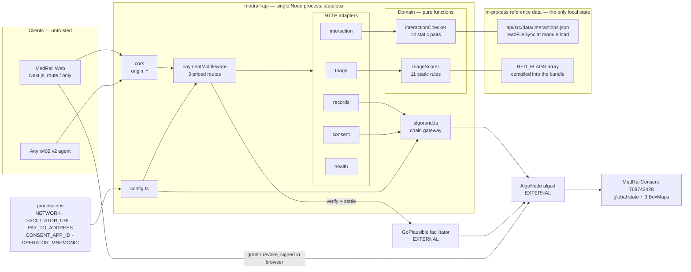
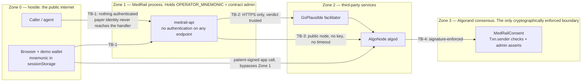
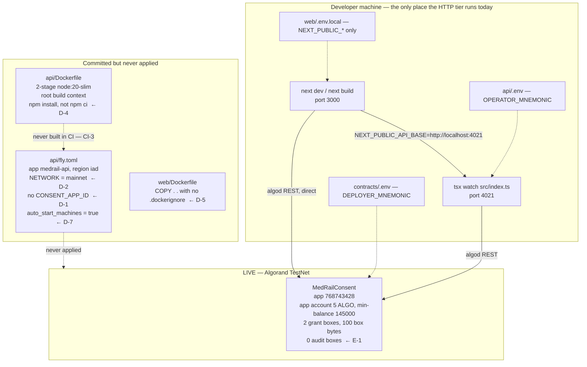

# MedRail — High-Level Design


> **⚠ Correction notice.** Parts of this document were written against a review finding that was
> later proven wrong. Settlement in x402 v2 happens **only** on a sub-400 response, so **no error
> path in MedRail can consume a settled payment** — and consent-denied calls (HTTP 403) are **not
> charged**, contrary to `API.md`, `SECURITY.md`, and the `paidButDenied` field. The audit-sequence
> race causes a **rejected transaction**, not a corrupted log. See
> [`CORRECTIONS.md`](../CORRECTIONS.md) — it supersedes any statement here that contradicts it.

**Purpose:** describe MedRail's components, their responsibilities and boundaries, the protocols between them, and the architectural properties that follow from those choices.

**Status of this document:** Descriptive of commit `32ffd73` on branch `master`. Every non-obvious claim carries a `path:line` or transaction-ID citation. Status labels per the project fact ledger. Nothing in this document is aspirational; where a capability is absent it is labelled **NOT IMPLEMENTED** rather than described in the future tense.

Related: [`./System_Architecture.md`](./System_Architecture.md) · [`./LLD.md`](./LLD.md) · [`./Component_Diagram.md`](./Component_Diagram.md) · [`../02_Requirements/SRS.md`](../02_Requirements/SRS.md) · [`./ADRs/`](./ADRs/) · [`../06_Security/Threat_Model.md`](../06_Security/Threat_Model.md)

---

## 1. Component inventory and responsibilities

Eleven components exist. Anything not on this list is not part of the system.

| Component | Type | Responsibility | Explicitly not responsible for | Source |
|---|---|---|---|---|
| `MedRail Web` | Next.js app, one route | Render the demo; generate a throwaway TestNet keypair; sign and submit x402 payments and consent transactions from the browser. | Holding any production key; talking to the facilitator directly; any server-side logic. | `web/app/page.tsx` |
| `app.ts` | Composition root | Wire CORS, the payment middleware and five route modules; serve the ARC-56 spec and the service index; own the global error handler. | Business logic of any kind. | `api/src/app.ts` |
| `x402.ts` | Payment adapter | Construct the facilitator client, register exactly one CAIP-2 network with `ExactAvmScheme`, and build per-route price descriptors. | Signature verification, settlement, asset resolution — all delegated. | `api/src/x402.ts` |
| `config.ts` | Configuration resolver | Map `NETWORK` to CAIP-2 id, USDC ASA, algod and indexer URLs; resolve `consentAppId` from env with a file fallback. | Validation of the resolved values. | `api/src/config.ts` |
| `routes/triage.ts` | HTTP adapter | Parse and validate `{symptoms}`; delegate; return. | Scoring. | `api/src/routes/triage.ts` |
| `routes/interaction.ts` | HTTP adapter | Parse and validate `{medications}`; delegate; return. | Matching. | `api/src/routes/interaction.ts` |
| `routes/records.ts` | HTTP adapter **and** authorisation decision point | Validate the body, call `checkAccess`, branch, call `logAccess`, return the synthetic record. | Authenticating the caller — **this is the S-1 gap**. | `api/src/routes/records.ts` |
| `routes/consent.ts` | HTTP adapter | Free read of live grant validity; free static app-info. | Any write. | `api/src/routes/consent.ts` |
| `routes/health.ts` | HTTP adapter | Liveness plus active network and configured App ID. | Dependency health — it never probes the facilitator or algod. | `api/src/routes/health.ts` |
| `services/triageScorer.ts`, `services/interactionChecker.ts` | Domain logic | Deterministic scoring and matching over static tables. | Any I/O, except one `readFileSync` at module load. | `api/src/services/` |
| `services/algorand.ts` | Chain gateway | Own every algod interaction: ABI method literals, box-name derivation, `simulate` reads, the `execute` write, and the per-patient serialisation queue. | HTTP concerns; authorisation policy. | `api/src/services/algorand.ts` |
| `MedRailConsent` | Smart contract | The consent state machine, the append-only per-patient audit log, and the authorisation rules that actually bind. | Anything the API asserts about the caller. | `contracts/smart_contracts/consent/contract.py` |

`api/src/middleware/` exists as an **empty directory** — there are no custom middlewares; the only two in the stack come from `hono/cors` and `@x402/hono`.

---

## 2. High-level architecture



Note the two arrows that do **not** exist: there is no arrow from the API to a database, and no arrow from the API back to the browser's key material. Both absences are architectural commitments.

---

## 3. Service boundaries

| Boundary | Kind | Contract | Versioning | Failure isolation |
|---|---|---|---|---|
| Client ↔ API | Network, public | HTTP/JSON with x402 v2 headers | Path-prefixed `/v1/`; no content negotiation | Total. A client failure is invisible to the API. |
| API ↔ facilitator | Network, external | x402 facilitator HTTP API — `/supported`, verify, settle | Pinned SDK `@x402/core@2.21.0` | **Poor.** Outage ⇒ 500 on all priced routes (**R-1**). Free routes unaffected — REL-005 **VALIDATED**. |
| API ↔ algod | Network, external | Algorand algod REST via `algosdk` | `algosdk ^3.6.0` | **Poor.** No timeout, no retry, no fallback endpoint (`api/src/services/algorand.ts:5`). REL-003 **NOT IMPLEMENTED**. |
| API ↔ contract | Logical, over algod | ARC-4 ABI, method signatures hand-declared in `api/src/services/algorand.ts:20-46` | ARC-56 spec committed at `contracts/artifacts/MedRailConsent.arc56.json`; **not** used at runtime by the API | Contract-side asserts fail the transaction atomically. |
| Route ↔ domain service | In-process function call | TypeScript types | Compile-time | Total — the scorers cannot fail on I/O after module load. |
| Browser ↔ algod | Network, external, **bypasses the API entirely** | ARC-4 ABI via `algosdk` ATC (`web/lib/consent.ts:44-89`) | `algosdk ^3.6.0` | Independent of API availability. This is what makes NFR-008 structurally true rather than a policy claim. |

---

## 4. Communication protocols

### 4.1 HTTP/JSON

All requests and responses are `application/json`. Request bodies are parsed with `await c.req.json().catch(() => ({}))` so a malformed body degrades to an empty object and is then rejected by zod as a 400 rather than throwing (`api/src/routes/triage.ts:12`, `interaction.ts:12`, `records.ts:26`).

CORS is `origin: "*"`, `allowMethods: ["GET","POST","OPTIONS"]`, and `exposeHeaders: ["PAYMENT-REQUIRED","PAYMENT-RESPONSE"]` (`api/src/app.ts:20-33`). `allowHeaders` is **deliberately left unset** so Hono reflects whatever the browser's own preflight requests. The rationale is recorded in-code at `api/src/app.ts:25-30`: a hand-maintained allowlist previously drifted out of sync with what `@x402/fetch`'s browser client actually sends, and broke every paid call from the frontend with a preflight failure. This is a regression comment attached to the fix — cite it as evidence of the failure mode having actually occurred, not as speculation. NFR-006 **IMPLEMENTED**.

### 4.2 x402 v2 headers

| Direction | Header | Content |
|---|---|---|
| Response, 402 | `PAYMENT-REQUIRED` | base64 JSON: `x402Version: 2`, `resource`, and `accepts[]` carrying `scheme: "exact"`, the CAIP-2 network, `amount` in base units, `asset`, `payTo`, `maxTimeoutSeconds: 300`, and `extra.feePayer`. |
| Request | `PAYMENT-SIGNATURE` | The client's signed AVM payment, constructed by `ExactAvmScheme`. |
| Response, 200 | `PAYMENT-RESPONSE` | Settlement result, including the settled transaction id. |

The 402 body is `{}` — the payload is header-only. `cache-control: no-store` is set. `access-control-expose-headers` lists both payment headers so a browser client can read them.

Two fields in `accepts[0]` are **not** MedRail configuration: `asset` and `extra.feePayer` are resolved from the facilitator's `/supported` response at initialise. `api/src/x402.ts:16-19` sets no `asset` field at all, and records why in-comment: GoPlausible's own TypeScript and Python reference examples omit it and let the scheme's default money parser resolve the network's canonical stablecoin from the `"$x.xx"` string. This keeps route config readable and impossible to desync from the facilitator — and it is the direct cause of **R-1**, because it means a 402 cannot be constructed while the facilitator is unreachable.

### 4.3 Algorand ABI over algod REST — `simulate` vs `execute`

Two distinct call modes, chosen per method by whether the contract declares `readonly=True`.

| | `simulate` | `execute` |
|---|---|---|
| Used for | `check_access`, `get_audit_count` | `log_access` |
| Call site | `api/src/services/algorand.ts:98`, `:119` | `api/src/services/algorand.ts:175` |
| Submitted to the network? | **No.** Nothing is broadcast. | Yes — a real, signed, fee-paying transaction. |
| Fee | Zero | Standard; paid by the operator account |
| Latency | One `getTransactionParams` round-trip plus one `simulate` round-trip. Reviewer's single cold observation of `GET /v1/consent/status`: **505 ms**. | Consensus-bound. `atc.execute(algod, 4)` waits up to four rounds and then throws. |
| Requires a signer? | **Yes, still.** `simulate` needs a sender and signer, so `getOperator()` is called and throws without `OPERATOR_MNEMONIC` (`api/src/services/algorand.ts:8-14`). | Yes — must be the admin. |
| Box references | Passed explicitly; the read path passes the exact box it will touch. | Passes both the sequence box and the *predicted* log box. |

The `simulate` choice is what makes SEC-009 true and what makes `GET /v1/consent/status` genuinely free to the caller. The hidden cost is that a free, unauthenticated endpoint transitively depends on the admin private key being present in the process.

---

## 5. Synchronous flows, and the deliberate absence of asynchronous ones

**Every flow in MedRail is synchronous.** There is no job queue, no outbox, no retry scheduler, no worker process, no event bus, no webhook receiver, no cron. The word "async" in the codebase refers only to JavaScript promises within a single request.

For the two open intelligence endpoints this is unambiguously correct: `scoreTriage` and `checkInteractions` are pure functions over in-memory tables, and there is nothing to defer.

For `/v1/records/summary` it is a real cost, and the repository does not record a rationale for it. The audit write sits **inline on the paid response path**:

```
records.ts:49   const logResult = await logAccess(patientId, requesterAddress, SCOPE, ENDPOINT, "consent_checked");
```

Three consequences follow:

1. **PERF-004 is NOT IMPLEMENTED.** The response cannot be returned until an Algorand transaction confirms. `logAccess` performs a `getTransactionParams`, then a full `getAuditCount` (itself another `getTransactionParams` plus a `simulate`), then `atc.execute(algod, 4)` (`api/src/services/algorand.ts:153-177`). That is four sequential network round-trips plus consensus, after the caller has already paid. No measurement of this path exists — it has never run against the live contract (**E-1**).
2. **REL-002 is NOT IMPLEMENTED — finding R-2.** The denied branch wraps the write defensively (`records.ts:37`, `.catch(() => undefined)`); the success branch does not (`records.ts:49`). If the write throws — operator out of ALGO, app account out of box MBR, algod 5xx, validity-window expiry — the request falls through to `app.onError` and returns **500 after settlement**. The caller has paid $0.05 and receives nothing. There is no refund path, no retry token, no idempotency key, and no record that the payment occurred. The asymmetry is the tell: the rejection path was hardened and the success path was not.
3. **A queue would fix both, and there is no queue.** The standard remedy — write the audit entry through a durable outbox and return immediately — requires exactly the durable local state this architecture deliberately does not have. That is a genuine tension between "no database" and "never lose a settled payment", and it is unresolved in this build. **RECOMMENDED**, not present: return 200 with `auditStatus: "pending"` and a deferred write, or at minimum mirror the denied path's `.catch()` so the resource is still delivered when the audit write fails.

---

## 6. Security and trust boundaries

The four trust boundaries are enumerated in [`./System_Architecture.md`](./System_Architecture.md) §3. Drawn explicitly:



| Boundary | Control present | Control absent |
|---|---|---|
| TB-1 client → API | TLS if terminated upstream (`api/fly.toml:16` sets `force_https = true`); zod shape validation; x402 payment gate | No authentication, no API keys, no rate limiting (SEC-013 **NOT IMPLEMENTED**), no address checksum validation (SEC-010), no security headers, no binding of payer to asserted requester (SEC-007), internal error messages echoed to callers (SEC-011) |
| TB-2 API → facilitator | HTTPS; single configured URL | No mTLS, no independent confirmation of the settlement against algod, no timeout, no circuit breaker, no cached `/supported` fallback |
| TB-3 API → algod | HTTPS; transaction signatures | No API key, no timeout, no retry, no secondary endpoint |
| TB-4 → contract | `assert Txn.sender == self.admin.value` on `log_access` (`contract.py:222`) and `withdraw_excess` (`contract.py:258`); patient identity taken from `Txn.sender`, never from an argument, in `grant_access` (`contract.py:151`) and `revoke_access` (`contract.py:181`); both admin rejections unit-tested | Nothing missing at this layer. The weakness is that everything above it feeds it unauthenticated inputs. |

**The single most important security statement in this design:** the on-chain authorisation is sound and the HTTP authorisation is absent. `check_access` faithfully answers "did patient P grant requester R scope S?" — but `records.ts` lets the caller choose R (`api/src/routes/records.ts:7`, `:32`). Because grants are public, an attacker can read a real `(patient, requester)` pair off the indexer, pay the ordinary $0.05, and be authorised as someone else — and the audit entry then records the *forged* requester on the immutable trail. Full exploit in [`../06_Security/Threat_Model.md`](../06_Security/Threat_Model.md); sequence in [`./Sequence_Diagrams.md`](./Sequence_Diagrams.md) §7.

Two defensive facts worth crediting, both verified: no patient private key ever reaches the backend, and no PHI is ever written on-chain — the audit entry carries only an address, two constant strings and a timestamp (`api/src/routes/records.ts:10-11`), so free-text symptoms and medication lists cannot reach the ledger (AI-007 **IMPLEMENTED**).

---

## 7. Deployment boundaries

**Deployment status, stated plainly: nothing in MedRail is publicly hosted.** The only component running anywhere outside a developer laptop is the smart contract, on Algorand TestNet. There is no public HTTPS endpoint, no MainNet deployment, no Bazaar listing and no leaderboard presence. All are pending user action.



| Unit | Status | Blocking defects |
|---|---|---|
| `MedRailConsent` | **Live on TestNet**, app `768743428`, `deleted: false` | — |
| `medrail-api` | **NOT DEPLOYED**. Image never built in CI. NFR-007 **UNVALIDATED**. | **D-1**: `deploy_testnet.json` is not copied into the image (`api/Dockerfile:18-20`), so `readDeployedAppId()` (`api/src/config.ts:31-40`) cannot fall back and `CONSENT_APP_ID` must be set explicitly; `api/fly.toml` does not set it, so `requireConsentAppId()` throws and both consent endpoints 500. **D-2**: `api/fly.toml:10` hard-codes `NETWORK = "mainnet"`, where no `MedRailConsent` exists. **D-3**: no `.dockerignore` anywhere, and the API build context is the repo root, so `api/.env` and `contracts/.env` enter the build context (SEC-015 **NOT IMPLEMENTED**) — nothing is `COPY`'d from them today, but the margin is one careless line. **D-4**: `npm install`, not `npm ci`, despite committed lockfiles. **D-6**: no healthcheck, despite `/v1/health` being purpose-built for one (OPS-001). |
| `MedRail Web` | **NOT DEPLOYED**. No `vercel.json`. | **D-5**: `COPY . .` with no `.dockerignore`; `web/next.config.ts` is empty so there is no `output: "standalone"` and the runtime image carries full `node_modules`. |

`scripts/` at the repository root is **empty**, although `docs/IMPLEMENTATION_PLAN.md` §7 lists it as repo-level orchestration (DOC-6).

---

## 8. Key architectural properties

### 8.1 Statelessness

The API process holds three things across requests, and only three: the `config` object frozen at import (`api/src/config.ts:44-59`), the two static reference tables, and two lazily-populated caches — `operatorAccount` (`api/src/services/algorand.ts:7`) and `patientQueues` (`:129`). None is request-derived state that a second process would need. There is no session, no auth token store, no idempotency ledger, no rate-limit counter and no result cache. NFR-001 **IMPLEMENTED**.

The single exception that breaks the property is `patientQueues`. It is *correctness-bearing* in-process state that is silently wrong under horizontal scaling. See §8.4.

### 8.2 Network isolation

`api/src/x402.ts:11-14` registers exactly one CAIP-2 network with the resource server:

```ts
export const resourceServer = new x402ResourceServer(facilitatorClient).register(
  config.networkCaip2,
  new ExactAvmScheme(),
);
```

The comment above it records the intent: a process configured for TestNet does not accidentally accept a MainNet-signed payment, or the reverse. Contrast the browser client, which registers the wildcard `"algorand:*"` (`web/lib/x402Client.ts:8`) — correct on that side, because the client must accept whichever network the server advertises in its 402. NFR-002 **IMPLEMENTED**. NFR-012 **IMPLEMENTED**: switching network is a `NETWORK` environment change with no code edit, because every network-specific value is a lookup in `api/src/config.ts:8-29`.

### 8.3 Off-the-shelf x402 client compatibility

MedRail's priced endpoints are callable by any conformant x402 v2 client with no MedRail-specific knowledge. Three design choices produce that:

1. **Payment is a plain `exact`-scheme transfer.** No app call is bundled into the client's payment group. `docs/ARCHITECTURE.md:95-108` records the rationale explicitly: the AVM `exact` scheme permits up to 16 transactions in a signed group, so bundling *is* possible — but a generic client only knows how to build the transaction described in `paymentRequirements`, and requiring it to also know MedRail's App ID and method signature would make the endpoint incompatible with off-the-shelf callers. The audit write is therefore a follow-up transaction under the operator key, which is precisely why R-2 exists. The trade-off is stated in the source; the cost is not mitigated.
2. **No asset id is pinned in route config.** `priced()` emits `{scheme, price, network, payTo}` only (`api/src/x402.ts:20-28`), letting the facilitator-supplied asset flow through unmodified.
3. **Fees are sponsored by the facilitator.** `extra.feePayer` arrives in the 402, so a caller needs USDC but not ALGO.

Evidence that this works against a real client: `api/scripts/e2e-proof.ts` uses stock `@x402/fetch` with `ExactAvmScheme`, and produced settled transaction `OYRQRKYA7WUKBVLWTOFJSJMZFBW7VCNGP5VGH5EBUJGRCVFQFJRQ` — `axfer`, asset `10458941`, amount `20000`, round 66091768, `fee: 0`. Recorded at `contracts/artifacts/e2e-proof.json`. FR-003 **VALIDATED**. It is one payment, and it is a self-payment (sender = receiver = the deployer address); it proves the protocol path, not demand.

### 8.4 In-process serialisation, and where it stops

`logAccess` predicts the box key it is about to write by reading the current sequence and adding one (`api/src/services/algorand.ts:158-159`), then passes that predicted key as a box reference. Two concurrent calls for the same patient would predict the same key and race. `withPatientLock` (`api/src/services/algorand.ts:123-138`) chains calls per patient so this process's own writes are strictly ordered.

The prediction is **not** a sequencing scheme. `log_access` self-assigns the sequence on-chain from its own `audit_seq` box (`contracts/smart_contracts/consent/contract.py:224-226`) and never trusts a caller-supplied value; the client-side `predictedSeq` exists solely because the AVM requires every box a transaction touches to be declared in its box-reference array up front. A lost race therefore produces a **rejected transaction** — the loser declares a box name that does not match the box the contract writes — not a corrupted or misordered log. On the success path of `records.ts` that rejection is unguarded, which makes it the most likely real trigger of R-2.

It guarantees ordering **within one Node process**. It guarantees nothing across processes. `api/fly.toml:17-19` sets `auto_stop_machines = false`, `auto_start_machines = true`, `min_machines_running = 1` — a floor, not a ceiling. Two machines sharing the one `OPERATOR_MNEMONIC` reintroduce exactly the race the lock was written to prevent, and `docs/SECURITY.md` describes the race as mitigated. REL-004 **PARTIALLY IMPLEMENTED**; defect **D-7**. Mechanism analysed line-by-line in [`./LLD.md`](./LLD.md) §3.6.

### 8.5 Determinism and inspectability of the intelligence layer

Both priced compute endpoints are pure functions over tables that are readable in full in under a minute: eleven weighted keyword groups (`api/src/services/triageScorer.ts:32-44`) and fourteen interaction pairs (`api/src/data/interactions.json`). Same input, same output, no model, no training data, no inference dependency, no vendor. NFR-009 and AI-001 **VALIDATED**. Because both sit behind a route boundary and take only their request payload, swapping in a model-backed implementation would not touch the payment or consent layers — AI-008 **IMPLEMENTED by construction**.

The corresponding honest statement: no clinical evaluation exists. There is no labelled dataset, no sensitivity or specificity measurement, and no evaluation harness. AI-005 **NOT IMPLEMENTED**, and no accuracy claim is made anywhere in the codebase. Every response carries a non-diagnostic disclaimer that is asserted by tests, i.e. treated as a correctness property rather than copy (FR-009, AI-002 **VALIDATED**).

### 8.6 Observability

There is none. The only logging is one `console.log` at startup (`api/src/index.ts:6`) and one `console.error(err)` in the error handler (`api/src/app.ts:59`). No request ids, no correlation ids, no log levels, no structured output, no metrics, no tracing, no alerting. OPS-002, OPS-003, OPS-004, OPS-005 all **NOT IMPLEMENTED**. `/v1/health` exists and is well-shaped for a probe but is wired to no probe anywhere (OPS-001, defect D-6), and it reports only its own liveness — it never checks the facilitator or algod, so a green health check is compatible with every priced endpoint returning 500 under R-1.

RPO and RTO have never been established. OPS-008 **NOT IMPLEMENTED**; no targets are invented here.

---

## 9. Design decisions worth recording as ADRs

The following decisions are load-bearing and have rationales recorded in source comments rather than in [`./ADRs/`](./ADRs/), which is currently empty. Each is a candidate ADR.

| Decision | Rationale recorded at | Consequence |
|---|---|---|
| Box storage rather than local state | `contract.py:11-18` | No opt-in required from either party; app pays MBR |
| `log_access` as a follow-up transaction, not in the payment group | `docs/ARCHITECTURE.md:95-108`, `contract.py:18-23` | Off-the-shelf client compatibility (§8.3), at the cost of R-2 |
| Hand-constructed `ABIMethod` literals rather than ARC-56 parsing | `api/src/services/algorand.ts:16-19` | No dependency on algosdk's ARC-56 handling; a fourth copy of the interface to keep in sync |
| No `asset` in route price config | `api/src/x402.ts:17-19` | Facilitator-resolved USDC; direct cause of R-1 |
| `allowHeaders` deliberately unset in CORS | `api/src/app.ts:25-30` | Preflight matches whatever the payment client sends; fixed a real prior regression |
| One network registered on the resource server | `api/src/x402.ts:8-10` | Cross-network payments rejected structurally |
| Fixed synthetic record regardless of `patientId` | `api/src/routes/records.ts:14`, `docs/SECURITY.md` | No PHI exists, so S-1 leaks nothing *today*; DATA-004 **IMPLEMENTED** |
| Read-only ABI methods executed via `simulate` | `api/src/services/algorand.ts:81`, `:102` | Free reads; hidden operator-key dependency |
