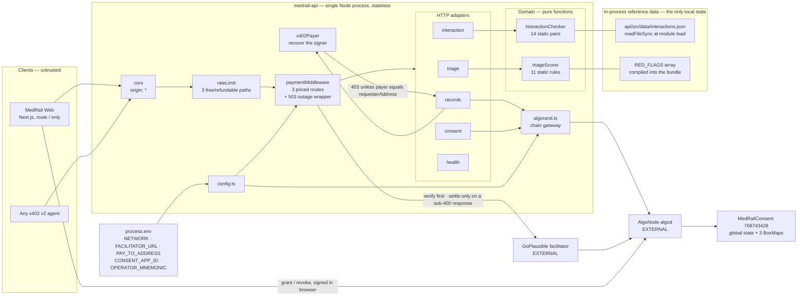
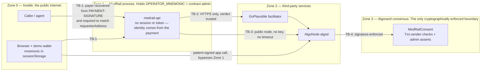
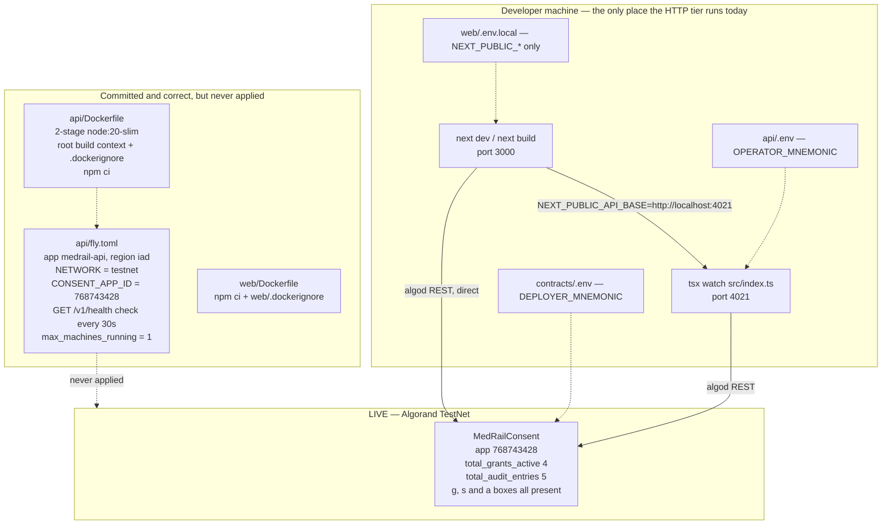

# MedRail — High-Level Design

**Purpose:** describe MedRail's components, their responsibilities and boundaries, the protocols between them, and the architectural properties that follow from those choices.

**Status of this document:** Descriptive of the working tree on branch `main`. Every non-obvious claim carries a `path:line` or transaction-ID citation. Status labels per the project fact ledger. Nothing in this document is aspirational; where a capability is absent it is labelled **NOT IMPLEMENTED** rather than described in the future tense.

Related: [`./System_Architecture.md`](./System_Architecture.md) · [`./LLD.md`](./LLD.md) · [`./Component_Diagram.md`](./Component_Diagram.md) · [`../02_Requirements/SRS.md`](../02_Requirements/SRS.md) · [`./ADRs/`](./ADRs/) · [`../06_Security/Threat_Model.md`](../06_Security/Threat_Model.md)

---

## 1. Component inventory and responsibilities

Fourteen components exist. Anything not on this list is not part of the system.

| Component | Type | Responsibility | Explicitly not responsible for | Source |
|---|---|---|---|---|
| `MedRail Web` | Next.js app, one route | Render the demo; generate a throwaway TestNet keypair; sign and submit x402 payments and consent transactions from the browser. | Holding any production key; talking to the facilitator directly; any server-side logic. | `web/app/page.tsx` |
| `app.ts` | Composition root | Wire CORS, three path-scoped rate limiters, the payment middleware and its facilitator-outage wrapper, and five route modules; serve the ARC-56 spec and the service index; own the global error handler. | Business logic of any kind. | `api/src/app.ts` |
| `x402.ts` | Payment adapter | Construct the facilitator client, register exactly one CAIP-2 network with `ExactAvmScheme`, and build per-route price descriptors. | Signature verification, settlement, asset resolution — all delegated. | `api/src/x402.ts` |
| `x402Payer.ts` | Identity adapter | Decode the verified `PAYMENT-SIGNATURE` header and recover the address that signed `paymentGroup[paymentIndex]`. Return `null` on anything unparseable. | Deciding what to do with the answer — that is the route's job. | `api/src/x402Payer.ts` |
| `rateLimit.ts` | Middleware factory | Fixed-window, in-memory request counting per client key and scope; 429 with `Retry-After` past the limit. | Being a security boundary — the client key is a spoofable forwarded IP. | `api/src/rateLimit.ts` |
| `validation.ts` | Shared schema | One export, `algorandAddress`: 58 characters **and** a valid checksum. | Anything route-specific. | `api/src/validation.ts` |
| `config.ts` | Configuration resolver | Map `NETWORK` to CAIP-2 id, USDC ASA, algod and indexer URLs; resolve `consentAppId` from env with a file fallback; refuse to boot without a usable `payTo`. | Validating anything beyond `payTo`. | `api/src/config.ts` |
| `routes/triage.ts` | HTTP adapter | Parse and validate `{symptoms}`; delegate; return. | Scoring. | `api/src/routes/triage.ts` |
| `routes/interaction.ts` | HTTP adapter | Parse and validate `{medications}`; delegate; return. | Matching. | `api/src/routes/interaction.ts` |
| `routes/records.ts` | HTTP adapter **and** authorisation decision point | Validate the body, **bind the asserted requester to the payer**, call `checkAccess`, branch, guard `logAccess`, return the synthetic record. | Verifying that the payment is valid — the middleware has already done that. | `api/src/routes/records.ts` |
| `routes/consent.ts` | HTTP adapter | Free read of live grant validity; free static app-info. | Any write. | `api/src/routes/consent.ts` |
| `routes/health.ts` | HTTP adapter | Liveness plus active network and configured App ID. | Dependency health — it never probes the facilitator or algod. | `api/src/routes/health.ts` |
| `services/triageScorer.ts`, `services/interactionChecker.ts` | Domain logic | Deterministic scoring and matching over static tables. | Any I/O, except one `readFileSync` at module load. | `api/src/services/` |
| `services/algorand.ts` | Chain gateway | Own every algod interaction: ABI method literals, box-name derivation, `simulate` reads, the `execute` write, and the per-patient serialisation queue. | HTTP concerns; authorisation policy. | `api/src/services/algorand.ts` |
| `MedRailConsent` | Smart contract | The consent state machine, the append-only per-patient audit log, and the authorisation rules that actually bind. | Anything the API asserts about the caller. | `contracts/smart_contracts/consent/contract.py` |

`api/src/middleware/` exists as an **empty directory** — there are no custom middlewares; the only two in the stack come from `hono/cors` and `@x402/hono`.

---

## 2. High-level architecture



Note the two arrows that do **not** exist: there is no arrow from the API to a database, and no arrow from the API back to the browser's key material. Both absences are architectural commitments.

---

## 3. Service boundaries

| Boundary | Kind | Contract | Versioning | Failure isolation |
|---|---|---|---|---|
| Client ↔ API | Network, public | HTTP/JSON with x402 v2 headers | Path-prefixed `/v1/`; no content negotiation | Total. A client failure is invisible to the API. |
| API ↔ facilitator | Network, external | x402 facilitator HTTP API — `/supported`, verify, settle | Pinned SDK `@x402/core@2.21.0` | **Total dependency, honestly reported.** Outage ⇒ all three priced routes return **503 + `Retry-After: 30`** with a stable `PAYMENT_FACILITATOR_UNAVAILABLE` code rather than an opaque 500. No cached fallback and no second facilitator, so REL-001 is **PARTIALLY IMPLEMENTED**. Free routes unaffected — REL-005 **VALIDATED**. |
| API ↔ algod | Network, external | Algorand algod REST via `algosdk` | `algosdk ^3.6.0` | **Poor.** No timeout, no retry, no fallback endpoint (`api/src/services/algorand.ts:5`). REL-003 **NOT IMPLEMENTED**. |
| API ↔ contract | Logical, over algod | ARC-4 ABI, method signatures hand-declared in `api/src/services/algorand.ts:20-46` | ARC-56 spec committed at `contracts/artifacts/MedRailConsent.arc56.json`; **not** used at runtime by the API | Contract-side asserts fail the transaction atomically. |
| Route ↔ domain service | In-process function call | TypeScript types | Compile-time | Total — the scorers cannot fail on I/O after module load. |
| Browser ↔ algod | Network, external, **bypasses the API entirely** | ARC-4 ABI via `algosdk` ATC (`web/lib/consent.ts:44-89`) | `algosdk ^3.6.0` | Independent of API availability. This is what makes NFR-008 structurally true rather than a policy claim. |

---

## 4. Communication protocols

### 4.1 HTTP/JSON

All requests and responses are `application/json`. Request bodies are parsed with `await c.req.json().catch(() => ({}))` so a malformed body degrades to an empty object and is then rejected by zod as a 400 rather than throwing (`api/src/routes/triage.ts:12`, `interaction.ts:12`, `records.ts:28`). Address fields go through the shared `algorandAddress` schema (`api/src/validation.ts`), which validates the base32 checksum as well as the length, so malformed input is a 400 at the boundary instead of an exception inside the chain gateway.

CORS is `origin: "*"`, `allowMethods: ["GET","POST","OPTIONS"]`, and `exposeHeaders: ["PAYMENT-REQUIRED","PAYMENT-RESPONSE"]` (`api/src/app.ts:22-35`). `allowHeaders` is **deliberately left unset** so Hono reflects whatever the browser's own preflight requests. The rationale is recorded in-code at `api/src/app.ts:25-30`: a hand-maintained allowlist previously drifted out of sync with what `@x402/fetch`'s browser client actually sends, and broke every paid call from the frontend with a preflight failure. This is a regression comment attached to the fix — cite it as evidence of the failure mode having actually occurred, not as speculation. NFR-006 **IMPLEMENTED**.

### 4.2 x402 v2 headers

| Direction | Header | Content |
|---|---|---|
| Response, 402 | `PAYMENT-REQUIRED` | base64 JSON: `x402Version: 2`, `resource`, and `accepts[]` carrying `scheme: "exact"`, the CAIP-2 network, `amount` in base units, `asset`, `payTo`, `maxTimeoutSeconds: 300`, and `extra.feePayer`. |
| Request | `PAYMENT-SIGNATURE` | The client's signed AVM payment, constructed by `ExactAvmScheme`. |
| Response, 200 | `PAYMENT-RESPONSE` | Settlement result, including the settled transaction id. |

The 402 body is `{}` — the payload is header-only. `cache-control: no-store` is set. `access-control-expose-headers` lists both payment headers so a browser client can read them.

Two fields in `accepts[0]` are **not** MedRail configuration: `asset` and `extra.feePayer` are resolved from the facilitator's `/supported` response at initialise. `api/src/x402.ts:16-19` sets no `asset` field at all, and records why in-comment: GoPlausible's own TypeScript and Python reference examples omit it and let the scheme's default money parser resolve the network's canonical stablecoin from the `"$x.xx"` string. This keeps route config readable and impossible to desync from the facilitator — at the cost of making the priced surface unavailable whenever the facilitator is, which is why `api/src/app.ts:73-105` converts that specific failure into a 503 with `Retry-After` rather than letting it surface as a server error.

**`PAYMENT-SIGNATURE` is read twice, for two different purposes.** The middleware forwards it to the facilitator to answer "is this payment valid?"; `payerFromRequest` decodes it locally, read-only, to answer "who signed it?". The second question is the one that turns the consent gate into an authorisation check, and it is answerable at all only because an x402 v2 AVM payment *is* a signed Algorand transaction. The payload is `{paymentGroup: string[], paymentIndex: number}`, and only `paymentGroup[paymentIndex]` is the caller's own transfer — the other legs are the facilitator's fee-payer transactions, signed by the facilitator. Reading index 0 instead of `paymentIndex` would recover the wrong address, which is exactly what `api/test/x402Payer.spec.ts` pins.

**Settlement is committed after the handler, not before it.** `@x402/hono` verifies the payment, runs the handler, and calls `processSettlement` only if the response status is below 400; a throw or any 4xx/5xx triggers `cancellationDispatcher.cancel(...)` and returns first. Every error MedRail can emit — 400, 403, 429, 500 — therefore costs the caller nothing. REL-002 **VALIDATED — satisfied by the SDK**, and credited as an inherited property of x402 v2 rather than as MedRail's own work.

### 4.3 Algorand ABI over algod REST — `simulate` vs `execute`

Two distinct call modes, chosen per method by whether the contract declares `readonly=True`.

| | `simulate` | `execute` |
|---|---|---|
| Used for | `check_access`, `get_audit_count` | `log_access` |
| Call site | `api/src/services/algorand.ts:98`, `:119` | `api/src/services/algorand.ts:175` |
| Submitted to the network? | **No.** Nothing is broadcast. | Yes — a real, signed, fee-paying transaction. |
| Fee | Zero | Standard; paid by the operator account |
| Latency | One `getTransactionParams` round-trip plus one `simulate` round-trip. Reviewer's single cold observation of `GET /v1/consent/status`: **505 ms**. | Consensus-bound. `atc.execute(algod, 4)` waits up to four rounds and then throws. |
| Requires a signer? | **Yes, still.** `simulate` needs a sender and signer, so `getOperator()` is called and throws without `OPERATOR_MNEMONIC` (`api/src/services/algorand.ts:8-14`). | Yes — must be the admin. |
| Box references | Passed explicitly; the read path passes the exact box it will touch. | Passes both the sequence box and the *predicted* log box. |

The `simulate` choice is what makes SEC-009 true and what makes `GET /v1/consent/status` genuinely free to the caller. The hidden cost is that a free, unauthenticated endpoint transitively depends on the admin private key being present in the process.

---

## 5. Synchronous flows, and the deliberate absence of asynchronous ones

**Every flow in MedRail is synchronous.** There is no job queue, no outbox, no retry scheduler, no worker process, no event bus, no webhook receiver, no cron. The word "async" in the codebase refers only to JavaScript promises within a single request.

For the two open intelligence endpoints this is unambiguously correct: `scoreTriage` and `checkInteractions` are pure functions over in-memory tables, and there is nothing to defer.

For `/v1/records/summary` it is a real cost, and the repository does not record a rationale for it. The audit write sits **inline on the response path**:

```
records.ts:83-99   try { const logResult = await logAccess(...); } catch { auditStatus = "pending"; }
```

Three consequences follow:

1. **PERF-004 is NOT IMPLEMENTED.** The response cannot be returned until an Algorand transaction confirms. `logAccess` performs a `getTransactionParams`, then a full `getAuditCount` (itself another `getTransactionParams` plus a `simulate`), then `atc.execute(algod, 4)` (`api/src/services/algorand.ts:153-177`). That is four sequential network round-trips plus consensus, all inside the caller's request. The second `getTransactionParams` is redundant — finding **G-33**, open. No latency measurement of this path exists at all: finding **G-24**, also open, and no figure is invented here.
2. **A chain failure costs the sale, not the caller's money — and the sale is now protected too.** Both branches guard the write. The denied branch swallows it (`records.ts:58`, `.catch(() => undefined)`) because it has nothing to report; the success branch catches it and reports it, returning **200** with the record plus `auditStatus: "pending"`, null `auditTxId`/`auditSequence`, and a structured `audit_write_failed` log line. Before that guard existed the throw reached `app.onError` and became a 500 — which, because settlement is cancelled on a 5xx, threw away the *sale* rather than the caller's payment. Trading an unrecoverable 500 for a delivered resource with a flagged audit entry is the better bargain on both sides. REL-002 **VALIDATED — satisfied by the SDK**.
3. **A queue would make `"pending"` temporary, and there is no queue.** `auditStatus: "pending"` is an accurate label on a degraded response, not eventual consistency: there is no outbox, no retry scheduler and no replay, so a pending entry stays pending and the only trace is the log line. The standard remedy — write through a durable outbox and reconcile — requires exactly the durable local state this architecture deliberately does not have. That tension between "no database" and "never lose an audit entry" is genuine and consciously unresolved. See [`./ADRs/ADR-005-audit-write-as-follow-up-transaction.md`](./ADRs/ADR-005-audit-write-as-follow-up-transaction.md) and [`./ADRs/ADR-002-no-database-ledger-as-system-of-record.md`](./ADRs/ADR-002-no-database-ledger-as-system-of-record.md).

---

## 6. Security and trust boundaries

The four trust boundaries are enumerated in [`./System_Architecture.md`](./System_Architecture.md) §3. Drawn explicitly:



| Boundary | Control present | Control absent |
|---|---|---|
| TB-1 client → API | TLS if terminated upstream (`api/fly.toml` sets `force_https = true`); zod shape **and checksum** validation (SEC-010, SEC-011 **IMPLEMENTED**); x402 payment gate; **payer binding on the consent-gated route** (SEC-006, SEC-007, SEC-008 **IMPLEMENTED**); fixed-window rate limiting on the free and refundable surface (SEC-013 **IMPLEMENTED**) | No API keys and no session — deliberate, since the payment carries the identity. No security headers (HSTS, CSP, `X-Content-Type-Options`). The rate-limit client key is a spoofable forwarded IP and the counters are per-process, so it bounds accidents and casual abuse, not a determined attacker |
| TB-2 API → facilitator | HTTPS; single configured URL; a narrow wrapper that converts initialisation failure into 503 + `Retry-After` | No mTLS, no independent confirmation of the settlement against algod, no timeout, no circuit breaker, no cached `/supported` fallback |
| TB-3 API → algod | HTTPS; transaction signatures | No API key, no timeout, no retry, no secondary endpoint |
| TB-4 → contract | `assert Txn.sender == self.admin.value` on `log_access` (`contract.py:229`) and `withdraw_excess` (`contract.py:265`); patient identity taken from `Txn.sender`, never from an argument, in `grant_access` (`contract.py:158`) and `revoke_access` (`contract.py:188`); both admin rejections unit-tested | Nothing missing at this layer. |

**The single most important security statement in this design:** the on-chain authorisation is sound, and the HTTP layer now inherits the same cryptography instead of discarding it. `check_access` faithfully answers "did patient P grant requester R scope S?", and `records.ts` no longer lets the caller choose R — `payerFromRequest` recovers the account that signed the payment and the handler returns 403 unless it equals `requesterAddress` (`api/src/routes/records.ts:41-52`). Grants remain public, so an attacker can still read a real `(patient, requester)` pair off the indexer; what they cannot do is present themselves as that requester, because they would have to sign the payment with that account's key. The attack was run live against TestNet and blocked — `contracts/artifacts/g01-verification.json`, with a control call proving the legitimate path still returns 200. Full analysis in [`../06_Security/Threat_Model.md`](../06_Security/Threat_Model.md); sequence in [`./Sequence_Diagrams.md`](./Sequence_Diagrams.md) §7.

The reason this fix is cheap is worth stating on its own: **under x402 the payment and the credential are the same object.** There is no token to issue, no session to store, no key to rotate, and no extra round trip — just a decode of a header the middleware has already verified. An API that charges per call gets authentication for free, provided it bothers to look.

Three defensive facts worth crediting, all verified: no patient private key ever reaches the backend; no PHI is ever written on-chain — the audit entry carries only an address, two constant strings and a timestamp (`api/src/routes/records.ts:12-13`), so free-text symptoms and medication lists cannot reach the ledger (AI-007 **IMPLEMENTED**); and the address written there is now provably the account that paid, so the trail records a fact rather than a claim.

---

## 7. Deployment boundaries

**Deployment status, stated plainly: nothing in MedRail is publicly hosted.** The only component running anywhere outside a developer laptop is the smart contract, on Algorand TestNet. There is no public HTTPS endpoint, no MainNet deployment, no Bazaar listing and no leaderboard presence. All are pending user action.



| Unit | Status | Remaining gaps |
|---|---|---|
| `MedRailConsent` | **Live on TestNet**, app `768743428`, `deleted: false` | Runs pre-fix bytecode for two source-level corrections (`AccessRequested` field order, `GRANT_BOX_MBR`). Redeploy deferred by design — `OnUpdate.AppendApp` would mint a new App ID and orphan the on-chain history. |
| `medrail-api` | **NOT DEPLOYED** anywhere public. NFR-007 **UNVALIDATED**. | The configuration is no longer the blocker: `api/fly.toml` sets `NETWORK = "testnet"` and `CONSENT_APP_ID = "768743428"` explicitly, `.dockerignore` exists at the repo root and in `web/`, both Dockerfiles use `npm ci`, and a `/v1/health` check is wired. What remains is that `fly deploy` has never been run, so the image has never been exercised outside a laptop. |
| `MedRail Web` | **NOT DEPLOYED**. No `vercel.json`. | `web/next.config.ts` is empty, so there is no `output: "standalone"` and the runtime image carries full `node_modules`. |

Findings **G-07, G-13 and G-14 are closed**; the deployment itself remains an open user action, and no public hosting, MainNet deployment or Bazaar listing is claimed.

---

## 8. Key architectural properties

### 8.1 Statelessness

The API process holds four things across requests: the `config` object frozen at import (`api/src/config.ts:46-64`), the two static reference tables, and three lazily-populated maps — `operatorAccount` (`api/src/services/algorand.ts:7`), `patientQueues` (`:129`), and the rate limiter's `buckets` (`api/src/rateLimit.ts:29`). There is no session, no auth token store, no idempotency ledger and no result cache. NFR-001 **IMPLEMENTED**.

Two of those maps are worth distinguishing, because they fail differently under horizontal scaling. `buckets` is *advisory*: a second process makes the rate limit per-instance rather than global, which weakens a courtesy guard without breaking anything. `patientQueues` is *correctness-bearing*: a second process reintroduces the audit-sequence race, and the failure is a rejected transaction rather than a soft degradation. That asymmetry is why `api/fly.toml` pins `max_machines_running = 1` and names this module as the reason. See §8.4.

### 8.2 Network isolation

`api/src/x402.ts:11-14` registers exactly one CAIP-2 network with the resource server:

```ts
export const resourceServer = new x402ResourceServer(facilitatorClient).register(
  config.networkCaip2,
  new ExactAvmScheme(),
);
```

The comment above it records the intent: a process configured for TestNet does not accidentally accept a MainNet-signed payment, or the reverse. Contrast the browser client, which registers the wildcard `"algorand:*"` (`web/lib/x402Client.ts:8`) — correct on that side, because the client must accept whichever network the server advertises in its 402. NFR-002 **IMPLEMENTED**. NFR-012 **IMPLEMENTED**: switching network is a `NETWORK` environment change with no code edit, because every network-specific value is a lookup in `api/src/config.ts:8-29`.

### 8.3 Off-the-shelf x402 client compatibility

MedRail's priced endpoints are callable by any conformant x402 v2 client with no MedRail-specific knowledge. Three design choices produce that:

1. **Payment is a plain `exact`-scheme transfer.** No app call is bundled into the client's payment group. `docs/ARCHITECTURE.md:95-108` records the rationale explicitly: the AVM `exact` scheme permits up to 16 transactions in a signed group, so bundling *is* possible — but a generic client only knows how to build the transaction described in `paymentRequirements`, and requiring it to also know MedRail's App ID and method signature would make the endpoint incompatible with off-the-shelf callers. The audit write is therefore a follow-up transaction under the operator key, with the non-atomicity that implies. The cost is bounded rather than eliminated: settlement is cancelled on any error response, and the audit write is guarded so a chain failure degrades to `auditStatus: "pending"` instead of discarding the sale (§5).
2. **No asset id is pinned in route config.** `priced()` emits `{scheme, price, network, payTo}` only (`api/src/x402.ts:20-28`), letting the facilitator-supplied asset flow through unmodified.
3. **Fees are sponsored by the facilitator.** `extra.feePayer` arrives in the 402, so a caller needs USDC but not ALGO.

Evidence that this works against a real client: `api/scripts/e2e-proof.ts` uses stock `@x402/fetch` with `ExactAvmScheme`, and produced settled transaction `OYRQRKYA7WUKBVLWTOFJSJMZFBW7VCNGP5VGH5EBUJGRCVFQFJRQ` — `axfer`, asset `10458941`, amount `20000`, round 66091768, `fee: 0`. The script is repeatable and overwrites `contracts/artifacts/e2e-proof.json` on each run; a later run settled `2VRBXOMHWMHRNOM54V4FN5Q4T2TK4JBMOZFMH7ZMITBQHDIREVLQ`. `api/scripts/e2e-consent-proof.ts` does the same for the consent-gated route (`5DKFUULW…`). FR-003 **VALIDATED**. Every one of these is a **self-payment** — sender and receiver are both the deployer address — so they prove the protocol path, not demand. There is no third-party payment volume, no public hosting and no MainNet deployment.

### 8.4 In-process serialisation, and where it stops

`logAccess` predicts the box key it is about to write by reading the current sequence and adding one (`api/src/services/algorand.ts:158-159`), then passes that predicted key as a box reference. Two concurrent calls for the same patient would predict the same key and race. `withPatientLock` (`api/src/services/algorand.ts:123-138`) chains calls per patient so this process's own writes are strictly ordered.

The prediction is **not** a sequencing scheme. `log_access` self-assigns the sequence on-chain from its own `audit_seq` box (`contracts/smart_contracts/consent/contract.py:231-233`) and never trusts a caller-supplied value; the client-side `predictedSeq` exists solely because the AVM requires every box a transaction touches to be declared in its box-reference array up front. A lost race therefore produces a **rejected transaction** — the loser declares a box name that does not match the box the contract writes — not a corrupted or misordered log. On the success path of `records.ts` that rejection is caught and surfaces as `auditStatus: "pending"`.

It guarantees ordering **within one Node process**, and nothing across processes. `api/fly.toml` previously set only `min_machines_running = 1` — a floor, not a ceiling — so two machines sharing the one `OPERATOR_MNEMONIC` could reintroduce exactly the race the lock was written to prevent. It now also sets **`max_machines_running = 1`**, with an in-file comment naming this module as the reason, so the deployment configuration and the concurrency assumption agree. REL-004 **IMPLEMENTED for the documented single-machine posture**.

Finding **G-11 remains open**, and it is worth being precise about what it now means. It is no longer a contradiction between the code and the config; it is a **scaling ceiling**. MedRail cannot run more than one machine until audit sequencing moves to a shared sequencer or the contract allocates box references differently. That is a real limit on this design, and pinning the machine count makes it visible rather than making it go away. Mechanism analysed line-by-line in [`./LLD.md`](./LLD.md) §3.6.

### 8.5 Determinism and inspectability of the intelligence layer

Both priced compute endpoints are pure functions over tables that are readable in full in under a minute: eleven weighted keyword groups (`api/src/services/triageScorer.ts:32-44`) and fourteen interaction pairs (`api/src/data/interactions.json`). Same input, same output, no model, no training data, no inference dependency, no vendor. NFR-009 and AI-001 **VALIDATED**. Because both sit behind a route boundary and take only their request payload, swapping in a model-backed implementation would not touch the payment or consent layers — AI-008 **IMPLEMENTED by construction**.

The corresponding honest statement: no clinical evaluation exists. There is no labelled dataset, no sensitivity or specificity measurement, and no evaluation harness. AI-005 **NOT IMPLEMENTED**, and no accuracy claim is made anywhere in the codebase. Every response carries a non-diagnostic disclaimer that is asserted by tests, i.e. treated as a correctness property rather than copy (FR-009, AI-002 **VALIDATED**).

### 8.6 Observability

Close to none, and what exists is deliberate rather than systematic. Three structured JSON log lines now exist, each written where a silent failure would otherwise be invisible:

| Event | Emitted at | Carries |
|---|---|---|
| `audit_write_failed` | `api/src/routes/records.ts:87-98` | endpoint, `patientId`, `requesterAddress`, the error message — the population behind every `auditStatus: "pending"` response |
| `facilitator_unavailable` | `api/src/app.ts:82-90` | facilitator URL, request path, the error message |
| *(unnamed)* `app.onError` | `api/src/app.ts:113-140` | a generated `requestId`, method, path, message, stack — the id is also returned to the caller so a report can be correlated |

That is the whole of it. There are **no metrics, no tracing, no alerting, no log aggregation and no dashboards**; the lines go to stdout and nothing consumes them. OPS-002 is therefore **PARTIALLY IMPLEMENTED** — structured output exists for three specific events, not as a logging strategy — and OPS-003, OPS-004, OPS-005 remain **NOT IMPLEMENTED**. Nothing watches the operator account's ALGO balance or the app account's MBR headroom, which are the two exhaustion conditions that would make `audit_write_failed` start firing. Finding **G-15** is open on all of this, and [`./ADRs/ADR-012-observability-strategy.md`](./ADRs/ADR-012-observability-strategy.md) records the proposed strategy as **Proposed / RECOMMENDED**, not adopted.

`/v1/health` is now wired to a platform probe — `api/fly.toml` runs `GET /v1/health` every 30 seconds with a 5-second timeout and a 10-second grace period (OPS-001 **IMPLEMENTED**). It remains shallow by design: it reports its own liveness plus the configured network and App ID, and never checks the facilitator or algod, so a green health check is fully compatible with all three priced routes returning 503.

RPO and RTO have never been established. OPS-008 **NOT IMPLEMENTED**; no targets are invented here.

---

## 9. Design decisions and where they are recorded

Every load-bearing decision below has its rationale recorded in a source comment *and* an Architecture Decision Record in [`./ADRs/`](./ADRs/), which holds twelve records plus an index.

| Decision | Rationale recorded at | ADR | Consequence |
|---|---|---|---|
| Box storage rather than local state | `contract.py:11-18` | [ADR-003](./ADRs/ADR-003-box-storage-over-local-state.md) | No opt-in required from either party; app pays MBR |
| No database — the ledger is the system of record | — | [ADR-002](./ADRs/ADR-002-no-database-ledger-as-system-of-record.md) | No migration or backup for durable state; no queries, no outbox |
| `log_access` as a follow-up transaction, not in the payment group | `docs/ARCHITECTURE.md:95-108`, `contract.py:18-23` | [ADR-005](./ADRs/ADR-005-audit-write-as-follow-up-transaction.md) | Off-the-shelf client compatibility (§8.3); non-atomic audit, bounded by the guarded write |
| `log_access` is admin-only | `contract.py:229` | [ADR-006](./ADRs/ADR-006-admin-only-audit-log.md) | An unforgeable trail, at the cost of one hot key |
| Payer identity recovered from the payment header | `api/src/x402Payer.ts:18-28`, `records.ts:34-40` | [ADR-004](./ADRs/ADR-004-x402-v2-exact-scheme-with-external-facilitator.md), [ADR-008](./ADRs/ADR-008-open-plus-gated-endpoint-split.md) | Authentication with no session, token or extra round trip |
| Hand-constructed `ABIMethod` literals rather than ARC-56 parsing | `api/src/services/algorand.ts:16-19` | [ADR-001](./ADRs/ADR-001-backend-framework.md) | No dependency on algosdk's ARC-56 handling; a fourth copy of the interface to keep in sync |
| No `asset` in route price config | `api/src/x402.ts:17-19` | [ADR-004](./ADRs/ADR-004-x402-v2-exact-scheme-with-external-facilitator.md) | Facilitator-resolved USDC; total availability coupling, degraded to 503 |
| `allowHeaders` deliberately unset in CORS | `api/src/app.ts:27-32` | — | Preflight matches whatever the payment client sends; fixed a real prior regression |
| One network registered on the resource server | `api/src/x402.ts:8-10` | [ADR-004](./ADRs/ADR-004-x402-v2-exact-scheme-with-external-facilitator.md) | Cross-network payments rejected structurally |
| Fixed synthetic record regardless of `patientId` | `api/src/routes/records.ts:15-16`, `docs/SECURITY.md` | [ADR-008](./ADRs/ADR-008-open-plus-gated-endpoint-split.md) | Nothing sensitive sits behind the consent gate yet; DATA-004 **IMPLEMENTED** |
| Read-only ABI methods executed via `simulate` | `api/src/services/algorand.ts:81`, `:102` | [ADR-002](./ADRs/ADR-002-no-database-ledger-as-system-of-record.md) | Free reads; hidden operator-key dependency |
| In-process per-patient lock for audit sequencing | `api/src/services/algorand.ts:123-128` | [ADR-009](./ADRs/ADR-009-in-process-per-patient-lock-for-audit-sequencing.md) | Correct on one machine; a scaling ceiling (G-11) |
| Deterministic rule engines instead of a model | `api/src/services/triageScorer.ts:1-7` | [ADR-007](./ADRs/ADR-007-deterministic-rule-engines-instead-of-an-ml-model.md) | Auditable and free; no clinical evaluation exists |
| Client-side key custody and the demo wallet | `web/lib/demoWallet.ts:10-12` | [ADR-010](./ADRs/ADR-010-client-side-key-custody-and-the-demo-wallet.md) | No key ingress path into the backend; XSS exfiltrates play money |
| Docker + Fly.io as the deployment target | `api/fly.toml` | [ADR-011](./ADRs/ADR-011-deployment-target-docker-and-fly-io.md) | Config is correct and unapplied; pinned to one machine |
| Observability strategy | — | [ADR-012](./ADRs/ADR-012-observability-strategy.md) | **Proposed, not adopted.** Three structured events exist; nothing collects them (G-15) |
