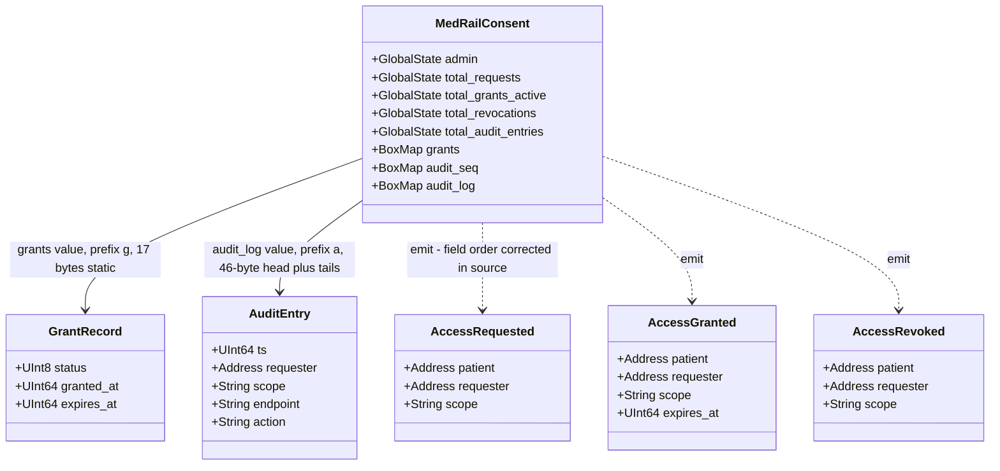
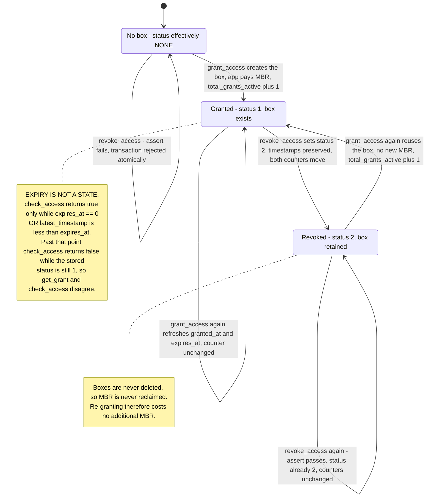
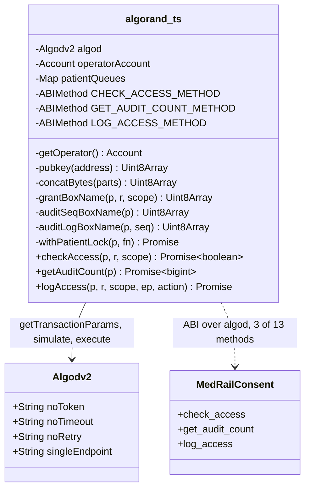
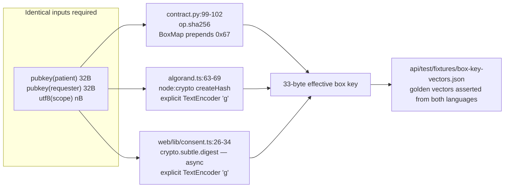
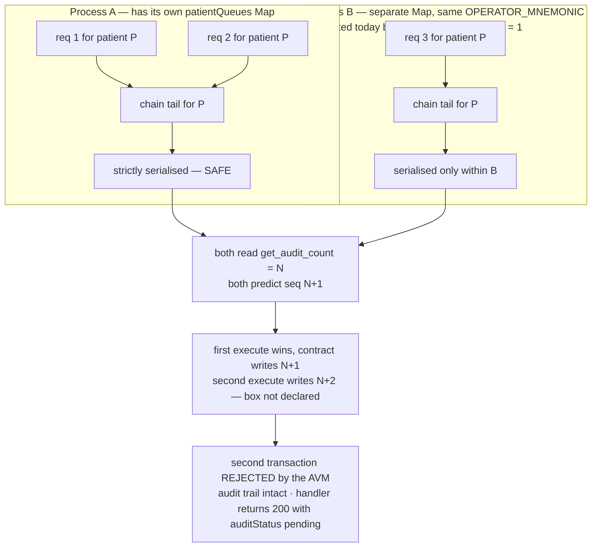
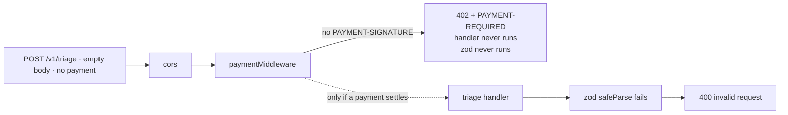
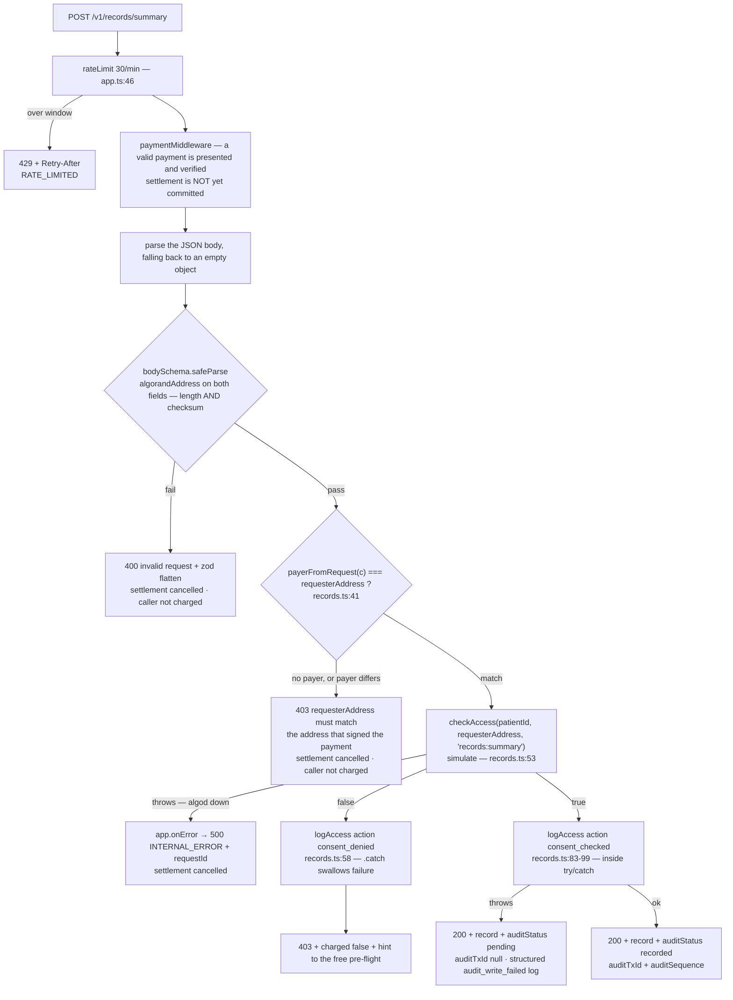

# MedRail — Low-Level Design

**Purpose:** specify the internal design of MedRail's business-critical modules at the level of state layout, byte encodings, algorithms, control flow and concurrency semantics.

**Status of this document:** Descriptive of the working tree on branch `main`, derived by reading every line of the modules covered. Trivial adapters (`routes/health.ts`, `routes/triage.ts`, `routes/interaction.ts`, `web/lib/api.ts`, `web/lib/config.ts`, presentational components) are covered only where they carry a decision. Status labels per the project fact ledger. Byte-size figures marked *computed* are arithmetic from documented ARC-4 encoding and Algorand MBR rules; where a figure has been confirmed against the deployed application it is marked *verified on-chain*.

Related: [`./HLD.md`](./HLD.md) · [`./System_Architecture.md`](./System_Architecture.md) · [`./Sequence_Diagrams.md`](./Sequence_Diagrams.md) · [`../02_Requirements/SRS.md`](../02_Requirements/SRS.md) · [`../06_Security/Threat_Model.md`](../06_Security/Threat_Model.md) · [`./ADRs/`](./ADRs/)

---

## 1. Module map

| # | Module | Lines | Why it is here |
|---|---|---|---|
| §2 | `contracts/smart_contracts/consent/contract.py` | 266 | The only on-chain program; holds all durable state and all enforceable authorisation. |
| §3 | `api/src/services/algorand.ts` | 179 | Every chain interaction the API performs. Still the highest-risk module in the repository: no dedicated unit-test file, three concurrency and key-derivation hazards. |
| §4 | `api/src/x402.ts` + `api/src/app.ts` | 32 + 177 | The payment gate, the rate-limit and facilitator-degradation wrappers, and the middleware ordering that determines every status code the system emits. |
| §4.6 | `api/src/rateLimit.ts` + `api/src/validation.ts` | 90 + 17 | The two guards added to the unpaid surface: a fixed-window limiter and a checksum-validating address schema. |
| §5 | `api/src/routes/records.ts` | 112 | The flagship consent-gated endpoint, and the place where payment identity becomes authorisation identity. |
| §5.2 | `api/src/x402Payer.ts` | 40 | Recovers the address that actually signed the payment. Small, and load-bearing for the entire consent thesis. |
| §6 | `api/src/services/triageScorer.ts`, `interactionChecker.ts` | 73 + 55 | The two priced compute endpoints. Fully covered by 13 unit tests. |
| §7 | `web/lib/consent.ts`, `demoWallet.ts`, `x402Client.ts` | 89 + 52 + 37 | Browser-side signing, and the third independent copy of the box-key derivation — now pinned by a shared golden-vector fixture. |

---

## 2. `MedRailConsent` — contract internals

### 2.1 State layout

**Global state.** ARC-56 schema: `{"global": {"ints": 4, "bytes": 1}, "local": {"ints": 0, "bytes": 0}}` (`contracts/artifacts/MedRailConsent.arc56.json`). No local state exists, which is the whole point of the box design — see §2.3.

| Key | Type | Set by | Meaning |
|---|---|---|---|
| `admin` | `Account` (byteslice) | `create` (`contract.py:121`), `set_admin` (`:127`) | The only account permitted to call `log_access` or `withdraw_excess`. |
| `total_requests` | `UInt64` | `request_access` (`:145`) | Monotonic counter of interest signals. |
| `total_grants_active` | `UInt64` | `grant_access` (`:167`), `revoke_access` (`:192`) | Count of grant boxes whose stored `status == STATUS_GRANTED`. |
| `total_revocations` | `UInt64` | `revoke_access` (`:193`) | Monotonic counter of revocations of previously-active grants. |
| `total_audit_entries` | `UInt64` | `log_access` (`:235`) | Monotonic counter of audit entries. **Live value on app `768743428` is 5.** |

**Semantic caveat on `total_grants_active`.** Nothing decrements this counter on expiry — expiry is evaluated at read time and never written back (§2.4). A grant that has passed `expires_at` still counts toward `total_grants_active` until it is explicitly revoked. The counter therefore means "grant boxes not yet revoked", not "grants currently valid". Its live value on app `768743428` is 4. Finding **G-32** remains open: the counter is honest about what it counts only if you read the source, and a dashboard built on the name alone would be wrong.

**Box storage.** Three `BoxMap`s, declared at `contract.py:114-116`:

| Field | Declaration | Prefix | Prefix byte | Key body | Value |
|---|---|---|---|---|---|
| `grants` | `BoxMap(Bytes, GrantRecord, key_prefix="g")` | `g` | `0x67` | 32-byte SHA-256 digest | `GrantRecord` |
| `audit_seq` | `BoxMap(Account, UInt64, key_prefix="s")` | `s` | `0x73` | 32-byte patient public key | 8-byte `UInt64` |
| `audit_log` | `BoxMap(Bytes, AuditEntry, key_prefix="a")` | `a` | `0x61` | 40 bytes: patient public key ‖ `itob(seq)` | `AuditEntry` |

Prefixes are confirmed in the compiled spec (`maps.box`, base64 `Zw==`/`cw==`/`YQ==` = `g`/`s`/`a`).

One dead import: `Box` is imported at `contract.py:29` and never used — only `BoxMap` is. Cosmetic.

### 2.2 Exact key-derivation algorithms

Two subroutines produce every box key. They are the single most safety-critical piece of arithmetic in the system, because three independent implementations must agree byte-for-byte (§3.2, NFR-011).

```python
# contract.py:95-98
@subroutine
def grant_key(patient: Account, requester: Account, scope: String) -> Bytes:
    return op.sha256(patient.bytes + requester.bytes + scope.bytes)

# contract.py:101-103
@subroutine
def audit_key(patient: Account, seq: UInt64) -> Bytes:
    return patient.bytes + op.itob(seq)
```

| Key | Formula | Length |
|---|---|---|
| **Effective grant box key** | `0x67 ‖ SHA256( pubkey(patient)[32] ‖ pubkey(requester)[32] ‖ utf8(scope)[n] )` | 1 + 32 = **33 bytes** |
| **Effective audit-seq box key** | `0x73 ‖ pubkey(patient)[32]` | 1 + 32 = **33 bytes** |
| **Effective audit-log box key** | `0x61 ‖ pubkey(patient)[32] ‖ big-endian uint64(seq)[8]` | 1 + 32 + 8 = **41 bytes** |

Three properties follow, and all three matter downstream:

1. **The `key_prefix` is part of the on-chain key.** `grant_key` returns 32 bytes; the `BoxMap` prepends one. The *effective* key is 33 bytes. That one byte was the entire content of the `GRANT_BOX_MBR` defect, finding **G-20** (§2.5).
2. **`scope` is unbounded and hashed, so the key is fixed-length.** A 4-character scope and a 400-character scope produce identical 33-byte keys and identical MBR. DATA-003 **IMPLEMENTED**: scope is a free-form string, not an enumeration, so a new endpoint needs no contract change.
3. **The digest is collision-resistant over the whole triple, but the concatenation is unframed.** `patient.bytes` and `requester.bytes` are both fixed at 32 bytes, so the only variable-length field is the trailing `scope`; no length prefix or separator is needed to make the parse unambiguous. DATA-001 **VALIDATED**. Had any leading field been variable-length, this construction would have been ambiguous.

### 2.3 Struct encodings and byte sizes

All field types below are `arc4.*` ARC-4 types; the namespace is elided in the diagram for legibility.



**`GrantRecord`** (`contract.py:58-63`) is entirely static: `uint8` 1 B + `uint64` 8 B + `uint64` 8 B = **17 bytes**, no head/tail split, no offsets. *Verified on-chain*: measured when the deployed app held exactly its two grant boxes and nothing else, it reported `total-boxes = 2` and `total-box-bytes = 100`; 2 × (33 key + 17 value) = 100. That measurement is what pins the effective key at 33 bytes, and it is reproduced in §2.5. The app has since accumulated audit boxes as well, so the live totals are larger — the arithmetic, not the snapshot, is the evidence.

**`AuditEntry`** (`contract.py:66-73`) mixes static and dynamic fields, so ARC-4 tuple encoding applies:

| Segment | Field | Bytes |
|---|---|---|
| head | `ts` (`uint64`) | 8 |
| head | `requester` (`address`) | 32 |
| head | offset to `scope` | 2 |
| head | offset to `endpoint` | 2 |
| head | offset to `action` | 2 |
| | **head total** | **46** |
| tail | `scope` = 2-byte length + UTF-8 | 2 + len |
| tail | `endpoint` = 2-byte length + UTF-8 | 2 + len |
| tail | `action` = 2-byte length + UTF-8 | 2 + len |

For the exact constants `api/src/routes/records.ts:10-11` uses — `scope = "records:summary"` (15), `endpoint = "/v1/records/summary"` (19) — the encoded value is *computed* as:

| Path | `action` | Tail | Total value |
|---|---|---|---|
| allowed | `"consent_checked"` (15) | 17 + 21 + 17 = 55 | **101 bytes** |
| denied | `"consent_denied"` (14) | 17 + 21 + 16 = 54 | **100 bytes** |

**Events.** `AccessRequested`, `AccessGranted`, `AccessRevoked` (`contract.py:79-96`) are ARC-28 events emitted via `arc4.emit`. They are log-only: no consumer exists in this repository, and nothing reads them back. `AccessRequested` carried a field-order defect that is now corrected in source — see §2.6.

### 2.4 Consent state machine

There are three stored status codes and **no stored expiry state**: `STATUS_NONE = 0`, `STATUS_GRANTED = 1`, `STATUS_REVOKED = 2` (`contract.py:46-48`). Expiry is a *read-time predicate* evaluated by `check_access`, never written back.



**Why the box is reused rather than deleted.** Re-granting after a revocation must restore the active-grant counter exactly once. `grant_access` handles this by keying the counter off the prior *status*, not prior *existence* (`contract.py:156-167`):

```python
was_active_before = False
if self.grants.maybe(key)[1]:
    was_active_before = self.grants.maybe(key)[0].status == arc4.UInt8(STATUS_GRANTED)
...
if not was_active_before:
    self.total_grants_active.value += 1
```

The in-code comment at `contract.py:156-158` states the reasoning explicitly: "a box can exist while inactive (previously revoked), so 'does the box exist' is not the same question as 'is it already counted as active'". This is correct and deliberate. FR-022 **VALIDATED** by `test_consent.py::test_regrant_after_revoke_reactivates`.

**Read-time expiry semantics** (`contract.py:197-209`): `check_access` returns true iff the box exists **and** `status == STATUS_GRANTED` **and** (`expires_at == 0` **or** `Global.latest_timestamp < expires_at`). `duration_seconds == 0` at grant time stores `expires_at = 0`, meaning never expires (`contract.py:152`). FR-019 and FR-023 **VALIDATED**, including via `patch_global_fields(latest_timestamp=…)` in the simulator.

A consequence worth stating: `get_grant` and `check_access` can disagree. For an expired grant, `get_grant` returns `status = 1` while `check_access` returns `false`. Any consumer that reads `get_grant` and infers validity from `status` alone is wrong. The API never does this — it only calls `check_access` (`api/src/services/algorand.ts:82`).

### 2.5 MBR economics, and the `GRANT_BOX_MBR` correction

Algorand's box minimum-balance formula is `2500 + 400 × (len(key) + len(value))` µALGO, where `len(key)` is the **effective** key including any `BoxMap` prefix.

```python
# contract.py:55
GRANT_BOX_MBR = 2_500 + 400 * (33 + 17)      # = 22_500
```

The constant originally read `400 * (32 + 17)` = 22,100, which under-reported the true cost by 400 µALGO per box. `grant_key` returns 32 bytes, but the `BoxMap(key_prefix="g")` prepends one, so the effective key is 33 — the same one byte that §2.2 property 1 is about. **Finding G-20 is fixed in source**; a regression test in `contracts/tests/test_consent.py` pins the value at 22,500 and was verified to fail against the old constant.

The measurement that settles it, taken *on-chain* against app `768743428` while it held exactly its two grant boxes:

| Reported by the network | Value | Reconciliation |
|---|---|---|
| app account `min-balance` | 145,000 µALGO | 100,000 base account MBR + 2 × 22,500 = 145,000 ✓ |
| `total-boxes` | 2 | both `g`-prefixed grant boxes |
| `total-box-bytes` | 100 | 2 × (33 + 17) = 100 ✓ — the ledger itself counts the key as 33 bytes |

`total-box-bytes = 100` is the cleanest single piece of evidence: with a 32-byte key it would be 98. The constant matters because it is exposed as a public ABI method advertised in its own docstring as "a compile-time constant the backend can quote when sizing `fund_mbr` calls" (`contract.py:257-258`), so a backend that trusted the old value under-funded by about 1.8% per grant.

> **The redeploy is deliberately deferred.** `deploy_testnet.py` uses `OnUpdate.AppendApp`, which creates a *new* application rather than upgrading in place — redeploying would mint a fresh App ID and orphan `768743428` together with its on-chain history and every transaction ID cited in these documents. App `768743428` therefore still runs the pre-fix bytecode, and `get_grant_box_mbr()` called against it still returns 22,100. The fix is in source and tested; it goes live at the next intentional redeploy.

FR-032 **IMPLEMENTED (corrected in source, redeploy deferred)**; REL-006 **PARTIALLY IMPLEMENTED**.

**Audit-box MBR is deliberately not hard-coded**, and the comment at `contract.py:53-55` explains why: `AuditEntry` is variable-length because of the three ARC-4 dynamic strings, so a single constant would be meaningless. That is correct engineering, not an omission.

*Computed* audit costs, using the §2.3 encodings. **These are now live costs — the deployed application holds both `s`- and `a`-prefixed boxes, and `total_audit_entries` stands at 5:**

| Box | Effective key | Value | MBR (µALGO) |
|---|---|---|---|
| `audit_seq` (one per patient, created once) | 33 | 8 | `2500 + 400×41` = **18,900** |
| `audit_log` allowed entry | 41 | 101 | `2500 + 400×142` = **59,300** |
| `audit_log` denied entry | 41 | 100 | `2500 + 400×141` = **58,900** |

The first audit write for a previously-unseen patient locks **78,200 µALGO** (sequence box plus first log box); each subsequent allowed write locks 59,300. The app account was funded with 5,000,000 µALGO against a then-min-balance of 145,000 (`contracts/artifacts/deploy_testnet.json`, funding tx `KYH3H5CG2CCUPUUTJIBX47WD4RWSUV3QWTEUJQRQFYLWO5YAO3QA`); each audit entry since has consumed headroom at the rates above. Nothing monitors that headroom and nothing alerts on it: OPS-005 **NOT IMPLEMENTED**, finding **G-15** open. When it is exhausted the failure surfaces as `logAccess` throwing — which the allowed path now catches and degrades to `auditStatus: "pending"` rather than discarding the response (§5.4).

**Boxes are never deleted.** No method calls a delete; revocation rewrites the record in place (`contract.py:193-197`). MBR is therefore monotonically non-decreasing for the life of the application. `withdraw_excess` (`contract.py:261-266`) is the only outflow, is admin-gated, and uses an inner `itxn.Payment(fee=0)`. Its success path is **untested** — `test_consent.py::test_withdraw_excess_admin_only` covers only the rejection. FR-031 **PARTIALLY IMPLEMENTED**; findings **G-25** (untested positive path) and **G-31** (no in-contract bound) both remain open.

### 2.6 Method-by-method walkthrough

All 13 ABI methods, in declaration order, with their authorisation check and state effect.

| # | Method | `readonly` | Authorisation check | State written | Notes |
|---|---|---|---|---|---|
| 1 | `create()` | no | `@arc4.abimethod(create="require")` — can only run at creation | `admin = Txn.sender` (`:121`) | The deployer becomes admin. No separate bootstrap step. |
| 2 | `set_admin(address)` | no | `assert Txn.sender == self.admin.value` (`:126`) | `admin` | Key rotation without redeployment. FR-029 **VALIDATED**. No two-step handover: a typo in `new_admin` permanently bricks admin authority. |
| 3 | `fund_mbr(pay)` | no | **None on the sender.** Asserts only `payment.receiver == Global.current_application_address` (`:138`) | none | Anyone may top up. Deliberate — the app owns its boxes, so anyone paying its MBR is harmless. FR-030 **IMPLEMENTED**, and **untested**. |
| 4 | `request_access(address patient, string scope)` | no | None | `total_requests += 1` (`:148`) | Persists nothing else — deliberate, and the docstring says so (`:145-147`): grant is the first thing that costs MBR. Its event emit carried a field-order defect, now corrected — see below. |
| 5 | `grant_access(address requester, string scope, uint64 duration)` | no | **Implicit and strong**: the patient is `Txn.sender` (`:151`); no patient argument exists, so impersonation is impossible at this layer | grant box; `total_grants_active` | SEC-003 **VALIDATED**. Live: `X2BQ5FD4MW52B75WQGDB67TEULYLN7FHVFO6ZOBNI74PNCAKVOUA`. |
| 6 | `revoke_access(address requester, string scope)` | no | Same — patient is `Txn.sender` (`:181`). Plus `assert self.grants.maybe(key)[1], "no such grant"` (`:182`) | grant box; both counters | Atomic failure on a non-existent grant. FR-021 **VALIDATED**. Live: `OV2J2T5VWMIQG64JYGL7JEGZKKNZNKCMNIQU6AC4PDRQYZ6ZOO5A`. |
| 7 | `check_access(patient, requester, scope) -> bool` | **yes** | None — public read | none | The predicate the whole API depends on. Called via `simulate` (§3.3). |
| 8 | `get_grant(patient, requester, scope) -> GrantRecord` | **yes** | None; asserts the box exists (`:214`) | none | Returns stored status — see the expiry caveat in §2.4. Unused by the API. |
| 9 | `log_access(patient, requester, scope, endpoint, action) -> uint64` | no | `assert Txn.sender == self.admin.value` (`:229`) | `audit_seq[patient]`, `audit_log[key]`, `total_audit_entries` | SEC-001 **VALIDATED** by `test_log_access_rejects_non_admin`. FR-025 **VALIDATED on-chain** — first live execution `4YLKLQKKWXXFW3UT5APJVYKXI7T7A6OACTAWCC5YBAN3XGOGHRVQ`, sequence 1; `total_audit_entries` is now 5. |
| 10 | `get_audit_count(patient) -> uint64` | **yes** | None | none | `self.audit_seq.get(patient, default=UInt64(0))` — returns 0 for an unknown patient rather than asserting. |
| 11 | `get_audit_entry(patient, seq) -> AuditEntry` | **yes** | None; asserts the entry exists (`:245`) | none | FR-028 **VALIDATED** in simulator. |
| 12 | `get_grant_box_mbr() -> uint64` | **yes** | None | none | Returns `GRANT_BOX_MBR` — 22,500 in source; the deployed bytecode still returns the old 22,100 (§2.5). |
| 13 | `withdraw_excess(uint64 amount)` | no | `assert Txn.sender == self.admin.value` (`:265`) | none directly; inner payment | `itxn.Payment(receiver=admin, amount, fee=0)`. **No lower-bound check** — the AVM will reject a withdrawal that breaches min-balance, so the safety comes from the protocol, not the contract. Finding **G-31**, open. |

**Sequence allocation inside `log_access`** (`contract.py:231-243`):

```python
seq, existed = self.audit_seq.maybe(patient)
next_seq = UInt64(1) if not existed else seq + 1
self.audit_seq[patient] = next_seq
self.audit_log[audit_key(patient, next_seq)] = AuditEntry(...)
```

The sequence is allocated **on-chain from on-chain state**, not from a client-supplied value. That single fact is what protects the ledger from the client-side prediction race analysed in §3.6: a stale prediction cannot corrupt the audit trail, it can only cause the transaction to fail. Sequences are per-patient and independent — FR-027 **VALIDATED** by `test_audit_log_sequence_increments_per_patient`, and now also on-chain.

#### `request_access` — the swapped-event defect, corrected in source

```python
# contract.py:153 — current
arc4.emit(AccessRequested(arc4.Address(patient), arc4.Address(Txn.sender), arc4.String(scope)))
```

`AccessRequested` is declared `patient: arc4.Address, requester: arc4.Address` (`contract.py:79-82`), and ARC-4 struct construction is positional. The original emit passed `(Txn.sender, patient)`, which bound `Txn.sender` to the `patient` field — but `Txn.sender` here is the *requester*, per the method's own docstring at `contract.py:145-147` ("Requester signals interest in a scope"). The `patient` argument landed in the `requester` field, and the whole ARC-28 event feed was inverted: any indexer, subscriber or analytics consumer built against it attributed every request to the wrong party. On-chain *state* was never affected — only the log.

It survived because `test_consent.py::test_request_access_emits_event_and_counts` asserted `total_requests == 1` and never inspected the event payload. **Finding G-12 is fixed in source**: the arguments are swapped back, and a new regression test now decodes the emitted event and asserts the field binding — verified to fail against the old code. Compare the two sibling emits, which were always correct because in those methods `Txn.sender` genuinely *is* the patient: `contract.py:176-183` and `contract.py:202`.

As with §2.5, the redeploy is deferred by design, so app `768743428` still emits the inverted event. FR-024 **IMPLEMENTED (corrected in source, redeploy deferred)**.

---

## 3. `api/src/services/algorand.ts` — the chain gateway

179 lines, **no dedicated unit-test file**, and the only module in the API that can spend money or write to the ledger. Its box-key derivation is now pinned indirectly by `api/test/boxKeyParity.spec.ts` (§3.2), but its `simulate` reads, its sequence prediction and its lock remain covered only end-to-end by the live scripts in `api/scripts/`. Finding **G-05** is open on exactly that gap.



### 3.1 Hand-constructed `ABIMethod` literals

Three method descriptors are declared as object literals rather than parsed from the committed ARC-56 spec (`api/src/services/algorand.ts:20-46`). The rationale is recorded in-code at `:16-19`: constructing them "directly from the contract's known ARC-4 signatures … rather than parsed via `ABIContract`, so this has no dependency on how a given algosdk version handles ARC-56 vs. ARC-4 app-spec parsing."

| | Hand-declared literals (chosen) | Parse `MedRailConsent.arc56.json` at boot |
|---|---|---|
| Coupling to algosdk's ARC-56 support | none | tracks algosdk minor versions |
| Coupling to the compiled artefact | none — the API needs no artefact file at runtime for ABI purposes | the file must ship in the image |
| Drift risk | **a signature change in the contract compiles cleanly on both sides and fails only at call time** | drift impossible by construction |
| Startup failure mode | none | missing/corrupt file kills the process |

The trade-off is deliberate and defensible; the residual risk is that this is a **fourth** hand-maintained copy of the contract interface, alongside the Python source, the ARC-56 artefact and `web/lib/consent.ts:7-24`. No test asserts that any of them agree. Note that only three of the thirteen ABI methods are declared here — the API never calls `grant_access`, `revoke_access`, `get_grant`, `get_audit_entry`, `fund_mbr`, `set_admin`, `withdraw_excess` or `get_grant_box_mbr`. The backend's on-chain authority surface is deliberately narrow: two reads and one admin write.

### 3.2 The three box-name builders

```ts
// api/src/services/algorand.ts:63-79
function grantBoxName(patient, requester, scope) {
  const prefix = new TextEncoder().encode("g");
  const inner = concatBytes(pubkey(patient), pubkey(requester), new TextEncoder().encode(scope));
  const digest = createHash("sha256").update(inner).digest();
  return concatBytes(prefix, new Uint8Array(digest));
}
function auditSeqBoxName(patient)      { return concatBytes(enc("s"), pubkey(patient)); }
function auditLogBoxName(patient, seq) { return concatBytes(enc("a"), pubkey(patient), algosdk.encodeUint64(seq)); }
```

These reproduce §2.2 exactly: `pubkey()` is `algosdk.decodeAddress(address).publicKey` (`:48-50`), `createHash("sha256")` matches `op.sha256`, and `algosdk.encodeUint64` matches `op.itob` (both big-endian, 8 bytes).

**NFR-011 — VALIDATED.** The same derivation exists three times, in three languages, with three different primitives — and all three are now pinned to one shared set of golden vectors:



`api/test/fixtures/box-key-vectors.json` holds fixed `(patient, requester, scope)` triples with their expected 33-byte grant key and 33-byte audit-sequence key as hex. It is asserted by `api/test/boxKeyParity.spec.ts` — which exercises **both** the Node `createHash` path and the browser `crypto.subtle` path — and independently by `contracts/tests/test_box_keys.py` on the Python side. A change to the prefix, the concatenation order or the hash input in any one implementation now fails a test rather than silently producing a box reference for a key that does not exist. That was the dangerous part: the old failure mode was not a compile error or a clear exception, but a read that looks like "no grant" and a write that lands in the wrong slot. Finding **G-08 is closed**.

The fixture is a *shared* file rather than three copied constants on purpose — copied constants drift in exactly the way the implementations they guard were drifting.

A related latent hazard: `scope` is UTF-8 encoded in all three places with no normalisation. Two visually identical scopes differing in Unicode normal form produce different keys. Not a live problem — the only scope in use is the ASCII constant `"records:summary"` (`api/src/routes/records.ts:10`, `web/components/ConsentChecker.tsx:9`).

### 3.3 The `simulate()` read path

```ts
// api/src/services/algorand.ts:82-100
export async function checkAccess(patient, requester, scope): Promise<boolean> {
  const appId = requireConsentAppId();
  const operator = getOperator();
  const suggestedParams = await algod.getTransactionParams().do();
  const atc = new algosdk.AtomicTransactionComposer();
  atc.addMethodCall({ appID: appId, method: CHECK_ACCESS_METHOD,
    methodArgs: [patient, requester, scope],
    sender: operator.addr, signer: algosdk.makeBasicAccountTransactionSigner(operator),
    suggestedParams, boxes: [{ appIndex: 0, name: grantBoxName(patient, requester, scope) }] });
  const result = await atc.simulate(algod);
  return result.methodResults[0]?.returnValue === true;
}
```

Properties:

- **Nothing is submitted.** `simulate` is evaluated by the node and discarded. No fee, no round consumed, no state change. SEC-009 **IMPLEMENTED**.
- **Two sequential outbound calls per invocation**: `getTransactionParams` then `simulate`. The reviewer's single cold observation of `GET /v1/consent/status` was **505 ms**; this is one sample on a developer laptop, not a percentile.
- **`boxes: [{ appIndex: 0, ... }]`** — `appIndex: 0` denotes the application being called. Referencing a non-existent box is legal; `check_access` handles absence itself (`contract.py:201-202`).
- **Fail-closed on an ambiguous result.** The strict `=== true` comparison means an `undefined` return value (a failed or malformed simulation) yields `false`, i.e. denied. Denial is the safe direction. A simulation that *throws* propagates instead, and becomes a generic 500 with a `requestId` via `app.onError` (§4.6).
- **Malformed addresses no longer reach this function.** A 58-character but checksum-invalid address used to survive the route's length-only schema and throw inside `pubkey` → `algosdk.decodeAddress` (`:49`) while the `boxes` argument was being built — *after* `await algod.getTransactionParams().do()` had already completed. The client got `500 {"error":"wrong checksum for address"}`, and an unauthenticated caller could force an outbound AlgoNode call with a guaranteed-invalid address. Both routes now validate with the `algorandAddress` zod schema (§4.6), so that input is a **400** before any chain call is attempted, and `app.onError` no longer echoes exception text. SEC-010, SEC-011 **IMPLEMENTED**; finding **G-10 closed**, pinned by three tests in `api/test/app.spec.ts`.
- **The amplification concern is bounded, not eliminated.** A *valid* pair of addresses still costs two outbound AlgoNode calls per free request. `GET /v1/consent/status` is therefore rate-limited to 60 requests per minute per client (§4.6), which caps the amplification factor rather than removing it. SEC-013 **IMPLEMENTED**; finding **G-09 closed**.

`getAuditCount` (`:103-121`) is structurally identical, differing only in the method, the single argument and the `s`-prefixed box reference.

### 3.4 The hidden `OPERATOR_MNEMONIC` dependency

```ts
// api/src/services/algorand.ts:7-14
let operatorAccount: algosdk.Account | undefined;
function getOperator(): algosdk.Account {
  if (!config.operatorMnemonic) throw new Error("OPERATOR_MNEMONIC is not set — see docs/DEPLOYMENT.md");
  operatorAccount ??= algosdk.mnemonicToSecretKey(config.operatorMnemonic);
  return operatorAccount;
}
```

`simulate` still requires a sender and a signer, so **both read functions call `getOperator()`** (`:84`, `:105`). The consequence is a dependency that is invisible from the route:

> `GET /v1/consent/status` is free, unauthenticated, read-only, submits nothing — and cannot serve a single request unless the contract admin's private key is loaded into the process.

The mnemonic is derived once and memoised for the process lifetime. Two further observations:

- The account object holds the raw secret key in memory for the process lifetime. There is no zeroisation, no scoping and no KMS. SEC-012 **NOT IMPLEMENTED** — this one key can forge audit entries, rotate `admin` to lock out the real owner, and drain the app account via `withdraw_excess`.
- `requireConsentAppId()` (`api/src/config.ts:81-89`) throws with an actionable message when `consentAppId` is 0. This used to fire in the container: `contracts/artifacts/deploy_testnet.json` is not copied into the image, so the `readDeployedAppId()` fallback (`api/src/config.ts:32-41`) cannot help there, and `api/fly.toml` set no `CONSENT_APP_ID` — both consent-touching endpoints returned 500. `api/fly.toml` now sets `CONSENT_APP_ID = "768743428"` and `NETWORK = "testnet"` explicitly, so the environment variable carries the value and the file fallback is a development convenience only. Finding **G-07 closed**.

### 3.5 `logAccess` — read-then-write sequence prediction

```ts
// api/src/services/algorand.ts:146-179 (body, inside withPatientLock)
const suggestedParams = await algod.getTransactionParams().do();
const currentCount = await getAuditCount(patient);      // itself: getTransactionParams + simulate
const predictedSeq = currentCount + 1n;
atc.addMethodCall({ ..., boxes: [
  { appIndex: 0, name: auditSeqBoxName(patient) },
  { appIndex: 0, name: auditLogBoxName(patient, predictedSeq) },
]});
const result = await atc.execute(algod, 4);
const sequence = (result.methodResults[0]?.returnValue as bigint) ?? predictedSeq;
return { txId: result.txIDs[0], sequence };
```

**Why the prediction exists at all — and what it is not.** It is **not** a sequencing scheme, and nothing on-chain trusts it. `log_access` reads its own `audit_seq` box and computes `next_seq = 1 if not existed else seq + 1` itself (`contract.py:224-226`), then writes both boxes; a caller-supplied sequence is never accepted as an argument, because the method has no such parameter. The client-side `predictedSeq` (`algorand.ts:158-159`) exists solely to populate the **box-reference array** at `algorand.ts:169-172`: the AVM requires every box a transaction touches to be declared up front, and the box the contract is about to write is `a ‖ patient ‖ itob(next_seq)`, so the caller must name it in advance. Reading the current count and adding one is the only way to do that. This is an AVM resource-declaration requirement, not a design smell — and it is why a lost race rejects a transaction rather than corrupting a log (§3.6).

**Cost.** The block above performs four sequential outbound calls before the transaction is even submitted: `getTransactionParams`, then `getAuditCount`'s own `getTransactionParams` and `simulate`, then `execute` which polls for confirmation over up to four rounds. The redundant second `getTransactionParams` is avoidable — `getAuditCount` fetches its own rather than accepting the caller's. Minor, but it is a network round-trip on the money path: finding **G-33**, open.

**Failure semantics.** `atc.execute(algod, 4)` waits four rounds and then throws (`api/src/services/algorand.ts:175`). On Algorand that is roughly fourteen seconds. There is no retry and no timeout on the underlying `Algodv2` (`:5`). REL-003 **NOT IMPLEMENTED**. What has changed is the *consequence*: the caller of `logAccess` on the success path now catches this and degrades the response rather than discarding it (§5.4).

**The return-value fallback is a lie detector that never fires.** `?? predictedSeq` substitutes the prediction if the ABI return is missing. If those two ever disagreed, the API would report a sequence number that does not match the ledger. In practice `execute` throws before returning a mismatched result, so the fallback is defensive rather than load-bearing.

### 3.6 `withPatientLock` — precise semantics

```ts
// api/src/services/algorand.ts:123-138 — the explanatory comment at :123-128 plus the queue itself
const patientQueues = new Map<string, Promise<unknown>>();
function withPatientLock<T>(patient: string, fn: () => Promise<T>): Promise<T> {
  const prior = patientQueues.get(patient) ?? Promise.resolve();
  const next = prior.then(fn, fn);
  patientQueues.set(patient, next.catch(() => undefined));
  return next;
}
```

Line by line:

| Line | Mechanism |
|---|---|
| `const prior = patientQueues.get(patient) ?? Promise.resolve()` | The map value is the *tail* of this patient's chain. A first call for a patient starts from an already-resolved promise, so it runs on the next microtask tick. |
| `const next = prior.then(fn, fn)` | `fn` is registered as **both** the fulfilment and the rejection handler. This is the load-bearing trick: it guarantees `fn` runs whether or not the previous task succeeded. With only the first handler, one rejection would poison the chain and every later call for that patient would reject without ever executing. Latent footgun: as a rejection handler, `fn` receives the prior error as its first argument — harmless only because `fn` is declared `() => Promise<T>` and ignores it. |
| `patientQueues.set(patient, next.catch(() => undefined))` | The *stored* tail is a derived promise that can never reject, so no unhandled-rejection warning is raised and the chain always advances. |
| `return next` | The caller receives the **un-swallowed** promise, so the caller still sees the real error. The swallow applies only to the stored tail. |

**What it guarantees:** for a fixed `patient` string, within one Node process, the bodies of `fn` are entered in call order and never overlap. Different patients proceed concurrently — the granularity is exactly right.

**What it does not guarantee:**

1. **Nothing across processes.** Each process has its own `patientQueues`. `api/fly.toml` previously set only `min_machines_running = 1` — a floor, not a ceiling — so two machines sharing the one `OPERATOR_MNEMONIC` could restore the race in full. It now also sets **`max_machines_running = 1`**, with an in-file comment naming this module as the reason, so the deployment configuration and the concurrency assumption finally agree. REL-004 **IMPLEMENTED for the documented single-machine posture**. Finding **G-11 remains open**, correctly reclassified: the lock is no longer contradicted by the config, but it is still what pins MedRail to one machine, and horizontal scaling needs a shared sequencer or a contract-side allocation change first.
2. **It is not a lock over the ledger, and the ledger does not need one.** Reading `contract.py:231-243` alongside `algorand.ts:158-159` clarifies what a lost race actually does. `log_access` recomputes `next_seq` from on-chain state, so a stale client prediction **cannot** corrupt or overwrite the audit trail. What it can do is produce a transaction whose box-reference array names `a ‖ patient ‖ N+1` while the contract writes `a ‖ patient ‖ N+2` — an undeclared box — and the transaction is rejected by the AVM. So the concurrency hazard is a **failed transaction, not a corrupted log**. On the denied path that rejection is swallowed (`records.ts:58`); on the allowed path it is caught and reported as `auditStatus: "pending"` (§5.4). Either way the caller gets a coherent response and the ledger stays consistent.
3. **The map is never pruned.** One entry accumulates per distinct patient address for the process lifetime, and entries are never deleted. Growth is gated by payment — each new address costs an attacker $0.05 — so this is a slow, paid-for leak rather than a free one, but it is unbounded in principle.
4. **`checkAccess` is not serialised**, correctly: it submits nothing and has no ordering requirement.



---

## 4. `api/src/x402.ts` + `api/src/app.ts` — payment gate and middleware wiring

### 4.1 Composition

```ts
// api/src/x402.ts:6-14
const facilitatorClient = new HTTPFacilitatorClient({ url: config.facilitatorUrl });
export const resourceServer = new x402ResourceServer(facilitatorClient).register(
  config.networkCaip2,
  new ExactAvmScheme(),
);
```

Three objects, one wiring statement:

| Object | Package | Responsibility |
|---|---|---|
| `HTTPFacilitatorClient` | `@x402/core/server` | HTTP transport to `config.facilitatorUrl`; fetches `/supported`, submits verify and settle. |
| `x402ResourceServer` | `@x402/hono` | Builds the 402 challenge, matches presented payments to requirements, orchestrates verify/settle. |
| `ExactAvmScheme` | `@x402/avm/exact/server` | The AVM `exact` scheme — how an Algorand payment is expressed and checked. |

`.register(config.networkCaip2, …)` binds **exactly one** CAIP-2 network. The comment at `api/src/x402.ts:8-10` records the intent: a TestNet-configured process does not accidentally accept a MainNet-signed payment or the reverse. NFR-002 **IMPLEMENTED**. This is a structural control, not a runtime check — an unregistered network has no scheme handler, so the payment cannot be interpreted at all.

### 4.2 `priced()` and why no `asset` is set

```ts
// api/src/x402.ts:16-32
export function priced(usd: string, description: string) {
  // No explicit `asset` field: both GoPlausible's TS and Python reference examples
  // omit it and let the scheme's default money parser resolve the network's
  // canonical stablecoin (USDC) from the "$x.xx" price string.
  return { accepts: [{ scheme: "exact" as const, price: usd, network: config.networkCaip2, payTo: config.payToAddress }],
           description, mimeType: "application/json" };
}
```

The rationale is recorded in-code. The price is a human string; the SDK's money parser resolves it to the network's canonical USDC ASA and to base units at 6 decimals. `"$0.02"` becomes `amount: "20000"`, `"$0.05"` becomes `"50000"` — both asserted from the live 402 by `api/test/x402-flow.spec.ts:24` and `:45`.

Two consequences follow from the omission, and they pull in opposite directions:

- **Benefit:** MedRail's config cannot desynchronise from the facilitator's asset list, and switching networks changes one environment variable. NFR-012 **IMPLEMENTED**.
- **Cost:** `accepts[].asset` and `extra.feePayer` in the emitted 402 come from the facilitator's `/supported`, not from MedRail. The challenge therefore **cannot be constructed offline**, which makes MedRail's priced surface strictly dependent on a third party's availability. With `FACILITATOR_URL` pointed at a closed port, `x402ResourceServer.initialize()` fails with "no supported payment kinds loaded from any facilitator". That used to surface as an opaque HTTP 500 with no `PAYMENT-REQUIRED` header; §4.6 describes the 503 wrapper that now converts it into an honest, retryable answer. The dependency itself is unchanged: there is still no cached-`/supported` fallback and no circuit breaker, so REL-001 is **PARTIALLY IMPLEMENTED** — degradation is handled, redundancy is not. Free routes are unaffected either way — REL-005 **VALIDATED**, blast radius confined to the three priced routes. The same coupling is why `api/test/x402-flow.spec.ts` makes a live call to `facilitator.goplausible.xyz`: a third-party outage turns into a red build.

`payTo` is `config.payToAddress`, which defaults to `PAY_TO_ADDRESS ?? OPERATOR_ADDRESS ?? ""` (`api/src/config.ts:57`). If both are unset it is the empty string, and a 402 advertising an empty payee is a silent revenue failure — every caller's SDK builds a payment to nowhere. `config.ts` now exports `assertPayToConfigured()`, called from `index.ts` before `serve()`, which refuses to start when `payToAddress` is empty or fails `algosdk.isValidAddress`. Finding **G-30 closed**. Failing at boot is the right shape for this class of error: the one field that decides whether the service earns anything is checked exactly once, loudly, where an operator will see it.

### 4.3 Route-to-price mapping

One object literal holds all pricing (`api/src/app.ts:58-175`), with the comment at `:48-49` recording the intent: pricing is in one place so a judge or an integrator can audit it at a glance.

| Route key | Price string | Base units | Description advertised in the 402 |
|---|---|---|---|
| `POST /v1/triage` | `$0.02` | 20000 | "Rule-based clinical red-flag triage score. Not medical advice." |
| `POST /v1/interaction-check` | `$0.02` | 20000 | "Check a medication list against known severe interaction pairs." |
| `POST /v1/records/summary` | `$0.05` | 50000 | "Consent-gated synthetic patient record summary — requires an active on-chain grant." |

All three settle to one `payTo` address, which is what makes the **Composite** entry classification apply (per `docs/COMPLIANCE.md`; competition rules not independently re-verified in this review). The descriptions are not decoration — they are the human-readable `resource.description` in the 402 payload, verified in the live capture.

### 4.4 Middleware ordering, and why an unpaid malformed request returns 402

Registration order in `api/src/app.ts`:

```
:22   app.use("*", cors({...}))
:44   app.use("/v1/consent/status", rateLimit({limit: 60, ...}))
:45   app.use("/v1/consent/arc56",  rateLimit({limit: 30, ...}))
:46   app.use("/v1/records/summary", rateLimit({limit: 30, ...}))
:50   const payment = paymentMiddleware({...3 routes...}, resourceServer)
:73   app.use("*", <facilitator-outage wrapper around `payment`>)
:107  app.route("/", healthRoute)      // …and four more route modules
:113  app.onError(...)
:141  app.get("/v1/consent/arc56", ...)
:149  app.get("/", ...)
```

Three things follow from that order, and each is deliberate.

**Rate limits run first**, on three specific paths rather than on `"*"`. A caller who has exhausted a window gets a 429 without the payment middleware ever being consulted, which means an abusive caller cannot make MedRail talk to the facilitator either. The paths are chosen in §4.6.

**The payment gate closes before any handler**, and therefore before any zod parse. Both the CORS and the payment middleware are mounted on `"*"`, so both run for every request; the payment middleware enforces only on the three configured keys and passes everything else through untouched.



`api/test/x402-flow.spec.ts:48-59` documents this deliberately. Its comment states: "Payment is enforced by middleware ahead of the handler, so an unpaid malformed request still surfaces as 402 — validation happens only after a real payment is presented. This test documents that ordering rather than assuming it." The assertion is `expect([400, 402]).toContain(res.status)` — accepting either, so the test records the ordering without freezing an incidental outcome. Under the current stack the observed status is 402.

**And the caller is not charged for the 400 that follows.** The obvious worry about this ordering is that a caller could be billed before their input is known to be well-formed. They cannot. `@x402/hono` invokes `processSettlement` **only** when the wrapped handler returns a status below 400; on any throw, or any 4xx or 5xx, it calls `cancellationDispatcher.cancel(...)` and returns before settlement is ever attempted. A settled payment presented with a malformed body therefore yields a 400 and a cancelled settlement — the caller keeps their money. This is a structural property of the SDK, not something MedRail implements, and it is the single most useful thing to know about the payment gate: **no error path in this service can consume a settled payment.** REL-002 **VALIDATED — satisfied by the SDK**, and credited as an inherited strength of x402 v2 rather than as MedRail's own work.

What *is* lost on an error response is the sale, not the money — which is why the success path guards its audit write rather than throwing (§5.4).

### 4.5 CORS

```ts
// api/src/app.ts:22-35
app.use("*", cors({
  origin: "*",
  allowMethods: ["GET", "POST", "OPTIONS"],
  // No fixed allowHeaders list: Hono reflects whatever the browser's own
  // preflight actually requests … a hand-maintained allowlist here previously
  // drifted out of sync with what @x402/fetch's browser client actually sends
  // and broke every paid call from the frontend with a CORS preflight failure.
  exposeHeaders: ["PAYMENT-REQUIRED", "PAYMENT-RESPONSE"],
}));
```

The comment at `api/src/app.ts:27-32` is a **regression note attached to its fix**: the failure described actually happened. Omitting `allowHeaders` makes Hono echo `Access-Control-Request-Headers`, so the preflight always matches whatever the payment client sends, including SDK header changes across versions. `exposeHeaders` is required because both payment headers are custom and would otherwise be unreadable from browser JavaScript.

`origin: "*"` is correct for an API whose authorisation is a bearer-free payment header: there are no cookies, no ambient credentials and no session, so there is nothing for a cross-origin request to escalate. NFR-006 **IMPLEMENTED**. The cost is that no origin allowlist exists to lean on later; the free surface is instead bounded by the rate limiter described next.

### 4.6 The three guards: rate limiting, address validation, and facilitator degradation

Three small modules, added after review, that between them change what a caller sees on every non-happy path.

**`api/src/rateLimit.ts`** — a fixed-window, in-memory limiter returning a Hono middleware. One `Map<string, {count, resetAt}>` keyed by `"<scope>:<client>"`; a first request in a window creates a bucket, later ones increment it, and a bucket over its limit yields **429** with `Retry-After`, `X-RateLimit-Limit`, `X-RateLimit-Remaining: 0` and `{"error":{"code":"RATE_LIMITED","retryable":true}}`. An amortised `sweep()` runs at most once a minute and deletes expired buckets, so a spray of distinct client keys cannot grow the map without bound. `__resetRateLimits()` is an explicit test seam.

| Path | Limit | Why this surface |
|---|---|---|
| `GET /v1/consent/status` | 60/min | Free, unauthenticated, and two outbound algod calls per request (§3.3) — it amplifies traffic at public AlgoNode infrastructure at zero cost to the caller. |
| `GET /v1/consent/arc56` | 30/min | Free, and reads a file from disk on every request. |
| `POST /v1/records/summary` | 30/min | A consent-denied call returns 403, which cancels settlement — so it is free to the caller while costing MedRail one Algorand fee for the denial audit write (§5.3). |

The priced happy paths are **deliberately not throttled**: a caller must settle USDC for each one, which is a stronger and more honest limiter than a counter. The abusable surface is precisely the surface that is free *to the caller*, and that is what this covers. Finding **G-09 closed**.

Two limitations stated plainly. The client key is the first `X-Forwarded-For` hop, falling back to `CF-Connecting-IP`, `X-Real-IP`, then `"unknown"` — spoofable by a direct caller, so this is a courtesy guard against accidental hammering and casual abuse, not a security boundary. And the buckets are per-process, so behind more than one instance the limit becomes per-instance rather than global. Both are acceptable because the documented deployment posture is a single machine anyway (§3.6, `max_machines_running = 1`).

**`api/src/validation.ts`** — seventeen lines, one export:

```ts
export const algorandAddress = z
  .string()
  .length(58, "must be a 58-character Algorand address")
  .refine((v) => algosdk.isValidAddress(v), {
    message: "not a valid Algorand address (checksum failed)",
  });
```

Length is necessary but not sufficient: a 58-character string in the base32 alphabet is not necessarily an address, and validating length alone let malformed input reach `algosdk.decodeAddress` deep in the request path. Used by `routes/records.ts` for both body fields and by `routes/consent.ts` for both query fields, it turns that input into a **400** with a zod field error naming the checksum, before any chain call.

**`app.onError`** completes the pair. It generates a `requestId` with `crypto.randomUUID()`, logs method, path, message and stack server-side as one JSON line, and returns a body carrying only `{"code":"INTERNAL_ERROR","retryable":true,"requestId":"…"}` with a message telling the caller to quote the id. Internal exception text no longer crosses the boundary. SEC-010, SEC-011 **IMPLEMENTED**; finding **G-10 closed**, and `api/test/app.spec.ts` asserts specifically that the response body does not contain `"wrong checksum for address"`.

**The facilitator-outage wrapper** (`api/src/app.ts:73-105`) sits between the route modules and `paymentMiddleware`. It calls the payment middleware inside a `try`, matches the failure message against `/no supported payment kinds/i` or `/Failed to initialize/i`, and **rethrows anything else** — the narrowness matters, because a broad catch here would swallow real payment errors. On a match it logs a structured `facilitator_unavailable` event and returns:

```
HTTP 503
Retry-After: 30
{"error":{"code":"PAYMENT_FACILITATOR_UNAVAILABLE",
          "message":"The payment facilitator is temporarily unreachable, so a payment challenge cannot be issued. Retry shortly.",
          "retryable":true,"facilitator":"https://facilitator.goplausible.xyz"}}
```

The distinction it draws is the whole point. An opaque 500 tells a calling agent "this service is broken", and a well-built agent stops. A 503 with `Retry-After` and `retryable: true` tells it "try again shortly", which is the truth. Free routes remain 200 throughout. Finding **G-04 closed**.

---

## 5. `api/src/routes/records.ts` — the consent-gated endpoint

112 lines, and the only place in the system where a payment becomes an identity. Everything the product claims rests on this handler agreeing with the contract about *who is asking*.

### 5.1 Control flow

Four gates in a fixed order, each of which returns before the next is attempted.



The property worth reading off that diagram: **every branch that is not a 200 is a branch on which the caller pays nothing.** `@x402/hono` commits settlement only for a sub-400 response (§4.4), so the 429, the 400, both 403s and the 500 all cancel it. MedRail's design work is therefore not about refunds — there is nothing to refund — but about which failures should cost MedRail a *sale* and which should cost it a *chain fee*.

### 5.2 `api/src/x402Payer.ts` — recovering the address that actually paid

This is the module the entire consent thesis depends on, and it is forty lines.

The x402 middleware proves that *a* valid payment exists for this request. It does not tell the handler *whose* payment it was. A handler that takes the caller's word for that is running a paywall, not an authorisation check — and MedRail's `requesterAddress` arrives in the request body. `payerFromRequest(c)` closes that gap by reading the payer back out of the payment itself:

```ts
export function payerFromRequest(c: Context): string | null {
  const header = c.req.header("PAYMENT-SIGNATURE");
  if (!header) return null;
  try {
    const decoded = decodePaymentSignatureHeader(header);
    const payload = decoded.payload as unknown as ExactAvmPayloadV2;
    const raw = payload?.paymentGroup?.[payload.paymentIndex];
    if (!raw) return null;
    return getSenderFromTransaction(decodeTransaction(raw), true);
  } catch {
    return null;
  }
}
```

Step by step:

| Step | Mechanism | Why it is the right one |
|---|---|---|
| `c.req.header("PAYMENT-SIGNATURE")` | The same header the payment middleware has already verified against the facilitator. | The handler is re-reading a value that has been checked, not trusting a fresh assertion. |
| `decodePaymentSignatureHeader` (`@x402/core/http`) | Base64-decodes the header into the x402 v2 envelope. | The SDK's own decoder, so the framing cannot drift from the SDK's encoder. |
| `payload as ExactAvmPayloadV2` | The AVM `exact` scheme's v2 payload is `{paymentGroup: string[], paymentIndex: number}`. | See below — the index is the load-bearing part. |
| `paymentGroup[paymentIndex]` | Selects one leg of the atomic group. | **The other legs are the facilitator's fee-payer transactions, signed by the facilitator, not the caller.** Taking `paymentGroup[0]` would recover the wrong address whenever a fee-payer leg comes first. Only the leg at `paymentIndex` is the caller's asset transfer. |
| `getSenderFromTransaction(decodeTransaction(raw), true)` (`@x402/avm`) | Decodes the signed transaction and returns its sender. | The sender of a *signed* transaction is cryptographically bound to it; nothing here is caller-asserted. |
| `catch { return null }` | Any malformed input yields `null`. | Fails closed. The module's own docstring is explicit: **callers must treat `null` as unauthenticated, never as trusted.** |

The function returns `string | null` rather than throwing, and `records.ts` treats both `null` and a mismatch identically:

```ts
// records.ts:41-52
const payer = payerFromRequest(c);
if (!payer || payer !== requesterAddress) {
  return c.json({
    error: "requesterAddress must match the address that signed the payment",
    requesterAddress,
    payer: payer ?? null,
  }, 403);
}
```

**Why this is the interesting design result, not just a patch.** In a conventional API, authentication and payment are two separate systems — a bearer token proves who you are, an invoice proves you paid, and reconciling them is somebody's integration problem. Under x402 the payment *is* signed by a keypair, so the payment already carries an identity. Recovering it costs one header decode and no additional round trip, no session store, no key management and no login. The consent contract asks "did patient P grant requester R scope S?"; the payment answers "R is here and R signed for it". That composition is what makes an on-chain consent grant enforceable by an off-chain API.

**The attack it blocks, and the evidence that it does.** Grants are public: `grant_access` carries the patient as `sender` and the requester as ABI argument 0, both readable from any indexer against app `768743428`. An attacker could enumerate genuine `(patient, requester)` pairs from the application's own transaction history, pay the ordinary $0.05, and post `{patientId: <victim>, requesterAddress: <genuinely authorised third party>}`. `check_access` would return true — the grant genuinely exists — and the record would be released to a stranger. Worse than the read: `logAccess` writes the *claimed* requester into the patient's immutable audit log, so a successful impersonation forges an attribution into a record that is trusted precisely because it is on-chain.

`api/scripts/verify-g01-fix.ts` runs exactly that attack against TestNet. It grants a third party consent, pays with a different key, asserts the third party's address, and records the outcome in `contracts/artifacts/g01-verification.json`:

| | Asserted requester | Payer | Result |
|---|---|---|---|
| **attack** | `NHUPYHPA…LLVA6AM` (genuinely granted) | `2WDV2J2F…TI64GE` (someone else) | **403**, `blocked: true` |
| **control** | `2WDV2J2F…TI64GE` | `2WDV2J2F…TI64GE` | **200**, record released, settled `QZIQWHN5…LVSQ`, audit `OYNWBHJT…NBGA` |

The control call matters as much as the attack: a check that rejects everything is not a control, it is an outage. Six unit tests in `api/test/x402Payer.spec.ts` pin the recovery itself — including a group with facilitator fee-payer legs ahead of the payment, which is the case a naïve `paymentGroup[0]` implementation would get wrong.

Finding **G-01 closed**. SEC-006, SEC-007, SEC-008 and FR-039 **IMPLEMENTED**.

`patientId` remains caller-asserted, and that is fine: it selects *which* grant is checked, and a grant naming a patient who did not issue it does not exist.

### 5.3 The consent check and the denied path

```ts
// records.ts:53-72
const allowed = await checkAccess(patientId, requesterAddress, SCOPE);
if (!allowed) {
  await logAccess(patientId, requesterAddress, SCOPE, ENDPOINT, "consent_denied").catch(() => undefined);
  return c.json({
    error: "no valid consent grant from this patient for this requester and scope",
    patientId, requesterAddress,
    charged: false,
    hint: "GET /v1/consent/status?patient=&requester=&scope=records:summary is free",
  }, 403);
}
```

Three things are settled here.

**The denial is recorded on the patient's own audit trail.** A refused access attempt is exactly the event a patient most wants to see, and writing it is the difference between a consent ledger and an access log for successful reads only.

**The caller is not charged.** The response says so in the body: `charged: false`. A 403 cancels settlement, so a denied call costs the caller nothing — and the `hint` field points at the free pre-flight (`GET /v1/consent/status`) so an integrator can avoid the round trip entirely. There is no `charged` field; the earlier response shape carried one, and it was wrong about its own behaviour.

**The residual cost is MedRail's, and it is bounded.** The denial audit write is a real Algorand transaction whose fee the operator account pays. A stranger can therefore make MedRail spend a fee to be told "no", for free. That is why `/v1/records/summary` is rate-limited to 30 requests per minute per client (§4.6) even though it is a priced route: the *denied* path is the free surface hiding inside a paid endpoint. Finding **G-03 closed** by making the documents match the code and bounding the cost.

The `.catch(() => undefined)` is correct: a chain failure while recording a denial must not convert a coherent 403 into a 500.

### 5.4 The guarded audit write on the success path

```ts
// records.ts:83-99
let auditTxId: string | null = null;
let auditSequence: string | null = null;
let auditStatus: "recorded" | "pending" = "recorded";
try {
  const logResult = await logAccess(patientId, requesterAddress, SCOPE, ENDPOINT, "consent_checked");
  auditTxId = logResult.txId;
  auditSequence = logResult.sequence.toString();
} catch (err) {
  auditStatus = "pending";
  console.error(JSON.stringify({ level: "error", event: "audit_write_failed", endpoint: ENDPOINT,
    patientId, requesterAddress, message: err instanceof Error ? err.message : String(err) }));
}
```

Both paths through `logAccess` are now guarded, and they degrade differently on purpose: the denied path discards the failure because it has nothing to report, while the allowed path *reports* it in the response.

The failure modes this catches are all real and all transient: operator account out of ALGO, app account short of box MBR, algod 5xx, validity-window expiry, or a box-reference rejection under concurrency (§3.6). Previously an unguarded `await` turned any of them into a 500 — and because settlement is cancelled on a 5xx, what that 500 actually destroyed was **the sale**, not the caller's money. The caller kept their $0.05 and got nothing; MedRail did the work, held a valid grant, and earned nothing. Trading an unrecoverable 500 for a delivered resource with a flagged audit entry is plainly the better bargain for both sides.

The success response is therefore:

```json
{"patientId":"…","requesterAddress":"…","scope":"records:summary",
 "summary":{…},"consentVerifiedOnChain":true,
 "auditStatus":"recorded","auditTxId":"…","auditSequence":"5",
 "disclaimer":"…"}
```

`auditStatus` is `"recorded"` or `"pending"`; when it is `"pending"`, `auditTxId` and `auditSequence` are both `null`. The field exists so the degradation is **visible rather than silent** — a consumer that needs a provable audit entry can check one field instead of inferring it from a null, and an operator can grep the structured `audit_write_failed` events for the same population.

What this does not do is retry or reconcile. A `"pending"` entry is pending forever: there is no durable outbox, no queue and no replay, because the "no database" architecture (see [`./HLD.md`](./HLD.md) §5 and [`./ADRs/ADR-002-no-database-ledger-as-system-of-record.md`](./ADRs/ADR-002-no-database-ledger-as-system-of-record.md)) provides nowhere to park the intent. The honest description is a **degraded response with an accurate label**, not eventual consistency.

### 5.5 The synthetic record

`SYNTHETIC_RECORD` (`records.ts:17-23`) is one fixed constant — `bloodType "O+"`, allergies `["penicillin"]`, chronic `["type 2 diabetes (controlled)"]`, medications `["metformin 500mg", "lisinopril 10mg"]`, `lastUpdated "2026-01-15"` — returned **regardless of `patientId`**. There is no patient datastore of any kind. The comment at `records.ts:15-16` says so, `docs/SECURITY.md` discloses it, and the response carries an explicit `disclaimer` field. Keeping that disclosure is the correct posture. DATA-004 **IMPLEMENTED**.

It is worth being precise about what this means for the authorisation control in §5.2. The synthetic record is *not* what makes the endpoint safe — the payer binding is. What the synthetic record means is that the control has nothing sensitive behind it yet: the consequence of a bypass would have been an unauthorised read of a constant, plus a forged attribution in the audit log. The forged attribution was always the real damage, and it is the half that the fix removes.

**AI-007 is structurally guaranteed here.** The only strings that reach `log_access` are the module constants `SCOPE` and `ENDPOINT` (`records.ts:12-13`) plus the literals `"consent_checked"` and `"consent_denied"`. No request-derived free text is on any path to the ledger.

---

## 6. The deterministic intelligence layer

No model, no embeddings, no inference call, no training data, no vendor. Two pure functions over static tables. NFR-009, AI-001 **VALIDATED**.

### 6.1 `triageScorer.ts`

```ts
// api/src/services/triageScorer.ts:53-73
export function scoreTriage(symptomText: string): TriageResult {
  const normalized = symptomText.toLowerCase();
  const matched: string[] = [];
  let score = 0;
  for (const flag of RED_FLAGS) {
    if (flag.keywords.some((kw) => normalized.includes(kw))) { matched.push(flag.label); score += flag.weight; }
  }
  score = Math.min(100, score);
  return { score, band: bandFor(score), matchedFlags: matched, disclaimer: DISCLAIMER };
}
```

Exact algorithm: lowercase the input; for each of 11 `RedFlag` groups, if **any** keyword in the group is a substring of the normalised text, add the group's weight once and record its label; cap the total at 100; map to a band. Each group contributes at most once regardless of how many of its keywords match — that is what makes the score a count of distinct red-flag *categories* rather than of keyword hits.

**Weights and groups**, verbatim from `api/src/services/triageScorer.ts:32-44`:

| Weight | Label | Keywords |
|---|---|---|
| 45 | mental health crisis | suicidal · want to die · self harm · end my life |
| 40 | possible stroke (FAST signs) | face drooping · slurred speech · one side weak · sudden confusion |
| 40 | possible anaphylaxis | severe allergic reaction · throat closing · anaphylaxis · swelling face |
| 35 | possible cardiac chest pain | chest pain · chest pressure · crushing pain |
| 35 | respiratory distress | can't breathe · cannot breathe · difficulty breathing · shortness of breath |
| 30 | loss of consciousness | losing consciousness · passed out · unresponsive · fainted |
| 30 | severe bleeding | severe bleeding · won't stop bleeding · heavy blood loss |
| 20 | severe pain, unclear source | severe abdominal pain · worst pain of my life |
| 12 | high fever | high fever · fever over 104 · fever over 40 |
| 10 | persistent vomiting | persistent vomiting · can't keep anything down |
| 2 | common mild symptom | mild headache · runny nose · sore throat · mild cough |

**Bands** (`:46-51`): `score >= 60` → `emergency`; `>= 30` → `urgent`; `>= 10` → `soon`; else `routine`. FR-005, FR-006 **VALIDATED** by 5 of the 7 tests in `api/test/triageScorer.spec.ts`.

Worked example from the only real settled call (`contracts/artifacts/e2e-proof.json`): `"Sudden chest pain and shortness of breath"` matches *possible cardiac chest pain* (35) and *respiratory distress* (35) = 70 → `emergency`. That is the response that was actually paid for and delivered.

The `DISCLAIMER` constant (`:18-21`) is returned on every response and asserted by test. The in-file comment at `:1-7` records the reasoning: a hackathon triage endpoint that reads as authoritative medical advice is a harm risk, not a polish shortcut. FR-009, AI-002, AI-003 **VALIDATED**. No clinical evaluation exists — AI-005 **NOT IMPLEMENTED**, and no accuracy is claimed anywhere.

**Known weaknesses**, both from the substring rule, both still open: matching is unanchored, so `"no chest pain"` and `"chest pain"` score identically — there is no negation handling (finding **G-26**); and matching is not word-boundary-aware, so a keyword inside a longer word counts.

### 6.2 `interactionChecker.ts`

`api/src/data/interactions.json` is read **once at module load** via synchronous `readFileSync` (`:18`). Consequences: a missing or malformed file kills the process at import rather than failing one request; the table cannot be changed without a restart; there is no I/O on the request path. For a 14-row table shipped in the image this is the right call. The Dockerfile copies `api/src/data` to `dist/data` (`api/Dockerfile:19`), matching the `__dirname/../data` resolution.

```ts
// api/src/services/interactionChecker.ts:40-47
for (const pair of DATA.pairs) {
  const [a, b] = pair.drugs.map(normalize);
  const hasA = normalized.some((m) => m.includes(a) || a.includes(m));
  const hasB = normalized.some((m) => m.includes(b) || b.includes(m));
  if (hasA && hasB) matches.push({ drugs: pair.drugs, severity: pair.severity, description: pair.description });
}
```

`normalize` is `name.trim().toLowerCase()` (`:32-34`). The table holds 14 pairs across severities `moderate | major | contraindicated`. FR-007, FR-008 **VALIDATED** by 6 tests.

**The matching weakness, precisely.** The predicate `m.includes(a) || a.includes(m)` is **bidirectional and unanchored**. The second disjunct is the problem: it declares a match whenever the *user's* string is a substring of the *table's* drug name. A one- or two-character medication name is contained in almost every table entry — a medication literally named `"a"` is a substring of "warfarin", "aspirin", "simvastatin" and more, so `checkInteractions(["a", "b"])` flags a bundle of unrelated pairs. The test `interactionChecker.spec.ts:"always includes a source citation"` calls exactly `checkInteractions(["a","b"])` and asserts only the disclaimer, so the behaviour is exercised and not checked. AI-006 **NOT IMPLEMENTED**, finding **G-21** open. Severity LOW-MEDIUM: false positives on short or garbage input.

The first disjunct (`m.includes(a)`) is the useful one — it is what lets `"warfarin 5mg"` match the table's `"warfarin"`, which is the tolerance FR-008 requires. **RECOMMENDED**: keep `m.includes(a)`, drop `a.includes(m)` or gate it behind a minimum length, and move to token-boundary matching with an explicit synonym or RxNorm map.

Every response carries `source` from the data file (`:52`) — a provenance string citing "Lexicomp/Micromedex-class severity classifications" as a *class* of reference, explicitly not a licensed dataset. DATA-005, AI-004 **VALIDATED**.

---

## 7. Browser-side modules

Zero tests exist anywhere in `web/` — no Vitest, Jest, Playwright or Cypress configuration. Every status below is **IMPLEMENTED**, never **VALIDATED**.

### 7.1 `web/lib/demoWallet.ts`

`getOrCreateDemoWallet()` (`:13-27`) reads `sessionStorage["medrail-demo-wallet-v1"]`; on a miss it calls `algosdk.generateAccount()` and stores `{address, mnemonic}` as **plaintext JSON**. The key material never leaves the tab and is destroyed when the tab closes.

Threat position, stated plainly: any XSS on the demo page exfiltrates a TestNet mnemonic. Impact is bounded to play money, the code says so at `:10-12`, and the UI says so to the user (`web/components/DemoWalletCard.tsx:74-77`, "TestNet only — has zero real-world value"). Choosing `sessionStorage` over `localStorage` narrows the window to the tab's lifetime. FR-033 **IMPLEMENTED**.

**No real-wallet path exists, and the documents now say so.** The comment at `web/lib/demoWallet.ts:12` says "production usage goes through a real wallet (see lib/walletConnect.ts)". **That file does not exist** — `web/lib/` contains exactly `api.ts`, `config.ts`, `consent.ts`, `demoWallet.ts`, `x402Client.ts`, and there is no wallet-connect integration anywhere in `web/`. `docs/IMPLEMENTATION_PLAN.md` §4 previously claimed the real-wallet path "is also implemented, just not the one-click default"; that claim has been withdrawn and replaced with an explicit correction naming the dangling reference. Finding **G-18 closed** on the documentation side. The code comment itself is still a dangling pointer, and a reader should treat it as aspirational rather than descriptive.

**`ClientAvmSigner`** (`:33-37`) is the interface that makes the correction cheap:

```ts
export interface ClientAvmSigner {
  address: string;
  signTransactions(txns: Uint8Array[], indexesToSign?: number[]): Promise<(Uint8Array | null)[]>;
}
```

Two members. `demoSignerFromWallet` (`:39-52`) implements it by decoding each unsigned transaction, signing the requested indexes and returning `null` for the rest — the shape real wallet libraries implement. Swapping in a production wallet is a signer-object substitution, not an architectural change. The claim that this *interface* is the seam is true; the claim that the other implementation exists is not.

Minor: `demoSignerFromWallet` calls `algosdk.mnemonicToSecretKey` on every invocation, and `LiveDemoPanel` calls it per paid request (`web/components/LiveDemoPanel.tsx:33`), so the secret key is re-derived per payment rather than memoised. Harmless.

### 7.2 `web/lib/consent.ts` — patient-signed, backend-free

`grantAccessOnChain` (`:44-68`) and `revokeAccessOnChain` (`:70-89`) build an `AtomicTransactionComposer` call against `MedRailConsent` and `atc.execute(algod, 4)` straight to AlgoNode (`:5`). The patient's key is used only inside the browser. **FR-035 and NFR-008 verified true**: there is no key-ingress path anywhere in `api/src`, and the API is not on the transaction path.

One precision the marketing copy blurs and this document should not: the browser still calls the backend to *discover the App ID*.

```ts
// web/lib/consent.ts:36-41
async function getAppId(): Promise<number> {
  const res = await fetch(`${API_BASE}/v1/consent/app-info`, { cache: "no-store" });
  const info = await res.json();
  if (!info.consentAppId) throw new Error("Consent contract is not deployed yet.");
  return info.consentAppId as number;
}
```

So consent grant and revoke bypass the backend for **signing and submission** — the security-relevant part, and the claim that matters — but not for **configuration discovery**. If the API is down, the browser cannot learn the App ID and the consent panel fails. That is an availability coupling, not a trust coupling, and it is worth naming rather than papering over.

**The third box-key implementation** (`:26-34`) uses the asynchronous WebCrypto API, hence the `Promise<Uint8Array>` return:

```ts
return crypto.subtle.digest("SHA-256", inner).then((digest) => new Uint8Array([...prefix, ...new Uint8Array(digest)]));
```

Byte-for-byte it must match `contract.py:99-102` and `api/src/services/algorand.ts:63-69`, and `api/test/boxKeyParity.spec.ts` now asserts exactly that: it exercises this `crypto.subtle` path against the same `box-key-vectors.json` fixture the Node and Python paths are held to. NFR-011 **VALIDATED** (§3.2). Note that the ABI method literals here (`:7-24`) remain a *fourth* hand-maintained copy of the contract interface, covering `grant_access` and `revoke_access`, which the backend never declares — the golden vectors pin the key derivation, not the method signatures.

### 7.3 `web/lib/x402Client.ts`

```ts
// web/lib/x402Client.ts:6-12
export function buildPaidFetch(signer: ClientAvmSigner) {
  const client = new x402Client();
  client.register("algorand:*", new ExactAvmScheme(signer, { algodUrl: ALGOD_URL }));
  return { fetchWithPayment: wrapFetchWithPayment(fetch, client), httpClient: new x402HTTPClient(client) };
}
```

The client registers the **wildcard** `"algorand:*"`, deliberately mirroring the server's single-network registration from the opposite side: the client must accept whichever Algorand network the server advertises in its 402, while the server must accept only its own. Contrast `api/src/x402.ts:11-14`.

`callPaidEndpoint` (`:20-37`) contains one non-obvious decision, with its reason in-comment at `:28-32`: on a non-200 it **skips** `getPaymentSettleResponse` entirely. A 402 at that point means the SDK constructed and signed a real payment but settlement failed — almost always because the demo wallet holds no TestNet USDC — and there is no `PAYMENT-RESPONSE` header to parse, so calling the parser would throw over an expected outcome. `LiveDemoPanel` renders that case as explanatory text rather than an error (`web/components/LiveDemoPanel.tsx:165-170`). This is careful handling of a genuinely confusing state and deserves credit.

Minor: `buildPaidFetch` constructs a fresh `x402Client` on every `callPaidEndpoint` invocation, so scheme registration is repeated per request. Harmless at demo scale.

`extractTxId` (`:181-187` of `LiveDemoPanel.tsx`) prefers `paymentResponse.transaction` and falls back to `body.auditTxId` — the only place in the frontend that would surface an on-chain audit transaction id. That fallback now has something to surface: `log_access` has executed on TestNet, and a successful gated call returns a real `auditTxId` (first one `4YLKLQKKWXXFW3UT5APJVYKXI7T7A6OACTAWCC5YBAN3XGOGHRVQ`). It will be `null` on a response carrying `auditStatus: "pending"` (§5.4), which the panel renders as an absent id rather than an error.

---

## 8. Defect index for this document

### 8.1 Closed

| Finding | Location | Now |
|---|---|---|
| **G-01** | `records.ts:41-52` + `x402Payer.ts` | Payer recovered from the verified `PAYMENT-SIGNATURE` header and required to equal `requesterAddress`; 403 otherwise. Six unit tests plus a live TestNet attack simulation (`contracts/artifacts/g01-verification.json`). SEC-006/007/008, FR-039 **IMPLEMENTED**. |
| **G-02** | `log_access` on app `768743428` | Executed on TestNet; `total_audit_entries = 5`. FR-012, FR-025 **VALIDATED on-chain**. |
| **G-03** | `records.ts:58-72` | `charged` removed; the 403 carries `charged: false` and a pointer to the free pre-flight. Cost to MedRail bounded by rate limiting. |
| **G-04** | `app.ts:73-105` | Facilitator outage returns 503 + `Retry-After: 30` + `PAYMENT_FACILITATOR_UNAVAILABLE`, not an opaque 500. |
| **G-07** | `api/fly.toml` | `NETWORK = "testnet"`, `CONSENT_APP_ID = "768743428"`, `/v1/health` check. |
| **G-08** | three box-key derivations | Pinned by `api/test/fixtures/box-key-vectors.json`, asserted from `boxKeyParity.spec.ts` (Node + WebCrypto) and `test_box_keys.py`. NFR-011 **VALIDATED**. |
| **G-09** | `rateLimit.ts`, `app.ts:44-46` | 429 + `Retry-After` on `/v1/consent/status` (60/min), `/v1/consent/arc56` and `/v1/records/summary` (30/min). SEC-013 **IMPLEMENTED**. |
| **G-10** | `validation.ts`, `app.onError` | Checksum-validated addresses → 400; internal exception text no longer echoed. SEC-010, SEC-011 **IMPLEMENTED**. |
| **G-12** | `contract.py:153` | `AccessRequested` field order corrected in source, with a regression test. Redeploy deferred by design. |
| **G-18** | `docs/IMPLEMENTATION_PLAN.md` §4 | The real-wallet over-claim withdrawn; the code comment at `demoWallet.ts:12` is still a dangling pointer. |
| **G-20** | `contract.py:55` | `GRANT_BOX_MBR = 2_500 + 400 * (33 + 17)` = 22,500, with a regression test. Redeploy deferred by design. |
| **G-30** | `config.ts`, `index.ts` | `assertPayToConfigured()` refuses to boot on an empty or checksum-invalid `PAY_TO_ADDRESS`. |
| **G-34** | `app.ts:149-176` | `GET /` advertises all 8 routes with `method`/`path`/`price`/`gate`, plus `contract` and `x402` blocks; `app.spec.ts` asserts advertised == mounted. |
| **REL-002** | `@x402/hono` settlement ordering | **VALIDATED — satisfied by the SDK.** Settlement is committed only on a sub-400 response, so no error path can consume a settled payment (§4.4). This was previously written up as a defect and was factually wrong. |

### 8.2 Open

| Finding | Location | Requirement | Severity |
|---|---|---|---|
| **G-05** | `algorand.ts`, no dedicated unit-test file | — | HIGH |
| **G-11** | `algorand.ts:123-138` — in-process lock pins deployment to one machine | REL-004 **IMPLEMENTED for a single machine** | MEDIUM |
| **G-15** | no metrics, tracing or alerting anywhere | OPS-005 **NOT IMPLEMENTED** | MEDIUM |
| **G-21** | `interactionChecker.ts:42-43` — unanchored bidirectional match | AI-006 **NOT IMPLEMENTED** | LOW-MEDIUM |
| **G-24** | no performance measurement | PERF-* **UNVALIDATED** | MEDIUM |
| **G-25** | `fund_mbr` untested; `withdraw_excess` positive path untested | FR-030, FR-031 **PARTIALLY IMPLEMENTED** | LOW |
| **G-26** | `triageScorer.ts` — no negation handling | — | LOW-MEDIUM |
| **G-29** | `config.indexerServer` declared and never read | — | LOW |
| **G-31** | `contract.py:261-266` — `withdraw_excess` unbounded in-contract | — | LOW |
| **G-32** | `total_grants_active` not decremented on expiry | — | LOW |
| **G-33** | `algorand.ts` — redundant `getTransactionParams` inside `logAccess` | PERF-004 | LOW |
| **REL-001** | `x402.ts` + facilitator `/supported` coupling | **PARTIALLY IMPLEMENTED** — degraded honestly, not made redundant | MEDIUM |
| **REL-003** | `algorand.ts:5`, `:175` — no timeout, no retry | **NOT IMPLEMENTED** | MEDIUM |
