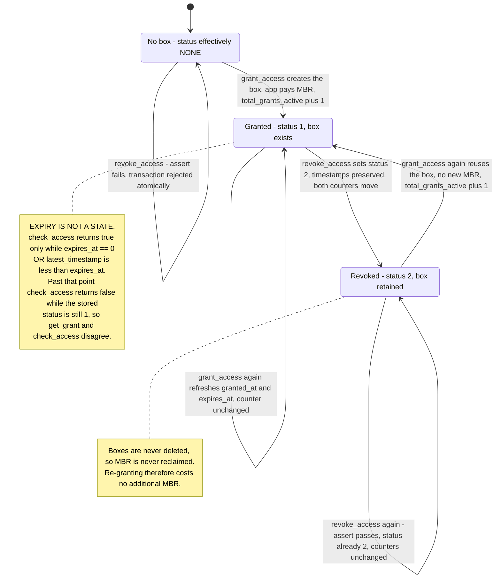
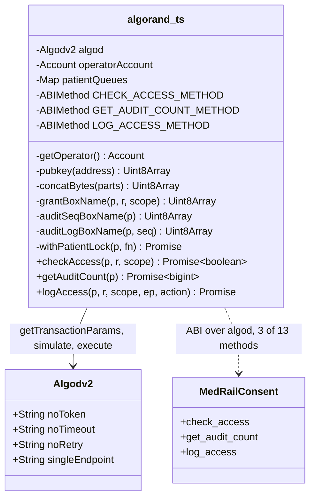
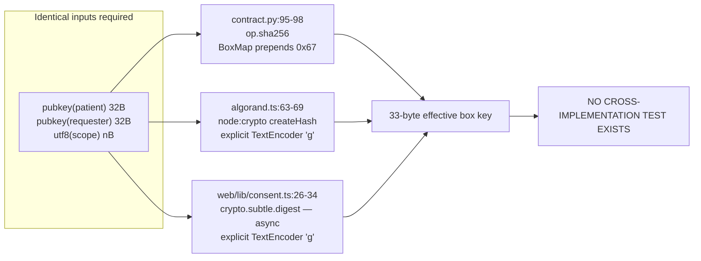
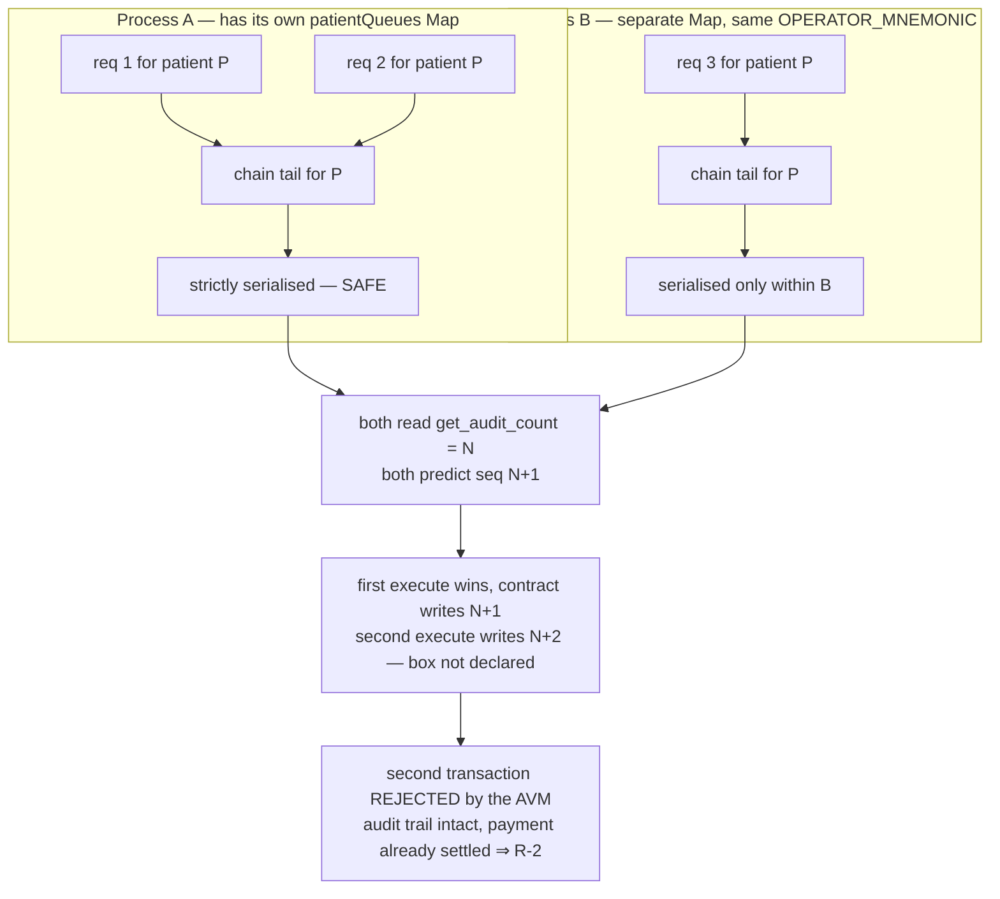
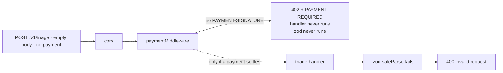
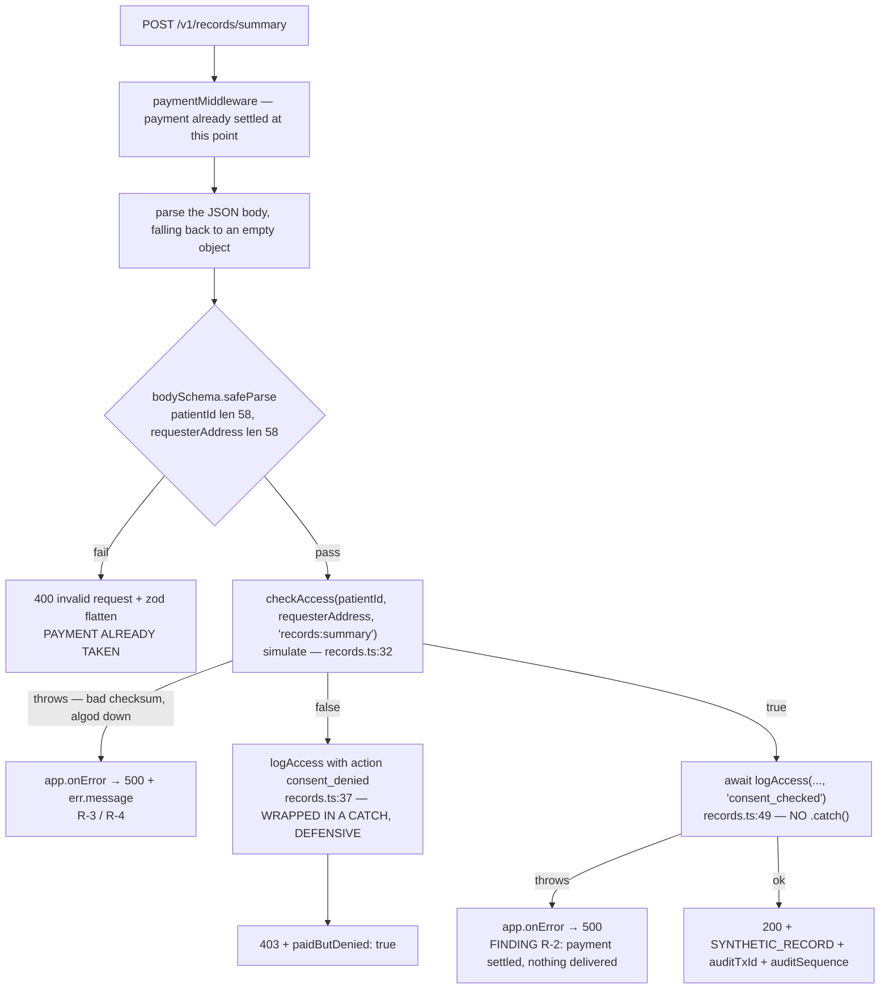

# MedRail — Low-Level Design


> **⚠ Correction notice.** Parts of this document were written against a review finding that was
> later proven wrong. Settlement in x402 v2 happens **only** on a sub-400 response, so **no error
> path in MedRail can consume a settled payment** — and consent-denied calls (HTTP 403) are **not
> charged**, contrary to `API.md`, `SECURITY.md`, and the `paidButDenied` field. The audit-sequence
> race causes a **rejected transaction**, not a corrupted log. See
> [`CORRECTIONS.md`](../CORRECTIONS.md) — it supersedes any statement here that contradicts it.

**Purpose:** specify the internal design of MedRail's business-critical modules at the level of state layout, byte encodings, algorithms, control flow and concurrency semantics.

**Status of this document:** Descriptive of commit `32ffd73` on branch `master`, derived by reading every line of the modules covered. Trivial adapters (`routes/health.ts`, `routes/triage.ts`, `routes/interaction.ts`, `web/lib/api.ts`, `web/lib/config.ts`, presentational components) are covered only where they carry a decision. Status labels per the project fact ledger. Byte-size figures marked *computed* are arithmetic from documented ARC-4 encoding and Algorand MBR rules; where a figure has been confirmed against the deployed application it is marked *verified on-chain*.

Related: [`./HLD.md`](./HLD.md) · [`./System_Architecture.md`](./System_Architecture.md) · [`./Sequence_Diagrams.md`](./Sequence_Diagrams.md) · [`../02_Requirements/SRS.md`](../02_Requirements/SRS.md) · [`../06_Security/Threat_Model.md`](../06_Security/Threat_Model.md) · [`./ADRs/`](./ADRs/)

---

## 1. Module map

| # | Module | Lines | Why it is here |
|---|---|---|---|
| §2 | `contracts/smart_contracts/consent/contract.py` | 259 | The only on-chain program; holds all durable state and all enforceable authorisation. |
| §3 | `api/src/services/algorand.ts` | 179 | Every chain interaction the API performs. Highest-risk module in the repository: zero test coverage, three concurrency and key-derivation hazards. |
| §4 | `api/src/x402.ts` + `api/src/app.ts` | 32 + 85 | The payment gate and the middleware ordering that determines every status code the system emits. |
| §5 | `api/src/routes/records.ts` | 61 | The flagship consent-gated endpoint. Hosts findings S-1 and R-2. Zero test coverage. |
| §6 | `api/src/services/triageScorer.ts`, `interactionChecker.ts` | 73 + 55 | The two priced compute endpoints. Fully covered by 13 unit tests. |
| §7 | `web/lib/consent.ts`, `demoWallet.ts`, `x402Client.ts` | 89 + 52 + 37 | Browser-side signing, and the third independent copy of the box-key derivation. Zero test coverage. |

---

## 2. `MedRailConsent` — contract internals

### 2.1 State layout

**Global state.** ARC-56 schema: `{"global": {"ints": 4, "bytes": 1}, "local": {"ints": 0, "bytes": 0}}` (`contracts/artifacts/MedRailConsent.arc56.json`). No local state exists, which is the whole point of the box design — see §2.3.

| Key | Type | Set by | Meaning |
|---|---|---|---|
| `admin` | `Account` (byteslice) | `create` (`contract.py:121`), `set_admin` (`:127`) | The only account permitted to call `log_access` or `withdraw_excess`. |
| `total_requests` | `UInt64` | `request_access` (`:145`) | Monotonic counter of interest signals. |
| `total_grants_active` | `UInt64` | `grant_access` (`:167`), `revoke_access` (`:192`) | Count of grant boxes whose stored `status == STATUS_GRANTED`. |
| `total_revocations` | `UInt64` | `revoke_access` (`:193`) | Monotonic counter of revocations of previously-active grants. |
| `total_audit_entries` | `UInt64` | `log_access` (`:235`) | Monotonic counter of audit entries. **Live value on app `768743428` is 0.** |

**Semantic caveat on `total_grants_active`.** Nothing decrements this counter on expiry — expiry is evaluated at read time and never written back (§2.4). A grant that has passed `expires_at` still counts toward `total_grants_active` until it is explicitly revoked. The counter therefore means "grant boxes not yet revoked", not "grants currently valid". This is an observation from source, not a listed defect; it matters to anyone reading the counters as a dashboard.

**Box storage.** Three `BoxMap`s, declared at `contract.py:114-116`:

| Field | Declaration | Prefix | Prefix byte | Key body | Value |
|---|---|---|---|---|---|
| `grants` | `BoxMap(Bytes, GrantRecord, key_prefix="g")` | `g` | `0x67` | 32-byte SHA-256 digest | `GrantRecord` |
| `audit_seq` | `BoxMap(Account, UInt64, key_prefix="s")` | `s` | `0x73` | 32-byte patient public key | 8-byte `UInt64` |
| `audit_log` | `BoxMap(Bytes, AuditEntry, key_prefix="a")` | `a` | `0x61` | 40 bytes: patient public key ‖ `itob(seq)` | `AuditEntry` |

Prefixes are confirmed in the compiled spec (`maps.box`, base64 `Zw==`/`cw==`/`YQ==` = `g`/`s`/`a`).

One dead import: `Box` is imported at `contract.py:29` and never used — only `BoxMap` is. Cosmetic.

### 2.2 Exact key-derivation algorithms

Two subroutines produce every box key. They are the single most safety-critical piece of arithmetic in the system, because three independent implementations must agree byte-for-byte (§3.2, NFR-011).

```python
# contract.py:95-98
@subroutine
def grant_key(patient: Account, requester: Account, scope: String) -> Bytes:
    return op.sha256(patient.bytes + requester.bytes + scope.bytes)

# contract.py:101-103
@subroutine
def audit_key(patient: Account, seq: UInt64) -> Bytes:
    return patient.bytes + op.itob(seq)
```

| Key | Formula | Length |
|---|---|---|
| **Effective grant box key** | `0x67 ‖ SHA256( pubkey(patient)[32] ‖ pubkey(requester)[32] ‖ utf8(scope)[n] )` | 1 + 32 = **33 bytes** |
| **Effective audit-seq box key** | `0x73 ‖ pubkey(patient)[32]` | 1 + 32 = **33 bytes** |
| **Effective audit-log box key** | `0x61 ‖ pubkey(patient)[32] ‖ big-endian uint64(seq)[8]` | 1 + 32 + 8 = **41 bytes** |

Three properties follow, and all three matter downstream:

1. **The `key_prefix` is part of the on-chain key.** `grant_key` returns 32 bytes; the `BoxMap` prepends one. The *effective* key is 33 bytes. This one byte is the entire content of defect **C-2** (§2.5).
2. **`scope` is unbounded and hashed, so the key is fixed-length.** A 4-character scope and a 400-character scope produce identical 33-byte keys and identical MBR. DATA-003 **IMPLEMENTED**: scope is a free-form string, not an enumeration, so a new endpoint needs no contract change.
3. **The digest is collision-resistant over the whole triple, but the concatenation is unframed.** `patient.bytes` and `requester.bytes` are both fixed at 32 bytes, so the only variable-length field is the trailing `scope`; no length prefix or separator is needed to make the parse unambiguous. DATA-001 **VALIDATED**. Had any leading field been variable-length, this construction would have been ambiguous.

### 2.3 Struct encodings and byte sizes

All field types below are `arc4.*` ARC-4 types; the namespace is elided in the diagram for legibility.


**`GrantRecord`** (`contract.py:58-63`) is entirely static: `uint8` 1 B + `uint64` 8 B + `uint64` 8 B = **17 bytes**, no head/tail split, no offsets. *Verified on-chain*: the deployed app reports `total-boxes = 2` and `total-box-bytes = 100`; 2 × (33 key + 17 value) = 100.

**`AuditEntry`** (`contract.py:66-73`) mixes static and dynamic fields, so ARC-4 tuple encoding applies:

| Segment | Field | Bytes |
|---|---|---|
| head | `ts` (`uint64`) | 8 |
| head | `requester` (`address`) | 32 |
| head | offset to `scope` | 2 |
| head | offset to `endpoint` | 2 |
| head | offset to `action` | 2 |
| | **head total** | **46** |
| tail | `scope` = 2-byte length + UTF-8 | 2 + len |
| tail | `endpoint` = 2-byte length + UTF-8 | 2 + len |
| tail | `action` = 2-byte length + UTF-8 | 2 + len |

For the exact constants `api/src/routes/records.ts:10-11` uses — `scope = "records:summary"` (15), `endpoint = "/v1/records/summary"` (19) — the encoded value is *computed* as:

| Path | `action` | Tail | Total value |
|---|---|---|---|
| allowed | `"consent_checked"` (15) | 17 + 21 + 17 = 55 | **101 bytes** |
| denied | `"consent_denied"` (14) | 17 + 21 + 16 = 54 | **100 bytes** |

**Events.** `AccessRequested`, `AccessGranted`, `AccessRevoked` (`contract.py:76-93`) are ARC-28 events emitted via `arc4.emit`. They are log-only: no consumer exists in this repository, and nothing reads them back. Their sole defect is C-1 (§2.6).

### 2.4 Consent state machine

There are three stored status codes and **no stored expiry state**: `STATUS_NONE = 0`, `STATUS_GRANTED = 1`, `STATUS_REVOKED = 2` (`contract.py:46-48`). Expiry is a *read-time predicate* evaluated by `check_access`, never written back.



**Why the box is reused rather than deleted.** Re-granting after a revocation must restore the active-grant counter exactly once. `grant_access` handles this by keying the counter off the prior *status*, not prior *existence* (`contract.py:156-167`):

```python
was_active_before = False
if self.grants.maybe(key)[1]:
    was_active_before = self.grants.maybe(key)[0].status == arc4.UInt8(STATUS_GRANTED)
...
if not was_active_before:
    self.total_grants_active.value += 1
```

The in-code comment at `contract.py:156-158` states the reasoning explicitly: "a box can exist while inactive (previously revoked), so 'does the box exist' is not the same question as 'is it already counted as active'". This is correct and deliberate. FR-022 **VALIDATED** by `test_consent.py::test_regrant_after_revoke_reactivates`.

**Read-time expiry semantics** (`contract.py:197-209`): `check_access` returns true iff the box exists **and** `status == STATUS_GRANTED` **and** (`expires_at == 0` **or** `Global.latest_timestamp < expires_at`). `duration_seconds == 0` at grant time stores `expires_at = 0`, meaning never expires (`contract.py:152`). FR-019 and FR-023 **VALIDATED**, including via `patch_global_fields(latest_timestamp=…)` in the simulator.

A consequence worth stating: `get_grant` and `check_access` can disagree. For an expired grant, `get_grant` returns `status = 1` while `check_access` returns `false`. Any consumer that reads `get_grant` and infers validity from `status` alone is wrong. The API never does this — it only calls `check_access` (`api/src/services/algorand.ts:82`).

### 2.5 MBR economics, and defect C-2

Algorand's box minimum-balance formula is `2500 + 400 × (len(key) + len(value))` µALGO, where `len(key)` is the **effective** key including any `BoxMap` prefix.

```python
# contract.py:52
GRANT_BOX_MBR = 2_500 + 400 * (32 + 17)      # = 22_100
```

**DEFECT C-2 — the constant under-reports the true cost by 400 µALGO per box.** `grant_key` returns 32 bytes, but the `BoxMap(key_prefix="g")` prepends one byte, so the effective key is 33. The correct expression is `2_500 + 400 * (33 + 17)` = **22,500**.

*Verified on-chain* against app `768743428`:

| Reported by the network | Value | Reconciliation |
|---|---|---|
| app account `min-balance` | 145,000 µALGO | 100,000 base account MBR + 2 × 22,500 = 145,000 ✓ |
| `total-boxes` | 2 | both `g`-prefixed grant boxes |
| `total-box-bytes` | 100 | 2 × (33 + 17) = 100 ✓ — the ledger itself counts the key as 33 bytes |

`total-box-bytes = 100` is the cleanest single piece of evidence: with a 32-byte key it would be 98. The constant is wrong, it is exposed as a public ABI method advertised in its own docstring as "a compile-time constant the backend can quote when sizing `fund_mbr` calls" (`contract.py:250-251`), and a backend that trusts it under-funds by 400 µALGO per grant — about 1.8%. Severity LOW by magnitude; the fix is `400 * (33 + 17)`. FR-032 **IMPLEMENTED (incorrect value)**; REL-006 **PARTIALLY IMPLEMENTED**.

**Audit-box MBR is deliberately not hard-coded**, and the comment at `contract.py:53-55` explains why: `AuditEntry` is variable-length because of the three ARC-4 dynamic strings, so a single constant would be meaningless. That is correct engineering, not an omission.

*Computed* audit costs, using the §2.3 encodings. **None of these has ever been incurred — no `s`- or `a`-prefixed box exists on the deployed application (E-1):**

| Box | Effective key | Value | MBR (µALGO) |
|---|---|---|---|
| `audit_seq` (one per patient, created once) | 33 | 8 | `2500 + 400×41` = **18,900** |
| `audit_log` allowed entry | 41 | 101 | `2500 + 400×142` = **59,300** |
| `audit_log` denied entry | 41 | 100 | `2500 + 400×141` = **58,900** |

The first audit write for a previously-unseen patient therefore locks **78,200 µALGO** (sequence box plus first log box); each subsequent allowed write locks 59,300. The app account holds 5,000,000 µALGO against a current min-balance of 145,000, i.e. 4,855,000 µALGO of headroom (`contracts/artifacts/deploy_testnet.json`, funding tx `KYH3H5CG2CCUPUUTJIBX47WD4RWSUV3QWTEUJQRQFYLWO5YAO3QA`). Nothing monitors that headroom and nothing alerts on it: OPS-005 **NOT IMPLEMENTED**. When it is exhausted, the failure surfaces as `logAccess` throwing — which on the allowed path is finding R-2 (§5.2).

**Boxes are never deleted.** No method calls a delete; revocation rewrites the record in place (`contract.py:186-190`). MBR is therefore monotonically non-decreasing for the life of the application. `withdraw_excess` (`contract.py:254-259`) is the only outflow, is admin-gated, and uses an inner `itxn.Payment(fee=0)`. Its success path is **untested** — `test_consent.py::test_withdraw_excess_admin_only` covers only the rejection. FR-031 **PARTIALLY IMPLEMENTED**.

### 2.6 Method-by-method walkthrough

All 13 ABI methods, in declaration order, with their authorisation check and state effect.

| # | Method | `readonly` | Authorisation check | State written | Notes |
|---|---|---|---|---|---|
| 1 | `create()` | no | `@arc4.abimethod(create="require")` — can only run at creation | `admin = Txn.sender` (`:121`) | The deployer becomes admin. No separate bootstrap step. |
| 2 | `set_admin(address)` | no | `assert Txn.sender == self.admin.value` (`:126`) | `admin` | Key rotation without redeployment. FR-029 **VALIDATED**. No two-step handover: a typo in `new_admin` permanently bricks admin authority. |
| 3 | `fund_mbr(pay)` | no | **None on the sender.** Asserts only `payment.receiver == Global.current_application_address` (`:138`) | none | Anyone may top up. Deliberate — the app owns its boxes, so anyone paying its MBR is harmless. FR-030 **IMPLEMENTED**, and **untested**. |
| 4 | `request_access(address patient, string scope)` | no | None | `total_requests += 1` (`:145`) | Persists nothing else — deliberate, and the docstring says so (`:142-144`): grant is the first thing that costs MBR. **Hosts defect C-1**, below. |
| 5 | `grant_access(address requester, string scope, uint64 duration)` | no | **Implicit and strong**: the patient is `Txn.sender` (`:151`); no patient argument exists, so impersonation is impossible at this layer | grant box; `total_grants_active` | SEC-003 **VALIDATED**. Live: `X2BQ5FD4MW52B75WQGDB67TEULYLN7FHVFO6ZOBNI74PNCAKVOUA`. |
| 6 | `revoke_access(address requester, string scope)` | no | Same — patient is `Txn.sender` (`:181`). Plus `assert self.grants.maybe(key)[1], "no such grant"` (`:182`) | grant box; both counters | Atomic failure on a non-existent grant. FR-021 **VALIDATED**. Live: `OV2J2T5VWMIQG64JYGL7JEGZKKNZNKCMNIQU6AC4PDRQYZ6ZOO5A`. |
| 7 | `check_access(patient, requester, scope) -> bool` | **yes** | None — public read | none | The predicate the whole API depends on. Called via `simulate` (§3.3). |
| 8 | `get_grant(patient, requester, scope) -> GrantRecord` | **yes** | None; asserts the box exists (`:214`) | none | Returns stored status — see the expiry caveat in §2.4. Unused by the API. |
| 9 | `log_access(patient, requester, scope, endpoint, action) -> uint64` | no | `assert Txn.sender == self.admin.value` (`:222`) | `audit_seq[patient]`, `audit_log[key]`, `total_audit_entries` | SEC-001 **VALIDATED** by `test_log_access_rejects_non_admin`. FR-025 **UNVALIDATED on-chain** — never executed on TestNet (E-1). |
| 10 | `get_audit_count(patient) -> uint64` | **yes** | None | none | `self.audit_seq.get(patient, default=UInt64(0))` — returns 0 for an unknown patient rather than asserting. |
| 11 | `get_audit_entry(patient, seq) -> AuditEntry` | **yes** | None; asserts the entry exists (`:245`) | none | FR-028 **VALIDATED** in simulator. |
| 12 | `get_grant_box_mbr() -> uint64` | **yes** | None | none | Returns the defective constant — C-2. |
| 13 | `withdraw_excess(uint64 amount)` | no | `assert Txn.sender == self.admin.value` (`:258`) | none directly; inner payment | `itxn.Payment(receiver=admin, amount, fee=0)`. **No lower-bound check** — the AVM will reject a withdrawal that breaches min-balance, so the safety comes from the protocol, not the contract. |

**Sequence allocation inside `log_access`** (`contract.py:224-236`):

```python
seq, existed = self.audit_seq.maybe(patient)
next_seq = UInt64(1) if not existed else seq + 1
self.audit_seq[patient] = next_seq
self.audit_log[audit_key(patient, next_seq)] = AuditEntry(...)
```

The sequence is allocated **on-chain from on-chain state**, not from a client-supplied value. That single fact is what protects the ledger from the client-side prediction race analysed in §3.6: a stale prediction cannot corrupt the audit trail, it can only cause the transaction to fail. Sequences are per-patient and independent — FR-027 **VALIDATED** by `test_audit_log_sequence_increments_per_patient`.

#### DEFECT C-1 — `request_access` emits its event with the parties swapped

```python
# contract.py:146
arc4.emit(AccessRequested(arc4.Address(Txn.sender), arc4.Address(patient), arc4.String(scope)))
```

`AccessRequested` is declared `patient: arc4.Address, requester: arc4.Address` (`contract.py:76-79`). Positional construction therefore binds `Txn.sender` to the `patient` field — but `Txn.sender` is the *requester*, per the method's own docstring at `contract.py:142-144` ("Requester signals interest in a scope"). The `patient` argument lands in the `requester` field.

Consequence: on-chain state is untouched and correct; the ARC-28 event feed is inverted. Any indexer, subscriber or analytics consumer built against these events attributes every request to the wrong party. Compare the two sibling emits, which are both correct because in those methods `Txn.sender` genuinely *is* the patient: `contract.py:169-176` and `contract.py:195`.

Why it survived: `test_consent.py::test_request_access_emits_event_and_counts` asserts `total_requests == 1` and never inspects the event payload. Fix: swap the first two arguments. Severity MEDIUM. FR-024 **PARTIALLY IMPLEMENTED**.

---

## 3. `api/src/services/algorand.ts` — the chain gateway

179 lines, **zero test coverage**, and the only module in the API that can spend money or write to the ledger.



### 3.1 Hand-constructed `ABIMethod` literals

Three method descriptors are declared as object literals rather than parsed from the committed ARC-56 spec (`api/src/services/algorand.ts:20-46`). The rationale is recorded in-code at `:16-19`: constructing them "directly from the contract's known ARC-4 signatures … rather than parsed via `ABIContract`, so this has no dependency on how a given algosdk version handles ARC-56 vs. ARC-4 app-spec parsing."

| | Hand-declared literals (chosen) | Parse `MedRailConsent.arc56.json` at boot |
|---|---|---|
| Coupling to algosdk's ARC-56 support | none | tracks algosdk minor versions |
| Coupling to the compiled artefact | none — the API needs no artefact file at runtime for ABI purposes | the file must ship in the image |
| Drift risk | **a signature change in the contract compiles cleanly on both sides and fails only at call time** | drift impossible by construction |
| Startup failure mode | none | missing/corrupt file kills the process |

The trade-off is deliberate and defensible; the residual risk is that this is a **fourth** hand-maintained copy of the contract interface, alongside the Python source, the ARC-56 artefact and `web/lib/consent.ts:7-24`. No test asserts that any of them agree. Note that only three of the thirteen ABI methods are declared here — the API never calls `grant_access`, `revoke_access`, `get_grant`, `get_audit_entry`, `fund_mbr`, `set_admin`, `withdraw_excess` or `get_grant_box_mbr`. The backend's on-chain authority surface is deliberately narrow: two reads and one admin write.

### 3.2 The three box-name builders

```ts
// api/src/services/algorand.ts:63-79
function grantBoxName(patient, requester, scope) {
  const prefix = new TextEncoder().encode("g");
  const inner = concatBytes(pubkey(patient), pubkey(requester), new TextEncoder().encode(scope));
  const digest = createHash("sha256").update(inner).digest();
  return concatBytes(prefix, new Uint8Array(digest));
}
function auditSeqBoxName(patient)      { return concatBytes(enc("s"), pubkey(patient)); }
function auditLogBoxName(patient, seq) { return concatBytes(enc("a"), pubkey(patient), algosdk.encodeUint64(seq)); }
```

These reproduce §2.2 exactly: `pubkey()` is `algosdk.decodeAddress(address).publicKey` (`:48-50`), `createHash("sha256")` matches `op.sha256`, and `algosdk.encodeUint64` matches `op.itob` (both big-endian, 8 bytes).

**NFR-011 — UNVALIDATED.** The same derivation now exists three times, in three languages, with three different primitives:



A change to the prefix, to the concatenation order, or to the hash input silently breaks the other two — and the failure is not a compile error or a clear exception. It is a box reference for a key that does not exist, which reads as "no grant" and writes to the wrong slot. Severity MEDIUM. The cheapest fix is a single shared test vector: one fixed `(patient, requester, scope)` triple whose expected 33-byte key is asserted in all three test suites. **RECOMMENDED**, not present.

A related latent hazard: `scope` is UTF-8 encoded in all three places with no normalisation. Two visually identical scopes differing in Unicode normal form produce different keys. Not a live problem — the only scope in use is the ASCII constant `"records:summary"` (`api/src/routes/records.ts:10`, `web/components/ConsentChecker.tsx:9`).

### 3.3 The `simulate()` read path

```ts
// api/src/services/algorand.ts:82-100
export async function checkAccess(patient, requester, scope): Promise<boolean> {
  const appId = requireConsentAppId();
  const operator = getOperator();
  const suggestedParams = await algod.getTransactionParams().do();
  const atc = new algosdk.AtomicTransactionComposer();
  atc.addMethodCall({ appID: appId, method: CHECK_ACCESS_METHOD,
    methodArgs: [patient, requester, scope],
    sender: operator.addr, signer: algosdk.makeBasicAccountTransactionSigner(operator),
    suggestedParams, boxes: [{ appIndex: 0, name: grantBoxName(patient, requester, scope) }] });
  const result = await atc.simulate(algod);
  return result.methodResults[0]?.returnValue === true;
}
```

Properties:

- **Nothing is submitted.** `simulate` is evaluated by the node and discarded. No fee, no round consumed, no state change. SEC-009 **IMPLEMENTED**.
- **Two sequential outbound calls per invocation**: `getTransactionParams` then `simulate`. The reviewer's single cold observation of `GET /v1/consent/status` was **505 ms**; this is one sample on a developer laptop, not a percentile.
- **`boxes: [{ appIndex: 0, ... }]`** — `appIndex: 0` denotes the application being called. Referencing a non-existent box is legal; `check_access` handles absence itself (`contract.py:201-202`).
- **Fail-closed on an ambiguous result.** The strict `=== true` comparison means an `undefined` return value (a failed or malformed simulation) yields `false`, i.e. denied. Denial is the safe direction. A simulation that *throws* propagates instead, and becomes a 500 via `app.onError`.
- **Input-validation failures cost a network round trip.** For a 58-character but checksum-invalid address, the throw originates in `pubkey` → `algosdk.decodeAddress` (`:49`) evaluated while building the `boxes` argument — which happens *after* `await algod.getTransactionParams().do()` has already completed. Finding **R-3**: the client sees `500 {"error":"wrong checksum for address"}` (SEC-010 and SEC-011 both **NOT IMPLEMENTED**), and an unauthenticated caller can force an outbound AlgoNode call with a guaranteed-invalid address. Combined with the absence of rate limiting (SEC-013), `GET /v1/consent/status` is a free traffic amplifier: one inbound request, two outbound calls, zero cost to the caller.

`getAuditCount` (`:103-121`) is structurally identical, differing only in the method, the single argument and the `s`-prefixed box reference.

### 3.4 The hidden `OPERATOR_MNEMONIC` dependency

```ts
// api/src/services/algorand.ts:7-14
let operatorAccount: algosdk.Account | undefined;
function getOperator(): algosdk.Account {
  if (!config.operatorMnemonic) throw new Error("OPERATOR_MNEMONIC is not set — see docs/DEPLOYMENT.md");
  operatorAccount ??= algosdk.mnemonicToSecretKey(config.operatorMnemonic);
  return operatorAccount;
}
```

`simulate` still requires a sender and a signer, so **both read functions call `getOperator()`** (`:84`, `:105`). The consequence is a dependency that is invisible from the route:

> `GET /v1/consent/status` is free, unauthenticated, read-only, submits nothing — and cannot serve a single request unless the contract admin's private key is loaded into the process.

The mnemonic is derived once and memoised for the process lifetime. Two further observations:

- The account object holds the raw secret key in memory for the process lifetime. There is no zeroisation, no scoping and no KMS. SEC-012 **NOT IMPLEMENTED** — this one key can forge audit entries, rotate `admin` to lock out the real owner, and drain the app account via `withdraw_excess`.
- `requireConsentAppId()` (`api/src/config.ts:61-69`) throws with an actionable message when `consentAppId` is 0. In a container this is the D-1 failure: `contracts/artifacts/deploy_testnet.json` is not copied into the image (`api/Dockerfile:18-20`), so the `readDeployedAppId()` fallback (`api/src/config.ts:31-40`) cannot fire, and `api/fly.toml` sets no `CONSENT_APP_ID`. Both consent-touching endpoints return 500.

### 3.5 `logAccess` — read-then-write sequence prediction

```ts
// api/src/services/algorand.ts:146-179 (body, inside withPatientLock)
const suggestedParams = await algod.getTransactionParams().do();
const currentCount = await getAuditCount(patient);      // itself: getTransactionParams + simulate
const predictedSeq = currentCount + 1n;
atc.addMethodCall({ ..., boxes: [
  { appIndex: 0, name: auditSeqBoxName(patient) },
  { appIndex: 0, name: auditLogBoxName(patient, predictedSeq) },
]});
const result = await atc.execute(algod, 4);
const sequence = (result.methodResults[0]?.returnValue as bigint) ?? predictedSeq;
return { txId: result.txIDs[0], sequence };
```

**Why the prediction exists at all — and what it is not.** It is **not** a sequencing scheme, and nothing on-chain trusts it. `log_access` reads its own `audit_seq` box and computes `next_seq = 1 if not existed else seq + 1` itself (`contract.py:224-226`), then writes both boxes; a caller-supplied sequence is never accepted as an argument, because the method has no such parameter. The client-side `predictedSeq` (`algorand.ts:158-159`) exists solely to populate the **box-reference array** at `algorand.ts:169-172`: the AVM requires every box a transaction touches to be declared up front, and the box the contract is about to write is `a ‖ patient ‖ itob(next_seq)`, so the caller must name it in advance. Reading the current count and adding one is the only way to do that. This is an AVM resource-declaration requirement, not a design smell — and it is why a lost race rejects a transaction rather than corrupting a log (§3.6).

**Cost.** The block above performs four sequential outbound calls before the transaction is even submitted: `getTransactionParams`, then `getAuditCount`'s own `getTransactionParams` and `simulate`, then `execute` which polls for confirmation over up to four rounds. The redundant second `getTransactionParams` is avoidable — `getAuditCount` fetches its own rather than accepting the caller's. Minor, but it is a network round-trip on the money path.

**Failure semantics.** `atc.execute(algod, 4)` waits four rounds and then throws (`api/src/services/algorand.ts:175`). On Algorand that is roughly fourteen seconds. There is no retry and no timeout on the underlying `Algodv2` (`:5`). REL-003 **NOT IMPLEMENTED** (finding R-4).

**The return-value fallback is a lie detector that never fires.** `?? predictedSeq` substitutes the prediction if the ABI return is missing. If those two ever disagreed, the API would report a sequence number that does not match the ledger. In practice `execute` throws before returning a mismatched result, so the fallback is defensive rather than load-bearing.

### 3.6 `withPatientLock` — precise semantics

```ts
// api/src/services/algorand.ts:123-138 — the explanatory comment at :123-128 plus the queue itself
const patientQueues = new Map<string, Promise<unknown>>();
function withPatientLock<T>(patient: string, fn: () => Promise<T>): Promise<T> {
  const prior = patientQueues.get(patient) ?? Promise.resolve();
  const next = prior.then(fn, fn);
  patientQueues.set(patient, next.catch(() => undefined));
  return next;
}
```

Line by line:

| Line | Mechanism |
|---|---|
| `const prior = patientQueues.get(patient) ?? Promise.resolve()` | The map value is the *tail* of this patient's chain. A first call for a patient starts from an already-resolved promise, so it runs on the next microtask tick. |
| `const next = prior.then(fn, fn)` | `fn` is registered as **both** the fulfilment and the rejection handler. This is the load-bearing trick: it guarantees `fn` runs whether or not the previous task succeeded. With only the first handler, one rejection would poison the chain and every later call for that patient would reject without ever executing. Latent footgun: as a rejection handler, `fn` receives the prior error as its first argument — harmless only because `fn` is declared `() => Promise<T>` and ignores it. |
| `patientQueues.set(patient, next.catch(() => undefined))` | The *stored* tail is a derived promise that can never reject, so no unhandled-rejection warning is raised and the chain always advances. |
| `return next` | The caller receives the **un-swallowed** promise, so the caller still sees the real error. The swallow applies only to the stored tail. |

**What it guarantees:** for a fixed `patient` string, within one Node process, the bodies of `fn` are entered in call order and never overlap. Different patients proceed concurrently — the granularity is exactly right.

**What it does not guarantee:**

1. **Nothing across processes.** Each process has its own `patientQueues`. `api/fly.toml:17-19` sets `auto_stop_machines = false`, `auto_start_machines = true`, `min_machines_running = 1` — a floor, not a ceiling. Two machines sharing the one `OPERATOR_MNEMONIC` restore the race in full. REL-004 **PARTIALLY IMPLEMENTED**; defect **D-7**. `docs/SECURITY.md` names this limitation honestly; `api/fly.toml` contradicts the assumption it rests on.
2. **It is not a lock over the ledger, and the ledger does not need one.** Reading `contract.py:224-236` alongside `algorand.ts:158-159` clarifies what a lost race actually does. `log_access` recomputes `next_seq` from on-chain state, so a stale client prediction **cannot** corrupt or overwrite the audit trail. What it can do is produce a transaction whose box-reference array names `a ‖ patient ‖ N+1` while the contract writes `a ‖ patient ‖ N+2` — an undeclared box — and the transaction is rejected by the AVM. So the concurrency hazard is a **failed transaction, not a corrupted log**. On the denied path that is swallowed (`records.ts:37`); on the allowed path it is finding **R-2**: HTTP 500 after a settled payment.
3. **The map is never pruned.** One entry accumulates per distinct patient address for the process lifetime, and entries are never deleted. Growth is gated by payment — each new address costs an attacker $0.05 — so this is a slow, paid-for leak rather than a free one, but it is unbounded in principle.
4. **`checkAccess` is not serialised**, correctly: it submits nothing and has no ordering requirement.



---

## 4. `api/src/x402.ts` + `api/src/app.ts` — payment gate and middleware wiring

### 4.1 Composition

```ts
// api/src/x402.ts:6-14
const facilitatorClient = new HTTPFacilitatorClient({ url: config.facilitatorUrl });
export const resourceServer = new x402ResourceServer(facilitatorClient).register(
  config.networkCaip2,
  new ExactAvmScheme(),
);
```

Three objects, one wiring statement:

| Object | Package | Responsibility |
|---|---|---|
| `HTTPFacilitatorClient` | `@x402/core/server` | HTTP transport to `config.facilitatorUrl`; fetches `/supported`, submits verify and settle. |
| `x402ResourceServer` | `@x402/hono` | Builds the 402 challenge, matches presented payments to requirements, orchestrates verify/settle. |
| `ExactAvmScheme` | `@x402/avm/exact/server` | The AVM `exact` scheme — how an Algorand payment is expressed and checked. |

`.register(config.networkCaip2, …)` binds **exactly one** CAIP-2 network. The comment at `api/src/x402.ts:8-10` records the intent: a TestNet-configured process does not accidentally accept a MainNet-signed payment or the reverse. NFR-002 **IMPLEMENTED**. This is a structural control, not a runtime check — an unregistered network has no scheme handler, so the payment cannot be interpreted at all.

### 4.2 `priced()` and why no `asset` is set

```ts
// api/src/x402.ts:16-32
export function priced(usd: string, description: string) {
  // No explicit `asset` field: both GoPlausible's TS and Python reference examples
  // omit it and let the scheme's default money parser resolve the network's
  // canonical stablecoin (USDC) from the "$x.xx" price string.
  return { accepts: [{ scheme: "exact" as const, price: usd, network: config.networkCaip2, payTo: config.payToAddress }],
           description, mimeType: "application/json" };
}
```

The rationale is recorded in-code. The price is a human string; the SDK's money parser resolves it to the network's canonical USDC ASA and to base units at 6 decimals. `"$0.02"` becomes `amount: "20000"`, `"$0.05"` becomes `"50000"` — both asserted from the live 402 by `api/test/x402-flow.spec.ts:24` and `:45`.

Two consequences follow from the omission, and they pull in opposite directions:

- **Benefit:** MedRail's config cannot desynchronise from the facilitator's asset list, and switching networks changes one environment variable. NFR-012 **IMPLEMENTED**.
- **Cost:** `accepts[].asset` and `extra.feePayer` in the emitted 402 come from the facilitator's `/supported`, not from MedRail. The challenge therefore **cannot be constructed offline** — the root cause of finding **R-1**. Reproduced by the reviewer: with `FACILITATOR_URL` pointed at a closed port, `x402ResourceServer.initialize()` fails with "no supported payment kinds loaded from any facilitator", and the caller receives **HTTP 500 with no `PAYMENT-REQUIRED` header, no 503, no `Retry-After`**. Free routes still return 200 — REL-005 **VALIDATED**, blast radius confined to the three priced routes. There is no timeout, retry, circuit breaker, or cached-`/supported` fallback. REL-001 **NOT IMPLEMENTED**. The same coupling is the mechanism behind CI-2: `api/test/x402-flow.spec.ts` makes a live call to `facilitator.goplausible.xyz`, so a third-party outage turns into a red build with a misleading failure.

`payTo` is `config.payToAddress`, which defaults to `PAY_TO_ADDRESS ?? OPERATOR_ADDRESS ?? ""` (`api/src/config.ts:53`). If both are unset it is the empty string and no validation catches it — the 402 would advertise an empty payee. **RECOMMENDED**: fail fast at boot if `payToAddress` is not a valid address.

### 4.3 Route-to-price mapping

One object literal holds all pricing (`api/src/app.ts:37-50`), with the comment at `:35-36` recording the intent: pricing is in one place so a judge or an integrator can audit it at a glance.

| Route key | Price string | Base units | Description advertised in the 402 |
|---|---|---|---|
| `POST /v1/triage` | `$0.02` | 20000 | "Rule-based clinical red-flag triage score. Not medical advice." |
| `POST /v1/interaction-check` | `$0.02` | 20000 | "Check a medication list against known severe interaction pairs." |
| `POST /v1/records/summary` | `$0.05` | 50000 | "Consent-gated synthetic patient record summary — requires an active on-chain grant." |

All three settle to one `payTo` address, which is what makes the **Composite** entry classification apply (per `docs/COMPLIANCE.md`; competition rules not independently re-verified in this review). The descriptions are not decoration — they are the human-readable `resource.description` in the 402 payload, verified in the live capture.

### 4.4 Middleware ordering, and why an unpaid malformed request returns 402

Registration order in `api/src/app.ts`:

```
:20  app.use("*", cors({...}))
:37  app.use("*", paymentMiddleware({...3 routes...}, resourceServer))
:52  app.route("/", healthRoute)      // …and four more route modules
:58  app.onError(...)
:63  app.get("/v1/consent/arc56", ...)
:71  app.get("/", ...)
```

Both middlewares are mounted on `"*"`, so both run for every request; the payment middleware enforces only on the three configured keys and passes everything else through untouched. Because it is registered **before** the route modules, the gate closes before any handler — and therefore before any zod parse — executes.



`api/test/x402-flow.spec.ts:48-59` documents this deliberately. Its comment states: "Payment is enforced by middleware ahead of the handler, so an unpaid malformed request still surfaces as 402 — validation happens only after a real payment is presented. This test documents that ordering rather than assuming it." The assertion is `expect([400, 402]).toContain(res.status)` — accepting either, so the test records the ordering without freezing an incidental outcome. Under the current stack the observed status is 402.

This ordering is defensible for a paid API (do not do free work for an unpaid caller) and it has one uncomfortable corollary worth stating: **a caller can be charged before their input is known to be well-formed.** With a settled payment and a malformed body, the caller pays and receives a 400. No refund path exists. Not currently listed as a finding; recorded here because it is the same class of problem as R-2.

### 4.5 CORS

```ts
// api/src/app.ts:20-33
app.use("*", cors({
  origin: "*",
  allowMethods: ["GET", "POST", "OPTIONS"],
  // No fixed allowHeaders list: Hono reflects whatever the browser's own
  // preflight actually requests … a hand-maintained allowlist here previously
  // drifted out of sync with what @x402/fetch's browser client actually sends
  // and broke every paid call from the frontend with a CORS preflight failure.
  exposeHeaders: ["PAYMENT-REQUIRED", "PAYMENT-RESPONSE"],
}));
```

The comment at `api/src/app.ts:25-30` is a **regression note attached to its fix**: the failure described actually happened. Omitting `allowHeaders` makes Hono echo `Access-Control-Request-Headers`, so the preflight always matches whatever the payment client sends, including SDK header changes across versions. `exposeHeaders` is required because both payment headers are custom and would otherwise be unreadable from browser JavaScript.

`origin: "*"` is correct for an API whose authorisation is a bearer-free payment header: there are no cookies, no ambient credentials and no session, so there is nothing for a cross-origin request to escalate. NFR-006 **IMPLEMENTED**. The cost is that no origin allowlist exists to lean on later, and SEC-013 (rate limiting) is absent — so the API is fully open to any page on the internet.

---

## 5. `api/src/routes/records.ts` — the consent-gated endpoint

61 lines. **Zero test coverage** (FR-010, FR-011, FR-012 all **UNVALIDATED**), never executed successfully against the live contract (E-1), and the location of both S-1 and R-2.

### 5.1 Control flow



### 5.2 Finding R-2 — the asymmetric error handling

```ts
// records.ts:37  — denied path
await logAccess(patientId, requesterAddress, SCOPE, ENDPOINT, "consent_denied").catch(() => undefined);

// records.ts:49  — allowed path
const logResult = await logAccess(patientId, requesterAddress, SCOPE, ENDPOINT, "consent_checked");
```

The rejection path was hardened; the success path was not. Both call the same function against the same infrastructure with the same failure modes: operator account out of ALGO, app account out of box MBR, algod 5xx, validity-window expiry, a lost cross-process race (§3.6). On the denied path the failure is swallowed and the caller still gets a coherent 403. On the allowed path it propagates to `app.onError` (`api/src/app.ts:58-61`) and the caller receives **HTTP 500 after paying $0.05** — with no resource, no refund, no retry token, no idempotency key, and no off-chain record that the payment ever happened.

Note the perverse incentive this creates: the *cheaper* outcome for the operator is the denial, and the denial is the better-engineered path. REL-002 **NOT IMPLEMENTED**.

The minimum fix is one line — mirror the denied path's `.catch()` and degrade `auditTxId` to `null` — which trades an unrecoverable 500 for a delivered resource with a missing audit entry. Whether that trade is acceptable is a product decision this repository has not recorded. The stronger fix is a durable outbox, which the "no database" architecture does not currently permit (see [`./HLD.md`](./HLD.md) §5).

### 5.3 Finding S-1 — the consent gate is not an access control

```ts
// records.ts:5-8
const bodySchema = z.object({
  patientId: z.string().length(58),
  requesterAddress: z.string().length(58),   // caller-asserted, never authenticated
});
// records.ts:32
const allowed = await checkAccess(patientId, requesterAddress, SCOPE);
```

**Nothing binds `requesterAddress` to the identity that paid.** The x402 middleware proves *a* payment settled; it does not surface the payer to the handler, and the handler never asks. The contract answers the question it is given — "did P grant R scope S?" — correctly and honestly. The API chooses R.

**Exploit.** Grants are public: `grant_access` carries the patient as `sender` and the requester address as ABI argument 0, both readable from any indexer against app `768743428`. An attacker enumerates real `(patient, requester)` pairs from the application's own transaction history, pays the ordinary $0.05, and posts `{patientId: <victim>, requesterAddress: <genuinely authorised third party>}`. `check_access` returns true — because that grant genuinely exists — and the API returns the record. **Any paying stranger can impersonate any authorised requester.**

**Second-order effect, and the worse half.** `logAccess` at `records.ts:49` writes the *claimed* requester into the per-patient audit log. A successful impersonation therefore writes a **false attribution** into an immutable record that is trusted precisely because it is on-chain. SEC-008 **NOT IMPLEMENTED**.

**Why it is invisible in this build.** Two reasons, both accidental rather than defensive: the response is a fixed synthetic constant (`records.ts:15-21`) so nothing sensitive leaks today (DATA-004 **IMPLEMENTED**); and `web/components/LiveDemoPanel.tsx:38` sends `requesterAddress: wallet.address`, so in the demo the payer and the requester coincide and the flaw never manifests.

**Fix — small and available.** `@x402/core/http` exports `decodePaymentSignatureHeader`, and `@x402/avm` exports `getSenderFromTransaction`; both are present in the installed SDK. Decode the `PAYMENT-SIGNATURE` header in the handler, recover the payer from the signed payment transaction, and reject with 403 unless `payer === requesterAddress`. Alternatively use `x402HTTPResourceServer`'s `ProtectedRequestHook` (`.onProtectedRequest(...)`, exported from `@x402/hono`) to stash the verified payer on the Hono context. Roughly 10–15 lines plus a test. FR-039, SEC-007 **NOT IMPLEMENTED**; SEC-006 **PARTIALLY IMPLEMENTED — DEFEATED**.

The same self-assertion applies to `patientId`, but that field only selects *which* grant is checked, so it is not independently exploitable.

### 5.4 The synthetic record

`SYNTHETIC_RECORD` (`records.ts:15-21`) is one fixed constant — `bloodType "O+"`, allergies `["penicillin"]`, chronic `["type 2 diabetes (controlled)"]`, medications `["metformin 500mg", "lisinopril 10mg"]`, `lastUpdated "2026-01-15"` — returned **regardless of `patientId`**. There is no patient datastore of any kind. The comment at `records.ts:13-14` says so, and `docs/SECURITY.md` discloses it. Keeping that disclosure is the correct posture; the response also carries an explicit disclaimer field (`records.ts:59`).

**AI-007 is structurally guaranteed here.** The only strings that reach `log_access` are the module constants `SCOPE` and `ENDPOINT` (`records.ts:10-11`) plus the literal `"consent_checked"` / `"consent_denied"`. No request-derived free text is on any path to the ledger.

---

## 6. The deterministic intelligence layer

No model, no embeddings, no inference call, no training data, no vendor. Two pure functions over static tables. NFR-009, AI-001 **VALIDATED**.

### 6.1 `triageScorer.ts`

```ts
// api/src/services/triageScorer.ts:53-73
export function scoreTriage(symptomText: string): TriageResult {
  const normalized = symptomText.toLowerCase();
  const matched: string[] = [];
  let score = 0;
  for (const flag of RED_FLAGS) {
    if (flag.keywords.some((kw) => normalized.includes(kw))) { matched.push(flag.label); score += flag.weight; }
  }
  score = Math.min(100, score);
  return { score, band: bandFor(score), matchedFlags: matched, disclaimer: DISCLAIMER };
}
```

Exact algorithm: lowercase the input; for each of 11 `RedFlag` groups, if **any** keyword in the group is a substring of the normalised text, add the group's weight once and record its label; cap the total at 100; map to a band. Each group contributes at most once regardless of how many of its keywords match — that is what makes the score a count of distinct red-flag *categories* rather than of keyword hits.

**Weights and groups**, verbatim from `api/src/services/triageScorer.ts:32-44`:

| Weight | Label | Keywords |
|---|---|---|
| 45 | mental health crisis | suicidal · want to die · self harm · end my life |
| 40 | possible stroke (FAST signs) | face drooping · slurred speech · one side weak · sudden confusion |
| 40 | possible anaphylaxis | severe allergic reaction · throat closing · anaphylaxis · swelling face |
| 35 | possible cardiac chest pain | chest pain · chest pressure · crushing pain |
| 35 | respiratory distress | can't breathe · cannot breathe · difficulty breathing · shortness of breath |
| 30 | loss of consciousness | losing consciousness · passed out · unresponsive · fainted |
| 30 | severe bleeding | severe bleeding · won't stop bleeding · heavy blood loss |
| 20 | severe pain, unclear source | severe abdominal pain · worst pain of my life |
| 12 | high fever | high fever · fever over 104 · fever over 40 |
| 10 | persistent vomiting | persistent vomiting · can't keep anything down |
| 2 | common mild symptom | mild headache · runny nose · sore throat · mild cough |

**Bands** (`:46-51`): `score >= 60` → `emergency`; `>= 30` → `urgent`; `>= 10` → `soon`; else `routine`. FR-005, FR-006 **VALIDATED** by 5 of the 7 tests in `api/test/triageScorer.spec.ts`.

Worked example from the only real settled call (`contracts/artifacts/e2e-proof.json`): `"Sudden chest pain and shortness of breath"` matches *possible cardiac chest pain* (35) and *respiratory distress* (35) = 70 → `emergency`. That is the response that was actually paid for and delivered.

The `DISCLAIMER` constant (`:18-21`) is returned on every response and asserted by test. The in-file comment at `:1-7` records the reasoning: a hackathon triage endpoint that reads as authoritative medical advice is a harm risk, not a polish shortcut. FR-009, AI-002, AI-003 **VALIDATED**. No clinical evaluation exists — AI-005 **NOT IMPLEMENTED**, and no accuracy is claimed anywhere.

**Known weaknesses**, both from the substring rule, neither currently a listed defect: matching is unanchored, so `"no chest pain"` and `"chest pain"` score identically — there is no negation handling; and matching is not word-boundary-aware, so a keyword inside a longer word counts.

### 6.2 `interactionChecker.ts`

`api/src/data/interactions.json` is read **once at module load** via synchronous `readFileSync` (`:18`). Consequences: a missing or malformed file kills the process at import rather than failing one request; the table cannot be changed without a restart; there is no I/O on the request path. For a 14-row table shipped in the image this is the right call. The Dockerfile copies `api/src/data` to `dist/data` (`api/Dockerfile:19`), matching the `__dirname/../data` resolution.

```ts
// api/src/services/interactionChecker.ts:40-47
for (const pair of DATA.pairs) {
  const [a, b] = pair.drugs.map(normalize);
  const hasA = normalized.some((m) => m.includes(a) || a.includes(m));
  const hasB = normalized.some((m) => m.includes(b) || b.includes(m));
  if (hasA && hasB) matches.push({ drugs: pair.drugs, severity: pair.severity, description: pair.description });
}
```

`normalize` is `name.trim().toLowerCase()` (`:32-34`). The table holds 14 pairs across severities `moderate | major | contraindicated`. FR-007, FR-008 **VALIDATED** by 6 tests.

**The matching weakness, precisely.** The predicate `m.includes(a) || a.includes(m)` is **bidirectional and unanchored**. The second disjunct is the problem: it declares a match whenever the *user's* string is a substring of the *table's* drug name. A one- or two-character medication name is contained in almost every table entry — a medication literally named `"a"` is a substring of "warfarin", "aspirin", "simvastatin" and more, so `checkInteractions(["a", "b"])` flags a bundle of unrelated pairs. The test `interactionChecker.spec.ts:"always includes a source citation"` calls exactly `checkInteractions(["a","b"])` and asserts only the disclaimer, so the behaviour is exercised and not checked. AI-006 **NOT IMPLEMENTED**. Severity LOW-MEDIUM: false positives on short or garbage input.

The first disjunct (`m.includes(a)`) is the useful one — it is what lets `"warfarin 5mg"` match the table's `"warfarin"`, which is the tolerance FR-008 requires. **RECOMMENDED**: keep `m.includes(a)`, drop `a.includes(m)` or gate it behind a minimum length, and move to token-boundary matching with an explicit synonym or RxNorm map.

Every response carries `source` from the data file (`:52`) — a provenance string citing "Lexicomp/Micromedex-class severity classifications" as a *class* of reference, explicitly not a licensed dataset. DATA-005, AI-004 **VALIDATED**.

---

## 7. Browser-side modules

Zero tests exist anywhere in `web/` — no Vitest, Jest, Playwright or Cypress configuration. Every status below is **IMPLEMENTED**, never **VALIDATED**.

### 7.1 `web/lib/demoWallet.ts`

`getOrCreateDemoWallet()` (`:13-27`) reads `sessionStorage["medrail-demo-wallet-v1"]`; on a miss it calls `algosdk.generateAccount()` and stores `{address, mnemonic}` as **plaintext JSON**. The key material never leaves the tab and is destroyed when the tab closes.

Threat position, stated plainly: any XSS on the demo page exfiltrates a TestNet mnemonic. Impact is bounded to play money, the code says so at `:10-12`, and the UI says so to the user (`web/components/DemoWalletCard.tsx:74-77`, "TestNet only — has zero real-world value"). Choosing `sessionStorage` over `localStorage` narrows the window to the tab's lifetime. FR-033 **IMPLEMENTED**.

**DOC-4 — a dangling reference.** The comment at `web/lib/demoWallet.ts:12` says "production usage goes through a real wallet (see lib/walletConnect.ts)". **That file does not exist** — `web/lib/` contains exactly `api.ts`, `config.ts`, `consent.ts`, `demoWallet.ts`, `x402Client.ts`. There is no wallet-connect integration anywhere in `web/`. `docs/IMPLEMENTATION_PLAN.md` §4's claim that the real-wallet path "is also implemented, just not the one-click default" is **NOT IMPLEMENTED**. This is the one place in an otherwise scrupulous document set where a claim exceeds the code, and it must be corrected.

**`ClientAvmSigner`** (`:33-37`) is the interface that makes the correction cheap:

```ts
export interface ClientAvmSigner {
  address: string;
  signTransactions(txns: Uint8Array[], indexesToSign?: number[]): Promise<(Uint8Array | null)[]>;
}
```

Two members. `demoSignerFromWallet` (`:39-52`) implements it by decoding each unsigned transaction, signing the requested indexes and returning `null` for the rest — the shape real wallet libraries implement. Swapping in a production wallet is a signer-object substitution, not an architectural change. The claim that this *interface* is the seam is true; the claim that the other implementation exists is not.

Minor: `demoSignerFromWallet` calls `algosdk.mnemonicToSecretKey` on every invocation, and `LiveDemoPanel` calls it per paid request (`web/components/LiveDemoPanel.tsx:33`), so the secret key is re-derived per payment rather than memoised. Harmless.

### 7.2 `web/lib/consent.ts` — patient-signed, backend-free

`grantAccessOnChain` (`:44-68`) and `revokeAccessOnChain` (`:70-89`) build an `AtomicTransactionComposer` call against `MedRailConsent` and `atc.execute(algod, 4)` straight to AlgoNode (`:5`). The patient's key is used only inside the browser. **FR-035 and NFR-008 verified true**: there is no key-ingress path anywhere in `api/src`, and the API is not on the transaction path.

One precision the marketing copy blurs and this document should not: the browser still calls the backend to *discover the App ID*.

```ts
// web/lib/consent.ts:36-41
async function getAppId(): Promise<number> {
  const res = await fetch(`${API_BASE}/v1/consent/app-info`, { cache: "no-store" });
  const info = await res.json();
  if (!info.consentAppId) throw new Error("Consent contract is not deployed yet.");
  return info.consentAppId as number;
}
```

So consent grant and revoke bypass the backend for **signing and submission** — the security-relevant part, and the claim that matters — but not for **configuration discovery**. If the API is down, the browser cannot learn the App ID and the consent panel fails. That is an availability coupling, not a trust coupling, and it is worth naming rather than papering over.

**The third box-key implementation** (`:26-34`) uses the asynchronous WebCrypto API, hence the `Promise<Uint8Array>` return:

```ts
return crypto.subtle.digest("SHA-256", inner).then((digest) => new Uint8Array([...prefix, ...new Uint8Array(digest)]));
```

Byte-for-byte it must match `contract.py:95-98` and `api/src/services/algorand.ts:63-69`. No test asserts that it does — NFR-011 **UNVALIDATED** (§3.2). Note also that the ABI method literals here (`:7-24`) are a *fourth* hand-maintained copy of the contract interface, covering `grant_access` and `revoke_access`, which the backend never declares.

### 7.3 `web/lib/x402Client.ts`

```ts
// web/lib/x402Client.ts:6-12
export function buildPaidFetch(signer: ClientAvmSigner) {
  const client = new x402Client();
  client.register("algorand:*", new ExactAvmScheme(signer, { algodUrl: ALGOD_URL }));
  return { fetchWithPayment: wrapFetchWithPayment(fetch, client), httpClient: new x402HTTPClient(client) };
}
```

The client registers the **wildcard** `"algorand:*"`, deliberately mirroring the server's single-network registration from the opposite side: the client must accept whichever Algorand network the server advertises in its 402, while the server must accept only its own. Contrast `api/src/x402.ts:11-14`.

`callPaidEndpoint` (`:20-37`) contains one non-obvious decision, with its reason in-comment at `:28-32`: on a non-200 it **skips** `getPaymentSettleResponse` entirely. A 402 at that point means the SDK constructed and signed a real payment but settlement failed — almost always because the demo wallet holds no TestNet USDC — and there is no `PAYMENT-RESPONSE` header to parse, so calling the parser would throw over an expected outcome. `LiveDemoPanel` renders that case as explanatory text rather than an error (`web/components/LiveDemoPanel.tsx:165-170`). This is careful handling of a genuinely confusing state and deserves credit.

Minor: `buildPaidFetch` constructs a fresh `x402Client` on every `callPaidEndpoint` invocation, so scheme registration is repeated per request. Harmless at demo scale.

`extractTxId` (`:181-187` of `LiveDemoPanel.tsx`) prefers `paymentResponse.transaction` and falls back to `body.auditTxId` — the only place in the frontend that would surface an on-chain audit transaction id. Because `log_access` has never run on TestNet (E-1), that fallback has never produced a value.

---

## 8. Defect index for this document

| ID | Location | Requirement | Severity |
|---|---|---|---|
| **C-1** | `contract.py:146` — event fields swapped | FR-024 **PARTIALLY IMPLEMENTED** | MEDIUM |
| **C-2** | `contract.py:52` — `GRANT_BOX_MBR` 400 µALGO/box low | FR-032 **IMPLEMENTED (incorrect value)** | LOW |
| **S-1** | `records.ts:7`, `:32` — requester is caller-asserted | SEC-006 **DEFEATED**, SEC-007/SEC-008/FR-039 **NOT IMPLEMENTED** | **CRITICAL** |
| **R-1** | `x402.ts:16-32` + facilitator `/supported` coupling | REL-001 **NOT IMPLEMENTED** | HIGH |
| **R-2** | `records.ts:49` — no `.catch()` on the success path | REL-002, PERF-004 **NOT IMPLEMENTED** | HIGH |
| **R-3** | `algorand.ts:49` via `app.ts:60` — checksum throw echoed as 500 | SEC-010, SEC-011 **NOT IMPLEMENTED** | MEDIUM |
| **R-4** | `algorand.ts:5`, `:175` — no timeout, no retry | REL-003 **NOT IMPLEMENTED** | MEDIUM |
| **D-7** | `algorand.ts:123-138` vs `fly.toml:17-19` | REL-004 **PARTIALLY IMPLEMENTED** | MEDIUM |
| **NFR-011** | three key derivations, no cross-check | NFR-011 **UNVALIDATED** | MEDIUM |
| **AI-006** | `interactionChecker.ts:42-43` — unanchored bidirectional match | AI-006 **NOT IMPLEMENTED** | LOW-MEDIUM |
| **DOC-4** | `demoWallet.ts:12` — references a file that does not exist | — | MEDIUM (credibility) |
| **E-1** | `total_audit_entries = 0` on app `768743428` | FR-012, FR-025 **UNVALIDATED on-chain** | **HIGH (evidence)** |
