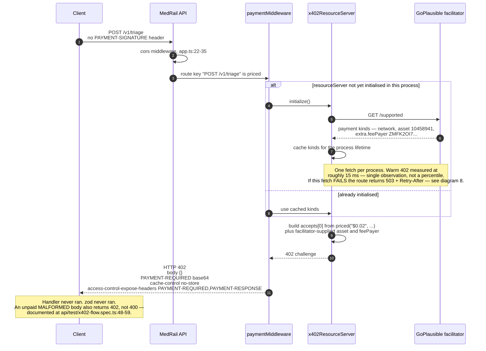
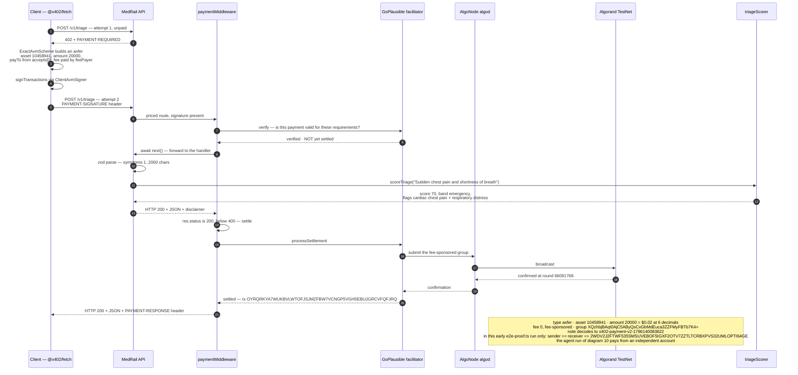
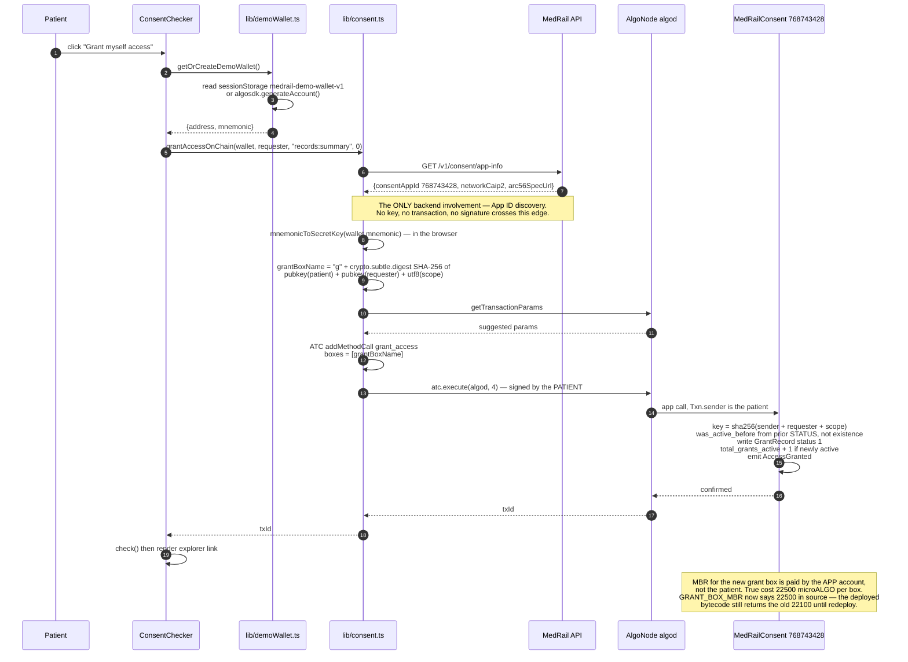
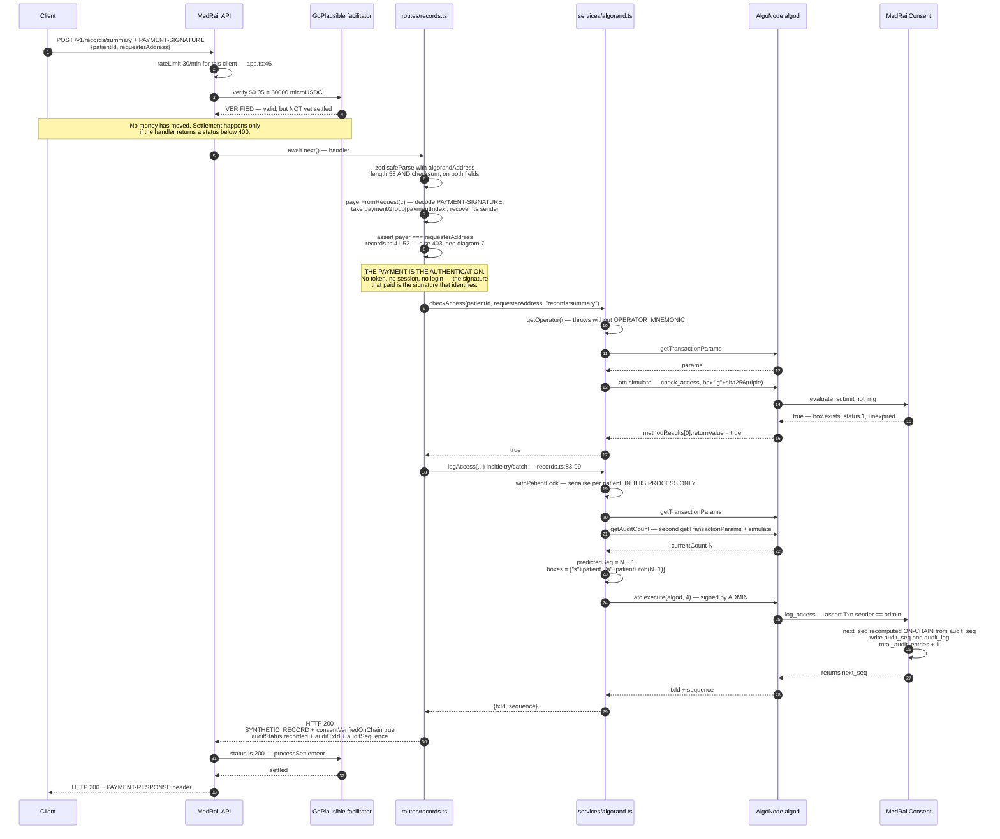
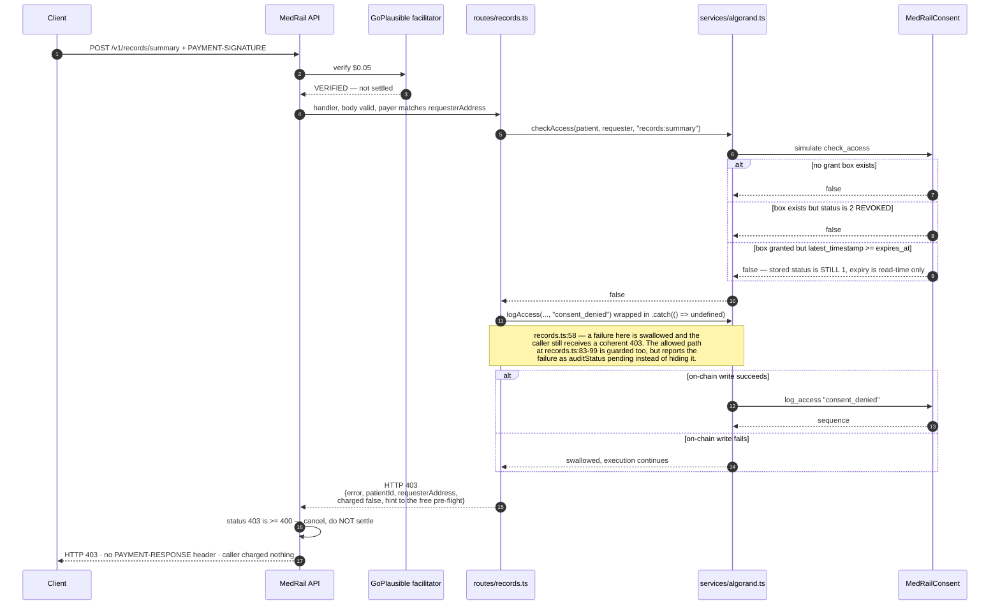
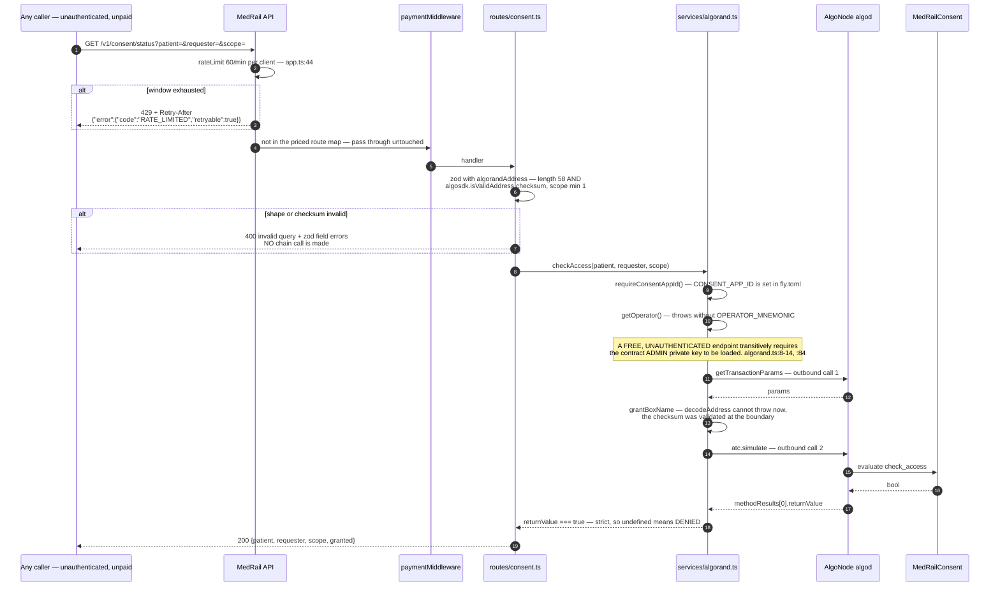
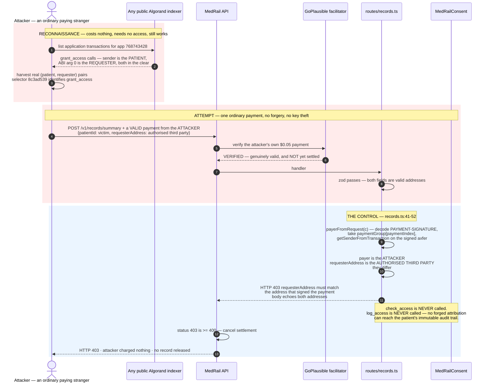
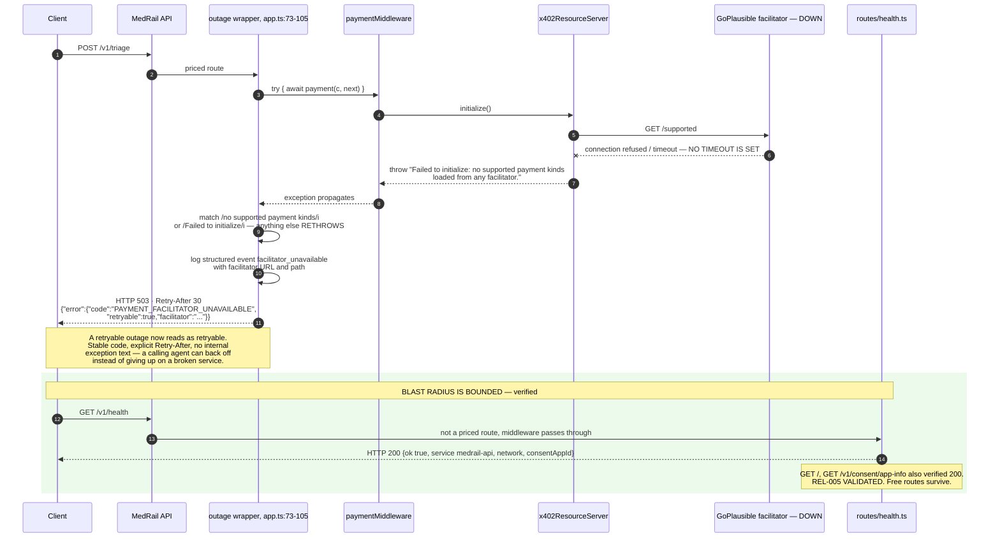
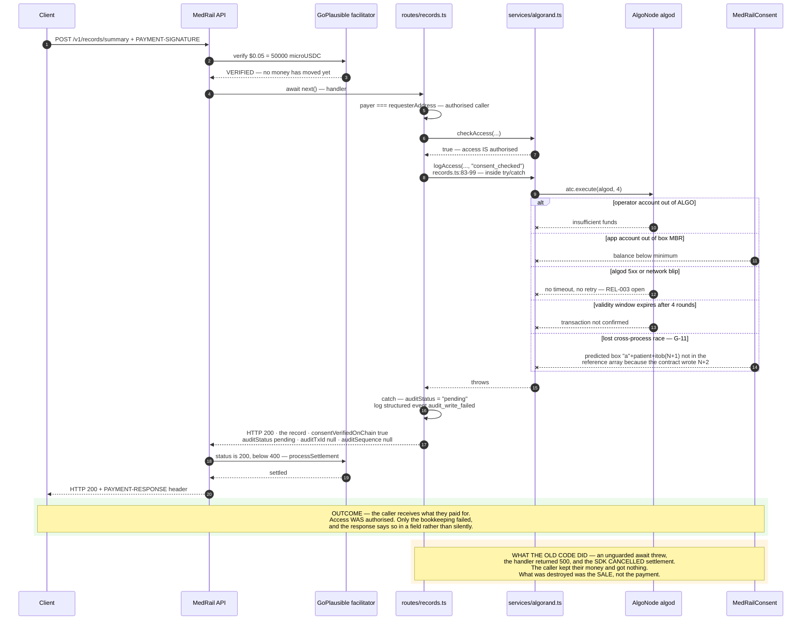
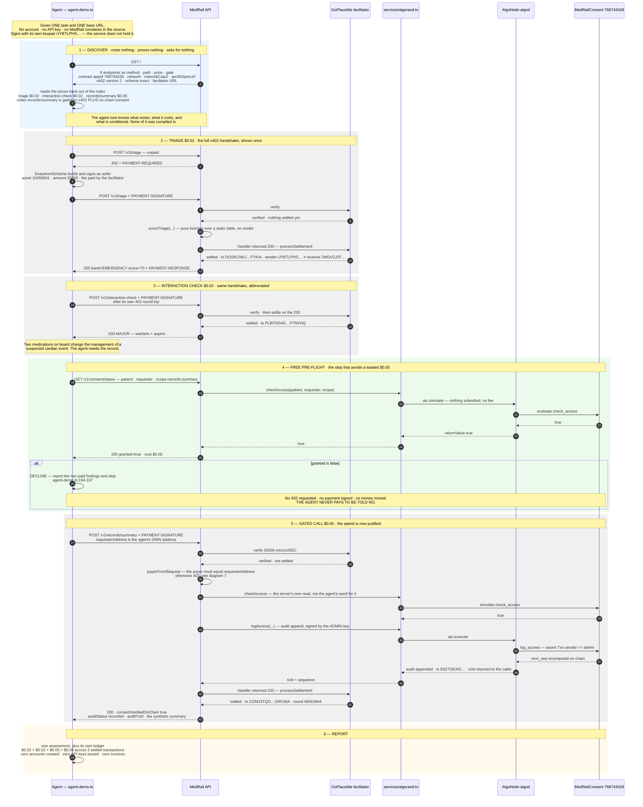

# MedRail — Sequence Diagrams

**Purpose:** trace every interaction of consequence — the two payment flows, the consent lifecycle, the consent-gated read in both outcomes, one attack and its block, two degradation paths, and one autonomous agent composing most of them into a single task — at message granularity.

**Status of this document:** Descriptive of the working tree on branch `main`. Each diagram is annotated with the validation status of the path it shows. Every path here has now executed against live infrastructure or is asserted by test; diagram 7 is an attack that is **MITIGATED**, proven by a live TestNet simulation. Status labels per the project fact ledger.

**One rule governs every diagram below.** `@x402/hono` verifies the payment *before* the handler runs and commits settlement *after* it returns — and only when the returned status is below 400. On a throw it calls `cancellationDispatcher.cancel({reason: "handler_threw"})`; on any 4xx or 5xx it calls `cancel({reason: "handler_failed"})` and returns before `processSettlement` is ever reached (`@x402/hono` `dist/esm/index.mjs:203-232`). So in the diagrams, **"settled" always appears after the handler's response, never before it**, and every non-2xx branch is a branch on which the caller pays nothing.

Related: [`./LLD.md`](./LLD.md) · [`./HLD.md`](./HLD.md) · [`./Activity_Diagrams.md`](./Activity_Diagrams.md) · [`../02_Requirements/SRS.md`](../02_Requirements/SRS.md) · [`../06_Security/Threat_Model.md`](../06_Security/Threat_Model.md)

**Participants used throughout**

| Alias | Real component |
|---|---|
| Client | Any x402 v2 client — `@x402/fetch`, `api/scripts/e2e-proof.ts`, or `web/lib/x402Client.ts` |
| Ag | The autonomous agent of diagram 10 — `api/scripts/agent-demo.ts`, a stock `@x402/fetch` client with no MedRail-specific code |
| API | `medrail-api`, Hono app at `api/src/app.ts` |
| Pay | `paymentMiddleware` from `@x402/hono`, wired at `api/src/app.ts:58-175` and wrapped for outage handling at `:73-105` |
| RS | `x402ResourceServer` + `ExactAvmScheme`, `api/src/x402.ts:11-14` |
| Fac | GoPlausible facilitator, `https://facilitator.goplausible.xyz` |
| Gw | `api/src/services/algorand.ts` |
| Algod | AlgoNode algod, `https://testnet-api.algonode.cloud` |
| App | `MedRailConsent`, Algorand application `768743428` |

---

## 1. Unpaid request to a priced route — the 402 challenge

**Status: VALIDATED** — `api/test/x402-flow.spec.ts` asserts the live 402 on all three priced routes (FR-001, FR-002).

**Walkthrough.** CORS runs first (`api/src/app.ts:22`), then the three path-scoped rate limiters (`:44-46`), then the payment middleware inside its outage wrapper (`:50`, `:73`), then — only on success — the route modules (`:107-111`). Because the gate precedes every handler, an unpaid request never reaches zod. The challenge body is empty; the entire payload is the base64 `PAYMENT-REQUIRED` header. Decoded, it carries `x402Version: 2`, the resource URL and description, and `accepts[0]` = `{scheme: "exact", network: "algorand:SGO1GKSzyE7IEPItTxCByw9x8FmnrCDexi9/cOUJOiI=", amount: "20000", asset: "10458941", payTo: "2WDV2J2FTWF535SMSUVEBOF5IGXF2OTV7ZZTLTCRBXPVS32UMLOPTI64GE", maxTimeoutSeconds: 300, extra: {feePayer: "ZMFK2OI7ZBD2U27ISERZC4S6LKM6WMFJPZQ4MYNJDZ2VNBNMBA67RA22AA"}}`.

**Evidence:** `api/src/app.ts:58-175`; `api/src/x402.ts:11-32`; assertions at `api/test/x402-flow.spec.ts:24` (`amount === "20000"`) and `:45` (`"50000"`).

**Note on the initialise step.** `asset` and `extra.feePayer` are **not** MedRail configuration — `priced()` sets no `asset` field at all (`api/src/x402.ts:16-19`). They come from the facilitator's `/supported`. The 402 therefore cannot be constructed offline, which makes the priced surface dependent on a third party's availability. That dependency is now *handled* rather than merely suffered: a failed fetch produces a 503 with `Retry-After: 30` and a stable error code (diagram 8). It is not *removed* — there is still no cached `/supported` fallback and no second facilitator, so REL-001 is **PARTIALLY IMPLEMENTED**. PERF-001 **IMPLEMENTED**: the cache means no per-request outbound call.

---

## 2. Full paid triage call — settle and deliver

**Status: VALIDATED on-chain.** Settled transaction `OYRQRKYA7WUKBVLWTOFJSJMZFBW7VCNGP5VGH5EBUJGRCVFQFJRQ` (FR-003).

**Walkthrough.** The two-attempt shape is the x402 protocol itself, not a MedRail retry: the client discovers the price from the 402 and re-issues with a signed payment. MedRail never inspects the signature for *validity* — it hands the header to the facilitator and acts on the verdict (TB-2). It does read the header for *identity* on the consent-gated route, which is a separate concern and the subject of diagram 7. No MedRail-specific knowledge is required of the client: stock `@x402/fetch` with `ExactAvmScheme` produced this transaction via `api/scripts/e2e-proof.ts`, and the result is committed at `contracts/artifacts/e2e-proof.json` with `httpStatus: 200`.

**Note the verify/settle split.** Verification happens before the handler and settlement after it. That is not an implementation detail: it is the reason no failure inside MedRail can consume a caller's money, and it is what every "failure" diagram below depends on.

**Honesty note.** The run diagrammed above is a **self-payment** — sender and receiver are the same address — as are all of the early proof-script runs, disclosed in `docs/PROOF.md` §6. That is no longer true of every payment: the agent run of diagram 10 settles from an **independent keypair** (`UYBTLPHS…`, which this service does not control) to the service address (`2WDV2J2F…`), with sender ≠ receiver confirmed against the public indexer (`docs/PROOF.md` §10). What has not changed is where the money came from — the agent's TestNet USDC float was seeded from the project's own wallet, because TestNet USDC has no other practical source — so none of this is third-party payment volume, and no external party has paid for the service. Each is a genuine facilitator-settled x402 transfer, and together they prove the protocol path end to end. The early runs each have a committed evidence file: `2VRBXOMH…` and `OYRQRKYA…` for `/v1/triage` (`e2e-proof.json`, which the repeatable script overwrites), `5DKFUULW…` for the consent-gated route (`e2e-consent-proof.json`), and `QZIQWHN5…` for the G-01 control call (`g01-verification.json`).

**Evidence:** `contracts/artifacts/e2e-proof.json`; `api/scripts/e2e-proof.ts:52-76`; scoring logic at `api/src/services/triageScorer.ts:53-73` (35 + 35 = 70 → `emergency`).

---

## 3. Patient grants consent — browser straight to Algorand, no backend

**Status: IMPLEMENTED** (FR-035, NFR-008); the on-chain method itself is **VALIDATED** by transaction `X2BQ5FD4MW52B75WQGDB67TEULYLN7FHVFO6ZOBNI74PNCAKVOUA`. The browser path has **no automated test**.

**Walkthrough.** This is the strongest claim in the system and it holds up: the patient's private key is used only inside the browser, and the API is not on the signing or submission path. The contract enforces it structurally — `grant_access` has **no patient parameter**; the patient is `Txn.sender` (`contracts/smart_contracts/consent/contract.py:158`), so there is nothing to forge. SEC-003 **VALIDATED**.

The one nuance worth stating precisely: the browser does call `GET /v1/consent/app-info` to learn the App ID (`web/lib/consent.ts:36-41`). That is an **availability** coupling, not a trust coupling — if the API is down the panel fails, but no key is ever exposed.

**Revocation** is the mirror image (`web/lib/consent.ts:70-89` → `contract.py:185-202`), with one extra guarantee: `assert self.grants.maybe(key)[1], "no such grant"` makes revoking a non-existent grant fail atomically (FR-021 **VALIDATED**). Live revocation: `OV2J2T5VWMIQG64JYGL7JEGZKKNZNKCMNIQU6AC4PDRQYZ6ZOO5A`.

**Note on the box key.** This is the **third independent implementation** of the derivation — Python `op.sha256`, Node `node:crypto`, browser `crypto.subtle.digest`. All three are now held to one shared golden-vector fixture, `api/test/fixtures/box-key-vectors.json`, asserted by `api/test/boxKeyParity.spec.ts` on the Node and WebCrypto paths and by `contracts/tests/test_box_keys.py` on the Python one. NFR-011 **VALIDATED**; finding G-08 closed.

**Note on the MBR constant.** The 22,500 figure is the corrected one. `GRANT_BOX_MBR` originally read `2_500 + 400 * (32 + 17)` = 22,100, omitting the `BoxMap` key prefix byte; it is fixed in source with a regression test, but the redeploy is deliberately deferred because `deploy_testnet.py` uses `OnUpdate.AppendApp` and would mint a new App ID, orphaning `768743428` and every transaction cited in these documents.

---

## 4. Consent-gated record access — happy path

**Status: VALIDATED on-chain.** `api/scripts/e2e-consent-proof.ts` performs grant → check → paid call → audit append and is repeatable; `contracts/artifacts/e2e-consent-proof.json` records the run — grant `M26NPR32…`, settled payment `5DKFUULW…`, audit write `4YLKLQKK…` at sequence 1, `consentVerifiedOnChain: true`. `total_audit_entries` on app `768743428` is now **5**. FR-010, FR-012, FR-025 **VALIDATED**.

**Walkthrough.** Four sequential outbound calls occur *before* the response and therefore before settlement: `getTransactionParams`, then `getAuditCount`'s own `getTransactionParams` and `simulate`, then `execute` polling for up to four rounds. The audit write is inline on the paid path — PERF-004 **NOT IMPLEMENTED**, and no latency figure is measured anywhere (finding **G-24**, open). The redundant second `getTransactionParams` is finding **G-33**, also open.

**The payer binding is the step that matters.** The x402 middleware proves *a* payment settled; it does not tell the handler *whose*. `payerFromRequest` recovers the signer of `paymentGroup[paymentIndex]` — the caller's own asset transfer, as distinct from the facilitator's fee-payer legs — and the handler refuses to proceed unless that address equals the `requesterAddress` in the body. Without this the consent check would be answering a question about somebody else. See diagram 7 and [`./LLD.md`](./LLD.md) §5.2.

**What the contract protects, and how the client-side prediction stays safe.** `log_access` recomputes `next_seq` from on-chain state (`contract.py:231-233`), so a stale client-side prediction cannot corrupt the audit trail. The prediction exists only to populate the AVM's mandatory box-reference array. A stale prediction therefore produces a *rejected transaction*, not a bad record — and the handler's `try/catch` converts that rejection into a 200 with `auditStatus: "pending"` (diagram 9).

**AI-007 holds structurally.** Only the module constants `SCOPE`, `ENDPOINT` and the literal `"consent_checked"` reach the ledger (`api/src/routes/records.ts:12-13`, `:84`). No free-text clinical input is on any path to Algorand.

**The response body is a fixed constant.** `SYNTHETIC_RECORD` (`api/src/routes/records.ts:17-23`) is returned regardless of `patientId`. There is no patient datastore. DATA-004 **IMPLEMENTED**.

**Evidence:** `contracts/artifacts/e2e-consent-proof.json`; `api/src/routes/records.ts:28-112`; `api/src/services/algorand.ts:82-100`, `:146-179`; `contract.py:224-243`.

---

## 5. Consent-gated record access — denied path

**Status: VALIDATED** — FR-011. The denial audit write executes on-chain like any other `log_access` call, and the denial response shape is fixed by `api/src/routes/records.ts:59-71`.

**Walkthrough.** The caller is refused and **pays nothing**. A 403 is a status at or above 400, so `@x402/hono` cancels settlement and never calls `processSettlement`; the response says so in the body with `charged: false`, and the `hint` field points at the free `GET /v1/consent/status` pre-flight so an integrator can avoid the round trip entirely. An earlier revision of this endpoint returned `charged: false` and the documents described the denial as charged — both were wrong about the SDK's own behaviour, and the field no longer exists.

**The cost that does exist is MedRail's.** The denial audit write is a real Algorand transaction whose fee the operator account pays, so a stranger can make MedRail spend a fee to be told "no", for free. That is why this priced route is nonetheless rate-limited to 30 requests per minute per client (`api/src/app.ts:46`): the denied path is a free surface hiding inside a paid endpoint. Finding **G-03 closed** — response and documents corrected, cost bounded.

**Recording the denial is the point, not a side effect.** A refused attempt is exactly the event a patient most wants to see on their own consent trail; a log of successful reads only is a weaker artefact.

**Three distinct denial causes collapse to one `false`.** No grant, a revoked grant, and an expired grant are indistinguishable in the response. A caller cannot tell "you were never granted" from "your grant lapsed yesterday". That is arguably correct privacy behaviour — distinguishing them would leak the existence of grants — but the repository does not record a rationale, so it should be read as a consequence of `check_access`'s boolean return type rather than as a deliberate privacy control.

**Note the expiry subtlety.** For an expired grant the stored status remains `STATUS_GRANTED`; expiry is evaluated at read time and never written back (`contract.py:205-209`). `get_grant` and `check_access` will disagree. The API only ever calls `check_access`, so it is correct.

---

## 6. Free consent read via `simulate`

**Status: IMPLEMENTED** (FR-013). Manually exercised by the reviewer — one cold observation at **505 ms**, a single sample and not a percentile. `api/test/app.spec.ts` covers this route's validation and rate-limit behaviour; the granted-path chain read itself has no automated test.

**Walkthrough.** Nothing is submitted and no fee is paid — `simulate` is evaluated by the node and discarded. SEC-009 **IMPLEMENTED**. The strict `=== true` comparison (`api/src/services/algorand.ts:99`) makes the read fail closed: an ambiguous result denies.

**Three properties of this endpoint that a reviewer should notice.**

1. **It amplifies, and the amplification is now capped.** One inbound request still produces two outbound AlgoNode calls with no authentication, but the route is limited to 60 requests per minute per client key (`api/src/rateLimit.ts`, wired at `api/src/app.ts:44`), returning **429** with `Retry-After` past the window. SEC-013 **IMPLEMENTED**; finding **G-09 closed**. Two honest limitations: the client key is the first `X-Forwarded-For` hop and is spoofable by a direct caller, and the buckets are per-process — this is a courtesy guard, not a security boundary.
2. **A malformed address is a 400, and reveals nothing.** `api/src/validation.ts` exports `algorandAddress`, a zod schema chaining `.length(58)` with `.refine(algosdk.isValidAddress)`, and both query fields use it. A 58-character string with a bad checksum is rejected at the boundary with a field error naming the checksum — no `getTransactionParams` round trip is spent, and `algosdk.decodeAddress` is never reached. `app.onError` separately no longer echoes `err.message`: it logs the detail server-side against a generated `requestId` and returns `{"code":"INTERNAL_ERROR","retryable":true,"requestId":"…"}`. SEC-010, SEC-011 **IMPLEMENTED**; finding **G-10 closed**, with `api/test/app.spec.ts` asserting that the body does not contain `"wrong checksum for address"`.
3. **It depends on the admin key.** See the note in the diagram. `simulate` still requires a sender and a signer, so the free endpoint is not operable without the most sensitive secret in the system. This one is unchanged and worth restating: SEC-012 **NOT IMPLEMENTED** — there is no KMS and no scoping of that key.

---

## 7. Requester impersonation — the attack, and the control that blocks it

> ### **STATUS: MITIGATED.** Verified live against TestNet.
> SEC-006, SEC-007, SEC-008 and FR-039 **IMPLEMENTED**. Finding **G-01 closed**. The control is `api/src/x402Payer.ts` plus the guard at `api/src/routes/records.ts:41-52`. The proof is `api/scripts/verify-g01-fix.ts`, which runs the attack below against the live service and records the outcome in `contracts/artifacts/g01-verification.json` — attack blocked with a 403, control call still 200.

**Walkthrough.** No cryptography is broken and no key is stolen. The attacker pays honestly with their own wallet and simply *claims* to be someone else. That claim is now checkable, because under x402 the payment is itself a signed transaction: the account that paid is recoverable from the header the middleware already verified, at the cost of one decode and no extra round trip. The contract still answers the question it is asked — "did patient P grant requester R scope S?" — truthfully; the API no longer lets the caller choose R.

Reconnaissance still works, and always will: grants are **necessarily** public. `grant_access` carries the patient as `sender` and the requester as ABI argument 0, and the method selector `8c3ad539` is verified on-chain. The transparency that makes the consent layer auditable also publishes the target list. What has changed is that a harvested pair is no longer usable — knowing that R is authorised does not let you *be* R.

**The second-order effect was always the worse half, and it is the half the control removes.** `logAccess` writes the requester into the per-patient audit log. A successful impersonation would have inscribed a **false attribution into an immutable record that is trusted precisely because it is on-chain** — worse than having no audit trail, because a wrong record carries more authority than a missing one. Since the 403 is returned before `checkAccess`, no impersonated call reaches `log_access` at all.

**The live proof, and why the control call matters as much as the attack.** `api/scripts/verify-g01-fix.ts` grants a third party consent, pays with a different key, and asserts the third party's address:

| | Asserted requester | Payer | Result |
|---|---|---|---|
| **attack** | `NHUPYHPA…LLVA6AM` — genuinely granted | `2WDV2J2F…TI64GE` — someone else | **403**, `blocked: true` |
| **control** | `2WDV2J2F…TI64GE` | `2WDV2J2F…TI64GE` | **200**, record released, settled `QZIQWHN5…LVSQ`, audit `OYNWBHJT…NBGA` |

A check that rejects everything is not a control, it is an outage — so the script proves both directions. Six unit tests in `api/test/x402Payer.spec.ts` pin the recovery itself, including a payment group with facilitator fee-payer legs ahead of the caller's transfer, which is the case a naïve `paymentGroup[0]` implementation gets wrong.

**What remains true about the synthetic record.** `SYNTHETIC_RECORD` is a fixed constant (`records.ts:17-23`) and `web/components/LiveDemoPanel.tsx:38` sends `requesterAddress: wallet.address`, so in the demo payer and requester coincide anyway. Neither of those is the control — the payer binding is. What they mean is that there is nothing sensitive behind the control yet.

**Related, lower severity.** `patientId` is still caller-asserted, but it only selects which grant is checked, and a grant naming a patient who did not issue it does not exist. It is not independently exploitable.

Full analysis in [`../06_Security/Threat_Model.md`](../06_Security/Threat_Model.md) and [`./LLD.md`](./LLD.md) §5.2.

---

## 8. Degradation — facilitator unreachable

**Status: HANDLED.** Finding **G-04 closed**; REL-001 **PARTIALLY IMPLEMENTED** — the outage is reported honestly, but no redundancy exists. REL-005 **VALIDATED**.

**Walkthrough.** The root cause is architectural, not incidental: because `priced()` sets no `asset` (`api/src/x402.ts:16-19`) and `extra.feePayer` also comes from the facilitator, MedRail literally cannot construct a 402 without a successful `/supported` fetch. That has not changed. What has changed is what the caller is told.

**Why the status code is the whole fix.** An opaque 500 with an internal exception message tells a calling agent "this service is broken", and a well-built agent stops calling. A 503 carrying `Retry-After: 30`, `retryable: true` and a stable `PAYMENT_FACILITATOR_UNAVAILABLE` code tells it "try again shortly" — which is the truth, since the condition is a third party's transient unavailability rather than a defect in MedRail. For an API whose intended consumers are autonomous agents, the difference between those two answers is the difference between a paused integration and an abandoned one.

**The wrapper is deliberately narrow.** It matches two specific initialisation-failure messages and **rethrows everything else**, so a genuine payment error still surfaces as a payment error rather than being laundered into a 503. That narrowness is the part most likely to need maintenance: if the SDK changes its message text, the match stops firing and the old 500 returns. A stable error class from `@x402/core` would be a better hook, and none is exported today.

**What is still missing, in order of value.** A timeout on the `/supported` fetch; a cached last-known-good payment-kinds response persisted across restarts; a circuit breaker so a dead facilitator is not re-attempted on every request; and a second facilitator. None exists — which is why REL-001 is partial rather than closed.

**Note that `/v1/health` returns 200 throughout.** It reports only its own liveness and never probes the facilitator or algod (`api/src/routes/health.ts:6-14`), so a green health check is fully compatible with 100% of the revenue path being down. `api/fly.toml` now wires a platform health check to `/v1/health` every 30 seconds, which restarts a dead process but will not notice a dead facilitator. OPS-001 **IMPLEMENTED** but shallow, and finding **G-15** (no metrics, tracing or alerting) remains open — the `facilitator_unavailable` event is written to stdout and nothing consumes it.

**Same mechanism, second consequence.** `api/test/x402-flow.spec.ts` reaches the live facilitator, so a GitHub runner's network or a GoPlausible outage produces a red build with a misleading failure.

---

## 9. Degradation — the audit write fails on an authorised, paid request

**Status: HANDLED.** Finding **G-03** closed. REL-002 **VALIDATED — satisfied by the SDK**: settlement is structurally unreachable on an error response, so no failure here can consume the caller's money.

**Walkthrough.** Every listed cause is a real, reachable failure mode of `atc.execute`. The operator account's ALGO balance and the app account's MBR headroom are both unmonitored and unalerted (OPS-005 **NOT IMPLEMENTED**, finding **G-15**); there is no timeout or retry on `Algodv2` (`api/src/services/algorand.ts:5`, REL-003). `withPatientLock` serialises only within one process, and `api/fly.toml` now pins `max_machines_running = 1` so that assumption holds in the deployed configuration — at the cost of pinning MedRail to a single machine, which is finding **G-11**, open as a scaling constraint.

**The correction worth stating plainly.** An earlier revision of this document described this path as a settled payment lost to a 500 — the caller paying $0.05 and receiving nothing, with no refund path. That was **factually wrong**. `@x402/hono` calls `processSettlement` only when the handler returns a status below 400; a throw triggers `cancellationDispatcher.cancel({reason: "handler_threw"})` and a 4xx or 5xx triggers `cancel({reason: "handler_failed"})`, both of which return before settlement. There was never a way for an error response in this service to consume a caller's money. Credit for that belongs to x402 v2's protocol design, not to MedRail.

**What was genuinely at stake was the sale.** A legitimate, authorised, paid-for request that failed only at the bookkeeping step returned a 500 and earned nothing — MedRail did the work, held a valid grant, and cancelled its own settlement over a transient chain error. The `try/catch` at `records.ts:83-99` trades that for a delivered resource carrying `auditStatus: "pending"`, which is plainly the better bargain for both sides.

**What `"pending"` does and does not promise.** It is an accurate label on a degraded response, not eventual consistency. There is no durable outbox, no queue and no replay: a `"pending"` entry stays pending, and the only trace is the structured `audit_write_failed` event on stdout. The remaining options, in ascending order of cost:

| Option | Effect | Cost |
|---|---|---|
| Current: 200 with `auditStatus: "pending"` and a structured failure log | Resource delivered, the gap is visible to the caller and greppable by an operator | Implemented. No reconciliation. |
| Retry the write out of band | Audit eventually consistent | Requires durable local state, which the "no database" architecture does not have |
| Durable outbox with idempotent replay | Correct | A datastore, i.e. a change in architectural style |
| Bundle the audit call into the client's payment group | Fully atomic | Breaks off-the-shelf x402 client compatibility — explicitly rejected in `docs/ARCHITECTURE.md:95-108` |

The trade-off between "no database" and "never lose an audit entry" is genuine and consciously unresolved in this build. See [`./HLD.md`](./HLD.md) §5 and [`./ADRs/ADR-005-audit-write-as-follow-up-transaction.md`](./ADRs/ADR-005-audit-write-as-follow-up-transaction.md).

---

## 10. An autonomous agent completes a clinical task — discover, decide, pay, verify

> ### **STATUS: VALIDATED on TestNet.** Executed end to end, output captured, every payment settled.
> Produced by `api/scripts/agent-demo.ts`. This is a **manual verification script, not an automated test**, and it does **not** run in CI. It is the only diagram in this document whose subject is a *caller* rather than the service: everything below is one client with no MedRail account, no API key and no prior relationship, driving diagrams 1, 2, 4 and 6 in sequence to finish a single piece of work. Three roles appear in it, held by three separate accounts — the agent that pays (`UYBTLPHS…`, its own keypair), the patient that granted consent (`56LFG5EE…`, its own keypair), and the service that is paid (`2WDV2J2F…`). No account holds two of those roles.

**What the three transaction ids are.** Three settled payments, each from the agent's account (`UYBTLPHS…`) to the service's (`2WDV2J2F…`):

| Step | What it bought | Transaction |
|---|---|---|
| 2 | `/v1/triage` — $0.02 | `DOSKCNKJRXIMY2UDSDZ377LKPZQIZJW5JHCGUAGKOYV6KUCFYKIA` |
| 3 | `/v1/interaction-check` — $0.02 | `PLBFDDADW576IUCH62HGGYI4AJQNO3QXSENNDIBKAORWVMP7NVHQ` |
| 5 | `/v1/records/summary` — $0.05 | `COMJ3TQOGTKP6LXDJS7HZY7B45QZJQWXXJ23HQ3IDDQYD7GRK36A` |

Step 5 also produced an audit append on `768743428` and returned its id to the agent in the response body: `E6ZTGEAOTLJQDYOUVBYJYL7LKTXHBGXGVTBKN3SR2NUPWJ2PIGQA`, confirmed at round 66563942. Its `requester` argument decodes to the agent's address — the entry attributes the access to the party that actually paid for it.

Each resolves at `https://lora.algokit.io/testnet/transaction/<TXID>`. Full record in [`../07_Testing/Test_Results.md`](../07_Testing/Test_Results.md) §5.7.

**Three provisioning steps precede the run and are not part of it.** `api/scripts/provision-agent-wallet.ts` created the agent's wallet — funding `YKGXFTZU…`, the agent's own USDC opt-in `KOALP5W2…`, and a $1.00 float `3ODGZ44Z…`. `api/scripts/provision-patient-wallet.ts` created the patient's wallet `56LFG5EE…`, funded with 150,000 µALGO in `GCYA23PH…`, so that the grant would come from an account that is neither the payer nor the payee. And `api/scripts/grant-consent.ts` recorded the patient's grant to that specific agent, `IG4XEBTM…`, signed by the patient and submitted straight to Algorand with the backend out of the path.

**An earlier run of the same script, before the agent had a wallet of its own,** settled `POAQNSOP…`, `W3Z55BZY…` and `5CO5XV7M…` with audit append `5HYV5B2L…`. Those transactions are real and remain checkable; in that configuration a single account was payer, patient and `payTo` at once.

**Walkthrough.** Steps 2, 3 and 5 are diagrams 2 and 4 verbatim — nothing in the service behaves differently because the caller is a program. What is new is step 1 and step 4, and neither of them is a payment.

**Step 1 is why the agent needs no documentation.** The only MedRail-specific value in `agent-demo.ts` is `API_BASE`. The endpoint paths it calls, the prices it pays, the fact that one route is consent-gated, the App ID it could verify against, and the ARC-56 URL it would need in order to do so are all read out of `GET /` at runtime (`agent-demo.ts:144-158`). A price change on the server changes what the agent pays, with no client release. See [`./System_Architecture.md`](./System_Architecture.md) §2.3.

**Step 4 is the sharpest beat in the flow, and the argument is economic rather than technical.** The gated endpoint costs $0.05 and can refuse. The oracle that decides whether it will refuse costs nothing and answers the same question against the same contract state. An agent that reads `gate` in step 1 finds `GET /v1/consent/status` sitting next to it in the same index, and can therefore turn a possible loss into a free answer. The `alt` branch is not decoration — `agent-demo.ts:194-197` returns early and reports on the two findings it already paid for.

Note precisely what the pre-flight does and does not save, because a denial is **already** free to the caller (diagram 5: a 403 cancels settlement). What it saves is a round trip, a chain fee that MedRail pays for the `consent_denied` audit write, and an entry on the patient's own audit trail recording an attempt that was never going to succeed. The agent that checks first leaves no such trace. That is the free route earning its place in the index rather than merely being cheap.

**Step 5 shows the composition the project exists for, from the outside.** One HTTP request is simultaneously a settled USDC payment, an on-chain authorisation read and an immutable audit append — and the agent receives the audit transaction id in its own response body, so it can confirm on a public explorer that it was recorded as having read the record. That is a caller being handed the evidence against itself, which is a stronger property than a service promising to keep logs.

**Honest limits, the same ones that govern every other diagram here.**

1. **It is not an automated test.** No runner invokes it, nothing asserts on its output, and CI never executes it. It proves the path works when run; it does not protect the path from regressing. [`../07_Testing/Test_Plan.md`](../07_Testing/Test_Plan.md) §3.5.1 sizes the conversion.
2. **The API was a local process.** Nothing is publicly hosted, so "an agent discovered the service" means an agent was pointed at `http://localhost:4021`. Discovery from a public URL has never happened, because there is no public URL.
3. **The payer is independent; the money is not external.** The agent signs with its own `AGENT_MNEMONIC` (`agent-demo.ts:37`) — keypair `UYBTLPHS…`, which this service does not hold — so all three settlements have sender `UYBTLPHS…` and receiver `2WDV2J2F…`, confirmed on the checked transactions against `testnet-idx.algonode.cloud` at rounds 66563930 and 66563944, `fee: 0` and facilitator-sponsored. What that does *not* demonstrate is demand: the agent's TestNet USDC float was seeded from the project's own wallet, because TestNet USDC has no other practical source. No external or unrelated party has paid for this service.
4. **The patient is a third account, not a second role on an existing one.** `PATIENT_ADDRESS` names `56LFG5EE…` (`agent-demo.ts:50`), a wallet with its own keypair that is neither the payer nor the payee, and that patient granted this specific agent access on-chain in `IG4XEBTM…`, signing for itself. The requester asserted at step 5 is the agent's own address, the grant belongs to someone else, and the payer binding of diagram 7 therefore does real work here rather than holding trivially. What three separate keypairs still do not buy is a patient with an independent motive: that wallet's TestNet ALGO was funded from the project's own account in `GCYA23PH…`, for the same reason as the agent's float in limit 3.
5. **There is nothing behind the gate.** `SYNTHETIC_RECORD` is a fixed constant (`api/src/routes/records.ts:17-23`) returned regardless of `patientId`, and neither priced compute endpoint contains a model — `scoreTriage` and `checkInteractions` are pure functions over static tables. The agent paid real money for a real authorisation decision over a placeholder record.
6. **The evidence file is the run's own account of itself.** Like `e2e-proof.ts`, `e2e-consent-proof.ts`, `verify-g01-fix.ts` and both provisioning scripts, this one now writes to `contracts/artifacts/` — `agent-run.json`, produced by `writeArtifact` (`agent-demo.ts:81-101`, called from `report()` at `:259-267`) with the agent and patient addresses, the three payments and their explorer links, the total, and the audit transaction id. Addresses only; no key material is written. But it is written by the same process it describes and asserts nothing, so it is a record, not an attestation. The check that does not depend on MedRail is still reading the transaction ids above off the public indexer.
