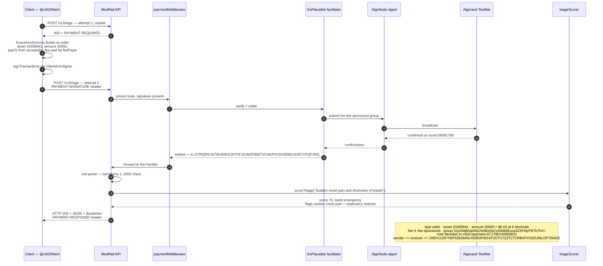
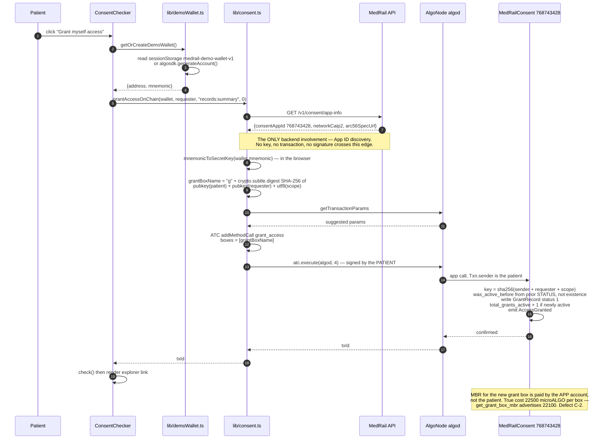
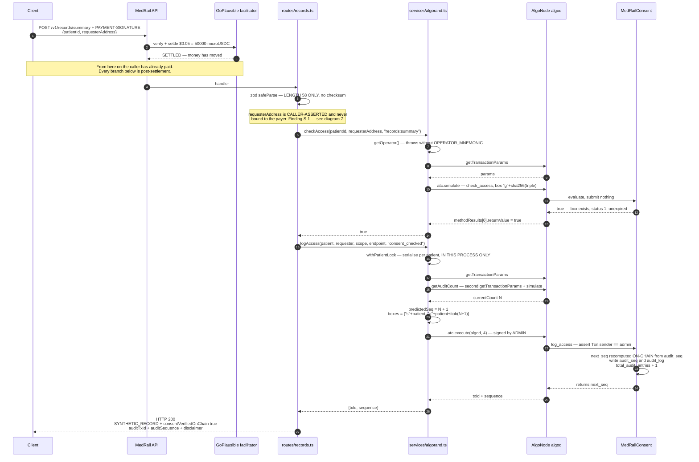
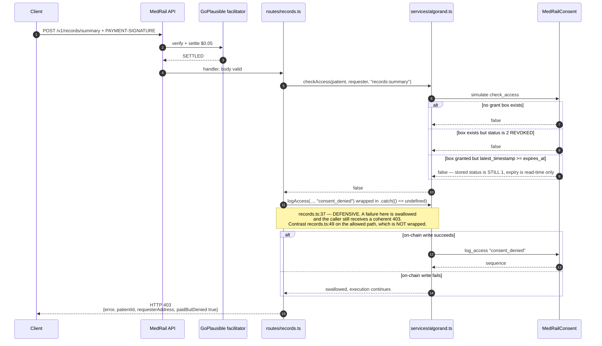
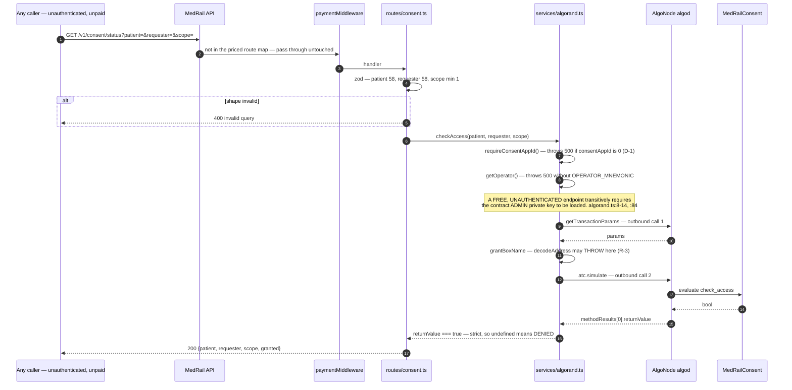
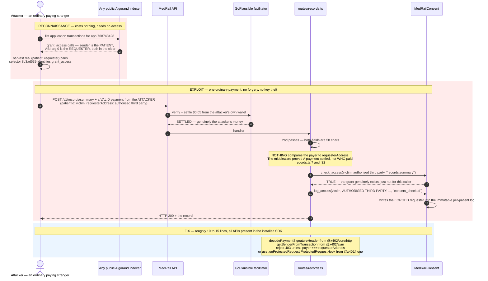
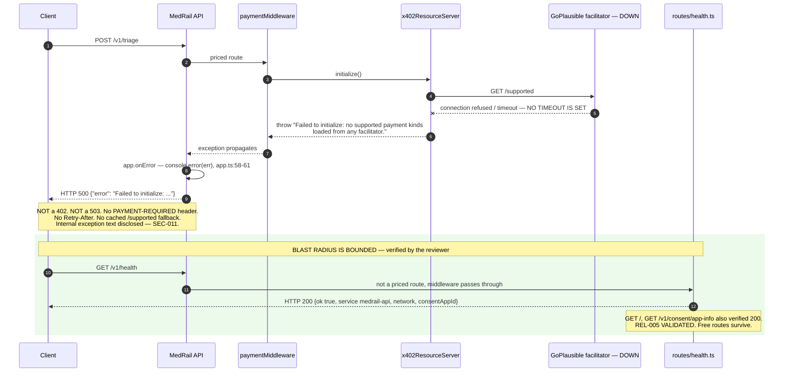
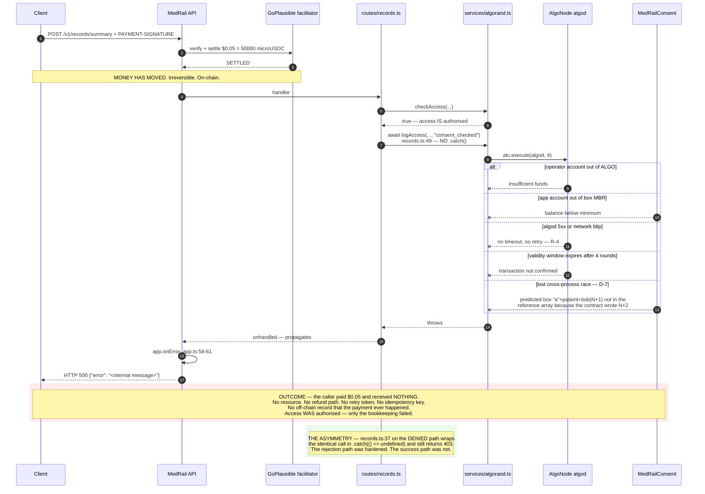

# MedRail — Sequence Diagrams

> **⚠ Correction notice.** Parts of this document were written against a review finding that was
> later proven wrong. Settlement in x402 v2 happens **only** on a sub-400 response, so **no error
> path in MedRail can consume a settled payment** — and consent-denied calls (HTTP 403) are **not
> charged**, contrary to `API.md`, `SECURITY.md`, and the `paidButDenied` field. The audit-sequence
> race causes a **rejected transaction**, not a corrupted log. See
> [`CORRECTIONS.md`](../CORRECTIONS.md) — it supersedes any statement here that contradicts it.

**Purpose:** trace every interaction of consequence — the two payment flows, the consent lifecycle, the consent-gated read in both outcomes, one attack, and two failure modes — at message granularity.

**Status of this document:** Descriptive of commit `32ffd73` on branch `master`. Each diagram is annotated with the validation status of the path it shows. Two of the nine paths have never executed against live infrastructure and are marked **UNVALIDATED on-chain**; one is an attack that is **NOT MITIGATED**. Status labels per the project fact ledger.

Related: [`./LLD.md`](./LLD.md) · [`./HLD.md`](./HLD.md) · [`./Activity_Diagrams.md`](./Activity_Diagrams.md) · [`../02_Requirements/SRS.md`](../02_Requirements/SRS.md) · [`../06_Security/Threat_Model.md`](../06_Security/Threat_Model.md)

**Participants used throughout**

| Alias | Real component |
|---|---|
| Client | Any x402 v2 client — `@x402/fetch`, `api/scripts/e2e-proof.ts`, or `web/lib/x402Client.ts` |
| API | `medrail-api`, Hono app at `api/src/app.ts` |
| Pay | `paymentMiddleware` from `@x402/hono`, wired at `api/src/app.ts:37-50` |
| RS | `x402ResourceServer` + `ExactAvmScheme`, `api/src/x402.ts:11-14` |
| Fac | GoPlausible facilitator, `https://facilitator.goplausible.xyz` |
| Gw | `api/src/services/algorand.ts` |
| Algod | AlgoNode algod, `https://testnet-api.algonode.cloud` |
| App | `MedRailConsent`, Algorand application `768743428` |

---

## 1. Unpaid request to a priced route — the 402 challenge

**Status: VALIDATED** — `api/test/x402-flow.spec.ts` asserts the live 402 on all three priced routes (FR-001, FR-002).

**Walkthrough.** CORS runs first (`api/src/app.ts:20`), then the payment middleware (`:37`), then — only on success — the route modules (`:52-56`). Because the gate precedes every handler, an unpaid request never reaches zod. The challenge body is empty; the entire payload is the base64 `PAYMENT-REQUIRED` header. Decoded, it carries `x402Version: 2`, the resource URL and description, and `accepts[0]` = `{scheme: "exact", network: "algorand:SGO1GKSzyE7IEPItTxCByw9x8FmnrCDexi9/cOUJOiI=", amount: "20000", asset: "10458941", payTo: "2WDV2J2FTWF535SMSUVEBOF5IGXF2OTV7ZZTLTCRBXPVS32UMLOPTI64GE", maxTimeoutSeconds: 300, extra: {feePayer: "ZMFK2OI7ZBD2U27ISERZC4S6LKM6WMFJPZQ4MYNJDZ2VNBNMBA67RA22AA"}}`.

**Evidence:** `api/src/app.ts:37-50`; `api/src/x402.ts:11-32`; assertions at `api/test/x402-flow.spec.ts:24` (`amount === "20000"`) and `:45` (`"50000"`).

**Note on the initialise step (R-1).** `asset` and `extra.feePayer` are **not** MedRail configuration — `priced()` sets no `asset` field at all (`api/src/x402.ts:16-19`). They come from the facilitator's `/supported`. The 402 therefore cannot be constructed offline. If that fetch fails, the route returns **HTTP 500 with no `PAYMENT-REQUIRED` header** rather than a 402 or a 503 — see diagram 8. REL-001 **NOT IMPLEMENTED**. PERF-001 **IMPLEMENTED**: the cache means no per-request outbound call.

---

## 2. Full paid triage call — settle and deliver

**Status: VALIDATED on-chain.** Settled transaction `OYRQRKYA7WUKBVLWTOFJSJMZFBW7VCNGP5VGH5EBUJGRCVFQFJRQ` (FR-003).

**Walkthrough.** The two-attempt shape is the x402 protocol itself, not a MedRail retry: the client discovers the price from the 402 and re-issues with a signed payment. MedRail never inspects the signature — it hands the header to the facilitator and acts on the verdict (TB-2). No MedRail-specific knowledge is required of the client: stock `@x402/fetch` with `ExactAvmScheme` produced this exact transaction via `api/scripts/e2e-proof.ts`, and the result is committed at `contracts/artifacts/e2e-proof.json` with `httpStatus: 200`.

**Two honesty notes.** The settled payment is a **self-payment** — sender and receiver are the same address, disclosed in `docs/PROOF.md` §6. It is a genuine facilitator-settled x402 transfer and it proves the protocol path end to end; it is not payment volume. And exactly **one** such payment exists.

**Evidence:** `contracts/artifacts/e2e-proof.json`; `api/scripts/e2e-proof.ts:52-76`; scoring logic at `api/src/services/triageScorer.ts:53-73` (35 + 35 = 70 → `emergency`).

---

## 3. Patient grants consent — browser straight to Algorand, no backend

**Status: IMPLEMENTED** (FR-035, NFR-008); the on-chain method itself is **VALIDATED** by transaction `X2BQ5FD4MW52B75WQGDB67TEULYLN7FHVFO6ZOBNI74PNCAKVOUA`. The browser path has **no automated test**.

**Walkthrough.** This is the strongest claim in the system and it holds up: the patient's private key is used only inside the browser, and the API is not on the signing or submission path. The contract enforces it structurally — `grant_access` has **no patient parameter**; the patient is `Txn.sender` (`contracts/smart_contracts/consent/contract.py:151`), so there is nothing to forge. SEC-003 **VALIDATED**.

The one nuance worth stating precisely: the browser does call `GET /v1/consent/app-info` to learn the App ID (`web/lib/consent.ts:36-41`). That is an **availability** coupling, not a trust coupling — if the API is down the panel fails, but no key is ever exposed.

**Revocation** is the mirror image (`web/lib/consent.ts:70-89` → `contract.py:178-195`), with one extra guarantee: `assert self.grants.maybe(key)[1], "no such grant"` makes revoking a non-existent grant fail atomically (FR-021 **VALIDATED**). Live revocation: `OV2J2T5VWMIQG64JYGL7JEGZKKNZNKCMNIQU6AC4PDRQYZ6ZOO5A`.

**Note on the box key.** This is the **third independent implementation** of the derivation — Python `op.sha256`, Node `node:crypto`, browser `crypto.subtle.digest`. No test asserts that the three agree. NFR-011 **UNVALIDATED**.

---

## 4. Consent-gated record access — happy path

> ### ⚠ **UNVALIDATED on-chain — evidence gap E-1**
> `total_audit_entries = 0` on application `768743428`, and the app holds **zero** `s`- or `a`-prefixed boxes. `log_access` has **never executed on Algorand TestNet**. This entire diagram past the `checkAccess` step is verified only against the AVM simulator (`contracts/tests/test_consent.py`) and by reading source. `routes/records.ts` has **no automated test of any kind**. FR-010, FR-012 **UNVALIDATED**.

**Walkthrough.** Four sequential outbound calls occur *after* settlement and *before* the response: `getTransactionParams`, then `getAuditCount`'s own `getTransactionParams` and `simulate`, then `execute` polling for up to four rounds. The audit write is inline on the paid path — PERF-004 **NOT IMPLEMENTED**. No latency measurement exists for this path because it has never run against the live contract.

**What the contract protects and what it does not.** `log_access` recomputes `next_seq` from on-chain state (`contract.py:224-226`), so a stale client-side prediction cannot corrupt the audit trail. The prediction exists only to populate the AVM's mandatory box-reference array. A stale prediction therefore produces a *rejected transaction*, not a bad record — which on this path is finding R-2 (diagram 9).

**AI-007 holds structurally.** Only the module constants `SCOPE`, `ENDPOINT` and the literal `"consent_checked"` reach the ledger (`api/src/routes/records.ts:10-11`, `:49`). No free-text clinical input is on any path to Algorand.

**The response body is a fixed constant.** `SYNTHETIC_RECORD` (`api/src/routes/records.ts:15-21`) is returned regardless of `patientId`. There is no patient datastore. DATA-004 **IMPLEMENTED**.

**Evidence:** `api/src/routes/records.ts:25-61`; `api/src/services/algorand.ts:82-100`, `:146-179`; `contract.py:217-236`.

---

## 5. Consent-gated record access — denied path

**Status: UNVALIDATED** — FR-011, no test exists; the audit write in this path has also never run on-chain (E-1).

**Walkthrough.** The caller pays and is refused. `paidButDenied: true` makes that explicit rather than ambiguous, and the in-code comment at `api/src/routes/records.ts:34-36` states the pricing rationale: the fee covers the on-chain verification regardless of outcome, the way a paid lookup API charges for a "not found". That is a defensible commercial position and it is disclosed to the caller in the response body.

**Three distinct denial causes collapse to one `false`.** No grant, a revoked grant, and an expired grant are indistinguishable in the response. A caller cannot tell "you were never granted" from "your grant lapsed yesterday". That is arguably correct privacy behaviour — distinguishing them would leak the existence of grants — but the repository does not record a rationale, so it should be read as a consequence of `check_access`'s boolean return type rather than as a deliberate privacy control.

**Note the expiry subtlety.** For an expired grant the stored status remains `STATUS_GRANTED`; expiry is evaluated at read time and never written back (`contract.py:205-209`). `get_grant` and `check_access` will disagree. The API only ever calls `check_access`, so it is correct.

---

## 6. Free consent read via `simulate`

**Status: IMPLEMENTED** (FR-013). Manually exercised by the reviewer — one cold observation at **505 ms**. No automated test.

**Walkthrough.** Nothing is submitted and no fee is paid — `simulate` is evaluated by the node and discarded. SEC-009 **IMPLEMENTED**. The strict `=== true` comparison (`api/src/services/algorand.ts:99`) makes the read fail closed: an ambiguous result denies.

**Three properties of this endpoint that a reviewer should notice.**

1. **It is a free amplifier.** One inbound request produces two outbound AlgoNode calls, with no authentication and no rate limiting anywhere in the system. SEC-013 **NOT IMPLEMENTED**.
2. **A malformed address becomes a 500, not a 400 (R-3).** zod validates length only, so a 58-character string with a bad checksum passes validation, and `algosdk.decodeAddress` throws inside `grantBoxName` (`algorand.ts:49`). `app.onError` then returns `err.message` verbatim: `500 {"error":"wrong checksum for address"}`. Two defects in one response — a client error reported as a server error (SEC-010), and internal exception text disclosed to an unauthenticated caller (SEC-011). Both **NOT IMPLEMENTED**. Note the ordering cost: the throw happens *after* the `getTransactionParams` round trip has already been paid.
3. **It depends on the admin key.** See the note in the diagram. The free endpoint is not operable without the most sensitive secret in the system.

---

## 7. ⚠ ATTACK — S-1 requester impersonation

> ### **THIS IS AN ATTACK PATH, NOT A FEATURE. STATUS: NOT MITIGATED.**
> SEC-006 **PARTIALLY IMPLEMENTED — DEFEATED**. SEC-007, SEC-008, FR-039 **NOT IMPLEMENTED**. This is the most severe finding in the system. It is invisible in the current build only because the response is a fixed synthetic constant and the demo UI happens to send the payer's own address.

**Walkthrough.** No cryptography is broken and no key is stolen. The attacker pays honestly with their own wallet and simply *claims* to be someone else. The contract answers the question it is asked — "did patient P grant requester R scope S?" — truthfully; the API chooses R from the request body (`api/src/routes/records.ts:7`) and never checks it against the payer.

Reconnaissance is trivial because grants are **necessarily** public: `grant_access` carries the patient as `sender` and the requester as ABI argument 0, and the method selector `8c3ad539` is verified on-chain. The very transparency that makes the consent layer auditable also publishes the target list.

**The second-order effect is worse than the read.** `logAccess` at `records.ts:49` writes the *claimed* requester into the per-patient audit log. A successful impersonation therefore inscribes a **false attribution into an immutable record that is trusted precisely because it is on-chain** — arguably worse than having no audit trail, because a wrong record carries more authority than a missing one. SEC-008 **NOT IMPLEMENTED**.

**Why it does not bite today.** Two accidents, neither of them a control: `SYNTHETIC_RECORD` is a fixed constant so nothing sensitive leaks (`records.ts:15-21`), and `web/components/LiveDemoPanel.tsx:38` sends `requesterAddress: wallet.address` so payer and requester coincide in the demo. With real PHI behind this endpoint, the consent layer would provide **no protection whatsoever**.

**Related, lower severity.** `patientId` is equally self-asserted, but it only selects which grant is checked, so it is not independently exploitable.

Full analysis in [`../06_Security/Threat_Model.md`](../06_Security/Threat_Model.md) and [`./LLD.md`](./LLD.md) §5.3.

---

## 8. Failure — facilitator unreachable

**Status: reproduced by the reviewer.** Finding **R-1**; REL-001 **NOT IMPLEMENTED**; REL-005 **VALIDATED**.

**Walkthrough.** The root cause is architectural, not incidental: because `priced()` sets no `asset` (`api/src/x402.ts:16-19`) and `extra.feePayer` also comes from the facilitator, MedRail literally cannot construct a 402 without a successful `/supported` fetch. The failure surfaces at `initialize()` and escapes through `app.onError`, which returns `err.message` verbatim.

**What is missing, in order of value.** A timeout on the `/supported` fetch; a cached last-known-good payment-kinds response persisted across restarts; a 503 with `Retry-After` in place of the 500; a circuit breaker so a dead facilitator does not re-attempt on every request; and a second facilitator. None exists.

**Note that `/v1/health` returns 200 throughout.** It reports only its own liveness and never probes the facilitator or algod (`api/src/routes/health.ts:6-14`), so a green health check is fully compatible with 100% of the revenue path being down. OPS-001 **IMPLEMENTED** but shallow — and it is wired to no probe anywhere (D-6).

**Same mechanism, second consequence: CI-2.** `api/test/x402-flow.spec.ts` reaches the live facilitator, so a GitHub runner's network or a GoPlausible outage produces a red build with a misleading failure.

---

## 9. Failure — `logAccess` throws after settlement

**Status: reproducible by construction from source.** Finding **R-2**; REL-002 **NOT IMPLEMENTED**. No test exists.

**Walkthrough.** Every listed cause is a real, reachable failure mode of `atc.execute` and none is defended against. The operator account's ALGO balance and the app account's MBR headroom are both unmonitored and unalerted (OPS-005 **NOT IMPLEMENTED**); there is no timeout or retry on `Algodv2` (`api/src/services/algorand.ts:5`, REL-003); and `withPatientLock` only serialises within one process while `api/fly.toml:17-19` permits more than one machine (REL-004, D-7).

**The perverse incentive is the tell.** The cheaper outcome for the operator — refusing access — is the better-engineered path. The outcome the caller paid for is the fragile one.

**Fixes, in ascending order of cost.**

| Fix | Effect | Cost |
|---|---|---|
| Mirror the denied path's `.catch()` and return 200 with `auditTxId: null` | Resource is delivered; the audit entry is lost | 1 line — trades an unrecoverable 500 for a silent gap in the audit trail, which is a product decision the repository has not recorded |
| Return 200 with `auditStatus: "pending"` and retry the write out of band | Resource delivered, audit eventually consistent | Requires durable local state, which the "no database" architecture does not currently have |
| Durable outbox with idempotent replay | Correct | A datastore, i.e. a change in architectural style |
| Bundle the audit call into the client's payment group | Fully atomic | Breaks off-the-shelf x402 client compatibility — explicitly rejected in `docs/ARCHITECTURE.md:95-108` |

The trade-off between "no database" and "never lose a settled payment" is genuine and unresolved in this build. See [`./HLD.md`](./HLD.md) §5.
