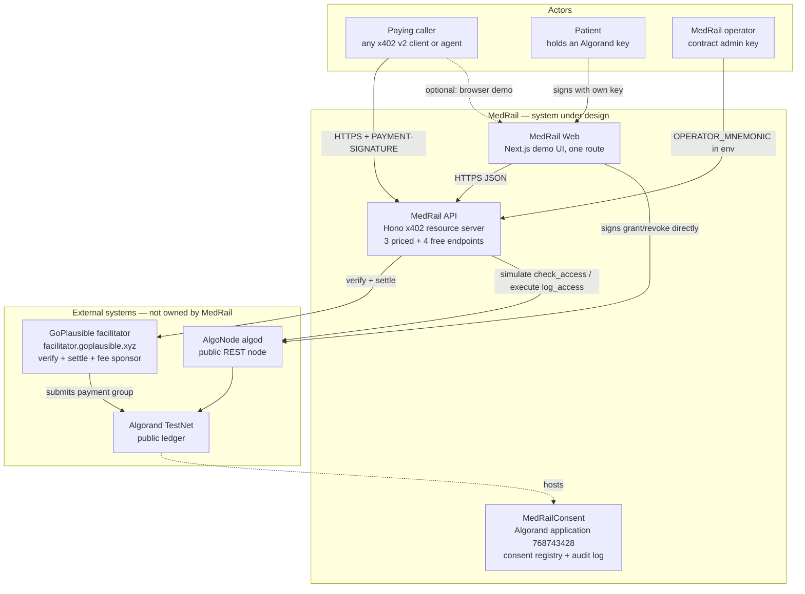
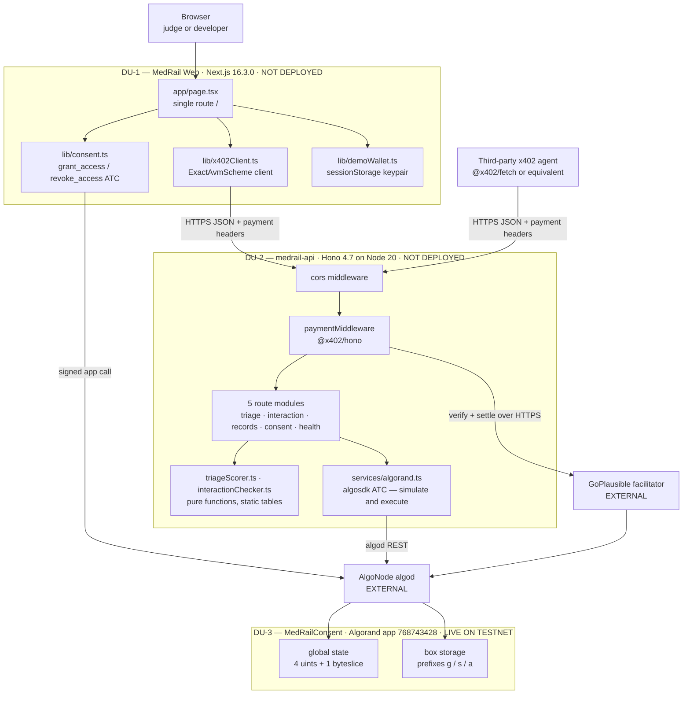
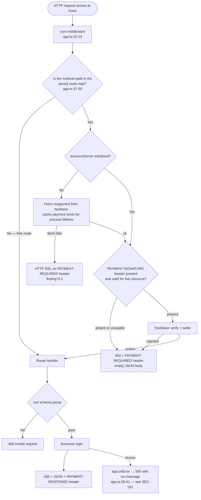

# MedRail — System Architecture

> **⚠ Correction notice.** Parts of this document were written against a review finding that was
> later proven wrong. Settlement in x402 v2 happens **only** on a sub-400 response, so **no error
> path in MedRail can consume a settled payment** — and consent-denied calls (HTTP 403) are **not
> charged**, contrary to `API.md`, `SECURITY.md`, and the `paidButDenied` field. The audit-sequence
> race causes a **rejected transaction**, not a corrupted log. See
> [`CORRECTIONS.md`](../CORRECTIONS.md) — it supersedes any statement here that contradicts it.

**Purpose:** define the architectural style of MedRail, its context, boundaries, deployment units and technology choices, and record why each was chosen.

**Status of this document:** Descriptive of the code at commit `32ffd73` on branch `master`, verified against source, the deployed TestNet application `768743428`, and the public Algorand indexer. Every non-obvious claim carries a `path:line` or transaction-ID citation. Status labels are those defined in the project fact ledger: **IMPLEMENTED**, **VALIDATED**, **UNVALIDATED**, **PARTIALLY IMPLEMENTED**, **PLANNED**, **NOT IMPLEMENTED**, **RECOMMENDED**.

Related: [`../02_Requirements/SRS.md`](../02_Requirements/SRS.md) · [`./HLD.md`](./HLD.md) · [`./LLD.md`](./LLD.md) · [`./ADRs/`](./ADRs/) · [`../06_Security/Threat_Model.md`](../06_Security/Threat_Model.md)

---

## 1. Architectural style

MedRail is a **stateless HTTP resource server placed in front of a public blockchain that serves as the sole system of record, with payment verification delegated to an external facilitator.**

Three decisions define the style. Each is load-bearing; removing any one changes what the system is.

| Decision | What it means concretely | Where it lives |
|---|---|---|
| **Stateless resource server** | The API process holds no session, no user account, no cache, no queue, no local persistence. Every request is answered from its own payload plus two immutable in-process tables plus live chain reads. Restarting the process loses nothing. | No datastore import exists anywhere in `api/src`. NFR-001 **IMPLEMENTED**. |
| **Ledger as the only system of record** | Consent state and the audit trail live in Algorand box storage under application `768743428`. There is no mirror, no projection, no read model. | `contracts/smart_contracts/consent/contract.py:114-116` |
| **Payment verification delegated** | The server never validates a signature, never inspects a payment transaction, and never queries algod about settlement. It hands the `PAYMENT-SIGNATURE` header to the GoPlausible facilitator and trusts the verdict. | `api/src/x402.ts:6-14` |

The result is a system with an unusually small amount of code between an HTTP request and a durable, publicly verifiable fact. It is also a system whose failure modes are almost entirely *other people's* failure modes — the facilitator's and AlgoNode's. Section 8 and [`./HLD.md`](./HLD.md) treat that honestly.

### What this system is not

There is **no database, no cache, no queue, no message bus, no background worker, and no ML model** in this repository. The two "AI" endpoints are deterministic rule engines over static tables (`api/src/services/triageScorer.ts:32-44`, eleven rules; `api/src/services/interactionChecker.ts:18`, fourteen pairs loaded from one JSON file). Any architecture diagram of MedRail that shows a datastore box other than "Algorand boxes" or the two static reference files is wrong.

---

## 2. System context

### 2.1 Actors and external systems

| Party | Type | Role | Trusted by MedRail? |
|---|---|---|---|
| **Caller / paying agent** | Human or autonomous agent | Presents an x402 payment and consumes a priced endpoint. Any off-the-shelf x402 v2 client works. | No. Fully untrusted. |
| **Patient** | Human with an Algorand key | Grants and revokes consent by signing `grant_access` / `revoke_access` directly against the chain. Never interacts with the API to do so. | Not applicable — the patient's authority is enforced on-chain by `Txn.sender`, not by the API. |
| **MedRail operator** | Holder of `OPERATOR_MNEMONIC` | Contract `admin`; the only account that may write audit entries or move app funds. | Fully trusted. This is the system's single hot key. |
| **GoPlausible facilitator** | External service, `https://facilitator.goplausible.xyz` | Publishes supported payment kinds, verifies and settles `exact`-scheme AVM payments, sponsors network fees. | **Trusted for settlement truth.** Standard x402 trust model; see §7. |
| **AlgoNode algod** | External public node | The only chain endpoint the running system calls: `getTransactionParams`, `simulate`, `execute`. | Trusted for chain truth; no fallback endpoint, no API key, no timeout (`api/src/services/algorand.ts:5`). |
| **AlgoNode indexer** | External public service | **Not a runtime dependency.** `config.indexerServer` is resolved (`api/src/config.ts:51`) but no module reads it — verified by grep across `api/src`, `web/lib`, `web/components`. Used only out-of-band by humans and by explorer links. | n/a |
| **Algorand TestNet** | Public blockchain | Executes `MedRailConsent`, holds all durable state, settles USDC transfers. | Trusted as the system of record. |

### 2.2 System context diagram

Rendered as a Mermaid flowchart rather than the experimental `C4Context` syntax, for portability. Boundaries are drawn as subgraphs.

**Reading the diagram.** Two paths reach the chain and they are deliberately separate. Consent *writes* go browser → algod, never through the API (`web/lib/consent.ts:44-89`) — this is what makes NFR-008 true. Audit *writes* go API → algod under the operator key (`api/src/services/algorand.ts:140-179`). The API therefore never holds a patient key, and the browser never holds an admin key.

---

## 3. Trust boundaries

Four boundaries exist. Naming them precisely matters because three of the system's confirmed defects sit exactly on one.

| # | Boundary | Crossed by | What is authenticated | Residual risk |
|---|---|---|---|---|
| **TB-1** | Public internet → MedRail API | Every HTTP request | **Nothing.** There is no authentication of any kind on any endpoint. Payment proves that *a* payment settled; it does not identify the payer to the handler. | **S-1**: `requesterAddress` is caller-asserted (`api/src/routes/records.ts:7`). SEC-007 **NOT IMPLEMENTED**. |
| **TB-2** | MedRail API → GoPlausible facilitator | Verify/settle calls, and the `/supported` fetch at initialise | Nothing. Plain HTTPS to a configured URL; no mTLS, no signed response verification. | The facilitator's settlement verdict is accepted without independent on-chain confirmation. This is the standard x402 trust model, not a MedRail defect — but it is residual risk. Availability risk is **R-1**, REL-001 **NOT IMPLEMENTED**. |
| **TB-3** | MedRail API → AlgoNode algod | `getTransactionParams`, `simulate`, `execute` | Nothing — public endpoint, no key (`api/src/services/algorand.ts:5`). Transaction authenticity is guaranteed by the signature, not the transport. | No timeout, no retry, no circuit breaker, no second endpoint. REL-003 **NOT IMPLEMENTED** (finding R-4). |
| **TB-4** | Anything → `MedRailConsent` | ABI calls | **Real authentication, enforced by the AVM.** `Txn.sender` is the patient for grant/revoke (`contract.py:151`, `contract.py:181`); `assert Txn.sender == self.admin.value` gates `log_access` and `withdraw_excess` (`contract.py:222`, `contract.py:258`). | The strongest boundary in the system, and the only one that is cryptographically enforced. Both admin rejections are unit-tested. SEC-001, SEC-002, SEC-003 **VALIDATED**. |

The asymmetry is the headline architectural fact: **the on-chain boundary is strong and the HTTP boundary is absent.** The consent contract correctly refuses to let anyone but the patient grant consent, and correctly refuses to let anyone but the admin write audit entries — and then the API hands the resulting authorisation decision to whoever asserts an address in a JSON body. See [`../06_Security/Threat_Model.md`](../06_Security/Threat_Model.md) for the exploit path and [`./Sequence_Diagrams.md`](./Sequence_Diagrams.md) §7 for the attack sequence.

---

## 4. Deployment units

Exactly three artefacts are deployable. There are no others.

| # | Unit | Artefact | Runtime | Where it runs today |
|---|---|---|---|---|
| **DU-1** | `MedRail Web` | Next.js production build | Node 20 / any static-capable host | Local only. No `vercel.json`, no committed hosting config. **NOT DEPLOYED** publicly. |
| **DU-2** | `medrail-api` | Container image from `api/Dockerfile` (2-stage, `node:20-slim`, root build context) | Node 20, port 4021 | Local only. `api/fly.toml` exists but has never been applied. Image has never been built in CI (CI-3). NFR-007 **UNVALIDATED**. |
| **DU-3** | `MedRailConsent` | TEAL + ARC-56 spec in `contracts/artifacts/` | Algorand AVM | **Live on TestNet, application `768743428`**, created at round 66088624, `deleted: false`. |

DU-3 is the only unit that is genuinely deployed. Stating this plainly is not a caveat — it is the architecture. The chain-side component is in production; both HTTP components are not.

The recorded `create_txid` in `contracts/artifacts/deploy_testnet.json` is `null` because the run captured in the repo was an idempotent re-run that detected the existing application rather than creating it; `contracts/scripts/deploy_testnet.py` only records `create_txid` when `operation_performed == Create`. The application exists and is independently verifiable; the create transaction ID simply was not captured.

### 4.1 Container diagram

---

## 5. Why there is no database

The ledger *is* the database. This is a real architectural choice with real consequences in both directions, and the honest accounting matters more than the slogan.

### 5.1 What it buys

| Property | Mechanism | Requirement |
|---|---|---|
| The patient owns the record of their own consent | `grant_access` and `revoke_access` take the patient as `Txn.sender` (`contract.py:151`, `contract.py:181`). No operator, no API, and no database administrator can forge a grant. | SEC-003 **VALIDATED** |
| The audit trail cannot be rewritten | No contract method mutates an existing `audit_log` key; the sequence only increments (`contract.py:224-236`). There is no `UPDATE`, because there is no SQL. | DATA-002 **IMPLEMENTED** |
| Anyone can verify the claim without asking MedRail | Every grant, revocation and counter is world-readable from any indexer. `GET /v1/consent/arc56` serves the ABI so third parties can call the contract directly (`api/src/app.ts:63-69`). | FR-015 **IMPLEMENTED** |
| No migration, no backup, no restore for the durable state | Replication is the network's problem. OPS-007 is **NOT APPLICABLE / PARTIALLY ADDRESSED** for the same reason. | — |
| Free reads | `readonly=True` methods are executed with `AtomicTransactionComposer.simulate()` — no fee, nothing submitted (`api/src/services/algorand.ts:98`, `:119`). | SEC-009 **IMPLEMENTED** |

### 5.2 What it costs

| Cost | Detail | Impact |
|---|---|---|
| **Minimum-balance reserve per row** | Each grant box locks `2500 + 400 × (len(key) + len(value))` µALGO. Real cost per grant box: **22,500 µALGO** (key 33 B including the `g` prefix, value 17 B). The contract advertises **22,100** via `get_grant_box_mbr()` (`contract.py:52`) — defect **C-2**, a 400 µALGO/box under-report. Confirmed on-chain: the app account reports `min-balance = 145000` with `total-boxes = 2` and `total-box-bytes = 100`, i.e. 100000 base + 2 × 22500, and 2 × (33 + 17) = 100 bytes. | Storage is pre-paid capital, not a monthly bill. A backend sizing `fund_mbr` from the ABI constant under-funds by ~1.8%. REL-006 **PARTIALLY IMPLEMENTED**. |
| **Write latency is block latency** | Every audit entry is a real transaction awaiting consensus. Algorand finalises in roughly three seconds; `atc.execute(algod, 4)` waits up to four rounds before throwing (`api/src/services/algorand.ts:175`). | The paid response path blocks on this. PERF-004 **NOT IMPLEMENTED** — see §6 and [`./HLD.md`](./HLD.md) §5. |
| **Writes cost money and require a hot key** | Only `admin` may write audit entries. `OPERATOR_MNEMONIC` sits in an environment variable and is simultaneously the account that can rotate the admin and drain the app balance. | SEC-012 **NOT IMPLEMENTED**. Highest-value single secret in the system. |
| **Reads need a signer even though they are free** | `simulate()` still requires a sender and signer, so `checkAccess` calls `getOperator()`, which throws without `OPERATOR_MNEMONIC` (`api/src/services/algorand.ts:8-14`, `:84`). | The *free, unauthenticated* `GET /v1/consent/status` has a hard dependency on the admin private key being loaded. Documented in [`./LLD.md`](./LLD.md) §3.4. |
| **Everything is public forever** | Grants name the patient (as sender) and the requester (as an ABI argument), in the clear, permanently. Only the *scope-and-grant graph* is public — no clinical content is (SEC-004, AI-007). | The mitigation is discipline, not cryptography: no PHI is ever written. `records.ts` logs only constant `scope`/`endpoint`/`action` strings (`api/src/routes/records.ts:10-11`, `:37`, `:49`). |
| **No rich queries** | Box storage is a point-lookup keyed store. There is no `WHERE`, no join, no range scan, no pagination, no secondary index. "List every grant this patient issued" is not answerable from the contract; it requires an off-chain indexer scan of application transactions. | Any product feature needing a list or a filter needs an indexer-backed read model that does not exist. **NOT IMPLEMENTED**. |
| **No cross-store transaction** | The payment settles through the facilitator; the audit entry is a separate, later transaction under a different key. They are not atomic. This is deliberate and reasoned in `docs/ARCHITECTURE.md:95-108` — bundling an app call into the client's payment group would break compatibility with off-the-shelf x402 clients. | The window between "payment settled" and "audit written" is where **R-2** lives. REL-002 **NOT IMPLEMENTED**. |

### 5.3 The unvalidated half

The audit-log write path — the mechanism this architecture exists to provide — has **never executed on Algorand TestNet**. Live global state read from the public indexer shows `total_audit_entries = 0`, and the deployed application holds **zero** `s`- or `a`-prefixed boxes. The path is covered only by AVM-simulator unit tests (`contracts/tests/test_consent.py`, 14 passing). Consequently FR-012 and FR-025 are **UNVALIDATED on-chain**, and `/v1/records/summary` has never completed its success path end-to-end against the live contract. Evidence gap **E-1**. This document does not soften that.

What *has* been proven on-chain is the consent lifecycle and one settled payment:

| Event | Transaction | Round |
|---|---|---|
| `request_access` | `5XIADMCGFP5I7H7AS656RXZS7MFEEPCVJGLA7T3SVE6XDEYSGFFA` | 66088670 |
| `grant_access` | `X2BQ5FD4MW52B75WQGDB67TEULYLN7FHVFO6ZOBNI74PNCAKVOUA` | 66088672 |
| `revoke_access` | `OV2J2T5VWMIQG64JYGL7JEGZKKNZNKCMNIQU6AC4PDRQYZ6ZOO5A` | 66088674 |
| x402 settlement, 20000 µUSDC | `OYRQRKYA7WUKBVLWTOFJSJMZFBW7VCNGP5VGH5EBUJGRCVFQFJRQ` | 66091768 |

The settled payment is a **self-payment** — sender and receiver are both `2WDV2J2FTWF535SMSUVEBOF5IGXF2OTV7ZZTLTCRBXPVS32UMLOPTI64GE` — and exactly one such payment exists. It is a genuine facilitator-settled x402 transfer with `fee: 0` (fee-sponsored), and it is not payment volume.

---

## 6. Request lifecycle

The full path of a paid request, in order, with no steps omitted.

Three properties of this ordering are worth stating because they are consequences, not accidents:

1. **Payment is enforced before handler validation.** The payment middleware is registered at `api/src/app.ts:37` and the route modules at `:52-56`, so an unpaid *malformed* request returns **402, not 400**. `api/test/x402-flow.spec.ts:48-59` documents this deliberately, with a comment explaining the ordering, and accepts either status so the test does not silently encode an accident.
2. **The 402 challenge requires no per-request outbound call.** Facilitator payment kinds are fetched once and cached, which is why the reviewer measured a warm 402 at roughly 15 ms. PERF-001 **IMPLEMENTED**. The cost of that design is R-1: `accepts[].asset` and `extra.feePayer` come from the facilitator, not from MedRail config (`api/src/x402.ts:16-32` sets no `asset`), so a 402 cannot be constructed offline and a facilitator outage becomes an opaque 500 on all three priced routes. Free routes stay up — REL-005 **VALIDATED**.
3. **`app.onError` returns `err.message` verbatim** to unauthenticated callers (`api/src/app.ts:60`). A 58-character but checksum-invalid address therefore surfaces as `500 {"error":"wrong checksum for address"}` rather than a 400 — finding **R-3**, SEC-010 and SEC-011 both **NOT IMPLEMENTED**.

### 6.1 Endpoint inventory

Exactly seven endpoints plus a service index. Three priced, four free.

| Method | Path | Price | Gate | Handler | Chain I/O |
|---|---|---|---|---|---|
| POST | `/v1/triage` | **$0.02** = 20000 µUSDC | x402 | `routes/triage.ts` → `services/triageScorer.ts` | none |
| POST | `/v1/interaction-check` | **$0.02** = 20000 µUSDC | x402 | `routes/interaction.ts` → `services/interactionChecker.ts` | none |
| POST | `/v1/records/summary` | **$0.05** = 50000 µUSDC | x402 **and** on-chain consent | `routes/records.ts` | 1 `simulate` + 1–2 `execute` |
| GET | `/v1/consent/status` | free | none | `routes/consent.ts:19-31` | 1 `getTransactionParams` + 1 `simulate` |
| GET | `/v1/consent/app-info` | free | none | `routes/consent.ts:33-40` | none |
| GET | `/v1/consent/arc56` | free | none | `app.ts:63-69`, reads from disk | none |
| GET | `/v1/health` | free | none | `routes/health.ts:6-14` | none |
| GET | `/` | free | none | `app.ts:71-84`, service index | none |

---

## 7. Technology choices

| Layer | Choice | Version | Why — and where the rationale is recorded |
|---|---|---|---|
| Smart-contract language | Algorand Python (`algopy`) compiled by `puyapy` | `puyapy==5.9.0` (`contracts/requirements-dev.txt`) | Rationale not recorded in the implementation. Observable consequence: the contract is 259 readable lines and the ARC-56 spec is generated, not hand-written. |
| On-chain storage | Box storage, not local state | — | Recorded in-code at `contract.py:11-18`: local state would force every requester — including a stranger's read-only agent — to opt in to the application, which is nonsense for a pay-per-call endpoint. Boxes let any `(patient, requester, scope)` triple exist with only the app account paying MBR. |
| API framework | Hono | `^4.7.1` | Rationale not recorded. Observable consequence: `app.request(...)` makes the whole app testable in-process with no server socket — every test in `api/test/x402-flow.spec.ts` uses it. |
| API runtime | Node 20 | `node:20-slim` in both Dockerfiles, `node-version: "20"` in CI | Rationale not recorded. |
| Language | TypeScript, `strict: true` | `^5.7.2` (`api/tsconfig.json:"strict": true`) | NFR-005 **VALIDATED** — `npx tsc --noEmit` passes with zero errors in both `api/` and `web/`. |
| Payment protocol | x402 **v2**, scheme `exact` | `@x402/core`, `@x402/avm`, `@x402/hono` all pinned `2.21.0`; `@x402/fetch` `^2.21.0` | Pinning three of four packages exactly is deliberate for a protocol whose header names differ between v1 and v2. Note `@x402/extensions@2.21.0` is declared in `api/package.json` but **imported nowhere** — verified by grep across `api/src`, `api/scripts`, `web/lib`, `web/components`. Any claim that MedRail implements the Bazaar discovery extension is **PARTIALLY IMPLEMENTED at best** (DOC-9). |
| Facilitator | GoPlausible, `https://facilitator.goplausible.xyz` | — | The Algorand-network AVM facilitator for this challenge. Supplies the USDC asset id and `extra.feePayer` so callers need USDC but not ALGO. |
| Settlement asset | USDC ASA `10458941` (TestNet) / `31566704` (MainNet), 6 decimals | `api/src/config.ts:15-19` | Resolved from the `"$0.02"` string by the scheme's default money parser; no `asset` field is set in route config (`api/src/x402.ts:16-19`, with the reason in-comment). |
| Chain SDK | `algosdk` | `^3.6.0` in both `api/` and `web/` | ABI methods are hand-constructed as `ABIMethod` literals rather than parsed from ARC-56 (`api/src/services/algorand.ts:16-19`) to avoid algosdk's ARC-56-vs-ARC-4 parsing drift. Trade-off analysed in [`./LLD.md`](./LLD.md) §3.1. |
| Validation | `zod` | `^3.24.1` | Applied in all four request-accepting routes. Address fields are validated **by length only** (`z.string().length(58)`) — FR-038 **PARTIALLY IMPLEMENTED**, SEC-010 **NOT IMPLEMENTED**. |
| Frontend | Next.js App Router + React + Tailwind | `next 16.3.0`, `react 19.2.8`, Tailwind 4 | One route (`/`). Two static routes are emitted at build (`/` and `/_not-found`), both prerendered. |
| Test tooling | `vitest` (API), `pytest` + `algorand-python-testing` AVM simulator (contract) | `vitest ^4.1.10`, `algorand-python-testing==1.1.0` | 18 API tests + 14 contract tests = **32 passing**. Frontend has **zero tests** of any kind. |

---

## 8. Known architectural weaknesses

Recorded here because they are properties of the architecture, not of any single line of code. Each is expanded in the linked document.

| ID | Weakness | Requirement | Detail |
|---|---|---|---|
| **S-1** | The consent gate is not an access control. `requesterAddress` arrives in the request body and is never bound to the payer, so any paying stranger can assert an authorised requester's address and pass `check_access` — and the false attribution is then written into the immutable audit log. | SEC-006 **PARTIALLY IMPLEMENTED — DEFEATED**; SEC-007, SEC-008, FR-039 **NOT IMPLEMENTED** | [`./LLD.md`](./LLD.md) §4, [`./Sequence_Diagrams.md`](./Sequence_Diagrams.md) §7, [`../06_Security/Threat_Model.md`](../06_Security/Threat_Model.md) |
| **R-1** | Facilitator unavailability turns all three priced routes into HTTP 500 with no `PAYMENT-REQUIRED` header and no `Retry-After`. | REL-001 **NOT IMPLEMENTED** | §6 above |
| **R-2** | The success path of `/v1/records/summary` awaits `logAccess` without a `.catch()` while the denied path has one. An on-chain write failure after settlement returns 500 and the caller has paid for nothing. | REL-002, PERF-004 **NOT IMPLEMENTED** | [`./LLD.md`](./LLD.md) §4.2 |
| **D-7 / REL-004** | `withPatientLock` serialises audit writes **in-process only**, while `api/fly.toml:17-19` permits more than one machine. Horizontal scaling silently reintroduces the audit-sequence race. | REL-004 **PARTIALLY IMPLEMENTED** | [`./LLD.md`](./LLD.md) §3.6 |
| **D-1 / D-2** | `contracts/artifacts/deploy_testnet.json` is not copied into the image, and `api/fly.toml:10` hard-codes `NETWORK = "mainnet"` where no `MedRailConsent` deployment exists. A `fly deploy` today yields a service pointed at the wrong network with `consentAppId = 0`. | NFR-004 **IMPLEMENTED (breaks in container)** | [`./HLD.md`](./HLD.md) §7 |
| **NFR-011** | Box-key derivation is implemented three times — Python (`contract.py:95-98`), Node (`api/src/services/algorand.ts:63-79`), browser (`web/lib/consent.ts:26-34`) — with no cross-implementation test. | NFR-011 **UNVALIDATED** | [`./LLD.md`](./LLD.md) §3.2 |
| **C-1** | `request_access` emits its ARC-28 event with `patient` and `requester` swapped (`contract.py:146`). No on-chain state is corrupted; any event consumer receives inverted data. | FR-024 **PARTIALLY IMPLEMENTED** | [`./LLD.md`](./LLD.md) §2.6 |
| **C-2** | `GRANT_BOX_MBR` under-reports the true per-box minimum balance by 400 µALGO (`contract.py:52`). | FR-032 **IMPLEMENTED (incorrect value)** | §5.2 above |
| **CI-1** | `.github/workflows/ci.yml:4-5` triggers on `push: branches: [main]`; the repository's only branch is `master`. No push has ever run CI. Every job passes locally — the pipeline is misconfigured, the code is not broken. | OPS-006 **PARTIALLY IMPLEMENTED** | [`./Activity_Diagrams.md`](./Activity_Diagrams.md) §5 |

---

## 9. Scope note

`docs/SENTINEL_ARCHITECTURE.md` (untracked, 647 lines) describes a different, **unbuilt** product — "Sentinel Exchange", a pharma supply-chain system with a FastAPI engine, SQLite, forecasting models, a second smart contract and five additional frontend routes. **None of it exists in this repository.** It is not part of MedRail's architecture and nothing in this document derives from it. It should be relocated under `docs/future/` with an explicit "PROPOSAL — NOT IMPLEMENTED" banner, or removed before submission.
