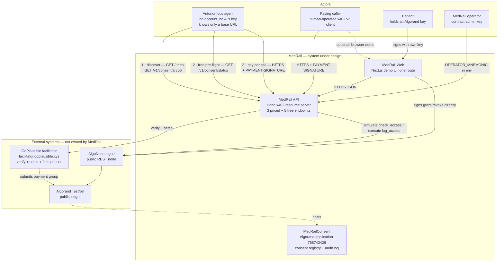
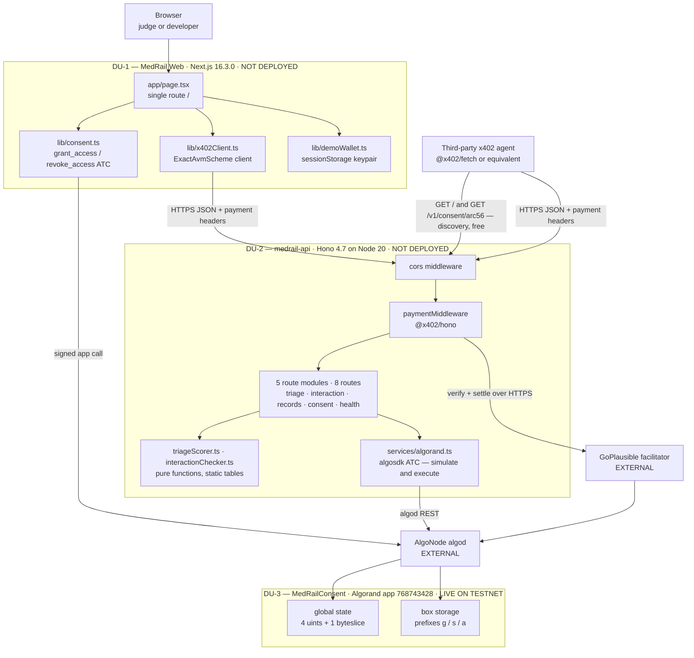
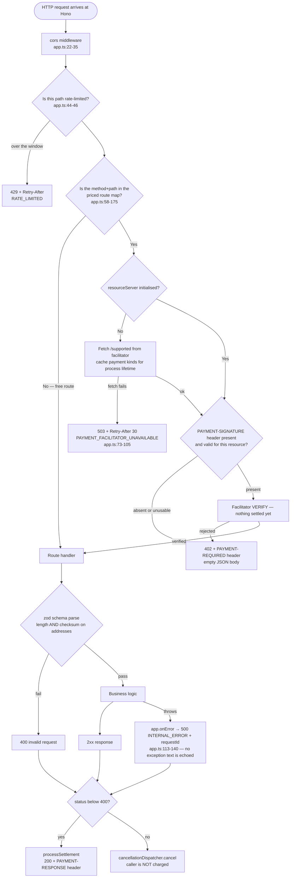

# MedRail — System Architecture

**Purpose:** define the architectural style of MedRail, its context, boundaries, deployment units and technology choices, and record why each was chosen.

**Status of this document:** Descriptive of the code at the working tree on branch `main`, verified against source, the deployed TestNet application `768743428`, and the public Algorand indexer. Every non-obvious claim carries a `path:line` or transaction-ID citation. Status labels are those defined in the project fact ledger: **IMPLEMENTED**, **VALIDATED**, **UNVALIDATED**, **PARTIALLY IMPLEMENTED**, **PLANNED**, **NOT IMPLEMENTED**, **RECOMMENDED**.

Related: [`../02_Requirements/SRS.md`](../02_Requirements/SRS.md) · [`./HLD.md`](./HLD.md) · [`./LLD.md`](./LLD.md) · [`./ADRs/`](./ADRs/) · [`../06_Security/Threat_Model.md`](../06_Security/Threat_Model.md)

---

## 1. Architectural style

MedRail is a **stateless HTTP resource server placed in front of a public blockchain that serves as the sole system of record, with payment verification delegated to an external facilitator.**

Three decisions define the style. Each is load-bearing; removing any one changes what the system is.

| Decision | What it means concretely | Where it lives |
|---|---|---|
| **Stateless resource server** | The API process holds no session, no user account, no cache, no queue, no local persistence. Every request is answered from its own payload plus two immutable in-process tables plus live chain reads. Restarting the process loses nothing. | No datastore import exists anywhere in `api/src`. NFR-001 **IMPLEMENTED**. |
| **Ledger as the only system of record** | Consent state and the audit trail live in Algorand box storage under application `768743428`. There is no mirror, no projection, no read model. | `contracts/smart_contracts/consent/contract.py:114-116` |
| **Payment verification delegated** | The server never validates a signature, never inspects a payment transaction, and never queries algod about settlement. It hands the `PAYMENT-SIGNATURE` header to the GoPlausible facilitator and trusts the verdict. | `api/src/x402.ts:6-14` |

The result is a system with an unusually small amount of code between an HTTP request and a durable, publicly verifiable fact. It is also a system whose failure modes are almost entirely *other people's* failure modes — the facilitator's and AlgoNode's. Section 8 and [`./HLD.md`](./HLD.md) treat that honestly.

### What this system is not

There is **no database, no cache, no queue, no message bus, no background worker, and no ML model** in this repository. The two "AI" endpoints are deterministic rule engines over static tables (`api/src/services/triageScorer.ts:32-44`, eleven rules; `api/src/services/interactionChecker.ts:18`, fourteen pairs loaded from one JSON file). Any architecture diagram of MedRail that shows a datastore box other than "Algorand boxes" or the two static reference files is wrong.

---

## 2. System context

### 2.1 Actors and external systems

| Party | Type | Role | Trusted by MedRail? |
|---|---|---|---|
| **Paying caller** | Human-operated client — the `web/` demo, a script, or `curl` plus an x402 signer | Presents an x402 payment and consumes a priced endpoint. Any off-the-shelf x402 v2 client works. | No. Fully untrusted. |
| **Autonomous agent** | Software, with no human in the loop | **Discovers** the service from `GET /` — endpoints, prices, gates, App ID, CAIP-2 network and the ARC-56 spec URL — then decides which priced routes a task needs, reads the free consent oracle before spending on the gated one, and pays per call. It holds no MedRail account, no API key and no prior relationship; the only MedRail-specific value it is given is a base URL. Worked reference: `api/scripts/agent-demo.ts`. | No. Fully untrusted — and it needs no trust, because the payment is the credential (TB-1). |
| **Patient** | Human with an Algorand key | Grants and revokes consent by signing `grant_access` / `revoke_access` directly against the chain. Never interacts with the API to do so. | Not applicable — the patient's authority is enforced on-chain by `Txn.sender`, not by the API. |
| **MedRail operator** | Holder of `OPERATOR_MNEMONIC` | Contract `admin`; the only account that may write audit entries or move app funds. | Fully trusted. This is the system's single hot key. |
| **GoPlausible facilitator** | External service, `https://facilitator.goplausible.xyz` | Publishes supported payment kinds, verifies and settles `exact`-scheme AVM payments, sponsors network fees. | **Trusted for settlement truth.** Standard x402 trust model; see §7. |
| **AlgoNode algod** | External public node | The only chain endpoint the running system calls: `getTransactionParams`, `simulate`, `execute`. | Trusted for chain truth; no fallback endpoint, no API key, no timeout (`api/src/services/algorand.ts:5`). |
| **AlgoNode indexer** | External public service | **Not a runtime dependency.** `config.indexerServer` is resolved (`api/src/config.ts:51`) but no module reads it — verified by grep across `api/src`, `web/lib`, `web/components`. Used only out-of-band by humans and by explorer links. | n/a |
| **Algorand TestNet** | Public blockchain | Executes `MedRailConsent`, holds all durable state, settles USDC transfers. | Trusted as the system of record. |

### 2.2 System context diagram

Rendered as a Mermaid flowchart rather than the experimental `C4Context` syntax, for portability. Boundaries are drawn as subgraphs.

**Reading the diagram.** Two paths reach the chain and they are deliberately separate. Consent *writes* go browser → algod, never through the API (`web/lib/consent.ts:44-89`) — this is what makes NFR-008 true. Audit *writes* go API → algod under the operator key (`api/src/services/algorand.ts:140-179`). The API therefore never holds a patient key, and the browser never holds an admin key.

The agent's three edges are one actor, drawn separately because they are three different kinds of interaction with the same surface: a **discovery** read that costs nothing and requires nothing, a **free authorisation pre-flight** that lets the agent decline before it spends, and the **paid** call itself. Only the third moves money, and each of the first two exists to make the third correct.

### 2.3 The discovery surface

`GET /` and `GET /v1/consent/arc56` are free, unauthenticated routes, and it would be easy to file them under convenience. They are not: together they are **the integration boundary**, and they are what makes the autonomous-agent actor in §2.1 possible at all.

| Route | What it publishes | What an integrator would otherwise have to be told |
|---|---|---|
| `GET /` | All eight routes as `{method, path, price, gate}`; a `contract` block (`appId`, `network`, `networkCaip2`, `arc56SpecUrl`); an `x402` block (`version: 2`, `scheme: "exact"`, `facilitator`) | Which endpoints exist, what each costs, which are gated and by what, which chain and which application to read, and which payment scheme and facilitator to use |
| `GET /v1/consent/arc56` | The compiled ARC-56 spec for `MedRailConsent` — 13 methods, their selectors, their state schema | How to construct an ABI call against application `768743428` |

Every row in the right-hand column is otherwise a *documentation* dependency: a human reads a README, copies constants into their client, and those constants rot silently. Served as data, they become a runtime lookup — and the difference is the difference between an integration that requires cloning this repository and one that requires a URL.

**The pairing that matters is `gate` plus the free pre-flight.** `GET /` tells a caller that `/v1/records/summary` is gated by `"x402 + on-chain consent"`, and `GET /v1/consent/status` lets it evaluate exactly that gate for **$0.00** before committing $0.05. An agent that reads the first will find the second, and can then decline a call it would have lost. Neither route is useful without the other; that is why both are free and both are advertised.

**The spec route goes one step further and removes MedRail from the path entirely.** An agent that does not want to take the API's word for a grant can build its own ABI client from `/v1/consent/arc56` and read `check_access` off the chain itself (§5.1, FR-015). The HTTP layer is a convenience over a public contract, not a gatekeeper in front of a private one — and the discovery surface is what makes that claim checkable rather than rhetorical.

**Executed, not asserted.** `api/scripts/agent-demo.ts` is a clinical triage agent that receives one task and a base URL and nothing else. It reads `GET /`, learns the eight endpoints and their prices, pays $0.02 for `/v1/triage` and $0.02 for `/v1/interaction-check`, queries the free consent oracle before touching the gated route, then pays $0.05 for `/v1/records/summary` — **$0.09 in total across three settled Algorand transactions, with no account created and no API key issued.** Nothing about MedRail is hardcoded in that script except the base URL: every price it pays is read back out of the index (`agent-demo.ts:157-158`). Transaction IDs are in [`../07_Testing/Test_Results.md`](../07_Testing/Test_Results.md) §5.7, and the message-level flow is [`./Sequence_Diagrams.md`](./Sequence_Diagrams.md) §10.

**Two of the usual limits still apply to that run; the third has changed shape.** It is a **manual verification script, not an automated test**, and it does not run in CI. The API it called was a local process, because nothing is publicly hosted (§4). What is no longer a limit is the identity of the parties: three roles, three separate keypairs. The agent holds its own (`UYBTLPHS6APCXVBDPASQMUIQCEORDIR6EMTVMNSDPSVRSR5HEPKQ5GO4YQ`), which this service does not control; the patient holds a third (`56LFG5EE…`) that is neither the payer nor the payee, and granted *that* agent access in a transaction the patient signed itself — so the consent step runs between genuinely different parties rather than circular, and the identity binding at TB-1 is what carries it (§5.3). The remaining gap is the money's origin, not the mechanics: the agent's TestNet USDC float and the patient's TestNet ALGO were both seeded from the project's own wallet, because TestNet assets have no other practical source, so no external party has paid for this service.

This surface was incomplete until recently: an earlier revision of `GET /` advertised five of the eight routes and omitted both the App ID and the ARC-56 URL, which means the actor described above could not have existed. Finding **G-34 closed**, and `api/test/app.spec.ts` now asserts that the advertised set equals the mounted set so it cannot regress silently.

---

## 3. Trust boundaries

Four boundaries exist. Naming them precisely matters because the system's most severe defect sat exactly on one of them, and the fix is easiest to explain in these terms.

| # | Boundary | Crossed by | What is authenticated | Residual risk |
|---|---|---|---|---|
| **TB-1** | Public internet → MedRail API | Every HTTP request | **The payment, and nothing else.** There is no session, token or login on any endpoint. On the consent-gated route the payment is not merely proof that *a* payment settled — `payerFromRequest` recovers the account that signed it and the handler rejects with 403 unless it equals the asserted `requesterAddress` (`api/src/x402Payer.ts`, `api/src/routes/records.ts:41-52`). SEC-006, SEC-007 **IMPLEMENTED**. | Free routes remain unauthenticated by design and are bounded by rate limiting rather than identity (`api/src/rateLimit.ts`). The two compute endpoints are gated by payment alone, which is all they need — they hold no one's data. |
| **TB-2** | MedRail API → GoPlausible facilitator | Verify/settle calls, and the `/supported` fetch at initialise | Nothing. Plain HTTPS to a configured URL; no mTLS, no signed response verification. | The facilitator's settlement verdict is accepted without independent on-chain confirmation. This is the standard x402 trust model, not a MedRail defect — but it is residual risk. Availability risk is handled but not removed: an outage yields 503 + `Retry-After`, and REL-001 is **PARTIALLY IMPLEMENTED** because no cached fallback or second facilitator exists. |
| **TB-3** | MedRail API → AlgoNode algod | `getTransactionParams`, `simulate`, `execute` | Nothing — public endpoint, no key (`api/src/services/algorand.ts:5`). Transaction authenticity is guaranteed by the signature, not the transport. | No timeout, no retry, no circuit breaker, no second endpoint. REL-003 **NOT IMPLEMENTED**. |
| **TB-4** | Anything → `MedRailConsent` | ABI calls | **Real authentication, enforced by the AVM.** `Txn.sender` is the patient for grant/revoke (`contract.py:158`, `contract.py:188`); `assert Txn.sender == self.admin.value` gates `log_access` and `withdraw_excess` (`contract.py:229`, `contract.py:265`). | The strongest boundary in the system, and the only one that is cryptographically enforced. Both admin rejections are unit-tested. SEC-001, SEC-002, SEC-003 **VALIDATED**. |

The symmetry is now the architecturally interesting fact, where the asymmetry used to be. TB-4 is cryptographically enforced by the AVM: the contract refuses to let anyone but the patient grant consent and anyone but the admin write audit entries. TB-1 used to hand the resulting authorisation decision to whoever asserted an address in a JSON body. It no longer does — and the reason it can be fixed so cheaply is that **an x402 payment is itself a signed transaction**, so the same cryptography that enforces TB-4 is already present at TB-1, in the header the middleware has just verified. Recovering the payer costs one decode and no extra round trip. See [`../06_Security/Threat_Model.md`](../06_Security/Threat_Model.md) and [`./Sequence_Diagrams.md`](./Sequence_Diagrams.md) §7, where the attack is run live against TestNet and blocked.

---

## 4. Deployment units

Exactly three artefacts are deployable. There are no others.

| # | Unit | Artefact | Runtime | Where it runs today |
|---|---|---|---|---|
| **DU-1** | `MedRail Web` | Next.js production build | Node 20 / any static-capable host | Local only. No `vercel.json`, no committed hosting config. **NOT DEPLOYED** publicly. |
| **DU-2** | `medrail-api` | Container image from `api/Dockerfile` (2-stage, `node:20-slim`, root build context, `npm ci`, `.dockerignore` at the repo root) | Node 20, port 4021 | Local only. `api/fly.toml` is now correct — `NETWORK = "testnet"`, `CONSENT_APP_ID = "768743428"`, a `/v1/health` check and `max_machines_running = 1` — but **has never been applied**. NFR-007 **UNVALIDATED**. |
| **DU-3** | `MedRailConsent` | TEAL + ARC-56 spec in `contracts/artifacts/` | Algorand AVM | **Live on TestNet, application `768743428`**, created at round 66088624, `deleted: false`. |

DU-3 is the only unit that is genuinely deployed. Stating this plainly is not a caveat — it is the architecture. The chain-side component is in production; both HTTP components are not.

The recorded `create_txid` in `contracts/artifacts/deploy_testnet.json` is `null` because the run captured in the repo was an idempotent re-run that detected the existing application rather than creating it; `contracts/scripts/deploy_testnet.py` only records `create_txid` when `operation_performed == Create`. The application exists and is independently verifiable; the create transaction ID simply was not captured.

### 4.1 Container diagram

---

## 5. Why there is no database

The ledger *is* the database. This is a real architectural choice with real consequences in both directions, and the honest accounting matters more than the slogan.

### 5.1 What it buys

| Property | Mechanism | Requirement |
|---|---|---|
| The patient owns the record of their own consent | `grant_access` and `revoke_access` take the patient as `Txn.sender` (`contract.py:151`, `contract.py:181`). No operator, no API, and no database administrator can forge a grant. | SEC-003 **VALIDATED** |
| The audit trail cannot be rewritten | No contract method mutates an existing `audit_log` key; the sequence only increments (`contract.py:224-236`). There is no `UPDATE`, because there is no SQL. | DATA-002 **IMPLEMENTED** |
| Anyone can verify the claim without asking MedRail | Every grant, revocation and counter is world-readable from any indexer. `GET /v1/consent/arc56` serves the ABI so third parties can call the contract directly (`api/src/app.ts:63-69`). | FR-015 **IMPLEMENTED** |
| No migration, no backup, no restore for the durable state | Replication is the network's problem. OPS-007 is **NOT APPLICABLE / PARTIALLY ADDRESSED** for the same reason. | — |
| Free reads | `readonly=True` methods are executed with `AtomicTransactionComposer.simulate()` — no fee, nothing submitted (`api/src/services/algorand.ts:98`, `:119`). | SEC-009 **IMPLEMENTED** |

### 5.2 What it costs

| Cost | Detail | Impact |
|---|---|---|
| **Minimum-balance reserve per row** | Each grant box locks `2500 + 400 × (len(key) + len(value))` µALGO. Real cost per grant box: **22,500 µALGO** (key 33 B including the `g` prefix, value 17 B). `GRANT_BOX_MBR` originally read `400 * (32 + 17)` = 22,100, omitting the prefix byte; it is **corrected in source** (`contract.py:55`) with a regression test, though app `768743428` still runs the pre-fix bytecode because the redeploy is deliberately deferred (§5.4). Confirmed on-chain when the app held only its two grant boxes: `min-balance = 145000`, `total-boxes = 2`, `total-box-bytes = 100` — i.e. 100000 base + 2 × 22500, and 2 × (33 + 17) = 100 bytes. | Storage is pre-paid capital, not a monthly bill. REL-006 **PARTIALLY IMPLEMENTED**. |
| **Write latency is block latency** | Every audit entry is a real transaction awaiting consensus. Algorand finalises in roughly three seconds; `atc.execute(algod, 4)` waits up to four rounds before throwing (`api/src/services/algorand.ts:175`). | The paid response path blocks on this. PERF-004 **NOT IMPLEMENTED** — see §6 and [`./HLD.md`](./HLD.md) §5. |
| **Writes cost money and require a hot key** | Only `admin` may write audit entries. `OPERATOR_MNEMONIC` sits in an environment variable and is simultaneously the account that can rotate the admin and drain the app balance. | SEC-012 **NOT IMPLEMENTED**. Highest-value single secret in the system. |
| **Reads need a signer even though they are free** | `simulate()` still requires a sender and signer, so `checkAccess` calls `getOperator()`, which throws without `OPERATOR_MNEMONIC` (`api/src/services/algorand.ts:8-14`, `:84`). | The *free, unauthenticated* `GET /v1/consent/status` has a hard dependency on the admin private key being loaded. Documented in [`./LLD.md`](./LLD.md) §3.4. |
| **Everything is public forever** | Grants name the patient (as sender) and the requester (as an ABI argument), in the clear, permanently. Only the *scope-and-grant graph* is public — no clinical content is (SEC-004, AI-007). | The mitigation is discipline, not cryptography: no PHI is ever written. `records.ts` logs only constant `scope`/`endpoint`/`action` strings (`api/src/routes/records.ts:12-13`, `:58`, `:84`). |
| **No rich queries** | Box storage is a point-lookup keyed store. There is no `WHERE`, no join, no range scan, no pagination, no secondary index. "List every grant this patient issued" is not answerable from the contract; it requires an off-chain indexer scan of application transactions. | Any product feature needing a list or a filter needs an indexer-backed read model that does not exist. **NOT IMPLEMENTED**. |
| **No cross-store transaction** | The payment settles through the facilitator; the audit entry is a separate, later transaction under a different key. They are not atomic. This is deliberate and reasoned in `docs/ARCHITECTURE.md:95-108` — bundling an app call into the client's payment group would break compatibility with off-the-shelf x402 clients. | Consequential in one direction only. The audit write happens *before* the handler responds, and `@x402/hono` settles only on a sub-400 response — so a failed audit write can never leave a caller charged for nothing. What it can cost is the sale, which is why the write is wrapped and degrades to `auditStatus: "pending"` rather than throwing. REL-002 **VALIDATED — satisfied by the SDK**. |

### 5.3 What has been proven on-chain

The audit-log write path — the mechanism this architecture exists to provide — **has now executed on Algorand TestNet.** `total_audit_entries` on app `768743428` is **5** and `total_grants_active` is **4**; the application holds `s`- and `a`-prefixed boxes alongside its grant boxes. `api/scripts/e2e-consent-proof.ts` performs grant → check → paid call → audit append and is repeatable, writing `contracts/artifacts/e2e-consent-proof.json`. FR-012 and FR-025 are **VALIDATED on-chain**.

| Event | Transaction | Round |
|---|---|---|
| `request_access` | `5XIADMCGFP5I7H7AS656RXZS7MFEEPCVJGLA7T3SVE6XDEYSGFFA` | 66088670 |
| `grant_access` | `X2BQ5FD4MW52B75WQGDB67TEULYLN7FHVFO6ZOBNI74PNCAKVOUA` | 66088672 |
| `revoke_access` | `OV2J2T5VWMIQG64JYGL7JEGZKKNZNKCMNIQU6AC4PDRQYZ6ZOO5A` | 66088674 |
| x402 settlement, 20000 µUSDC | `OYRQRKYA7WUKBVLWTOFJSJMZFBW7VCNGP5VGH5EBUJGRCVFQFJRQ` | 66091768 |
| x402 settlement, 50000 µUSDC, consent-gated | `5DKFUULWLTNGKLYLH3TT44F22MHKOFRCEO6K4JVEPOPETFBYOESA` | — |
| `log_access`, sequence 1 | `4YLKLQKKWXXFW3UT5APJVYKXI7T7A6OACTAWCC5YBAN3XGOGHRVQ` | — |
| `grant_access`, patient → the independent agent | `IG4XEBTMRCKI724ZVHSYUN4ECTYBXAGZM5N35NP4Y3ZVWECG7WUQ` | — |
| x402 settlement, 50000 µUSDC, agent → service (§2.3) | `COMJ3TQOGTKP6LXDJS7HZY7B45QZJQWXXJ23HQ3IDDQYD7GRK36A` | 66563944 |

**The honest limits.** The two earlier x402 rows above are self-payments: sender and receiver are both `2WDV2J2FTWF535SMSUVEBOF5IGXF2OTV7ZZTLTCRBXPVS32UMLOPTI64GE`, the account that is deployer and `payTo` and that stood in for the patient in those runs as well. That is no longer true of every payment. Since the agent and patient wallets were provisioned, settlements run between **distinct accounts** — `UYBTLPHS…` pays, `2WDV2J2F…` receives, and the indexer confirms sender ≠ receiver — while the grant that authorises the gated call is signed by a third account again, `56LFG5EE…`, which is neither of them. **But the agent's TestNet USDC float and the patient's TestNet ALGO were both seeded from the project's own wallet**, because TestNet assets have no other practical source, so none of this is third-party payment volume and no external party has paid for the service. Every payment on record is a genuine facilitator-settled x402 transfer with `fee: 0` (fee-sponsored). Nothing is publicly hosted, there is no MainNet deployment, and there is no Bazaar listing.

### 5.4 Why the contract has not been redeployed

Two source-level contract defects are fixed and tested but **not live**: the `AccessRequested` event field order (`contract.py:153`) and `GRANT_BOX_MBR` (`contract.py:55`). `contracts/scripts/deploy_testnet.py` uses `OnUpdate.AppendApp`, which creates a *new* application rather than upgrading in place — so redeploying would mint a fresh App ID and orphan `768743428` together with its entire on-chain history, including every transaction ID cited in these documents and the source-to-chain verification below. The trade was made consciously: keep the evidence, carry two known-benign source/chain divergences, and describe them as exactly that. Neither affects on-chain *state*; one affects an event feed with no consumer, the other an advisory constant.

Note also that the source-to-chain verification — the deployed approval program is byte-identical to the compilation of the committed TEAL, algod compile hash `W4TMZHJOL7FIN5GIGJCWNB2HVI4C4WGVRDVY6BMUUOMWRFHMBJVSPZZ33U` — pins the *deployed bytecode* to the *committed artifacts*, which predate these two source fixes.

---

## 6. Request lifecycle

The full path of a paid request, in order, with no steps omitted.

Four properties of this ordering are worth stating because they are consequences, not accidents:

1. **Settlement is the last step, and it is conditional.** `@x402/hono` verifies before the handler and settles after it, only when the response status is below 400. Every error branch above — 429, 400, 403, 500, and a handler throw — reaches `cancellationDispatcher.cancel` instead. **No error path in this service can consume a settled payment.** REL-002 **VALIDATED — satisfied by the SDK**, and credited as an inherited strength of x402 v2 rather than as MedRail's own engineering.
2. **Payment is enforced before handler validation.** The payment middleware is registered at `api/src/app.ts:58` (wrapped at `:73`) and the route modules at `:107-111`, so an unpaid *malformed* request returns **402, not 400**. `api/test/x402-flow.spec.ts:48-59` documents this deliberately, with a comment explaining the ordering, and accepts either status so the test does not silently encode an accident. A *paid* malformed request returns 400 and the settlement is cancelled — the caller keeps their money.
3. **The 402 challenge requires no per-request outbound call.** Facilitator payment kinds are fetched once and cached, which is why the reviewer measured a warm 402 at roughly 15 ms. PERF-001 **IMPLEMENTED**. The cost of that design is a hard dependency: `accepts[].asset` and `extra.feePayer` come from the facilitator, not from MedRail config (`api/src/x402.ts:16-32` sets no `asset`), so a 402 cannot be constructed offline. A facilitator outage is therefore total for the three priced routes — but it now returns **503 with `Retry-After: 30`** and a stable `PAYMENT_FACILITATOR_UNAVAILABLE` code rather than an opaque 500, which is the difference between an agent backing off and an agent giving up. Free routes stay up — REL-005 **VALIDATED**. REL-001 remains **PARTIALLY IMPLEMENTED**: no cached fallback, no circuit breaker, no second facilitator.
4. **`app.onError` discloses nothing.** It logs the method, path, message and stack server-side against a generated `requestId` and returns `{"code":"INTERNAL_ERROR","retryable":true,"requestId":"…"}`. A 58-character but checksum-invalid address never reaches it in the first place: `api/src/validation.ts`'s `algorandAddress` schema validates the checksum at the route boundary, so that input is a **400** with a field error. SEC-010, SEC-011 **IMPLEMENTED**.

### 6.1 Endpoint inventory

Exactly **eight routes**: three priced and five free, the service index among them. `api/test/app.spec.ts` asserts that the list `GET /` advertises equals the set actually mounted, so the two cannot drift apart again.

| Method | Path | Price | Gate | Handler | Chain I/O |
|---|---|---|---|---|---|
| POST | `/v1/triage` | **$0.02** = 20000 µUSDC | x402 | `routes/triage.ts` → `services/triageScorer.ts` | none |
| POST | `/v1/interaction-check` | **$0.02** = 20000 µUSDC | x402 | `routes/interaction.ts` → `services/interactionChecker.ts` | none |
| POST | `/v1/records/summary` | **$0.05** = 50000 µUSDC | x402 **+ payer binding + on-chain consent**, 30/min | `routes/records.ts` | 1 `simulate` + 1–2 `execute` |
| GET | `/v1/consent/status` | free | none, 60/min | `routes/consent.ts:20-32` | 1 `getTransactionParams` + 1 `simulate` |
| GET | `/v1/consent/app-info` | free | none | `routes/consent.ts:34-41` | none |
| GET | `/v1/consent/arc56` | free | none, 30/min | `app.ts:141-147`, reads from disk | none |
| GET | `/v1/health` | free | none | `routes/health.ts:6-14` | none |
| GET | `/` | free | none | `app.ts:149-176`, service index | none |

The service index at `GET /` returns each route as `{method, path, price, gate}`, plus a `contract` block (`appId`, `network`, `networkCaip2`, `arc56SpecUrl`) and an `x402` block (`version: 2`, `scheme: "exact"`, `facilitator`). The `contract` and `arc56` pair is precisely what a third party needs to build an ABI client without cloning this repository — an earlier revision advertised five of the eight routes and omitted both. Finding **G-34 closed**, with `api/test/app.spec.ts` asserting that the advertised set equals the mounted set. Why that makes the index an architectural component rather than a courtesy is argued in §2.3.

Read the `gate` column as a pair with the free routes above it. Two of the three priced routes are gated by payment alone and have nothing to pre-check; the third is gated by payment **and** an on-chain grant, and the check for that grant is published on the row below it at a price of zero. A caller that reads this table top to bottom can price a call, discover it is conditional, and evaluate the condition without spending — which is the whole of what an agent needs in order to be economical rather than merely capable.

---

## 7. Technology choices

| Layer | Choice | Version | Why — and where the rationale is recorded |
|---|---|---|---|
| Smart-contract language | Algorand Python (`algopy`) compiled by `puyapy` | `puyapy==5.9.0` (`contracts/requirements-dev.txt`) | Rationale not recorded in the implementation. Observable consequence: the contract is 266 readable lines and the ARC-56 spec is generated, not hand-written. |
| On-chain storage | Box storage, not local state | — | Recorded in-code at `contract.py:11-18`: local state would force every requester — including a stranger's read-only agent — to opt in to the application, which is nonsense for a pay-per-call endpoint. Boxes let any `(patient, requester, scope)` triple exist with only the app account paying MBR. |
| API framework | Hono | `^4.7.1` | Rationale not recorded. Observable consequence: `app.request(...)` makes the whole app testable in-process with no server socket — every test in `api/test/x402-flow.spec.ts` uses it. |
| API runtime | Node 20 | `node:20-slim` in both Dockerfiles, `node-version: "20"` in CI | Rationale not recorded. |
| Language | TypeScript, `strict: true` | `^5.7.2` (`api/tsconfig.json:"strict": true`) | NFR-005 **VALIDATED** — `npx tsc --noEmit` passes with zero errors in both `api/` and `web/`. |
| Payment protocol | x402 **v2**, scheme `exact` | `@x402/core`, `@x402/avm`, `@x402/hono` all pinned `2.21.0`; `@x402/fetch` `^2.21.0` | Pinning three of four packages exactly is deliberate for a protocol whose header names differ between v1 and v2. Note `@x402/extensions@2.21.0` is declared in `api/package.json` but **imported nowhere** — verified by grep across `api/src`, `api/scripts`, `web/lib`, `web/components`. MedRail therefore does **not** implement the Bazaar discovery extension; what it has is metadata in a compatible *shape*, since each priced route declares `description` and `mimeType` alongside its `accepts[]`. `docs/COMPLIANCE.md` states this correctly, and no Bazaar listing exists. Finding **G-17 closed** by removing the over-claim, not by wiring the extension. |
| Facilitator | GoPlausible, `https://facilitator.goplausible.xyz` | — | The Algorand-network AVM facilitator for this challenge. Supplies the USDC asset id and `extra.feePayer` so callers need USDC but not ALGO. |
| Settlement asset | USDC ASA `10458941` (TestNet) / `31566704` (MainNet), 6 decimals | `api/src/config.ts:15-19` | Resolved from the `"$0.02"` string by the scheme's default money parser; no `asset` field is set in route config (`api/src/x402.ts:16-19`, with the reason in-comment). |
| Chain SDK | `algosdk` | `^3.6.0` in both `api/` and `web/` | ABI methods are hand-constructed as `ABIMethod` literals rather than parsed from ARC-56 (`api/src/services/algorand.ts:16-19`) to avoid algosdk's ARC-56-vs-ARC-4 parsing drift. Trade-off analysed in [`./LLD.md`](./LLD.md) §3.1. |
| Validation | `zod` | `^3.24.1` | Applied in all four request-accepting routes. Address fields use the shared `algorandAddress` schema (`api/src/validation.ts`), which chains `.length(58)` with `.refine(algosdk.isValidAddress)` so a bad checksum is a **400** at the boundary rather than a throw deep in the chain gateway. FR-038, SEC-010, SEC-011 **IMPLEMENTED**. |
| Rate limiting | in-house, `api/src/rateLimit.ts` | — | Fixed-window, in-memory, scoped to the surface that is free *to the caller*: `/v1/consent/status` 60/min, `/v1/consent/arc56` and `/v1/records/summary` 30/min. Priced happy paths are deliberately unthrottled — settling USDC per call is a stronger limiter than a counter. SEC-013 **IMPLEMENTED**. Per-process and keyed on a spoofable forwarded IP, so it is a courtesy guard, not a security boundary. |
| Frontend | Next.js App Router + React + Tailwind | `next 16.3.0`, `react 19.2.8`, Tailwind 4 | One route (`/`). Two static routes are emitted at build (`/` and `/_not-found`), both prerendered. |
| Test tooling | `vitest` (API), `pytest` + `algorand-python-testing` AVM simulator (contract) | `vitest ^4.1.10`, `algorand-python-testing==1.1.0` | 93 API tests + 28 contract tests = **121 passing**. Frontend has **zero tests** of any kind, and `api/src/services/algorand.ts` still has no dedicated unit-test file (finding **G-05**). |

---

## 8. Known architectural weaknesses

Recorded here because they are properties of the architecture, not of any single line of code. Each is expanded in the linked document. Findings closed since the review are listed separately below, because a document that only ever lists problems tells a reader nothing about direction.

| ID | Weakness | Requirement | Detail |
|---|---|---|---|
| **G-05** | `api/src/services/algorand.ts` has no dedicated unit-test file. Its box-key derivation is pinned indirectly by `api/test/boxKeyParity.spec.ts`, but its `simulate` reads, sequence prediction and lock are covered only end-to-end by the scripts in `api/scripts/`. | — | [`./LLD.md`](./LLD.md) §3 |
| **G-11** | `withPatientLock` serialises audit writes **in-process only**. `api/fly.toml` now pins `max_machines_running = 1` so the deployment matches that assumption — which resolves the contradiction and creates a scaling ceiling. Horizontal scaling needs a shared sequencer or a contract-side allocation change first. | REL-004 **IMPLEMENTED for a single machine** | [`./LLD.md`](./LLD.md) §3.6 |
| **G-15** | No metrics, no tracing, no alerting. Two structured events exist (`audit_write_failed`, `facilitator_unavailable`) and `app.onError` emits a `requestId`, but nothing collects, aggregates or alerts on any of it. The operator account's ALGO balance and the app account's MBR headroom are unmonitored. | OPS-005 **NOT IMPLEMENTED** | [`./ADRs/ADR-012-observability-strategy.md`](./ADRs/ADR-012-observability-strategy.md) |
| **REL-001** | A facilitator outage is total for the three priced routes. It is now reported honestly — 503, `Retry-After: 30`, stable error code — but there is no cached `/supported` fallback, no circuit breaker and no second facilitator. | REL-001 **PARTIALLY IMPLEMENTED** | §6 above |
| **REL-003** | No timeout, no retry and no circuit breaker on `Algodv2` (`api/src/services/algorand.ts:5`, `:175`). `atc.execute(algod, 4)` waits four rounds and throws. | REL-003 **NOT IMPLEMENTED** | [`./LLD.md`](./LLD.md) §3.5 |
| **G-24** | No performance measurement of any kind. The two latency figures quoted anywhere in these documents (a ~15 ms warm 402, a 505 ms cold consent read) are single observations, not percentiles. | PERF-* **UNVALIDATED** | [`./HLD.md`](./HLD.md) |
| **Source/chain divergence** | Two contract fixes are in source but not deployed — the `AccessRequested` field order and `GRANT_BOX_MBR`. Deliberate: redeploying would mint a new App ID under `OnUpdate.AppendApp`. | FR-024, FR-032 **corrected in source, redeploy deferred** | §5.4 above |
| **Nothing is hosted** | DU-1 and DU-2 have never been deployed publicly. There is no MainNet deployment and no Bazaar listing. Payments do now settle between independent accounts, but the paying agent's float was seeded from the project's own wallet, so no external party has paid for the service. | NFR-007 **UNVALIDATED** | §4 above |

### 8.1 Closed since the review

| ID | Was | Now |
|---|---|---|
| **G-01** | The consent gate was not an access control — `requesterAddress` was caller-asserted and never bound to the payer. | `api/src/x402Payer.ts` recovers the payer from the verified `PAYMENT-SIGNATURE` header and `records.ts` returns 403 on a mismatch. Six unit tests plus a live TestNet attack simulation (`contracts/artifacts/g01-verification.json`). SEC-006, SEC-007, SEC-008, FR-039 **IMPLEMENTED**. |
| **G-02** | `log_access` had never executed on TestNet. | `total_audit_entries = 5`, repeatable via `api/scripts/e2e-consent-proof.ts`. |
| **G-03** | The denied path was documented as charged and returned `charged: false`. | A 403 cancels settlement, so the caller pays nothing. The response carries `charged: false` and a pointer to the free pre-flight, and the success-path audit write is guarded. |
| **G-04** | A facilitator outage returned an opaque 500. | 503 + `Retry-After: 30` + `PAYMENT_FACILITATOR_UNAVAILABLE`. |
| **G-06** | CI triggered only on `main` while the branch was `master`, so it had never run. | Triggers on `[main, master]` plus `workflow_dispatch`, with caching, `npm audit --audit-level=high` and an artifact-freshness gate. The branch is now `main`. |
| **G-07 / G-13 / G-14** | `api/fly.toml` pointed at MainNet with no App ID; no `.dockerignore`; non-reproducible builds. | TestNet, `CONSENT_APP_ID = "768743428"`, a `/v1/health` check, `max_machines_running = 1`, `.dockerignore` at the repo root and in `web/`, `npm ci` in both Dockerfiles. |
| **G-08** | Three box-key derivations with no cross-check. | `api/test/fixtures/box-key-vectors.json`, asserted from `boxKeyParity.spec.ts` (Node + WebCrypto) and `contracts/tests/test_box_keys.py`. NFR-011 **VALIDATED**. |
| **G-09** | No rate limiting anywhere. | `api/src/rateLimit.ts` on the free and refundable surface. |
| **G-10** | A bad address checksum returned 500 and `app.onError` echoed `err.message`. | 400 with a field error; generic error body plus a server-side `requestId`. |
| **G-16 / G-27** | A high-severity advisory shipped in the frontend dependency tree. | `npm audit fix` run in both packages; both report 0 vulnerabilities. |
| **G-30** | `payTo` defaulted to an empty string with no validation. | `assertPayToConfigured()` refuses to boot without a checksum-valid `PAY_TO_ADDRESS`. |
| **G-34** | `GET /` advertised five of eight routes and omitted the ARC-56 spec and App ID. | All eight routes with `method`/`path`/`price`/`gate`, plus `contract` and `x402` blocks, asserted by test. |
| **REL-002** | Documented as "a 500 after settlement loses the caller's money". | Factually wrong and withdrawn. `@x402/hono` settles only on a sub-400 response, so no error path can consume a settled payment. **VALIDATED — satisfied by the SDK.** |

---

## 9. Scope note

`docs/SENTINEL_ARCHITECTURE.md` described a different, **unbuilt** product — "Sentinel Exchange", a pharma supply-chain system with a FastAPI engine, SQLite, forecasting models, a second smart contract and five additional frontend routes. None of it exists in this repository, and nothing in this document derives from it. It has been relocated to [`../future/SENTINEL_EXCHANGE_PROPOSAL.md`](../future/SENTINEL_EXCHANGE_PROPOSAL.md) as an explicit proposal rather than sitting alongside descriptive architecture. Finding **G-19 closed**.
