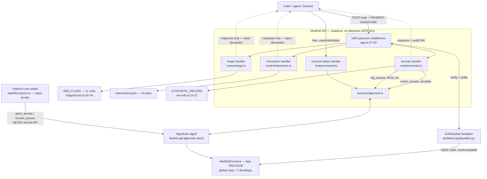

# MedRail — Data Flow and Lineage


> **⚠ Correction notice.** Parts of this document were written against a review finding that was
> later proven wrong. Settlement in x402 v2 happens **only** on a sub-400 response, so **no error
> path in MedRail can consume a settled payment** — and consent-denied calls (HTTP 403) are **not
> charged**, contrary to `API.md`, `SECURITY.md`, and the `paidButDenied` field. The audit-sequence
> race causes a **rejected transaction**, not a corrupted log. See
> [`CORRECTIONS.md`](../CORRECTIONS.md) — it supersedes any statement here that contradicts it.

**Purpose:** trace every piece of data in MedRail from where it originates, through what transforms it, to where it comes to rest — and state precisely how long it lives and who can read it.

**Status of this document:** **IMPLEMENTED** — all flows were traced through source. The `log_access` write path (§3.3) is **UNVALIDATED on-chain**: it has never executed on Algorand TestNet (evidence gap E-1). The public-visibility analysis in §5 is **VALIDATED** — the reviewer reconstructed a live grant box key end-to-end from public indexer data alone (§5.3).

---

## 1. The two sentences that matter most

> **Free-text clinical input — the `symptoms` string and the `medications` array — is processed entirely in memory and is never persisted anywhere. Not to the Algorand ledger. Not to a file. Not to a log line. Not to a database, because there isn't one.** (AI-007, **IMPLEMENTED**.)

> **Everything MedRail *does* write to Algorand is world-readable forever, and the grant transactions publish `(patient, requester, scope)` in cleartext — which is what makes finding S-1 exploitable in practice rather than only in theory.** (§5.)

Both claims are demonstrated below rather than asserted.

---

## 2. Origin inventory — where every value comes from

| Data | Originates at | Enters the system via | First transform | Class (§6) |
|---|---|---|---|---|
| `symptoms` free text | the caller (a human or an agent) | `POST /v1/triage` body | `z.string().min(1).max(2000)` then `.toLowerCase()` (`triageScorer.ts:54`) | transient |
| `medications[]` | the caller | `POST /v1/interaction-check` body | zod array validation, then `trim().toLowerCase()` (`interactionChecker.ts:32-34`) | transient |
| `patientId`, `requesterAddress` | the caller — **self-asserted** | `POST /v1/records/summary` body | `z.string().length(58)` only (`records.ts:5-8`) | transient → **public-on-chain** |
| `patient`, `requester`, `scope` | the caller | `GET /v1/consent/status` query | `z.string().length(58)` / `.min(1)` (`consent.ts:6-10`) | transient |
| Payment signature | the paying client's wallet | `PAYMENT-SIGNATURE` header | decoded and verified by `@x402/hono` middleware | transient (and never seen by MedRail's handlers) |
| Red-flag table (11 rules) | committed source | compiled into the bundle | none — it is a `const` array | static-reference |
| Interaction table (14 pairs) | `api/src/data/interactions.json` | `readFileSync` once at module load (`interactionChecker.ts:18`) | `JSON.parse` | static-reference |
| `SYNTHETIC_RECORD` | committed source | compiled into the bundle | none | static-reference |
| ARC-56 spec | `contracts/artifacts/MedRailConsent.arc56.json` | `readFileSync` **per request** (`app.ts:63-68`) | `JSON.parse` | static-reference |
| Grant state | **the patient**, signing `grant_access` with their own key | Algorand transaction, direct from `web/lib/consent.ts` — **never through the API** | `sha256` key derivation + ARC-4 encoding in the AVM | **public-on-chain** |
| Audit entries | the MedRail backend's operator account | `log_access` app call (`algorand.ts:146-179`) | ARC-4 encoding in the AVM | **public-on-chain** |
| USDC settlement | the paying client, settled by the GoPlausible facilitator | `axfer` transaction on Algorand | none | **public-on-chain** |
| `asset` id, `extra.feePayer` | **the facilitator's `/supported`**, fetched at startup | HTTPS call from `HTTPFacilitatorClient` (`x402.ts:6`) | none | transient (in-process cache) |
| `OPERATOR_MNEMONIC` | operator's environment | `dotenv` at `config.ts:1` | `mnemonicToSecretKey` on first use (`algorand.ts:12`) | **secret** |
| `DEPLOYER_MNEMONIC` | `contracts/.env` | `dotenv_values` in the deploy scripts | — | **secret** |
| Demo wallet mnemonic | generated **in the browser** | `algosdk.generateAccount()` (`demoWallet.ts:23`) | JSON-stringified into `sessionStorage` | **secret** (TestNet-only, bounded impact) |

---

## 3. The four flows

### 3.0 Overview



Note what the diagram does **not** contain: no database, no cache, no queue, no worker, no log sink, no object store. That absence is the design, not an omission.

### 3.1 Flow A — the two intelligence endpoints (`/v1/triage`, `/v1/interaction-check`)

This is the flow where the privacy claim lives, so it is traced statement by statement.

| Step | What happens | Where | What is retained afterwards |
|---|---|---|---|
| 1 | Request arrives with a JSON body and, if paying, a `PAYMENT-SIGNATURE` header. | `app.ts:37-50` | nothing |
| 2 | x402 middleware verifies and settles the payment via the facilitator. **The settlement transaction carries no request content** — it is a plain USDC `axfer` with a note like `x402-payment-v2-1786140083822`. | `@x402/hono` | a public `axfer` on Algorand, containing **no clinical data** |
| 3 | `await c.req.json()` parses the body; `.catch(() => ({}))` converts a parse failure into an empty object so zod produces a clean 400. | `triage.ts:12`, `interaction.ts:12` | a short-lived JS object |
| 4 | zod validates. On failure, the response echoes `parsed.error.flatten()` — field names and generic messages, **never the submitted values**. | `triage.ts:13-15` | nothing |
| 5 | `scoreTriage` lower-cases the text and substring-matches 11 fixed rules; `checkInteractions` trims/lower-cases names and scans 14 fixed pairs. Both are **pure functions over static tables** — no I/O, no network, no state (NFR-009, AI-001, **VALIDATED**). | `triageScorer.ts:53-73`, `interactionChecker.ts:36-55` | nothing |
| 6 | The result object is serialised to JSON and returned. The request object becomes garbage. | `triage.ts:17` | nothing |

**Retention: zero.** Specifically, and each of these was checked:

| Possible sink | Present? | Evidence |
|---|---|---|
| Algorand ledger | **no** | neither route calls `algorand.ts` at all; `log_access` is only reachable from `records.ts` |
| Disk | **no** | the only `writeFileSync` in the repo is in `api/scripts/e2e-proof.ts`, a manual proof script, and it writes a triage *response*, never an input |
| Application logs | **no** | the only logging in the API is `console.log` at boot (`index.ts:6`) and `console.error(err)` in the error handler (`app.ts:59`). Neither prints a request body. |
| In-memory cache | **no** | no cache exists; `patientQueues` (`algorand.ts:129`) stores promises keyed by patient address and is never touched by these routes |
| Metrics / traces | **no** | none exist (OPS-003, OPS-004, **NOT IMPLEMENTED**) |

**The honest caveat, stated because a reviewer will look for it.** `console.error(err)` at `app.ts:59` logs the *exception object*. For the errors this codebase actually produces (zod is handled before it; algosdk address errors carry only the offending address string) no clinical free text reaches that line. But it is an unstructured catch-all: an exception thrown by a future handler that embedded request content in its message would be logged verbatim. The AI-007 guarantee currently holds by *construction* (no code path carries the text to a sink), not by an enforced redaction policy. A structured logger with explicit field allow-listing is **RECOMMENDED** (OPS-002 is **NOT IMPLEMENTED**).

### 3.2 Flow B — consent status read (`GET /v1/consent/status`, free)

```
query params ─► zod (length 58 / min 1) ─► checkAccess()
    │
    ├─ requireConsentAppId()          config.ts:61-69      → throws if App ID is 0 (D-1)
    ├─ getOperator()                  algorand.ts:8-14     → throws if OPERATOR_MNEMONIC unset
    ├─ algod.getTransactionParams()   network round-trip #1
    ├─ grantBoxName(p, r, scope)      algorand.ts:64-69    → sha256, may throw on a bad address (R-3)
    └─ atc.simulate(algod)            network round-trip #2 → zero fee, nothing submitted
                                                            → { patient, requester, scope, granted }
```

**Retention: zero.** Nothing is written. `simulate()` does not submit a transaction, costs no fee, and leaves no trace on chain (SEC-009, **IMPLEMENTED**).

Three properties of this flow deserve explicit statement:

1. **A free, unauthenticated endpoint depends on the operator private key.** `checkAccess` needs a sender and a signer for the simulated call, so `getOperator()` runs even here (`algorand.ts:83-84`). Without `OPERATOR_MNEMONIC` the free endpoint 500s.
2. **It makes two outbound algod calls per request**, with no rate limit (SEC-013, **NOT IMPLEMENTED**), no timeout and no retry (R-4, REL-003). It is therefore usable both to exhaust MedRail and to amplify traffic at AlgoNode.
3. **A single cold observation measured 505 ms** (VERIFIED_FACTS §12) — two sequential round trips. That is one sample on a developer laptop, not a benchmark, not a p50, and not an SLO. No performance target exists (PERF-002, **NOT IMPLEMENTED**).

### 3.3 Flow C — the consent-gated record (`POST /v1/records/summary`, $0.05)

This is the only flow that both spends money and writes to the ledger.

```
1. x402 middleware settles $0.05 USDC ─────────► public axfer on Algorand
2. zod: patientId(58) + requesterAddress(58)     ← length only; identity NOT authenticated (S-1)
3. checkAccess(patientId, requesterAddress, "records:summary")   ← simulate, no write
4a. DENIED  → logAccess(..., "consent_denied").catch(() => undefined)   ← failure swallowed
             → 403 { paidButDenied: true }
4b. ALLOWED → logAccess(..., "consent_checked")                        ← failure NOT caught (R-2)
             → getAuditCount()  [simulate]  → predict seq = count+1
             → atc.execute(algod, 4)        → REAL transaction, operator pays the fee
             → 200 { summary: SYNTHETIC_RECORD, auditTxId, auditSequence }
```

**What comes to rest, per successful call:**

| Artefact | Location | Retention | Readable by |
|---|---|---|---|
| USDC `axfer` for 50,000 base units | Algorand ledger | permanent | anyone |
| `audit_log` box (`0x61 ‖ patient ‖ itob(seq)`, 100–101 B value) | App `768743428` box storage | **permanent — no method deletes a box** | anyone with algod/indexer box access |
| `audit_seq` box (first access for that patient only) | same | permanent | anyone |
| `total_audit_entries += 1` | app global state | permanent | anyone |
| Response body | nowhere — streamed to the caller | none | the caller |

**What does *not* come to rest:** the `SYNTHETIC_RECORD` is a constant, so no record data is ever written or copied; and `patientId` is **not** used to select data — only to select which grant box is consulted (`records.ts:32`) and what to write into the audit entry (`records.ts:49`). DATA-004, **IMPLEMENTED**.

**Two failure asymmetries, both material:**

| | Denied path | Allowed path |
|---|---|---|
| Audit write | `.catch(() => undefined)` (`records.ts:37`) | **uncaught** (`records.ts:49`) |
| If the chain write fails | caller still gets a coherent `403` with `paidButDenied: true` | caller gets **HTTP 500 after the $0.05 has settled**, with no refund path, no retry token, and no record delivered |

The second column is finding **R-2** (REL-002, **NOT IMPLEMENTED**). The triggers are ordinary operational conditions, not exotic ones: operator account out of ALGO, app account out of MBR headroom (see [`Database_Design.md`](Database_Design.md) §7.3), algod 5xx, or the 4-round validity window expiring in `atc.execute(algod, 4)`.

**And the audit entry records a claim, not a fact.** `AuditEntry.requester` is the caller's self-asserted `requesterAddress`. A successful impersonation therefore writes a *false attribution* into an immutable per-patient trail — arguably worse than no trail, since the record derives its credibility from being on chain. SEC-008, **NOT IMPLEMENTED**. See [`../06_Security/Threat_Model.md`](../06_Security/Threat_Model.md).

### 3.4 Flow D — consent grant and revoke (never touches the API)

```
Patient's browser
  ├─ demoWallet.mnemonic  (sessionStorage, TestNet-only)
  ├─ GET {API_BASE}/v1/consent/app-info  →  consentAppId   ← the ONLY backend involvement
  ├─ grantBoxName() via crypto.subtle.digest("SHA-256")     web/lib/consent.ts:26-34
  ├─ algosdk ATC  → grant_access(requester, scope, duration)
  └─ signed LOCALLY, submitted DIRECTLY to AlgoNode algod   web/lib/consent.ts:55-67
```

**The backend never holds, receives, or proxies a patient's signing key.** Verified: there is no key-ingress path anywhere in `api/src/`; the only mnemonic the backend reads is the operator's own. NFR-008 / FR-035, **IMPLEMENTED**. This is a genuine strength of the design and should be credited as such.

The flow's data residue is entirely on chain: one grant box (22,500 µALGO of permanently locked MBR) and one `AccessGranted` ARC-28 event in the transaction's logs.

---

## 4. Data classification

| Class | Definition | Members | Retention | Who can read it |
|---|---|---|---|---|
| **Public-on-chain** | Written to the Algorand ledger. Immutable, replicated, permanent, world-readable. | Grant boxes (`status`, `granted_at`, `expires_at`); audit boxes (`ts`, `requester`, `scope`, `endpoint`, `action`); `audit_seq` counters; all 5 global state keys; every `grant_access` / `revoke_access` / `request_access` / `log_access` transaction with its ABI arguments; all ARC-28 event logs; every USDC settlement `axfer` | **permanent** — no delete path exists, and the application itself cannot be deleted (`approval.teal:33-36`) | **anyone** |
| **Transient-in-memory** | Exists only for the lifetime of one HTTP request or one process. | `symptoms`; `medications[]`; the `patientId`/`requesterAddress`/`scope` strings before they are used; the decoded payment payload; the facilitator's cached `/supported` kinds; `patientQueues` promise chain | request lifetime (or process lifetime for the two caches) | the process only |
| **Static-reference** | Committed to the repository, compiled into the artefact, read-only at runtime. | `RED_FLAGS` (11 rules); `interactions.json` (14 pairs); `SYNTHETIC_RECORD`; `MedRailConsent.arc56.json`; `deploy_testnet.json` | until the next build | anyone with the repo, and `interactions.json`'s `source` + the ARC-56 spec are served publicly by the API |
| **Secret** | Must never appear in a repository, a log, a response, or an image layer. | `OPERATOR_MNEMONIC`; `DEPLOYER_MNEMONIC`; `PROOF_MNEMONIC`; the browser demo-wallet mnemonic | env/process lifetime; `sessionStorage` for the demo wallet | intended: the operator only |

### 4.1 Secret handling — verified state

| Control | Status | Evidence |
|---|---|---|
| Secrets excluded from version control | **VALIDATED** | `.gitignore` covers `.env`, `.env.local`, `*.mnemonic`, `contracts/.env`; `git ls-files` shows only `.env.example` files tracked. SEC-005. |
| Secrets excluded from the container build context | **NOT IMPLEMENTED** | **there is no `.dockerignore` anywhere in the repo.** `api/Dockerfile`'s build context is the repo root, so `api/.env` and `contracts/.env` are transmitted into the build daemon. They are not `COPY`'d into any layer today, so no secret currently lands in a published image — but the margin is one careless `COPY api/ ./api/`. SEC-015; defect D-3. |
| Secrets excluded from responses | **PARTIALLY** | no secret is returned, but `app.ts:58-61` returns `err.message` verbatim to unauthenticated callers, which leaks internal detail (SEC-011, **NOT IMPLEMENTED**; finding R-3). |
| Key rotation | **PARTIALLY** | the contract supports `set_admin` (FR-029, **VALIDATED**), but there is no rotation procedure, schedule, or runbook (SEC-012). |
| Multisig / HSM for the admin key | **NOT IMPLEMENTED** | a single hot mnemonic in an env var, which is simultaneously the contract admin, the audit writer, and the withdrawal authority. |

---

## 5. What is publicly readable — and why it enables S-1

Everything MedRail writes to Algorand is public. That is normally fine, because MedRail deliberately writes no PHI (SEC-004): an address, a hash, a status byte, two timestamps and three constant strings. The problem is not *content* — it is *relationship metadata*.

### 5.1 The visibility table

| Datum | Publicly readable? | How | Consequence |
|---|---|---|---|
| That a consent grant exists between two specific accounts for a specific scope | **YES, in cleartext** | `grant_access` publishes the patient as `sender` and the requester + scope as ABI arguments 1 and 2 | **the relationship graph is public** |
| The exact scope string | **YES, in cleartext** | ABI argument 2 is an ARC-4 `string` — not hashed, not encrypted | scope names must be treated as public labels |
| The grant's status / timestamps | **YES** | box value readable via algod `/v2/applications/{id}/box` | anyone can see who revoked and when |
| The grant box key | **YES**, and it is **recomputable** from the transaction data alone | §5.3 | hashing the key provides no privacy whatsoever |
| The set of patients who have ever had an access logged | **YES** | `audit_seq` box keys are `0x73 ‖ patient_pubkey` — the pubkey is stored **verbatim, not hashed** | the audit map is fully enumerable by patient |
| Every audit entry's `requester`, `scope`, `endpoint`, `action`, `ts` | **YES** | box values are plaintext ARC-4 | an observer reconstructs each patient's full access history |
| Aggregate counters | **YES** | global state | usage volume is public |
| Every USDC settlement, its amount, payer and payee | **YES** | ordinary `axfer` transactions | payer identity is public — see §5.4 |
| ARC-28 events, including the **swapped** `AccessRequested` fields | **YES** | transaction `logs` | defect **C-1** corrupts a *public* feed |
| `symptoms` / `medications` free text | **NO** | never leaves the process | AI-007 holds |
| Real patient data | **N/A** | none exists — `SYNTHETIC_RECORD` is a constant | DATA-004 |

### 5.2 Live proof, from the public indexer

Transaction `X2BQ5FD4MW52B75WQGDB67TEULYLN7FHVFO6ZOBNI74PNCAKVOUA`, round 66088672, fetched from `https://testnet-idx.algonode.cloud` with no credentials:

```
sender          S56WIB3XLUOXSUGAI6MDJ3GN3RV2NSE7RVV7DGNZJKDCJR4OJLLA6H7HEE   ← the PATIENT
application-id  768743428
arg[0]          8c3ad539                                    ← selector grant_access(address,string,uint64)
arg[1]          157012459b34ec604b3fad12b10675803e073df3a5b50d9112347771450a5b3d
                = CVYBERM3GTWGASZ7VUJLCBTVQA7AOPPTUW2Q3EISGR3XCRIKLM6SBIGUUA  ← the REQUESTER
arg[2]          000f 7265636f7264733a73756d6d617279 = "records:summary"       ← the SCOPE, cleartext
arg[3]          0000000000000000 = 0                                          ← never expires
logs[0]         selector 4d155120 = AccessGranted(address,address,string,uint64), 95 bytes
```

One unauthenticated HTTP request yields the complete triple.

### 5.3 The box key is not a privacy boundary — reproduced end to end

Taking only the three values published above, the reviewer recomputed the box key:

```
sha256( pubkey(S56WIB3X…)  ‖  pubkey(CVYBERM3…)  ‖  utf8("records:summary") )
  = 732f3d5898c5511bd4a2d26ee44724adaf2c046d089b429df1d7a8d7d4287fe2

box key = 0x67 ‖ digest  →  base64  Z3MvPViYxVEb1KLSbuRHJK2vLARtCJtCnfHXqNfUKH/i
```

and `GET /v2/applications/768743428/boxes` returns **exactly that name**. The reconstruction is bit-for-bit correct.

Two conclusions follow, and they point in opposite directions:

- **Positive:** the key derivation specified in `contract.py:96-98` is reproducible by an independent implementation from public data — a useful property for third-party integrators, and incidental evidence that the Python/Node/browser implementations are describing the same function. (It is *not* a substitute for the missing cross-implementation test — NFR-011 remains **UNVALIDATED**.)
- **Negative:** `sha256` here is a *key-shortening* function, not a *privacy* function. Its pre-image is published in cleartext by the very transaction that creates the box. Any document claiming the hashed key conceals the triple would be wrong.

### 5.4 Why this is the S-1 enabler

Chain the facts:

1. `grant_access` publishes `(patient, requester, scope)` in cleartext (§5.2). An attacker enumerates every grant ever made to App `768743428` from the indexer — no permission, no cost, no rate limit.
2. `POST /v1/records/summary` takes `requesterAddress` from the **request body** and never binds it to the payer (`records.ts:7`, `:32`). SEC-007, **NOT IMPLEMENTED**.
3. The attacker pays the ordinary $0.05 from their own wallet and sends `{ patientId: <victim>, requesterAddress: <the authorised third party from step 1> }`.
4. `check_access` returns `true` — because that grant genuinely exists — and the API returns the record. **Any paying stranger can impersonate any authorised requester.**
5. The audit entry then records the *impersonated* requester (`records.ts:49`), writing a false attribution into the immutable log. SEC-008, **NOT IMPLEMENTED**.

**Why it is invisible in this build:** the response is a fixed synthetic constant, so nothing sensitive leaks today; and `web/components/LiveDemoPanel.tsx` sends `requesterAddress: wallet.address`, so in the demo the payer and the requester coincide and the flaw never manifests. Neither of those is a mitigation — they are the reasons nobody has noticed.

**The fix is small and the APIs are already installed:** `@x402/core/http` exports `decodePaymentSignatureHeader` and `@x402/avm` exports `getSenderFromTransaction` (both verified present in `api/node_modules`). Decode `PAYMENT-SIGNATURE`, recover the payer, and reject with `403` unless `payer === requesterAddress`. Full write-up in [`../06_Security/Threat_Model.md`](../06_Security/Threat_Model.md).

### 5.5 A privacy note that is not a defect but should be said out loud

Even with S-1 fixed, this data model publishes the **consent graph**: who authorised whom, for what, and when — plus, via `audit_seq`, the enumerable set of patients with access history, and via `audit_log`, each patient's full access timeline. Nothing about the clinical content leaks, and that is a real achievement (SEC-004). But "who is this person's specialist and when did they read the file" is itself sensitive metadata in a healthcare context. A production system would need scope pseudonymisation, per-patient key rotation, or off-chain commitments with on-chain roots. DATA-006 gestures at this and is **PLANNED** with no code. Any statement to a judge should be *"no clinical content is on chain"* — never *"the on-chain data is anonymous."*

---

## 6. Retention and deletion

| Data | Retention | Deletable? | Mechanism |
|---|---|---|---|
| Grant box | **permanent** | **no** | no contract method calls `box_del`; a revoke overwrites `status` and keeps the box (`contract.py:186-190`) |
| `audit_seq` box | **permanent** | **no** | same |
| `audit_log` box | **permanent** | **no** | same; and DATA-002 (append-only) depends on it |
| Global counters | **permanent** | **no** | monotonic; only `total_grants_active` ever decrements |
| Settlement `axfer` | **permanent** | **no** | ordinary ledger history |
| The application itself | **permanent** | **no** | `approval.teal:33-36` asserts `OnCompletion == 0`; no `DeleteApplication` route exists |
| Request bodies | request lifetime | n/a | never stored |
| Facilitator `/supported` cache | process lifetime | n/a | in-memory only; no invalidation, no refresh |
| Demo wallet | browser session | **yes** | `clearDemoWallet()` (`demoWallet.ts:33-35`) or closing the tab |
| Container logs | whatever the host keeps | host-dependent | unstructured `console.*`; no retention policy is defined anywhere (OPS-002) |

### 6.1 The right-to-erasure problem, stated honestly

A patient can revoke consent, which is a real and meaningful control. A patient **cannot** erase the record that consent once existed, cannot erase who accessed what and when, and cannot erase their address from the ledger. That is inherent to putting a consent registry on an immutable public chain, and it is the direct trade-off for the tamper-evidence the design is built on.

This is *not* a compliance claim in either direction. **No HIPAA, GDPR, SOC 2 or ISO work has been done on this system, no assessment has been performed, and no certification is claimed.** There is no real PHI in the system. What a production version would require — off-chain encrypted payloads with on-chain content-address pointers, key destruction as the erasure primitive, a data-processing agreement, a DPIA — is design direction, marked **RECOMMENDED**, with no code behind it (DATA-006, **PLANNED**).

---

## 7. Lineage summary — one row per datum that leaves the process

| Datum | Origin | Transform | Destination | Retention | Public? |
|---|---|---|---|---|---|
| `symptoms` | caller | lower-case, substring match vs 11 rules | **nowhere** | none | no |
| `medications[]` | caller | trim + lower-case, scan 14 pairs | **nowhere** | none | no |
| triage `score` / `band` / `matchedFlags` | computed | — | HTTP response only | none | only to the caller |
| interaction `matches` | static table | filtered | HTTP response only | none | only to the caller |
| `patientId` | caller (self-asserted) | `sha256` input for the grant key; audit box key | grant box key (hashed), audit box key (verbatim) | permanent | **yes** |
| `requesterAddress` | caller (**unauthenticated** — S-1) | `sha256` input; `AuditEntry.requester` | grant key + **audit entry value** | permanent | **yes** |
| `scope` | hard-coded `"records:summary"` | `sha256` input; `AuditEntry.scope` | grant key + audit entry | permanent | **yes** |
| `endpoint` | hard-coded `"/v1/records/summary"` | — | `AuditEntry.endpoint` | permanent | **yes** |
| `action` | hard-coded `"consent_checked"` / `"consent_denied"` | — | `AuditEntry.action` | permanent | **yes** |
| `ts`, `granted_at`, `expires_at` | `Global.latest_timestamp` (consensus) | — | box values | permanent | **yes** |
| USDC payment | payer's wallet | facilitator settlement | Algorand `axfer` | permanent | **yes** |
| `auditTxId`, `auditSequence` | the `log_access` transaction | `bigint.toString()` for `auditSequence` | HTTP response | none server-side; the transaction is permanent | **yes** |
| `SYNTHETIC_RECORD` | source constant | none | HTTP response | n/a | it is in the public repo |

---

## 8. Cross-references

| Topic | Document |
|---|---|
| Entities and cardinalities of the on-chain model | [`ER_Diagram.md`](ER_Diagram.md) |
| Exact key/value layouts, MBR, capacity, migrations | [`Database_Design.md`](Database_Design.md) |
| Field-level types, sentinels, enums, env vars | [`Data_Dictionary.md`](Data_Dictionary.md) |
| Which of these flows can be queried, and which cannot | [`Indexing_And_Query_Strategy.md`](Indexing_And_Query_Strategy.md) |
| **S-1 in full, plus C-1, R-2 and the admin-key blast radius** | [`../06_Security/Threat_Model.md`](../06_Security/Threat_Model.md) |
| Endpoint contracts and the x402 protocol flow | [`../05_API/API_Documentation.md`](../05_API/API_Documentation.md) |
| The settled-payment proof and its self-payment caveat | [`../PROOF.md`](../PROOF.md) |
