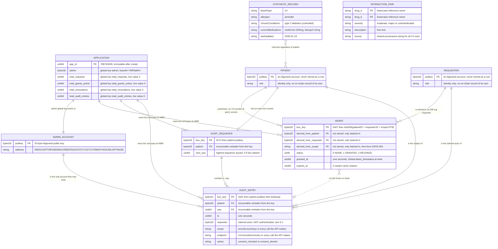
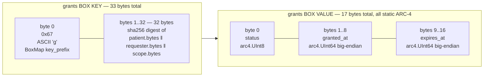
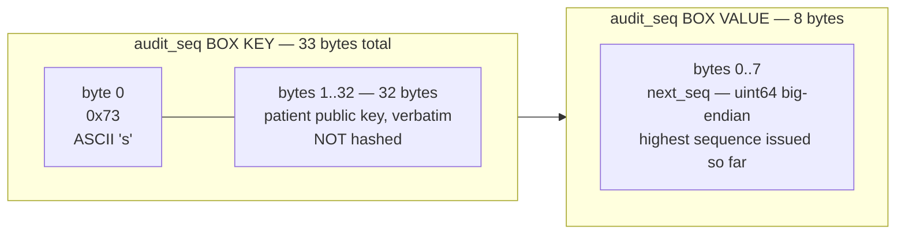
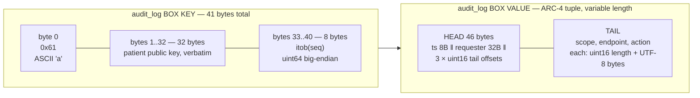

# MedRail — Entity Relationship Model

**Purpose:** model the actual persistent entities of MedRail — Algorand global state and three box maps on App ID `768743428`, plus two static off-chain reference datasets — and show exactly how they relate.

**Status of this document:** **IMPLEMENTED** — every entity, key and cardinality below was read from `contracts/smart_contracts/consent/contract.py`, `contracts/artifacts/MedRailConsent.arc56.json`, and the live TestNet application on 2026-08-21 (`https://testnet-api.algonode.cloud/v2/applications/768743428`). No entity in this document is aspirational, and none is a database table.

---

## 0. Read this before the diagram

**There is no relational database in MedRail.** No Postgres, no SQLite, no MongoDB, no Redis, no ORM, no migration tool, no background worker. The complete set of durable state in the system is:

| # | Store | Location | Mutable by |
|---|---|---|---|
| 1 | Application global state — 4 uints + 1 byteslice | Algorand App `768743428` | contract methods only |
| 2 | `grants` BoxMap (prefix `g` / `0x67`) | App `768743428` box storage | `grant_access`, `revoke_access` |
| 3 | `audit_seq` BoxMap (prefix `s` / `0x73`) | App `768743428` box storage | `log_access` |
| 4 | `audit_log` BoxMap (prefix `a` / `0x61`) | App `768743428` box storage | `log_access` (append-only) |
| 5 | `api/src/data/interactions.json` — 14 pairs | file shipped in the image | nobody at runtime (read once at module load, `interactionChecker.ts:18`) |
| 6 | `SYNTHETIC_RECORD` constant | `api/src/routes/records.ts:15-21` | nobody — it is a TypeScript `const` |

Stores 1–4 are one Algorand application. Stores 5–6 are read-only build artefacts. That is the entire data layer.

Consequently the entities below are **not** tables and the relationships below are **not** foreign keys. See §4 for what "referential integrity" means when the only join mechanism is a hash function.

---

## 1. Logical entity relationship diagram



### 1.1 Reading the diagram

- **`PATIENT` and `REQUESTER` are the same kind of thing** — an ordinary Algorand account. They are drawn as two entities because they occupy two distinct *roles* in every relationship, not because two record types exist. Nothing in the contract stores an account "row"; an account exists in this model only as 32 bytes that are hashed into a key or written into a value.
- **`GRANT` is a box, not a row.** `contract.py:114` declares `BoxMap(Bytes, GrantRecord, key_prefix="g")`; `contract.py:96-98` derives the key.
- **`GRANT }o..o| AUDIT_ENTRY : "no link exists on chain"`** is drawn as a dashed (non-identifying) relationship deliberately: an audit entry records a `(requester, scope, endpoint, action)` tuple but stores **no reference to the grant box that was consulted**, and the grant record stores no back-reference to its accesses. Joining the two requires re-deriving `sha256(patient ‖ requester ‖ scope)` off-chain from the audit entry's own fields. See [`Indexing_And_Query_Strategy.md`](Indexing_And_Query_Strategy.md) §4.
- **`SYNTHETIC_RECORD }o..o{ PATIENT`** is drawn as a non-identifying many-to-many with intent: `api/src/routes/records.ts:55` returns the same constant for every `patientId`. There is no patient-to-record relationship in this system, and the diagram must not imply one (DATA-004).

### 1.2 Live cardinality on App `768743428` (read 2026-08-21)

| Entity | Instances live on TestNet | Evidence |
|---|---|---|
| `APPLICATION` | 1 | `/v2/applications/768743428`, `deleted: false` |
| `GRANT` | **2** — both `status = 2` (`STATUS_REVOKED`), both `expires_at = 0` | `/v2/applications/768743428/boxes` returns exactly 2 names, both 33 bytes with leading `0x67` |
| `AUDIT_SEQUENCE` | **0** | no `s`-prefixed box exists |
| `AUDIT_ENTRY` | **0** | no `a`-prefixed box exists; `total_audit_entries = 0` |
| `INTERACTION_PAIR` | 14 | `api/src/data/interactions.json` |
| `SYNTHETIC_RECORD` | 1 (singleton constant) | `api/src/routes/records.ts:15-21` |

> **Evidence gap E-1.** `AUDIT_SEQUENCE` and `AUDIT_ENTRY` have **never been instantiated on Algorand TestNet.** `log_access` is **UNVALIDATED on real infrastructure** — it is covered only by AVM-simulator unit tests (`contracts/tests/test_consent.py`, 2 cases). Every statement in this document about audit-entry encoding, size and MBR is derived from the contract source and the ARC-4 specification, not from an observed box. Statements about `GRANT` encoding, by contrast, are read directly from the live chain (§3.1).

---

## 2. Relationship enforcement — which links are real constraints

This is the part a reviewer should read carefully. In a relational schema, a foreign key is a *constraint the engine checks*. Here, **not one relationship is checked by anything**. Every link is either (a) recomputed from a key at read time, or (b) unverifiable in principle.

| # | Relationship | Enforcement mechanism | Can it be violated? |
|---|---|---|---|
| R1 | `PATIENT → GRANT` | **Key derivation + `Txn.sender`.** `grant_access` uses `Txn.sender` as the patient half of `grant_key` (`contract.py:151`). The patient cannot be forged because the Algorand consensus layer already authenticated the signature. | **No.** This is the one link with a real cryptographic guarantee. SEC-003. |
| R2 | `REQUESTER → GRANT` | **Key derivation only.** The requester address is an ABI argument, hashed into the key (`contract.py:98`). The requester never signs anything. | Not "violated" as such — a patient may name any address, including one that does not exist. There is no account-existence check. |
| R3 | `GRANT.scope → (anything)` | **None.** `scope` is a free-form `String` by design (DATA-003, `contract.py:149`). There is no enumeration, no lookup table, no length bound. | Any UTF-8 string produces a distinct grant. `"records:summary"` and `"records:summary "` are different grants. |
| R4 | `PATIENT → AUDIT_SEQUENCE` | **Key derivation.** `BoxMap(Account, UInt64, key_prefix="s")` uses the patient's 32-byte public key verbatim as the key body (`contract.py:115`), so the patient is *recoverable* from the key, not merely hashed into it. | No. Bijective. |
| R5 | `AUDIT_SEQUENCE → AUDIT_ENTRY` | **Key derivation + contract invariant.** `log_access` reads `audit_seq[patient]`, increments, writes the counter, then writes `audit_log[patient ‖ itob(next_seq)]` in the same atomic call (`contract.py:224-235`). | Not by the contract. **Yes by an operator race** — see R6. |
| R6 | `AUDIT_ENTRY.seq` uniqueness | **Contract-side: atomic.** The counter write and the entry write are in one transaction, so the AVM cannot interleave them. **Backend-side: `withPatientLock`**, an in-process promise chain (`api/src/services/algorand.ts:129-138`). | The *contract* is safe. The *backend* predicts the box name before submitting (`algorand.ts:158-171`), and that prediction is only serialised within one Node process. Two API machines sharing the operator key would predict the same `seq` and one call's box reference would be wrong. REL-004; contradicted by `api/fly.toml` permitting >1 machine (defect D-7). |
| R7 | `AUDIT_ENTRY.requester → REQUESTER` | **Nothing. Caller-asserted.** `records.ts:7` accepts `requesterAddress` from the request body with only a `z.string().length(58)` check, and passes it straight to `logAccess` (`records.ts:49`). | **Yes, trivially.** This is finding **S-1**. A paying stranger can write any address into any patient's immutable audit trail. SEC-007 / SEC-008 are **NOT IMPLEMENTED**. See [`../06_Security/Threat_Model.md`](../06_Security/Threat_Model.md). |
| R8 | `AUDIT_ENTRY → GRANT` | **Does not exist.** No field links them. | N/A — there is nothing to violate, only something missing. |
| R9 | `ADMIN_ACCOUNT → AUDIT_ENTRY` | **`assert Txn.sender == self.admin.value`** (`contract.py:222`). | No. SEC-001, **VALIDATED** by `test_consent.py::test_log_access_rejects_non_admin`. |
| R10 | `APPLICATION → all boxes` | **Algorand protocol.** Boxes belong to the application account and are charged to its minimum balance. Only this app's program can read or write them. | No. Protocol-enforced. |
| R11 | `SYNTHETIC_RECORD → PATIENT` | **None, and none intended.** | The record is patient-independent by construction (DATA-004). |

### 2.1 The one-line summary

> Exactly two relationships in this model carry a real guarantee: **R1** (the patient signed it) and **R9** (only the admin may write audit entries). Everything else is a naming convention that happens to be collision-resistant.

---

## 3. Physical layout — box keys and values as byte ranges

### 3.1 `grants` — prefix `g` (`0x67`)



**Live example, read from algod on 2026-08-21** — this is a real box on App `768743428`, not an illustration:

```
box name (base64) : ZxVGxI4HmhxwFbb0zjuPUZtVJ3E48U5Vot6SSTe/dpIb
box name (hex)    : 67 1546c48e079a1c7015b6f4ce3b8f519b55277138f14e55a2de924937bf76921b
                    ^^ 0x67 = 'g'          ^^ 32-byte sha256 digest
box name length   : 33 bytes                       <-- note: 33, not 32

box value (b64)   : AgAAAABqdjTNAAAAAAAAAAA=
box value (hex)   : 02 000000006a7634cd 0000000000000000
                    ^^ status = 2 (STATUS_REVOKED)
                       ^^^^^^^^^^^^^^^^ granted_at = 1786131661 = 2026-08-07T19:41:01Z
                                        ^^^^^^^^^^^^^^^^ expires_at = 0 = never expires
box value length  : 17 bytes
```

The second live box (`Z3MvPViYxVEb1KLSbuRHJK2vLARtCJtCnfHXqNfUKH/i`) decodes identically with `granted_at = 1786131734`. Both are revoked, which is exactly consistent with the live global counters `total_grants_active = 0`, `total_revocations = 2`.

The `patient`, `requester` and `scope` that produced these digests are **not recoverable from the box** — sha256 is one-way. They are recoverable from the *transaction history*, which is a separate and security-relevant fact; see [`Data_Flow.md`](Data_Flow.md) §5.

### 3.2 `audit_seq` — prefix `s` (`0x73`)



Because the patient key is stored verbatim rather than hashed, **this box map is enumerable** — any indexer listing `s`-prefixed boxes recovers the full set of patients that have ever been audited. That is a deliberate asymmetry with `grants`, and it has a privacy consequence documented in [`Data_Flow.md`](Data_Flow.md) §5.

**Zero instances currently exist** (evidence gap E-1).

### 3.3 `audit_log` — prefix `a` (`0x61`)



Head layout, exactly:

| Byte range | Length | Field | ARC-4 type | Note |
|---|---|---|---|---|
| 0..7 | 8 | `ts` | `uint64` | static, inline |
| 8..39 | 32 | `requester` | `address` (`byte[32]`) | static, inline |
| 40..41 | 2 | offset of `scope` | `uint16` BE | tail pointer, relative to byte 0 |
| 42..43 | 2 | offset of `endpoint` | `uint16` BE | tail pointer |
| 44..45 | 2 | offset of `action` | `uint16` BE | tail pointer |

Tail layout for the **only** string triple the MedRail API ever writes (`records.ts:10-11`, `records.ts:37`/`records.ts:49`):

| Byte range | Length | Content |
|---|---|---|
| 46..47 | 2 | `0x000F` = 15 — length of `"records:summary"` |
| 48..62 | 15 | `records:summary` |
| 63..64 | 2 | `0x0013` = 19 — length of `"/v1/records/summary"` |
| 65..83 | 19 | `/v1/records/summary` |
| 84..85 | 2 | `0x000F` = 15 — length of `"consent_checked"` |
| 86..100 | 15 | `consent_checked` |

Head offsets are therefore `scope = 0x002E (46)`, `endpoint = 0x003F (63)`, `action = 0x0054 (84)`.

**Total encoded value size: 101 bytes** for `action = "consent_checked"`, **100 bytes** for `action = "consent_denied"` (one character shorter). Total box footprint (key + value) is 142 / 141 bytes respectively.

> This encoding has **never been produced on chain**. It is derived from `contract.py:228-234` and the ARC-4 tuple encoding rules, and is presented here so a reviewer can check the arithmetic — not because a box was observed. Contrast §3.1, where the bytes are real.

### 3.4 Why byte 0 matters more than it looks

All three key diagrams begin with a one-byte prefix, and that byte is the whole of defect **C-2**. `contract.py:52` computes

```python
GRANT_BOX_MBR = 2_500 + 400 * (32 + 17)   # = 22_100
```

which counts the sha256 digest but **omits the `key_prefix` byte that `BoxMap` prepends**. The true key length is 33, so the true MBR is `2_500 + 400 * (33 + 17) = 22_500`. The live chain settles the argument twice over:

- app account `min-balance = 145000` with 2 boxes → `145000 − 100000 = 45000 = 2 × 22500`;
- app account `total-box-bytes = 100` → `2 × (33 + 17) = 100`, whereas `2 × (32 + 17)` would be 98.

Full treatment in [`Database_Design.md`](Database_Design.md) §6.

---

## 4. What "referential integrity" means here

In a relational store, integrity is *enforced*: you declare `FOREIGN KEY (patient_id) REFERENCES patients(id)` and the engine refuses a write that would dangle. There is no engine here. Box storage is a flat, untyped key–value space owned by one application; the AVM will happily create a box whose key is any byte string the program computes.

So MedRail's integrity model is not enforcement — it is **determinism**:

> A relationship holds **iff** an independent party, starting from the same inputs, computes the same key. Integrity is a property of the key-derivation function, not of the store.

### 4.1 What this buys you

| Property | Why the hash-key model delivers it |
|---|---|
| **No opt-in required from either party.** | `contract.py` docstring lines 12-17: local state would force every requester to opt in to the app. A box keyed by `sha256(patient ‖ requester ‖ scope)` lets an arbitrary triple exist without either account touching the application. |
| **Fixed-size keys regardless of scope length.** | `scope` is unbounded free-form text (DATA-003) but the digest is always 32 bytes, so MBR per grant is a constant — which is precisely what makes `get_grant_box_mbr()` expressible as a compile-time constant at all. |
| **No join at write time.** | `check_access` is a single O(1) box read (`contract.py:200-209`). No index, no scan, no lock. |
| **The key is a commitment.** | Knowing the box key proves nothing about the triple, but knowing the triple proves the key. This is the basis of the `readonly` simulate-only read path (SEC-009). |

### 4.2 What this costs you — and these are real costs

| Consequence | Detail |
|---|---|
| **The key is one-way, so the store is not self-describing.** | Given the box `671546c48e…`, nothing on chain tells you which patient, requester or scope produced it. The grant map cannot be dumped into a human-readable report from box data alone. |
| **Three independent implementations must agree byte for byte, forever.** | The derivation exists in Python (`contract.py:96-98`), in Node (`api/src/services/algorand.ts:64-69`, `createHash("sha256")`), and in the browser (`web/lib/consent.ts:26-34`, `crypto.subtle.digest`). **There is no cross-implementation test** (NFR-011, **UNVALIDATED**). Change the prefix, the concatenation order, or the scope encoding in one place and the other two silently address a different box — the grant "disappears" with no error anywhere. This is the single highest-leverage latent defect in the data layer. |
| **`scope` normalisation is a correctness hazard, not a UX detail.** | `"records:summary"` vs `"Records:Summary"` vs `"records:summary "` are three unrelated boxes. Nothing in the contract, the API or the frontend trims or case-folds. A grant issued with a trailing space is invisible to `check_access` and there is no diagnostic that would say so. |
| **There is no `ON DELETE CASCADE`, because nothing deletes.** | No contract method calls `box_del`. A revoked grant keeps its box (`revoke_access` overwrites the value with `status = 2`, `contract.py:186-190`) and keeps its 22,500 µALGO of locked minimum balance forever. |
| **You cannot enumerate a patient's grants.** | The only way to list what a patient has authorised is to already know every `(requester, scope)` pair — i.e. to know the answer. See [`Indexing_And_Query_Strategy.md`](Indexing_And_Query_Strategy.md) §3. |
| **Integrity of the `requester` field is *asserted*, not *derived*.** | R7 above. Because the audit entry's `requester` is a *value* rather than part of a *key*, no amount of key-derivation rigour constrains it. S-1 lives exactly in this gap. |

### 4.3 The honest framing for a reviewer

The hash-key design is the right choice for this problem and it is well executed on the chain side: fixed-cost keys, no opt-in, atomic sequence allocation, admin-gated writes, `readonly` reads that cost nothing. What it cannot do — and what no key-derivation scheme can do — is authenticate a value that is simply handed to the contract by a caller. MedRail's data model is sound; its *authorisation* model is not, and the boundary between the two is exactly the `requester` argument of `log_access`.

---

## 5. Cross-references

| Topic | Document |
|---|---|
| Key construction, MBR economics, lifecycle, capacity model, defect C-2 in full | [`Database_Design.md`](Database_Design.md) |
| Every field, type, encoding, sentinel and constraint | [`Data_Dictionary.md`](Data_Dictionary.md) |
| Origin, transformation, retention and public visibility of every value | [`Data_Flow.md`](Data_Flow.md) |
| Query patterns the code performs vs. the ones the product needs | [`Indexing_And_Query_Strategy.md`](Indexing_And_Query_Strategy.md) |
| S-1, the grant-enumeration attack, and the false-attribution consequence | [`../06_Security/Threat_Model.md`](../06_Security/Threat_Model.md) |
| The HTTP surface that reads and writes this model | [`../05_API/API_Documentation.md`](../05_API/API_Documentation.md) |
