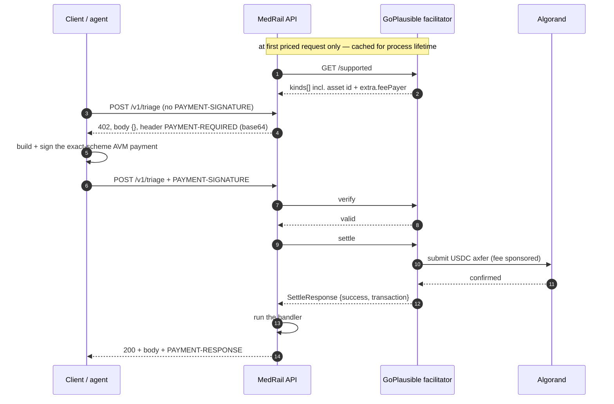

# MedRail — API Reference


> **⚠ Correction notice.** Parts of this document were written against a review finding that was
> later proven wrong. Settlement in x402 v2 happens **only** on a sub-400 response, so **no error
> path in MedRail can consume a settled payment** — and consent-denied calls (HTTP 403) are **not
> charged**, contrary to `API.md`, `SECURITY.md`, and the `paidButDenied` field. The audit-sequence
> race causes a **rejected transaction**, not a corrupted log. See
> [`CORRECTIONS.md`](../CORRECTIONS.md) — it supersedes any statement here that contradicts it.

**Purpose:** the definitive, implementation-verified reference for MedRail's HTTP surface (8 routes: 3 priced, 5 free) and for the `MedRailConsent` on-chain ABI (13 methods) that any third party may call directly.

**Status of this document:** **IMPLEMENTED** — every route, schema, status code and header below was read from `api/src/` and, where the value exists on chain, checked against App ID `768743428` on 2026-08-21. Routes marked **VALIDATED** have automated test coverage; routes marked **UNVALIDATED** are implemented but untested. The success path of `POST /v1/records/summary` is **UNVALIDATED and has never completed end-to-end against the live contract** — see §7.1.

This document supersedes [`../API.md`](../API.md), which remains accurate but incomplete; the drift is itemised in §9.

---

## 1. At a glance

| # | Method | Path | Price | Gate | Handler | Writes on chain? | Test coverage |
|---|---|---|---|---|---|---|---|
| 1 | `POST` | `/v1/triage` | **$0.02** (20 000 µUSDC) | x402 only | `routes/triage.ts` → `services/triageScorer.ts` | no | **VALIDATED** — `x402-flow.spec.ts` + 7 unit tests |
| 2 | `POST` | `/v1/interaction-check` | **$0.02** (20 000 µUSDC) | x402 only | `routes/interaction.ts` → `services/interactionChecker.ts` | no | **VALIDATED** — `x402-flow.spec.ts` + 6 unit tests |
| 3 | `POST` | `/v1/records/summary` | **$0.05** (50 000 µUSDC) | x402 **+** on-chain consent | `routes/records.ts` | **yes** — one `log_access` transaction | **UNVALIDATED** — 402 shape only; **zero handler tests** |
| 4 | `GET` | `/v1/consent/status` | free | none | `routes/consent.ts` | no (simulate only) | **UNVALIDATED** |
| 5 | `GET` | `/v1/consent/app-info` | free | none | `routes/consent.ts` | no | **UNVALIDATED** |
| 6 | `GET` | `/v1/consent/arc56` | free | none | `app.ts:63-69` | no | **UNVALIDATED** |
| 7 | `GET` | `/v1/health` | free | none | `routes/health.ts` | no | **VALIDATED** — `x402-flow.spec.ts` |
| 8 | `GET` | `/` | free | none | `app.ts:71-84` | no | **UNVALIDATED** |

**That is the complete surface.** There are no other routes, no versioned aliases, no admin endpoints, and no consent write endpoints — grant and revoke are signed by the patient's own wallet directly against Algorand and never pass through this API (§8.3).

Entry classification for the Algorand Foundation Global x402 Challenge: **Composite** — three priced endpoints behind a single `payTo` address (per [`../COMPLIANCE.md`](../COMPLIANCE.md); competition-rule claims are not independently re-verified in this review).

---

## 2. Conventions that apply to every route

| Property | Value | Evidence |
|---|---|---|
| **Base URL (local dev)** | `http://localhost:4021` — `PORT` defaults to `4021` | `api/src/config.ts:46` |
| **Base URL (deployed)** | **none exists.** No public HTTPS deployment of `medrail-api` has been made; `api/fly.toml` is committed but has never been deployed and its defaults are broken (defects D-1, D-2). | VERIFIED_FACTS §11 |
| **Request content type** | `application/json` for the three `POST` routes | all three call `c.req.json()` |
| **Response content type** | `application/json` for every route **except** an unmatched path, which returns Hono's default plain-text `404 Not Found` | `hono/dist/hono-base.js:8` |
| **Authentication** | **none, on any route.** There are no API keys, no bearer tokens, no sessions, no accounts. Payment is the only gate, and it authenticates a *payment*, not a *caller*. | no auth middleware in `app.ts` |
| **Authorisation** | only on route 3, and only against an on-chain grant — see §7.1 for why that is not access control today | `records.ts:32` |
| **Rate limiting** | **NONE, anywhere.** SEC-013 is **NOT IMPLEMENTED**. `/v1/consent/status` is free, unauthenticated, and performs two outbound algod calls per request, so it is usable both to exhaust MedRail and to amplify traffic at AlgoNode. | no limiter in `api/package.json` or `app.ts` |
| **Idempotency** | **NONE.** There is no idempotency key, no request deduplication, no replay window, and no way to retry a paid call for free. **A repeated paid call is a repeated payment.** A client that retries `POST /v1/records/summary` after a timeout pays $0.05 again and writes a second audit entry. State this to anyone integrating. | no key handling anywhere in `api/src/` |
| **CORS** | `origin: "*"`, methods `GET, POST, OPTIONS`; `allowHeaders` deliberately unset so Hono reflects the browser's own `Access-Control-Request-Headers`; `exposeHeaders: ["PAYMENT-REQUIRED", "PAYMENT-RESPONSE"]` | `app.ts:20-33` |
| **Preflight** | `OPTIONS` on any path → `204 No Content` with CORS headers | `hono/dist/middleware/cors/index.js:72` |
| **Error envelope** | `{ "error": string }`, plus `{ "details": { formErrors, fieldErrors } }` on zod failures. **There is no machine-readable error code anywhere** — clients must match on prose. | §6 of [`API_Error_Catalog.md`](API_Error_Catalog.md) |
| **Security headers** | none set by the application (no HSTS, CSP, `X-Content-Type-Options`). `api/fly.toml` sets `force_https = true`, the only transport control present. SEC-016 **PARTIALLY IMPLEMENTED**. | `app.ts` |
| **Logging / correlation** | none. `console.log` at boot and `console.error(err)` in the error handler. No request IDs, no structured logs, no metrics, no tracing (OPS-002/003/004, **NOT IMPLEMENTED**). | `index.ts:6`, `app.ts:59` |
| **Versioning** | paths carry `/v1`; there is no version negotiation, no deprecation header, and no `/v2`. | route definitions |

### 2.1 Middleware order — and the consequence a caller will hit first

`app.ts` registers, in this order: ① CORS (`:20`), ② the x402 payment middleware for all three priced routes (`:37-50`), ③ the route handlers (`:52-56`), ④ `app.onError` (`:58`), ⑤ `/v1/consent/arc56` and `/` (`:63`, `:71`).

Because the payment middleware runs **before** any handler, **zod validation never runs on an unpaid request**. A malformed body sent to a priced route without payment returns `402`, not `400`. The repository's own test documents this rather than assuming it (`api/test/x402-flow.spec.ts:48-59`, asserting `[400, 402]`).

That ordering is defensible — you should not spend CPU validating requests from callers who have not paid — but it has a real developer-experience cost: **an integrator debugging a schema mistake sees a payment error**, pays, and only then learns the body was wrong. Nothing tells them the payment was consumed by a request that could never have succeeded. A cheap mitigation is a pre-payment shape check (presence and type only, no business rules) returning `400` before the gate. **RECOMMENDED**; not implemented.

---

## 3. The x402 payment protocol

MedRail is an **x402 v2 resource server**, scheme `exact`, settling **USDC on Algorand** through the **GoPlausible** facilitator.

| Property | Value | Source |
|---|---|---|
| Protocol version | `2` | live 402 capture |
| Scheme | `exact` | `api/src/x402.ts:22` |
| Facilitator | `https://facilitator.goplausible.xyz` | `config.ts:47` (`FACILITATOR_URL`) |
| Network (CAIP-2), TestNet | `algorand:SGO1GKSzyE7IEPItTxCByw9x8FmnrCDexi9/cOUJOiI=` | `config.ts:11` |
| Network (CAIP-2), MainNet | `algorand:wGHE2Pwdvd7S12BL5FaOP20EGYesN73ktiC1qzkkit8=` | `config.ts:12` |
| Asset | USDC ASA `10458941` (TestNet) / `31566704` (MainNet), 6 decimals | `config.ts:15-19`; the advertised value is fetched from the facilitator |
| `payTo` | `2WDV2J2FTWF535SMSUVEBOF5IGXF2OTV7ZZTLTCRBXPVS32UMLOPTI64GE` | `config.ts:53` (`PAY_TO_ADDRESS`) |
| Fee sponsorship | facilitator supplies `extra.feePayer` = `ZMFK2OI7ZBD2U27ISERZC4S6LKM6WMFJPZQ4MYNJDZ2VNBNMBA67RA22AA` — **callers need USDC but not ALGO** | live 402 capture |
| SDK | `@x402/core`, `@x402/avm`, `@x402/hono` pinned `2.21.0`; `@x402/fetch` `^2.21.0` | `api/package.json` |
| Network isolation | only the configured CAIP-2 network is registered, so a payment signed for the other network is rejected (NFR-002) | `x402.ts:11-14` and its comment |

### 3.1 Headers — exact names

| Header | Direction | When | Encoding | Payload type |
|---|---|---|---|---|
| **`PAYMENT-REQUIRED`** | response | on every `402` | base64 of JSON | `PaymentRequired` — `{x402Version, error, resource, accepts[]}` |
| **`PAYMENT-SIGNATURE`** | request | when presenting a payment | base64 of JSON | `PaymentPayload` — the signed AVM transaction group |
| **`PAYMENT-RESPONSE`** | response | on `200` after settlement | base64 of JSON | `SettleResponse` — `{success, transaction, network, payer?, amount?, errorReason?, errorMessage?}` |
| `Cache-Control` | response | on `402` | `no-store` | prevents caching a challenge |
| `Access-Control-Expose-Headers` | response | always | `PAYMENT-REQUIRED,PAYMENT-RESPONSE` | makes the two x402 headers readable from browser JS (`app.ts:31`) |

Header lookup is case-insensitive; `@x402/core` reads both `payment-signature` and `PAYMENT-SIGNATURE` (`@x402/core/dist/cjs/http/index.js:713`).

### 3.2 The flow



Two properties of this sequence matter for the defect analysis in §7:

- **The `/supported` call is not optional and has no fallback.** `accepts[].asset` and `extra.feePayer` come from the facilitator, not from MedRail's config, so the `402` cannot be constructed offline. That is why an unreachable facilitator produces `500` rather than `402` (finding R-1).
- **The handler runs *after* settlement.** Any failure inside the handler happens with the money already taken (finding R-2).

### 3.3 The real `402` — captured live

`app.request("/v1/triage")` with no payment. HTTP status `402`; **body is the empty object `{}`** — the payload is header-only. Headers include `payment-required` (base64), `cache-control: no-store`, `access-control-allow-origin: *`, `access-control-expose-headers: PAYMENT-REQUIRED,PAYMENT-RESPONSE`.

Decoded `PAYMENT-REQUIRED`:

```json
{
  "x402Version": 2,
  "error": "Payment required",
  "resource": {
    "url": "http://localhost/v1/triage",
    "description": "Rule-based clinical red-flag triage score. Not medical advice.",
    "mimeType": "application/json"
  },
  "accepts": [
    {
      "scheme": "exact",
      "network": "algorand:SGO1GKSzyE7IEPItTxCByw9x8FmnrCDexi9/cOUJOiI=",
      "amount": "20000",
      "asset": "10458941",
      "payTo": "2WDV2J2FTWF535SMSUVEBOF5IGXF2OTV7ZZTLTCRBXPVS32UMLOPTI64GE",
      "maxTimeoutSeconds": 300,
      "extra": {
        "feePayer": "ZMFK2OI7ZBD2U27ISERZC4S6LKM6WMFJPZQ4MYNJDZ2VNBNMBA67RA22AA"
      }
    }
  ]
}
```

`/v1/records/summary` is identical except `amount: "50000"` and its own `description`.

### 3.4 The one settled payment on record

| Field | Value |
|---|---|
| Transaction | `OYRQRKYA7WUKBVLWTOFJSJMZFBW7VCNGP5VGH5EBUJGRCVFQFJRQ` |
| Type | `axfer`, asset `10458941` |
| Amount | **20 000** base units = exactly $0.02 at 6 decimals |
| Confirmed round | 66091768 |
| Fee | `0` — sponsored by the facilitator's fee payer |
| Group | `XQzhbjBAqt0AjC5AByQsCxGbMdEuca3ZZFMyFBTb7K4=` |
| Note | decodes to `x402-payment-v2-1786140083822` |
| Sender / receiver | **both** `2WDV2J2FTWF535SMSUVEBOF5IGXF2OTV7ZZTLTCRBXPVS32UMLOPTI64GE` |

This is a genuine facilitator-settled x402 payment, and it is a **self-payment** — the deployer paid itself — disclosed in [`../PROOF.md`](../PROOF.md) §6. **Exactly one such payment exists.** Do not describe "payment volume". Note also that the transaction note records no resource URL, so **payments cannot be attributed to an endpoint** from ledger data (see [`../04_Data/Indexing_And_Query_Strategy.md`](../04_Data/Indexing_And_Query_Strategy.md) §4, N6).

### 3.5 Client integration

The repository's own reference client is `api/scripts/e2e-proof.ts`:

```ts
const client = new x402Client();
client.register("algorand:*", new ExactAvmScheme(signer(), { algodUrl: ALGOD_URL }));
const fetchWithPayment = wrapFetchWithPayment(fetch, client);
const res = await fetchWithPayment(`${API_BASE}/v1/triage`, { method: "POST", ... });
```

The browser equivalent is `web/lib/x402Client.ts`, which deliberately skips `getPaymentSettleResponse` on a non-200 (a `402` means signed-but-unsettled, so there is no `PAYMENT-RESPONSE` header to parse — the comment in that file explains it).

---

## 4. Priced endpoints

### 4.1 `POST /v1/triage` — $0.02

| | |
|---|---|
| **Purpose** | Rule-based clinical red-flag triage score over free-text symptoms. **Not medical advice, not a diagnosis, and not a model** — 11 hard-coded keyword rules, deterministic and fully inspectable (AI-001, NFR-009, **VALIDATED**). |
| **Price** | $0.02 = 20 000 µUSDC |
| **Authentication** | none |
| **Authorisation** | none — open to any paying caller, no prior relationship needed |
| **Side effects** | **none.** No chain write, no disk write, no log. The `symptoms` text is processed in memory and discarded (AI-007). |
| **Dependencies** | the facilitator (for the 402 and for settlement). **Not** algod, **not** the contract. |
| **Rate limit / idempotency** | none / none — a retry is a second $0.02 |
| **Requirements** | FR-004, FR-005, FR-006, FR-009 — all **VALIDATED** |

**Request schema** (`api/src/routes/triage.ts:5-7`)

| Field | Type | zod constraint | Required |
|---|---|---|---|
| `symptoms` | string | `z.string().min(1).max(2000)` | **yes** |

Unknown properties are ignored (plain `z.object`, no `.strict()`).

**Response `200`** (`services/triageScorer.ts:11-16`)

| Field | Type | Notes |
|---|---|---|
| `score` | integer 0–100 | `min(100, Σ matched weights)` |
| `band` | `"routine" \| "soon" \| "urgent" \| "emergency"` | `≥60` / `≥30` / `≥10` / else |
| `matchedFlags` | `string[]` (0–11) | fixed labels, in table order; may be `[]` |
| `disclaimer` | string | always present; asserted by test |

**Status codes**

| Code | When |
|---|---|
| `200` | paid and valid |
| `400` | paid, body fails zod — `{error: "invalid request", details: {...}}` |
| `402` | no or invalid payment; also returned for a *malformed unpaid* request (§2.1) |
| `500` | facilitator unreachable — R-1 |

**Example**

```bash
# Unpaid — shows the challenge
curl -i -X POST http://localhost:4021/v1/triage \
  -H 'content-type: application/json' \
  -d '{"symptoms":"Sudden chest pain and shortness of breath"}'
# HTTP/1.1 402 Payment Required
# payment-required: eyJ4NDAyVmVyc2lvbiI6MiwiZXJyb3IiOiJQYXltZW50IHJlcXVpcmVkIiw...
# {}

# Paid — via the x402 client (a raw curl cannot sign an Algorand payment)
API_BASE=http://localhost:4021 npx tsx api/scripts/e2e-proof.ts
```

Real `200` body (reproduced from `contracts/artifacts/e2e-proof.json`, produced by an actual settled payment):

```json
{
  "score": 70,
  "band": "emergency",
  "matchedFlags": ["possible cardiac chest pain", "respiratory distress"],
  "disclaimer": "MedRail triage is a transparent keyword heuristic for hackathon demonstration only. It is not a diagnosis, not a substitute for professional medical judgment, and must never be the basis for a real care decision. If this were real and urgent, call emergency services."
}
```

A low-urgency example, generated from the same code path:

```json
{
  "score": 2,
  "band": "routine",
  "matchedFlags": ["common mild symptom"],
  "disclaimer": "MedRail triage is a transparent keyword heuristic ..."
}
```

### 4.2 `POST /v1/interaction-check` — $0.02

| | |
|---|---|
| **Purpose** | Check a medication list against a curated table of **14** well-documented severe interaction pairs. A table lookup, not a model. |
| **Price** | $0.02 = 20 000 µUSDC |
| **Authentication / authorisation** | none / none |
| **Side effects** | none. Medication names are trimmed, lower-cased in memory, and discarded (AI-007). |
| **Dependencies** | the facilitator only. The table is read once at module load (`interactionChecker.ts:18`). |
| **Rate limit / idempotency** | none / none |
| **Requirements** | FR-007, FR-008, FR-009, DATA-005, AI-004 — **VALIDATED** |

**Request schema** (`api/src/routes/interaction.ts:5-7`)

| Field | Type | zod constraint | Required |
|---|---|---|---|
| `medications` | `string[]` | `z.array(z.string().min(1)).min(2).max(20)` | **yes** |

**Response `200`** (`services/interactionChecker.ts:25-30`)

| Field | Type | Notes |
|---|---|---|
| `flagged` | boolean | `matches.length > 0` |
| `matches` | array (0–14) | file order, **not** severity order |
| `matches[].drugs` | `[string, string]` | canonical table names, not the caller's spelling |
| `matches[].severity` | `"moderate" \| "major" \| "contraindicated"` | from the table only |
| `matches[].description` | string | verbatim from the table |
| `source` | string | provenance; always present |
| `disclaimer` | string | always present |

**Status codes:** `200`, `400` (`{error: "invalid request — provide at least 2 medications", details: {...}}`), `402`, `500` (R-1).

**Example**

```bash
curl -i -X POST http://localhost:4021/v1/interaction-check \
  -H 'content-type: application/json' \
  -d '{"medications":["warfarin","aspirin"]}'
```

Real `200` body (generated from the shipped table):

```json
{
  "flagged": true,
  "matches": [
    {
      "drugs": ["warfarin", "aspirin"],
      "severity": "major",
      "description": "Combined anticoagulant/antiplatelet effect substantially increases bleeding risk."
    }
  ],
  "source": "Widely-taught, textbook-level severe drug-interaction pairs (e.g. standard pharmacology references such as Lexicomp/Micromedex-class severity classifications). Not exhaustive and not a substitute for a pharmacist or prescriber review.",
  "disclaimer": "MedRail interaction-check compares against a small, explicitly-sourced reference table of well-documented severe interactions — it is not a comprehensive clinical database and must never replace a pharmacist or prescriber review before making a medication decision."
}
```

A clean result returns `flagged: false, matches: []` with the same `source` and `disclaimer`.

> **Documented matching weakness (AI-006, NOT IMPLEMENTED).** Matching is unanchored bidirectional substring containment (`interactionChecker.ts:42-43`). A 1–2 character medication name is `includes`-contained by many table entries, so `["a","b"]` produces false positives. The existing test for that input asserts only the disclaimer, so the behaviour is uncovered. Fix direction: token-boundary matching plus an RxNorm/synonym map.

### 4.3 `POST /v1/records/summary` — $0.05 + on-chain consent

| | |
|---|---|
| **Purpose** | The flagship route: return a patient record summary **only** if the caller has both paid and holds a currently-valid on-chain consent grant for scope `records:summary`. |
| **Price** | $0.05 = 50 000 µUSDC |
| **Authentication** | none |
| **Authorisation** | on-chain `check_access(patientId, requesterAddress, "records:summary")` — **against a self-asserted identity. See §7.1 (S-1) before relying on this.** |
| **Side effects** | **submits a real Algorand transaction** — `log_access`, signed by the operator/admin account, on **both** the allowed and denied paths. Permanently locks 58 900–59 300 µALGO of app-account minimum balance per call, plus 18 900 µALGO on a patient's first-ever entry. |
| **Dependencies** | facilitator **and** algod **and** the deployed contract **and** `OPERATOR_MNEMONIC` **and** `CONSENT_APP_ID` |
| **Rate limit / idempotency** | none / none — **a retry after a timeout costs another $0.05 and writes a second audit entry** |
| **Requirements** | FR-010, FR-011, FR-012 — all **UNVALIDATED**; SEC-006 **PARTIALLY IMPLEMENTED — DEFEATED BY S-1** |

**Request schema** (`api/src/routes/records.ts:5-8`)

| Field | Type | zod constraint | Required | Notes |
|---|---|---|---|---|
| `patientId` | string | `z.string().length(58)` | **yes** | **Selects which grant is checked — it does not select data.** The response is a fixed constant for every value (DATA-004). |
| `requesterAddress` | string | `z.string().length(58)` | **yes** | **Never authenticated.** Written verbatim into the immutable audit log. |

**Length is the only validation.** No checksum check (SEC-010, **NOT IMPLEMENTED**); a 58-character non-address yields `500 {"error":"wrong checksum for address"}` (finding R-3).

**Response `200`** (`records.ts:51-60`)

| Field | Type | Notes |
|---|---|---|
| `patientId`, `requesterAddress` | string | echoes |
| `scope` | string | always `"records:summary"` — the client cannot choose |
| `summary` | object | the fixed `SYNTHETIC_RECORD` |
| `consentVerifiedOnChain` | boolean | hard-coded `true` on this branch |
| `auditTxId` | string | Algorand transaction id of the `log_access` write |
| `auditSequence` | **string** | **a decimal string, not a JSON number** — the value is a `uint64`/`bigint` and is `.toString()`-ed at `records.ts:58` because it is outside JSON's safe-integer range. Parse it as an integer. |
| `disclaimer` | string | states the data is synthetic |

**Response `403`** (`records.ts:38-46`) — `{error, patientId, requesterAddress, paidButDenied: true}`. `paidButDenied` is an explicit signal that the payment settled and no record was returned: the fee covers the on-chain verification regardless of outcome, the way a paid lookup API charges for a miss.

**Status codes**

| Code | When |
|---|---|
| `200` | paid, valid body, consent grant active |
| `400` | paid, body fails zod |
| `402` | no/invalid payment; also a malformed unpaid request (§2.1) |
| `403` | **paid**, no valid grant — `paidButDenied: true` |
| `500` | facilitator down (R-1) · invalid-but-58-char address (R-3) · `CONSENT_APP_ID` unset (D-1) · **`logAccess` failure after settlement (R-2 — the money-losing path)** |

**Example**

```bash
# Shape of the request (a raw curl gets 402 — it cannot sign a payment)
curl -i -X POST http://localhost:4021/v1/records/summary \
  -H 'content-type: application/json' \
  -d '{
        "patientId":        "S56WIB3XLUOXSUGAI6MDJ3GN3RV2NSE7RVV7DGNZJKDCJR4OJLLA6H7HEE",
        "requesterAddress": "CVYBERM3GTWGASZ7VUJLCBTVQA7AOPPTUW2Q3EISGR3XCRIKLM6SBIGUUA"
      }'
```

Illustrative `200` body — **note the status label**: this shape is specified by `records.ts:51-60`, but **no such response has ever been produced.** `total_audit_entries = 0` on App `768743428`, so `auditTxId` and `auditSequence` have never had real values (§7.1, evidence gap E-1).

```json
{
  "patientId": "S56WIB3XLUOXSUGAI6MDJ3GN3RV2NSE7RVV7DGNZJKDCJR4OJLLA6H7HEE",
  "requesterAddress": "CVYBERM3GTWGASZ7VUJLCBTVQA7AOPPTUW2Q3EISGR3XCRIKLM6SBIGUUA",
  "scope": "records:summary",
  "summary": {
    "bloodType": "O+",
    "allergies": ["penicillin"],
    "chronicConditions": ["type 2 diabetes (controlled)"],
    "currentMedications": ["metformin 500mg", "lisinopril 10mg"],
    "lastUpdated": "2026-01-15"
  },
  "consentVerifiedOnChain": true,
  "auditTxId": "<52-char Algorand transaction id — never yet produced>",
  "auditSequence": "1",
  "disclaimer": "Synthetic demo data for the Global x402 Challenge — no real patient information exists in this system."
}
```

Real-shaped `403` body for the two live addresses above — **both live grant boxes hold `status = 2` (revoked)**, so `check_access` returns `false` for exactly this triple today:

```json
{
  "error": "no valid consent grant from this patient for this requester and scope",
  "patientId": "S56WIB3XLUOXSUGAI6MDJ3GN3RV2NSE7RVV7DGNZJKDCJR4OJLLA6H7HEE",
  "requesterAddress": "CVYBERM3GTWGASZ7VUJLCBTVQA7AOPPTUW2Q3EISGR3XCRIKLM6SBIGUUA",
  "paidButDenied": true
}
```

---

## 5. Free endpoints

### 5.1 `GET /v1/consent/status`

| | |
|---|---|
| **Purpose** | Live on-chain grant validity for a `(patient, requester, scope)` triple. |
| **Price / auth** | free / none |
| **Side effects** | **none on chain** — executed via `AtomicTransactionComposer.simulate()`, zero fee, nothing submitted (SEC-009). |
| **Dependencies** | algod, the deployed contract, **and `OPERATOR_MNEMONIC`** — see the note below |
| **Rate limit** | none. Two outbound algod round trips per request, unauthenticated (SEC-013). |
| **Requirement** | FR-013 — **IMPLEMENTED**, no automated test |

**Query parameters** (`routes/consent.ts:6-10`)

| Name | Type | zod constraint | Required |
|---|---|---|---|
| `patient` | string | `.length(58)` | **yes** |
| `requester` | string | `.length(58)` | **yes** |
| `scope` | string | `.min(1)` | **yes** |

`scope` is **free-form and not normalised** (DATA-003). `"records:summary "` with a trailing space is a different grant and silently returns `granted: false`.

**Response `200`:** `{patient, requester, scope, granted}` — `granted` is `true` iff the box exists **and** `status == 1` **and** (`expires_at == 0` or `now < expires_at`).

**Status codes:** `200`; `400` (`{error: "invalid query — expected ?patient=&requester=&scope=", details: {...}}`); `500` (invalid-but-58-char address, R-3 · `CONSENT_APP_ID` unset, D-1 · `OPERATOR_MNEMONIC` unset · algod unreachable, R-4).

> **Non-obvious dependency.** This free, unauthenticated endpoint requires the **operator private key**: `checkAccess` needs a sender and signer for the simulated call (`algorand.ts:83-84`, `:8-14`). Without `OPERATOR_MNEMONIC` it returns `500`.

**Example** — real addresses from App `768743428`'s own history:

```bash
curl -s "http://localhost:4021/v1/consent/status\
?patient=S56WIB3XLUOXSUGAI6MDJ3GN3RV2NSE7RVV7DGNZJKDCJR4OJLLA6H7HEE\
&requester=CVYBERM3GTWGASZ7VUJLCBTVQA7AOPPTUW2Q3EISGR3XCRIKLM6SBIGUUA\
&scope=records:summary"
```

```json
{
  "patient": "S56WIB3XLUOXSUGAI6MDJ3GN3RV2NSE7RVV7DGNZJKDCJR4OJLLA6H7HEE",
  "requester": "CVYBERM3GTWGASZ7VUJLCBTVQA7AOPPTUW2Q3EISGR3XCRIKLM6SBIGUUA",
  "scope": "records:summary",
  "granted": false
}
```

`granted: false` is the correct current answer, and it is independently checkable without running MedRail at all — the grant box for this exact triple is `Z3MvPViYxVEb1KLSbuRHJK2vLARtCJtCnfHXqNfUKH/i` and its value decodes to `status = 2 (REVOKED)`:

```bash
curl -s "https://testnet-api.algonode.cloud/v2/applications/768743428/box?name=b64:Z3MvPViYxVEb1KLSbuRHJK2vLARtCJtCnfHXqNfUKH%2Fi"
# {"name":"Z3Mv...","value":"AgAAAABqdjUWAAAAAAAAAAA="}
#                             ^^ 0x02 = STATUS_REVOKED
```

**Measured latency:** one cold sample of **505 ms** (two sequential algod round trips). A single observation on a developer laptop — not a p50, not an SLO. No latency budget exists (PERF-002, **NOT IMPLEMENTED**).

### 5.2 `GET /v1/consent/app-info`

| | |
|---|---|
| **Purpose** | Tell a client which network and which App ID this instance is bound to, and where to fetch the ABI. |
| **Price / auth / side effects** | free / none / none |
| **Dependencies** | none — pure config read; **does not** contact algod |
| **Requirement** | FR-014 — **IMPLEMENTED** |

**Response `200`** (`routes/consent.ts:33-40`)

```bash
curl -s http://localhost:4021/v1/consent/app-info
```

```json
{
  "network": "testnet",
  "networkCaip2": "algorand:SGO1GKSzyE7IEPItTxCByw9x8FmnrCDexi9/cOUJOiI=",
  "consentAppId": 768743428,
  "arc56SpecUrl": "/v1/consent/arc56"
}
```

`consentAppId` is `number | null` — `config.consentAppId || null`, so an unconfigured instance reports `null`, not `0`. `web/lib/consent.ts:39` treats a falsy value as "not deployed yet". `arc56SpecUrl` is a **relative** path; the client must resolve it against the API base.

**Status codes:** `200` only. This route cannot fail.

### 5.3 `GET /v1/consent/arc56`

| | |
|---|---|
| **Purpose** | Serve the compiled ARC-56 application spec so a third party can build their own ABI calls without this repository. |
| **Price / auth / side effects** | free / none / none |
| **Dependencies** | the file `contracts/artifacts/MedRailConsent.arc56.json` on disk, resolved as `__dirname/../../contracts/artifacts/` (`app.ts:64`) |
| **Requirement** | FR-015 — **IMPLEMENTED** |

**Status codes:** `200` with the parsed JSON; `404` `{"error": "ARC-56 spec not found — has the contract been compiled?"}` when the file is absent.

```bash
curl -s http://localhost:4021/v1/consent/arc56 | head -c 200
```

Top-level keys: `name`, `structs`, `methods` (13), `arcs` (`[22, 28]`), `networks` (**an empty object — the deployed App ID is *not* recorded in the spec**; use `/v1/consent/app-info`), `state`, `bareActions`, `sourceInfo`.

> **Implementation note.** The file is `existsSync`-ed, read with `readFileSync` and `JSON.parse`-ed **on every request** — a synchronous ~54 KB disk read and parse in the event loop, on a free, unauthenticated, unrate-limited route. Reading it once at module load (as `interactionChecker.ts:18` already does for its table) would be strictly better. **RECOMMENDED**.

### 5.4 `GET /v1/health`

| | |
|---|---|
| **Purpose** | Liveness probe. |
| **Price / auth / side effects** | free / none / none |
| **Dependencies** | none |
| **Requirement** | FR-016 — **VALIDATED** (`x402-flow.spec.ts` "health check is free and unpaid") |

```bash
curl -s http://localhost:4021/v1/health
```

```json
{
  "ok": true,
  "service": "medrail-api",
  "network": "testnet",
  "consentAppId": 768743428,
  "time": "2026-08-21T09:14:02.115Z"
}
```

**Status codes:** `200` only.

> **`ok` is always literally `true`.** It is not a dependency check: it does not probe algod, the facilitator, or the contract. A green `/v1/health` is fully compatible with all three priced endpoints returning `500` (finding R-1). Also note OPS-001: the endpoint exists but **is not wired to any healthcheck** in `api/Dockerfile` or `api/fly.toml` (defect D-6).

### 5.5 `GET /`

| | |
|---|---|
| **Purpose** | Machine-readable service index. |
| **Price / auth / side effects** | free / none / none |
| **Requirement** | FR-017 — **IMPLEMENTED** |

```json
{
  "service": "MedRail",
  "description": "Patient-consented health data layer under x402-paid AI intelligence endpoints, on Algorand.",
  "endpoints": [
    "POST /v1/triage",
    "POST /v1/interaction-check",
    "POST /v1/records/summary",
    "GET /v1/consent/status",
    "GET /v1/health"
  ],
  "docs": "see repo docs/API.md"
}
```

**Status codes:** `200` only.

> **Two accuracy problems in the index itself** (`app.ts:75-82`): it lists **5 of 8** routes — `GET /v1/consent/app-info`, `GET /v1/consent/arc56` and `GET /` are omitted, so a client that discovers MedRail here cannot find the ARC-56 spec that `arc56SpecUrl` points at. And `docs` is a repo-relative hint (`"see repo docs/API.md"`), not a resolvable URL. Both are one-line fixes. **RECOMMENDED**.

---

## 6. The on-chain ABI as a public interface

`MedRailConsent`, App ID **768743428** on Algorand **TestNet**, is a second public API. Anyone can call it directly with algosdk and the ARC-56 spec from `/v1/consent/arc56` — MedRail's HTTP layer is a convenience, not a gatekeeper.

| Fact | Value |
|---|---|
| App ID | **768743428** |
| Network | TestNet, genesis `SGO1GKSzyE7IEPItTxCByw9x8FmnrCDexi9/cOUJOiI=` |
| Created at round | 66088624 · `deleted: false` |
| Creator / admin | `2WDV2J2FTWF535SMSUVEBOF5IGXF2OTV7ZZTLTCRBXPVS32UMLOPTI64GE` |
| Application account | `CCO26Y6Z56DDZ3OELO2UKJMIPJVSIT52I23F2MPMR52JBM3HQZZNUZNOR4` |
| Balance / min-balance | 5 000 000 µALGO / 145 000 µALGO |
| Explorer | `https://lora.algokit.io/testnet/application/768743428` |
| **Mutability** | **the app cannot be updated or deleted.** `MedRailConsent.approval.teal:33-36` asserts `OnCompletion == 0` before routing; no method declares `UpdateApplication`/`DeleteApplication`; `bareActions` are empty. |
| `create_txid` in `deploy_testnet.json` | `null` — the recorded run was an idempotent re-run that detected the existing app rather than creating it (`deploy_testnet.py` records `create_txid` only when `operation_performed == Create`). The app genuinely exists; the create transaction id is simply not captured in the repo. |

### 6.1 All 13 methods

Selectors are the first 4 bytes of `sha512_256(signature)`. Every value below was **read out of the compiled program** (`MedRailConsent.approval.teal:38`, which lists 12 of them in a single `pushbytess`, plus `create` at `:53`) and independently recomputed.

| # | Method signature | Selector | Returns | `readonly` | Authorisation | Writes |
|---|---|---|---|---|---|---|
| 1 | `create()void` | `4c5c61ba` | void | no | `create="require"`; sets `admin = Txn.sender` | global `admin` |
| 2 | `set_admin(address)void` | `44f2c1be` | void | no | **admin only** (`assert Txn.sender == self.admin.value`) | global `admin` |
| 3 | `fund_mbr(pay)void` | `d1474b5a` | void | no | **anyone**; asserts `payment.receiver == app address` | nothing (the payment does the work) |
| 4 | `request_access(address,string)void` | `d84debd0` | void | no | **anyone** | global `total_requests` only — **persists no box state** |
| 5 | `grant_access(address,string,uint64)void` | `8c3ad539` | void | no | **`Txn.sender` *is* the patient** | `grants` box + `total_grants_active` |
| 6 | `revoke_access(address,string)void` | `a67aecbc` | void | no | **`Txn.sender` *is* the patient**; asserts the grant box exists | `grants` box + 2 counters |
| 7 | `check_access(address,address,string)bool` | `2db778ab` | `bool` | **yes** | none | — |
| 8 | `get_grant(address,address,string)(uint8,uint64,uint64)` | `d0ace4f6` | `GrantRecord` | **yes** | none; asserts existence | — |
| 9 | `log_access(address,address,string,string,string)uint64` | `0faed85b` | `uint64` seq | no | **admin only** | `audit_seq` + `audit_log` boxes + `total_audit_entries` |
| 10 | `get_audit_count(address)uint64` | `d29268a6` | `uint64` | **yes** | none; returns `0` if absent | — |
| 11 | `get_audit_entry(address,uint64)(uint64,address,string,string,string)` | `4ec12091` | `AuditEntry` | **yes** | none; asserts existence | — |
| 12 | `get_grant_box_mbr()uint64` | `056ca4a7` | `uint64` | **yes** | none | — |
| 13 | `withdraw_excess(uint64)void` | `efaa6562` | void | no | **admin only**; inner `itxn.Payment(fee=0)` to admin | — |

**ARC-28 events** (emitted in transaction logs):

| Event signature | Selector | Emitted by |
|---|---|---|
| `AccessRequested(address,address,string)` | `99f094ee` | `request_access` — **fields swapped, defect C-1** |
| `AccessGranted(address,address,string,uint64)` | `4d155120` | `grant_access` — observed live in tx `X2BQ5FD4MW52B75WQGDB67TEULYLN7FHVFO6ZOBNI74PNCAKVOUA` (95-byte log) |
| `AccessRevoked(address,address,string)` | `36dd8db4` | `revoke_access` |

### 6.2 Two ABI defects a third-party integrator must know

**C-1 — `request_access` emits `patient` and `requester` swapped.** `contract.py:146` passes `Txn.sender` (the *requester*) into the event's `patient` slot and the `patient` argument into the `requester` slot. Any ARC-28 consumer of `AccessRequested` receives inverted identities. Severity **MEDIUM** — no on-chain state is corrupted (`request_access` persists nothing), but the only consumer of an event feed is by definition external. Not caught by tests: `test_request_access_emits_event_and_counts` asserts only the counter. FR-024 is **PARTIALLY IMPLEMENTED**.

**C-2 — `get_grant_box_mbr()` returns 22 100, the true cost is 22 500.** `contract.py:52` computes `2_500 + 400 * (32 + 17)`, omitting the `BoxMap` key-prefix byte; the real key is 33 bytes. The compiled program has the wrong value constant-folded in (`approval.teal:41`, `pushbytes 0x151f7c750000000000005654`, where `0x5654 = 22100`). Confirmed on chain three ways: app `min-balance = 145000` with 2 boxes (`145000 − 100000 = 2 × 22500`), `total-box-bytes = 100` (`2 × (33 + 17)`), and both live box names are 33 bytes. A backend sizing `fund_mbr` from this ABI method under-funds by ~1.8% per box. Severity **LOW** in magnitude, **MEDIUM** in kind — it is a wrong value published through an interface whose docstring advertises it as authoritative. **And it cannot be fixed on App 768743428**, because the application is not updatable. Full treatment in [`../04_Data/Database_Design.md`](../04_Data/Database_Design.md) §6.3.

### 6.3 Calling the contract directly

```bash
# Global state and counters — no credentials needed
curl -s https://testnet-api.algonode.cloud/v2/applications/768743428

# Every box name (algod honours a prefix filter; the AlgoNode indexer did not)
curl -s "https://testnet-api.algonode.cloud/v2/applications/768743428/boxes?prefix=b64:Zw%3D%3D"

# A specific grant box value
curl -s "https://testnet-api.algonode.cloud/v2/applications/768743428/box?name=b64:Z3MvPViYxVEb1KLSbuRHJK2vLARtCJtCnfHXqNfUKH%2Fi"

# The ABI spec MedRail itself serves
curl -s http://localhost:4021/v1/consent/arc56
```

Box-key derivation for `grants` is `0x67 ‖ sha256(patient.publicKey ‖ requester.publicKey ‖ utf8(scope))`. The reviewer reproduced a live box key from public transaction data alone — see [`../04_Data/Data_Flow.md`](../04_Data/Data_Flow.md) §5.3.

---

## 7. Known API defects

Five findings. All were reproduced or verified by the reviewer; none is speculative.

### 7.1 S-1 (CRITICAL) — the consent gate is not an access control

`api/src/routes/records.ts:5-8` takes the requester identity from the **request body**:

```ts
const bodySchema = z.object({
  patientId: z.string().length(58),
  requesterAddress: z.string().length(58),   // <-- caller-asserted, never authenticated
});
...
const allowed = await checkAccess(patientId, requesterAddress, SCOPE);
```

Nothing binds `requesterAddress` to the identity that actually paid. The x402 middleware proves *a* payment settled; it does not prove *who* the payer is to the handler, and the handler never asks.

**Exploit.** Grant transactions are public: `grant_access` has the patient as `sender` and the requester and scope as cleartext ABI arguments (demonstrated on a live transaction in [`../04_Data/Data_Flow.md`](../04_Data/Data_Flow.md) §5.2). An attacker enumerates `(patient, requester)` pairs from the app's own history, pays the ordinary $0.05, and sends `{patientId: <victim>, requesterAddress: <an authorised third party>}`. `check_access` returns `true` — the grant genuinely exists — and the API returns the record. **Any paying stranger can impersonate any authorised requester.**

**Second-order effect.** The audit log records the *claimed* requester (`records.ts:49`), so a successful impersonation writes a **false attribution** into the immutable per-patient trail — arguably worse than no audit trail, since the record is trusted precisely because it is on chain.

**Why it is invisible today.** The response is a fixed synthetic constant, so nothing sensitive leaks in this build; and `web/components/LiveDemoPanel.tsx` sends `requesterAddress: wallet.address`, so in the demo the payer and requester coincide. Neither is a mitigation.

**Fix — all APIs verified present in the installed SDK.** `@x402/core/http` exports `decodePaymentSignatureHeader` and `@x402/avm` exports `getSenderFromTransaction`. Decode `PAYMENT-SIGNATURE`, recover the payer from the signed payment transaction, and reject with `403` unless `payer === requesterAddress`. Alternatively use `x402HTTPResourceServer`'s `ProtectedRequestHook` (`.onProtectedRequest(...)`, exported from `@x402/hono`) to stash the verified payer on the Hono context — note that an aborting hook already returns `403` with `{error: reason}` (`@x402/core/dist/cjs/http/index.js:296-304`). Roughly 10–15 lines plus a test.

FR-039 **NOT IMPLEMENTED** · SEC-007 **NOT IMPLEMENTED** · SEC-008 **NOT IMPLEMENTED** · SEC-006 **PARTIALLY IMPLEMENTED — DEFEATED BY S-1**. Full analysis: [`../06_Security/Threat_Model.md`](../06_Security/Threat_Model.md).

**Related, lower severity:** `patientId` is equally self-asserted, but it only selects which grant is checked, so it is not independently exploitable.

**Evidence gap E-1, stated here because it bears on this route.** `total_audit_entries = 0` on App `768743428` and no `s`- or `a`-prefixed box exists: **`log_access` has never executed on Algorand TestNet.** So `POST /v1/records/summary`'s success path has never completed end-to-end against the live contract, and `auditTxId`/`auditSequence` have never been produced by a real run. `../PROOF.md` §6 proves a payment against `/v1/triage` only. The audit-write mechanism is covered solely by AVM-simulator unit tests.

### 7.2 R-1 (HIGH) — a facilitator outage turns every priced route into HTTP 500

Reproduced: with `FACILITATOR_URL` pointed at a closed port, the first request to a priced route fails during `x402ResourceServer.initialize()` with

```
Failed to initialize: no supported payment kinds loaded from any facilitator.
```

The client receives **HTTP 500 with no `PAYMENT-REQUIRED` header** — not a `402`, not a `503`, no `Retry-After`. Free routes (`/v1/health`, `/`, `/v1/consent/app-info`) were verified to still return `200`, so the blast radius is the three priced endpoints (REL-005, **VALIDATED**).

Root cause: `accepts[].asset` and `extra.feePayer` come from the facilitator's `/supported`, not from MedRail config, so the `402` cannot be constructed offline. There is no timeout, retry, circuit breaker, or cached-`/supported` fallback. This is also the mechanism behind CI defect CI-2 — `api/test/x402-flow.spec.ts` makes a live call to `facilitator.goplausible.xyz` at module import, so a facilitator outage turns into a red build with a misleading failure. REL-001 **NOT IMPLEMENTED**.

### 7.3 R-2 (HIGH) — a settled payment can be lost on the success path

Note the asymmetry in `records.ts`:

```ts
// denied path — defensive
await logAccess(..., "consent_denied").catch(() => undefined);   // :37

// allowed path — NOT defensive
const logResult = await logAccess(..., "consent_checked");        // :49
```

If that on-chain write throws — operator out of ALGO, app account out of box-MBR headroom, algod 5xx, or the 4-round validity window in `atc.execute(algod, 4)` expiring — the request falls through to `app.onError` and returns **HTTP 500 after the payment has already settled**. The caller has paid $0.05 and receives nothing, with no refund path and no retry token. And because there is no idempotency (§2), retrying costs another $0.05.

The *rejection* path is defensive; the *success* path is not. REL-002 **NOT IMPLEMENTED**. Capacity context — how quickly the app account runs out of MBR headroom — is in [`../04_Data/Database_Design.md`](../04_Data/Database_Design.md) §7.

### 7.4 R-3 (MEDIUM) — malformed-but-58-char address ⇒ 500 and an internal message leak

Reproduced: `GET /v1/consent/status?patient=AAAA…(58 chars)&…` returns **500** with body `{"error":"wrong checksum for address"}`. zod validates length only; `algosdk.decodeAddress` throws inside `grantBoxName` (`algorand.ts:49`), and `app.ts:58-61` returns `err.message` verbatim.

Two distinct problems: **(a)** a client input error is reported as a server error, and **(b)** internal exception messages are echoed to unauthenticated callers. The three messages algosdk actually produces for the three failure modes were verified directly:

| Input | `decodeAddress` message |
|---|---|
| 58 chars, valid base32, bad checksum | `wrong checksum for address` |
| 58 chars, invalid base32 characters | `Invalid base32 characters` |
| wrong length | `address seems to be malformed: expected length 58, got N: <value>` — **echoes the caller's input back** |

The third is caught by zod before it reaches algosdk on today's routes, but it shows the shape of the leak. Fix: `.refine(algosdk.isValidAddress)` on all four address fields (`records.ts:6-7`, `consent.ts:7-8`), plus a generic `500` body with the detail logged server-side only. SEC-010 **NOT IMPLEMENTED** · SEC-011 **NOT IMPLEMENTED**.

### 7.5 The middleware-ordering quirk — an unpaid malformed request returns 402, not 400

Described in §2.1. Not a bug — the payment middleware correctly runs first — but a documented behaviour that costs integrators money while they debug their request shape, and one that means **zod validation is only ever exercised by requests that have already paid**. That, in turn, is part of why `POST /v1/records/summary` has zero handler tests: exercising the handler requires a real settled payment.

### 7.6 Summary of defect impact by route

| Route | S-1 | R-1 | R-2 | R-3 | Ordering |
|---|---|---|---|---|---|
| `POST /v1/triage` | — | **yes** | — | — | **yes** |
| `POST /v1/interaction-check` | — | **yes** | — | — | **yes** |
| `POST /v1/records/summary` | **yes** | **yes** | **yes** | **yes** | **yes** |
| `GET /v1/consent/status` | — | — | — | **yes** | — |
| `GET /v1/consent/app-info`, `/v1/consent/arc56`, `/v1/health`, `/` | — | — | — | — | — |

---

## 8. What this API deliberately does not do

### 8.1 No accounts, no keys, no sessions

Payment is the only credential. There is no per-caller accounting, no abuse throttling, and no API key. NFR-001 (**IMPLEMENTED**): the process holds no server-side session, user account, or persistent request state.

### 8.2 No database

There is no relational database, document store, cache, queue, ORM, or migration tool anywhere in the repository. Durable state is Algorand global state, three box maps, and two static files compiled into the image. See [`../04_Data/Database_Design.md`](../04_Data/Database_Design.md).

### 8.3 No consent-write endpoints — and that is the point

Grant, revoke and request are **not** backend routes. `grant_access` and `revoke_access` are signed by the patient's own key in the browser and submitted directly to AlgoNode (`web/lib/consent.ts:44-89`). **The backend never holds, receives, or proxies a patient's private key** — verified: there is no key-ingress path anywhere in `api/src/`. NFR-008 / FR-035, **IMPLEMENTED**. This is a genuine strength and the reason `POST /v1/records/summary` can only *read* consent, never manufacture it.

### 8.4 No LLM, no model, no inference

The "AI endpoints" are two deterministic rule engines: 11 keyword rules with fixed weights, and a 14-row table lookup. There is no model, no embedding, no vector store, no RAG, and no external inference call anywhere in this repository. Both services are pure functions over static tables, which is why they are fully reproducible and why every response can carry a truthful disclaimer (AI-001, AI-002, **VALIDATED**). AI-008 notes the layer is swappable for a model-backed implementation without touching the payment or consent layers — by construction, since both sit behind a route boundary.

### 8.5 No compliance claim

No HIPAA, GDPR, SOC 2 or ISO work has been performed, no assessment exists, and none is claimed. There is no real PHI in the system — `POST /v1/records/summary` returns a constant.

---

## 9. Drift from `docs/API.md`

[`../API.md`](../API.md) is hand-written, 118 lines, and **accurate in everything it states**. Its endpoint list, prices, gates, field names, the `403` error message text, and the fact that `auditSequence` is a string all check out against the implementation. The drift is entirely by **omission**, plus two example-value issues.

| # | Item | `docs/API.md` | Implementation | Severity |
|---|---|---|---|---|
| D1 | `GET /` | **not documented at all** | exists, `app.ts:71-84` | 7 of 8 routes covered |
| D2 | `403` example body | shows `{error, paidButDenied}` | also returns `patientId` and `requesterAddress` (`records.ts:41-42`) | incomplete example |
| D3 | Example App ID | `12345` in two examples | live value is `768743428` | placeholder; use the real one |
| D4 | `400` validation errors | not documented on any route | all four validating routes return `400 {error, details}` | whole status code missing |
| D5 | zod bounds | not stated | `symptoms` 1–2000; `medications` 2–20 items; addresses exactly 58 chars | integrators cannot pre-validate |
| D6 | Address validation strength | "58-char Algorand addresses" | **length only, no checksum** ⇒ R-3 | reads as stronger than it is |
| D7 | Rate limits | not mentioned | **none exist** (SEC-013) | material for an integrator |
| D8 | Idempotency | not mentioned | **none** — a retry is a second payment | material and money-relevant |
| D9 | Middleware ordering | not mentioned | unpaid malformed ⇒ `402`, not `400` | surprising behaviour |
| D10 | `/v1/consent/status` operator dependency | not mentioned | requires `OPERATOR_MNEMONIC` despite being free | operationally important |
| D11 | `/v1/consent/arc56` `404` | not mentioned | returns `404` when the artifact is missing | missing status code |
| D12 | S-1 | not mentioned | the consent gate is not an access control | **the most important omission** |
| D13 | `patientId` semantics | implied to select a record | selects the *grant*, not the *data* | conceptual |
| D14 | E-1 | `auditSequence: "3"` shown as if routine | `log_access` has never run on chain | overstates evidence |
| D15 | Base URL | "or the deployed URL from `docs/DEPLOYMENT.md`" | **no public deployment exists** | pending user action |
| D16 | `500` paths | not documented | R-1, R-2, R-3, D-1 all reachable | see [`API_Error_Catalog.md`](API_Error_Catalog.md) |

**Recommendation:** keep `docs/API.md` as the short human-facing summary — its brevity is a virtue — and point it at this document plus [`OpenAPI.yaml`](OpenAPI.yaml) for the complete contract. Fix D2, D3, D14 and D15 in place; they are four small edits.

---

## 10. Cross-references

| Topic | Document |
|---|---|
| Machine-readable contract for all 8 routes | [`OpenAPI.yaml`](OpenAPI.yaml) |
| Every error, its cause, code path and retryability | [`API_Error_Catalog.md`](API_Error_Catalog.md) |
| On-chain storage: keys, encodings, MBR, capacity | [`../04_Data/Database_Design.md`](../04_Data/Database_Design.md) |
| Every field, enum, sentinel and environment variable | [`../04_Data/Data_Dictionary.md`](../04_Data/Data_Dictionary.md) |
| Lineage, retention, public visibility, the S-1 enabler | [`../04_Data/Data_Flow.md`](../04_Data/Data_Flow.md) |
| What can and cannot be queried | [`../04_Data/Indexing_And_Query_Strategy.md`](../04_Data/Indexing_And_Query_Strategy.md) |
| S-1, C-1, admin-key blast radius, residual risk | [`../06_Security/Threat_Model.md`](../06_Security/Threat_Model.md) |
| The settled payment and its self-payment caveat | [`../PROOF.md`](../PROOF.md) |
| The original hand-written reference | [`../API.md`](../API.md) |
