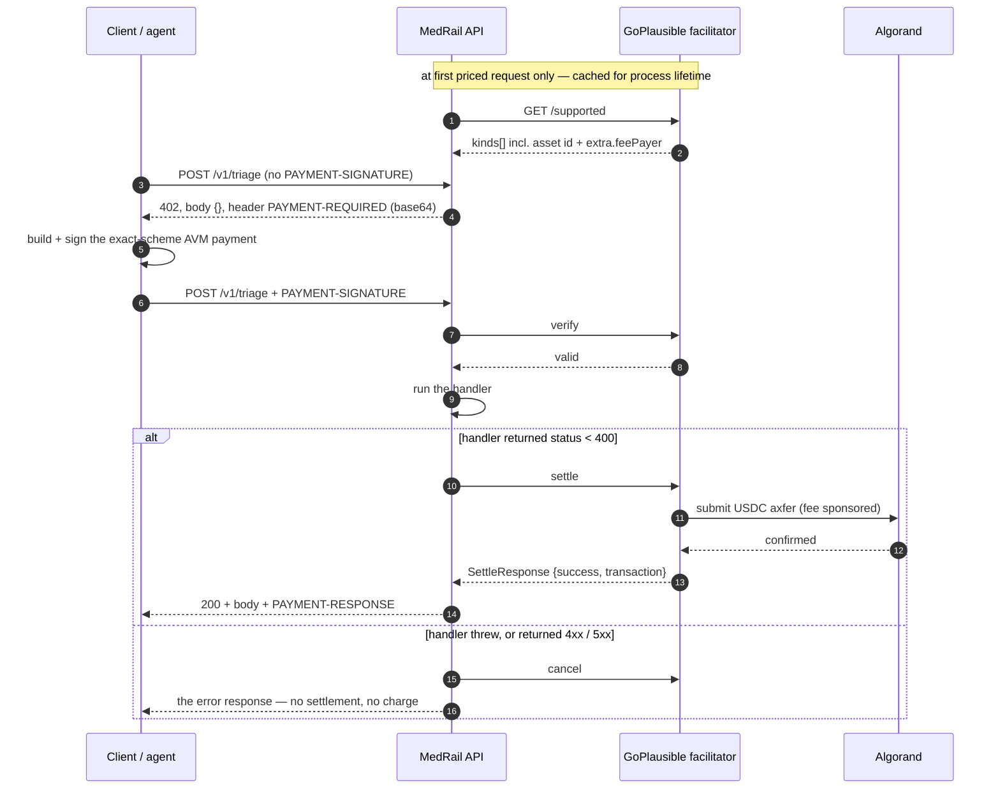

# MedRail — API Reference

**Purpose:** the definitive, implementation-verified reference for MedRail's HTTP surface (8 routes: 3 priced, 5 free) and for the `MedRailConsent` on-chain ABI (13 methods) that any third party may call directly.

**Status of this document:** **IMPLEMENTED** — every route, schema, status code and header below was read from `api/src/` and, where the value exists on chain, checked against App ID `768743428` on 2026-08-21. Routes marked **VALIDATED** have automated test coverage; routes marked **UNVALIDATED** are implemented but untested. The success path of `POST /v1/records/summary` is **VALIDATED**: it has completed end-to-end against the live contract, which now reports `total_audit_entries = 5` — see §7.1.

This document supersedes [`../API.md`](../API.md), which remains accurate but incomplete; the drift is itemised in §9.

---

## 1. At a glance

| # | Method | Path | Price | Gate | Handler | Writes on chain? | Test coverage |
|---|---|---|---|---|---|---|---|
| 1 | `POST` | `/v1/triage` | **$0.02** (20 000 µUSDC) | x402 only | `routes/triage.ts` → `services/triageScorer.ts` | no | **VALIDATED** — `x402-flow.spec.ts` + 7 unit tests |
| 2 | `POST` | `/v1/interaction-check` | **$0.02** (20 000 µUSDC) | x402 only | `routes/interaction.ts` → `services/interactionChecker.ts` | no | **VALIDATED** — `x402-flow.spec.ts` + 6 unit tests |
| 3 | `POST` | `/v1/records/summary` | **$0.05** (50 000 µUSDC) | x402 **+** payer binding **+** on-chain consent | `routes/records.ts` | **yes** — one `log_access` transaction | **VALIDATED** — 402 shape, 6 payer-binding unit tests (`x402Payer.spec.ts`), and live TestNet runs (`scripts/verify-g01-fix.ts`, `scripts/e2e-consent-proof.ts`) |
| 4 | `GET` | `/v1/consent/status` | free | none | `routes/consent.ts` | no (simulate only) | **UNVALIDATED** |
| 5 | `GET` | `/v1/consent/app-info` | free | none | `routes/consent.ts` | no | **UNVALIDATED** |
| 6 | `GET` | `/v1/consent/arc56` | free | none | `app.ts:141-148` | no | **UNVALIDATED** |
| 7 | `GET` | `/v1/health` | free | none | `routes/health.ts` | no | **VALIDATED** — `x402-flow.spec.ts` |
| 8 | `GET` | `/` | free | none | `app.ts:149-176` | no | **VALIDATED** — `app.spec.ts` asserts the advertised set equals the mounted set |

**That is the complete surface.** There are no other routes, no versioned aliases, no admin endpoints, and no consent write endpoints — grant and revoke are signed by the patient's own wallet directly against Algorand and never pass through this API (§8.3).

Entry classification for the Algorand Foundation Global x402 Challenge: **Composite** — three priced endpoints behind a single `payTo` address (per [`../COMPLIANCE.md`](../COMPLIANCE.md); competition-rule claims are not independently re-verified in this review).

---

## 2. Conventions that apply to every route

| Property | Value | Evidence |
|---|---|---|
| **Base URL (local dev)** | `http://localhost:4021` — `PORT` defaults to `4021` | `api/src/config.ts:47` |
| **Base URL (deployed)** | **none exists.** No public HTTPS deployment of `medrail-api` has been made. `api/fly.toml` is committed and its configuration is now correct — `NETWORK = "testnet"`, `CONSENT_APP_ID = "768743428"`, a `/v1/health` check, `max_machines_running = 1` — but it has never been deployed. | VERIFIED_FACTS §11, `api/fly.toml` |
| **Request content type** | `application/json` for the three `POST` routes | all three call `c.req.json()` |
| **Response content type** | `application/json` for every route **except** an unmatched path, which returns Hono's default plain-text `404 Not Found` | `hono/dist/hono-base.js:8` |
| **Authentication** | **none, on any route.** There are no API keys, no bearer tokens, no sessions, no accounts. Payment is the only gate, and it authenticates a *payment*, not a *caller*. | no auth middleware in `app.ts` |
| **Authorisation** | only on route 3, and it is genuine access control: the asserted `requesterAddress` must equal the address that signed the payment (`x402Payer.ts`, `records.ts:41-51`), **and** an active on-chain grant must exist for that `(patient, requester, scope)` triple — see §7.1 | `records.ts:41-51`, `:53` |
| **Rate limiting** | **On the free and refundable surface.** Fixed-window, in-memory, per client IP (`api/src/rateLimit.ts`, wired `app.ts:43-45`): `/v1/consent/status` 60/min, `/v1/consent/arc56` 30/min, `/v1/records/summary` 30/min. Over the limit → `429` with `Retry-After`; every response on these routes carries `X-RateLimit-Limit` / `X-RateLimit-Remaining`. The three priced happy paths are deliberately **not** throttled — settling USDC per call is a stronger limit than a counter. SEC-013 **IMPLEMENTED**. The client key is the first `X-Forwarded-For` hop, which a direct caller can spoof: this is a courtesy guard, not a security boundary, and it is per-process rather than global. | `api/src/rateLimit.ts`, `app.ts:43-45` |
| **Idempotency** | **NONE.** There is no idempotency key, no request deduplication, no replay window, and no way to retry a paid call for free. **A repeated paid call is a repeated payment.** A client that retries `POST /v1/records/summary` after a timeout pays $0.05 again and writes a second audit entry. State this to anyone integrating. | no key handling anywhere in `api/src/` |
| **CORS** | `origin: "*"`, methods `GET, POST, OPTIONS`; `allowHeaders` deliberately unset so Hono reflects the browser's own `Access-Control-Request-Headers`; `exposeHeaders: ["PAYMENT-REQUIRED", "PAYMENT-RESPONSE"]` | `app.ts:22-35` |
| **Preflight** | `OPTIONS` on any path → `204 No Content` with CORS headers | `hono/dist/middleware/cors/index.js:72` |
| **Error envelope** | **Two shapes.** Per-route validation and consent errors are flat: `{ "error": string }`, plus `{ "details": { formErrors, fieldErrors } }` on zod failures. Cross-cutting middleware errors use a machine-readable envelope, `{ "error": { code, message, retryable, … } }`, with three codes: `RATE_LIMITED` (429), `PAYMENT_FACILITATOR_UNAVAILABLE` (503), `INTERNAL_ERROR` (500). Branch on the nested `error.code` wherever it is present. | §6 of [`API_Error_Catalog.md`](API_Error_Catalog.md) |
| **Security headers** | none set by the application (no HSTS, CSP, `X-Content-Type-Options`). `api/fly.toml` sets `force_https = true`, the only transport control present. SEC-016 **PARTIALLY IMPLEMENTED**. | `app.ts` |
| **Logging / correlation** | **Partial.** `app.onError` generates a `requestId` (UUID), logs method, path, message and stack as one structured JSON line, and returns the id to the caller — so a caller can quote it when reporting a fault. `records.ts` and the facilitator guard emit structured `audit_write_failed` and `facilitator_unavailable` events. There are still **no metrics, no tracing, no alerting and no log aggregation** (OPS-003/004, G-15, **NOT IMPLEMENTED**). | `app.ts:113-139`, `records.ts:89-98`, `app.ts:80-90` |
| **Versioning** | paths carry `/v1`; there is no version negotiation, no deprecation header, and no `/v2`. | route definitions |

### 2.1 Middleware order — and the consequence a caller will hit first

`app.ts` registers, in this order: ① CORS (`:22`), ② the rate limiters on the three free-or-refundable routes (`:43-45`), ③ the x402 payment middleware for all three priced routes, wrapped in the facilitator-outage guard (`:50-104`), ④ the route handlers (`:106-110`), ⑤ `app.onError` (`:113`), ⑥ `/v1/consent/arc56` and `/` (`:141`, `:149`).

Because the payment middleware runs **before** any handler, **zod validation never runs on an unpaid request**. A malformed body sent to a priced route without payment returns `402`, not `400`. The repository's own test documents this rather than assuming it (`api/test/x402-flow.spec.ts:48-59`, asserting `[400, 402]`).

That ordering is defensible — you should not spend CPU validating requests from callers who have not paid — but it has a real developer-experience cost: **an integrator debugging a schema mistake sees a payment error**, pays, and only then learns the body was wrong. Nothing tells them the payment was consumed by a request that could never have succeeded. A cheap mitigation is a pre-payment shape check (presence and type only, no business rules) returning `400` before the gate. **RECOMMENDED**; not implemented.

---

## 3. The x402 payment protocol

MedRail is an **x402 v2 resource server**, scheme `exact`, settling **USDC on Algorand** through the **GoPlausible** facilitator.

| Property | Value | Source |
|---|---|---|
| Protocol version | `2` | live 402 capture |
| Scheme | `exact` | `api/src/x402.ts:22` |
| Facilitator | `https://facilitator.goplausible.xyz` | `config.ts:47` (`FACILITATOR_URL`) |
| Network (CAIP-2), TestNet | `algorand:SGO1GKSzyE7IEPItTxCByw9x8FmnrCDexi9/cOUJOiI=` | `config.ts:11` |
| Network (CAIP-2), MainNet | `algorand:wGHE2Pwdvd7S12BL5FaOP20EGYesN73ktiC1qzkkit8=` | `config.ts:12` |
| Asset | USDC ASA `10458941` (TestNet) / `31566704` (MainNet), 6 decimals | `config.ts:15-19`; the advertised value is fetched from the facilitator |
| `payTo` | `2WDV2J2FTWF535SMSUVEBOF5IGXF2OTV7ZZTLTCRBXPVS32UMLOPTI64GE` | `config.ts:53` (`PAY_TO_ADDRESS`) |
| Fee sponsorship | facilitator supplies `extra.feePayer` = `ZMFK2OI7ZBD2U27ISERZC4S6LKM6WMFJPZQ4MYNJDZ2VNBNMBA67RA22AA` — **callers need USDC but not ALGO** | live 402 capture |
| SDK | `@x402/core`, `@x402/avm`, `@x402/hono` pinned `2.21.0`; `@x402/fetch` `^2.21.0` | `api/package.json` |
| Network isolation | only the configured CAIP-2 network is registered, so a payment signed for the other network is rejected (NFR-002) | `x402.ts:11-14` and its comment |

### 3.1 Headers — exact names

| Header | Direction | When | Encoding | Payload type |
|---|---|---|---|---|
| **`PAYMENT-REQUIRED`** | response | on every `402` | base64 of JSON | `PaymentRequired` — `{x402Version, error, resource, accepts[]}` |
| **`PAYMENT-SIGNATURE`** | request | when presenting a payment | base64 of JSON | `PaymentPayload` — the signed AVM transaction group |
| **`PAYMENT-RESPONSE`** | response | on `200` after settlement | base64 of JSON | `SettleResponse` — `{success, transaction, network, payer?, amount?, errorReason?, errorMessage?}` |
| `Cache-Control` | response | on `402` | `no-store` | prevents caching a challenge |
| `Access-Control-Expose-Headers` | response | always | `PAYMENT-REQUIRED,PAYMENT-RESPONSE` | makes the two x402 headers readable from browser JS (`app.ts:31`) |

Header lookup is case-insensitive; `@x402/core` reads both `payment-signature` and `PAYMENT-SIGNATURE` (`@x402/core/dist/cjs/http/index.js:713`).

### 3.2 The flow



Two properties of this sequence matter, and the second is the one most readers get backwards:

- **The `/supported` call is not optional and has no fallback.** `accepts[].asset` and `extra.feePayer` come from the facilitator, not from MedRail's config, so the `402` cannot be constructed offline. The facilitator is therefore a hard runtime dependency of all three priced routes. When it is unreachable MedRail returns a clean **`503` + `Retry-After: 30`** with `error.code = "PAYMENT_FACILITATOR_UNAVAILABLE"` (`app.ts:78-104`) rather than an opaque 500; free routes are unaffected.
- **Settlement runs *after* the handler, and only on success.** `@x402/hono` (`node_modules/@x402/hono/dist/esm/index.mjs:203-232`) awaits the handler first. A throw dispatches `cancellationDispatcher.cancel({reason: "handler_threw"})` and re-raises; a response with `status >= 400` dispatches `cancel({reason: "handler_failed"})` and returns — both **before** `processSettlement` is ever called.

### 3.2.1 The consequence: no error path can consume a settled payment

This is worth stating as its own claim, because it removes a whole class of concern from every error in this API:

> **Every 4xx and every 5xx MedRail returns leaves the caller uncharged.** Not by a refund, not by a compensating transaction, and not by anything MedRail implements — but because the charge structurally never happens. The only way to be billed is to receive a response below 400.

That property is inherited from x402 v2, and it is a genuine strength of the protocol rather than of this codebase; MedRail's contribution is to not fight it. Two design decisions follow directly:

- A consent denial is a `403` with `charged: false` (§4.3). The caller pays nothing. The residual cost is MedRail's — the denied path still submits a `log_access` transaction whose fee the operator account pays — which is exactly why that route is rate-limited.
- A failed audit write on the success path returns `200` with `auditStatus: "pending"` rather than a 500 (§4.3). Raising there would have cancelled a settlement the caller was entitled to complete; the money was never the thing at risk, the *sale* was.

### 3.3 The real `402` — captured live

`app.request("/v1/triage")` with no payment. HTTP status `402`; **body is the empty object `{}`** — the payload is header-only. Headers include `payment-required` (base64), `cache-control: no-store`, `access-control-allow-origin: *`, `access-control-expose-headers: PAYMENT-REQUIRED,PAYMENT-RESPONSE`.

Decoded `PAYMENT-REQUIRED`:

```json
{
  "x402Version": 2,
  "error": "Payment required",
  "resource": {
    "url": "http://localhost/v1/triage",
    "description": "Rule-based clinical red-flag triage score. Not medical advice.",
    "mimeType": "application/json"
  },
  "accepts": [
    {
      "scheme": "exact",
      "network": "algorand:SGO1GKSzyE7IEPItTxCByw9x8FmnrCDexi9/cOUJOiI=",
      "amount": "20000",
      "asset": "10458941",
      "payTo": "2WDV2J2FTWF535SMSUVEBOF5IGXF2OTV7ZZTLTCRBXPVS32UMLOPTI64GE",
      "maxTimeoutSeconds": 300,
      "extra": {
        "feePayer": "ZMFK2OI7ZBD2U27ISERZC4S6LKM6WMFJPZQ4MYNJDZ2VNBNMBA67RA22AA"
      }
    }
  ]
}
```

`/v1/records/summary` is identical except `amount: "50000"` and its own `description`.

### 3.4 The settled payments on record

Seven facilitator-settled x402 payments exist against `payTo` on TestNet, all carrying an `x402-payment-v2-…` note: **two at 20 000 base units** ($0.02, `/v1/triage`) and **five at 50 000** ($0.05, `/v1/records/summary` — one per audit entry, matching `total_audit_entries = 5`).

The first, and the one dissected in [`../PROOF.md`](../PROOF.md) §6:

| Field | Value |
|---|---|
| Transaction | `OYRQRKYA7WUKBVLWTOFJSJMZFBW7VCNGP5VGH5EBUJGRCVFQFJRQ` |
| Type | `axfer`, asset `10458941` |
| Amount | **20 000** base units = exactly $0.02 at 6 decimals |
| Confirmed round | 66091768 |
| Fee | `0` — sponsored by the facilitator's fee payer |
| Group | `XQzhbjBAqt0AjC5AByQsCxGbMdEuca3ZZFMyFBTb7K4=` |
| Note | decodes to `x402-payment-v2-1786140083822` |
| Sender / receiver | **both** `2WDV2J2FTWF535SMSUVEBOF5IGXF2OTV7ZZTLTCRBXPVS32UMLOPTI64GE` |

These are genuine facilitator-settled x402 payments, and **every one of them is a self-payment** — sender and receiver are the same project-controlled account in all seven cases. **There is no third-party payment volume and none should be claimed.** What the five 50 000-unit settlements do demonstrate is that the priced, consent-gated path completes end to end on real infrastructure, since a settlement only occurs when the handler returns below 400 (§3.2).

Note also that the transaction note records no resource URL, so **payments cannot be attributed to an endpoint** from ledger data (see [`../04_Data/Indexing_And_Query_Strategy.md`](../04_Data/Indexing_And_Query_Strategy.md) §4, N6) — the split above is inferred from the amounts, which happen to be distinct per route.

### 3.5 Client integration

The repository's own reference client is `api/scripts/e2e-proof.ts`:

```ts
const client = new x402Client();
client.register("algorand:*", new ExactAvmScheme(signer(), { algodUrl: ALGOD_URL }));
const fetchWithPayment = wrapFetchWithPayment(fetch, client);
const res = await fetchWithPayment(`${API_BASE}/v1/triage`, { method: "POST", ... });
```

The browser equivalent is `web/lib/x402Client.ts`, which deliberately skips `getPaymentSettleResponse` on a non-200 (a `402` means signed-but-unsettled, so there is no `PAYMENT-RESPONSE` header to parse — the comment in that file explains it).

---

## 4. Priced endpoints

### 4.1 `POST /v1/triage` — $0.02

| | |
|---|---|
| **Purpose** | Rule-based clinical red-flag triage score over free-text symptoms. **Not medical advice, not a diagnosis, and not a model** — 11 hard-coded keyword rules, deterministic and fully inspectable (AI-001, NFR-009, **VALIDATED**). |
| **Price** | $0.02 = 20 000 µUSDC |
| **Authentication** | none |
| **Authorisation** | none — open to any paying caller, no prior relationship needed |
| **Side effects** | **none.** No chain write, no disk write, no log. The `symptoms` text is processed in memory and discarded (AI-007). |
| **Dependencies** | the facilitator (for the 402 and for settlement). **Not** algod, **not** the contract. |
| **Rate limit / idempotency** | none / none — a retry is a second $0.02 |
| **Requirements** | FR-004, FR-005, FR-006, FR-009 — all **VALIDATED** |

**Request schema** (`api/src/routes/triage.ts:5-7`)

| Field | Type | zod constraint | Required |
|---|---|---|---|
| `symptoms` | string | `z.string().min(1).max(2000)` | **yes** |

Unknown properties are ignored (plain `z.object`, no `.strict()`).

**Response `200`** (`services/triageScorer.ts:11-16`)

| Field | Type | Notes |
|---|---|---|
| `score` | integer 0–100 | `min(100, Σ matched weights)` |
| `band` | `"routine" \| "soon" \| "urgent" \| "emergency"` | `≥60` / `≥30` / `≥10` / else |
| `matchedFlags` | `string[]` (0–11) | fixed labels, in table order; may be `[]` |
| `disclaimer` | string | always present; asserted by test |

**Status codes**

| Code | When |
|---|---|
| `200` | paid and valid |
| `400` | paid, body fails zod — `{error: "invalid request", details: {...}}` |
| `402` | no or invalid payment; also returned for a *malformed unpaid* request (§2.1) |
| `500` | any unhandled fault — generic body with a `requestId`, never the internal message |
| `503` | the payment facilitator is unreachable — `{"error":{"code":"PAYMENT_FACILITATOR_UNAVAILABLE",…}}` with `Retry-After: 30` (§7.2) |

**Example**

```bash
# Unpaid — shows the challenge
curl -i -X POST http://localhost:4021/v1/triage \
  -H 'content-type: application/json' \
  -d '{"symptoms":"Sudden chest pain and shortness of breath"}'
# HTTP/1.1 402 Payment Required
# payment-required: eyJ4NDAyVmVyc2lvbiI6MiwiZXJyb3IiOiJQYXltZW50IHJlcXVpcmVkIiw...
# {}

# Paid — via the x402 client (a raw curl cannot sign an Algorand payment)
API_BASE=http://localhost:4021 npx tsx api/scripts/e2e-proof.ts
```

Real `200` body (reproduced from `contracts/artifacts/e2e-proof.json`, produced by an actual settled payment):

```json
{
  "score": 70,
  "band": "emergency",
  "matchedFlags": ["possible cardiac chest pain", "respiratory distress"],
  "disclaimer": "MedRail triage is a transparent keyword heuristic for hackathon demonstration only. It is not a diagnosis, not a substitute for professional medical judgment, and must never be the basis for a real care decision. If this were real and urgent, call emergency services."
}
```

A low-urgency example, generated from the same code path:

```json
{
  "score": 2,
  "band": "routine",
  "matchedFlags": ["common mild symptom"],
  "disclaimer": "MedRail triage is a transparent keyword heuristic ..."
}
```

### 4.2 `POST /v1/interaction-check` — $0.02

| | |
|---|---|
| **Purpose** | Check a medication list against a curated table of **14** well-documented severe interaction pairs. A table lookup, not a model. |
| **Price** | $0.02 = 20 000 µUSDC |
| **Authentication / authorisation** | none / none |
| **Side effects** | none. Medication names are trimmed, lower-cased in memory, and discarded (AI-007). |
| **Dependencies** | the facilitator only. The table is read once at module load (`interactionChecker.ts:18`). |
| **Rate limit / idempotency** | none / none |
| **Requirements** | FR-007, FR-008, FR-009, DATA-005, AI-004 — **VALIDATED** |

**Request schema** (`api/src/routes/interaction.ts:5-7`)

| Field | Type | zod constraint | Required |
|---|---|---|---|
| `medications` | `string[]` | `z.array(z.string().min(1)).min(2).max(20)` | **yes** |

**Response `200`** (`services/interactionChecker.ts:25-30`)

| Field | Type | Notes |
|---|---|---|
| `flagged` | boolean | `matches.length > 0` |
| `matches` | array (0–14) | file order, **not** severity order |
| `matches[].drugs` | `[string, string]` | canonical table names, not the caller's spelling |
| `matches[].severity` | `"moderate" \| "major" \| "contraindicated"` | from the table only |
| `matches[].description` | string | verbatim from the table |
| `source` | string | provenance; always present |
| `disclaimer` | string | always present |

**Status codes:** `200`, `400` (`{error: "invalid request — provide at least 2 medications", details: {...}}`), `402`, `500` (generic body with a `requestId`), `503` (`PAYMENT_FACILITATOR_UNAVAILABLE` with `Retry-After: 30`, §7.2).

**Example**

```bash
curl -i -X POST http://localhost:4021/v1/interaction-check \
  -H 'content-type: application/json' \
  -d '{"medications":["warfarin","aspirin"]}'
```

Real `200` body (generated from the shipped table):

```json
{
  "flagged": true,
  "matches": [
    {
      "drugs": ["warfarin", "aspirin"],
      "severity": "major",
      "description": "Combined anticoagulant/antiplatelet effect substantially increases bleeding risk."
    }
  ],
  "source": "Widely-taught, textbook-level severe drug-interaction pairs (e.g. standard pharmacology references such as Lexicomp/Micromedex-class severity classifications). Not exhaustive and not a substitute for a pharmacist or prescriber review.",
  "disclaimer": "MedRail interaction-check compares against a small, explicitly-sourced reference table of well-documented severe interactions — it is not a comprehensive clinical database and must never replace a pharmacist or prescriber review before making a medication decision."
}
```

A clean result returns `flagged: false, matches: []` with the same `source` and `disclaimer`.

> **Documented matching weakness (AI-006, NOT IMPLEMENTED).** Matching is unanchored bidirectional substring containment (`interactionChecker.ts:42-43`). A 1–2 character medication name is `includes`-contained by many table entries, so `["a","b"]` produces false positives. The existing test for that input asserts only the disclaimer, so the behaviour is uncovered. Fix direction: token-boundary matching plus an RxNorm/synonym map.

### 4.3 `POST /v1/records/summary` — $0.05 + on-chain consent

| | |
|---|---|
| **Purpose** | The flagship route: return a patient record summary **only** if the caller has paid, signed that payment with the very account they claim to be, and holds a currently-valid on-chain consent grant for scope `records:summary`. |
| **Price** | $0.05 = 50 000 µUSDC |
| **Authentication** | **the payment is the authentication.** `payerFromRequest` (`api/src/x402Payer.ts`) recovers the account that signed the payment transaction; the handler refuses to proceed unless it equals `requesterAddress`. There is still no API key, bearer token or session — there does not need to be. |
| **Authorisation** | two checks, in order: ① `payer === requesterAddress`, else `403`; ② on-chain `check_access(patientId, requesterAddress, "records:summary")`, else `403`. |
| **Side effects** | **submits a real Algorand transaction** — `log_access`, signed by the operator/admin account, on **both** the allowed and denied paths (never on the payer-mismatch path, which returns before any chain call). Permanently locks 58 900–59 300 µALGO of app-account minimum balance per call, plus 18 900 µALGO on a patient's first-ever entry. |
| **Dependencies** | facilitator **and** algod **and** the deployed contract **and** `OPERATOR_MNEMONIC` **and** `CONSENT_APP_ID` |
| **Rate limit** | 30 requests per minute per client IP (`app.ts:45`) — present because a denial is free to the caller but costs MedRail a chain fee. Over the limit → `429`. |
| **Idempotency** | none — **a retry after a timeout costs another $0.05 and writes a second audit entry** |
| **Requirements** | FR-010, FR-011, FR-012 — all **VALIDATED** on TestNet; SEC-006, SEC-007, SEC-008 **IMPLEMENTED** |

**Request schema** (`api/src/routes/records.ts:7-10`)

| Field | Type | zod constraint | Required | Notes |
|---|---|---|---|---|
| `patientId` | string | `algorandAddress` — 58 chars **and** `algosdk.isValidAddress` | **yes** | **Selects which grant is checked — it does not select data.** The response is a fixed constant for every value (DATA-004). |
| `requesterAddress` | string | `algorandAddress` | **yes** | **Must equal the address that signed the payment.** Only after that check is it written into the immutable audit log. |

**Validation is by checksum, not by length** (`api/src/validation.ts`). A 58-character non-address is a **`400`** with a `fieldErrors` entry reading `"not a valid Algorand address (checksum failed)"` — it no longer reaches `algosdk.decodeAddress` and no longer surfaces as a 500. SEC-010 **IMPLEMENTED**.

#### The payer-binding check, and why it matters

The x402 middleware proves that *a* valid payment accompanies the request. It does not tell the handler *whose* payment it was. Taking `requesterAddress` from the request body and checking a consent grant against it therefore authorised nothing: `grant_access` transactions publish every valid `(patient, requester, scope)` triple to any indexer, so anyone could read a real grant off the chain, pay the ordinary fee from their own wallet, and assert the authorised party's address.

`api/src/x402Payer.ts` closes that gap:

```ts
const decoded = decodePaymentSignatureHeader(header);       // @x402/core/http
const payload = decoded.payload as ExactAvmPayloadV2;        // {paymentGroup, paymentIndex}
const raw = payload?.paymentGroup?.[payload.paymentIndex];
return getSenderFromTransaction(decodeTransaction(raw), true);  // @x402/avm
```

The AVM `exact` scheme's payload is an atomic group; the other legs are the facilitator's fee-payer transactions, which the facilitator signs. Only `paymentGroup[paymentIndex]` is signed by the caller, so only that leg identifies the payer. A missing or unparseable header yields `null`, and `records.ts:42` treats `null` as unauthenticated — never as trusted.

The result is that **the money becomes the credential.** You cannot claim an identity you do not hold the key for, because you would have had to sign the payment with it. This runs *before* any chain call, so a mismatched request costs nothing on either side.

**Response `200`** (`records.ts:101-111`)

| Field | Type | Notes |
|---|---|---|
| `patientId`, `requesterAddress` | string | echoes; on this path `requesterAddress` is provably the payer |
| `scope` | string | always `"records:summary"` — the client cannot choose |
| `summary` | object | the fixed `SYNTHETIC_RECORD` |
| `consentVerifiedOnChain` | boolean | hard-coded `true` on this branch |
| `auditStatus` | **string enum** | `"recorded"` or `"pending"`. `"recorded"` ⇒ the `log_access` transaction confirmed and the two fields below are populated. `"pending"` ⇒ the audit write failed, both are `null`, and the record is returned anyway. |
| `auditTxId` | string \| null | Algorand transaction id of the `log_access` write; `null` when `auditStatus` is `"pending"` |
| `auditSequence` | **string \| null** | **a decimal string, not a JSON number** — the value is a `uint64`/`bigint` and is `.toString()`-ed at `records.ts:109` because it is outside JSON's safe-integer range. Parse it as an integer. `null` when `auditStatus` is `"pending"`. |
| `disclaimer` | string | states the data is synthetic |

> **Why a failed audit write still returns 200.** The audit write must not be able to turn a legitimate, authorised, paid request into an error. `records.ts:83-99` wraps `logAccess` in `try/catch`; on failure it sets `auditStatus: "pending"`, nulls the two identifiers, and emits a structured `audit_write_failed` log line. The triggers are ordinary: operator account out of ALGO, app account short of box MBR, an algod 5xx, or the four-round validity window expiring. Returning a 500 there would have cancelled settlement and thrown away a sale the caller was entitled to — the caller's *money* was never at risk either way (§3.2). Clients that care about the audit trail should branch on `auditStatus`; clients that only want the record can ignore it.

**Response `403` — two distinct cases.** Both are `403`, and they are told apart by which fields are present.

*(a) Payer/requester mismatch* (`records.ts:43-50`) — emitted before any chain call:

```json
{
  "error": "requesterAddress must match the address that signed the payment",
  "requesterAddress": "…the address the body asserted…",
  "payer": "…the address that actually signed, or null…"
}
```

`payer` is `null` when the `PAYMENT-SIGNATURE` header is absent or could not be decoded. Discriminate on the presence of `payer`.

*(b) No consent grant* (`records.ts:59-70`) — reached only once the payer *is* the requester:

```json
{
  "error": "no valid consent grant from this patient for this requester and scope",
  "patientId": "…",
  "requesterAddress": "…",
  "charged": false,
  "hint": "GET /v1/consent/status?patient=&requester=&scope=records:summary is free"
}
```

`charged: false` is not a courtesy — it is structural. A 403 is ≥ 400, so `@x402/hono` cancels the payment instead of settling it (§3.2). **A denied call costs the caller nothing.** It does cost *MedRail* one Algorand fee for the denial audit write, which is why this route is rate-limited. The `hint` points at the free pre-flight check that avoids the round trip entirely.

**Status codes**

| Code | When |
|---|---|
| `200` | payer bound, valid body, consent grant active — possibly with `auditStatus: "pending"` |
| `400` | paid, body fails zod (including a failed address checksum) |
| `402` | no/invalid payment; also a malformed unpaid request (§2.1) |
| `403` | payer ≠ `requesterAddress` (case a), **or** payer bound but no valid grant (case b, `charged: false`) |
| `429` | more than 30 requests in the current minute from this client IP — `{"error":{"code":"RATE_LIMITED",…}}` with `Retry-After` |
| `500` | `CONSENT_APP_ID` unset, `OPERATOR_MNEMONIC` unset, or any unhandled fault — generic body with a `requestId`, never the internal message |
| `503` | the payment facilitator is unreachable, so no 402 challenge can be built — `{"error":{"code":"PAYMENT_FACILITATOR_UNAVAILABLE",…}}` with `Retry-After: 30` |

**No error status on this route can consume a settled payment.** Settlement runs only when the handler returns below 400 (§3.2).

**Example**

```bash
# Shape of the request (a raw curl gets 402 — it cannot sign a payment)
curl -i -X POST http://localhost:4021/v1/records/summary \
  -H 'content-type: application/json' \
  -d '{
        "patientId":        "S56WIB3XLUOXSUGAI6MDJ3GN3RV2NSE7RVV7DGNZJKDCJR4OJLLA6H7HEE",
        "requesterAddress": "CVYBERM3GTWGASZ7VUJLCBTVQA7AOPPTUW2Q3EISGR3XCRIKLM6SBIGUUA"
      }'
```

`200` body — this shape has been produced against the live contract. App `768743428` now holds five `log_access` entries with sequences `1..5`, so `auditTxId` and `auditSequence` carry real values; `api/scripts/e2e-consent-proof.ts` reproduces the run.

```json
{
  "patientId": "S56WIB3XLUOXSUGAI6MDJ3GN3RV2NSE7RVV7DGNZJKDCJR4OJLLA6H7HEE",
  "requesterAddress": "CVYBERM3GTWGASZ7VUJLCBTVQA7AOPPTUW2Q3EISGR3XCRIKLM6SBIGUUA",
  "scope": "records:summary",
  "summary": {
    "bloodType": "O+",
    "allergies": ["penicillin"],
    "chronicConditions": ["type 2 diabetes (controlled)"],
    "currentMedications": ["metformin 500mg", "lisinopril 10mg"],
    "lastUpdated": "2026-01-15"
  },
  "consentVerifiedOnChain": true,
  "auditStatus": "recorded",
  "auditTxId": "<52-char Algorand transaction id>",
  "auditSequence": "5",
  "disclaimer": "Synthetic demo data for the Global x402 Challenge — no real patient information exists in this system."
}
```

The degraded variant, when the chain write fails: identical except `"auditStatus": "pending"`, `"auditTxId": null`, `"auditSequence": null`. The record is still returned.

Real-shaped `403` body for the two live addresses above — **the grant box for exactly this triple holds `status = 2` (revoked)**, so `check_access` returns `false` for it today:

```json
{
  "error": "no valid consent grant from this patient for this requester and scope",
  "patientId": "S56WIB3XLUOXSUGAI6MDJ3GN3RV2NSE7RVV7DGNZJKDCJR4OJLLA6H7HEE",
  "requesterAddress": "CVYBERM3GTWGASZ7VUJLCBTVQA7AOPPTUW2Q3EISGR3XCRIKLM6SBIGUUA",
  "charged": false,
  "hint": "GET /v1/consent/status?patient=&requester=&scope=records:summary is free"
}
```

And the payer-mismatch `403`, which `api/scripts/verify-g01-fix.ts` produces on demand by paying with one key and asserting a different address:

```json
{
  "error": "requesterAddress must match the address that signed the payment",
  "requesterAddress": "CVYBERM3GTWGASZ7VUJLCBTVQA7AOPPTUW2Q3EISGR3XCRIKLM6SBIGUUA",
  "payer": "S56WIB3XLUOXSUGAI6MDJ3GN3RV2NSE7RVV7DGNZJKDCJR4OJLLA6H7HEE"
}
```

---

## 5. Free endpoints

### 5.1 `GET /v1/consent/status`

| | |
|---|---|
| **Purpose** | Live on-chain grant validity for a `(patient, requester, scope)` triple. |
| **Price / auth** | free / none |
| **Side effects** | **none on chain** — executed via `AtomicTransactionComposer.simulate()`, zero fee, nothing submitted (SEC-009). |
| **Dependencies** | algod, the deployed contract, **and `OPERATOR_MNEMONIC`** — see the note below |
| **Rate limit** | none. Two outbound algod round trips per request, unauthenticated (SEC-013). |
| **Requirement** | FR-013 — **IMPLEMENTED**, no automated test |

**Query parameters** (`routes/consent.ts:6-10`)

| Name | Type | zod constraint | Required |
|---|---|---|---|
| `patient` | string | `.length(58)` | **yes** |
| `requester` | string | `algorandAddress` — length **and** checksum | **yes** |
| `scope` | string | `.min(1)` | **yes** |

`scope` is **free-form and not normalised** (DATA-003). `"records:summary "` with a trailing space is a different grant and silently returns `granted: false`.

**Response `200`:** `{patient, requester, scope, granted}` — `granted` is `true` iff the box exists **and** `status == 1` **and** (`expires_at == 0` or `now < expires_at`).

**Status codes:** `200`; `400` (`{error: "invalid query — expected ?patient=&requester=&scope=", details: {...}}`, including a failed address checksum — §7.4); `429` (more than 60 requests in the current minute from this client IP, `{"error":{"code":"RATE_LIMITED",…}}` with `Retry-After`); `500` (`CONSENT_APP_ID` unset · `OPERATOR_MNEMONIC` unset · algod unreachable, R-4 — generic body with a `requestId`).

**Rate limit:** 60 requests per minute per client IP (`app.ts:43`). This route is free and unauthenticated and makes two sequential algod calls per request, so unbounded it both exhausts MedRail and amplifies traffic at public AlgoNode infrastructure at zero cost to the caller. Every response carries `X-RateLimit-Limit` and `X-RateLimit-Remaining`.

> **Non-obvious dependency.** This free, unauthenticated endpoint requires the **operator private key**: `checkAccess` needs a sender and signer for the simulated call (`algorand.ts:83-84`, `:8-14`). Without `OPERATOR_MNEMONIC` it returns `500`.

**Example** — real addresses from App `768743428`'s own history:

```bash
curl -s "http://localhost:4021/v1/consent/status\
?patient=S56WIB3XLUOXSUGAI6MDJ3GN3RV2NSE7RVV7DGNZJKDCJR4OJLLA6H7HEE\
&requester=CVYBERM3GTWGASZ7VUJLCBTVQA7AOPPTUW2Q3EISGR3XCRIKLM6SBIGUUA\
&scope=records:summary"
```

```json
{
  "patient": "S56WIB3XLUOXSUGAI6MDJ3GN3RV2NSE7RVV7DGNZJKDCJR4OJLLA6H7HEE",
  "requester": "CVYBERM3GTWGASZ7VUJLCBTVQA7AOPPTUW2Q3EISGR3XCRIKLM6SBIGUUA",
  "scope": "records:summary",
  "granted": false
}
```

`granted: false` is the correct current answer, and it is independently checkable without running MedRail at all — the grant box for this exact triple is `Z3MvPViYxVEb1KLSbuRHJK2vLARtCJtCnfHXqNfUKH/i` and its value decodes to `status = 2 (REVOKED)`:

```bash
curl -s "https://testnet-api.algonode.cloud/v2/applications/768743428/box?name=b64:Z3MvPViYxVEb1KLSbuRHJK2vLARtCJtCnfHXqNfUKH%2Fi"
# {"name":"Z3Mv...","value":"AgAAAABqdjUWAAAAAAAAAAA="}
#                             ^^ 0x02 = STATUS_REVOKED
```

**Measured latency:** one cold sample of **505 ms** (two sequential algod round trips). A single observation on a developer laptop — not a p50, not an SLO. No latency budget exists (PERF-002, **NOT IMPLEMENTED**).

### 5.2 `GET /v1/consent/app-info`

| | |
|---|---|
| **Purpose** | Tell a client which network and which App ID this instance is bound to, and where to fetch the ABI. |
| **Price / auth / side effects** | free / none / none |
| **Dependencies** | none — pure config read; **does not** contact algod |
| **Requirement** | FR-014 — **IMPLEMENTED** |

**Response `200`** (`routes/consent.ts:33-40`)

```bash
curl -s http://localhost:4021/v1/consent/app-info
```

```json
{
  "network": "testnet",
  "networkCaip2": "algorand:SGO1GKSzyE7IEPItTxCByw9x8FmnrCDexi9/cOUJOiI=",
  "consentAppId": 768743428,
  "arc56SpecUrl": "/v1/consent/arc56"
}
```

`consentAppId` is `number | null` — `config.consentAppId || null`, so an unconfigured instance reports `null`, not `0`. `web/lib/consent.ts:39` treats a falsy value as "not deployed yet". `arc56SpecUrl` is a **relative** path; the client must resolve it against the API base.

**Status codes:** `200` only. This route cannot fail.

### 5.3 `GET /v1/consent/arc56`

| | |
|---|---|
| **Purpose** | Serve the compiled ARC-56 application spec so a third party can build their own ABI calls without this repository. |
| **Price / auth / side effects** | free / none / none |
| **Dependencies** | the file `contracts/artifacts/MedRailConsent.arc56.json` on disk, resolved as `__dirname/../../contracts/artifacts/` (`app.ts:64`) |
| **Requirement** | FR-015 — **IMPLEMENTED** |

**Status codes:** `200` with the parsed JSON; `404` `{"error": "ARC-56 spec not found — has the contract been compiled?"}` when the file is absent.

```bash
curl -s http://localhost:4021/v1/consent/arc56 | head -c 200
```

Top-level keys: `name`, `structs`, `methods` (13), `arcs` (`[22, 28]`), `networks` (**an empty object — the deployed App ID is *not* recorded in the spec**; use `/v1/consent/app-info`), `state`, `bareActions`, `sourceInfo`.

> **Implementation note.** The file is `existsSync`-ed, read with `readFileSync` and `JSON.parse`-ed **on every request** — a synchronous ~54 KB disk read and parse in the event loop, on a free, unauthenticated, unrate-limited route. Reading it once at module load (as `interactionChecker.ts:18` already does for its table) would be strictly better. **RECOMMENDED**.

### 5.4 `GET /v1/health`

| | |
|---|---|
| **Purpose** | Liveness probe. |
| **Price / auth / side effects** | free / none / none |
| **Dependencies** | none |
| **Requirement** | FR-016 — **VALIDATED** (`x402-flow.spec.ts` "health check is free and unpaid") |

```bash
curl -s http://localhost:4021/v1/health
```

```json
{
  "ok": true,
  "service": "medrail-api",
  "network": "testnet",
  "consentAppId": 768743428,
  "time": "2026-08-21T09:14:02.115Z"
}
```

**Status codes:** `200` only.

> **`ok` is always literally `true`.** It is liveness, not readiness: it does not probe algod, the facilitator, or the contract. A green `/v1/health` is fully compatible with all three priced endpoints returning `503 PAYMENT_FACILITATOR_UNAVAILABLE`. `api/fly.toml` now wires it as the platform health check on exactly that understanding — a 30-second interval with a 10-second grace period — which closes defect D-6 for liveness while leaving readiness unaddressed (OPS-001).

### 5.5 `GET /`

| | |
|---|---|
| **Purpose** | Machine-readable service index. |
| **Price / auth / side effects** | free / none / none |
| **Requirement** | FR-017 — **VALIDATED** by `api/test/app.spec.ts` |

```json
{
  "service": "MedRail",
  "description": "Patient-consented health data layer under x402-paid AI intelligence endpoints, on Algorand.",
  "endpoints": [
    { "method": "POST", "path": "/v1/triage",            "price": "$0.02", "gate": "x402" },
    { "method": "POST", "path": "/v1/interaction-check", "price": "$0.02", "gate": "x402" },
    { "method": "POST", "path": "/v1/records/summary",   "price": "$0.05", "gate": "x402 + on-chain consent" },
    { "method": "GET",  "path": "/v1/consent/status",    "price": "free",  "gate": "none" },
    { "method": "GET",  "path": "/v1/consent/app-info",  "price": "free",  "gate": "none" },
    { "method": "GET",  "path": "/v1/consent/arc56",     "price": "free",  "gate": "none" },
    { "method": "GET",  "path": "/v1/health",            "price": "free",  "gate": "none" },
    { "method": "GET",  "path": "/",                     "price": "free",  "gate": "none" }
  ],
  "contract": {
    "appId": 768743428,
    "network": "testnet",
    "networkCaip2": "algorand:SGO1GKSzyE7IEPItTxCByw9x8FmnrCDexi9/cOUJOiI=",
    "arc56SpecUrl": "/v1/consent/arc56"
  },
  "x402": { "version": 2, "scheme": "exact", "facilitator": "https://facilitator.goplausible.xyz" },
  "docs": "see repo docs/API.md"
}
```

**Status codes:** `200` only.

**Field notes**

| Field | Notes |
|---|---|
| `endpoints[]` | **All 8 mounted routes**, as objects rather than strings. `endpoints[].price` is a display string (`"$0.02"`, `"free"`); the authoritative µUSDC amount is in the 402 challenge's `accepts[].amount`. `endpoints[].gate` is `"x402"`, `"x402 + on-chain consent"`, or `"none"`. |
| `contract` | `appId` is `null` when `CONSENT_APP_ID` is unset. `networkCaip2` is the same value the 402 advertises as `accepts[].network`. |
| `x402` | Enough for a client to pick a scheme and a facilitator before its first 402. |
| `docs` | Still a repo-relative hint, not a resolvable URL — a machine client cannot follow it. **RECOMMENDED**, unfixed. |

> **This index was previously incomplete**, listing 5 of the 8 routes and omitting both `GET /v1/consent/app-info` and `GET /v1/consent/arc56` — which meant a client discovering MedRail here could not find the ARC-56 spec that `arc56SpecUrl` pointed at. It is now complete, and it is derived by hand deliberately: `api/test/app.spec.ts` asserts that the advertised set equals the mounted route set, so the list cannot drift out of sync again without failing a build. `contract` + `arc56SpecUrl` are precisely the pair needed to build an ABI client against App `768743428` without cloning this repository.

---

## 6. The on-chain ABI as a public interface

`MedRailConsent`, App ID **768743428** on Algorand **TestNet**, is a second public API. Anyone can call it directly with algosdk and the ARC-56 spec from `/v1/consent/arc56` — MedRail's HTTP layer is a convenience, not a gatekeeper.

| Fact | Value |
|---|---|
| App ID | **768743428** |
| Network | TestNet, genesis `SGO1GKSzyE7IEPItTxCByw9x8FmnrCDexi9/cOUJOiI=` |
| Created at round | 66088624 · `deleted: false` |
| Creator / admin | `2WDV2J2FTWF535SMSUVEBOF5IGXF2OTV7ZZTLTCRBXPVS32UMLOPTI64GE` |
| Application account | `CCO26Y6Z56DDZ3OELO2UKJMIPJVSIT52I23F2MPMR52JBM3HQZZNUZNOR4` |
| Balance / min-balance | 5 000 000 µALGO / 145 000 µALGO |
| Explorer | `https://lora.algokit.io/testnet/application/768743428` |
| **Mutability** | **the app cannot be updated or deleted.** `MedRailConsent.approval.teal:33-36` asserts `OnCompletion == 0` before routing; no method declares `UpdateApplication`/`DeleteApplication`; `bareActions` are empty. |
| `create_txid` in `deploy_testnet.json` | `null` — the recorded run was an idempotent re-run that detected the existing app rather than creating it (`deploy_testnet.py` records `create_txid` only when `operation_performed == Create`). The app genuinely exists; the create transaction id is simply not captured in the repo. |

### 6.1 All 13 methods

Selectors are the first 4 bytes of `sha512_256(signature)`. Every value below was **read out of the compiled program** (`MedRailConsent.approval.teal:38`, which lists 12 of them in a single `pushbytess`, plus `create` at `:53`) and independently recomputed.

| # | Method signature | Selector | Returns | `readonly` | Authorisation | Writes |
|---|---|---|---|---|---|---|
| 1 | `create()void` | `4c5c61ba` | void | no | `create="require"`; sets `admin = Txn.sender` | global `admin` |
| 2 | `set_admin(address)void` | `44f2c1be` | void | no | **admin only** (`assert Txn.sender == self.admin.value`) | global `admin` |
| 3 | `fund_mbr(pay)void` | `d1474b5a` | void | no | **anyone**; asserts `payment.receiver == app address` | nothing (the payment does the work) |
| 4 | `request_access(address,string)void` | `d84debd0` | void | no | **anyone** | global `total_requests` only — **persists no box state** |
| 5 | `grant_access(address,string,uint64)void` | `8c3ad539` | void | no | **`Txn.sender` *is* the patient** | `grants` box + `total_grants_active` |
| 6 | `revoke_access(address,string)void` | `a67aecbc` | void | no | **`Txn.sender` *is* the patient**; asserts the grant box exists | `grants` box + 2 counters |
| 7 | `check_access(address,address,string)bool` | `2db778ab` | `bool` | **yes** | none | — |
| 8 | `get_grant(address,address,string)(uint8,uint64,uint64)` | `d0ace4f6` | `GrantRecord` | **yes** | none; asserts existence | — |
| 9 | `log_access(address,address,string,string,string)uint64` | `0faed85b` | `uint64` seq | no | **admin only** | `audit_seq` + `audit_log` boxes + `total_audit_entries` |
| 10 | `get_audit_count(address)uint64` | `d29268a6` | `uint64` | **yes** | none; returns `0` if absent | — |
| 11 | `get_audit_entry(address,uint64)(uint64,address,string,string,string)` | `4ec12091` | `AuditEntry` | **yes** | none; asserts existence | — |
| 12 | `get_grant_box_mbr()uint64` | `056ca4a7` | `uint64` | **yes** | none | — |
| 13 | `withdraw_excess(uint64)void` | `efaa6562` | void | no | **admin only**; inner `itxn.Payment(fee=0)` to admin | — |

**ARC-28 events** (emitted in transaction logs):

| Event signature | Selector | Emitted by |
|---|---|---|
| `AccessRequested(address,address,string)` | `99f094ee` | `request_access` — **fields swapped, defect C-1** |
| `AccessGranted(address,address,string,uint64)` | `4d155120` | `grant_access` — observed live in tx `X2BQ5FD4MW52B75WQGDB67TEULYLN7FHVFO6ZOBNI74PNCAKVOUA` (95-byte log) |
| `AccessRevoked(address,address,string)` | `36dd8db4` | `revoke_access` |

### 6.2 Two ABI defects a third-party integrator must know

**C-1 — `request_access` emits `patient` and `requester` swapped. Fixed in source; App `768743428` still emits them swapped.** The original passed `Txn.sender` (the *requester*) into the event's `patient` slot and the `patient` argument into the `requester` slot, so every ARC-28 consumer of `AccessRequested` received inverted identities. `contract.py:153` now passes them in struct order, and `test_consent.py::test_request_access_event_field_order` decodes the emitted payload and asserts both addresses — it fails against the old code. FR-024 is **IMPLEMENTED in source**.

**The redeploy is deferred on purpose.** `deploy_testnet.py` uses `OnUpdate.AppendApp`, which mints a *new* application rather than upgrading in place, so shipping this fix would invalidate App ID `768743428` along with every grant and audit entry recorded against it. **An integrator reading App `768743428`'s event feed must therefore still treat field 0 as the requester and field 1 as the patient.** Severity remains **MEDIUM** — no on-chain state is corrupted, because `request_access` persists nothing.

**C-2 — `get_grant_box_mbr()` returns 22 100, the true cost is 22 500. Fixed in source; App `768743428` still returns 22 100.** The original computed `2_500 + 400 * (32 + 17)`, omitting the `BoxMap` key-prefix byte; the real key is 33 bytes. `contract.py:55` now reads `2_500 + 400 * (33 + 17)` = **22 500**, asserted by two regression tests in `contracts/tests/test_consent.py` that fail against the old constant.

The deployed program still has the wrong value constant-folded in (`approval.teal:41`, `pushbytes 0x151f7c750000000000005654`, where `0x5654 = 22100`), and cannot be corrected without a new App ID — same constraint as C-1. The true figure is confirmed on chain three ways: the app account's `min-balance` less its 100 000 µALGO base divides exactly by 22 500 per grant box; `total-box-bytes` matches `33 + 17` per grant; and every live grant box name is 33 bytes. **A backend sizing `fund_mbr` from App `768743428`'s ABI method under-funds by 400 µALGO per box** — use 22 500. Severity **LOW** in magnitude, **MEDIUM** in kind: it is a wrong value published through an interface whose docstring advertises it as authoritative. Full treatment in [`../04_Data/Database_Design.md`](../04_Data/Database_Design.md) §6.3.

### 6.3 Calling the contract directly

```bash
# Global state and counters — no credentials needed
curl -s https://testnet-api.algonode.cloud/v2/applications/768743428

# Every box name (algod honours a prefix filter; the AlgoNode indexer did not)
curl -s "https://testnet-api.algonode.cloud/v2/applications/768743428/boxes?prefix=b64:Zw%3D%3D"

# A specific grant box value
curl -s "https://testnet-api.algonode.cloud/v2/applications/768743428/box?name=b64:Z3MvPViYxVEb1KLSbuRHJK2vLARtCJtCnfHXqNfUKH%2Fi"

# The ABI spec MedRail itself serves
curl -s http://localhost:4021/v1/consent/arc56
```

Box-key derivation for `grants` is `0x67 ‖ sha256(patient.publicKey ‖ requester.publicKey ‖ utf8(scope))`. The reviewer reproduced a live box key from public transaction data alone — see [`../04_Data/Data_Flow.md`](../04_Data/Data_Flow.md) §5.3.

---

## 7. Known API defects — and the four that are now closed

Five findings were raised against this surface during the 2026-08-21 review. **Four are closed**; the fifth was never a defect at all and is recorded here because the correction is more interesting than the finding was. Each is kept rather than deleted so that an integrator reading an older copy of this document can see what changed and why.

### 7.1 S-1 (was CRITICAL) — the consent gate is now an access control — **CLOSED**

**What was wrong.** `records.ts` took the requester identity from the **request body** and checked a consent grant against it without ever binding it to the payer:

```ts
const bodySchema = z.object({
  patientId: z.string().length(58),
  requesterAddress: z.string().length(58),   // <-- caller-asserted, never authenticated
});
const allowed = await checkAccess(patientId, requesterAddress, SCOPE);
```

The x402 middleware proves *a* payment settled; it does not tell the handler whose it was. And grant transactions are public — `grant_access` carries the patient as `sender` with the requester and scope as cleartext ABI arguments (demonstrated on a live transaction in [`../04_Data/Data_Flow.md`](../04_Data/Data_Flow.md) §5.2). So anyone could read a real `(patient, requester)` pair off the indexer, pay the ordinary $0.05 from their own wallet, and assert the authorised party's address. `check_access` would return `true`, because the grant genuinely exists. Worse, the audit log then recorded the *claimed* requester — a false attribution written into an immutable per-patient trail, which is arguably worse than no trail at all, since the record is trusted precisely because it is on chain.

**What exists now.** `api/src/x402Payer.ts` exports `payerFromRequest(c)`. It decodes the verified `PAYMENT-SIGNATURE` header, reads the AVM `exact` payload (`{paymentGroup, paymentIndex}`), and recovers the sender of `paymentGroup[paymentIndex]` — the one leg of the atomic group the caller signed, as distinct from the facilitator's fee-payer legs. `records.ts:41-51` then returns **403** unless that address equals `requesterAddress`, before any chain call is made. A missing or unparseable header yields `null`, which is treated as unauthenticated rather than trusted.

**The idea worth taking away** is not the fix but the principle behind it: in an x402 resource server, **the payment is the authentication**. A handler that reads an identity out of the request body is running a paywall, not an access control — and recovering the payer from the signed payment turns the money into a credential that cannot be forged without the private key. It costs about fifteen lines and it is the difference between the two.

**Verification.** `api/scripts/verify-g01-fix.ts` runs it against live TestNet: it grants a third party consent, pays with a *different* key, asserts the third party's address, and confirms the 403 — alongside a control call proving the legitimate path still returns 200. Six unit tests cover the decoder in `api/test/x402Payer.spec.ts`, including the `null`-on-missing-header and `null`-on-garbage cases.

FR-039 **IMPLEMENTED** · SEC-007 **IMPLEMENTED** · SEC-008 **IMPLEMENTED** · SEC-006 **IMPLEMENTED**. Full analysis: [`../06_Security/Threat_Model.md`](../06_Security/Threat_Model.md) T-01 and T-02.

**Related, and unchanged:** `patientId` is still supplied by the caller. That is correct — it names whose grant to check, and checking a grant that does not exist simply returns `403`. It is not an identity claim and does not need binding.

**Evidence gap E-1 is also closed.** `total_audit_entries = 5` on App `768743428`, with one `audit_seq` box and five `audit_log` boxes: **`log_access` has executed on Algorand TestNet.** The success path of `POST /v1/records/summary` has completed end-to-end against the live contract, and `auditTxId`/`auditSequence` carry real values. `api/scripts/e2e-consent-proof.ts` performs grant → check → paid call → audit append and is repeatable.

### 7.2 R-1 (was HIGH) — a facilitator outage now degrades to 503, not 500 — **CLOSED**

**What was wrong.** With `FACILITATOR_URL` pointed at a closed port, the first request to a priced route failed during `x402ResourceServer.initialize()` with `Failed to initialize: no supported payment kinds loaded from any facilitator.`, and the client received **HTTP 500 with no `PAYMENT-REQUIRED` header** — not a 402, not a 503, no `Retry-After`. A calling agent could not distinguish "this service is broken" from "try again shortly".

**What exists now.** `app.ts:78-104` wraps the payment middleware and converts exactly that condition — and only that condition — into:

```json
{"error":{"code":"PAYMENT_FACILITATOR_UNAVAILABLE",
          "message":"The payment facilitator is temporarily unreachable, so a payment challenge cannot be issued. Retry shortly.",
          "retryable":true,
          "facilitator":"https://facilitator.goplausible.xyz"}}
```

returned as **`503`** with `Retry-After: 30`, and logged server-side as a structured `facilitator_unavailable` event. Every other error is re-thrown untouched. Free routes (`/v1/health`, `/`, `/v1/consent/app-info`) still return `200`, so the blast radius remains the three priced endpoints (REL-005, **VALIDATED**).

**What is unchanged, and should not be overstated:** the root cause stands. `accepts[].asset` and `extra.feePayer` come from the facilitator's `/supported`, not from MedRail config, so the 402 still cannot be constructed offline, and there is still **no timeout, retry, circuit breaker, or cached-`/supported` fallback**. The facilitator remains a hard runtime dependency. What changed is that the failure is now honest and machine-readable instead of opaque. REL-001 **PARTIALLY IMPLEMENTED** — graceful degradation yes, resilience no. The same mechanism is behind CI defect CI-2: `api/test/x402-flow.spec.ts` makes a live call to `facilitator.goplausible.xyz` at module import, so a facilitator outage still turns into a red build.

### 7.3 R-2 (was HIGH) — "a settled payment can be lost" — **WITHDRAWN: the finding was wrong**

This finding claimed that an exception on the success path would return HTTP 500 *after* the payment had settled, leaving the caller charged $0.05 with nothing to show for it and no refund path.

**That is not how `@x402/hono` works.** Settlement runs after the handler and only on success (§3.2). `node_modules/@x402/hono/dist/esm/index.mjs:203-232` awaits `next()`, then dispatches `cancellationDispatcher.cancel(...)` on a throw or on any `status >= 400`, returning **before** `processSettlement` is reached. **No error path in MedRail can consume a settled payment.** REL-002 is **VALIDATED** — satisfied by the SDK, and credited as an inherited strength of x402 v2 rather than as MedRail's own work.

The *real* problem behind the asymmetry the finding noticed was smaller, and has also been fixed. An unguarded throw in the audit write turned a legitimate, authorised, paid request into a 500 — which cancelled the settlement and threw away the **sale**, not the caller's money. `records.ts:83-99` now catches it and returns `200` with the record, `auditStatus: "pending"`, null `auditTxId`/`auditSequence`, and a structured `audit_write_failed` log line.

What remains genuinely open is operational, and worth stating plainly: a `"pending"` access is permanently missing from the patient's on-chain trail unless an operator replays it. There is no queue and no automatic retry. And nothing monitors the two balances whose exhaustion causes it — the app account's box-MBR headroom and the operator account's ALGO (G-15, open). Capacity context is in [`../04_Data/Database_Design.md`](../04_Data/Database_Design.md) §7.

### 7.4 R-3 (was MEDIUM) — malformed-but-58-char address now returns 400, and errors no longer leak internals — **CLOSED**

**What was wrong.** `GET /v1/consent/status?patient=AAAA…(58 chars)&…` returned **500** with body `{"error":"wrong checksum for address"}`. zod validated length only; `algosdk.decodeAddress` threw deep inside `grantBoxName`, and the global error handler returned `err.message` verbatim. Two distinct problems: a client input error reported as a server error, and internal exception text echoed to an unauthenticated caller.

**What exists now.** `api/src/validation.ts` exports `algorandAddress`, a zod schema that checks length **and** `algosdk.isValidAddress`:

```ts
export const algorandAddress = z
  .string()
  .length(58, "must be a 58-character Algorand address")
  .refine((v) => algosdk.isValidAddress(v), {
    message: "not a valid Algorand address (checksum failed)",
  });
```

It is used by every address field on both `records.ts` and `consent.ts`, so a bad checksum is a **400** with a `fieldErrors` entry, and nothing malformed reaches `decodeAddress`. SEC-010 **IMPLEMENTED**.

Separately, `app.onError` (`app.ts:113-139`) now generates a `requestId`, logs method, path, message and stack server-side as one structured JSON line, and returns a fixed generic body:

```json
{"error":{"code":"INTERNAL_ERROR",
          "message":"An internal error occurred. Quote the requestId when reporting this.",
          "retryable":true,"requestId":"…"}}
```

No internal message reaches a caller, and the caller still gets a handle to quote. SEC-011 **IMPLEMENTED**.

### 7.5 The middleware-ordering quirk — an unpaid malformed request returns 402, not 400 — **OPEN, by design**

Described in §2.1. Not a bug — the payment middleware correctly runs first — but a documented behaviour that costs integrators money while they debug their request shape, and one that means **zod validation is only ever exercised by requests that have already paid**. The mitigation suggested there, a pre-payment shape check returning 400 before the gate, remains **RECOMMENDED** and unimplemented.

### 7.6 Current defect impact by route

| Route | Payer binding | Facilitator outage | Audit-write failure | Address validation | Ordering quirk | Rate limit |
|---|---|---|---|---|---|---|
| `POST /v1/triage` | n/a | 503 + `Retry-After` | n/a | n/a | **yes** | not throttled |
| `POST /v1/interaction-check` | n/a | 503 + `Retry-After` | n/a | n/a | **yes** | not throttled |
| `POST /v1/records/summary` | enforced | 503 + `Retry-After` | 200 + `auditStatus: "pending"` | 400 | **yes** | 30/min |
| `GET /v1/consent/status` | n/a | unaffected | n/a | 400 | — | 60/min |
| `GET /v1/consent/arc56` | n/a | unaffected | n/a | n/a | — | 30/min |
| `GET /v1/consent/app-info`, `/v1/health`, `/` | n/a | unaffected | n/a | n/a | — | not throttled |

### 7.7 What is still open on this surface

Stated plainly so the closures above are not read as a clean bill of health:

- **No idempotency** anywhere (§2). A retry after a timeout is a second payment and a second audit entry.
- **No metrics, tracing or alerting** (G-15). The structured error logs exist; nothing consumes them.
- **No timeout or retry** on either the facilitator or algod (REL-001, REL-003 partial).
- **A `"pending"` audit entry is never replayed** (§7.3).
- **The rate limiter is in-memory and per-process**, keyed on a spoofable client IP — a courtesy guard, not a security boundary.
- **`services/algorand.ts` has no dedicated unit test file** (G-05), and the frontend has no automated tests at all.
- **Nothing is publicly hosted.** There is no MainNet deployment, no Bazaar listing, and every payment to date is a self-payment from the project's own account.

---

## 8. What this API deliberately does not do

### 8.1 No accounts, no keys, no sessions

Payment is the only credential — and on `/v1/records/summary` it is a real one, because the handler recovers the address that signed it (§4.3). There is no per-caller accounting and no API key; the only throttling is a coarse per-IP rate limit on the free and refundable routes (§2). NFR-001 (**IMPLEMENTED**): the process holds no server-side session, user account, or persistent request state — the rate limiter's in-memory counters are the one exception, and they are per-IP, per-process, and expire within a minute.

### 8.2 No database

There is no relational database, document store, cache, queue, ORM, or migration tool anywhere in the repository. Durable state is Algorand global state, three box maps, and two static files compiled into the image. See [`../04_Data/Database_Design.md`](../04_Data/Database_Design.md).

### 8.3 No consent-write endpoints — and that is the point

Grant, revoke and request are **not** backend routes. `grant_access` and `revoke_access` are signed by the patient's own key in the browser and submitted directly to AlgoNode (`web/lib/consent.ts:44-89`). **The backend never holds, receives, or proxies a patient's private key** — verified: there is no key-ingress path anywhere in `api/src/`. NFR-008 / FR-035, **IMPLEMENTED**. This is a genuine strength and the reason `POST /v1/records/summary` can only *read* consent, never manufacture it.

### 8.4 No LLM, no model, no inference

The "AI endpoints" are two deterministic rule engines: 11 keyword rules with fixed weights, and a 14-row table lookup. There is no model, no embedding, no vector store, no RAG, and no external inference call anywhere in this repository. Both services are pure functions over static tables, which is why they are fully reproducible and why every response can carry a truthful disclaimer (AI-001, AI-002, **VALIDATED**). AI-008 notes the layer is swappable for a model-backed implementation without touching the payment or consent layers — by construction, since both sit behind a route boundary.

### 8.5 No compliance claim

No HIPAA, GDPR, SOC 2 or ISO work has been performed, no assessment exists, and none is claimed. There is no real PHI in the system — `POST /v1/records/summary` returns a constant.

---

## 9. Drift from `docs/API.md`

[`../API.md`](../API.md) is hand-written, 134 lines, and **accurate in everything it states**. Its endpoint list, prices, gates, field names, both `403` bodies, `charged: false`, `auditStatus`, the payer-binding requirement, and the fact that `auditSequence` is a string all check out against the implementation. The drift is now entirely by **omission**, plus two placeholder values.

| # | Item | `docs/API.md` | Implementation | Severity |
|---|---|---|---|---|
| D1 | `GET /` | **not documented at all** | exists, `app.ts:149-176`, and now advertises all 8 routes plus `contract` and `x402` blocks | 7 of 8 routes covered |
| D3 | Example App ID | `12345` in two examples | live value is `768743428` | placeholder; use the real one |
| D4 | `400` validation errors | not documented on any route | all four validating routes return `400 {error, details}` | whole status code missing |
| D5 | zod bounds | not stated | `symptoms` 1–2000; `medications` 2–20 items; addresses 58 chars **and** checksum-valid | integrators cannot pre-validate |
| D7 | Rate limits | not mentioned | 60/min on `/v1/consent/status`, 30/min on `/v1/consent/arc56` and `/v1/records/summary`; `429` + `Retry-After` | material for an integrator |
| D8 | Idempotency | not mentioned | **none** — a retry is a second payment | material and money-relevant |
| D9 | Middleware ordering | not mentioned | unpaid malformed ⇒ `402`, not `400` | surprising behaviour |
| D10 | `/v1/consent/status` operator dependency | not mentioned | requires `OPERATOR_MNEMONIC` despite being free | operationally important |
| D11 | `/v1/consent/arc56` `404` | not mentioned | returns `404` when the artifact is missing | missing status code |
| D13 | `patientId` semantics | implied to select a record | selects the *grant*, not the *data* | conceptual |
| D15 | Base URL | "or the deployed URL from `docs/DEPLOYMENT.md`" | **no public deployment exists** | pending user action |
| D16 | `500` / `503` paths | not documented | `503 PAYMENT_FACILITATOR_UNAVAILABLE` and the generic `500` envelope with a `requestId` | see [`API_Error_Catalog.md`](API_Error_Catalog.md) |
| D17 | `auditStatus: "pending"` | shows only `"recorded"` | the degraded case returns `200` with null `auditTxId`/`auditSequence` | a client branching on `auditTxId` should know |

**Resolved since the previous revision of this table:** D2 (the `403` example now shows every field, and both `403` variants are documented), D6 (address validation is now checksum-based, and `API.md` no longer overstates it), D12 (payer binding is now `API.md`'s headline for this route), and D14 (`auditSequence` is no longer presented against an empty chain — `log_access` has executed, `total_audit_entries = 5`).

**Recommendation:** keep `docs/API.md` as the short human-facing summary — its brevity is a virtue — and point it at this document plus [`OpenAPI.yaml`](OpenAPI.yaml) for the complete contract. Fix D3 and D15 in place; they are two small edits.

---

## 10. Cross-references

| Topic | Document |
|---|---|
| Machine-readable contract for all 8 routes | [`OpenAPI.yaml`](OpenAPI.yaml) |
| Every error, its cause, code path and retryability | [`API_Error_Catalog.md`](API_Error_Catalog.md) |
| On-chain storage: keys, encodings, MBR, capacity | [`../04_Data/Database_Design.md`](../04_Data/Database_Design.md) |
| Every field, enum, sentinel and environment variable | [`../04_Data/Data_Dictionary.md`](../04_Data/Data_Dictionary.md) |
| Lineage, retention, public visibility, the consent-graph exposure | [`../04_Data/Data_Flow.md`](../04_Data/Data_Flow.md) |
| What can and cannot be queried | [`../04_Data/Indexing_And_Query_Strategy.md`](../04_Data/Indexing_And_Query_Strategy.md) |
| Payer binding, C-1, admin-key blast radius, residual risk | [`../06_Security/Threat_Model.md`](../06_Security/Threat_Model.md) |
| The settled payment and its self-payment caveat | [`../PROOF.md`](../PROOF.md) |
| The original hand-written reference | [`../API.md`](../API.md) |
