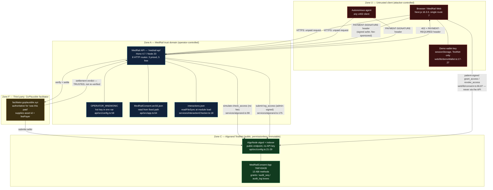

# MedRail — Security Architecture

**Purpose:** describe, control domain by control domain, exactly which security properties MedRail holds today, which it holds partially, and which it does not hold at all — with a source citation for every claim.

**Status of this document:** authored 2026-08-21 against commit `32ffd73` (branch `master`) by independent review of source, the deployed TestNet contract (App ID `768743428`), and the public Algorand indexer. It is a design-and-review artifact, **not** a certification, audit report, or compliance attestation. No penetration test, no dependency scan, and no static-analysis run has been performed on this codebase. This document supersedes nothing: `docs/SECURITY.md` remains accurate and is credited throughout.

---

## 0. How to read this document

Every control below carries one of these labels, used exactly as defined:

| Label | Meaning |
|---|---|
| **IMPLEMENTED** | Code exists in the repository and was read to confirm it. |
| **VALIDATED** | Implemented *and* covered by a passing automated test or an on-chain artifact. |
| **UNVALIDATED** | Implemented, but nothing proves it works. |
| **PARTIALLY IMPLEMENTED** | Some of it exists; the gap is stated. |
| **NOT IMPLEMENTED** | Absent. |
| **PLANNED** | Documented as intended; no code. |
| **RECOMMENDED** | This reviewer's recommendation. Never a description of what exists. |
| **NOT APPLICABLE** | The threat class does not arise from this architecture, with the reason given. |

A control marked **NOT APPLICABLE** is not a free pass. It is a claim that the architecture removed the surface, and each such claim below is argued rather than asserted.

Requirement IDs (`FR-###`, `NFR-###`, `SEC-###`, `REL-###`, `OPS-###`, `DATA-###`, `AI-###`) refer to the canonical requirement registry. IDs in the range `SEC-050…SEC-069` are newly allocated by this document and are marked `(new)`.

**Headline finding.** The consent gate on `POST /v1/records/summary` is not an access control. It authorises against a caller-asserted identity that nothing binds to the party that actually paid. This is finding **S-1**, tracked as **T-01** in `Threat_Model.md`, and it is **NOT MITIGATED**. Everything else in this document should be read with that in mind.

---

## 1. Trust model and boundaries

### 1.1 The picture



### 1.2 What each party is trusted for — precisely

| Party | Trusted for | **Not** trusted for | Enforcement |
|---|---|---|---|
| Browser / agent (Zone U) | Nothing. Every byte it sends is attacker-controlled. | Identity, honesty of `requesterAddress`, honesty of `patientId`, well-formedness of any field. | zod schemas per route; **but see S-1** — `requesterAddress` is trusted for identity today, which is the defect. |
| MedRail API (Zone A) | Holding the admin key; deciding whether to call `log_access`; constructing the 402 challenge. | Holding patient keys — it never receives one (`NFR-008`, verified: no key ingress path exists in `api/src`). | Architectural: `web/lib/consent.ts:50` signs patient transactions in the browser. |
| GoPlausible facilitator (Zone F) | **Authoritative for "was this paid."** Also supplies `accepts[].asset` and `extra.feePayer` from its `/supported` endpoint at startup. | Nothing else — it never touches consent state or the audit log. | `api/src/x402.ts:6`; the API does **not** independently re-confirm the settled transaction against algod. |
| AlgoNode algod/indexer (Zone C) | Correct relay of `simulate` results and correct submission of `log_access`. Anonymous access, no API key (`api/src/services/algorand.ts:5`). | Confidentiality — every query reveals which patient/requester pair is being checked. | None. A hostile or compromised AlgoNode could lie about a `check_access` simulate result. |
| Algorand consensus (Zone C) | Integrity and immutability of consent state and audit entries; ed25519 signature verification; duplicate-transaction rejection. | Confidentiality — the ledger is public forever. | The network itself. |

### 1.3 The facilitator trust assumption — deliberate, documented, residual

**Status: IMPLEMENTED, accepted residual risk.**

`api/src/x402.ts:6` constructs an `HTTPFacilitatorClient` and `api/src/app.ts:37-50` mounts `paymentMiddleware`. The middleware asks the facilitator to verify and settle; if the facilitator says yes, the handler runs. MedRail never fetches the settled transaction from algod to confirm it exists, is confirmed, has the right amount, or pays the right address.

This is the standard x402 trust model. The facilitator is *by protocol design* the component responsible for verify-and-settle — offloading that is the entire reason facilitators exist, and it is why a resource server can be a 60-line Hono app. `docs/SECURITY.md:84-87` records this correctly and calls it "matching the standard x402 trust model … not a shortcut specific to this build." That characterisation is accurate and is retained here.

It is nonetheless a real residual risk, and it should be stated as one rather than buried:

- A compromised or malicious facilitator can assert settlement that never happened. MedRail would serve the resource and — on the `/v1/records/summary` success path — write an on-chain audit entry attesting to a paid access that was never paid for.
- A facilitator outage does not fail closed gracefully; it fails to **HTTP 500 with no `PAYMENT-REQUIRED` header** (finding **R-1**, reproduced). See §15.3 and `REL-001`.
- Because `accepts[].asset` and `extra.feePayer` come from the facilitator rather than from MedRail's own config (`api/src/x402.ts:16-32` deliberately omits `asset`), MedRail cannot construct a 402 challenge offline at all. The trust dependency is therefore also an *availability* dependency.

**RECOMMENDED (`SEC-057`, new):** after a settlement verdict, and before writing an audit entry, re-read the settled transaction id from algod and assert asset id, amount, and receiver. On Algorand this is one indexer or algod lookup and turns a trust assumption into a verified fact. Not implemented; not required by the protocol; genuinely cheap here because MedRail already holds an algod client.

---

## 2. Authentication

**Status: NOT IMPLEMENTED at the HTTP layer — by design.**

There is no authentication of any kind on any MedRail HTTP route. No API keys, no bearer tokens, no OAuth, no mTLS, no cookies, no sessions. `NFR-001` (no server-side session or user account) is **IMPLEMENTED** by there being no datastore anywhere in `api/src`.

This is the intended architecture, not an omission. x402 substitutes *payment* for *account*: a caller proves entitlement by settling money, not by presenting a credential issued in advance. The 402 challenge at `api/src/app.ts:37-50` is the entire admission-control mechanism for the three priced routes.

### 2.1 What that buys

- **Zero-friction agent access.** An autonomous agent can discover, price, pay for, and call the endpoint in one round trip with no prior relationship, no signup, no key provisioning. This is the whole product thesis and it works — verified by settled transaction `OYRQRKYA7WUKBVLWTOFJSJMZFBW7VCNGP5VGH5EBUJGRCVFQFJRQ`.
- **No credential store to breach.** There is no user table, no password hash, no API key list, no session store. An entire category of attack (credential stuffing, token theft, session fixation, password reset abuse) does not exist here because the artifacts those attacks target do not exist.
- **No CSRF surface.** See §10.

### 2.2 What it costs — stated plainly

- **No per-caller accounting.** The API cannot tell you how many calls a given payer made, or that a given payer is behaving abnormally. There is no caller identity in the handler at all — which is precisely the root of finding **S-1**.
- **No throttling by identity.** Rate limiting per caller is impossible without a caller identity; rate limiting per IP is not implemented either (`SEC-013`, **NOT IMPLEMENTED**). See §15.4.
- **No revocation.** There is no way to ban a caller. Payment is the only gate, so an abusive caller with funds is indistinguishable from a legitimate one with funds.
- **No audit of who called the free routes.** `/v1/consent/status`, `/v1/consent/app-info`, `/v1/consent/arc56`, `/v1/health`, and `/` are open and anonymous, and — because there is no application logging at all (§14) — leave no trace whatsoever.

### 2.3 The identity that *does* exist and is not used

The payment carries an identity. `PAYMENT-SIGNATURE` contains a signed Algorand transaction whose sender is, by definition, the payer. `@x402/core/http` exports `decodePaymentSignatureHeader` (`api/node_modules/@x402/core/dist/cjs/http/index.d.ts:20`) and `@x402/avm` exports `getSenderFromTransaction(txnBytes, isSigned?)` (`api/node_modules/@x402/avm/dist/cjs/index.d.ts:186`). Both are present in the installed SDK. MedRail calls neither.

The API therefore possesses a cryptographically authenticated caller identity on every priced request and discards it. That is the single highest-value gap in this architecture.

---

## 3. Authorisation

Two authorisation mechanisms exist. They are of radically different quality and must not be described in the same breath.

### 3.1 On-chain admin gating — **VALIDATED**

The contract enforces authority with `assert Txn.sender == self.admin.value` at the AVM level:

| Method | Line | Guard | Negative test |
|---|---|---|---|
| `set_admin` | `contracts/smart_contracts/consent/contract.py:126` | admin only | `test_consent.py::test_set_admin_only_admin` |
| `log_access` | `contract.py:222` | admin only | `test_consent.py::test_log_access_rejects_non_admin` |
| `withdraw_excess` | `contract.py:258` | admin only | `test_consent.py::test_withdraw_excess_admin_only` |

Patient sovereignty is enforced structurally rather than by a check: `grant_access` and `revoke_access` derive the grant key from `Txn.sender` itself (`contract.py:151`, `contract.py:181`), so a caller can only ever write consent for their own account. There is no code path by which A grants consent on behalf of B. That is a stronger construction than an equality assert, and it is correct.

`fund_mbr` is deliberately open to anyone but asserts the payment lands on the app account (`contract.py:138`), so it cannot be used to redirect funds.

This is genuinely sound work: the authority model is minimal, the guards are at the right layer (consensus, not application), and every guard has a *negative* test — a test that proves rejection, not just that the happy path works. `SEC-001`, `SEC-002`, `SEC-003` are all **VALIDATED**.

Two caveats, both honest:
- All 14 contract tests run on the `algorand-python-testing` 1.1.0 AVM simulator, not against the deployed app. The simulator is a faithful AVM implementation, but "validated" here means validated in simulation.
- `withdraw_excess` has only a *negative* test. `FR-031` is **PARTIALLY IMPLEMENTED**: nothing proves a successful admin withdrawal works, only that a non-admin one fails.

### 3.2 The consent gate on `/v1/records/summary` — **DEFEATED (finding S-1)**

**Status: PARTIALLY IMPLEMENTED — DEFEATED. `SEC-006` is not satisfied. `SEC-007` and `SEC-008` are NOT IMPLEMENTED.**

The handler reads the requester identity out of the request body:

```ts
// api/src/routes/records.ts:5-8
const bodySchema = z.object({
  patientId: z.string().length(58),
  requesterAddress: z.string().length(58),
});
```

and then authorises against it:

```ts
// api/src/routes/records.ts:32
const allowed = await checkAccess(patientId, requesterAddress, SCOPE);
```

`checkAccess` (`api/src/services/algorand.ts:82-100`) faithfully simulates the contract's `check_access`, which faithfully returns whether that grant exists, is `STATUS_GRANTED`, and is unexpired (`contract.py:197-209`). Every component works exactly as designed. The composition is broken: **nothing anywhere binds `requesterAddress` to the party that paid.**

The x402 middleware proved *a* payment settled. It did not tell the handler *who* paid, and the handler never asked. `requesterAddress` is a caller-supplied string that the caller is free to set to any value.

**Exploit chain.** Consent grants are public. `grant_access` puts the patient in `Txn.sender` and the requester in ABI arg 0 (`contract.py:149`), both readable by anyone from any Algorand indexer — this is exactly how the reviewer read the live consent lifecycle for App `768743428`. An attacker therefore:

1. Queries the indexer for application calls to App `768743428` with selector `8c3ad539` (`grant_access`).
2. Extracts a valid `(patient, requester)` pair from the transaction sender and arguments.
3. Pays the ordinary, honest $0.05 through the ordinary, honest x402 flow.
4. POSTs `{"patientId": "<victim>", "requesterAddress": "<the authorised third party>"}`.
5. `check_access` returns **true**, because that grant genuinely exists. The API returns the record.

Any paying stranger can impersonate any authorised requester. There is no rate limit and no logging, so the attempt is neither slowed nor recorded off-chain.

**Why nobody has noticed.** Two accidents mask it: the response is a fixed synthetic constant (`api/src/routes/records.ts:15-21`), so nothing sensitive leaks today; and the demo client sends `requesterAddress: wallet.address` (`web/components/LiveDemoPanel.tsx:38`), so in every demonstration the payer and the asserted requester happen to be the same account. The flaw cannot manifest in the demo. That is a property of the demo, not of the system.

**Second-order effect — worse than the first.** On the allowed path the API writes the *claimed* requester into the immutable per-patient audit log (`api/src/routes/records.ts:49` → `logAccess(patientId, requesterAddress, …)`). A successful impersonation therefore permanently records a false attribution on a public ledger, under a mechanism that is trusted *precisely because* it is on-chain and immutable. See `Threat_Model.md` **T-02**.

**The fix, verified against the installed SDK.** In `api/src/routes/records.ts`, decode `PAYMENT-SIGNATURE`, recover the payer, and refuse to proceed unless it matches:

```ts
import { decodePaymentSignatureHeader } from "@x402/core/http";
import { getSenderFromTransaction } from "@x402/avm";
// …
const payload = decodePaymentSignatureHeader(c.req.header("PAYMENT-SIGNATURE")!);
const payer = getSenderFromTransaction(/* signed payment txn bytes from payload */);
if (payer !== requesterAddress) {
  return c.json({ error: "payer does not match requesterAddress" }, 403);
}
```

Both symbols exist in the pinned 2.21.0 packages (`@x402/core/dist/cjs/http/index.d.ts:20`; `@x402/avm/dist/cjs/index.d.ts:186`). The alternative is `x402HTTPResourceServer`'s `ProtectedRequestHook` — exported from `@x402/core/server`, wired via `.onProtectedRequest(hook)` (`api/node_modules/@x402/hono/dist/cjs/index.d.ts:117`) — which lets the verified payer be stashed on the Hono context once, for every priced route, rather than per handler. That is the cleaner shape if more priced routes are added.

Either way this is roughly 10–15 lines plus a test. It is the highest value-per-line change available in this repository.

**Related, lower severity.** `patientId` is equally self-asserted, but it only selects *which* grant is checked. Asserting a different patient checks a different grant and fails. It is not independently exploitable.

### 3.3 The three open priced routes

`/v1/triage` and `/v1/interaction-check` have no authorisation beyond payment (`api/src/app.ts:41-42`) and need none: they are pure functions over caller-supplied input that return no one else's data. Authorisation is not applicable where there is no protected resource. **NOT APPLICABLE**, correctly.

---

## 4. Payment integrity — what x402 proves and what it does not

**Status: IMPLEMENTED and VALIDATED for what it covers (`FR-001`, `FR-002`, `FR-003`).**

### 4.1 What the flow proves

1. An unpaid request to a priced route returns `402` with a `PAYMENT-REQUIRED` header advertising scheme `exact`, the configured CAIP-2 network, the resolved USDC asset, the amount, and `payTo` (`api/src/x402.ts:16-32`; live capture confirms `amount: "20000"`, `payTo` = the operator address, `extra.feePayer` = the facilitator's sponsor account). Asserted by `api/test/x402-flow.spec.ts`.
2. The client signs an Algorand asset-transfer transaction and returns it in `PAYMENT-SIGNATURE`.
3. The facilitator verifies and settles. A settled example exists on TestNet: tx `OYRQRKYA7WUKBVLWTOFJSJMZFBW7VCNGP5VGH5EBUJGRCVFQFJRQ`, asset `10458941`, amount `20000` base units, `fee: 0` (sponsored), confirmed round 66091768.
4. Only on a successful settlement verdict does the handler run.

**Network confusion is prevented.** `api/src/x402.ts:11-14` registers **only** the CAIP-2 network this process is configured for, with an explicit comment saying why. A MainNet-signed payment presented to a TestNet-configured process has no registered scheme to handle it. `NFR-002` is **IMPLEMENTED**. This is a real control and an easy one to get wrong; it is right here.

### 4.2 What the flow does not prove — the critical gap

**It proves that *a* payment settled. It does not bind the payer to `requesterAddress`.** The middleware's verdict is a boolean that reaches the handler as "you may run"; the payer's address never reaches the handler at all. This is finding **S-1** in full, restated here because it is a *payment-integrity* property as much as an authorisation one: MedRail collects money from party X and, on the strength of it, serves a resource authorised for party Y.

Note also what the payment does not bind to on the *resource* side: nothing ties a given settled payment to a given request body. The same settlement proves entitlement to "one call to this route," not "this call, with these arguments."

### 4.3 Replay of a settlement proof — **cannot be verified from this repository**

This must be stated honestly rather than guessed at.

- The AVM scheme's client stamps a note of the form `` `x402-payment-v${x402Version}-${Date.now()}` `` (`api/node_modules/@x402/avm/dist/cjs/index.js:266`). That is a millisecond timestamp generated **by the client**. It is a correlation tag. It is not a server-issued nonce, it is not registered anywhere, and it must not be described as replay protection.
- The reviewer searched the installed `@x402/core` and `@x402/avm` type surfaces for `replay`, `nonce`, `duplicate`, and `alreadySettled`. **No such symbols appear** in the exported type definitions.
- Algorand's own ledger rejects a duplicate transaction id within the transaction's validity window, so the same signed `axfer` cannot be *committed* twice. Whether the facilitator returns "settled" or an error when asked to settle an already-committed transaction — and therefore whether MedRail would serve the resource a second time — is behaviour of `facilitator.goplausible.xyz`, which is outside this repository and was not exercised.

**Verdict:** MedRail implements no replay defence of its own and holds no state with which to implement one (`NFR-001`: no datastore). Any replay resistance that exists is inherited from the facilitator and the Algorand ledger, and this review **could not confirm it**. Tracked as `SEC-052` **(new, UNVALIDATED)** and as threat **T-09**.

### 4.4 Money-loss-on-error — **NOT IMPLEMENTED (`REL-002`, finding R-2)**

The asymmetry in `api/src/routes/records.ts` is stark and worth quoting:

```ts
// denied path — defensive:
await logAccess(..., "consent_denied").catch(() => undefined);   // :37

// allowed path — not:
const logResult = await logAccess(..., "consent_checked");        // :49
```

If the allowed-path write throws — operator out of ALGO, app account out of box MBR, algod 5xx, validity window expiry (`atc.execute(algod, 4)` at `api/src/services/algorand.ts:175` waits four rounds and then throws) — the request falls through to `app.onError` (`api/src/app.ts:58-61`) and returns **HTTP 500 after the payment has already settled**. The caller has paid $0.05 and receives nothing. There is no refund path, no retry token, no idempotency key, and no record that it happened (§14).

The rejection path was hardened and the success path was not. That is almost certainly an oversight rather than a decision, and it is the more valuable of the two to harden, because the success path is the one that has taken money.

Charging for a *denied* consent check is a different matter and is a considered choice, disclosed in the response body as `charged: false` (`api/src/routes/records.ts:43`) and in `docs/SECURITY.md:62-67`. That is defensible. Losing a settled payment to a 500 is not.

---

## 5. Key management

**Status: PARTIALLY IMPLEMENTED. Client-side custody is genuinely good; operator custody is the weakest control in the system.**

| Key | Held where | Powers | Protection today | Status |
|---|---|---|---|---|
| **Deployer mnemonic** | `contracts/.env` on a developer laptop, gitignored (`.gitignore:2,5`) | Created App `768743428`; is the current admin; funded the app account with 5 ALGO (tx `KYH3H5CG2CCUPUUTJIBX47WD4RWSUV3QWTEUJQRQFYLWO5YAO3QA`) | Filesystem permissions only. No passphrase, no HSM, no split. | **PARTIALLY IMPLEMENTED** |
| **Operator / admin mnemonic** | `OPERATOR_MNEMONIC` env var, read at `api/src/config.ts:58`, decoded at `api/src/services/algorand.ts:12` | See §5.1 — three distinct powers | Environment variable in the API process. No vault, no KMS, no rotation procedure, no multisig. | **NOT IMPLEMENTED** (`SEC-012`) |
| **Patient / requester keys** | The user's own wallet. Never transmitted to MedRail in any form. | Sign `grant_access` / `revoke_access` and x402 payments | Architectural: signing happens in the browser (`web/lib/consent.ts:50,61`); the API has no key-ingress path. | **IMPLEMENTED** (`NFR-008`) — genuinely good |
| **Demo wallet** | Browser `sessionStorage`, plaintext JSON under `medrail-demo-wallet-v1` (`web/lib/demoWallet.ts:17-27`) | Signs TestNet transactions only | Cleared when the tab closes. Explicitly TestNet-only and labelled as having zero real-world value. | **IMPLEMENTED, deliberately weak** — see §9.2 |

### 5.1 Be blunt about `OPERATOR_MNEMONIC`

One mnemonic string, sitting in one environment variable, in one process, is simultaneously the contract admin. Whoever holds it can:

1. **Forge audit entries.** `log_access` is admin-gated (`contract.py:222`) and that gate is exactly what makes the audit log credible. The holder can write any `(patient, requester, scope, endpoint, action)` tuple they like into any patient's permanent, immutable, public trail. They can also fabricate accesses that never occurred, which is the *inverse* of the usual audit-tampering threat and is not detectable by inspection of the ledger.
2. **Lock out the real owner.** `set_admin` (`contract.py:124-127`) rotates admin to an arbitrary account, irreversibly from the previous admin's point of view. There is no timelock, no two-step accept, no recovery path, and no second key. One transaction ends the operator's control of the contract forever.
3. **Drain the app account.** `withdraw_excess` (`contract.py:254-259`) submits an inner payment to the admin with `fee=0` and **no upper bound on `amount` beyond what the AVM's own minimum-balance check will permit**. The app account currently holds 5,000,000 µALGO against a 145,000 µALGO minimum balance. Note also that the parameter is caller-supplied and the method's own docstring calls it an escape hatch to reclaim ALGO "over the app's MBR requirement" — but nothing in the method enforces that bound; it is left entirely to the AVM's balance check at submission time.

Additionally, and less obviously: **the free, unauthenticated `/v1/consent/status` endpoint has a hard dependency on this private key being loaded.** `checkAccess` calls `getOperator()` (`api/src/services/algorand.ts:83-84`), which throws if `OPERATOR_MNEMONIC` is unset (`api/src/services/algorand.ts:9-11`), because `AtomicTransactionComposer.simulate()` still requires a sender and a signer even though nothing is submitted. So an anonymous public read path is coupled to the system's most sensitive secret. Nothing is *signed and broadcast* on that path — the simulation is genuinely free and submits nothing (`SEC-009`, **IMPLEMENTED**) — but the coupling means the key must be present in any process serving that route, including one that would otherwise need no signing authority at all.

There is no key rotation runbook, no defined rotation cadence, no break-glass procedure, and no monitoring of the operator account (`OPS-005`, **NOT IMPLEMENTED**). `docs/SECURITY.md:40-47` states this problem clearly and honestly — the documentation is ahead of the implementation here, which is the right way round, but the risk is unmitigated either way.

**RECOMMENDED, in rough priority order:**
- `SEC-055` **(new)**: separate the audit-writer key from the contract admin key. `log_access` needs a writer role; only rotation and withdrawal need an owner role. One `set_admin`-style role split removes power (1) from the hot key entirely.
- Move the admin role to a 2-of-3 Algorand multisig. The contract needs no change — a multisig account is just an account.
- Move signing behind a KMS or an external signer so the process never holds raw key material.
- Bound `withdraw_excess` in-contract, or delete it. An unbounded admin-drain method that has never been successfully exercised (`FR-031`) earns its keep only if it is actually needed.
- Write the rotation runbook. `set_admin` exists (`FR-029`, **VALIDATED**) and the capability is worthless without a documented procedure.

---

## 6. Cryptography

**Status: IMPLEMENTED where used. No application-layer encryption exists anywhere — and none is needed today.**

| Primitive | Where | Purpose | Assessment |
|---|---|---|---|
| SHA-256 | `contract.py:96-98` (`op.sha256`); `api/src/services/algorand.ts:67` (Node `createHash`); `web/lib/consent.ts:33` (`crypto.subtle.digest`) | Derive a fixed-length 32-byte box key from `(patient ‖ requester ‖ scope)` | Appropriate. Collision-resistant, fixed output, correct choice for a box key over variable-length input. `DATA-001` **VALIDATED**. |
| ed25519 | Algorand transaction signing, everywhere | Authenticate every on-chain action | Provided by the platform. Patient actions are signed with the patient's own key; `log_access` with the operator's. |
| TLS | AlgoNode (`https://…algonode.cloud`, `api/src/config.ts:21-29`), facilitator (`api/src/config.ts:47`), and inbound if `force_https` is honoured (`api/fly.toml:16`) | Transport confidentiality and integrity | Standard. See §15. |

### 6.1 The key-derivation duplication is a security-relevant coupling

The same SHA-256 derivation is implemented **three times, independently**, in three languages:

- `contracts/smart_contracts/consent/contract.py:96-98` — Python/AVM, `op.sha256(patient.bytes + requester.bytes + scope.bytes)`
- `api/src/services/algorand.ts:63-69` — Node, `createHash("sha256")`, prefix `"g"`
- `web/lib/consent.ts:26-34` — browser, `crypto.subtle.digest("SHA-256", …)`, prefix `"g"`

There is **no cross-implementation test** (`NFR-011`, **UNVALIDATED**). This is a security concern, not merely a maintenance one: if the three ever disagree by a single byte, `check_access` reads an empty box and returns `false`, and the system **fails closed but silently** — a patient's genuine grant simply stops working, with no error and no signal distinguishing "you were never granted access" from "our three hash implementations diverged." A fail-closed divergence is the good outcome; the bad one is a future refactor that makes two implementations agree on a *wrong* key that a third can also reach.

**RECOMMENDED:** one golden-vector test file, shared by all three, asserting the exact 33-byte box name for a handful of fixed `(patient, requester, scope)` triples. This is perhaps thirty lines of test code and closes the entire class.

### 6.2 Application-layer encryption

**Status: NOT IMPLEMENTED. `DATA-006` is PLANNED.**

Nothing in MedRail encrypts anything at the application layer. There is no envelope encryption, no key wrapping, no field-level encryption, no encrypted storage, and no key hierarchy — because there is no datastore and no real data. `/v1/records/summary` returns a fixed constant (`api/src/routes/records.ts:15-21`).

This is the correct engineering decision for what this system currently is. Building an encryption pipeline to protect a hard-coded object containing `bloodType: "O+"` would be security theatre. `docs/SECURITY.md:16-25` says exactly this and describes the intended design without claiming it exists — which is the honest framing and is preserved here.

What a production version would require is set out in `Privacy.md` §5, marked **RECOMMENDED / NOT IMPLEMENTED** throughout.

---

## 7. Input validation

**Status: PARTIALLY IMPLEMENTED (`FR-038`).**

Every route that accepts input validates it with a zod schema before use, and every route uses `safeParse` with a 400 on failure rather than throwing. That baseline is done properly and consistently.

| Route | Schema | Exact constraints | Source |
|---|---|---|---|
| `POST /v1/triage` | `{symptoms}` | `z.string().min(1).max(2000)` | `api/src/routes/triage.ts:5-7` |
| `POST /v1/interaction-check` | `{medications}` | `z.array(z.string().min(1)).min(2).max(20)` | `api/src/routes/interaction.ts:5-7` |
| `POST /v1/records/summary` | `{patientId, requesterAddress}` | `z.string().length(58)` each | `api/src/routes/records.ts:5-8` |
| `GET /v1/consent/status` | `?patient&requester&scope` | `.length(58)`, `.length(58)`, `.min(1)` | `api/src/routes/consent.ts:6-10` |

Bodies are parsed with `await c.req.json().catch(() => ({}))` (`triage.ts:12`, `interaction.ts:12`, `records.ts:26`), so malformed JSON degrades to a clean 400 rather than an exception. That is a small, correct detail.

### 7.1 The gap: length-only address validation (`SEC-010`, finding R-3)

`z.string().length(58)` checks that a string is 58 characters. It does not check that it is a valid Algorand address. An Algorand address is base32 with a 4-byte checksum; `AAAA…` repeated to 58 characters passes zod and fails inside `algosdk.decodeAddress` (`api/src/services/algorand.ts:49`), which throws.

Reproduced: `GET /v1/consent/status?patient=<58 'A's>&…` returns **HTTP 500** with body `{"error":"wrong checksum for address"}`.

Two distinct defects in one response:
1. **Wrong status class.** A malformed client input is reported as a server error. Any client, monitor, or agent retry policy keyed on 5xx will treat a permanently-invalid request as a transient server fault and retry it forever.
2. **Internal detail disclosure.** `app.onError` returns `err.message` verbatim to an unauthenticated caller (`api/src/app.ts:60`). Today that leaks an algosdk error string. Tomorrow it leaks whatever the next unhandled exception carries — a file path, a stack-adjacent message, an env-var name from `requireConsentAppId`'s message (`api/src/config.ts:63-66`, which names `CONSENT_APP_ID` and a repo-relative artifact path), or the operator-mnemonic error text from `api/src/services/algorand.ts:10`. `SEC-011` is **NOT IMPLEMENTED**.

**Fix (both defects, small):** add `.refine(algosdk.isValidAddress)` to all four address fields, and change `app.onError` to log the exception server-side and return a generic body. Note that `@x402/avm` also exports `isValidAlgorandAddress` (`api/node_modules/@x402/avm/dist/cjs/index.d.ts:249`), already a dependency.

### 7.2 The `NETWORK` env cast is unvalidated (`SEC-050`, new — **NOT IMPLEMENTED**)

`api/src/config.ts:42`:

```ts
const network = (process.env.NETWORK as NetworkName) || "testnet";
```

This is an unchecked cast, not a validation. `NETWORK=mainnnet` (typo) yields a value that is not a key of `NETWORK_CAIP2`, `USDC_ASA_ID`, `ALGOD_SERVER`, or `INDEXER_SERVER` (`api/src/config.ts:8-29`), so `config.networkCaip2`, `config.usdcAssetId`, and `config.algodServer` all become `undefined`. `new algosdk.Algodv2("", undefined, "")` is then constructed at module load (`api/src/services/algorand.ts:5`). The failure is deferred, obscure, and occurs at request time rather than at boot. This is a configuration-integrity weakness rather than an attack surface — `NETWORK` is operator-supplied, not user-supplied — but it is one `z.enum(["testnet","mainnet"]).parse()` away from failing loudly at startup, which is where a misconfiguration should fail.

This interacts badly with **D-2**: `api/fly.toml:10` hard-codes `NETWORK = "mainnet"`, a network on which `MedRailConsent` has never been deployed, and does not set `CONSENT_APP_ID` at all.

### 7.3 Semantic input validation on the intelligence layer

`AI-006` is **NOT IMPLEMENTED**. `checkInteractions` matches medication names with an unanchored, bidirectional substring rule (`api/src/services/interactionChecker.ts:42-43`):

```ts
const hasA = normalized.some((m) => m.includes(a) || a.includes(m));
```

A one-character medication name such as `"a"` is `includes`-contained by "warfarin", "aspirin", "tramadol", and most other entries in the 14-pair table, so `["a","b"]` can flag interactions that do not exist. The existing test `interactionChecker.spec.ts::"always includes a source citation"` calls exactly `checkInteractions(["a","b"])` and asserts only the disclaimer, so the behaviour is exercised and not checked. Validation here should be semantic (token-boundary matching, or an RxNorm/synonym map), not just schematic. Severity is low in a demo and non-trivial in anything real — see `Threat_Model.md` **T-24**.

---

## 8. Injection surfaces — a genuine architectural strength

**Status: NOT APPLICABLE across the board, and the reason is structural rather than lucky.**

This section is the one place where an honest assessment is strongly positive, so it is worth stating why rather than just asserting the conclusion. **The classic injection classes require the application to take untrusted input and hand it to a second interpreter.** MedRail has almost no second interpreters.

| Class | Status | Why |
|---|---|---|
| **SQL / NoSQL injection** | **NOT APPLICABLE** | There is no database. No Postgres, MongoDB, Redis, ORM, query builder, or migration anywhere in the repo. State lives in Algorand box storage and two static files. There is no query language to inject into. |
| **Command / shell injection** | **NOT APPLICABLE** | No `child_process`, `exec`, `spawn`, or shell invocation exists in `api/src`. The API never shells out. |
| **Template injection** | **NOT APPLICABLE** | The API renders no templates. Every response is `c.json(...)`. There is no server-side template engine in the dependency set (`api/package.json:13-24`). |
| **Path traversal / file-path injection** | **NOT APPLICABLE** | Exactly two file reads exist and neither takes user input. See §8.1. |
| **Prompt injection / LLM manipulation** | **NOT APPLICABLE** | There is no model, no prompt, no embedding, no retrieval, and no agent framework anywhere in this system. See §8.2 and `Threat_Model.md` §6. |
| **Deserialisation attacks** | **NOT APPLICABLE (inbound)** | Inbound parsing is `JSON.parse` via Hono's `c.req.json()`, guarded by zod. No YAML loader, no `pickle`, no Java serialisation, no `eval`. |
| **Header injection / response splitting** | **NOT APPLICABLE** | No user-controlled value is written into a response header. `exposeHeaders` is a fixed list (`api/src/app.ts:31`); `PAYMENT-REQUIRED` / `PAYMENT-RESPONSE` are constructed by the SDK. |
| **XML / XXE** | **NOT APPLICABLE** | No XML is parsed anywhere. |
| **ABI argument injection** | **NOT APPLICABLE** | ABI arguments are length-typed and encoded by `algosdk` (`api/src/services/algorand.ts:88-96`, `162-173`). ARC-4 encoding is not string concatenation; there is no delimiter to escape and no in-band signalling to break out of. |

The honest summary: **the attack surface is small because the system does almost no untrusted-input-driven work.** Two of the three priced endpoints are pure functions over static tables (`AI-001`, **VALIDATED**), the third returns a hard-coded constant, and the only mutating operation the API performs is a single ABI call with five typed arguments. That is not an accident of scale — it is a consequence of pushing state onto the ledger and computation into pure functions, and it is worth crediting explicitly.

### 8.1 The two file reads — both verified non-user-controlled

1. **`GET /v1/consent/arc56`** (`api/src/app.ts:63-69`). Verified: the path is a fixed literal, `path.resolve(__dirname, "..", "..", "contracts", "artifacts", "MedRailConsent.arc56.json")` (`api/src/app.ts:64`). No request parameter, query string, header, or body value contributes to it. There is no route parameter on this route at all. `existsSync` is checked before the read and a 404 is returned otherwise (`app.ts:65-67`). **Not user-controlled. Not a traversal surface.** The only residual concern would be availability, and it was checked and is fine: `api/Dockerfile:20` copies `MedRailConsent.arc56.json` explicitly to `/app/contracts/artifacts/`, which is exactly the path `app.ts:64` resolves to inside the image. The artifact that is *not* copied is `deploy_testnet.json` — finding **D-1**, a configuration bug affecting `readDeployedAppId()` (`api/src/config.ts:31-40`), not a security one.

2. **`interactions.json`** (`api/src/services/interactionChecker.ts:18`). A synchronous `readFileSync` at **module load**, path built from `__dirname`, executed exactly once per process. Two observations:
   - *Availability:* if the file is missing or malformed, `JSON.parse` throws during module initialisation and the entire API fails to start — not just the one route. `api/Dockerfile:19` copies `api/src/data` into the image, so this is handled, but it is a hard startup dependency with no fallback and no error message of its own.
   - *Integrity:* the contents are a clinical reference table that directly determines the output of a paid endpoint. There is no checksum, no signature, and no integrity check. Anyone who can write that file inside the deployment (a compromised build, a malicious dependency with a postinstall hook, a container with a writable bind mount) silently changes clinical output for every caller. This is **reference-table poisoning** — tracked as `SEC-053` **(new, NOT IMPLEMENTED)** and `Threat_Model.md` **T-25**. It is the one genuine data-integrity surface in an otherwise stateless service.

### 8.2 Why "no LLM" is a security property

There is no language model in MedRail's decision path. `scoreTriage` sums the weights of 11 hard-coded keyword rules (`api/src/services/triageScorer.ts`); `checkInteractions` looks up 14 curated pairs (`api/src/services/interactionChecker.ts`). Both are pure, deterministic functions whose entire decision logic is readable in one screen of source (`NFR-009`, `AI-001`, both **VALIDATED**).

Consequently prompt injection, jailbreaking, system-prompt extraction, training-data poisoning, and model hallucination are **not applicable** — there is no model to inject into, no prompt to extract, no training set to poison, and no probabilistic output to hallucinate. This is not a gap in the threat model; it is a threat class that the architecture removed by not introducing a model. Given that the endpoints touch clinical content, that is a defensible design choice on safety grounds, not merely a scope decision.

What *does* remain applicable to an agentic caller is covered in `Threat_Model.md` §6: excessive agency, untrusted output consumption, and the reference-table poisoning above.

---

## 9. Output encoding and XSS

**Status: IMPLEMENTED (API); IMPLEMENTED with one bounded exposure (web).**

### 9.1 The API returns JSON only

Every API response is produced by `c.json(...)`. There is no HTML rendering, no template, and no user-controlled value in any response header. Hono sets `content-type: application/json`, so a browser will not sniff a JSON body as HTML in any modern engine — though note that `X-Content-Type-Options: nosniff` is **not** set (§15.2), so this relies on the content type being honoured rather than on the header that enforces it.

Two response fields do echo caller input verbatim: `patientId` and `requesterAddress` in `api/src/routes/records.ts:39-45` and `:52-53`, and the query triple in `api/src/routes/consent.ts:30`. Both are constrained to 58 characters by zod and land in a JSON string, correctly escaped by `JSON.stringify`. This is reflection, not injection.

### 9.2 The frontend escapes by construction

`web/components/LiveDemoPanel.tsx:171-172` renders API responses as:

```tsx
<pre className="…">{JSON.stringify(result.body, null, 2)}</pre>
```

React escapes text children. **Verified: `dangerouslySetInnerHTML` appears nowhere in project source** — the only matches in the entire tree are inside `web/node_modules/@types/react`. There is no `innerHTML` assignment, no `eval`, and no dynamic script injection. The frontend is not an XSS surface by construction rather than by sanitisation, which is the stronger position.

**The one real exposure.** The demo wallet's mnemonic is stored as plaintext JSON in `sessionStorage` (`web/lib/demoWallet.ts:17-27`) and read back into `mnemonicToSecretKey` on every signing operation (`web/lib/demoWallet.ts:40`, `web/lib/consent.ts:50,71`). `sessionStorage` is readable by any script running on the origin, so **any XSS on the demo page exfiltrates a signing key**.

The honest severity assessment:
- **Impact is bounded to TestNet play money.** The wallet is generated in-browser, funded from a public dispenser, and holds assets with no market value. `docs/SECURITY.md:35-38` states this; the UI states it; `web/lib/demoWallet.ts:10-12` states it in a comment.
- **Likelihood is low** given §9.2's first paragraph — there is currently no XSS vector to chain from.
- **It is still the correct architectural trade.** The alternative (requiring a wallet extension before a judge can try the flow) would kill the demo. Storing a throwaway TestNet key in `sessionStorage`, clearly labelled, with an explicit `clearDemoWallet()` (`web/lib/demoWallet.ts:29-31`), is a reasonable decision *because* the blast radius was deliberately made worthless.

One documentation defect attaches here: `web/lib/demoWallet.ts:12` says "production usage goes through a real wallet (see `lib/walletConnect.ts`)" and **that file does not exist**. There is no wallet-connect integration anywhere in `web/`. The comment points at a mitigation that has not been built (finding **DOC-4**). It should be corrected rather than left to imply a production path exists.

---

## 10. CSRF

**Status: NOT APPLICABLE — and this is a real argument, not a hand-wave.**

CSRF requires **ambient authority**: a credential the browser attaches automatically to a cross-origin request, so an attacker's page can make a victim's browser perform an authenticated action. The classic carriers are cookies, HTTP Basic credentials, and TLS client certificates.

MedRail has none of them:

- **No cookies are set or read anywhere.** There is no `Set-Cookie`, no session middleware, no cookie parser in the dependency set.
- **No sessions exist** (`NFR-001`, **IMPLEMENTED**).
- **No `Authorization` header scheme** exists to be cached by the browser.
- The only credential that authorises a priced call is `PAYMENT-SIGNATURE`, which the client must **explicitly construct and attach** using a signing key. A browser never attaches it automatically. An attacker's page cannot cause a victim's wallet to sign an asset transfer without the victim's signer participating.
- The only state-changing on-chain operations — `grant_access` and `revoke_access` — do not go through the API at all. They are signed by the patient's own key directly against AlgoNode (`web/lib/consent.ts:55-67`, `:76-88`). There is nothing for a forged request to the MedRail API to trigger.

**Therefore `origin: "*"` is acceptable here** (`api/src/app.ts:23`), and it is acceptable *for a stated reason* rather than by default: a permissive CORS policy is dangerous precisely because it lets a hostile origin read responses to credentialed cross-origin requests. With no credential and no session, a hostile origin calling MedRail from a victim's browser gets exactly what it would get calling from its own server — it must pay, from its own wallet, for its own response. Permissive CORS grants an attacker nothing they did not already have.

`docs/SECURITY.md:80-83` makes this argument correctly and it is endorsed here.

The `allowHeaders` decision deserves a note too. The list is deliberately unset (`api/src/app.ts:26-30`) so Hono reflects whatever the browser's own preflight requests, with an in-code comment recording that a hand-maintained allowlist previously drifted from what `@x402/fetch` sends and broke every paid browser call with a preflight failure. Reflecting preflight headers is *normally* a smell. Here it is correct, because the header set is dictated by an evolving third-party SDK and — again — there is no credential whose transmission the allowlist would be protecting. Documenting the regression that motivated it, in the code, is good engineering practice and is worth crediting.

---

## 11. SSRF

**Status: NOT APPLICABLE (no user-driven SSRF). PARTIALLY IMPLEMENTED as a supply-chain-adjacent concern.**

Server-Side Request Forgery requires a user-influenced destination. Every outbound destination in MedRail is fixed at configuration time:

| Outbound call | Destination source | User-influenceable? |
|---|---|---|
| Facilitator verify/settle | `config.facilitatorUrl` ← `FACILITATOR_URL` env, default `https://facilitator.goplausible.xyz` (`api/src/config.ts:47`) | **No** — operator-set |
| algod `getTransactionParams`, `simulate`, `execute` | `config.algodServer` ← fixed map keyed by `NETWORK` (`api/src/config.ts:21-24, 50`) | **No** — operator-set, and only two values exist |
| indexer | `config.indexerServer` ← fixed map (`api/src/config.ts:26-29, 51`) | **No** — and not actually used by any API route |

There is **no route that fetches a caller-supplied URL**, no webhook registration, no callback URL parameter, no URL field in any zod schema, and no redirect-following of a user-supplied location. The classic SSRF surfaces are absent.

### 11.1 The operator-config surface, stated honestly

Absence of user-driven SSRF is not absence of risk. `FACILITATOR_URL` is a fully operator-controlled outbound destination that MedRail sends payment payloads to and accepts settlement verdicts from. Anyone who can set that environment variable — a compromised CI pipeline, a misconfigured Fly secret, a malicious PR to a deployment manifest, a supply-chain compromise of the deploy tooling — redirects every payment through a destination of their choosing and controls whether MedRail believes payments have settled.

There is no allowlist, no pinning, no certificate pinning, and no assertion that the configured facilitator is one of a known set. The value is simply read from the environment and used.

This is normal for a service of this size and it is not a vulnerability in the code. It is worth recording as a control gap because the facilitator is uniquely powerful in this architecture (§1.3): it is the *only* party whose word is taken as proof that money moved.

**RECOMMENDED (`SEC-058`, new):** validate `FACILITATOR_URL` against an allowlist at startup, require `https:`, and fail to boot on anything else. Three lines, and it converts a silent redirect into a loud refusal to start.

---

## 12. Secrets management

**Status: PARTIALLY IMPLEMENTED. Git hygiene is genuinely good; everything downstream of git is not.**

### 12.1 What is verified good

`.gitignore:1-5` covers the secret-bearing paths:

```
.env
.env.local
*.mnemonic
contracts/.env
```

**Verified independently:** `git ls-files | grep -i env` returns exactly two entries — `api/.env.example` and `api/scripts/dotenvLoad.ts`. **No `.env` file of any kind is tracked by git.** `SEC-005` is **VALIDATED**.

That is not a trivial result. Mnemonic-in-repo is the single most common way a hackathon submission leaks a live key, and this repository does not have that problem. The files `api/.env`, `contracts/.env`, and `web/.env.local` exist on disk and are correctly untracked. (`web/.env.local` holds only `NEXT_PUBLIC_*` values, which are non-secret by construction — anything with that prefix is compiled into client-side JavaScript and is public the moment the site is served.)

### 12.2 What is not

| Gap | Evidence | Status |
|---|---|---|
| **No `.dockerignore` anywhere in the repository.** Verified by filesystem search: zero `.dockerignore` files exist. `api/Dockerfile` builds from the **repo root** (`api/Dockerfile:1-3`), so `api/.env` and `contracts/.env` — both containing live mnemonics — are transmitted into the Docker build context on every build. They are not `COPY`'d into any layer today (`api/Dockerfile:7-20` copies only named paths), so no secret currently lands in a published image. The margin is one careless `COPY api/ ./api/` wide. | `SEC-015` / **D-3** | **NOT IMPLEMENTED** |
| `web/Dockerfile:5` does `COPY . .` with no `.dockerignore` — it copies `web/.env.local` and the host `node_modules` into the build stage. Non-secret today; unsafe as a pattern. | **D-5** | **NOT IMPLEMENTED** |
| **Environment variables only.** No vault, no KMS, no sealed secrets, no secret manager. `OPERATOR_MNEMONIC` is a plaintext env var in the process (`api/src/config.ts:58`), visible in `/proc/<pid>/environ`, in a crash dump, in `fly ssh console`, and to any dependency that reads `process.env`. | §5 | **NOT IMPLEMENTED** |
| **No rotation procedure.** `set_admin` makes rotation *possible* (`FR-029`, **VALIDATED**) but no runbook, cadence, or break-glass procedure exists. | `OPS-007` | **NOT IMPLEMENTED** |
| **No secret scanning in CI.** `.github/workflows/ci.yml` has no gitleaks, no trufflehog, no GitHub secret-scanning enablement recorded. | `SEC-014` | **NOT IMPLEMENTED** |
| Both Dockerfiles use `npm install` rather than `npm ci` (`api/Dockerfile:8,17`; `web/Dockerfile:4`) despite committed lockfiles. Builds can silently drift from the lockfile CI validated. | **D-4** | **NOT IMPLEMENTED** |

**RECOMMENDED, in order of effort-to-value:** add a `.dockerignore` at the repo root excluding `**/.env*`, `**/node_modules`, `contracts/.venv`, `.git` (five minutes, removes D-3 and D-5 and speeds every build); switch both Dockerfiles to `npm ci`; add a secret-scanning step to CI; move `OPERATOR_MNEMONIC` behind a real secret manager before any MainNet key exists.

---

## 13. Dependency security

**Status: NOT IMPLEMENTED (`SEC-014`).**

There is no dependency scanning of any kind. `.github/workflows/ci.yml` contains three jobs — `contract`, `api`, `web` — and none of them runs `npm audit`, `pip-audit`, CodeQL, Snyk, Trivy, or any SAST tool. There is no Dependabot configuration and no renovate config in the repository.

**No vulnerability scan has been run against this codebase, so this document states no CVE, no vulnerability count, and no severity distribution.** Any such figure would be invented. What can be stated is the shape of the exposure:

| Surface | Detail |
|---|---|
| API runtime dependencies | 10 direct (`api/package.json:13-24`): `@hono/node-server`, `@x402/avm`, `@x402/core`, `@x402/extensions`, `@x402/fetch`, `@x402/hono`, `algosdk`, `dotenv`, `hono`, `zod` |
| Web runtime | Next.js 16.3.0, React 19.2.8, Tailwind 4, `algosdk`, `@x402/*` |
| Contract toolchain | `algopy` 3.5.1, `puyapy` 5.9.0 — a compiler that turns Python into AVM bytecode. A compromised compiler produces a compromised contract, and nothing in this repository verifies compiled output against source. |
| Pinning | `@x402/core`, `@x402/avm`, `@x402/hono`, `@x402/extensions` are pinned exactly to `2.21.0` (good). `@x402/fetch` is `^2.21.0`, `algosdk` is `^3.6.0`, `hono` is `^4.7.1`, `zod` is `^3.24.1` — caret ranges that admit new code on a fresh install. Both Dockerfiles use `npm install`, so a container build can pull minor/patch updates the lockfile never saw (**D-4**). |

### 13.1 `@x402/extensions` — was declared and never used, now wired

The finding recorded here was that `@x402/extensions@2.21.0` sat in `api/package.json` as a declared runtime dependency with **zero** importers anywhere in the repository: unnecessary supply-chain surface, and the sole evidence behind `docs/COMPLIANCE.md`'s claim that the backend implements Bazaar's discovery-extension schema (**DOC-9**). The recommendation was to uninstall it.

**That recommendation is now withdrawn, because the dependency is used.** `api/src/x402.ts` imports `bazaarResourceServerExtension`, `declareDiscoveryExtension` and the `DeclareDiscoveryExtensionInput` type from the package's `@x402/extensions/bazaar` subpath, registers the extension on the shared `x402ResourceServer`, and emits a discovery declaration on each of the three priced routes. Note that the subpath is why a search for `from "@x402/extensions"` alone found nothing: the entry point is the subpath, not the package root. Evidence and the full export surface: [`../05_API/Bazaar_Discovery.md`](../05_API/Bazaar_Discovery.md).

The security posture of the change is small and worth stating precisely. It adds no network call and no new trust relationship: the extension contributes no verify or settle hook, only an `enrichDeclaration` step that stamps the HTTP method onto a declaration MedRail itself authored. What it does add is **outbound description of the service in every 402** — route paths, an input schema and an output example — all of which `GET /` already publishes to anonymous callers, so no surface is disclosed that was not disclosed before.

**Do not restate DOC-9 as an implementation claim beyond what is true.** The extension is implemented; the **Bazaar listing** does not exist, because a resource is catalogued only when a paid call is verified against a publicly reachable URL, and MedRail answers on `localhost`.

**RECOMMENDED (unchanged, minus the uninstall):** add `pip-audit` to CI alongside the `npm audit --audit-level=high` step that now gates both Node jobs; enable Dependabot on both `package.json` files and `contracts/requirements-dev.txt`; pin the remaining carets.

---

## 14. Logging and audit trails

This domain contains the sharpest contrast in the system: an elaborate, immutable, on-chain audit mechanism that has never executed, sitting on top of an application with essentially no logging at all.

### 14.1 On-chain audit log — **UNVALIDATED on real infrastructure**

The design is sound. `log_access` (`contract.py:217-236`) is admin-gated, appends a monotonically increasing per-patient sequence (`audit_seq` BoxMap, `contract.py:224-226`), writes an `AuditEntry` at a key derived from `patient ‖ itob(seq)` (`contract.py:102-103, 228-234`), and returns the sequence number. No contract method mutates or deletes an existing `audit_log` entry — append-only is enforced by the absence of a write path, not by a flag (`DATA-002`, **IMPLEMENTED**). Sequences are per-patient and independent (`FR-027`, **VALIDATED**).

**But it has never run on Algorand.** Read live from the indexer for App `768743428`:

```
total_requests       = 2
total_grants_active  = 0
total_revocations    = 2
total_audit_entries  = 0      <-- ZERO
```

There are **zero `s`-prefixed and zero `a`-prefixed boxes** on the deployed app; the only two boxes present are `g`-prefixed grant boxes, totalling 100 box bytes. Therefore `log_access` has **never been executed on TestNet** (evidence gap **E-1**).

Consequences that must not be softened:
- The audit-log write path — the mechanism `docs/ARCHITECTURE.md`, `docs/SECURITY.md`, and `docs/JUDGES.md` present as MedRail's differentiator — is validated **only** by AVM-simulator unit tests (`FR-025`, **UNVALIDATED on-chain**).
- `/v1/records/summary` has never completed its success path end-to-end against the live contract. `docs/PROOF.md` §6 proves a settled payment against `/v1/triage`, not this route.
- The `auditTxId` and `auditSequence` fields documented in `docs/API.md` and produced at `api/src/routes/records.ts:57-58` have never been generated by a real run.
- There is **no test of `api/src/routes/records.ts` at all** and **no test of `api/src/services/algorand.ts` at all** — the two modules that carry every one of this document's most serious findings.

**Sequence assignment is on-chain, and this is worth stating precisely because the backend's read-then-write shape invites the wrong conclusion.** The contract computes the next sequence from its own box and trusts no caller-supplied value:

```python
# contract.py:224-226
seq, existed = self.audit_seq.maybe(patient)
next_seq = UInt64(1) if not existed else seq + 1
self.audit_seq[patient] = next_seq
```

`log_access` takes `(patient, requester, scope, endpoint, action)` — there is no sequence parameter. The `predictedSeq` computed at `api/src/services/algorand.ts:158-159` is **not** an ABI argument; it exists solely to populate the AVM **box-reference array** (`api/src/services/algorand.ts:169-172`), because Algorand requires every touched box to be declared in advance. Consequently a concurrency race produces a **rejected transaction**, not a corrupted log: the loser declares `a ‖ patient ‖ itob(N)` while the contract writes `a ‖ patient ‖ itob(N+1)`, and the AVM refuses the call. The audit log cannot be misordered, gapped, or overwritten this way. It fails atomically and closed.

That makes the concurrency issue an **availability** problem, not an integrity one — and `REL-004` is **PARTIALLY IMPLEMENTED** on that basis. `withPatientLock` (`api/src/services/algorand.ts:123-138`) serialises the backend's own calls **in-process only**, via a `Map<string, Promise<unknown>>`; the in-code comment says so and `docs/SECURITY.md:49-60` documents it. **`api/fly.toml:17-19` permits more than one machine** (`auto_start_machines = true`; `min_machines_running = 1` is a floor, not a ceiling), so the deployment configuration reintroduces the race (**D-7**). The real cost is what it chains into: a rejected write on the *unguarded* success path (`api/src/routes/records.ts:49`) becomes HTTP 500 after the payment has settled — §4.4.

**The one genuine integrity weakness in the audit mechanism is not the race — it is the identity fed into it.** The entry records the *claimed* requester, not the actual payer (finding **S-1**); `SEC-008` is **NOT IMPLEMENTED**. An immutable log of unverified assertions is not an audit trail; it is a permanent record of what callers said about themselves. The only other integrity threat is a compromised admin key writing forged entries (`Threat_Model.md` T-03) — the on-chain gate stops non-admins, not a compromised admin. Both are identity problems. The ledger mechanism itself is sound.

### 14.2 Application logging — **NOT IMPLEMENTED (`OPS-002`)**

The entire logging surface of the API is two statements:

- `console.log` of the listening port at startup (`api/src/index.ts:6`)
- `console.error(err)` in the global error handler (`api/src/app.ts:59`)

There is no structured logging, no log levels, no request ids, no correlation ids, no access log, no record of which endpoints were called, no record of settlement outcomes, no record of consent decisions, and no metrics (`OPS-003`), tracing (`OPS-004`), or alerting (`OPS-005`) of any kind.

Security consequences, concretely:
- **The S-1 exploit would leave no off-chain trace.** An impersonation attempt is indistinguishable from a legitimate call in every artifact MedRail produces, except the on-chain entry — which records the attacker's *claimed* identity, i.e. the victim's.
- **Money-loss events are invisible.** An R-2 occurrence (settled payment, 500 response) produces a stack trace on stderr with no request context, no payer, no amount, no route.
- **There is no abuse signal.** With no rate limiting (§15.4) *and* no access logging, a resource-exhaustion campaign against `/v1/consent/status` is neither prevented nor observed.
- **Incident response is impossible.** There is no data from which to reconstruct what happened.

`OPS-008` (RPO/RTO) is **NOT IMPLEMENTED** and no targets have ever been established. This document does not invent any.

---

## 15. Transport and network

### 15.1 Transport — **PARTIALLY IMPLEMENTED (`SEC-016`)**

`api/fly.toml:16` sets `force_https = true`. That is the single transport control that exists, and it is the right one. All outbound calls use `https://` (`api/src/config.ts:21-29, 47`). Note that `force_https` is a platform-edge redirect, and it is untested — the Fly deployment has never been performed and `api/Dockerfile` has never been built by CI (**CI-3**, `NFR-007` **UNVALIDATED**).

### 15.2 Security headers — **NOT IMPLEMENTED (`SEC-051`, new)**

The API sets no security headers. Absent: `Strict-Transport-Security`, `Content-Security-Policy`, `X-Content-Type-Options: nosniff`, `X-Frame-Options` / `frame-ancestors`, `Referrer-Policy`, `Permissions-Policy`.

Honest severity: **low, for the API specifically.** A JSON-only API with no cookies, no HTML, and no session gains less from these headers than a web app does. `nosniff` and HSTS are still worth having — HSTS in particular, because `force_https` redirects rather than prevents a first plaintext request. For **`web/`**, a CSP would be genuinely valuable, because it is the mitigating control that would blunt §9.2's `sessionStorage` key exposure by making script injection harder to exploit.

### 15.3 Facilitator dependency and failure mode — **NOT IMPLEMENTED (`REL-001`, finding R-1)**

Reproduced by the reviewer: with `FACILITATOR_URL` pointed at a closed port, the first request to a priced route fails inside `x402ResourceServer.initialize()` with `"Failed to initialize: no supported payment kinds loaded from any facilitator."` The client receives **HTTP 500 with no `PAYMENT-REQUIRED` header** — not a 402, not a 503, no `Retry-After`.

Blast radius is genuinely limited: `/v1/health`, `/`, and `/v1/consent/app-info` were verified to still return 200 with the facilitator down (`REL-005`, **VALIDATED**). Only the three priced routes fail.

Root cause is architectural, not a missing try/catch: `accepts[].asset` and `extra.feePayer` come from the facilitator's `/supported`, not from MedRail's config (`api/src/x402.ts:16-32` deliberately omits `asset`), so the 402 challenge **cannot be constructed offline**. There is no timeout, no retry, no circuit breaker, and no cached-`/supported` fallback.

This is also the mechanism behind **CI-2**: `api/test/x402-flow.spec.ts` makes a live call to `facilitator.goplausible.xyz` at app-module import, so CI depends on a third party being reachable from a GitHub runner, and a facilitator outage becomes a red build with a misleading failure message.

### 15.4 Rate limiting — **NOT IMPLEMENTED (`SEC-013`)**

Rate limiting is **IMPLEMENTED** on the surface that is free to the caller: `api/src/rateLimit.ts` applies a fixed-window per-IP limit — 60/min on `/v1/consent/status`, 30/min on `/v1/records/summary` and `/v1/consent/arc56` — returning 429 with `Retry-After`. The priced happy paths are deliberately unthrottled, being economically self-limiting. The limiter is in-process, so behind more than one instance it becomes per-instance rather than global; `api/fly.toml` pins `max_machines_running = 1`, so that is not a live weakening today.

The sharpest instance is `GET /v1/consent/status`. It is **free**, **unauthenticated**, and performs **two sequential outbound algod calls per request** — `getTransactionParams()` then `simulate()` (`api/src/services/algorand.ts:85, 98`). The reviewer measured a single cold call at **505 ms**, dominated by those two round trips. That gives an attacker a 1:2 amplification factor with near-zero cost to themselves, and two distinct outcomes:

1. **Exhaust MedRail.** Each in-flight request holds a Node event-loop slot for ~500 ms of network wait on a 512 MB / 1 shared-CPU machine (`api/fly.toml:21-24`).
2. **Use MedRail as an amplifier against AlgoNode.** MedRail's AlgoNode access is anonymous with no API key (`api/src/services/algorand.ts:5`), so sustained abuse consumes MedRail's share of a free public good and risks MedRail's own address being throttled or blocked — which takes down `/v1/consent/status` and `/v1/records/summary` together (`REL-003` **NOT IMPLEMENTED**: no timeout, no retry, no circuit breaker on any chain I/O).

No load test, latency benchmark, or concurrency measurement exists anywhere in the repository, so this document states no capacity figure. `PERF-002` and `PERF-003` are **NOT IMPLEMENTED**.

### 15.5 CI as a security control — **PARTIALLY IMPLEMENTED (`OPS-006`, finding CI-1)**

`.github/workflows/ci.yml:3-6` triggers on `push: branches: [main]`. **The repository's only branch is `master`.** No push has ever triggered this workflow and none ever will until the branch is renamed or the trigger changed. Only `pull_request` events would fire, and the repository has no pull requests.

This matters here because CI is the enforcement point for every dependency, lint, and scanning control this document recommends. Adding `npm audit` to a workflow that never runs achieves nothing. **Fix CI-1 first; it is a one-word change and it is a prerequisite for §13.**

To be precise and fair: **the code is not failing.** The reviewer executed every job the workflow would run, locally, and all passed — API typecheck (0 errors), API build, 18 API tests in 4.08 s, 14 contract tests in 0.41 s, web typecheck (0 errors), web build (Next 16.3.0, 6.3 s, 2 static routes). The problem is that nothing enforces this on change, not that the change is broken.

---

## 16. Control-status summary

| # | Control domain | Status | Key evidence | Principal gap |
|---|---|---|---|---|
| 1 | Trust model — facilitator authoritative for settlement | **IMPLEMENTED** (accepted residual) | `api/src/x402.ts:6`; `docs/SECURITY.md:84-87` | No independent algod re-verification (`SEC-057` new) |
| 2 | Authentication (HTTP) | **NOT IMPLEMENTED** — by design | `api/src/app.ts:37-50` | No per-caller accounting, throttling, or revocation |
| 3a | Authorisation — on-chain admin gating | **VALIDATED** | `contract.py:126,222,258` + 3 negative tests | `withdraw_excess` success path untested (`FR-031`) |
| 3b | Authorisation — patient sovereignty via `Txn.sender` | **VALIDATED** | `contract.py:151,181` | none |
| 3c | Authorisation — consent gate on `/v1/records/summary` | **DEFEATED (S-1)** | `api/src/routes/records.ts:5-8, 32` | `SEC-006` defeated; `SEC-007`, `SEC-008` **NOT IMPLEMENTED** |
| 4a | Payment challenge + settlement | **VALIDATED** | tx `OYRQRKYA7WUKBVLWTOFJSJMZFBW7VCNGP5VGH5EBUJGRCVFQFJRQ` | — |
| 4b | Network-confusion prevention | **IMPLEMENTED** | `api/src/x402.ts:11-14` | — |
| 4c | Payer↔requester binding | **NOT IMPLEMENTED** | finding S-1 | the fix is 10–15 lines |
| 4d | Settlement replay protection | **UNVALIDATED** | `@x402/avm/dist/cjs/index.js:266` (timestamp note, not a nonce) | Cannot be confirmed from this repo (`SEC-052` new) |
| 4e | Payment-loss on error | **NOT IMPLEMENTED** | `api/src/routes/records.ts:49` vs `:37` | `REL-002` (R-2) |
| 5a | Patient key custody | **IMPLEMENTED** | `web/lib/consent.ts:50`; no ingress path in `api/src` | — genuinely strong |
| 5b | Operator/admin key protection | **NOT IMPLEMENTED** | `api/src/config.ts:58` | `SEC-012`; single hot key, three powers |
| 6a | Hash / signature primitives | **IMPLEMENTED** | `contract.py:96-98` and two ports | — |
| 6b | Cross-implementation key-derivation parity | **UNVALIDATED** | 3 implementations, 0 tests | `NFR-011` |
| 6c | Application-layer encryption | **NOT IMPLEMENTED** (`DATA-006` **PLANNED**) | no encryption code exists | correct today — no real data |
| 7a | Schema validation | **PARTIALLY IMPLEMENTED** | zod in all 4 input routes | `FR-038` |
| 7b | Address checksum validation | **NOT IMPLEMENTED** | `api/src/routes/records.ts:6-7` | `SEC-010` (R-3) |
| 7c | Config validation (`NETWORK`) | **NOT IMPLEMENTED** | `api/src/config.ts:42` | `SEC-050` (new) |
| 8 | Injection (SQL/shell/template/path/XML/deserialisation/prompt) | **NOT APPLICABLE** | no DB, no shell, no templates, no model | reference-table integrity: `SEC-053` (new) |
| 9a | Output encoding (API) | **IMPLEMENTED** | JSON-only via `c.json` | `nosniff` not set |
| 9b | XSS (web) | **IMPLEMENTED** | React escaping; zero `dangerouslySetInnerHTML` in source | demo mnemonic in `sessionStorage` |
| 10 | CSRF | **NOT APPLICABLE** | no cookies, no session, no ambient authority | `origin:"*"` justified |
| 11 | SSRF | **NOT APPLICABLE** (user-driven) | all destinations operator-set | `FACILITATOR_URL` unvalidated (`SEC-058` new) |
| 12a | Secrets in VCS | **VALIDATED** | `.gitignore:1-5`; `git ls-files` clean | — genuinely strong |
| 12b | Build-context secret exclusion | **NOT IMPLEMENTED** | no `.dockerignore` exists | `SEC-015` (D-3, D-5) |
| 12c | Secret storage / rotation | **NOT IMPLEMENTED** | env vars only | no vault, no runbook |
| 13 | Dependency scanning | **NOT IMPLEMENTED** | `.github/workflows/ci.yml` — no scan step | `SEC-014`; unused `@x402/extensions` |
| 14a | On-chain audit log | **UNVALIDATED on-chain** | `total_audit_entries == 5` (E-1) | never executed on TestNet |
| 14b | Audit sequence assignment (on-chain, self-assigned) | **IMPLEMENTED** | `contract.py:224-226` — no caller-supplied sequence is trusted | none — races fail closed |
| 14c | Audit-write availability under concurrency | **PARTIALLY IMPLEMENTED** | `api/src/services/algorand.ts:123-138` vs `api/fly.toml:17-19` | `REL-004` (D-7) — availability, not integrity |
| 14d | Application logging | **NOT IMPLEMENTED** | `api/src/index.ts:6`; `api/src/app.ts:59` | `OPS-002`–`OPS-005`, `OPS-008` |
| 15a | HTTPS enforcement | **PARTIALLY IMPLEMENTED** | `api/fly.toml:16` | `SEC-016`; never deployed |
| 15b | Security headers | **NOT IMPLEMENTED** | none set | `SEC-051` (new) |
| 15c | Facilitator failure handling | **NOT IMPLEMENTED** | R-1 reproduced | `REL-001` |
| 15d | Rate limiting | **NOT IMPLEMENTED** | none anywhere | `SEC-013` |
| 15e | CI enforcement | **PARTIALLY IMPLEMENTED** | `ci.yml:3-6` triggers on `main`, branch is `master` | `OPS-006` (CI-1) |

**Tally (41 rows):** 8 **VALIDATED** / **IMPLEMENTED** and sound, 5 **NOT APPLICABLE** with structural justification, 7 **PARTIALLY IMPLEMENTED**, 3 **UNVALIDATED**, 17 **NOT IMPLEMENTED**, 1 **DEFEATED**.

---

## 17. What is genuinely strong here

A review that finds only problems is as untrustworthy as one that finds none. These are real, verified, and would survive hostile scrutiny.

1. **Patient private keys never touch the backend.** Verified, not asserted: `grant_access` and `revoke_access` are constructed and signed in the browser and submitted directly to AlgoNode (`web/lib/consent.ts:55-67, 76-88`), and there is no code path in `api/src` that accepts a mnemonic, a secret key, or signed bytes from a client for later use. Most "user-controlled data" projects claim this and proxy the key anyway. This one does not (`NFR-008`, **IMPLEMENTED**).

2. **Authorisation is enforced at the consensus layer, with negative tests.** `assert Txn.sender == self.admin.value` at `contract.py:126, 222, 258` cannot be bypassed by an application bug, a misconfiguration, or a compromised API process — only by holding the key. Each guard has a test that proves *rejection*, not merely that the happy path works. Writing negative tests is the part teams skip; this team did not.

3. **Patient sovereignty is structural, not checked.** `grant_access` and `revoke_access` derive the grant key from `Txn.sender` itself (`contract.py:151, 181`). There is no code path by which one account writes consent for another. A construction that makes the violation unrepresentable beats a guard that rejects it.

4. **The audit log's integrity design is sound at the contract layer.** Append-only is enforced by the absence of any write path to an existing `audit_log` key, not by a flag (`DATA-002`). Sequence numbers are **self-assigned by the contract** from its own box (`contract.py:224-226`) — `log_access` has no sequence parameter, so no caller can influence ordering, and a concurrency race produces a rejected transaction rather than a corrupted entry (§14.1). Sequences are independent per patient (`FR-027`, **VALIDATED**). The mechanism is right; only the identity fed into it is wrong (S-1), and that is fixable without touching the contract.

5. **No PHI reaches the ledger.** Only an address, a SHA-256 digest, a status byte, two timestamps, and constant `scope`/`endpoint`/`action` strings are ever written (`SEC-004`, `AI-007`, both **IMPLEMENTED**). Free-text symptoms and medication lists are never logged on-chain. Given that everything on Algorand is public and permanent, this is the single most consequential privacy decision in the design, and it was made correctly.

6. **The attack surface is genuinely small, for architectural reasons.** No database, no shell, no templates, no file paths from user input, no model in the decision path, no cookies, no sessions. Whole classes of vulnerability are absent because the corresponding machinery is absent (§8). This is not minimalism as an excuse; it is minimalism as a control.

7. **Secret hygiene in version control is clean.** Verified via `git ls-files`: no `.env` is tracked, and `.gitignore:1-5` covers every secret-bearing path including the easily-forgotten `contracts/.env`. This is the failure mode that most often turns a hackathon repository into a drained wallet, and it did not happen here.

8. **Read paths cost nothing and submit nothing.** `check_access` and `get_audit_count` run through `AtomicTransactionComposer.simulate()` (`api/src/services/algorand.ts:98, 119`). No transaction, no fee, no state change on a read (`SEC-009`, **IMPLEMENTED**). Correct use of `readonly=True` ABI methods.

9. **Network confusion is prevented deliberately.** Only the configured CAIP-2 network is registered on the resource server (`api/src/x402.ts:11-14`), with an in-code comment explaining why. A TestNet process will not accept a MainNet-signed payment.

10. **The safety disclaimers are treated as a correctness property, not a legal hedge.** Every intelligence response carries a non-diagnostic disclaimer, and both spec files *assert* it (`FR-009`, `AI-002`, **VALIDATED**). A clinical-adjacent endpoint that reads as authoritative medical advice is a genuine harm vector; the choice of transparent heuristics over an opaque model is defensible on safety grounds (`AI-001`, **VALIDATED**).

11. **The existing security documentation is unusually honest.** `docs/SECURITY.md` opens by stating there is no real patient data, names the operator hot-key problem, names the audit-sequence race, names the charge-on-denial decision as a decision, and correctly characterises the facilitator trust model rather than dressing it up. Every one of those claims was independently checked in this review and every one held. That is rarer than it should be, and it is why this document could focus on what the code does rather than on unwinding what the docs claimed.

**The offsetting statement, so this section is not read as a verdict:** none of the above compensates for S-1. A system whose consent gate authorises against a self-asserted identity has no access control on its flagship endpoint, and the strengths above are what make that finding *fixable in fifteen lines* rather than *architectural*. That is the fair summary.

---

## 18. Requirements newly allocated by this document

Allocated from the `SEC-050…SEC-069` block reserved for the Security / Threat Model cluster.

| ID | Requirement | Status | Evidence / §ref |
|---|---|---|---|
| SEC-050 | The `NETWORK` environment value shall be validated against the allowed set at startup and the process shall refuse to boot on an unrecognised value. | **NOT IMPLEMENTED** | `api/src/config.ts:42` unchecked cast — §7.2 |
| SEC-051 | The API shall set `Strict-Transport-Security`, `X-Content-Type-Options`, and `Referrer-Policy`; the web app shall set a `Content-Security-Policy`. | **NOT IMPLEMENTED** | no headers set anywhere — §15.2 |
| SEC-052 | A settlement proof shall be single-use: a replayed `PAYMENT-SIGNATURE` shall not yield a second resource delivery. | **UNVALIDATED** | no replay symbols in the installed SDK's type surface; facilitator behaviour not exercised — §4.3 |
| SEC-053 | The clinical reference table shall be integrity-verified before use and shall not be writable at runtime. | **NOT IMPLEMENTED** | `api/src/services/interactionChecker.ts:18` — §8.1 |
| SEC-054 | The 402 challenge shall state the exact price before a caller commits funds, so an autonomous caller can enforce its own budget. | **PARTIALLY IMPLEMENTED** | `api/src/x402.ts:16-32`; price is advertised, but MedRail enforces no cap of its own — `Threat_Model.md` §6 |
| SEC-055 | The audit-writer role shall be separable from the contract-owner role, so the hot key cannot rotate admin or withdraw funds. | **NOT IMPLEMENTED** | one key holds all three powers — §5.1 |
| SEC-056 | Consent relationships shall not be publicly correlatable to real-world identities. | **NOT IMPLEMENTED** | `grant_access` reveals `(patient, requester)` to any indexer — `Privacy.md` §3 |
| SEC-057 | After a settlement verdict, the settled transaction shall be independently re-verified against algod (asset, amount, receiver) before the resource is served or an audit entry written. | **NOT IMPLEMENTED / RECOMMENDED** | §1.3 |
| SEC-058 | `FACILITATOR_URL` shall be validated against an allowlist and required to be `https:` at startup. | **NOT IMPLEMENTED / RECOMMENDED** | `api/src/config.ts:47` — §11.1 |

---

## 19. Fix priority

Ordered by value per unit of effort, not by CVSS-style severity alone.

| Rank | Fix | Effort | Removes |
|---|---|---|---|
| 1 | **Bind the payer to `requesterAddress`** in `api/src/routes/records.ts` via `decodePaymentSignatureHeader` + `getSenderFromTransaction`. | ~10–15 lines + 1 test | **S-1 / T-01 / T-02** — the only critical findings |
| 2 | Change `ci.yml` trigger from `main` to `master`. | 1 word | CI-1 — and unblocks every CI-based control below |
| 3 | Add a repo-root `.dockerignore` excluding `**/.env*`, `**/node_modules`, `contracts/.venv`, `.git`. | ~6 lines | `SEC-015` (D-3, D-5) |
| 4 | `.refine(algosdk.isValidAddress)` on all four address fields; generic 500 body with server-side logging. | ~10 lines | `SEC-010`, `SEC-011` (R-3) |
| 5 | Wrap the allowed-path `logAccess` so a settled payment is never lost to a 500; return the record with a degraded-audit flag. | ~10 lines | `REL-002` (R-2) |
| 6 | Add rate limiting to the free routes, starting with `/v1/consent/status`. | small middleware | `SEC-013` |
| 7 | Add `npm audit` / `pip-audit` to CI; remove the unused `@x402/extensions`; switch Dockerfiles to `npm ci`. | small | `SEC-014`, D-4, DOC-9 |
| 8 | Structured logging with request ids. | moderate | `OPS-002` — and makes every finding above observable |
| 9 | Golden-vector cross-implementation test for box-key derivation. | ~30 lines | `NFR-011` |
| 10 | Split the admin role; move it to multisig before any MainNet key exists. | moderate | `SEC-012`, `SEC-055` |

---

## 20. Sources

- Repository at commit `32ffd73`, branch `master`. Paths cited as `path:line` throughout.
- Deployed contract: App ID **768743428**, Algorand **TestNet**, app account `CCO26Y6Z56DDZ3OELO2UKJMIPJVSIT52I23F2MPMR52JBM3HQZZNUZNOR4`, 2 boxes, 100 box bytes, `total_audit_entries = 5`. Read from `https://testnet-idx.algonode.cloud` on 2026-08-21.
- Settled x402 payments: `OYRQRKYA7WUKBVLWTOFJSJMZFBW7VCNGP5VGH5EBUJGRCVFQFJRQ` (asset `10458941`, 20000 base units, round 66091768, `fee: 0`) — a self-transfer, sender == receiver == the deployer, disclosed in `docs/PROOF.md` §6; and the agent run's `DOSKCNKJ…` (20000 base units, round 66563930), `PLBFDDAD…` and `COMJ3TQO…` (50000 base units, round 66563944), all `fee: 0`, sent by an independent keypair `UYBTLPHS…` to `payTo` `2WDV2J2F…`, against a grant (`IG4XEBTM…`, round 66563915) signed by a third account `56LFG5EE…` that is neither the payer nor the payee — `docs/PROOF.md` §10. Both of those wallets' TestNet balances were seeded from the project's own, so no external party has paid for this service.
- Consent lifecycle: `5XIADMCGFP5I7H7AS656RXZS7MFEEPCVJGLA7T3SVE6XDEYSGFFA` (request), `X2BQ5FD4MW52B75WQGDB67TEULYLN7FHVFO6ZOBNI74PNCAKVOUA` (grant), `OV2J2T5VWMIQG64JYGL7JEGZKKNZNKCMNIQU6AC4PDRQYZ6ZOO5A` (revoke).
- SDK API surface verified in `api/node_modules/@x402/{core,avm,hono}` at pinned version `2.21.0`.
- `docs/SECURITY.md` — prior art, independently re-verified claim by claim; every claim held.

**This document makes no compliance claim.** MedRail is not HIPAA-compliant, GDPR-compliant, SOC 2 audited, or ISO 27001 certified, and no work toward any of those has been performed. It processes no real protected health information. See `Privacy.md` for what would be required before it could.
