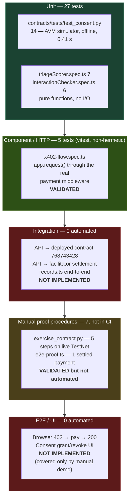

# MedRail — Test Strategy


> **⚠ Correction notice.** Parts of this document were written against a review finding that was
> later proven wrong. Settlement in x402 v2 happens **only** on a sub-400 response, so **no error
> path in MedRail can consume a settled payment** — and consent-denied calls (HTTP 403) are **not
> charged**, contrary to `API.md`, `SECURITY.md`, and the `paidButDenied` field. The audit-sequence
> race causes a **rejected transaction**, not a corrupted log. See
> [`CORRECTIONS.md`](../CORRECTIONS.md) — it supersedes any statement here that contradicts it.

**Purpose:** define how MedRail is verified, which risks each test level is accountable for, and — explicitly — which risks nothing in this repository currently covers.

**Status of this document:** **IMPLEMENTED** as a description of the strategy actually in force on 2026-08-21. Every count, command and result in it was executed against commit `32ffd73` on branch `master`. Sections marked **RECOMMENDED** are the author's proposals and describe nothing that exists today.

**Cross-references:** [`../02_Requirements/Requirements_Traceability_Matrix.md`](../02_Requirements/Requirements_Traceability_Matrix.md) (requirement IDs), [`../06_Security/Threat_Model.md`](../06_Security/Threat_Model.md) (S-1 and the security test debt), [`Test_Plan.md`](Test_Plan.md), [`Test_Cases.md`](Test_Cases.md), [`Test_Results.md`](Test_Results.md), [`Performance_Validation.md`](Performance_Validation.md).

---

## 1. Testing philosophy

MedRail's verification posture rests on three deliberate positions and one unmanaged gap.

| # | Position | Consequence |
|---|---|---|
| P1 | **Push correctness into pure functions and a deterministic contract, then test those exhaustively and offline.** | The two "intelligence" services are pure functions over static tables (`api/src/services/triageScorer.ts:53`, `api/src/services/interactionChecker.ts:36`); the consent state machine is a single 259-line contract. All 32 automated tests target these two surfaces. |
| P2 | **Prefer a real simulator over a mock.** | The contract suite runs the actual `algopy` primitives — `op.sha256`, `op.itob`, `BoxMap` reads/writes, ARC-4 encoding, `assert` → failure — against an in-memory ledger, rather than stubbing them out. Box keys computed in a test are the same bytes the AVM computes. |
| P3 | **Treat safety text as a correctness property, not as copy.** | The non-diagnostic disclaimer (AI-002 / FR-009) is asserted by tests in both service suites. A developer who deletes the disclaimer breaks the build, not just the tone. |
| G1 | **The integration and E2E-automation tiers are empty.** | Everything between "pure function" and "manually-run proof script" is unverified: the consent-gated route, the chain-integration module, the browser client, and every cross-component contract between them. This is not a stylistic gap; it is where the repository's one **CRITICAL** security finding (S-1) and its one **HIGH** money-loss finding (R-2) both live. |

The strategy is therefore honest but **bottom-heavy to the point of being unbalanced**. The parts that are tested are tested well. The parts that are not tested are the parts that handle money and identity.

---

## 2. The pyramid as it actually is



**Totals: 32 automated tests (14 Python + 18 TypeScript), 7 manual on-chain/HTTP proof procedures, 0 integration tests, 0 frontend tests, 0 E2E tests.**

Read the diagram as a defect-detection profile, not as a shape to admire: the widest band catches logic errors in scoring and consent semantics; the red bands are where an undetected defect reaches a paying caller.

---

## 3. Test levels and accountability

| Level | Responsible for | Present? | Artefacts | Requirement IDs covered |
|---|---|---|---|---|
| **L1 — Contract unit (AVM simulator)** | Consent state machine, authorisation asserts, audit sequencing, expiry arithmetic, box lifecycle | **IMPLEMENTED** — 14 tests | `contracts/tests/test_consent.py` | FR-018…FR-023, FR-026…FR-029, SEC-001, SEC-002, SEC-003, DATA-001, DATA-002 |
| **L2 — Service unit (pure function)** | Triage scoring, banding, capping, case-insensitivity; interaction matching; disclaimer/provenance invariants | **IMPLEMENTED** — 13 tests | `api/test/triageScorer.spec.ts`, `api/test/interactionChecker.spec.ts` | FR-004…FR-009, AI-001, AI-002, AI-004, NFR-009, DATA-005 |
| **L3 — HTTP component** | That the x402 middleware is mounted, that unpaid priced routes 402, that the challenge carries the right price and network, that free routes stay free | **IMPLEMENTED** — 5 tests, **non-hermetic** | `api/test/x402-flow.spec.ts` | FR-001, FR-002, FR-016 |
| **L4 — Integration (API ↔ chain, API ↔ facilitator)** | `records.ts`, `services/algorand.ts`, payer binding, box-key parity, concurrency | **NOT IMPLEMENTED** | none | FR-010…FR-012, FR-039, NFR-011, REL-002, REL-004, SEC-006, SEC-007 |
| **L5 — System / on-chain proof** | Real lifecycle and real settlement on TestNet | **VALIDATED but not automated** — 7 manual procedures | `contracts/scripts/exercise_contract.py`, `api/scripts/e2e-proof.ts` | FR-003, FR-018, FR-020, FR-023, FR-040 |
| **L6 — UI / E2E** | Browser wallet, paid call from the browser, consent UI | **NOT IMPLEMENTED** | none | FR-033…FR-037 |
| **L7 — Performance** | Latency, throughput, concurrency, settlement success rate | **NOT IMPLEMENTED** | none | PERF-002, PERF-003, PERF-004 |
| **L8 — Security** | Payer binding, input validation, error-message hygiene, dependency CVEs | **NOT IMPLEMENTED** | none | SEC-007, SEC-010, SEC-011, SEC-013, SEC-014, SEC-015 |

---

## 4. The two toolchains

MedRail runs two entirely separate test runtimes. They share no fixtures, no assertions and no reporting.

| | Contract suite | API suite |
|---|---|---|
| Runner | `pytest` | `vitest` 4.1.10 |
| Command | `contracts/.venv/Scripts/python.exe -m pytest tests/ -q` | `cd api && npx vitest run` |
| Engine | `algorand-python-testing` 1.1.0 (in-memory AVM emulation) | Node 20 + Hono's `app.request()` |
| Config file | none — pytest defaults, tests discovered under `contracts/tests/` | **none — no `vitest.config.ts` exists anywhere in the repo**; tests discovered by vitest's default `**/*.spec.ts` glob |
| Network | **none** | **live** — see §4.2 |
| Measured wall time | **0.41 s** for 14 tests | **4.08 s** for 18 tests across 3 files |
| Compilation checked? | Yes, but separately: CI runs `python -m puyapy smart_contracts/consent/contract.py` before pytest (`.github/workflows/ci.yml:22`) | Yes: `npx tsc --noEmit` then `npm run build` (`.github/workflows/ci.yml:40-43`) |

### 4.1 Why the contract tests are genuinely valuable

This is the strongest part of the verification story and deserves crediting precisely, because "unit tests for a smart contract" usually means "mocks that assert the mock was called".

**`algopy_testing_context()`** (`contracts/tests/test_consent.py:12`) opens an `AlgopyTestContext`: an in-memory emulation of the AVM execution environment. Inside it, `algopy`'s primitives are backed by a simulated ledger rather than by a node. When `grant_key()` calls `op.sha256(patient.bytes + requester.bytes + scope.bytes)` (`contract.py:98`), a real SHA-256 of the real 32-byte public keys is computed. When `self.grants[key] = GrantRecord(...)` executes, a real ARC-4 encoding is written into a simulated box under the real `key_prefix="g"`. When an `assert` fails, it fails the way the AVM fails — which is why the negative tests can use `pytest.raises(AssertionError)` and mean it. The context also supplies deterministic value factories: `context.any.account()` mints a fresh, valid account; `context.default_sender` is the account that `create()` recorded as `admin`.

**`context.ledger.patch_global_fields(latest_timestamp=…)`** (`test_consent.py:87`, `:92`) writes directly into the simulated `Global.*` fields. This is what makes expiry testable at all. `check_access` compares `Global.latest_timestamp` against the stored `expires_at` (`contract.py:209`), so verifying "a one-hour grant is valid now and invalid later" requires moving the clock. On a real network you cannot; with a mock you would be asserting your own mock. Here the test sets the clock to 1 000 000, grants for 3 600 s, asserts valid, sets the clock to 1 003 601, and asserts invalid — exercising the contract's own arithmetic on both sides of the boundary.

**`as_sender(context, contract, sender)`** (`test_consent.py:23-33`) is the most sophisticated piece. Authorisation in this contract is expressed as `assert Txn.sender == self.admin.value` (`contract.py:126`, `:222`, `:258`). To test rejection you must change `Txn.sender`, which is a property of the transaction, not of the call. The helper builds a synthetic transaction group —

```python
context.txn.create_group(
    gtxns=[context.any.txn.application_call(sender=sender, app_id=context.ledger.get_app(contract))],
    active_txn_index=0,
)
```

— containing one application-call transaction whose `sender` field is the impersonated account, and marks it the active transaction. Used as a context manager (`with as_sender(...): contract.set_admin(...)`), it makes `Txn.sender` resolve to that account for the duration of the wrapped call and no longer. The result is that `test_set_admin_only_admin`, `test_log_access_rejects_non_admin` and `test_withdraw_excess_admin_only` execute the contract's real authorisation line under a real foreign sender. Nothing is stubbed away. These are the three tests that back SEC-001, SEC-002 and SEC-003.

**Scope limitation, stated for honesty:** the simulator executes the contract's Python source with `algopy` semantics emulated. It is not a TEAL interpreter running `contracts/artifacts/`-compiled bytecode. Compilation is verified independently (CI step `Compile`), but no test asserts that the compiled program behaves identically to the emulated source. That equivalence is currently taken on the compiler's word.

### 4.2 The API suite is not hermetic — and that is a defect

`api/test/x402-flow.spec.ts:2` imports `../src/app.js`, which imports `./x402.js`, which constructs an `HTTPFacilitatorClient` against `config.facilitatorUrl` (`api/src/x402.ts:6`). The first priced request triggers `x402ResourceServer` initialisation, which fetches the facilitator's `/supported` endpoint over the network. The `asset` id and `extra.feePayer` in the 402 challenge come from that response, not from MedRail's own configuration — so the 402 cannot be constructed offline.

Consequences, all real:

| | |
|---|---|
| Determinism | Three of the five `x402-flow` assertions depend on `https://facilitator.goplausible.xyz` being reachable. |
| CI | Defect **CI-2**: a third-party outage produces a red build with a misleading failure message. |
| Runtime | Finding **R-1**: the same coupling means a facilitator outage turns every priced route into an opaque HTTP 500 with no `PAYMENT-REQUIRED` header. |

The tests are still worth having — they assert a *real* 402 with a *real* decoded challenge, which is exactly what a judge would check by hand — but they should be split: a hermetic set against a stubbed `/supported`, plus an opt-in live set excluded from CI. See TC-201 in [`Test_Cases.md`](Test_Cases.md).

---

## 5. Test data strategy

**Synthetic only. There is no real patient data anywhere in this system, and no mechanism by which any could enter it.**

| Data class | Source | Lifetime | Notes |
|---|---|---|---|
| Symptom text | Literals in `triageScorer.spec.ts` | Test-local | Chosen to hit each `RED_FLAGS` group and the 100-point cap |
| Medication names | Literals in `interactionChecker.spec.ts` | Test-local | Real drug names, matched against the 14-pair table in `api/src/data/interactions.json` |
| Record payload | `SYNTHETIC_RECORD` constant, `api/src/routes/records.ts:15-21` | Process lifetime | Returned identically for **every** `patientId`. There is no patient datastore (DATA-004). |
| Contract accounts | `context.any.account()` | Single test | Fresh valid keypairs per test; no fixture reuse, so no cross-test coupling |
| Ledger clock | `context.ledger.patch_global_fields` | Single test | Explicitly set where it matters; otherwise the simulator default |
| TestNet accounts (manual procedures) | `algorand.account.random()` in `contracts/scripts/exercise_contract.py:52-53`, funded 1 ALGO each from the deployer | Permanent on-chain | Throwaway; their addresses are printed, not committed |
| Payment account (manual proof) | `PROOF_MNEMONIC` / `DEPLOYER_MNEMONIC` from `contracts/.env` | Operator-held | **Never committed** — `.gitignore` covers it, and `git ls-files` confirms no `.env` is tracked |

**No fixture file, factory library, seed script, or anonymised extract exists.** Test data is inline literals. At this scale that is defensible; it will not survive the addition of an integration tier, which will need at minimum a shared golden-vector fixture for box keys (TC-120…TC-125).

---

## 6. Environments

| Environment | What runs there | What can be exercised | What cannot |
|---|---|---|---|
| **Local developer machine** | Both suites, both proof scripts, `npm run dev`, `next dev` | Everything, including live TestNet writes | Nothing structurally — this is the only environment where the full system has ever run |
| **GitHub Actions runner** (`ubuntu-latest`) | `contract`, `api`, `web` jobs | Compile, typecheck, build, both unit suites | Any chain write (no operator key in CI), the proof scripts, the frontend at runtime. **And in practice: nothing at all — see CI-1.** |
| **Algorand TestNet** | App `768743428`; USDC ASA `10458941`; GoPlausible facilitator | Consent lifecycle, real settlement, `check_access` reads | `log_access` — **it has never executed here** (E-1) |
| **MainNet** | nothing | nothing | The contract is not deployed on MainNet. `api/fly.toml` nevertheless hard-codes `NETWORK = "mainnet"` (defect D-2). |
| **Container** | nothing | nothing | `api/Dockerfile` and `web/Dockerfile` exist but have never been built by CI (NFR-007 **UNVALIDATED**); D-1 means a container without an explicit `CONSENT_APP_ID` cannot serve `/v1/consent/status` or `/v1/records/summary` at all |

---

## 7. Entry and exit criteria

### 7.1 Entry criteria — a change is eligible for test

| # | Criterion | Enforced by |
|---|---|---|
| E1 | Contract compiles under `puyapy==5.9.0` | CI `contract` job, `ci.yml:22` — *would* run, see CI-1 |
| E2 | `api/` and `web/` typecheck under `strict` with zero errors | `npx tsc --noEmit`, NFR-005 |
| E3 | `api/` builds (`tsc -p tsconfig.json`) and `web/` builds (`next build`) | CI, and verified locally |
| E4 | Any new priced route is registered in the single `paymentMiddleware` map, `api/src/app.ts:37-50` | Convention only — **not enforced by a test** |

### 7.2 Exit criteria — current, as actually applied

| # | Criterion | Status |
|---|---|---|
| X1 | 14/14 contract tests pass | **Met** — verified 2026-08-21 |
| X2 | 18/18 API tests pass | **Met** — verified 2026-08-21 |
| X3 | Both typechecks and both builds pass | **Met** — verified 2026-08-21 |
| X4 | No coverage threshold | **No such criterion exists.** No `--coverage` flag, no threshold, no report anywhere in the repository. |
| X5 | No security gate | **No such criterion exists.** No `npm audit`, `pip-audit`, CodeQL, Dependabot, or SAST step (SEC-014). |
| X6 | No performance gate | **No such criterion exists** (PERF-003). |

### 7.3 Exit criteria — **RECOMMENDED** before any deployment handling real data

These do not exist. They are proposed.

| # | Proposed criterion | Blocking finding |
|---|---|---|
| R1 | A passing security regression test proving a payment by A cannot obtain a record as requester B | **S-1** / SEC-007 / FR-039 |
| R2 | A passing test proving a settled payment is never consumed without delivery or a recoverable record | **R-2** / REL-002 |
| R3 | A passing golden-vector test proving all three box-key derivations agree byte-for-byte | **NFR-011** |
| R4 | `log_access` demonstrated on a real network with the resulting entry read back | **E-1** |
| R5 | CI actually triggering on the repository's default branch | **CI-1** / OPS-006 |
| R6 | A stated coverage floor, measured and enforced | — |

---

## 8. Regression strategy

There is no regression suite as a distinct artefact; the whole of the 32 tests is re-run on every change. At this size that is correct and costs 4.5 s combined.

Two regressions are *known to have occurred* and are worth recording, because only one of them left a test behind:

| Regression | Evidence | Guarded now? |
|---|---|---|
| CORS preflight failure on paid browser calls, caused by a hand-maintained `allowHeaders` allowlist drifting from what `@x402/fetch` sends | Explanatory comment at `api/src/app.ts:25-30` — the fix was to *remove* the allowlist and let Hono reflect the browser's request headers | **No.** The fix is documented but not tested. A future edit re-adding an allowlist would break paid browser calls silently. Proposed as TC-190-adjacent frontend/E2E work. |
| ARC-56 vs ARC-4 parsing drift in `algosdk` | Explanatory comment at `api/src/services/algorand.ts:16-19` — ABI methods are hand-constructed rather than parsed from the ARC-56 file | **No.** Nothing asserts the hand-written `ABIMethod` literals still match `contracts/artifacts/MedRailConsent.arc56.json`. A contract signature change would compile fine and fail at runtime. |

Both are examples of the same structural weakness: **the repository's best engineering judgement is recorded in comments rather than in assertions.**

---

## 9. Defect classification

| Severity | Definition | Current open examples |
|---|---|---|
| **Critical** | Allows an unauthorised party to obtain data, funds, or a false on-chain attribution | **S-1** (payer identity unbound, SEC-007/SEC-008/FR-039) |
| **High** | Loses money, loses a settled payment, or makes a green signal meaningless | **R-2** (500 after settlement, REL-002); **R-1** (facilitator outage → 500, REL-001); **CI-1** (CI has never run on a push, OPS-006); **D-1/D-2** (container config broken by default) |
| **Medium** | Corrupts an off-chain consumer, degrades a public interface, or hides a class of failure | **C-1** (`request_access` event fields swapped); **NFR-011** (three unsynchronised key derivations); **R-3** (invalid address → 500 + internal message leak); **CI-2** (CI depends on a third party); **REL-004/D-7** (in-process lock vs multi-machine config) |
| **Low** | Incorrect published constant, cosmetic, or documentation | **C-2** (`get_grant_box_mbr` under-reports by 400 µALGO/box); **CI-4** (no dependency caching); **AI-006** (short-name false positives) |

Every one of these is *findable by a test that does not exist*. The mapping from defect to the missing test that would catch it is the whole of Part C of [`Test_Cases.md`](Test_Cases.md).

---

## 10. What this strategy does not cover — and why it matters

Stated plainly, because a reviewer will find these anyway.

| # | Uncovered | Why it matters |
|---|---|---|
| 1 | **`api/src/routes/records.ts` — zero tests.** | It is the flagship consent-gated endpoint, the only route that costs $0.05, the only route that writes on-chain, and the location of both **S-1** and **R-2**. FR-010, FR-011 and FR-012 are all **UNVALIDATED**. |
| 2 | **`api/src/services/algorand.ts` — zero tests.** | Highest-risk module in the repository: it holds the operator key, derives all three box keys, performs read-then-write sequence prediction, and is the only code that submits a transaction. |
| 3 | **Payer identity is never bound to `requesterAddress`.** | The consent gate is not an access control (S-1). Any paying stranger can name any authorised requester and be served, and the impersonation is then written into the immutable audit trail as a false attribution. No test would notice, because the demo client always sends its own address (`web/components/LiveDemoPanel.tsx`). |
| 4 | **Box-key derivation exists three times and is cross-checked zero times.** | `contract.py:96-98` (Python), `api/src/services/algorand.ts:64-79` (Node), `web/lib/consent.ts:26-34` (browser `crypto.subtle`). A prefix or hash-input change breaks two of three silently. NFR-011 is **UNVALIDATED**. |
| 5 | **`log_access` has never executed on Algorand TestNet.** | Deployed app `768743428` reports `total_audit_entries = 0` and holds zero `s`- or `a`-prefixed boxes. The audit-append mechanism — the system's headline differentiator — is proven **only in the AVM simulator** (E-1). |
| 6 | **No concurrency test.** | `withPatientLock` (`algorand.ts:123-138`) is in-process only, while `api/fly.toml` permits more than one machine (D-7). The mitigation `docs/SECURITY.md` claims is contradicted by the deployment config, and nothing tests either. Note the failure mode precisely: the contract self-assigns the audit sequence (`contract.py:224-236`), so a race does **not** corrupt the log — it gets the losing transaction **rejected**, because the client must declare the audit box reference before the contract has chosen it (`algorand.ts:158-159`, `:169-172`). Through R-2 that rejection becomes a 500 after settlement. |
| 7 | **No frontend test of any kind.** | No Vitest, Jest, Playwright or Cypress configuration exists in `web/`. FR-033…FR-037 rest entirely on manual demonstration. |
| 8 | **No coverage measurement.** | No figure can honestly be quoted. Requirement coverage is countable (see [`Test_Cases.md`](Test_Cases.md)); line coverage is not. |
| 9 | **No performance measurement.** | Two single-sample observations exist (505 ms cold `/v1/consent/status`; ~15 ms warm 402). Nothing else. PERF-002 and PERF-003 are **NOT IMPLEMENTED**. See [`Performance_Validation.md`](Performance_Validation.md). |
| 10 | **No security scanning, no fuzzing, no mutation testing.** | Dependency CVEs, contract input fuzzing, and assertion quality are all unmeasured (SEC-014). |
| 11 | **The compiled TEAL is never executed by a test.** | Compilation is checked; equivalence between compiled artefact and emulated source is not. |
| 12 | **CI has never run on a push.** | `ci.yml:5` triggers on `main`; the only branch is `master`. All jobs pass locally — the pipeline is correct, it simply has never fired (CI-1). |

**The honest summary:** MedRail's tests prove that its *rules* are right. They do not prove that its *system* is safe. The gap between those two statements is where every open Critical and High finding sits.

---

## 11. Strategy roadmap — **RECOMMENDED**, in priority order

| Priority | Action | Closes | Effort |
|---|---|---|---|
| 1 | Bind the payer to `requesterAddress` and add TC-110 as a permanent security regression test | S-1, SEC-007, SEC-008, FR-039 | ~10–15 lines + 1 test |
| 2 | Add the `records.ts` route suite (TC-100…TC-105) with `checkAccess`/`logAccess` injected or module-mocked | FR-010, FR-011, FR-012, REL-002 | ~0.5 day |
| 3 | Add the golden-vector box-key parity suite (TC-120…TC-125) across all three implementations | NFR-011 | ~0.5 day |
| 4 | Fix `ci.yml` trigger to the real default branch; stub the facilitator for CI; add a coverage report | CI-1, CI-2, CI-3, OPS-006 | ~2 hours |
| 5 | Run `log_access` once against TestNet and record the transaction and read-back entry | E-1, FR-012, FR-025 | ~1 hour |
| 6 | Add contract tests for event payloads and `get_grant_box_mbr` (TC-150, TC-153) | C-1, C-2 | ~2 hours |
| 7 | Add the concurrency harness (TC-130…TC-134) | REL-004, D-7 | ~0.5 day |
| 8 | Introduce Playwright and one E2E path (TC-194) | FR-033…FR-037 | ~1 day |
| 9 | Introduce k6/autocannon and establish a first latency baseline | PERF-002, PERF-003 | ~1 day |
