# MedRail — Test Strategy

**Purpose:** define how MedRail is verified, which risks each test level is accountable for, and — explicitly — which risks nothing in this repository currently covers.

**Status of this document:** **IMPLEMENTED** as a description of the strategy actually in force on 2026-08-21. Every count, command and result in it was executed against commit `3b387df` on branch `main`. Sections marked **RECOMMENDED** are the author's proposals and describe nothing that exists today.

**Cross-references:** [`../02_Requirements/Requirements_Traceability_Matrix.md`](../02_Requirements/Requirements_Traceability_Matrix.md) (requirement IDs), [`../06_Security/Threat_Model.md`](../06_Security/Threat_Model.md), [`Test_Plan.md`](Test_Plan.md), [`Test_Cases.md`](Test_Cases.md), [`Test_Results.md`](Test_Results.md), [`Performance_Validation.md`](Performance_Validation.md).

---

## 1. Testing philosophy

MedRail's verification posture rests on four deliberate positions and one remaining gap.

| # | Position | Consequence |
|---|---|---|
| P1 | **Push correctness into pure functions and a deterministic contract, then test those exhaustively and offline.** | The two "intelligence" services are pure functions over static tables (`api/src/services/triageScorer.ts:53`, `api/src/services/interactionChecker.ts:36`); the consent state machine is a single contract. These two surfaces still carry the bulk of the 73 automated tests. |
| P2 | **Prefer a real simulator over a mock.** | The contract suite runs the actual `algopy` primitives — `op.sha256`, `op.itob`, `BoxMap` reads/writes, ARC-4 encoding, `assert` → failure — against an in-memory ledger, rather than stubbing them out. Box keys computed in a test are the same bytes the AVM computes. The same instinct governs `x402Payer.spec.ts`, which builds real `algosdk`-signed transactions inside real x402 v2 payloads rather than stubbing the decoder. |
| P3 | **Treat safety text as a correctness property, not as copy.** | The non-diagnostic disclaimer (AI-002 / FR-009) is asserted by tests in both service suites. A developer who deletes the disclaimer breaks the build, not just the tone. |
| P4 | **A defect is closed when a test fails without the fix.** | The five regression tests added for G-01, G-12, G-20, SEC-010 and SEC-011 were each **run against the pre-fix code and observed to fail** before the fix landed. A test written after the fact, against the fixed code, proves only that the code does what it currently does. See [`Test_Results.md`](Test_Results.md) §2.4. |
| G1 | **The integration tier is still thin, and the E2E-automation tier is still empty.** | Two of the three surfaces this used to describe are now covered: payer binding has unit tests plus a live end-to-end proof, and box-key parity has a shared golden-vector fixture asserted from both languages. What remains uncovered is `api/src/routes/records.ts` (no route-level test of any kind), `api/src/services/algorand.ts` (**G-05**), the concurrency behaviour of the audit lock (**G-11**), and the whole browser client. |

The strategy is therefore honest and still **bottom-heavy**, but no longer bottom-heavy in the place that mattered most: the two surfaces handling money and identity — the payment gate and the consent check — now have tests that fail when the guard is removed. What is left uncovered is mostly *composition*: the route that wires those pieces together, and the module that talks to the chain.

---

## 2. The pyramid as it actually is

```mermaid
graph TD
    subgraph L5["E2E / UI — 0 automated"]
        E["Browser 402 → pay → 200<br/>Consent grant/revoke UI<br/><b>NOT IMPLEMENTED</b><br/>(covered only by manual demo)"]
    end
    subgraph L4["Live proof scripts — 9 procedures, not in CI"]
        M["exercise_contract.py — 5 steps on TestNet<br/>e2e-proof.ts — settled payment on /v1/triage<br/>e2e-consent-proof.ts — grant → pay → audit append<br/>verify-g01-fix.ts — impersonation blocked + control<br/><b>VALIDATED but not automated</b>"]
    end
    subgraph L3["Integration — 0 automated"]
        I["API ↔ deployed contract 768743428<br/>records.ts end-to-end<br/>withPatientLock under concurrency<br/><b>NOT IMPLEMENTED</b>"]
    end
    subgraph L2["Component / HTTP — 12 tests"]
        H2["app.spec.ts <b>7</b> — service index, address<br/>validation, rate limiting — hermetic"]
        H1["x402-flow.spec.ts <b>5</b> — real payment<br/>middleware — <b>non-hermetic</b>"]
    end
    subgraph L1["Unit — 61 tests"]
        U1["test_consent.py <b>17</b> — AVM simulator, offline"]
        U2["test_box_keys.py <b>11</b> + boxKeyParity.spec.ts <b>14</b><br/>one shared golden-vector fixture, three languages"]
        U3["triageScorer.spec.ts <b>7</b><br/>interactionChecker.spec.ts <b>6</b><br/>pure functions, no I/O"]
        U4["x402Payer.spec.ts <b>6</b> — real signed<br/>transactions, no network"]
    end
    L1 --> L2 --> L3 --> L4 --> L5
    style L1 fill:#1b4332,stroke:#2d6a4f,color:#fff
    style L2 fill:#2d5016,stroke:#40621f,color:#fff
    style L3 fill:#5c1a1a,stroke:#7a2222,color:#fff
    style L4 fill:#4a3f1a,stroke:#6b5a24,color:#fff
    style L5 fill:#5c1a1a,stroke:#7a2222,color:#fff
```



**Totals: 73 automated tests (28 Python + 45 TypeScript), 9 live proof procedures, 0 integration tests, 0 frontend tests, 0 E2E tests.**

Read the diagram as a defect-detection profile, not as a shape to admire. Three things changed since the first edition and all three are visible in it:

- **The unit tier more than doubled**, from 27 to 61, and the growth is not more of the same: it added a cross-language parity group and a payment-identity group, neither of which is a rule-engine test.
- **The component tier gained a hermetic file.** `app.spec.ts` reaches only free routes, so 40 of the 45 API tests now run with no outbound request. `x402-flow.spec.ts` is still the exception (CI-2).
- **L4 gained two scripts that assert rather than demonstrate.** `verify-g01-fix.ts` computes an explicit verdict and exits non-zero on failure — it is a test in everything but its runner. `e2e-consent-proof.ts` aborts before paying if the setup grant did not take effect, so it cannot spend money to prove nothing.

The red bands remain red. L3 is where an undetected defect in the composition of paying, checking consent and writing the audit entry would reach a paying caller, and it is still empty.

---

## 3. Test levels and accountability

| Level | Responsible for | Present? | Artefacts | Requirement IDs covered |
|---|---|---|---|---|
| **L1 — Contract unit (AVM simulator)** | Consent state machine, authorisation asserts, audit sequencing, expiry arithmetic, box lifecycle, ARC-28 event payloads, box-MBR constant | **IMPLEMENTED** — 17 tests | `contracts/tests/test_consent.py` | FR-018…FR-024, FR-026…FR-029, FR-032, SEC-001…SEC-003, DATA-001, DATA-002, DATA-005 |
| **L1b — Cross-language key parity** | That the Python, Node and WebCrypto box-key derivations produce identical bytes | **IMPLEMENTED** — 11 Python + 14 TypeScript over one shared fixture | `contracts/tests/test_box_keys.py`, `api/test/boxKeyParity.spec.ts`, `api/test/fixtures/box-key-vectors.json` | NFR-011, DATA-001, FR-032 |
| **L2 — Service unit (pure function)** | Triage scoring, banding, capping, case-insensitivity; interaction matching; disclaimer/provenance invariants | **IMPLEMENTED** — 13 tests | `api/test/triageScorer.spec.ts`, `api/test/interactionChecker.spec.ts` | FR-004…FR-009, AI-001, AI-002, AI-004, NFR-009, DATA-005 |
| **L2b — Payment-identity unit** | Recovering the true payer from a verified `PAYMENT-SIGNATURE`, including sponsored multi-leg groups and every malformed-input path | **IMPLEMENTED** — 6 tests, hermetic | `api/test/x402Payer.spec.ts` | SEC-007, FR-039, FR-003 |
| **L3 — HTTP component** | That the x402 middleware is mounted and prices correctly, that the service index matches the mounted routes, that addresses are checksum-validated, that internal errors are not disclosed, that free routes are rate-limited and the health probe is not | **IMPLEMENTED** — 12 tests (7 hermetic, 5 not) | `api/test/app.spec.ts`, `api/test/x402-flow.spec.ts` | FR-001, FR-002, FR-016, FR-017, FR-038, SEC-010, SEC-011, SEC-013 |
| **L4 — Integration (API ↔ chain)** | `records.ts` composition, `services/algorand.ts`, concurrent audit writes, facilitator-outage degradation | **NOT IMPLEMENTED** | none | FR-010…FR-012, REL-001, REL-003, REL-004, SEC-006 |
| **L5 — System / on-chain proof** | Real lifecycle, real settlement, real audit append, and a real impersonation attempt on TestNet | **VALIDATED but not automated** — 9 procedures | `contracts/scripts/exercise_contract.py`, `api/scripts/e2e-proof.ts`, `api/scripts/e2e-consent-proof.ts`, `api/scripts/verify-g01-fix.ts` | FR-003, FR-010, FR-012, FR-018, FR-020, FR-023, FR-025, FR-040, SEC-008 |
| **L6 — UI / E2E** | Browser wallet, paid call from the browser, consent UI | **NOT IMPLEMENTED** | none | FR-033…FR-037 |
| **L7 — Performance** | Latency, throughput, concurrency, settlement success rate | **NOT IMPLEMENTED** (**G-24**) | none | PERF-002, PERF-003, PERF-004 |
| **L8 — Security scanning** | Dependency CVEs, SAST, secret scanning, fuzzing, mutation testing | **PARTIALLY IMPLEMENTED** — `npm audit --audit-level=high` gates both Node jobs in CI, 0 vulnerabilities. No `pip-audit`, CodeQL, `gitleaks`, fuzzing or mutation testing | `.github/workflows/ci.yml` | SEC-014 (partly); SEC-015 satisfied by `.dockerignore` but unverified |

---

## 4. The two toolchains

MedRail runs two entirely separate test runtimes. They share no fixtures, no assertions and no reporting.

| | Contract suite | API suite |
|---|---|---|
| Runner | `pytest` | `vitest` 4.1.10 |
| Command | `contracts/.venv/Scripts/python.exe -m pytest tests/ -q` | `cd api && npx vitest run` |
| Engine | `algorand-python-testing` 1.1.0 (in-memory AVM emulation) | Node 20 + Hono's `app.request()` |
| Config file | none — pytest defaults, tests discovered under `contracts/tests/` | **none — no `vitest.config.ts` exists anywhere in the repo**; tests discovered by vitest's default `**/*.spec.ts` glob |
| Network | **none** | **one file of six** — see §4.2 |
| Measured wall time | **0.44 s** for 28 tests across 2 files | **9.99 s** for 45 tests across 6 files (of which `tests 348ms` — the rest is import and transform) |
| Compilation checked? | Yes, and now gated: CI runs `python -m puyapy smart_contracts/consent/contract.py`, copies the output into `contracts/artifacts/`, and fails on `git diff --exit-code` — so the committed ARC-56 spec cannot drift from the source | Yes: `npx tsc --noEmit` then `npm run build` |
| Dependency audit? | **No** — `pip-audit` is not wired (TC-204) | **Yes** — `npm audit --audit-level=high`, 0 vulnerabilities |

**They do share one thing now.** `api/test/fixtures/box-key-vectors.json` is read by a pytest module and by a vitest module, and neither owns a private copy. It is the only fixture crossing the two runtimes, and it exists because the alternative — three independent implementations of one hash derivation, cross-checked nowhere — fails closed and silently: a one-byte divergence makes `check_access` read an empty box and return `false`, presenting as "the patient's grant mysteriously doesn't work" rather than as an error.

### 4.1 Why the contract tests are genuinely valuable

This is the strongest part of the verification story and deserves crediting precisely, because "unit tests for a smart contract" usually means "mocks that assert the mock was called".

**`algopy_testing_context()`** (`contracts/tests/test_consent.py:12`) opens an `AlgopyTestContext`: an in-memory emulation of the AVM execution environment. Inside it, `algopy`'s primitives are backed by a simulated ledger rather than by a node. When `grant_key()` calls `op.sha256(patient.bytes + requester.bytes + scope.bytes)` (`contract.py:98`), a real SHA-256 of the real 32-byte public keys is computed. When `self.grants[key] = GrantRecord(...)` executes, a real ARC-4 encoding is written into a simulated box under the real `key_prefix="g"`. When an `assert` fails, it fails the way the AVM fails — which is why the negative tests can use `pytest.raises(AssertionError)` and mean it. The context also supplies deterministic value factories: `context.any.account()` mints a fresh, valid account; `context.default_sender` is the account that `create()` recorded as `admin`.

**`context.ledger.patch_global_fields(latest_timestamp=…)`** (`test_consent.py:87`, `:92`) writes directly into the simulated `Global.*` fields. This is what makes expiry testable at all. `check_access` compares `Global.latest_timestamp` against the stored `expires_at` (`contract.py:209`), so verifying "a one-hour grant is valid now and invalid later" requires moving the clock. On a real network you cannot; with a mock you would be asserting your own mock. Here the test sets the clock to 1 000 000, grants for 3 600 s, asserts valid, sets the clock to 1 003 601, and asserts invalid — exercising the contract's own arithmetic on both sides of the boundary.

**`as_sender(context, contract, sender)`** (`test_consent.py:23-33`) is the most sophisticated piece. Authorisation in this contract is expressed as `assert Txn.sender == self.admin.value` (`contract.py:126`, `:222`, `:258`). To test rejection you must change `Txn.sender`, which is a property of the transaction, not of the call. The helper builds a synthetic transaction group —

```python
context.txn.create_group(
    gtxns=[context.any.txn.application_call(sender=sender, app_id=context.ledger.get_app(contract))],
    active_txn_index=0,
)
```

— containing one application-call transaction whose `sender` field is the impersonated account, and marks it the active transaction. Used as a context manager (`with as_sender(...): contract.set_admin(...)`), it makes `Txn.sender` resolve to that account for the duration of the wrapped call and no longer. The result is that `test_set_admin_only_admin`, `test_log_access_rejects_non_admin` and `test_withdraw_excess_admin_only` execute the contract's real authorisation line under a real foreign sender. Nothing is stubbed away. These are the three tests that back SEC-001, SEC-002 and SEC-003.

**Scope limitation, stated for honesty:** the simulator executes the contract's Python source with `algopy` semantics emulated. It is not a TEAL interpreter running `contracts/artifacts/`-compiled bytecode. Compilation is verified independently (CI step `Compile`), but no test asserts that the compiled program behaves identically to the emulated source. That equivalence is currently taken on the compiler's word.

### 4.2 The API suite is still not fully hermetic — CI-2, partially mitigated

`api/test/x402-flow.spec.ts` imports `../src/app.js`, which imports `./x402.js`, which constructs an `HTTPFacilitatorClient` against `config.facilitatorUrl` (`api/src/x402.ts:6`). The first priced request triggers `x402ResourceServer` initialisation, which fetches the facilitator's `/supported` endpoint over the network. The `asset` id and `extra.feePayer` in the 402 challenge come from that response, not from MedRail's own configuration — so the 402 cannot be constructed offline.

| | |
|---|---|
| Blast radius | **5 of 45 tests.** The three new spec files were written to be offline by construction: `x402Payer.spec.ts` builds and signs real transactions locally, `boxKeyParity.spec.ts` hashes locally, and `app.spec.ts` touches only free routes, which never reach the middleware's initialisation. |
| CI | Defect **CI-2**, still open: a third-party outage still fails the build. |
| Runtime | **Closed (G-04).** The same coupling used to turn every priced route into an opaque HTTP 500 with no `PAYMENT-REQUIRED` header. `api/src/app.ts` now catches exactly the two SDK initialisation failures and returns **503 with `Retry-After: 30`** and a stable `PAYMENT_FACILITATOR_UNAVAILABLE` code, rethrowing anything else. Free routes are unaffected either way. |

The remaining five tests are still worth having — they assert a *real* 402 with a *real* decoded challenge, which is exactly what a reviewer would check by hand — but they should be split: a hermetic set against a stubbed `/supported`, plus an opt-in live set excluded from CI. See TC-201 in [`Test_Cases.md`](Test_Cases.md), which is now also the prerequisite for testing the 503 path itself (TC-170).

---

## 5. Test data strategy

**Synthetic only. There is no real patient data anywhere in this system, and no mechanism by which any could enter it.**

| Data class | Source | Lifetime | Notes |
|---|---|---|---|
| Symptom text | Literals in `triageScorer.spec.ts` | Test-local | Chosen to hit each `RED_FLAGS` group and the 100-point cap |
| Medication names | Literals in `interactionChecker.spec.ts` | Test-local | Real drug names, matched against the 14-pair table in `api/src/data/interactions.json` |
| Record payload | `SYNTHETIC_RECORD` constant, `api/src/routes/records.ts:15-21` | Process lifetime | Returned identically for **every** `patientId`. There is no patient datastore (DATA-004). |
| Contract accounts | `context.any.account()` | Single test | Fresh valid keypairs per test; no fixture reuse, so no cross-test coupling |
| Ledger clock | `context.ledger.patch_global_fields` | Single test | Explicitly set where it matters; otherwise the simulator default |
| TestNet accounts (manual procedures) | `algorand.account.random()` in `contracts/scripts/exercise_contract.py:52-53`, funded 1 ALGO each from the deployer | Permanent on-chain | Throwaway; their addresses are printed, not committed |
| Payment account (manual proof) | `PROOF_MNEMONIC` / `DEPLOYER_MNEMONIC` from `contracts/.env` | Operator-held | **Never committed** — `.gitignore` covers it, and `git ls-files` confirms no `.env` is tracked |

**One fixture file now exists**, and it is the exception that proves the rule: `api/test/fixtures/box-key-vectors.json` carries four golden `(patient, requester, scope)` vectors with their expected grant and audit-sequence box keys as literal hex, computed once and reviewed. It is deliberately shared across both runtimes so that neither language can drift from the other (TC-120…TC-125). One of its four vectors uses the **empty scope**, and one uses `patient == requester`, so the derivation's edge cases are pinned rather than assumed.

Everything else is still inline literals. **No factory library, seed script, or anonymised extract exists.** At this scale that remains defensible; it will not survive the addition of an integration tier, which will need at minimum a payment fixture whose recovered payer can be controlled (see `x402Payer.spec.ts` for how one is built).

---

## 6. Environments

| Environment | What runs there | What can be exercised | What cannot |
|---|---|---|---|
| **Local developer machine** | Both suites, both proof scripts, `npm run dev`, `next dev` | Everything, including live TestNet writes | Nothing structurally — this is the only environment where the full system has ever run |
| **GitHub Actions runner** (`ubuntu-latest`) | `contract`, `api`, `web` jobs — **and they now fire**, on `push` to `[main, master]`, on `pull_request`, and on `workflow_dispatch` | Compile, artifact-freshness gate, typecheck, build, both unit suites, `npm audit` on both Node packages | Any chain write (no operator key in CI), the proof scripts, the frontend at runtime, any container build |
| **Algorand TestNet** | App `768743428`; USDC ASA `10458941`; GoPlausible facilitator | The complete lifecycle: consent grant and revoke, `check_access` reads, real x402 settlement on two different routes, and **`log_access` — `total_audit_entries = 5`** | Nothing in the current feature set. What the deployed app *cannot* do is run the C-1 and C-2 fixes: it executes the pre-fix bytecode, because redeploying under `OnUpdate.AppendApp` would mint a new App ID |
| **MainNet** | nothing | nothing | The contract is not deployed on MainNet and no `deploy_mainnet.json` exists. `api/fly.toml` now correctly targets `NETWORK = "testnet"` |
| **Container** | nothing | nothing | `api/Dockerfile` and `web/Dockerfile` exist, both install from the lockfile with `npm ci`, and `.dockerignore` files guard both build roots — but **neither image has ever been built** (NFR-007 **UNVALIDATED**, TC-203). `api/fly.toml` now supplies `NETWORK`, `CONSENT_APP_ID`, a `/v1/health` check and `max_machines_running = 1`, so the configuration defects that would have broken a container at boot are fixed and unexercised |

---

## 7. Entry and exit criteria

### 7.1 Entry criteria — a change is eligible for test

| # | Criterion | Enforced by |
|---|---|---|
| E1 | Contract compiles under `puyapy==5.9.0`, **and the committed artifacts match the recompiled output** | CI `contract` job: compile, copy, then `git diff --exit-code -- contracts/artifacts/` |
| E2 | `api/` and `web/` typecheck under `strict` with zero errors | `npx tsc --noEmit`, NFR-005 |
| E3 | `api/` builds (`tsc -p tsconfig.json`) and `web/` builds (`next build`) | CI, and verified locally |
| E4 | No high-or-critical advisory in either Node dependency tree | `npm audit --audit-level=high` in both Node jobs |
| E5 | Any new priced route is registered in the single `paymentMiddleware` map in `api/src/app.ts` | Convention — but the *advertised* route list is now enforced: `app.spec.ts` asserts `GET /`'s endpoint set equals the mounted set exactly, so a new route that is not advertised fails the build |

### 7.2 Exit criteria — current, as actually applied

| # | Criterion | Status |
|---|---|---|
| X1 | 28/28 contract tests pass | **Met** — verified 2026-08-21 |
| X2 | 45/45 API tests pass | **Met** — verified 2026-08-21 |
| X3 | Both typechecks and both builds pass | **Met** — verified 2026-08-21 |
| X4 | Committed contract artifacts match a fresh compile | **Met** — enforced by CI |
| X5 | No high-or-critical Node dependency advisory | **Met** — `npm audit --audit-level=high` reports 0 vulnerabilities in both packages |
| X6 | Coverage threshold | **No such criterion exists.** No `--coverage` flag, no threshold, no report anywhere in the repository (E-2). |
| X7 | Python dependency gate | **No such criterion exists.** `pip-audit` is not wired (TC-204). |
| X8 | Performance gate | **No such criterion exists** (PERF-003, **G-24**). |
| X9 | Container image gate | **No such criterion exists.** Neither Dockerfile is built by CI (NFR-007, TC-203). |

### 7.3 Exit criteria — **RECOMMENDED** before any deployment handling real data

The first five below have been **met** since the first edition and are kept here as a record of what "met" required. The remainder do not exist and are proposed.

| # | Proposed criterion | Blocking finding | Status |
|---|---|---|---|
| R1 | A passing security regression test proving a payment by A cannot obtain a record as requester B | SEC-007 / FR-039 / **G-01** | **MET** — `x402Payer.spec.ts` (6 tests) plus the live attack-and-control run `verify-g01-fix.ts` |
| R2 | Assurance that a settled payment is never consumed without delivery or a recoverable record | REL-002 | **MET** — by the SDK, not by a MedRail test: `@x402/hono` calls `processSettlement` only on a sub-400 response and cancels on any throw or 4xx/5xx, so settlement is structurally unreachable on an error path. The related MedRail behaviour that *does* need a test is the degradation to `200 { auditStatus: "pending" }` (TC-103) |
| R3 | A passing golden-vector test proving all three box-key derivations agree byte-for-byte | NFR-011 / **G-08** | **MET** — one fixture, two runtimes, three derivations |
| R4 | `log_access` demonstrated on a real network with the resulting entry read back | **E-1** | **MET** — `total_audit_entries = 5`, first append `4YLKLQKK…` |
| R5 | CI actually triggering on the repository's default branch | **CI-1** / OPS-006 | **MET** — `push: [main, master]` + `workflow_dispatch` |
| R6 | A route-level suite for `api/src/routes/records.ts` | FR-010…FR-012 | **NOT MET** — the flagship endpoint still has no offline test (TC-100…TC-105) |
| R7 | A concurrency harness proving the audit lock is load-bearing | REL-004 / **G-11** | **NOT MET** (TC-130, TC-131) |
| R8 | A stated coverage floor, measured and enforced | **G-24**-adjacent, E-2 | **NOT MET** |
| R9 | Both container images built and the API image booted healthy | NFR-007 | **NOT MET** (TC-203) |

---

## 8. Regression strategy

There is no regression suite as a distinct artefact; the whole of the 73 tests is re-run on every change. At this size that is correct and costs about ten seconds combined, almost all of it module import.

**Six regressions now have a permanent guard.** Each was a real defect, and in each case the test was run against the pre-fix code and observed to fail before the fix landed:

| Defect | Guard | Failed pre-fix? |
|---|---|---|
| **G-01** — `requesterAddress` unbound to the paying identity | `x402Payer.spec.ts` "does NOT return an address a caller merely asserts" (TC-110) | Yes — plus the live attack, `verify-g01-fix.ts` |
| **G-12 / C-1** — `AccessRequested` fields transposed | `test_request_access_event_field_order` (TC-150) | Yes — bytes 4…36 held `Txn.sender`, not `patient` |
| **G-20 / C-2** — `GRANT_BOX_MBR` omitted the BoxMap key prefix | `test_grant_box_mbr_matches_the_protocol_formula` (TC-033), `test_get_grant_box_mbr_returns_the_corrected_constant` (TC-153) | Yes — returned 22,100 instead of 22,500 |
| **G-10 / SEC-010** — a 58-character bad-checksum address returned 500 | `app.spec.ts` "rejects a 58-character address with a bad checksum as 400, not 500" (TC-172) | Yes |
| **SEC-011** — `err.message` echoed to unauthenticated callers | `app.spec.ts` "never echoes an internal exception message to the caller" (TC-173) | Yes — the leaked string was `"wrong checksum for address"` |
| **G-34** — the service index advertised 5 of 8 mounted routes | `app.spec.ts` "advertises every mounted route, not a stale subset" (TC-036) | Yes |

**Two regressions are still recorded only in a comment**, and both are worth restating because they are the same structural weakness:

| Regression | Evidence | Guarded now? |
|---|---|---|
| CORS preflight failure on paid browser calls, caused by a hand-maintained `allowHeaders` allowlist drifting from what `@x402/fetch` sends | Explanatory comment in `api/src/app.ts` — the fix was to *remove* the allowlist and let Hono reflect the browser's request headers | **No.** The fix is documented but not tested. A future edit re-adding an allowlist would break paid browser calls silently. TC-196. |
| ARC-56 vs ARC-4 parsing drift in `algosdk` | Explanatory comment in `api/src/services/algorand.ts` — ABI methods are hand-constructed rather than parsed from the ARC-56 file | **No.** Nothing asserts the hand-written `ABIMethod` literals still match `contracts/artifacts/MedRailConsent.arc56.json`. A contract signature change would compile fine and fail at runtime. |

**The weakness, named:** the repository's best engineering judgement is sometimes recorded in comments rather than in assertions. The six rows above are the correction being applied — a comment explaining why a line is the way it is protects the next reader, but only a failing test protects the next edit.

---

## 9. Defect classification

| Severity | Definition | Currently **open** examples | Closed since the first edition |
|---|---|---|---|
| **Critical** | Allows an unauthorised party to obtain data, funds, or a false on-chain attribution | **none** | **G-01** (payer identity unbound) — closed by `x402Payer.ts` + the 403 in `records.ts`, pinned by TC-110 and proven live by TC-058 |
| **High** | Loses money, makes a green signal meaningless, or blocks operation | **G-11** (in-process audit lock pins deployment to one machine); **G-15** (no metrics, tracing or alerting) | **G-04** (facilitator outage → 503, not 500); **G-06 / CI-1** (CI now fires); **G-09** (rate limiting exists); **G-13 / G-14** (container and platform config correct). **REL-002** was never a defect: settlement is structurally unreachable on an error response |
| **Medium** | Corrupts an off-chain consumer, degrades a public interface, or hides a class of failure | **G-05** (thin direct coverage of `services/algorand.ts`); **G-21** (unanchored substring matching); **G-25** (`fund_mbr` and the `withdraw_excess` positive path untested); **G-28** (documented compile command writes to the wrong directory); **CI-2** (CI still depends on a third party) | **G-08 / NFR-011** (three key derivations now cross-checked); **G-10 / SEC-010 / SEC-011** (checksum validation, no message disclosure); **G-12 / C-1** (event field order — fixed in source); **G-34** (service index complete) |
| **Low** | Incorrect published constant, cosmetic, or documentation | **G-26** (no negation handling in the triage scorer); **G-29** (`config.indexerServer` dead); **G-31** (`withdraw_excess` unbounded in-contract); **G-32** (`total_grants_active` not decremented on expiry); **G-33** (redundant algod round-trip in `logAccess`) | **G-20 / C-2** (`get_grant_box_mbr` — fixed in source); **CI-4** (dependency caching added); **G-16 / G-27** (dependency advisories resolved) |

**Two entries above are "fixed in source" rather than "fixed".** G-12 and G-20 are corrected in `contract.py` and pinned by passing tests, but App `768743428` still runs the pre-fix bytecode: `deploy_testnet.py` uses `OnUpdate.AppendApp`, so a redeploy would mint a new App ID and orphan the deployment's entire history. That is a deliberate trade, not an oversight.

Every open item above is *findable by a test that does not exist*. The mapping from defect to the missing test that would catch it is the whole of Part C of [`Test_Cases.md`](Test_Cases.md).

---

## 10. What this strategy does not cover — and why it matters

Stated plainly, because a reviewer will find these anyway.

| # | Uncovered | Why it matters |
|---|---|---|
| 1 | **`api/src/routes/records.ts` — still zero route-level tests.** | It is the flagship consent-gated endpoint, the only route that costs $0.05, and the only route that writes on-chain. Its two guards are now individually tested — the payer check by `x402Payer.spec.ts`, the consent check by the contract suite — but nothing tests their *composition*, the denial branch, or the `auditStatus: "pending"` degradation. FR-011 has no evidence at all; FR-010 and FR-012 have live on-chain evidence and no offline test (TC-100…TC-105). |
| 2 | **`api/src/services/algorand.ts` — still no dedicated test file (G-05).** | Highest-risk module in the repository: it holds the operator key, derives all three box keys, performs read-then-write sequence prediction, and is the only code that submits a transaction. Its key derivations are now pinned indirectly by the golden-vector fixture, but its transaction construction, locking and error handling are not. |
| 3 | **No concurrency test (G-11).** | `withPatientLock` is in-process only. `api/fly.toml` now sets `max_machines_running = 1` and explains why, which bounds the exposure rather than removing it — the system cannot scale horizontally until the sequence prediction moves off the client or the lock moves into shared state. Note the failure mode precisely: the contract self-assigns the audit sequence (`contract.py:224-236`), so a race does **not** corrupt the log — it gets the losing transaction **rejected**, because the client must declare the audit box reference before the contract has chosen it. That rejection is now caught and degraded to `200 { auditStatus: "pending" }`, so it costs an audit entry rather than a response — and *that* degradation is itself untested. |
| 4 | **`fund_mbr` and the successful `withdraw_excess` path are untested (G-25).** | Both are contract methods that move ALGO. Only the non-admin rejection of `withdraw_excess` is asserted. `fund_mbr` is the method that keeps the app solvent for box MBR, so it is untested code on the path that keeps consent grants creatable at all. |
| 5 | **No frontend test of any kind.** | No Vitest, Jest, Playwright or Cypress configuration exists in `web/`. FR-033…FR-037 rest entirely on manual demonstration. |
| 6 | **No coverage measurement.** | No figure can honestly be quoted. Requirement coverage is countable (see [`Test_Cases.md`](Test_Cases.md) §4 — 41 of 101); line coverage is not. |
| 7 | **No performance measurement (G-24).** | Two single-sample observations exist (505 ms cold `/v1/consent/status`; ~15 ms warm 402). Nothing else. PERF-002 and PERF-003 are **NOT IMPLEMENTED**. See [`Performance_Validation.md`](Performance_Validation.md). |
| 8 | **No fuzzing, no mutation testing, no SAST, no Python dependency audit.** | Node dependency CVEs are now gated (`npm audit --audit-level=high`, 0 vulnerabilities in both packages), but contract input fuzzing and assertion quality remain unmeasured — and mutation testing is precisely the technique that would surface the §3.4 weakness recorded in [`Test_Results.md`](Test_Results.md). |
| 9 | **The compiled TEAL is never executed by a test.** | Compilation is checked, and CI now fails on any drift between `contract.py` and the committed artifacts. Equivalence between the compiled artefact and the emulated source is still taken on the compiler's word. |
| 10 | **Two rule-engine defects remain open and unpinned (G-21, G-26).** | `checkInteractions(["a","b"])` returns five spurious severe-interaction matches, and `scoreTriage("I have no chest pain")` bands as `urgent`. Both are trivially reproducible by a reviewer at a keyboard, both are disclosed in `09_Intelligence_Layer/Limitations.md`, and neither has a test — so a future change to either behaviour would be accidental (TC-180, TC-185, TC-186). |
| 11 | **Neither container image has ever been built.** | NFR-007 is **UNVALIDATED**. Both Dockerfiles and `api/fly.toml` are now correct on paper — `npm ci`, `.dockerignore`, `NETWORK`, `CONSENT_APP_ID`, health check — and none of it has been executed once (TC-203). |
| 12 | **Nothing is publicly hosted.** | No public HTTPS endpoint, no MainNet deployment, no Bazaar listing, and every settled payment to date is a self-payment from the project's own account. |

**The honest summary:** MedRail's tests prove that its *rules* are right, and now also that its *payment gate is an authorisation boundary* and that its *three key derivations agree*. They still do not prove that its *composition* is safe — the route that wires payment, consent and audit together has no test, and the module that talks to the chain has none either. That is where the remaining risk sits, and it is a smaller and better-defined gap than the one this section described a day earlier.

---

## 11. Strategy roadmap — **RECOMMENDED**, in priority order

**Delivered since the first edition** (recorded so the roadmap stays honest about what it cost):

| Was | Delivered | Closed |
|---|---|---|
| 1 | Payer binding + TC-110 as a permanent security regression test, plus a live attack-and-control script | **G-01**, SEC-007, FR-039 |
| 3 | The golden-vector box-key parity suite across all three implementations | **G-08**, NFR-011 |
| 4 (part) | `ci.yml` triggering on the real branch, plus caching, dependency audits and an artifact-freshness gate | **G-06 / CI-1**, **CI-4**, SEC-014 (Node), OPS-006 |
| 5 | `log_access` executed on TestNet — five times, with public transaction ids | **E-1**, FR-012, FR-025 |
| 6 | Contract regression tests for the event payload and `get_grant_box_mbr` | **G-12**, **G-20** (in source) |

**Remaining, in priority order:**

| Priority | Action | Closes | Effort |
|---|---|---|---|
| 1 | Add the `records.ts` route suite (TC-100…TC-105) with `checkAccess`/`logAccess` module-mocked, including the denial branch and the `auditStatus: "pending"` degradation | FR-010, FR-011, FR-012, and the TC-113 ordering guard | ~0.5 day |
| 2 | Stub the facilitator's `/supported` for CI, then add TC-170 and TC-171 on top of it | **CI-2**, REL-001, REL-005 | ~3 hours |
| 3 | Add the concurrency harness (TC-130…TC-134) — assert that *no call is rejected*, and pair it with the lock-bypass case that proves the lock is load-bearing | REL-004, **G-11** | ~0.5 day |
| 4 | Pin the two rule-engine defects (TC-180, TC-185, TC-186) so a future change to either is deliberate | **G-21**, **G-26**, AI-090 | ~30 minutes |
| 5 | Add a direct spec for `services/algorand.ts` covering transaction construction, locking and error typing | **G-05** | ~0.5 day |
| 6 | Add `fund_mbr` and successful-`withdraw_excess` contract tests (TC-154…TC-156) | **G-25**, FR-030, FR-031 | ~2 hours |
| 7 | Build both images in CI and boot-probe the API image (TC-203) | NFR-007 | ~2 hours |
| 8 | Add a coverage report and a stated floor (TC-202); add `pip-audit`, CodeQL and `gitleaks` (TC-204) | **CI-3**, SEC-014, SEC-015 | ~3 hours |
| 9 | Introduce Playwright and one E2E path (TC-194) | FR-033…FR-037 | ~1 day |
| 10 | Introduce k6/autocannon and establish a first latency baseline | PERF-002, PERF-003, **G-24** | ~1 day |
