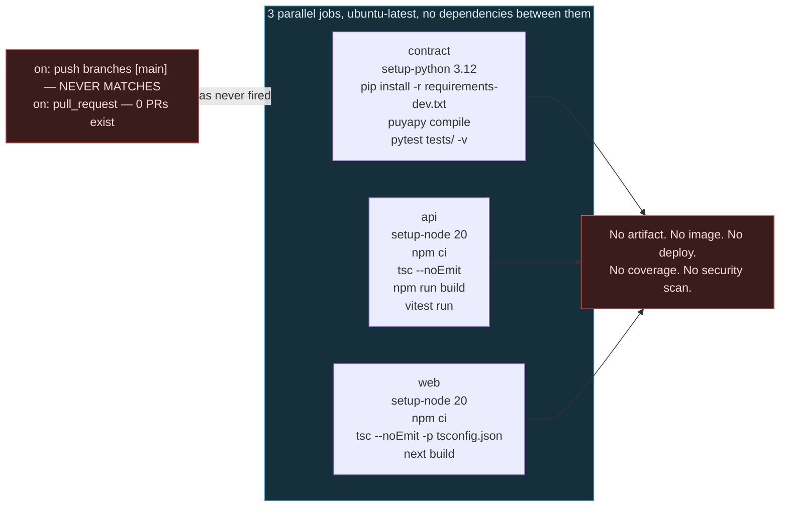

# MedRail — CI/CD

**Purpose:** document the pipeline that exists, prove why it has never run, and supply a replacement that can be committed as-is.

**Status of this document:** authored 2026-08-21 against commit `32ffd73`. §1–§4 describe `.github/workflows/ci.yml` exactly as committed. §5 onward is **RECOMMENDED** and is not in the repo. Repository state at time of writing: **1 branch (`master`), 2 commits, 0 tags, 0 pull requests, 0 releases** — verified with `git branch -a`, `git tag -l`, `git rev-list --count HEAD`.

---

## 0. The headline finding

> **CI-1 (HIGH) — `.github/workflows/ci.yml` triggers on `push: branches: [main]`, but the repository's only branch is `master`. No push to this repository has ever triggered CI, and none ever will until the branch is renamed or the trigger is changed.**

The pipeline is not broken. Every job it defines **passes locally** (verified 2026-08-21: API typecheck 0 errors, API build PASS, 18 API tests passed in 4.08 s, 14 contract tests passed in 0.41 s, web typecheck 0 errors, web build PASS in 6.3 s). The problem is that the pipeline never fires. `pull_request` is also configured and would fire — but the repo has **no pull requests**. Two commits went straight onto `master`.

This is a genuine "the badge is not green because it was never asked to be" finding. It is worth stating plainly rather than letting a reviewer discover it, because the code itself is in good shape.

```
.github/workflows/ci.yml:3-6      on:
                                    push:
                                      branches: [main]     ← never matches
                                    pull_request           ← never fires; 0 PRs exist
$ git branch -a
* master                                                   ← the only branch
```

---

## 1. The pipeline as committed

`.github/workflows/ci.yml`, 67 lines, 3 jobs, all on `ubuntu-latest`, all independent (no `needs:`), all running in parallel.



### 1.1 Job `contract` — "Contract — compile + unit test" (`ci.yml:9-25`)

| Step | Command | Notes |
|---|---|---|
| checkout | `actions/checkout@v4` | — |
| python | `actions/setup-python@v5`, `python-version: "3.12"` | Matches `contracts/pyproject.toml:4` `requires-python = ">=3.12"`. **No `cache:` key** — CI-4 |
| install | `pip install -r requirements-dev.txt` in `contracts/` | Pulls `requirements.txt` transitively (line 1 of the dev file): `algorand-python==3.5.1`, `algokit-utils==4.2.3`, `py-algorand-sdk==2.11.1`, `python-dotenv`, plus `puyapy==5.9.0`, `algorand-python-testing==1.1.0`, `pytest` |
| compile | `python -m puyapy smart_contracts/consent/contract.py --out-dir artifacts` | **Writes to the wrong directory — defect G-28.** See below |
| test | `pytest tests/ -v` | **14 tests**, AVM simulator (`algorand-python-testing` 1.1.0), no network, no funds. Reviewer-measured 0.41 s |

**Assessment:** hermetic, fast, needs no secrets — and its compile step is doing nothing useful.

#### G-28 (MEDIUM) — the compile step writes to a directory nothing reads, and its output is never checked

`puyapy` resolves `--out-dir` **relative to the source file**, not the working directory. `ci.yml:22` therefore writes to `contracts/smart_contracts/consent/artifacts/`, **not** `contracts/artifacts/` — which is the directory `contracts/scripts/deploy_testnet.py:38` and `api/src/app.ts:64` actually read. The same wrong command appears verbatim in **four** places: `README.md:142`, `docs/DEPLOYMENT.md:12`, `docs/PROOF.md:11`, and `.github/workflows/ci.yml:22`.

Two consequences:

1. **A fresh clone following the published Quickstart populates a directory nothing reads.** It only appears to work because the correct artifacts are committed to git. Delete `contracts/artifacts/` and the documented flow no longer produces a deployable spec.
2. **CI compiles the contract and then never compares the result to the committed ARC-56 spec.** So `contract.py` and the spec the deploy script actually uses can diverge silently — which is precisely the mechanism by which a fix for contract defect C-1 or C-2 could be merged while the deployed spec still describes the old contract. A drifted commit passes CI today.

**Credit the matching strength, because it is what makes the fix trivial:** the build is **byte-reproducible**. Recompiling with `puyapy` 5.9.0 produces output identical to the committed artifacts — approval TEAL, clear TEAL, ARC-56 JSON and both `.puya.map` source maps all match. That means a one-line guard is completely reliable:

```yaml
run: python -m puyapy smart_contracts/consent/contract.py --out-dir ../../artifacts
# then:
run: git diff --exit-code -- contracts/artifacts/
```

Both are in the replacement pipeline at §5.

### 1.2 Job `api` — "API — typecheck + build + test" (`ci.yml:27-46`)

| Step | Command | Notes |
|---|---|---|
| node | `actions/setup-node@v4`, `node-version: "20"` | Matches both Dockerfiles. **No `cache: npm`** — CI-4 |
| install | `npm ci` in `api/` | **Correct** — lockfile-exact. Note both Dockerfiles use `npm install` instead (D-4), so the image and CI can install different trees |
| typecheck | `npx tsc --noEmit` | `api/tsconfig.json` has `"strict": true` — NFR-005 |
| build | `npm run build` → `tsc -p tsconfig.json` → `dist/` | Output is **discarded**; nothing is uploaded |
| test | `npx vitest run` | **18 tests** across 3 files. Reviewer-measured 4.08 s. **Not hermetic — CI-2** |

**CI-2 detail:** `api/test/x402-flow.spec.ts` imports `api/src/app.ts`, which constructs `x402ResourceServer` against `FACILITATOR_URL` (`api/src/x402.ts:6-14`). The `402` challenge cannot be built without the facilitator's `/supported` response, because `accepts[].asset` and `extra.feePayer` come from there and not from MedRail config. So the `api` job requires `facilitator.goplausible.xyz` to be reachable from a GitHub-hosted runner. A GoPlausible outage produces a red build with the message `"Failed to initialize: no supported payment kinds loaded from any facilitator."` — which reads like a MedRail bug and is not one. Same root cause as R-1 / REL-001.

**No coverage flag.** `npx vitest run` with no `--coverage`, no threshold, no report.

### 1.3 Job `web` — "Frontend — typecheck + build" (`ci.yml:48-67`)

| Step | Command | Notes |
|---|---|---|
| node | `actions/setup-node@v4`, `node-version: "20"` | **No `cache: npm`** — CI-4 |
| install | `npm ci` in `web/` | Correct |
| typecheck | `npx tsc --noEmit -p tsconfig.json` | 0 errors locally |
| build | `npm run build` with `NEXT_PUBLIC_API_BASE=http://localhost:4021`, `NEXT_PUBLIC_NETWORK=testnet` (`ci.yml:64-66`) | **Correct and deliberate** — these are build-time inlined values, so the build would otherwise depend on an absent `.env.local`. Produces 2 static routes (`/`, `/_not-found`), both prerendered |

**No test step — because there are no frontend tests.** No Vitest, Jest, Playwright or Cypress config exists anywhere in `web/`. `web/package.json` defines `"lint": "eslint"` and CI never calls it.

---

## 2. What the pipeline does **not** do

| Missing | Consequence | Requirement |
|---|---|---|
| Fire on the actual default branch | **The pipeline has never run.** CI-1 | OPS-006 **PARTIALLY IMPLEMENTED** |
| Lint | `web` has ESLint configured and unused; `api` has no linter at all | — |
| Dependency vulnerability scan (`npm audit`, `pip-audit`, Dependabot, CodeQL) | A known-vulnerable transitive dependency ships unnoticed. **Not hypothetical — this is happening today: G-27, `nanoid@3.3.17`, HIGH, fix available, shipping in the web runtime tree** | SEC-014 **NOT IMPLEMENTED** |
| Coverage measurement or gate | No idea what the 32 tests actually cover. Known blind spots: `api/src/routes/records.ts` (0 tests) and `api/src/services/algorand.ts` (0 tests) — the two highest-risk modules | — |
| Build either container image | `api/Dockerfile` and `web/Dockerfile` have **never been built** | NFR-007 **UNVALIDATED**; **OPS-056** *(new)* |
| Publish any artifact | `dist/` and `.next/` are built then thrown away; nothing is tagged or retained | **OPS-059** *(new)* |
| Deploy anywhere | The pipeline is verification-only | — |
| Smoke test a deployed service | `/v1/health` exists and is ideal | OPS-001 |
| Cache dependencies | Every run reinstalls from scratch. CI-4 | — |
| Verify committed artifacts match a fresh compile | `contracts/artifacts/*` could drift from `contract.py` and CI would pass. **G-28** — and the fix is cheap because the build is byte-reproducible | — |
| Run the e2e proof | `api/scripts/e2e-proof.ts` needs a funded mnemonic — **correctly** excluded from CI. It is documented here so nobody mistakes its absence for an oversight | FR-040 **IMPLEMENTED**, not in CI |

---

## 3. Defect register

| ID | Sev | Defect | Evidence | Fix |
|---|---|---|---|---|
| **CI-1** | **HIGH** | Triggers on `push: branches: [main]`; the only branch is `master`. CI has never run on a push, and there are no PRs to trigger the `pull_request` path either. | `ci.yml:3-6`; `git branch -a` → `* master` | Change the trigger, or rename the branch. §5 does both defensively. |
| **CI-2** | MEDIUM | The `api` job depends on a live third-party HTTP call (`facilitator.goplausible.xyz`) made at app-module import. A facilitator outage produces a red build with a misleading message. | `ci.yml:46`; `api/src/x402.ts:6-14`; `api/test/x402-flow.spec.ts` | Split hermetic unit tests from live-facilitator integration tests; run the live suite separately and allow it to fail without blocking. §5, §6. |
| **CI-3** | MEDIUM | **Partly addressed.** `npm audit --audit-level=high` runs, `npm run coverage` runs, and the artifact-freshness gate compares a fresh compile against `contracts/artifacts/current/`. **Still absent:** a deployment stage, a coverage *threshold* (the figure is printed, nothing fails on a drop), artifact publishing, and any image build — `api/Dockerfile` and `web/Dockerfile` were built and booted by hand on 2026-08-22, but CI never exercises them, so nothing stops them regressing. `api/fly.toml` remains unexercised. | `ci.yml`; `contracts/artifacts/README.md` | §5 jobs `security`, `images`, `deploy-staging`, `deploy-mainnet`. |
| **CI-4** | LOW | No dependency caching — `setup-node`'s `cache:` and `setup-python`'s `cache:` are both unused. | `ci.yml:32-34, 56-58, 14-16` | §5 sets both. |
| **G-28** | MEDIUM | The compile step's `--out-dir` resolves relative to the source file, so CI writes artifacts to `contracts/smart_contracts/consent/artifacts/` — a directory nothing reads — and never compares its output to the committed ARC-56 spec. Contract source and deployed spec can diverge silently. | `ci.yml:22`; also `README.md:142`, `docs/DEPLOYMENT.md:12`, `docs/PROOF.md:11` | §1.1, §5 job `contract` |
| **G-27** | **HIGH (advisory)** | `nanoid@3.3.17`, GHSA-2v37-7h3g-55p8, **fix available**, surfaced by `npm audit` — which CI does not run. In `api/` the path is `vitest → vite → postcss` (**dev only**, does not reach the runtime image, which installs `--omit=dev`). In `web/` it is `next@16.3.0 → postcss` — a **production** dependency that **ships**, because `web/Dockerfile:14` copies the full `node_modules`. Exploitability is low (build-time CSS toolchain, not caller-drivable), but it is a currently-shipping HIGH advisory that nothing in the repo would surface. | `npm audit` in `api/` and `web/` | §5 job `security` (`npm audit --audit-level=high`); `Docker.md` §6.0 |

---

## 4. Branch strategy and release process — current state

| Property | Value | Comment |
|---|---|---|
| Branches | `master` only | The workflow expects `main`. **This mismatch is CI-1.** |
| Commits | 2 (`d2a5f7f`, `32ffd73`) | — |
| Tags | **none** | No release is identifiable. Nothing can be referenced as "the version that was deployed" |
| Pull requests | **none** | The `pull_request` trigger has therefore never fired either |
| Releases | none | — |
| Branch protection | not verifiable from the repo contents; assume **none** given direct commits to the default branch | — |
| Contributors | one, per git history | Relevant to `../10_Operations/Incident_Response.md` §escalation |
| Versioning | `api/package.json` and `web/package.json` both `"version": "0.1.0"`; `contracts/pyproject.toml` `version = "0.1.0"` | Never bumped; not tied to anything |
| Deployed-version identification | **impossible** — no image tags, no build metadata, no `/v1/health` version field | See **OPS-059** and `Rollback_Strategy.md` §3 |

This is a normal and entirely defensible state for a two-commit hackathon repository. It becomes a real problem the moment anything is deployed, because **you cannot roll back to a version you cannot name**.

---

## 5. **RECOMMENDED** production pipeline

Complete, ready to commit as `.github/workflows/ci.yml` (replacing the current file). Addresses CI-1…CI-4, plus SEC-014, NFR-007, OPS-056 and OPS-059.

Read §6 before committing — three prerequisites must be satisfied or specific jobs will fail.

```yaml
name: CI

on:
  push:
    # CI-1: trigger on the branch that actually exists. Both are listed so this
    # keeps working through a master -> main rename instead of silently going
    # dark again the way the original did.
    branches: [main, master]
    tags: ["v*"]
  pull_request:
  workflow_dispatch:

concurrency:
  group: ${{ github.workflow }}-${{ github.ref }}
  cancel-in-progress: ${{ github.event_name == 'pull_request' }}

permissions:
  contents: read

jobs:
  # ------------------------------------------------------------------
  # 1. Contract: compile, verify committed artifacts, unit test
  # ------------------------------------------------------------------
  contract:
    name: Contract — compile + unit test
    runs-on: ubuntu-latest
    steps:
      - uses: actions/checkout@v4
      - uses: actions/setup-python@v5
        with:
          python-version: "3.12"
          cache: pip                                    # CI-4
          cache-dependency-path: contracts/requirements-dev.txt
      - name: Install toolchain
        working-directory: contracts
        run: pip install -r requirements-dev.txt
      - name: Compile
        working-directory: contracts
        # G-28: puyapy resolves --out-dir relative to the SOURCE FILE, so the
        # published `--out-dir artifacts` writes to smart_contracts/consent/artifacts/,
        # which nothing reads. This lands in contracts/artifacts/ where
        # deploy_testnet.py:38 and api/src/app.ts:64 look.
        run: python -m puyapy smart_contracts/consent/contract.py --out-dir ../../artifacts
      - name: Fail if the committed artifacts drifted from contract.py
        working-directory: contracts
        run: |
          git diff --exit-code -- artifacts/MedRailConsent.arc56.json \
                                  artifacts/MedRailConsent.approval.teal \
                                  artifacts/MedRailConsent.clear.teal \
          || { echo "::error::contracts/artifacts/ is stale — recompile and commit"; exit 1; }
      - name: Unit test (AVM simulator, no network)
        working-directory: contracts
        run: pytest tests/ -v

  # ------------------------------------------------------------------
  # 2. API: lint, typecheck, build, hermetic tests + coverage
  # ------------------------------------------------------------------
  api:
    name: API — typecheck + build + test
    runs-on: ubuntu-latest
    steps:
      - uses: actions/checkout@v4
      - uses: actions/setup-node@v4
        with:
          node-version: "20"
          cache: npm                                    # CI-4
          cache-dependency-path: api/package-lock.json
      - name: Install
        working-directory: api
        run: npm ci
      - name: Typecheck
        working-directory: api
        run: npx tsc --noEmit
      - name: Build
        working-directory: api
        run: npm run build
      # CI-2: hermetic tests only. The live-facilitator suite runs in the
      # `integration-live` job below, where a GoPlausible outage cannot turn
      # a MedRail change red.
      - name: Test (hermetic) with coverage
        working-directory: api
        run: npx vitest run --coverage --exclude 'test/x402-flow.spec.ts'
      - name: Upload coverage
        if: always()
        uses: actions/upload-artifact@v4
        with:
          name: api-coverage
          path: api/coverage
          retention-days: 14
      - name: Upload build output
        uses: actions/upload-artifact@v4
        with:
          name: api-dist
          path: api/dist
          retention-days: 7

  # ------------------------------------------------------------------
  # 3. Web: lint, typecheck, build
  # ------------------------------------------------------------------
  web:
    name: Frontend — lint + typecheck + build
    runs-on: ubuntu-latest
    steps:
      - uses: actions/checkout@v4
      - uses: actions/setup-node@v4
        with:
          node-version: "20"
          cache: npm
          cache-dependency-path: web/package-lock.json
      - name: Install
        working-directory: web
        run: npm ci
      - name: Lint
        working-directory: web
        run: npm run lint
      - name: Typecheck
        working-directory: web
        run: npx tsc --noEmit -p tsconfig.json
      - name: Build
        working-directory: web
        env:
          NEXT_PUBLIC_API_BASE: http://localhost:4021
          NEXT_PUBLIC_NETWORK: testnet
        run: npm run build

  # ------------------------------------------------------------------
  # 4. Live integration — allowed to fail (CI-2)
  # ------------------------------------------------------------------
  integration-live:
    name: Live facilitator integration (non-blocking)
    runs-on: ubuntu-latest
    continue-on-error: true
    steps:
      - uses: actions/checkout@v4
      - uses: actions/setup-node@v4
        with:
          node-version: "20"
          cache: npm
          cache-dependency-path: api/package-lock.json
      - name: Install
        working-directory: api
        run: npm ci
      - name: Facilitator reachability
        run: |
          curl -fsS --max-time 20 https://facilitator.goplausible.xyz/supported > /dev/null \
          || { echo "::warning::facilitator unreachable — see R-1 / REL-001"; exit 1; }
      - name: x402 402-shape tests (require the live facilitator)
        working-directory: api
        run: npx vitest run test/x402-flow.spec.ts

  # ------------------------------------------------------------------
  # 5. Security: dependency + static analysis (SEC-014)
  # ------------------------------------------------------------------
  security:
    name: Security — audit + SAST
    runs-on: ubuntu-latest
    permissions:
      contents: read
      security-events: write
    steps:
      - uses: actions/checkout@v4
      - uses: actions/setup-node@v4
        with:
          node-version: "20"
      - name: npm audit — api
        working-directory: api
        run: npm audit --audit-level=high
      - name: npm audit — web
        working-directory: web
        run: npm audit --audit-level=high
      - uses: actions/setup-python@v5
        with:
          python-version: "3.12"
      - name: pip-audit — contracts
        run: |
          pip install pip-audit
          pip-audit -r contracts/requirements-dev.txt
      - name: Secret scan (defence in depth for SEC-005 / SEC-015)
        run: |
          if git ls-files | grep -E '(^|/)\.env($|\.)' | grep -v '\.env\.example'; then
            echo "::error::a .env file is tracked by git"; exit 1
          fi

  codeql:
    name: Security — CodeQL
    runs-on: ubuntu-latest
    permissions:
      contents: read
      security-events: write
    strategy:
      fail-fast: false
      matrix:
        language: [javascript-typescript, python]
    steps:
      - uses: actions/checkout@v4
      - uses: github/codeql-action/init@v3
        with:
          language: ${{ matrix.language }}
      - uses: github/codeql-action/autobuild@v3
      - uses: github/codeql-action/analyze@v3

  # ------------------------------------------------------------------
  # 6. Container images — closes NFR-007 / CI-3 / OPS-056
  # ------------------------------------------------------------------
  images:
    name: Build container images
    runs-on: ubuntu-latest
    needs: [contract, api, web, security]
    permissions:
      contents: read
      packages: write
    env:
      REGISTRY: ghcr.io
    steps:
      - uses: actions/checkout@v4
      - uses: docker/setup-buildx-action@v3

      # Always BUILD (proves the Dockerfiles work — the point of NFR-007).
      # Only PUSH from the default branch or a tag.
      - name: Log in to GHCR
        if: github.event_name != 'pull_request'
        uses: docker/login-action@v3
        with:
          registry: ghcr.io
          username: ${{ github.actor }}
          password: ${{ secrets.GITHUB_TOKEN }}

      - name: Build + push medrail-api
        uses: docker/build-push-action@v6
        with:
          context: .                       # repo root — api/Dockerfile needs contracts/artifacts
          file: api/Dockerfile
          push: ${{ github.event_name != 'pull_request' }}
          tags: |
            ghcr.io/${{ github.repository }}/medrail-api:${{ github.sha }}
            ghcr.io/${{ github.repository }}/medrail-api:${{ github.ref_name }}
          cache-from: type=gha
          cache-to: type=gha,mode=max

      - name: Build + push medrail-web
        uses: docker/build-push-action@v6
        with:
          context: ./web
          file: web/Dockerfile
          push: ${{ github.event_name != 'pull_request' }}
          build-args: |
            NEXT_PUBLIC_API_BASE=${{ vars.NEXT_PUBLIC_API_BASE }}
            NEXT_PUBLIC_NETWORK=${{ vars.NEXT_PUBLIC_NETWORK }}
          tags: |
            ghcr.io/${{ github.repository }}/medrail-web:${{ github.sha }}
            ghcr.io/${{ github.repository }}/medrail-web:${{ github.ref_name }}
          cache-from: type=gha
          cache-to: type=gha,mode=max

      # Prove the API image actually serves before anything is deployed.
      - name: Smoke the API image locally
        run: |
          docker run -d --name smoke -p 4021:4021 \
            -e NETWORK=testnet \
            -e CONSENT_APP_ID=768743428 \
            -e PAY_TO_ADDRESS=${{ vars.PAY_TO_ADDRESS }} \
            -e OPERATOR_MNEMONIC='${{ secrets.OPERATOR_MNEMONIC_TESTNET }}' \
            ghcr.io/${{ github.repository }}/medrail-api:${{ github.sha }}
          for i in $(seq 1 30); do
            curl -fsS http://localhost:4021/v1/health && break || sleep 2
          done
          # D-1 guard: a null consentAppId means the container is misconfigured
          # even though /v1/health returns 200.
          curl -fsS http://localhost:4021/v1/health | tee /tmp/health.json
          grep -q '"consentAppId":768743428' /tmp/health.json \
            || { echo "::error::consentAppId not configured in the image — defect D-1"; docker logs smoke; exit 1; }
        # OPERATOR_MNEMONIC is a TestNet-only key here. Never expose a MainNet
        # admin mnemonic to CI — see Disaster_Recovery.md §4.

  # ------------------------------------------------------------------
  # 7. Staged deploy — TestNet staging, automatic
  # ------------------------------------------------------------------
  deploy-staging:
    name: Deploy — TestNet staging
    runs-on: ubuntu-latest
    needs: [images]
    if: github.ref == 'refs/heads/main' || github.ref == 'refs/heads/master'
    environment:
      name: staging
      url: ${{ vars.STAGING_API_URL }}
    steps:
      - uses: actions/checkout@v4
      - uses: superfly/flyctl-actions/setup-flyctl@master
      - name: Deploy
        env:
          FLY_API_TOKEN: ${{ secrets.FLY_API_TOKEN_STAGING }}
        run: flyctl deploy -c api/fly.toml --image ghcr.io/${{ github.repository }}/medrail-api:${{ github.sha }} --app medrail-api-staging
      - name: Smoke test /v1/health
        run: |
          set -e
          for i in $(seq 1 30); do
            if curl -fsS "${{ vars.STAGING_API_URL }}/v1/health" > /tmp/h.json; then break; fi
            sleep 5
          done
          cat /tmp/h.json
          grep -q '"ok":true'         /tmp/h.json || { echo "::error::health not ok";              exit 1; }
          grep -q '"network":"testnet"' /tmp/h.json || { echo "::error::wrong network — see D-2";  exit 1; }
          grep -q '"consentAppId":768743428' /tmp/h.json || { echo "::error::App ID unset — D-1";  exit 1; }
      - name: Smoke test 402 challenge on a priced route
        run: |
          code=$(curl -s -o /dev/null -w '%{http_code}' -X POST "${{ vars.STAGING_API_URL }}/v1/triage" \
                 -H 'content-type: application/json' -d '{"symptoms":"chest pain"}')
          # 402 is the correct unpaid response. 500 means the facilitator is
          # unreachable (R-1 / REL-001), not that this change is broken.
          [ "$code" = "402" ] || { echo "::error::expected 402, got $code"; exit 1; }

  # ------------------------------------------------------------------
  # 8. MainNet — TAG-ONLY, and gated on a human approval
  # ------------------------------------------------------------------
  deploy-mainnet:
    name: Deploy — MainNet (manual approval required)
    runs-on: ubuntu-latest
    needs: [deploy-staging]
    if: startsWith(github.ref, 'refs/tags/v')
    # Configure the `mainnet` GitHub Environment with REQUIRED REVIEWERS.
    # That protection rule is what makes this a manual gate — the `environment:`
    # key alone does not pause anything.
    environment:
      name: mainnet
      url: ${{ vars.MAINNET_API_URL }}
    steps:
      - uses: actions/checkout@v4
      - name: Refuse to deploy without a MainNet contract
        run: |
          # D-2: api/fly.toml ships NETWORK=mainnet but no MainNet MedRailConsent
          # exists. Until contracts/artifacts/deploy_mainnet.json is committed,
          # this job must not proceed.
          test -f contracts/artifacts/deploy_mainnet.json \
            || { echo "::error::no MainNet deployment recorded — see Deployment_Architecture.md D-2"; exit 1; }
      - uses: superfly/flyctl-actions/setup-flyctl@master
      - name: Deploy
        env:
          FLY_API_TOKEN: ${{ secrets.FLY_API_TOKEN_PROD }}
        run: flyctl deploy -c api/fly.toml --image ghcr.io/${{ github.repository }}/medrail-api:${{ github.sha }}
      - name: Smoke test /v1/health
        run: |
          curl -fsS "${{ vars.MAINNET_API_URL }}/v1/health" | tee /tmp/h.json
          grep -q '"ok":true' /tmp/h.json
          grep -q '"network":"mainnet"' /tmp/h.json
```

---

## 6. Prerequisites before committing §5

The pipeline above will fail on a repo in its current state until these are done. That is deliberate — each failure is a real gap being surfaced.

| # | Prerequisite | Why | Job that fails without it |
|---|---|---|---|
| 1 | **Split `api/test/x402-flow.spec.ts` from the hermetic suite**, or accept that `--exclude` removes it from the coverage run | CI-2. The `--exclude` flag in the `api` job assumes that file is the only non-hermetic one — it is (`triageScorer.spec.ts` and `interactionChecker.spec.ts` are pure functions) | `api` |
| 2 | **Add a coverage provider** — `npm i -D @vitest/coverage-v8` in `api/` | `vitest run --coverage` needs one | `api` |
| 3 | **Fix D-4 in both Dockerfiles** (`npm ci`) and **add the two `.dockerignore` files** | The `images` job builds from the repo root; without a `.dockerignore` it streams `contracts/.venv/`, `.git/` and both `node_modules/` trees to the builder — and it would ship `.env.local` into the web image (D-5) | `images` (slow / wrong output) |
| 4 | **Set repo variables**: `PAY_TO_ADDRESS`, `NEXT_PUBLIC_API_BASE`, `NEXT_PUBLIC_NETWORK`, `STAGING_API_URL`, `MAINNET_API_URL` | Referenced as `vars.*` | `images`, `deploy-*` |
| 5 | **Set repo secrets**: `OPERATOR_MNEMONIC_TESTNET`, `FLY_API_TOKEN_STAGING`, `FLY_API_TOKEN_PROD` | Referenced as `secrets.*`. **Only ever put a TestNet mnemonic in CI.** A MainNet admin key in a CI secret store means every workflow-write permission is an admin-key compromise path — SEC-012 | `images`, `deploy-*` |
| 6 | **Create the `staging` and `mainnet` GitHub Environments**, and add **required reviewers** to `mainnet` | The `environment:` key does not gate anything by itself; the *protection rule* is the manual approval | `deploy-mainnet` |
| 7 | **Create the staging Fly app** (`medrail-api-staging`) and fix D-2 in `api/fly.toml` | The staging smoke test asserts `"network":"testnet"`; the committed file says `mainnet` | `deploy-staging` |
| 8 | **Deploy a MainNet contract and commit `deploy_mainnet.json`** | The `deploy-mainnet` job refuses to run without it, by design | `deploy-mainnet` |
| 9 | **Rename `master` → `main`, or keep both in the trigger** | CI-1. §5 lists both so a rename cannot silently break it again | all |
| 10 | **Resolve G-27 first, or expect the `security` job to go red on its first run.** `npm audit --audit-level=high` will fail on `nanoid@3.3.17` in **both** `api/` and `web/` today. That is the job working correctly — a fix is available. Run `npm audit fix` in each, then re-run typecheck and build | Otherwise the very first green-pipeline attempt is a red one and the finding gets suppressed rather than fixed | `security` |
| 11 | **Fix `--out-dir` in `README.md:142`, `docs/DEPLOYMENT.md:12`, `docs/PROOF.md:11`** to match `ci.yml` | G-28. The published Quickstart must produce artifacts in the directory the deploy script reads | `contract` (drift guard) |

If you adopt nothing else from this document, adopt **item 9 and the one-line trigger change**. That alone converts a pipeline that has never run into one that runs on every commit.

### 6.1 Minimum viable fix — one line

If time is short before submission, this is the whole of CI-1:

```diff
 on:
   push:
-    branches: [main]
+    branches: [main, master]
   pull_request:
```

Commit that and every subsequent push to `master` runs the three jobs that already pass. Everything else in §5 is improvement; this is correctness.

---

## 7. **RECOMMENDED** branch strategy

Proportionate to a one-contributor hackathon repository. Not GitFlow.

| Element | Recommendation | Rationale |
|---|---|---|
| Default branch | **one** long-lived branch. Rename `master` → `main` so the ecosystem default matches, or leave `master` and fix the trigger — but pick one and make the workflow agree | CI-1 exists because these two disagreed |
| Feature work | short-lived `feat/<slug>` branches, merged by PR | Makes the `pull_request` trigger useful. Currently it has never fired |
| Branch protection on the default branch | require the `contract`, `api`, `web` and `security` checks to pass | Turns CI from advisory into a gate |
| Direct pushes to default | disallow once protection is on | Both existing commits went direct |
| Releases | annotated tag `vMAJOR.MINOR.PATCH` | `deploy-mainnet` is tag-gated in §5 |
| Hotfix | branch from the tag, fix, tag `vX.Y.Z+1` | See `Rollback_Strategy.md` §6 for forward-fix vs rollback criteria |

### 7.1 **RECOMMENDED** release process

```mermaid
graph LR
    A["feat/* branch"] --> B["PR — contract, api, web, security must pass"]
    B --> C["merge to main"]
    C --> D["images job: build + push ghcr :sha, local smoke"]
    D --> E["deploy-staging: TestNet, auto"]
    E --> F["smoke: /v1/health ok + network + appId, 402 on /v1/triage"]
    F --> G["tag vX.Y.Z"]
    G --> H["deploy-mainnet: BLOCKED on required reviewer"]
    H --> I["human approves"]
    I --> J["deploy + smoke MainNet"]

    style H fill:#3b2f16,stroke:#d99b1c,color:#f5e6c8
    style J fill:#1c3b26,stroke:#4caf50,color:#dcf5e2
```



Release checklist, to run at the tag:

1. All CI checks green on the merge commit (**not just locally** — that is the CI-1 lesson).
2. `git tag -a vX.Y.Z -m "..."` and push the tag.
3. Record the image digest deployed: `docker buildx imagetools inspect ghcr.io/<repo>/medrail-api:<sha>`. **Write the digest into the release notes** — that string is the entire rollback story (OPS-059, `Rollback_Strategy.md` §3).
4. Record the App ID the release is configured against. A release is `(image digest, CONSENT_APP_ID, NETWORK)`, not just an image.
5. Confirm the smoke tests passed against the deployed URL, not against localhost.
6. **Contract changes are not part of this flow.** An Algorand app cannot be updated in place under this deploy configuration — see `Rollback_Strategy.md` §2.

### 7.2 **RECOMMENDED** — surface the deployed version

`GET /v1/health` currently returns `{ok, service, network, consentAppId, time}` (`api/src/routes/health.ts:6-13`). It has **no version field**, so a running service cannot tell you what code it is. Add, at build time:

```ts
// RECOMMENDED — not implemented.
gitSha: process.env.GIT_SHA ?? "unknown",
imageTag: process.env.IMAGE_TAG ?? "unknown",
```

with `--build-arg GIT_SHA=${{ github.sha }}` in the image build. Without this, incident response starts with "which version is running?" and has no answer. See `../10_Operations/Incident_Response.md` §H.

---

## 8. Requirements traceability

| ID | Statement (abbreviated) | Status | Where |
|---|---|---|---|
| OPS-006 | CI shall verify every component on every change to the default branch | **PARTIALLY IMPLEMENTED** — workflow correct, trigger wrong | §0, CI-1 |
| SEC-014 | Dependencies scanned for known vulnerabilities on every change | **NOT IMPLEMENTED** | CI-3, §5 job `security` |
| NFR-005 | All TypeScript compiles under `strict` with zero errors | **VALIDATED** | §1.2, §1.3 |
| NFR-007 | Both components buildable into a container image from a committed Dockerfile | **UNVALIDATED** — never built | CI-3, §5 job `images` |
| SEC-005 | Secrets never committed to version control | **VALIDATED** | §5 secret-scan step is defence in depth |
| **OPS-056** *(new, added by CI_CD.md)* | CI shall build both container images on every change and smoke-test the API image. | **NOT IMPLEMENTED** | §5 job `images` |
| **OPS-059** *(new)* | Every deployed build shall be identifiable and redeployable by an immutable image tag/digest. | **NOT IMPLEMENTED** | §4, §7.1, §7.2 |

---

## 9. Cross-references

- `Deployment_Architecture.md` §3 — the source→CI→build→registry→runtime pipeline with each stage marked EXISTS or MISSING.
- `Docker.md` — the corrected Dockerfiles and `.dockerignore` files that §6 prerequisite 3 refers to.
- `Environment_Setup.md` §11 — the local commands that reproduce every CI job exactly.
- `Rollback_Strategy.md` — why image tags are the whole rollback story, and why the contract is out of scope for it.
- `../02_Requirements/SRS.md` — OPS-006, SEC-014, NFR-005, NFR-007.
- `../06_Security/Risk_Register.md` — SEC-012 (a MainNet admin key must never enter CI), SEC-014.
- `../07_Testing/Test_Plan.md` — the 14+18 inventory, the hermetic/non-hermetic split behind CI-2, and the untested `records.ts` / `algorand.ts` modules that make a coverage gate worth adding.
