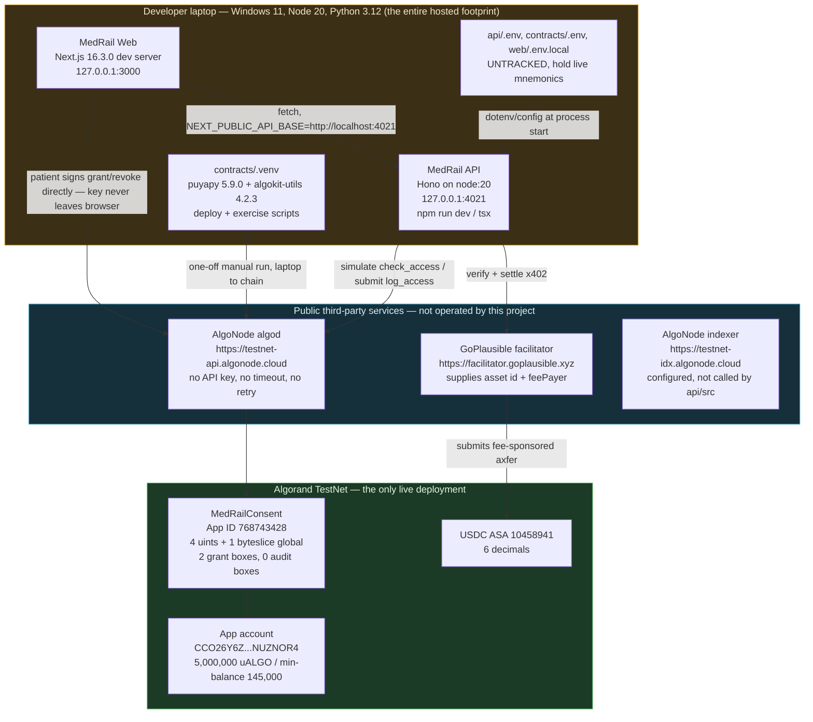
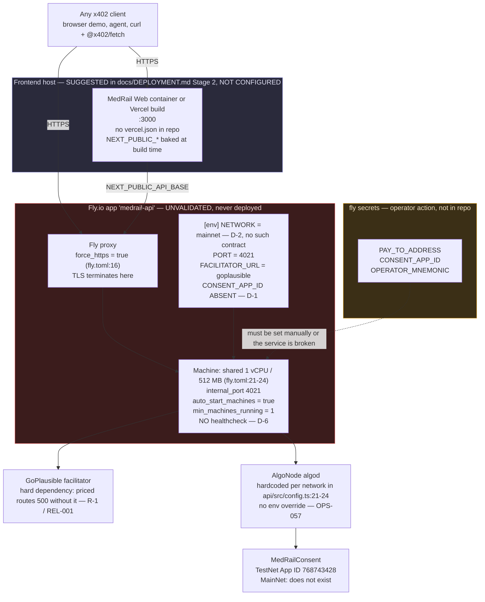
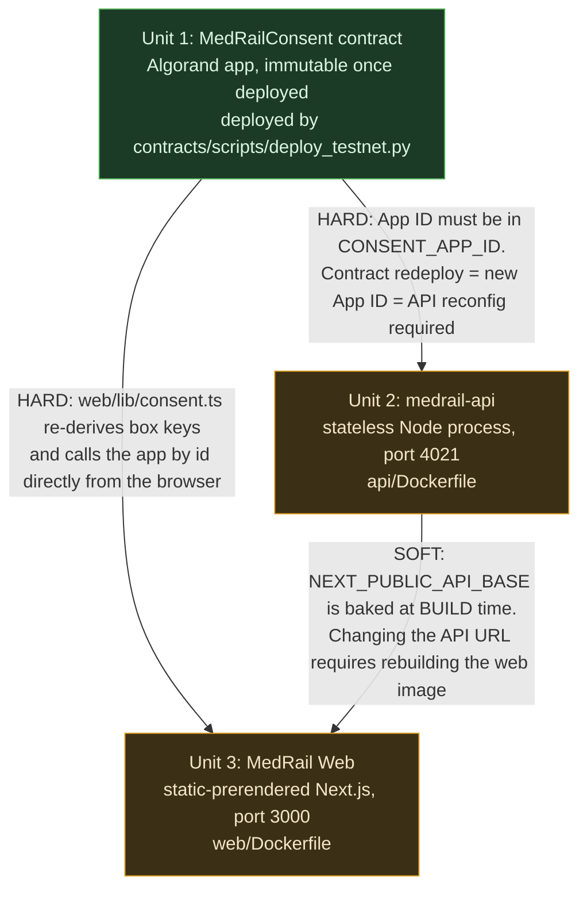

# MedRail — Deployment Architecture


> **⚠ Correction notice.** Parts of this document were written against a review finding that was
> later proven wrong. Settlement in x402 v2 happens **only** on a sub-400 response, so **no error
> path in MedRail can consume a settled payment** — and consent-denied calls (HTTP 403) are **not
> charged**, contrary to `API.md`, `SECURITY.md`, and the `paidButDenied` field. The audit-sequence
> race causes a **rejected transaction**, not a corrupted log. See
> [`CORRECTIONS.md`](../CORRECTIONS.md) — it supersedes any statement here that contradicts it.

**Purpose:** describe the deployment topology of MedRail as it actually exists today, the topology the committed configuration files intend, and the exact gap between the two.

**Status of this document:** authored 2026-08-21 against commit `32ffd73` (branch `master`). Every topology claim below was verified by reading `api/Dockerfile`, `web/Dockerfile`, `api/fly.toml`, `.github/workflows/ci.yml`, `api/src/config.ts` and `api/src/app.ts`, and by querying the public Algorand TestNet indexer. No deployment, uptime, SLA, region or scaling behaviour is claimed that does not exist.

---

## 0. The one-paragraph truth

**Nothing in MedRail is publicly hosted.** There is no public API URL, no deployed frontend, no DNS record, no CDN, no load balancer, no MainNet contract. The only live, third-party-verifiable deployment artefact in this project is the **TestNet smart contract, App ID `768743428`** — and that was deployed from a developer laptop by `contracts/scripts/deploy_testnet.py`, not by any pipeline. `api/Dockerfile`, `web/Dockerfile` and `api/fly.toml` exist and are well-formed, but they have **never been built or run by CI**; both container images are **UNVALIDATED** (NFR-007). The committed default in `api/fly.toml` is, as written, a broken production configuration — see D-1 and D-2 below.

| Deployment surface | Status | Evidence |
|---|---|---|
| `MedRailConsent` on Algorand TestNet | **VALIDATED** | App ID `768743428`, created round 66088624, `deleted: false`, read live from `https://testnet-idx.algonode.cloud` |
| `MedRailConsent` on Algorand MainNet | **NOT IMPLEMENTED** | no MainNet app exists; `docs/COMPLIANCE.md` lists it as pending user action |
| `medrail-api` public HTTPS service | **NOT IMPLEMENTED** | no host, no URL, no TLS certificate, no DNS |
| `MedRail Web` public site | **NOT IMPLEMENTED** | no Vercel project, no `web/vercel.json`, no host |
| `api/Dockerfile` image | **UNVALIDATED** | file exists; never built in CI (`.github/workflows/ci.yml` has no build step) |
| `web/Dockerfile` image | **UNVALIDATED** | same |
| `api/fly.toml` Fly.io app | **UNVALIDATED** and **misconfigured** | `api/fly.toml:10` sets `NETWORK = "mainnet"`; no `CONSENT_APP_ID` anywhere in the file |
| Container registry / image tags | **NOT IMPLEMENTED** | no registry referenced anywhere in the repo |

---

## 1. Current actual state

This is the whole system, today. A developer laptop, three public third-party services, and one deployed contract. Nothing between the laptop and the internet.



Things this diagram deliberately does **not** contain, because they do not exist: a database, a cache, a queue, a background worker, a reverse proxy, a load balancer, a WAF, a message bus, an LLM or model server, a secrets manager, a container registry, or a second environment of any kind.

### 1.1 What "runs" means today

| Unit | Command actually used | Listens on | Process manager | Restart policy |
|---|---|---|---|---|
| API | `cd api && npm run dev` (`tsx watch src/index.ts`) or `npx tsx src/index.ts` | `0.0.0.0:4021` per `@hono/node-server` default; logged as `http://localhost:4021` (`api/src/index.ts:5-7`) | none | none |
| Web | `cd web && npm run dev` (`next dev`) | `:3000` | none | none |
| Contract | one-off `python scripts/deploy_testnet.py` | n/a | n/a | n/a |

There is no supervisor, no systemd unit, no PM2 config, no Compose file. A crash is a dead service until a human notices.

---

## 2. Intended target topology (from the committed configs)

This is what `api/fly.toml` and the two Dockerfiles describe. **It has never been stood up.** Nodes below are annotated with what is actually configured, including the two HIGH-severity defects that make this topology non-functional as committed.



### 2.1 What happens if you run `fly deploy -c api/fly.toml` today

Traced through the code, in order:

1. Fly builds `api/Dockerfile` from the repo root. The build succeeds locally as far as anyone knows — **it has never been run**, so this is an assumption, not a fact (NFR-007, **UNVALIDATED**).
2. The container starts with `NETWORK=mainnet` (`api/fly.toml:10`). `api/src/config.ts:42` reads it; `config.algodServer` becomes `https://mainnet-api.algonode.cloud` (`config.ts:23`), `config.usdcAssetId` becomes `31566704` (`config.ts:18`), `config.networkCaip2` becomes the MainNet genesis id (`config.ts:12`).
3. `config.consentAppId` = `Number(process.env.CONSENT_APP_ID || readDeployedAppId("mainnet") || 0)` (`config.ts:56`). `CONSENT_APP_ID` is unset. `readDeployedAppId` resolves `process.cwd()/../contracts/artifacts/deploy_mainnet.json` — that is `/app/contracts/artifacts/deploy_mainnet.json` given `WORKDIR /app/api` (`api/Dockerfile:22`). **That file is not in the image and has never existed in the repo at all** — the only deploy artifact ever produced is `deploy_testnet.json`. Result: `consentAppId === 0`.

   **This is why D-1 cannot be fixed by copying the artifact into the image.** Because `NETWORK = "mainnet"`, the file the fallback looks for is `deploy_mainnet.json`, and adding `deploy_testnet.json` to the image changes nothing. D-1 and D-2 compound: the fallback is looking for a file that describes a deployment that has never happened. **`CONSENT_APP_ID` must be set explicitly**, and the network must be corrected to one where the app exists.
4. `GET /v1/health` returns `200` with `consentAppId: null` (`api/src/routes/health.ts:11`) — the service looks alive.
5. `GET /v1/consent/status` calls `checkAccess` → `requireConsentAppId()` (`api/src/services/algorand.ts:83`) → throws (`config.ts:62-67`) → `app.onError` returns **HTTP 500** with the internal message verbatim (`app.ts:58-61`).
6. `POST /v1/records/summary` fails identically, after the payment has settled (R-2 / REL-002).
7. Even if `CONSENT_APP_ID` were set, there is no `MedRailConsent` application on MainNet for it to point at.

**A `fly deploy` of the committed configuration produces a service that answers its health check and fails every endpoint that touches the chain.** That is D-1 and D-2 together, and it is the single most important finding in this document.

---

## 3. Source → CI → build → registry → runtime, stage by stage

```mermaid
graph LR
    DEV["Developer laptop<br/>branch master, 2 commits<br/>EXISTS"]
    GH["GitHub repo<br/>EXISTS"]
    CI["GitHub Actions CI<br/>3 jobs, all pass locally<br/>EXISTS but NEVER FIRES — CI-1<br/>trigger: push branches main; repo branch is master"]
    LINT["Lint stage<br/>MISSING — web has eslint, CI never runs it"]
    SCAN["Security scan — npm audit / pip-audit / CodeQL<br/>MISSING — SEC-014"]
    COV["Coverage gate<br/>MISSING"]
    IMG["Container image build<br/>MISSING — CI-3, neither Dockerfile ever built"]
    REG["Container registry + immutable tags<br/>MISSING — OPS-059"]
    STG["Staging environment<br/>MISSING"]
    SMOKE["Smoke test against /v1/health<br/>MISSING"]
    PRD["Production runtime<br/>MISSING — nothing is hosted"]
    CHAIN["Algorand TestNet App 768743428<br/>EXISTS — deployed by hand from the laptop"]

    DEV --> GH
    GH -.->|"push to master does not match the trigger"| CI
    CI -.-> LINT
    LINT -.-> SCAN
    SCAN -.-> COV
    COV -.-> IMG
    IMG -.-> REG
    REG -.-> STG
    STG -.-> SMOKE
    SMOKE -.-> PRD
    DEV ==>|"manual: python scripts/deploy_testnet.py"| CHAIN

    style DEV fill:#1c3b26,stroke:#4caf50,color:#dcf5e2
    style GH fill:#1c3b26,stroke:#4caf50,color:#dcf5e2
    style CHAIN fill:#1c3b26,stroke:#4caf50,color:#dcf5e2
    style CI fill:#3b2f16,stroke:#d99b1c,color:#f5e6c8
    style LINT fill:#3b1c1c,stroke:#e05c5c,color:#f7dede
    style SCAN fill:#3b1c1c,stroke:#e05c5c,color:#f7dede
    style COV fill:#3b1c1c,stroke:#e05c5c,color:#f7dede
    style IMG fill:#3b1c1c,stroke:#e05c5c,color:#f7dede
    style REG fill:#3b1c1c,stroke:#e05c5c,color:#f7dede
    style STG fill:#3b1c1c,stroke:#e05c5c,color:#f7dede
    style SMOKE fill:#3b1c1c,stroke:#e05c5c,color:#f7dede
    style PRD fill:#3b1c1c,stroke:#e05c5c,color:#f7dede
```



| Stage | Status | Where it would live | Blocking defect |
|---|---|---|---|
| Version control | **IMPLEMENTED** | `master`, 2 commits, 0 tags, 0 PRs | — |
| CI verification (contract/api/web) | **IMPLEMENTED**, never triggered | `.github/workflows/ci.yml:1-67` | **CI-1** |
| Lint | **NOT IMPLEMENTED** | `web/package.json` has `"lint": "eslint"`; CI never calls it; `api/` has no linter at all | — |
| Dependency vulnerability scan | **NOT IMPLEMENTED** | SEC-014 | **CI-3** |
| Coverage measurement/gate | **NOT IMPLEMENTED** | `npx vitest run` with no `--coverage` (`ci.yml:46`) | **CI-3** |
| Image build | **NOT IMPLEMENTED** | would be `docker build -f api/Dockerfile .` | **CI-3** |
| Registry push / immutable tags | **NOT IMPLEMENTED** | no registry configured | **OPS-059** — this is why rollback is impossible today, see `Rollback_Strategy.md` |
| Staging deploy | **NOT IMPLEMENTED** | — | — |
| Smoke test | **NOT IMPLEMENTED** | `/v1/health` exists and is ideal for one (`api/src/routes/health.ts`) | **D-6** |
| Production deploy | **NOT IMPLEMENTED** | `api/fly.toml` describes it | **D-1, D-2** |
| Contract deploy | **IMPLEMENTED**, manual only | `contracts/scripts/deploy_testnet.py` | never invoked by CI (correctly — it needs a mnemonic) |

The pipeline is **verification-only and currently inert**. See `CI_CD.md` for the job-by-job breakdown and a ready-to-commit replacement.

---

## 4. Environments

Four environments are referenced across the repo. Two exist.

| Environment | Exists? | Network | App ID | Where it runs | Config source | Notes |
|---|---|---|---|---|---|---|
| **Local dev** | **IMPLEMENTED** | TestNet | `768743428` via `readDeployedAppId` fallback (`config.ts:31-40`) | Developer laptop, `:4021` / `:3000` | `api/.env`, `web/.env.local`, `contracts/.env` (all untracked) | The only environment anyone has actually run the API in |
| **CI** | **IMPLEMENTED**, inert | none — no chain calls except the facilitator | n/a | `ubuntu-latest` runners | `ci.yml:64-66` sets only the two `NEXT_PUBLIC_*` vars for the web build | `api` job reaches `facilitator.goplausible.xyz` at module import (CI-2) |
| **TestNet contract** | **VALIDATED** | TestNet, genesis `SGO1GKSzyE7IEPItTxCByw9x8FmnrCDexi9/cOUJOiI=` | `768743428` | Algorand TestNet | `contracts/artifacts/deploy_testnet.json` | Live and independently verifiable; `total_audit_entries = 0` |
| **MainNet / production** | **NOT IMPLEMENTED** | MainNet, genesis `wGHE2Pwdvd7S12BL5FaOP20EGYesN73ktiC1qzkkit8=` | none | nowhere | `api/fly.toml` claims `NETWORK = "mainnet"` | D-2. No contract, no host, no DNS |

There is **no staging environment**, and no environment in which the API has ever run against a contract other than TestNet `768743428`.

---

## 5. Deployment units and their coupling

Three independently deployable units, with two hard couplings and one soft one.



| Coupling | Direction | Mechanism | Deployment consequence |
|---|---|---|---|
| App ID | contract → API | `CONSENT_APP_ID` env, fallback `contracts/artifacts/deploy_{network}.json` (`config.ts:31-40, 56`) | The API must be reconfigured and restarted after any contract redeploy. In a container the fallback does not work — **D-1**. |
| ARC-56 spec file | contract → API | `api/src/app.ts:63-69` resolves `__dirname/../../contracts/artifacts/MedRailConsent.arc56.json`. `api/Dockerfile:20` copies exactly that path into `/app/contracts/artifacts/`, and `__dirname` in the image is `/app/api/dist`. **These agree — this is correct and worth crediting.** | If the contract is recompiled, the API image must be rebuilt to serve the new `/v1/consent/arc56`. |
| Box-key derivation | contract → API and contract → web | Three independent implementations: `contract.py:95-99` (Python), `api/src/services/algorand.ts:63-79` (Node), `web/lib/consent.ts` (browser `crypto.subtle`). No cross-implementation test — NFR-011, **UNVALIDATED**. | A change to a box key prefix or hash input in the contract silently breaks both clients at runtime, not at build time. This is a deployment hazard, not just a code-quality one. |
| API base URL | API → web | `NEXT_PUBLIC_API_BASE`, consumed at **build** time by Next.js | The web unit cannot be repointed at a different API without a rebuild + redeploy. Note that `web/Dockerfile` provides no `ARG`/`ENV` for it (see `Docker.md` D-5). |
| USDC ASA + `feePayer` | facilitator → API | fetched from the facilitator's `/supported` at `x402ResourceServer` initialise, not from MedRail config (`api/src/x402.ts:6-14`) | The API cannot construct a `402` challenge offline. Facilitator down ⇒ priced routes return 500 — R-1 / REL-001. |

### 5.1 Deployment ordering

Any full stand-up must go in this order; steps 2 and 3 cannot be reversed.

1. Compile + deploy the contract → obtain App ID.
2. Configure and deploy the API with that App ID, `PAY_TO_ADDRESS`, `OPERATOR_MNEMONIC`.
3. Build the web image/site with `NEXT_PUBLIC_API_BASE` pointing at the deployed API URL.

---

## 6. Network topology, ports, TLS, DNS

| Property | Today | In the committed target config |
|---|---|---|
| API listen port | `4021` (`config.ts:46`, `api/Dockerfile:23` `EXPOSE 4021`) | `internal_port = 4021` (`api/fly.toml:15`) |
| Web listen port | `3000` (Next.js default, `web/Dockerfile:16` `EXPOSE 3000`) | not configured anywhere |
| Public ingress | **none** | Fly proxy on 443 |
| TLS | **none** — plain HTTP on localhost | `force_https = true` (`api/fly.toml:16`). This is the one transport control that is actually configured — SEC-016, **PARTIALLY IMPLEMENTED** |
| TLS termination point | n/a | Fly's edge proxy; the container speaks plain HTTP on 4021 |
| HSTS / CSP / `X-Content-Type-Options` | **NOT IMPLEMENTED** — the app sets no security headers | still not implemented; `force_https` is a redirect, not HSTS |
| DNS | **none.** No domain, no record, no certificate | Fly would allocate `medrail-api.fly.dev`; no custom domain is configured |
| CORS | `origin: "*"`, methods `GET,POST,OPTIONS`, `allowHeaders` deliberately unset so Hono reflects the browser's preflight (`api/src/app.ts:20-33`, with an explanatory comment about a prior regression) | unchanged |
| Egress from API | `facilitator.goplausible.xyz:443`, `{testnet,mainnet}-api.algonode.cloud:443` | unchanged |
| Egress from browser | API host, plus `testnet-api.algonode.cloud` directly (patient signs `grant_access`/`revoke_access` client-side — `web/lib/consent.ts`) | unchanged |
| Inbound firewall / WAF / rate limiter | **NOT IMPLEMENTED** — SEC-013. `/v1/consent/status` is free, unauthenticated and issues two algod round-trips per request | still none |

### 6.1 Egress dependency table

| Dependency | Host | Configurable? | Failure mode | Requirement |
|---|---|---|---|---|
| x402 facilitator | `https://facilitator.goplausible.xyz` | **Yes** — `FACILITATOR_URL` (`config.ts:47`) | All 3 priced routes return **500** with no `PAYMENT-REQUIRED` header, no `Retry-After`. Free routes stay 200. Reproduced by the reviewer. | REL-001 **NOT IMPLEMENTED**, REL-005 **VALIDATED** |
| algod | `https://{testnet,mainnet}-api.algonode.cloud` | **No** — hardcoded `ALGOD_SERVER` map at `config.ts:21-24`, no env override | `/v1/consent/status` and `/v1/records/summary` return 500. No timeout, no retry (`algorand.ts:5`) | REL-003 **NOT IMPLEMENTED**; **OPS-057** *(new, added by Deployment_Architecture.md)* |
| indexer | `https://{testnet,mainnet}-idx.algonode.cloud` | **No** — hardcoded `config.ts:26-29` | none at runtime — `config.indexerServer` is defined but never used by `api/src` | — |

---

## 7. Scaling posture

**No scaling behaviour has ever been exercised, measured, or tested.** There is no load test anywhere in the repo, no concurrency measurement, and no capacity figure. The only latency observations that exist are two single samples on a developer laptop (`GET /v1/consent/status` cold: 505 ms; warm 402 generation on `/v1/triage`: ~15 ms). These are single observations, not percentiles and not SLOs (PERF-002, PERF-003 both **NOT IMPLEMENTED**).

### 7.1 The horizontal-scaling blocker — D-7 (MEDIUM)

`api/fly.toml:17-19`:

```toml
auto_stop_machines = false
auto_start_machines = true
min_machines_running = 1
```

`min_machines_running = 1` is a **floor, not a ceiling**. With `auto_start_machines = true`, Fly may run more than one machine for the app. Meanwhile the audit-write serialisation is purely in-process:

```ts
// api/src/services/algorand.ts:123-138
const patientQueues = new Map<string, Promise<unknown>>();
function withPatientLock<T>(patient: string, fn: () => Promise<T>): Promise<T> { ... }
```

**Be precise about what breaks, because it is not what it looks like.** The **contract** self-assigns the audit sequence: `log_access` reads its own `audit_seq` box and computes `next_seq` internally (`contract.py:224-226`). The client-side `predictedSeq` at `algorand.ts:159-172` exists only to populate the AVM **box-reference array** — Algorand requires every box a transaction touches to be declared in advance. So two instances racing on the same patient do **not** corrupt or misorder the audit log. The loser's transaction is **rejected by the AVM**, because the box it declared is not the box the contract writes.

The consequence is an **availability and money** problem, not an integrity one:

> Running more than one machine causes concurrent `logAccess` calls for the same patient to be **rejected**. On the unguarded success path of `records.ts:49` a rejection becomes **HTTP 500 after the payment has already settled** — so horizontal scaling silently converts a scaling win into lost payments (R-2 / REL-002), not a corrupted ledger.

The in-code comment at `algorand.ts:123-128` flags the limitation, and `docs/SECURITY.md` presents the lock as the mitigation — **but the committed deployment config permits exactly the topology that defeats it** (REL-004, **PARTIALLY IMPLEMENTED**).

That framing makes the remedy obvious: **pin to one machine until the retry path is fixed.** Options, all **RECOMMENDED**, none implemented:

| Option | Effect | Cost |
|---|---|---|
| **Pin to exactly one machine** (`max_machines_running = 1`) and document it as a hard constraint | The rejection cannot occur. Caps throughput at one process | No redundancy; no gapless rolling deploy |
| Retry a rejected `logAccess` with a re-read sequence, and catch on the success path of `records.ts` | Makes multi-instance safe; also fixes R-2 for every other `logAccess` failure cause | ~15 lines + a test. **The highest value-per-line fix in this area** |
| Give each API instance its own operator account — **not possible**: `set_admin` stores exactly one admin `Account` (`contract.py:124-127`), so only one operator can call `log_access` | — | Would require a contract change |
| Externalise the lock (a distributed mutex) | Preserves the current contract and the current code | Introduces the first stateful dependency in the system |

Until one of these is done, **OPS-055** *(new, added by Deployment_Architecture.md)* — "the deployment platform shall not run more API replicas than the audit-write serialisation supports" — is **NOT IMPLEMENTED**.

### 7.2 Vertical sizing

`api/fly.toml:21-24` requests `shared` CPU kind, 1 vCPU, 512 MB. **No measurement supports or refutes this figure.** It was not derived from a benchmark. Do not present it as a capacity statement.

### 7.3 Chain-side scaling limits

| Limit | Value | Source |
|---|---|---|
| Audit writes are serialised per patient by an in-process queue | 1 in-flight `log_access` per patient per process | `algorand.ts:130-138` |
| `logAccess` waits up to 4 rounds for confirmation | `atc.execute(algod, 4)` — roughly 14 s on Algorand before it throws | `algorand.ts:175` |
| Each `log_access` is one real transaction paid by the operator account | operator ALGO balance is a hard throughput ceiling | `algorand.ts:146-178` |
| Each new grant box locks MBR from the **app** account | 22,500 µALGO per grant box (measured on-chain; the contract's own `get_grant_box_mbr()` returns 22,100 — defect C-2) | app account min-balance 145,000 µALGO with 2 boxes |

---

## 8. Environment variable reference

Built from `api/src/config.ts`, `api/.env.example`, `web/.env.example`, `contracts/scripts/*.py`, `api/scripts/e2e-proof.ts`, and `api/fly.toml`. **Never print a secret value in any environment, log, ticket, or document.**

### 8.1 `medrail-api`

| Variable | Component | Required? | Default | Purpose | Secret? |
|---|---|---|---|---|---|
| `NETWORK` | API | No | `"testnet"` (`config.ts:42`) | Selects CAIP-2 id, USDC ASA id, algod and indexer URLs from the maps at `config.ts:8-29`. `api/fly.toml:10` overrides to `"mainnet"` — **D-2** | No |
| `PORT` | API | No | `4021` (`config.ts:46`) | HTTP listen port | No |
| `FACILITATOR_URL` | API | No | `https://facilitator.goplausible.xyz` (`config.ts:47`) | x402 facilitator base. Set in `api/fly.toml:12` | No |
| `PAY_TO_ADDRESS` | API | **Yes for priced routes** | falls back to `OPERATOR_ADDRESS`, then `""` (`config.ts:53`) | The address USDC settles to; appears in every `402` challenge (`x402.ts:26`). An empty value produces a `402` advertising an empty `payTo` | No — public address |
| `OPERATOR_ADDRESS` | API | No | `""` | Only ever used as the fallback for `PAY_TO_ADDRESS` (`config.ts:53`). It is **not** used to derive the signer — that comes from the mnemonic | No |
| `CONSENT_APP_ID` | API | **Yes in a container** | `readDeployedAppId(network)`, else `0` (`config.ts:56`) | `MedRailConsent` App ID. The file fallback resolves `cwd/../contracts/artifacts/deploy_{network}.json`, which is **not in the image** — **D-1**. Absent from `api/fly.toml` | No |
| `OPERATOR_MNEMONIC` | API | **Yes for every chain-touching route** | `""` (`config.ts:58`) | 25-word admin mnemonic. Signs `log_access`, **and is required even for the free read-only `/v1/consent/status`** because `checkAccess` needs a sender+signer for `atc.simulate` (`algorand.ts:8-14, 84, 92-93`) | **YES — highest-value secret in the system** |

### 8.2 `MedRail Web` (build-time only — `NEXT_PUBLIC_*` is inlined into the client bundle)

| Variable | Component | Required? | Default | Purpose | Secret? |
|---|---|---|---|---|---|
| `NEXT_PUBLIC_API_BASE` | Web (build) | Yes | `http://localhost:4021` (`web/.env.example:1`) | Base URL the browser calls. **Baked at build time** — changing it requires a rebuild | No |
| `NEXT_PUBLIC_NETWORK` | Web (build) | Yes | `testnet` (`web/.env.example:2`) | Network the demo wallet and consent calls target | No |

CI sets both explicitly at `.github/workflows/ci.yml:64-66`. `web/Dockerfile` sets **neither** — it inherits whatever `web/.env.local` happens to contain in the build context (D-5, see `Docker.md`).

### 8.3 Contract toolchain (`contracts/.env`, read by `dotenv_values`)

| Variable | Component | Required? | Default | Purpose | Secret? |
|---|---|---|---|---|---|
| `NETWORK` | deploy/exercise/opt-in scripts | No | `"testnet"` (`deploy_testnet.py:40`, `opt_in_usdc.py:22`, `exercise_contract.py:32`) | Target network. Rejects anything other than `testnet`/`mainnet` with `SystemExit`. **A bare run can never touch MainNet** — credit this design | No |
| `DEPLOYER_MNEMONIC` | deploy/exercise/opt-in | **Yes** | none — `SystemExit` if missing (`deploy_testnet.py:55-57`) | Creates the app and becomes the initial `admin` (`contract.py:118-121`) | **YES** |
| `DEPLOYER_ADDRESS` | `contracts/.env` | No | — | Convenience/reference only; the scripts derive the address from the mnemonic | No |

### 8.4 Proof script (`api/scripts/e2e-proof.ts`)

| Variable | Required? | Default | Purpose | Secret? |
|---|---|---|---|---|
| `API_BASE` | No | `http://localhost:4021` (`e2e-proof.ts:24`) | API under test | No |
| `ALGOD_URL` | No | `https://testnet-api.algonode.cloud` (`e2e-proof.ts:25`) | algod used to build/sign the payment | No |
| `PROOF_MNEMONIC` | **Yes** (falls back to `DEPLOYER_MNEMONIC` from `contracts/.env`) | none — throws (`e2e-proof.ts:26-30`) | Funded TestNet account that pays | **YES** |

### 8.5 Not configurable — hardcoded, and worth knowing

| Value | Where | Override? |
|---|---|---|
| algod URLs per network | `api/src/config.ts:21-24` | **None.** A single point of failure — see `Disaster_Recovery.md` §6 and **OPS-057** |
| indexer URLs per network | `api/src/config.ts:26-29` | None. Currently unused by `api/src` |
| USDC ASA ids | `api/src/config.ts:15-19`, `contracts/scripts/opt_in_usdc.py:27` | None |
| CAIP-2 genesis ids | `api/src/config.ts:8-13` | None |
| Prices `$0.02` / `$0.02` / `$0.05` | `api/src/app.ts:41-46` | None — code change required |
| App funding at deploy: 5 ALGO | `contracts/scripts/deploy_testnet.py:50` | None — code change required |

---

## 9. Deployment defect register

| ID | Sev | Defect | Primary evidence | Requirement |
|---|---|---|---|---|
| **D-1** | **HIGH** | The deploy artifact is not copied into the API image, but it is the fallback source of `consentAppId`. In a container `CONSENT_APP_ID` must be set explicitly or `requireConsentAppId()` throws and `/v1/records/summary` + `/v1/consent/status` return 500. `api/fly.toml` does not set it. **And because `fly.toml` sets `NETWORK = "mainnet"`, the file sought is `deploy_mainnet.json`, which has never existed — so copying `deploy_testnet.json` into the image would not fix this deployment.** | `api/Dockerfile:16-20` vs `api/src/config.ts:31-40, 56, 61-69`; `api/fly.toml:9-12` | NFR-004 **IMPLEMENTED (breaks in container)**; **OPS-050** *(new)* **NOT IMPLEMENTED** |
| **D-2** | **HIGH** | `api/fly.toml:10` hardcodes `NETWORK = "mainnet"`, but no MainNet `MedRailConsent` exists. The committed default production config points at a network where the contract is absent. | `api/fly.toml:10`; no `deploy_mainnet.json` in `contracts/artifacts/` | **OPS-051** *(new)* **NOT IMPLEMENTED** |
| **D-3** | MEDIUM | No `.dockerignore` anywhere. `api/Dockerfile` builds from the repo root, so `api/.env` and `contracts/.env` (live mnemonics) enter the build context. They are not `COPY`'d into any layer today, so **no secret currently lands in an image** — but the margin is one careless `COPY` wide. Also ships `contracts/.venv/` and both `node_modules/` trees into the context. | `find . -name .dockerignore` → none; `api/Dockerfile:1-3` | SEC-015 **NOT IMPLEMENTED**; **OPS-052** *(new)* |
| **D-4** | MEDIUM | Both Dockerfiles use `npm install`, not `npm ci`, despite committed lockfiles ⇒ builds can drift from what CI validated. | `api/Dockerfile:8,17`; `web/Dockerfile:4` | **OPS-053** *(new)* **NOT IMPLEMENTED** |
| **D-5** | MEDIUM | `web/Dockerfile:5` `COPY . .` with no `.dockerignore` copies `web/.env.local` and the host `node_modules` into the build stage; `web/next.config.ts` is empty so there is no `output: "standalone"` and the runtime image carries full `node_modules`. | `web/Dockerfile:1-17`; `web/next.config.ts:3-5` | **OPS-052/OPS-053** *(new)* |
| **D-6** | LOW | No healthcheck in either Dockerfile or in `fly.toml`, despite `/v1/health` being purpose-built for one. | `api/Dockerfile` (no `HEALTHCHECK`); `api/fly.toml:14-19` (no `[[http_service.checks]]`) | OPS-001 **IMPLEMENTED but unwired**; **OPS-054** *(new)* |
| **D-7** | MEDIUM | `fly.toml` permits >1 machine while `withPatientLock` serialises only in-process. The contract self-assigns the sequence, so the ledger is **not** corrupted — the losing racer's transaction is **rejected**, and on the unguarded success path of `records.ts:49` a rejection is an HTTP 500 **after settlement**. Horizontal scaling silently converts a scaling win into lost payments. | `api/fly.toml:17-19` vs `api/src/services/algorand.ts:123-138`; `contract.py:224-226` | REL-002, REL-004 **PARTIALLY IMPLEMENTED**; **OPS-055** *(new)* |

Full remediation, with corrected files, is in `Docker.md`.

## 10. What the deployment configuration gets right

Not everything here is a finding. These are verified and worth crediting to the author:

- **The API image resolves its data and spec paths correctly.** `api/Dockerfile:19` copies `api/src/data` → `/app/api/dist/data`, which is exactly where `interactionChecker.ts:18` looks (`__dirname/../data`). `api/Dockerfile:20` copies the ARC-56 spec to `/app/contracts/artifacts/`, which is exactly what `app.ts:64` resolves to given `__dirname = /app/api/dist`. Both were checked path-by-path; both agree.
- **`force_https = true`** (`api/fly.toml:16`) — the one transport-level control that is actually configured.
- **The deploy script is network-parameterised, defaults to `testnet`, and rejects anything else** (`deploy_testnet.py:40-42`). A bare run can never touch MainNet; MainNet requires an explicit `NETWORK=mainnet`. This is deliberate friction and it is correctly implemented.
- **The deploy script is idempotent** (`deploy_testnet.py:92-126`): `algokit_utils` detects an existing app rather than recreating it, and the script preserves the original `fund_txid` across re-runs rather than nulling it out.
- **The build context choice for the API is documented in the file itself** (`api/Dockerfile:1-3`) and is technically necessary — the image needs `contracts/artifacts/MedRailConsent.arc56.json`, which is outside `api/`.
- **`config.ts` centralises every network-dependent value**, so NFR-012 ("TestNet or MainNet by configuration only, no code edit") genuinely holds.

---

## 11. Requirements traceability

| ID | Statement (abbreviated) | Status | Where addressed |
|---|---|---|---|
| NFR-003 | Environment-specific values supplied by env vars with documented defaults | **VALIDATED** | §8 |
| NFR-004 | `CONSENT_APP_ID` falls back to the deploy script's recorded App ID | **IMPLEMENTED (breaks in container)** | §2.1, D-1 |
| NFR-007 | Both components buildable into a container image from a committed Dockerfile | **UNVALIDATED** | §0, `Docker.md` |
| NFR-012 | TestNet/MainNet by configuration only | **IMPLEMENTED** | §8.5 |
| REL-003 | Explicit timeout and bounded retry on algod calls | **NOT IMPLEMENTED** | §6.1 |
| REL-004 | Concurrent audit writes shall not collide | **PARTIALLY IMPLEMENTED** | §7.1, D-7 |
| REL-005 | Free endpoints available when the facilitator is unreachable | **VALIDATED** | §6.1 |
| SEC-015 | Container build contexts exclude secret material | **NOT IMPLEMENTED** | D-3 |
| SEC-016 | Transport to the public API is HTTPS-only | **PARTIALLY IMPLEMENTED** | §6 |
| OPS-001 | Health endpoint suitable for an orchestrator probe | **IMPLEMENTED**, unwired | D-6 |
| OPS-006 | CI verifies every component on every change to the default branch | **PARTIALLY IMPLEMENTED** | §3, CI-1 |
| **OPS-050** *(new)* | The API container shall receive the consent App ID by configuration, not by reading a build-time artefact file. | **NOT IMPLEMENTED** | D-1 |
| **OPS-051** *(new)* | The committed default deployment configuration shall target a network on which `MedRailConsent` actually exists. | **NOT IMPLEMENTED** | D-2 |
| **OPS-052** *(new)* | Container build contexts shall be minimised by a `.dockerignore` at every build root. | **NOT IMPLEMENTED** | D-3, D-5 |
| **OPS-053** *(new)* | Container images shall install dependencies from the committed lockfile (`npm ci`). | **NOT IMPLEMENTED** | D-4 |
| **OPS-054** *(new)* | The runtime image and the platform config shall declare a healthcheck against `/v1/health`. | **NOT IMPLEMENTED** | D-6 |
| **OPS-055** *(new)* | The platform shall not run more API replicas than the audit-write serialisation supports. | **NOT IMPLEMENTED** | D-7, §7.1 |
| **OPS-057** *(new)* | Algod and indexer endpoints shall be overridable by environment variable. | **NOT IMPLEMENTED** | §6.1, §8.5 |
| **OPS-059** *(new)* | Every deployed API/web build shall be identifiable and redeployable by an immutable image tag. | **NOT IMPLEMENTED** | §3 |

---

## 12. Cross-references

- `../02_Requirements/SRS.md` — canonical requirement statements for every ID cited above.
- `../06_Security/Risk_Register.md` — S-1 (requester impersonation), R-1/R-2/R-3/R-4, and the operator-key concentration risk (SEC-012).
- `../07_Testing/Test_Plan.md` — why NFR-007 is **UNVALIDATED** and what an image-build test would need to assert.
- `Environment_Setup.md` — the runbook that actually stands this up on a laptop.
- `Docker.md` — line-by-line Dockerfile analysis and corrected files for D-1…D-6.
- `CI_CD.md` — the inert pipeline (CI-1) and a ready-to-commit replacement.
- `Rollback_Strategy.md` — why the contract cannot be rolled back and what "rollback" means for an Algorand app.
- `../10_Operations/Monitoring.md`, `../10_Operations/Incident_Response.md`, `../10_Operations/Disaster_Recovery.md`.
- `../../docs/DEPLOYMENT.md` and `../../docs/GO_LIVE_CHECKLIST.md` — the pre-existing runbooks this document builds on. Both are accurate about what was done on TestNet; neither documents D-1 or D-2.
