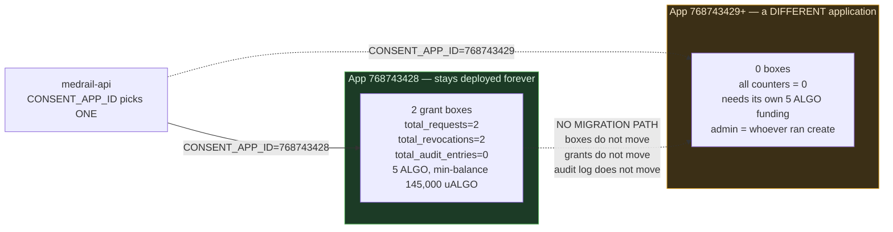

# MedRail — Rollback Strategy


**Purpose:** state, per deployment unit, what "rolling back" actually means, what is possible, and what is permanently impossible.

**Status of this document:** authored 2026-08-21 against commit `32ffd73`. **No rollback has ever been performed, because no deployment has ever been performed** beyond the TestNet contract. The API and web tiers are not hosted; no container image has ever been built or tagged. §2 (contract immutability) was verified by reading `contracts/artifacts/MedRailConsent.arc56.json` and `contracts/scripts/deploy_testnet.py`, not assumed. Everything marked **RECOMMENDED** is a recommendation, not a procedure that exists.

---

## 0. Rollback capability, per unit

| Unit | Rollback possible? | Mechanism | Blocked today by |
|---|---|---|---|
| `medrail-api` | **Yes, in principle — trivially** | Stateless. Redeploy the previous image tag/digest | **No images are built at all.** No registry, no tags, no digests (OPS-059). CI-3 |
| `MedRail Web` | **Yes, in principle — trivially** | Stateless, statically prerendered. Redeploy previous image or previous host deployment | Same. Also: `NEXT_PUBLIC_API_BASE` is baked at build time, so a rollback also rolls back which API the frontend calls |
| Runtime configuration | **Yes** | Reset the env var / platform secret to its prior value | Prior values are **not recorded anywhere**. There is no config history |
| `MedRailConsent` contract | **NO. Not at all. Ever.** | — | The deployed application is permanently immutable **and** permanently undeletable. See §2 |
| On-chain consent grants | **No** | Grants can be revoked forward by the patient; they cannot be un-written | By design — DATA-002 |
| On-chain audit log | **No** | Append-only. No method mutates or deletes an entry | By design — DATA-002 |
| Settled USDC payments | **No** | An Algorand `axfer` is final at confirmation. There is no refund path in the code | By design of the payment rail. Relevant to R-2 |

**The honest summary:** two of the three deployment units are perfectly rollable-back and cannot be rolled back today for a purely procedural reason (nothing is tagged). The third can never be rolled back for a protocol reason that no amount of process will change.

---

## 1. API and web — stateless, trivial, and currently impossible

### 1.1 Why they are trivially rollable in principle

The API holds **no server-side session, user account, or persistent request state** (NFR-001, **IMPLEMENTED** — there is no datastore anywhere in `api/src`). Its entire durable state lives on Algorand. There is no schema, no migration, no data-format version to unwind. The same is true of the web tier, which builds to 2 static prerendered routes.

A rollback of either is therefore just: **run the previous image.** No data step, no compatibility matrix, no forward/backward migration pair.

Two in-process caches are worth knowing about, because they are the only things a restart resets:

| In-process state | Location | Rollback impact |
|---|---|---|
| `operatorAccount` — the decoded mnemonic | `api/src/services/algorand.ts:7,12` | Re-derived on first use. None |
| `patientQueues` — the per-patient audit-write lock | `api/src/services/algorand.ts:129` | **Lost on restart.** Any in-flight `logAccess` is abandoned; see §1.4 |
| Facilitator `/supported` payment kinds | inside `@x402/core` `HTTPFacilitatorClient`, initialised once (`api/src/x402.ts:6-14`) | Re-fetched on first priced request. If the facilitator is down at that moment, priced routes 500 (R-1) — a restart during a facilitator outage is worse than no restart |

### 1.2 Why it is impossible today

**Neither image has ever been built.** `.github/workflows/ci.yml` contains no `docker build` step, no registry is referenced anywhere in the repo, and there are **no git tags** (`git tag -l` → empty). There is no artefact to roll back *to* and no identifier with which to name one.

Worse, a running service could not tell you what it is: `GET /v1/health` returns `{ok, service, network, consentAppId, time}` (`api/src/routes/health.ts:6-13`) and **no version, commit SHA, or image tag**. Incident response would begin with an unanswerable question.

**Prerequisites for API/web rollback to become real (all RECOMMENDED, none implemented):**

1. CI builds and pushes both images on every change — `CI_CD.md` §5 job `images` (**OPS-056**).
2. Every image is tagged with the immutable commit SHA, **never `latest`** (**OPS-059**).
3. The deployed image **digest** is recorded in the release notes (`CI_CD.md` §7.1 step 3).
4. `/v1/health` reports `gitSha` and `imageTag` (`CI_CD.md` §7.2).
5. The deployed configuration `(NETWORK, CONSENT_APP_ID, PAY_TO_ADDRESS, FACILITATOR_URL)` is recorded alongside the digest — **a release is a tuple of image *and* config**, and D-1/D-2 exist precisely because config was treated as an afterthought.

### 1.3 **RECOMMENDED** API rollback procedure

```bash
# 1. Identify what is running now — record it before you change anything.
curl -fsS https://<api-host>/v1/health | tee /tmp/health-before.json
flyctl status -c api/fly.toml
flyctl releases -c api/fly.toml            # platform's own release history

# 2. Identify the target. Prefer the DIGEST over the tag: a tag can be re-pushed,
#    a digest cannot.
docker buildx imagetools inspect ghcr.io/<owner>/<repo>/medrail-api:<previous-sha>

# 3. Roll the image back.
flyctl deploy -c api/fly.toml \
  --image ghcr.io/<owner>/<repo>/medrail-api@sha256:<digest>

# 4. Roll the CONFIG back too, if it changed. This is the step people forget,
#    and D-1/D-2 are what forgetting it looks like.
flyctl secrets set CONSENT_APP_ID=<previous app id> -c api/fly.toml   # triggers a restart
```

### 1.4 Verification after an API rollback

Run every check. Do not declare success on `/v1/health` alone — that is exactly the endpoint that stays green under D-1.

| # | Check | Command | Pass criterion |
|---|---|---|---|
| 1 | Liveness | `curl -fsS $API/v1/health` | `"ok":true` |
| 2 | **Network is right** | same response | `"network"` matches the network the App ID exists on. **This is the D-2 guard** |
| 3 | **App ID is configured** | same response | `"consentAppId":768743428` — **not `null`. This is the D-1 guard** |
| 4 | Version is the intended one | same response | `gitSha` matches the target (needs `CI_CD.md` §7.2) |
| 5 | Payment challenge builds | `curl -s -o /dev/null -w '%{http_code}' -X POST $API/v1/triage -H 'content-type: application/json' -d '{"symptoms":"chest pain"}'` | **402**. A `500` means the facilitator is unreachable (R-1), not that the rollback failed |
| 6 | Chain read path works | `curl -s "$API/v1/consent/status?patient=<58>&requester=<58>&scope=records:summary"` | **200** with a boolean `granted`. A `500` means `CONSENT_APP_ID` or `OPERATOR_MNEMONIC` is missing |
| 7 | ARC-56 spec is served | `curl -fsS $API/v1/consent/arc56 \| head -c 200` | JSON, not a 404. A 404 means the artifact copy at `api/Dockerfile:20` did not happen |
| 8 | Audit write path | inspect `total_audit_entries` on the app before and after one paid `/v1/records/summary` | increments. **Note: this has never succeeded on TestNet — see §2.6** |
| 9 | No in-flight audit writes were lost | check for a settled payment with no corresponding audit tx | **Not detectable today** — there are no logs to correlate. See `../10_Operations/Logging.md` |

Check 9 is the one genuine correctness hazard in an API rollback: restarting the process discards `patientQueues` (`algorand.ts:129`). A request that had settled its payment and was awaiting `atc.execute(algod, 4)` (up to ~14 s) is abandoned mid-flight. **The payer has paid and gets nothing** — R-2 / REL-002, triggered by an operational action rather than a fault. Drain connections before restarting; there is no code-level drain today.

### 1.5 Web rollback

Same shape, one extra consideration: because `NEXT_PUBLIC_API_BASE` is inlined at build time (`web/.env.example:1`, and `web/Dockerfile` provides no build arg for it — D-5), rolling the web image back also rolls back **which API host the browser calls**. If the API moved, the old web image points at the old host. Verify by loading `/` and confirming `NetworkBadge` (which polls `/v1/health`) shows the expected network — that component is the fastest visual confirmation the frontend is talking to the right backend.

---

## 2. The smart contract cannot be rolled back

This is the section that matters. **An Algorand application is immutable once deployed unless its approval program includes an `UpdateApplication` handler.** `MedRailConsent` does not.

### 2.1 Verified: the contract has no update and no delete path

From `contracts/artifacts/MedRailConsent.arc56.json`:

```json
"bareActions": { "create": [], "call": [] }
```

and **every one of the 13 ABI methods** declares:

```json
"actions": { "create": [], "call": ["NoOp"] }
```

except `create`, which declares `{"create": ["NoOp"], "call": []}`.

`contracts/smart_contracts/consent/contract.py` contains **no** `UpdateApplication` handler, **no** `DeleteApplication` handler, and **no** `allow_actions=` or `@arc4.baremethod` anywhere (verified by grep).

Therefore, for App ID **`768743428`**, permanently and irreversibly:

| Operation | Possible? |
|---|---|
| `UpdateApplication` — replace the approval program | **NO.** The program rejects the OnCompletion. There is no key that can authorise it |
| `DeleteApplication` — remove the app and reclaim its balance | **NO.** Same reason |
| Change the global state schema (4 uints, 1 byteslice) | **NO.** Schema is fixed at creation on Algorand regardless |
| Modify or delete an existing audit entry | **NO.** No method writes an existing `audit_log` key (DATA-002) |
| Change the admin | **Yes** — `set_admin`, admin-only (`contract.py:124-127`) |
| Withdraw ALGO above the app's minimum balance | **Yes** — `withdraw_excess`, admin-only (`contract.py:254-259`) |

**Consequences to state plainly:**

- There is **no such thing as a contract rollback, contract patch, or contract hotfix** for this system. Defects C-1 (swapped event fields in `request_access`) and C-2 (`GRANT_BOX_MBR` under-reports by 400 µALGO/box) are **permanent properties of App `768743428`**. They can only be fixed by deploying a *different* application with a *different* App ID.
- The 5 ALGO in the app account can never be fully reclaimed. `withdraw_excess` can retrieve the balance above the minimum, but the min-balance (currently 145,000 µALGO, held up by 2 grant boxes) is locked for as long as those boxes exist — and no method deletes a box. **The app account is a one-way door.**
- The undeletability is not an oversight to apologise for. A consent registry and audit log whose owner can delete the whole thing is worth less than one that cannot. **This is a defensible design choice and should be presented as one** — but it must be presented *accurately*, which means saying out loud that a contract bug is unfixable in place.

### 2.2 What `OnUpdate.AppendApp` and `OnSchemaBreak.Fail` actually mean

`contracts/scripts/deploy_testnet.py:92-96`:

```python
app_client, deploy_result = factory.deploy(
    on_update=OnUpdate.AppendApp,
    on_schema_break=OnSchemaBreak.Fail,
    create_params=AppClientMethodCallCreateParams(method="create"),
)
```

`algokit_utils`' `AppFactory.deploy` is idempotent per `(app_name, creator)`. It looks up the existing `MedRailConsent` created by this deployer, compares the compiled approval program and state schema against what is deployed, and then:

| Situation | Setting | What algokit_utils does | What it means for you |
|---|---|---|---|
| Deployed program **identical** to the compiled one | — | Nothing. `operation_performed = Nothing` (or `Update`/`Create` as applicable) | Re-running the deploy script is safe and free. This is why the committed `deploy_testnet.json` has `"create_txid": null` — the recorded run was an idempotent re-run (`deploy_testnet.py:100-101`) |
| Program **changed**, schema unchanged | `on_update=OnUpdate.AppendApp` | **Creates a brand-new application** and records the new App ID. It does **not** attempt an in-place `UpdateApplication` | This is the only correct setting for this contract. `OnUpdate.UpdateApp` would build an `UpdateApplication` transaction that App `768743428` would **reject on-chain** — there is no update handler |
| State **schema** changed (the 4-uint/1-byteslice global counts) | `on_schema_break=OnSchemaBreak.Fail` | **Raises an error and stops** | The conservative choice. The alternative `ReplaceApp` would try to delete the old app — which this contract also rejects — so `Fail` is both safer and the only thing that could work |

**"AppendApp" is the key phrase.** It does not append to the app. It appends *an app*. A logic change produces **App ID 768743429-or-whatever-is-next**, sitting alongside `768743428`, which continues to exist forever with its own boxes, its own balance, and its own admin.

### 2.3 What "rolling back the contract" therefore means in practice

It means **pointing the API at a different application**:

```bash
# There is no contract rollback. There is only re-pointing the client.
flyctl secrets set CONSENT_APP_ID=768743428 -c api/fly.toml
```

That is a **configuration rollback**, not a contract rollback. Call it what it is.



### 2.4 ⚠ Box state does not migrate

**This is the single most important operational consequence of an `AppendApp` deploy, and it is not optional or fixable.**

Boxes belong to the **application account**, and a new app has a new application account. When a new `MedRailConsent` is deployed:

| State | Old app | New app |
|---|---|---|
| Grant boxes (`g`-prefixed) | 2 boxes remain, both revoked | **Zero.** Every patient must re-grant, signing with their own key. There is no admin path to recreate a grant — `grant_access` asserts `Txn.sender` **is** the patient (`contract.py`, SEC-003) |
| Audit sequence boxes (`s`-prefixed) | none on `768743428` | zero — sequences restart at 1 |
| Audit log boxes (`a`-prefixed) | none on `768743428` | zero. **The audit history does not follow.** It stays readable forever on the old app, but the new app's history begins empty |
| Global counters | `total_requests=2`, `total_revocations=2`, `total_audit_entries=0` | all zero |
| ALGO balance | whatever remains | **zero until funded.** `deploy_testnet.py:118-124` sends `APP_FUNDING_ALGO = 5` only on a fresh create |
| Admin | current admin | the new deployer (`contract.py:120` — `create` sets `admin = Txn.sender`) |

**Therefore a contract "rollback" or "roll-forward" is a consent-registry reset.** Every patient's grant is gone from the app the API is now reading, and the audit trail is split across two applications with no linkage between them. Any operator considering a new deploy must answer, in writing, first:

1. Who re-grants, and how are they told to?
2. Which App ID is authoritative for a compliance question about a past access?
3. Is the old app's audit log preserved as a reference (it is, automatically and permanently — that is a genuine strength) and is that documented for whoever asks later?

### 2.5 Contract change checklist — **RECOMMENDED**

Because a contract change is effectively a migration to a new system, treat it as one:

- [ ] Recompile, re-run all 14 contract tests.
- [ ] Confirm the change does not alter the global state schema — if it does, `OnSchemaBreak.Fail` will stop the deploy, and that is correct.
- [ ] **Confirm every box-key derivation still matches all three implementations**: `contract.py:95-99`, `api/src/services/algorand.ts:63-79`, `web/lib/consent.ts`. There is **no cross-implementation test** (NFR-011, **UNVALIDATED**) — a prefix or hash-input change breaks the Node and browser clients at *runtime*, not at build time.
- [ ] Deploy; record the new App ID and app address.
- [ ] Fund the new app account for box MBR. **Size it against 22,500 µALGO per grant box, not the 22,100 that `get_grant_box_mbr()` returns** — defect C-2 under-reports by 400 µALGO/box (verified on-chain: min-balance 145,000 with 2 boxes and a 100,000 base = 45,000 = 2 × 22,500).
- [ ] Rotate `CONSENT_APP_ID` on the API. Confirm `/v1/health` reports the new id.
- [ ] Confirm the operator account is the new app's admin, or `set_admin` to it — otherwise `log_access` fails with `only admin` (`contract.py:222`) and every paid `/v1/records/summary` becomes a 500 after settlement.
- [ ] Communicate the re-grant requirement to every patient with an active grant on the old app. Enumerate them from the old app's `grant_access` transaction history via the indexer.
- [ ] Record the old App ID as the archival audit source.

### 2.6 A caveat specific to this deployment

The audit-write path has **never executed on Algorand TestNet**. App `768743428` reports `total_audit_entries = 5`, with zero `s`- and zero `a`-prefixed boxes. Verification check #8 in §1.4 has therefore never passed anywhere except the AVM simulator. **Do not present it as a validated rollback verification step** — it is an untested one. See `../07_Testing/Test_Plan.md`.

---

## 3. Configuration rollback

Configuration is the most likely thing to need rolling back, and the least prepared for.

| Config | Where it lives | Rollback | Restart needed? |
|---|---|---|---|
| `CONSENT_APP_ID` | platform env/secret (absent from `api/fly.toml` — **D-1**) | set the previous value | yes — read once at module load (`config.ts:44-59`) |
| `NETWORK` | `api/fly.toml:10` (`"mainnet"` — **D-2**) | edit + redeploy | yes |
| `PAY_TO_ADDRESS` | platform secret | set previous | yes. **Note: revenue between the change and the rollback went to the other address.** There is no accounting to reconcile it — see `../10_Operations/Monitoring.md` blind spots |
| `FACILITATOR_URL` | `api/fly.toml:12` | edit + redeploy | yes |
| `OPERATOR_MNEMONIC` | platform secret | see §4 — **this one is not a simple rollback** | yes |
| `NEXT_PUBLIC_*` | **baked into the web image at build time** | rebuild + redeploy the image | n/a |

**Every one of these is read exactly once, at process start** (`api/src/config.ts:44` — `export const config = {...} as const`). There is no hot reload, no config watch, no SIGHUP handler. A config rollback is always a restart, and a restart always discards in-flight audit writes (§1.4).

**There is no configuration history.** Fly secrets are write-only from the CLI's perspective; nothing in this repo records what was set, when, or by whom. **RECOMMENDED:** keep a plain-text, secret-free change log of every config change — variable name, new value (or `<redacted>` for secrets), timestamp, reason, and the release it accompanied. Without it a rollback is guesswork.

---

## 4. Admin-key rotation via `set_admin` — an incident control, not a rollback

`set_admin` is the one true in-place mutation available on the deployed contract, and it is the primary containment control for the highest-severity incident in this system.

```python
# contracts/smart_contracts/consent/contract.py:123-127
@arc4.abimethod
def set_admin(self, new_admin: Account) -> None:
    """Rotate the backend operator key without redeploying the contract."""
    assert Txn.sender == self.admin.value, "only admin"
    self.admin.value = new_admin
```

| Property | Value |
|---|---|
| Authorisation | current admin only (SEC-002, **VALIDATED** by `test_set_admin_only_admin`) |
| Effect | `admin` global state points to a new account, immediately and atomically |
| What it grants the new admin | the exclusive right to call `log_access` (`contract.py:222`) and `withdraw_excess` (`contract.py:258`) |
| What it does **not** do | it does **not** revoke, delete, or flag any audit entry the old admin wrote. Audit entries are append-only (DATA-002) and there is no method to remove one |
| Reversible? | Yes, by the *new* admin calling `set_admin` back. **Once you rotate away from a key, only the new key can rotate back** |
| Prerequisite | the **current** admin key. If it is lost, `set_admin` is unreachable — see `../10_Operations/Disaster_Recovery.md` §2 |

### 4.1 Rotation procedure — **RECOMMENDED**

```
1. Generate the new operator keypair OFFLINE. Never in a terminal that logs.
2. Fund it with ALGO — every log_access is a real transaction paid by this account.
3. Call set_admin(<new address>) signed by the CURRENT admin.
   Verify on-chain that global state `admin` now equals the new address.
4. Update OPERATOR_MNEMONIC on the API as a platform secret; restart.
5. Verify:
   - GET /v1/health -> 200
   - GET /v1/consent/status -> 200 (proves the new key can sign a simulate — T-5)
   - one paid POST /v1/records/summary -> auditTxId present, and
     total_audit_entries on the app incremented (proves the new key is admin)
6. Only then: drain any remaining ALGO from the old operator account.
7. Destroy the old key material. Record the rotation (date, old address,
   new address, reason) in the config change log. NEVER record the mnemonic.
```

**Ordering matters.** Do not update `OPERATOR_MNEMONIC` before `set_admin` lands — the API would be signing as a non-admin and every paid `/v1/records/summary` would take money and then 500 (R-2). Do not delay it after `set_admin` lands either, for the same reason in reverse. The window between steps 3 and 4 is a live money-losing window; keep it short and prefer a maintenance pause.

### 4.2 What rotation does not fix

If the old key was compromised, rotation stops **future** abuse. It does not undo past abuse:

- Audit entries the attacker forged with `log_access` are **permanent**. They cannot be deleted, only superseded by later, correct entries — which is materially worse for an audit log than a gap would be, because the record is trusted precisely for being on-chain (SEC-008).
- ALGO already drained via `withdraw_excess` is gone.
- Grants are unaffected — an admin cannot create, modify, or revoke a consent grant. `grant_access`/`revoke_access` assert `Txn.sender` is the patient (SEC-003). **This is a real containment boundary and worth crediting: an operator-key compromise cannot forge consent, only forge the record of access.**

Full incident runbook: `../10_Operations/Incident_Response.md` §C.

---

## 5. Forward-fix vs rollback — decision criteria

| Choose **ROLLBACK** when | Choose **FORWARD-FIX** when |
|---|---|
| The previous version is known-good and identifiable by digest | The previous version has the same defect (it usually does — the API has 2 commits total) |
| The regression is in API or web code — both stateless, no migration | The fault is in the **contract**. Rollback is not available at all (§2); the only options are re-point `CONSENT_APP_ID` at a prior app, or ship a new app |
| The fault is a config error — `CONSENT_APP_ID`, `NETWORK`, `PAY_TO_ADDRESS` (D-1/D-2 class). Fastest possible fix | The fault is in a **dependency** — a facilitator outage (R-1) rolls back nothing, because the previous version calls the same facilitator |
| Money is actively being lost — a settled payment returning 500 (R-2) is a per-request financial loss and time-to-mitigate dominates | The fix is a one-line guard (e.g. the missing `.catch()` on the success path of `records.ts:49`) and the change is smaller than the rollback's blast radius |
| The blast radius is unknown | The rollback would itself lose in-flight audit writes and the current fault is not costing money |

**Two situations where neither applies:**

- **Operator key compromise.** Rotate (`set_admin`), do not roll back. A rollback redeploys the *same compromised key* from the same secret store.
- **Facilitator outage.** Neither. Wait, or repoint `FACILITATOR_URL`. Rolling back the API changes nothing (REL-001).

### 5.1 Time-to-mitigate, honestly

**No rollback has ever been performed, so no rollback duration has ever been measured. Any number here would be invented.** What *is* known:

| Component of the delay | What is known |
|---|---|
| Time to **detect** | **Unbounded.** There is no monitoring, no alerting, no uptime check, no log aggregation (OPS-003…OPS-005, all **NOT IMPLEMENTED**). Detection today means a human notices |
| Time to **identify the running version** | Not possible — `/v1/health` has no version field |
| Time to **find the rollback target** | Not possible — no tags, no images, no digests |
| Time to **deploy** | Never measured |
| Time to **verify** | The checks in §1.4 are quick, but check #8 has never passed outside the simulator |

Detection dominates and is currently unbounded. That is the honest statement, and it is the reason `../10_Operations/Monitoring.md` matters more than this document does.

---

## 6. Rollback runbook

Executable by someone who did not write the code. **RECOMMENDED** — it depends on image tagging that does not exist yet (§1.2).

### 6.1 Pre-flight — do not skip

```bash
# Capture the current state BEFORE changing anything. If the rollback makes
# things worse, this is the only record of what "before" was.
curl -fsS https://<api-host>/v1/health          | tee /tmp/rb-health-before.json
curl -fsS https://<api-host>/v1/consent/app-info | tee /tmp/rb-appinfo-before.json
flyctl status   -c api/fly.toml | tee /tmp/rb-status-before.txt
flyctl releases -c api/fly.toml | tee /tmp/rb-releases.txt
flyctl logs     -c api/fly.toml --no-tail | tail -500 > /tmp/rb-logs-before.txt
```

Answer, in writing, before proceeding:

1. What is the fault, and is it in API/web code, in configuration, in the contract, or in a dependency?
2. Is money being lost right now? (Any 500 on `/v1/records/summary` after settlement = yes, R-2.)
3. What exactly is the rollback target — image **digest** and the full config tuple?
4. Does the target predate the contract the API is pointed at? If the target expects a different `CONSENT_APP_ID`, roll the config too.
5. Is a forward-fix smaller? (§5)

### 6.2 Execute

| Scenario | Action |
|---|---|
| **API code regression** | `flyctl deploy -c api/fly.toml --image <registry>/medrail-api@sha256:<digest>` |
| **Config error (D-1/D-2 class)** | `flyctl secrets set CONSENT_APP_ID=768743428 -c api/fly.toml` and/or fix `NETWORK` in `api/fly.toml` + redeploy |
| **Web regression** | redeploy the previous web image, or the host's previous deployment |
| **Contract fault** | **not a rollback.** Either re-point `CONSENT_APP_ID` at a prior app (accepting §2.4 — no box migration), or deploy a new app and follow §2.5 |
| **Operator key compromise** | **not a rollback.** §4.1, then `../10_Operations/Incident_Response.md` §C |
| **Facilitator outage** | **not a rollback.** `../10_Operations/Incident_Response.md` §A |

### 6.3 Verify

Run **all nine** checks in §1.4. Specifically confirm:

- `consentAppId` is **not `null`** (D-1).
- `network` matches the network the App ID exists on (D-2).
- `POST /v1/triage` returns **402**, not 500 (proves the facilitator path is live).
- `GET /v1/consent/status` returns **200**, not 500 (proves App ID + operator key are both loaded).

### 6.4 After

1. Record: what broke, what was rolled back to (digest + config tuple), who did it, when, how long detection took.
2. **Identify anyone who paid and got nothing** during the incident. Today this requires reading the ledger, because there are no application logs to correlate against — see `../10_Operations/Incident_Response.md` §B for the ledger-side procedure and its limits.
3. Open the follow-ups. If the rollback was for a config error, the fix is not "be more careful" — it is the fail-fast guard in `Docker.md` §5.1 and the smoke test in `CI_CD.md` §5.
4. Post-incident review — template in `../10_Operations/Incident_Response.md` §10.

---

## 7. Requirements traceability

| ID | Statement (abbreviated) | Status | Where |
|---|---|---|---|
| NFR-001 | The API holds no server-side session or persistent request state | **IMPLEMENTED** | §1.1 — this is what makes API rollback trivial in principle |
| NFR-011 | Box-key derivation byte-identical across contract, backend, browser | **UNVALIDATED** | §2.5 — a contract change is the moment this bites |
| DATA-002 | Audit entries append-only, never mutated or deleted | **IMPLEMENTED** | §2.1, §4.2 — the reason a forged entry is permanent |
| SEC-002 | Only the admin can withdraw funds or rotate the admin | **VALIDATED** | §4 |
| SEC-003 | Only the patient can grant or revoke consent | **VALIDATED** | §4.2 — the containment boundary an operator compromise cannot cross |
| SEC-008 | The audit trail accurately attributes each access | **NOT IMPLEMENTED** | §4.2 (S-1 consequence) |
| SEC-012 | The operator/admin key protected commensurate with its authority | **NOT IMPLEMENTED** | §4 |
| REL-002 | A settled payment never consumed without delivering or recording a recoverable failure | **NOT IMPLEMENTED** | §1.4 check 9, §5 |
| REL-006 | The app account holds sufficient balance for box MBR | **PARTIALLY IMPLEMENTED** | §2.5 — and the advertised per-box cost is wrong (C-2) |
| **OPS-059** *(new, added by CI_CD.md)* | Every deployed build identifiable and redeployable by immutable tag/digest | **NOT IMPLEMENTED** | §1.2 — the reason API rollback is impossible today |

---

## 8. Cross-references

- `Deployment_Architecture.md` §5 — deployment units and their coupling; why a contract redeploy forces an API reconfiguration.
- `Docker.md` §5.1 — the fail-fast guard that prevents the config errors §6 exists to undo.
- `CI_CD.md` §5, §7 — the image tagging and release process that rollback depends on.
- `Environment_Setup.md` §8 — the deploy script's idempotency, and why `create_txid` is `null` in the committed artifact.
- `../10_Operations/Incident_Response.md` — §A facilitator outage, §B settled-payment-with-failed-audit, §C key compromise, §H bad deploy.
- `../10_Operations/Disaster_Recovery.md` §2 — what happens if the admin key is *lost* rather than compromised (`set_admin` becomes unreachable forever).
- `../02_Requirements/SRS.md`, `../06_Security/Risk_Register.md`, `../07_Testing/Test_Plan.md`.
