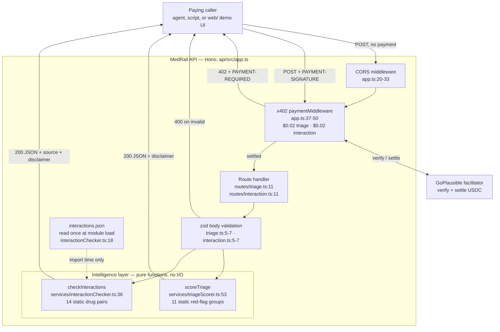

# MedRail — Intelligence Layer Architecture

**Purpose:** describe where MedRail's two "intelligence" endpoints sit in the system, what architectural properties follow from implementing them as pure functions over static tables, and — fairly — what that choice costs relative to a model-backed implementation.

**Status of this document:** Descriptive of commit `32ffd73` on branch `master`. Every non-obvious claim carries a `path:line` citation. Sections marked **RECOMMENDED** describe nothing that exists today.

**Cross-references:** [`Algorithm_Inventory.md`](./Algorithm_Inventory.md) · [`Processing_Pipeline.md`](./Processing_Pipeline.md) · [`Evaluation.md`](./Evaluation.md) · [`Limitations.md`](./Limitations.md) · [`../03_Architecture/System_Architecture.md`](../03_Architecture/System_Architecture.md) · [`../06_Security/Threat_Model.md`](../06_Security/Threat_Model.md)

---

## 1. What the layer is

Two TypeScript modules, 128 lines of source between them, plus one 75-line JSON data file.

| Module | Lines | Export | Shape |
|---|---|---|---|
| `api/src/services/triageScorer.ts` | 73 | `scoreTriage(symptomText: string): TriageResult` | Pure function. No arguments beyond the input string, no closure over mutable state, no I/O. |
| `api/src/services/interactionChecker.ts` | 55 | `checkInteractions(medications: string[]): InteractionCheckResult` | Pure function *after module load*. One synchronous `readFileSync` at import time (`interactionChecker.ts:18`) populates a frozen-by-convention `const DATA`; the exported function performs no I/O. |
| `api/src/data/interactions.json` | 75 | — | Static reference table: one `source` string and 14 pair records. Version-controlled, diffable, human-readable. |

Both decision tables are literals in source or in a committed JSON file. There is no configuration, no feature flag, no runtime tuning parameter, and no path by which the behaviour of either function can change without a code change that appears in a git diff.

**AI-001 — Clinical scoring logic shall be transparent and auditable — no opaque model in the decision path — is VALIDATED.** The complete decision surface is 11 keyword groups (`triageScorer.ts:32-44`) and 14 drug pairs (`interactions.json:3-74`). A clinician with no software background can read both tables in under two minutes and disagree with a specific weight or a specific pair, by name.

**NFR-009 — The intelligence endpoints shall be deterministic and fully inspectable — same input, same output, with the decision rule readable in source — is VALIDATED.** `triageScorer.spec.ts:45-49` asserts the case-insensitivity half of this directly; the determinism half follows structurally from the absence of any nondeterministic input (no clock read, no random source, no network, no mutable module state).

## 2. Where it sits

The intelligence layer is the innermost ring of the request path and the only part that touches the caller's clinical text. Everything outside it — CORS, x402 pricing and settlement, zod validation — is generic and knows nothing about medicine. Everything inside it is medicine and knows nothing about payment.



Two things the diagram deliberately does not contain, because they do not exist: **there is no model-provider box, and there is no datastore box.** The dashed edge from `interactions.json` fires once per process, at import, and never again during request handling.

Note also what the intelligence layer is *not* connected to: it does not call the Algorand contract, it does not touch the consent layer, and nothing it computes is written on-chain. `POST /v1/records/summary` — the consent-gated route — does not invoke either engine (`api/src/routes/records.ts` imports only `checkAccess` and `logAccess`, `records.ts:3`).

## 3. Properties that follow from the implementation

Each row below is a consequence of the code as written, not an aspiration.

| Property | Why it holds | Evidence |
|---|---|---|
| **No inference latency** | The work is bounded substring scanning over inputs capped at 2000 characters or 20 medication names. No network hop, no GPU queue, no cold start. | `triage.ts:6`, `interaction.ts:6` (caps); `triageScorer.ts:58-63`, `interactionChecker.ts:40-47` (loops) |
| **No model-provider dependency** | Neither `api/package.json` nor `web/package.json` declares any model SDK, and no such import exists in `api/src/`. The runtime dependency set is `hono`, `zod`, `algosdk`, `dotenv`, `@hono/node-server`, and five `@x402/*` packages — ten in total, none of them a model client. | `api/package.json:14-23` |
| **Zero marginal cost per call** | No token billing, no per-request egress to a third party, no API key to meter. The $0.02 price is entirely margin over shared infrastructure cost. | `app.ts:41-42` |
| **Determinism** | No clock, no `Math.random`, no locale-sensitive operation in the decision path, no mutable module state. `toLowerCase()` and `String.prototype.includes` are the only transformations. | `triageScorer.ts:54,59`; `interactionChecker.ts:32-34,42-43` |
| **No prompt-injection surface** | There is no prompt, no system instruction, no tool-call loop, and no text passed to any interpreter. Caller text is compared against fixed literals and then discarded. Adversarial input can change *which flags match* — that is ordinary input handling, not injection — but cannot change the program's instructions, because there are none to change. | See [`Prompt_Architecture.md`](./Prompt_Architecture.md) §2 and [`../06_Security/Threat_Model.md`](../06_Security/Threat_Model.md) |
| **No jailbreak surface, no hallucination** | Output is drawn exclusively from the 11 hard-coded `label` strings and the 14 hard-coded `description` strings. The engines cannot emit a sentence that is not already in the repository. | `triageScorer.ts:33-43`; `interactions.json:3-74` |
| **No input retention** | Neither function writes, logs, caches, or transmits its input. `records.ts` — the only route that writes on-chain — logs constant `SCOPE` and `ENDPOINT` strings only (`records.ts:10-11`), and does not invoke either engine. **AI-007 — Free-text clinical input shall never be written to the public ledger — IMPLEMENTED.** | `triageScorer.ts:53-73`, `interactionChecker.ts:36-55`, `records.ts:37,49` |
| **Trivially unit-testable offline** | Pure functions need no fixtures, no mocks, no network, and no seeded model. 13 of the repository's 32 tests target these two modules and run in milliseconds. | `api/test/triageScorer.spec.ts`, `api/test/interactionChecker.spec.ts` |

One property that does **not** follow, and must not be inferred from any of the above: **none of this makes the output clinically correct.** Determinism guarantees the same wrong answer every time. See [`Evaluation.md`](./Evaluation.md).

## 4. The swappability property (AI-008)

**AI-008 — The intelligence layer shall be swappable for a model-backed implementation without changing the payment or consent layers — IMPLEMENTED (by construction).**

The coupling between the priced HTTP surface and the intelligence layer is exactly one function call per route:

```
routes/triage.ts:16        const result = scoreTriage(parsed.data.symptoms);
routes/interaction.ts:16   const result = checkInteractions(parsed.data.medications);
```

Neither route inspects the internals of the result beyond serialising it (`triage.ts:17`, `interaction.ts:17`). The x402 middleware is configured entirely in `app.ts:37-50` and never sees the response body. The consent layer (`services/algorand.ts`) is not on this path at all. Replacing `scoreTriage` with a model-backed implementation is therefore a change to one module and its test file — pricing, settlement, CORS, validation and the on-chain layer are untouched.

That is a genuine architectural property, and it is the honest form of the "AI-ready" claim. It is *not* a claim that a model exists, is planned, is partially built, or is one commit away.

### What an upgrade would have to preserve

A model-backed replacement is not a drop-in unless it preserves the contract callers may already be relying on. Concretely:

1. **The response shape, exactly.** `TriageResult` is `{score: number, band: UrgencyBand, matchedFlags: string[], disclaimer: string}` (`triageScorer.ts:11-16`), where `UrgencyBand` is the closed union `"routine" | "soon" | "urgent" | "emergency"` (`triageScorer.ts:9`). `InteractionCheckResult` is `{flagged: boolean, matches: Array<{drugs: [string, string], severity: "moderate"|"major"|"contraindicated", description: string}>, source: string, disclaimer: string}` (`interactionChecker.ts:25-30`, `:9`). Both are serialised verbatim to the caller, so any field rename or union widening is a breaking API change for a paying integrator.
2. **The `disclaimer` field, unconditionally.** FR-009 and AI-002 both require it, and both service test suites assert it (`triageScorer.spec.ts:40-43`, `interactionChecker.spec.ts:33-37`). A model-backed version must emit a disclaimer on **every** response including error and low-confidence paths — and the disclaimer must be a constant emitted by the application, never text the model was asked to produce.
3. **The `source` field on interaction results.** DATA-005 and AI-004 require explicit provenance in every response (`interactionChecker.ts:52`, sourced from `interactions.json:2`). A generative replacement has a *harder* obligation here, not an easier one: it would need per-match provenance grounded in a real reference, since an ungrounded model cannot honestly populate this field at all.
4. **Bounded, validated output.** `score` is currently guaranteed to be an integer in `[0, 100]` by construction (`triageScorer.ts:65`), and `band` is guaranteed consistent with `score` because it is derived from it (`triageScorer.ts:69` calls `bandFor`). A model-backed version must enforce both invariants outside the model — range-clamp the score, derive the band from the score rather than asking for it — or callers that switch on `band` can be handed an unrepresentable value.
5. **The determinism guarantee, or an explicit withdrawal of it.** NFR-009 is currently **VALIDATED**. A sampling model breaks it. That is a legitimate trade, but it must be a *declared* trade: the 402 challenge description (`app.ts:41`, currently "Rule-based clinical red-flag triage score. Not medical advice.") and the endpoint documentation would have to change in the same commit, because a paying integrator who built a cache or a regression test on the current behaviour would silently break.
6. **The no-retention property.** AI-007 currently holds because nothing leaves the process. Sending symptom text to a third-party model provider makes retention a vendor-policy question rather than a code property, and would require a data-processing agreement, a stated retention posture, and a re-examination of [`../06_Security/Threat_Model.md`](../06_Security/Threat_Model.md).

Points 4, 5 and 6 are the reason "just swap in an LLM" is a larger change than the one-line call site suggests. The call site is one line; the guarantees around it are six.

## 5. Honest comparison: rule engine vs LLM vs trained classifier

This table is where the rule engine loses. It is included in full rather than trimmed to the flattering rows.

| Dimension | **Rule engine (what MedRail has)** | **LLM-backed** | **Trained classifier (e.g. supervised text model)** |
|---|---|---|---|
| **Determinism** | Total. Same input ⇒ byte-identical output, forever. NFR-009 **VALIDATED**. | None by default; reducible with temperature 0 but not guaranteed across provider model updates. | Total for a pinned model artefact; changes on every retrain. |
| **Auditability** | Complete. 11 groups and 14 pairs, readable in one screen; every decision traceable to a named rule. AI-001 **VALIDATED**. | Effectively none at the decision level. Chain-of-thought is a post-hoc narrative, not the computation. | Partial. Feature attribution and per-class weights are inspectable; the mapping from raw text to prediction usually is not. |
| **Latency** | Bounded local computation, no network hop. No measurement exists in this repository and none is claimed. | Network round-trip plus generation time; provider-dependent and variable. | Local inference if self-hosted; model-size dependent. |
| **Per-call cost** | Zero marginal. | Non-zero per token, and it scales with call volume — directly relevant when the business model is $0.02 per call (`app.ts:41`). | Zero marginal if self-hosted, but non-trivial fixed hosting cost. |
| **Failure modes** | Silent false negatives on anything not literally in the table; additive false positives from unanchored matching. Fails *quietly and predictably*. | Hallucinated drug interactions, fabricated citations, prompt injection, jailbreaks, silent provider-side model swaps. Fails *loudly and unpredictably*. | Miscalibration, distribution shift, training-data bias, degraded performance on populations under-represented in the labels. Fails *statistically*. |
| **Regulatory posture** | Simplest to explain to a regulator: the algorithm is the specification, and change control is `git log`. Still **not** a validated or approved device — see [`Limitations.md`](./Limitations.md) §2. | Hardest. Non-determinism, opacity, third-party processing of clinical text, and vendor model updates all complicate any software-as-a-medical-device argument. | Intermediate. A well-established path exists, but it requires a locked model, a documented training set, and clinical validation evidence. |
| **Coverage / generalisation** | **Very poor, and this is the decisive weakness.** Nothing outside 37 exact keyword phrases and 24 drug tokens is recognised. See below. | Strong. Handles paraphrase, synonyms, lay terms, misspellings, and multiple languages without enumeration. | Good within its training distribution; degrades outside it. |
| **Synonym handling** | **None.** Verified: `"heart attack"`, `"MI"` and `"SOB"` all score **0 / routine**. | Native. | Learned from labels, if the labels contain them. |
| **Negation handling** | **None.** Verified: `"no chest pain"` scores **35 / urgent** — identical to `"chest pain"`. | Generally handled. | Handled if negation appears in training data; a known hard case. |
| **Multilingual input** | **None.** Verified: `"dolor de pecho"` scores **0 / routine**. | Native for major languages. | Only if trained multilingually. |
| **Context (age, pregnancy, comorbidity, dose, route)** | **None.** No such field is accepted or used; the input is one string or one flat medication list. | Can incorporate it if supplied. | Can incorporate it as features. |
| **Maintenance burden** | Low but **manual and unbounded**: every new synonym, spelling, or drug pair is a hand-written entry. Coverage grows linearly with human effort forever. | Low for coverage, high for evaluation, guardrails, prompt regression testing, and vendor-change monitoring. | High: labelling pipeline, retraining cadence, drift monitoring, model registry. |
| **Cold-start data requirement** | None. Ships working on day zero with no dataset. | None for the base model; a task-specific evaluation set is still required to know if it works. | Substantial: a labelled corpus is a prerequisite to existing at all. |

The verified failure results quoted above were produced by executing the shipped code against commit `32ffd73` on 2026-08-21; the method and the full result set are in [`Evaluation.md`](./Evaluation.md) §5.

### Reading the table honestly

The rule engine wins on determinism, auditability, cost, failure predictability and regulatory explainability. It loses — badly, not marginally — on every dimension that has to do with understanding language. A user who types `"I think I'm having a heart attack"` gets `score: 0, band: "routine"` from this system. That is not a rough edge; it is a categorical inability to do the thing a naive reader assumes an "AI triage endpoint" does.

Two things make that defensible in this specific context rather than merely bad:

1. **The failure is silent-negative and the disclaimer is unconditional.** The system never tells a user their emergency is routine *with authority*; every response carries the text *"not a diagnosis, not a substitute for professional medical judgment, and must never be the basis for a real care decision"* (`triageScorer.ts:18-21`), asserted by a test (`triageScorer.spec.ts:40-43`). The design intent is a demonstrably-limited component, not a confidently-wrong one.
2. **The alternative was worse for this deliverable.** An LLM behind `/v1/triage`, shipped on a hackathon timeline with no evaluation set and no clinical review, would produce fluent, authoritative-sounding, unverifiable triage advice. The failure mode would be a confident hallucination rather than a silent miss — and a reviewer would have no way to audit it, because there would be nothing to read. `docs/IMPLEMENTATION_PLAN.md:65` records this reasoning at the time the decision was made: *"a hackathon health-triage endpoint that reads as authoritative medical advice is a real harm risk, not just a demo-polish issue."*

Neither point converts the rule engine into a clinically useful triage tool. It is not one, and [`Limitations.md`](./Limitations.md) says so without hedging.

## 6. What would have to change for a model-backed layer — **RECOMMENDED / NOT IMPLEMENTED**

Listed for completeness of the architectural argument. None of this exists, none is in progress, and none is a commitment.

| Change | Rationale |
|---|---|
| Retain the rule tables as a **guardrail**, not delete them | A generative triage answer that omits a red flag the keyword table caught is a regression the deterministic layer can detect for free. Union the two, never replace one with the other. |
| Structured-output validation at the boundary | The score/band invariant and the closed `UrgencyBand` union must be enforced in application code, not trusted from the model. See §4 point 4. |
| Grounded provenance per match | AI-004 / DATA-005 require a `source`. A generative interaction check must cite a real record it retrieved, or it must not populate the field. |
| An evaluation set, built before the model, not after | Without it there is no way to know whether the swap improved or degraded anything. See [`Evaluation.md`](./Evaluation.md) §4. |
| Prompt-injection and jailbreak defences | Currently zero surface (§3). A model introduces the surface, so the defences must be introduced with it. See [`Prompt_Architecture.md`](./Prompt_Architecture.md) §4. |
| A declared retention and processing posture | AI-007 currently holds as a code property. Third-party inference makes it a contractual one. |
