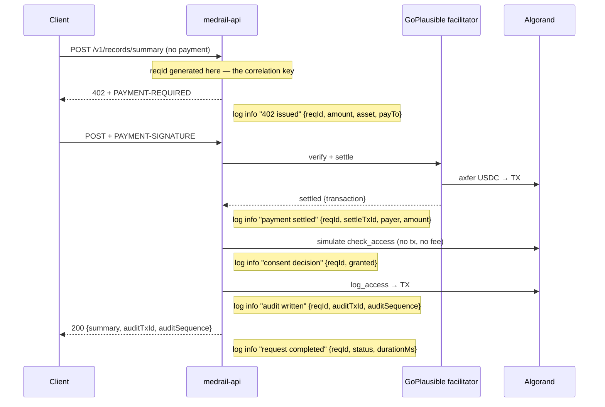

# MedRail — Logging


**Purpose:** document the logging that exists, the disclosure defect in the one error path, and a logging design that would make this system operable.

**Status of this document:** authored 2026-08-21 against commit `32ffd73`. **The API contains exactly two logging statements.** Verified by exhaustive grep of `api/src/`. There is no logging framework, no log levels, no request ids, no structured output, no retention policy, no shipping, and no correlation between an HTTP request and the on-chain transactions it produces. OPS-002 is **NOT IMPLEMENTED**. Everything from §4 onward is **RECOMMENDED** and none of it is in the repo.

---

## 1. The complete inventory

```
$ grep -rn "console\." api/src/
api/src/app.ts:59:  console.error(err);
api/src/index.ts:6:  console.log(`MedRail API listening on http://localhost:${info.port} (network: ${config.network})`);

$ grep -rn "console\." web/lib/ web/components/ web/app/
(nothing)
```

**Two statements in the API. Zero in the frontend.** That is the entire logging surface of the system.

### 1.1 Boot log — `api/src/index.ts:5-7`

```ts
serve({ fetch: app.fetch, port: config.port }, (info) => {
  console.log(`MedRail API listening on http://localhost:${info.port} (network: ${config.network})`);
});
```

Emits exactly once, at startup:

```
MedRail API listening on http://localhost:4021 (network: testnet)
```

| Property | Assessment |
|---|---|
| Format | Free-text template string. Not parseable |
| Level | Implicit — `console.log` → stdout |
| Contains | port, network |
| **Does not contain** | `consentAppId`, `payToAddress`, `facilitatorUrl`, commit SHA, image tag, whether `OPERATOR_MNEMONIC` is loaded. **Every one of these is something you would want at boot**, and every one is the subject of a deployment defect (D-1, D-2) or an incident (`Incident_Response.md` §H) |
| Notable | It always prints `http://localhost:` regardless of the actual bind address. Harmless, but misleading in a container |

### 1.2 Error log — `api/src/app.ts:58-61`

```ts
app.onError((err, c) => {
  console.error(err);
  return c.json({ error: err.message || "internal error" }, 500);
});
```

This is the **only** log emitted during the entire request lifecycle, and it has two distinct problems.

**Problem 1 — the log side.** `console.error(err)` prints a stack trace to stderr with:

| Missing | Consequence |
|---|---|
| No request id | Two concurrent failures cannot be told apart |
| No route, method, or status | You cannot tell whether `/v1/triage` or `/v1/records/summary` failed |
| No timestamp beyond whatever the host adds | Correlating with an on-chain transaction means guessing |
| No error class | Facilitator down, App ID unset, bad address, algod timeout and non-admin `log_access` all produce the same undifferentiated stack trace (see `Monitoring.md` §3.9) |
| No payer, patient, requester, or scope | An incident cannot identify who was affected |
| No payment/settlement information | **The central problem: you cannot tell whether the failed request had already taken money** |
| Not JSON | Not queryable by any log tool without custom parsing |

**Problem 2 — the response side, finding R-3 / SEC-011.** `err.message` is returned **verbatim to an unauthenticated caller**. Reproduced by the reviewer:

```
GET /v1/consent/status?patient=AAAA…(58 chars)&requester=…&scope=records:summary
→ HTTP 500
→ {"error":"wrong checksum for address"}
```

Other internal messages reachable by an anonymous caller through the same path:

| Trigger | Message disclosed |
|---|---|
| `CONSENT_APP_ID` unset (D-1) | `"CONSENT_APP_ID is not set and contracts/artifacts/deploy_testnet.json was not found. Deploy the contract first (see docs/DEPLOYMENT.md)."` — leaks a repo path and internal config structure (`config.ts:63-66`) |
| `OPERATOR_MNEMONIC` unset | `"OPERATOR_MNEMONIC is not set — see docs/DEPLOYMENT.md"` — confirms to a stranger that the service holds a signing key and that it is currently absent (`algorand.ts:10`) |
| Facilitator unreachable (R-1) | `"Failed to initialize: no supported payment kinds loaded from any facilitator."` — names the dependency |
| Malformed address (R-3) | `"wrong checksum for address"` — a **client** error reported as a **server** error |
| Non-admin `log_access` | AVM rejection text containing `only admin` |

SEC-011 ("internal exception messages shall not be returned to unauthenticated callers") is **NOT IMPLEMENTED**, and the same handler is simultaneously the reason SEC-010 surfaces as a 500 rather than a 400.

### 1.3 What is not logged — the list that matters

Nothing at all is logged for any of these. Not at any level. Not anywhere.

| Event | Currently logged? | Why it matters |
|---|---|---|
| An HTTP request arriving | **No** | No access log exists. There is no record that any request was ever served |
| A 402 challenge being issued | **No** | The revenue funnel is entirely invisible |
| A payment settling | **No** | **The settled transaction id never touches a log.** It is returned in the `PAYMENT-RESPONSE` header and then forgotten |
| A consent check and its result | **No** | The `allowed`/denied decision at `records.ts:32` leaves no trace off-chain |
| `log_access` being submitted or its tx id | **No** | `logResult.txId` is returned to the caller (`records.ts:57`) and never logged. **If the response is lost, the tx id is lost with it** |
| A 403 `charged` response | **No** | A paid-and-denied caller is unrecorded off-chain |
| A swallowed audit-write failure | **No** | `records.ts:37` — `logAccess(...).catch(() => undefined)` discards the error **silently**. An audit write can fail on the denied path and **nothing anywhere records it** |
| Startup configuration | **Partially** — port and network only | D-1 and D-2 would both be visible at boot with a fuller line |
| Process shutdown | **No** | No graceful-shutdown handler exists at all |

The `.catch(() => undefined)` at `records.ts:37` deserves emphasis. It is the right *behaviour* — a failed audit write should not turn a 403 into a 500 — but discarding the error entirely means an operator can never learn that audit writes are failing. **The correct form is catch, log, continue.**

### 1.4 The one place logging is done well

The operator scripts print every transaction id to stdout for independent verification:

- `contracts/scripts/deploy_testnet.py:103-124` — App ID, app address, operation performed, create txid, funding txid.
- `contracts/scripts/exercise_contract.py:85-125` — every one of the six transaction ids in the lifecycle.
- `contracts/scripts/opt_in_usdc.py:37` — the opt-in txid.
- `api/scripts/e2e-proof.ts:63-97` — final status, settlement payload, explorer URL, and a written `contracts/artifacts/e2e-proof.json`.

This is deliberate and good: it is what makes `docs/PROOF.md` independently checkable. **The request path should adopt the same discipline** — every transaction id the system causes should be recorded somewhere durable, not only returned in a response body.

---

## 2. Log handling, retention and shipping

| Property | Status |
|---|---|
| Destination | Process stdout/stderr. Nothing more |
| Aggregation | **NOT IMPLEMENTED** |
| Retention policy | **NOT IMPLEMENTED** — none defined, anywhere |
| Rotation | n/a — nothing writes to a file |
| Shipping | **NOT IMPLEMENTED** |
| Search | **NOT IMPLEMENTED** |
| Local dev | Scrollback in the terminal running `npm run dev` |
| Containerised | `docker logs` / `flyctl logs` — the platform's default buffer, which is short and not a retention policy |
| **Practical consequence** | **After a restart, the entire history of every request the service ever served is gone.** This is why `Incident_Response.md` §B has to reconstruct incidents from the public ledger instead of from logs |

---

## 3. Why this is the highest-leverage gap in operations

`Monitoring.md` enumerates blind spots; most of them are cheaper to close with structured logs than with a metrics pipeline. Concretely:

| Incident | With logs today | With §4's design |
|---|---|---|
| Settled payment returned 500 (R-2) | **Undetectable.** No record that a payment settled, no record that a request failed after it | One log line with `settleTxId` and `status: 500` |
| Which payers were affected | Reconstruct from the indexer by hand, matching `payTo` receipts against nothing | Query by request id or payer address |
| Facilitator outage (R-1) | An unlabelled stack trace | `errorClass: "facilitator_unavailable"` |
| Operator out of ALGO | Stack trace at the point of `atc.execute` failure | `errorClass: "log_access_failed"` + the algod message |
| Impersonation (S-1) | Nothing — indistinguishable from legitimate traffic | Still not preventable, but `payer` vs `requesterAddress` becomes **queryable after the fact**, which is the only detective control available |

---

## 4. **RECOMMENDED** logging design

Proportionate to the system: no logging framework dependency is strictly required — Node's `console` writing JSON is sufficient and adds zero dependencies. A structured logger (pino) is the natural upgrade.

### 4.1 Format

**One JSON object per line, on stdout.** stderr for `fatal` only.

```json
{"ts":"2026-08-21T12:00:00.123Z","level":"info","service":"medrail-api","gitSha":"32ffd73","network":"testnet","reqId":"01JX...","route":"POST /v1/records/summary","status":200,"durationMs":812,"msg":"request completed"}
```

Baseline fields on every line:

| Field | Source | Why |
|---|---|---|
| `ts` | ISO 8601 UTC | — |
| `level` | `fatal`/`error`/`warn`/`info`/`debug` | — |
| `service` | constant `"medrail-api"` — matches `/v1/health` | Consistency with OPS-001 |
| `gitSha`, `imageTag` | build args (`../08_Deployment/CI_CD.md` §7.2) | "What is running?" must be answerable from a log line |
| `network`, `consentAppId` | `config` | Makes D-1 and D-2 visible in the log stream |
| `reqId` | §4.2 | The correlation key |
| `msg` | short, constant, low-cardinality | Groupable |

### 4.2 Request-id middleware — **RECOMMENDED**

Insert **before** `paymentMiddleware` in `api/src/app.ts:20`, so 402s are logged too.

```ts
// RECOMMENDED — not present in the repo today. api/src/app.ts
import { randomUUID } from "node:crypto";

app.use("*", async (c, next) => {
  // Honour an inbound id so a caller can correlate across a chain of services;
  // generate one otherwise. Cap the length — this value ends up in logs and in
  // a response header, and an unbounded caller-supplied string is a log-
  // injection and log-volume risk.
  const inbound = c.req.header("x-request-id");
  const reqId = inbound && /^[A-Za-z0-9_-]{1,64}$/.test(inbound) ? inbound : randomUUID();
  c.set("reqId", reqId);
  c.header("X-Request-Id", reqId);

  const start = performance.now();
  await next();
  log("info", "request completed", {
    reqId,
    route: `${c.req.method} ${c.req.routePath ?? c.req.path}`,
    status: c.res.status,
    durationMs: Math.round(performance.now() - start),
  });
});
```

Note the validation on the inbound header. Reflecting an arbitrary caller string into a log line is how log injection happens, and this API is unauthenticated (SEC-013 — no rate limiting either).

`X-Request-Id` must also be added to the CORS `exposeHeaders` list at `app.ts:31` (currently `["PAYMENT-REQUIRED", "PAYMENT-RESPONSE"]`) for a browser client to read it.

### 4.3 Levels and what belongs at each

| Level | Use for | Examples in this system |
|---|---|---|
| `fatal` | The process cannot serve correctly and should exit | `CONSENT_APP_ID` unset at boot (D-1); `OPERATOR_MNEMONIC` unset; `PAY_TO_ADDRESS` empty. See the fail-fast guard in `../08_Deployment/Docker.md` §5.1 |
| `error` | A request failed for a reason the operator must act on | Audit write failed after settlement (**always** — this is R-2); facilitator unreachable; algod error; `only admin` rejection; **the currently-silent `.catch()` at `records.ts:37`** |
| `warn` | Degraded but handled | Consent denied on a paid request (`charged`); malformed address rejected as 400; audit write failed on the *denied* path; retry attempted |
| `info` | Normal lifecycle | Boot config summary; request completed; 402 issued; payment settled; `log_access` submitted with its tx id |
| `debug` | Off by default, opt-in via `LOG_LEVEL` | Box names derived; algod request/response shapes; simulate results |

### 4.4 The events that must be logged

Ordered by value. The first three close the R-2 blind spot on their own.

| # | Event | Level | Required fields |
|---|---|---|---|
| 1 | **Request failed after payment settled** | `error` | `reqId`, `route`, `settleTxId`, `payer`, `patientId`, `requesterAddress`, `errorClass`, `amount`. **This is the money-lost line. If only one thing is logged, log this** |
| 2 | Payment settled | `info` | `reqId`, `route`, `settleTxId`, `payer`, `amount`, `asset`, `payTo` |
| 3 | Audit write outcome | `info` / `error` | `reqId`, `auditTxId`, `auditSequence`, `patientId`, `requesterAddress`, `scope`, `endpoint`, `action`, `outcome`, `durationMs` |
| 4 | 402 challenge issued | `info` | `reqId`, `route`, `amount`, `asset`, `network`, `payTo` |
| 5 | Consent decision | `info` | `reqId`, `patientId`, `requesterAddress`, `scope`, `granted`, `durationMs` |
| 6 | Audit write failed on the **denied** path | `warn` | as #3 — **replaces the silent `.catch(() => undefined)` at `records.ts:37`** |
| 7 | Boot configuration | `info` | `network`, `consentAppId`, `payToAddress`, `facilitatorUrl`, `port`, `gitSha`, `operatorLoaded: true/false` (**boolean only — never the key, never the address's mnemonic**) |
| 8 | Unhandled error | `error` | `reqId`, `route`, `errorClass`, `message`, `stack` — **server-side only**, see §4.5 |
| 9 | algod call | `debug` | `op`, `durationMs`, `outcome` |
| 10 | Graceful shutdown | `info` | in-flight request count, `patientQueues` depth — the drain signal `Rollback_Strategy.md` §1.4 needs |

### 4.5 Fixing the error handler — **RECOMMENDED**, closes SEC-011 and half of R-3

```ts
// RECOMMENDED replacement for api/src/app.ts:58-61.
// Two changes: (a) classify and log server-side with the request id;
// (b) stop echoing err.message to unauthenticated callers.
app.onError((err, c) => {
  const reqId = c.get("reqId") ?? "unknown";
  const errorClass = classify(err);   // see the table below

  log("error", "request failed", {
    reqId,
    route: `${c.req.method} ${c.req.path}`,
    errorClass,
    message: err.message,             // server-side ONLY
    stack: err.stack,
  });

  // A client input problem is a client error. Only genuine server faults 500.
  if (errorClass === "invalid_address") {
    return c.json({ error: "invalid address", reqId }, 400);
  }
  if (errorClass === "facilitator_unavailable") {
    // REL-001: a dependency outage is 503, not 500, and it is retryable.
    c.header("Retry-After", "30");
    return c.json({ error: "payment facilitator temporarily unavailable", reqId }, 503);
  }
  // Generic body. The reqId is what a caller quotes to support; it discloses nothing.
  return c.json({ error: "internal error", reqId }, 500);
});
```

Suggested `errorClass` taxonomy — the same labels `Monitoring.md` §4.1 uses, so logs and metrics agree:

| Class | Trigger |
|---|---|
| `invalid_address` | `algosdk.decodeAddress` throws — R-3 |
| `app_id_unset` | `requireConsentAppId()` throws — D-1 |
| `operator_key_unset` | `getOperator()` throws |
| `facilitator_unavailable` | x402 initialise failure — R-1 |
| `algod_timeout` / `algod_error` | algod call failure — R-4 |
| `log_access_failed` | `atc.execute` rejection during `logAccess` |
| `not_admin` | AVM `only admin` rejection |
| `unknown` | everything else |

Returning `reqId` in the error body is the one detail that makes this usable: a caller can quote it, and an operator can find the full internal context without any of it having been disclosed.

---

## 5. ⚠ The never-log list

**These values must never appear in a log line, an error message, a response body, a metric label, a trace attribute, a ticket, a screenshot, or a commit.** This list is not advisory.

| Never log | Where it exists | Why |
|---|---|---|
| `OPERATOR_MNEMONIC`, or any part of it | `api/.env`, `config.operatorMnemonic` (`config.ts:58`) | It is the **contract admin key**. Anyone holding it can forge audit entries, rotate `set_admin` to lock out the real owner, and drain the app account via `withdraw_excess`. SEC-012 |
| `DEPLOYER_MNEMONIC` | `contracts/.env` | Same authority on any app it created |
| `PROOF_MNEMONIC` | proof-script environment | Funded account |
| **`PAYMENT-SIGNATURE` header contents** | inbound request header | It carries a **signed Algorand transaction**. Logging it stores replayable signed material in a system with no retention policy and no access control. **Log the derived `settleTxId` and `payer` address instead — never the header** |
| Any `Authorization`/`Cookie`/`Set-Cookie` header | n/a today; guard for the future | Standard |
| **`symptoms` free text** from `POST /v1/triage` | `api/src/routes/triage.ts`, 1–2000 chars | **Clinical free text.** The architecture's central privacy property is that no clinical content ever leaves the request — nothing is written on-chain (SEC-004, AI-007) and there is no datastore. Logging it would create **exactly the PHI exposure the design currently avoids**, in the one component with no retention policy and no access control. Log `symptomsLength` if you need a signal |
| **`medications[]`** from `POST /v1/interaction-check` | `api/src/routes/interaction.ts`, 2–20 items | Same reasoning. A medication list is health information. Log `medicationCount` |
| Triage `score`, `band`, `matchedFlags` | `triageScorer.ts` output | The output is derived health information about the caller's subject. Log `band` only if there is a concrete operational need; prefer not to |
| Interaction `matches[]` | `interactionChecker.ts` output | Same |
| Raw request bodies, anywhere, at any level | — | The two blanket rules above are only enforceable if body logging is never introduced |
| Full private keys, seeds, or `sk` bytes | `algosdk.Account.sk` | — |

**Safe to log**, and useful: Algorand **addresses** (public, on-chain, already visible to any indexer), transaction ids, App ID, scope/endpoint/action strings (they are compile-time constants — `records.ts:10-11`), amounts, asset ids, HTTP status, durations, and the request id.

The distinction is precise and worth stating: **the system's on-chain design already avoids PHI on purpose — only an address, a sha256 key, a status byte, two timestamps and constant strings are ever written (SEC-004).** An unconsidered `console.log(body)` would undo that in one line, in the least-governed component of the stack. That is why this list exists.

**One caveat about scale, stated honestly:** `POST /v1/records/summary` returns a fixed synthetic constant regardless of `patientId` (`records.ts:15-21`, DATA-004). There is no real patient data in this build to leak. **The never-log list is therefore a discipline to establish now, before there is anything real behind these endpoints** — not a description of a live exposure.

---

## 6. Correlating an HTTP request with its on-chain transactions

The system produces **two distinct on-chain transactions per successful paid records call**, and today neither is connected to the request that caused it.



### 6.1 The join keys

| Key | Where it comes from | Currently logged? |
|---|---|---|
| `reqId` | §4.2 middleware | **Does not exist** |
| `settleTxId` | the `PAYMENT-RESPONSE` header, read via `getPaymentSettleResponse` (as `api/scripts/e2e-proof.ts:73-76` does) | **No** — the API never reads or records it |
| `payer` | recoverable from the `PAYMENT-SIGNATURE` header via `decodePaymentSignatureHeader` + `getSenderFromTransaction` (both present in the installed SDK) | **No** — this is also the S-1 fix |
| `auditTxId`, `auditSequence` | `logAccess` return (`algorand.ts:177`) | **No** — returned to the caller at `records.ts:57-58`, never logged |
| `patientId`, `requesterAddress`, `scope` | request body / constants | **No** |

**One log line joining `reqId`, `settleTxId`, `payer`, `auditTxId` and `auditSequence` is the single highest-value logging change in this system.** It converts three of `Monitoring.md`'s blind spots and two `Incident_Response.md` runbooks from "reconstruct from the public ledger by hand" into "run one query".

### 6.2 The queries it enables

| Question | Query |
|---|---|
| Did this payer get what they paid for? | `settleTxId = X` → is there a matching `status: 200` line? |
| **Who paid and got nothing?** (R-2) | `settleTxId` present **and** `status >= 500` → this is the refund list |
| Which access wrote this audit entry? | `auditTxId = Y` → `reqId` → the whole request |
| Was this access impersonated? (S-1) | `payer != requesterAddress` → **the only detective control available for S-1**, and it only becomes possible once `payer` is recovered |
| Are audit writes failing? | `msg = "audit written"` with `outcome: "failed"` |
| Did revenue land? | `settleTxId` set ∪ the indexer receipts at `payTo` (`Monitoring.md` §5.4) |

Without these, `Incident_Response.md` §B must reconstruct the affected-payer list from `payTo`'s transaction history and reason about it by elimination — which is slow, incomplete, and produces a list of *payments*, not a list of *failures*.

---

## 7. Retention and access — **RECOMMENDED**

| Decision | Recommendation | Status |
|---|---|---|
| Retention period | **A decision to make.** Long enough to investigate a payment dispute; short enough not to accumulate. No period is defined today and none is invented here | **NOT IMPLEMENTED** |
| Destination | Platform log drain (Fly, or any aggregator). stdout JSON works with all of them | **NOT IMPLEMENTED** |
| Access control | Logs contain payer addresses and transaction ids. Public-ledger data, but still identity-linkable — restrict access | **NOT IMPLEMENTED** |
| PHI classification | With the never-log list (§5) enforced, logs contain **no** clinical content and no PHI. **Preserve that property deliberately** — it means log retention carries no health-data obligation | — |
| Log level in production | `info`. `debug` opt-in via a `LOG_LEVEL` env var (does not exist today) | **NOT IMPLEMENTED** |
| Sampling | Not needed at current volume — a handful of settled payments exist, none of them from an external party | — |

---

## 8. Requirements traceability

| ID | Statement (abbreviated) | Status | Where |
|---|---|---|---|
| OPS-002 | Logs structured and carrying a request correlation id | **NOT IMPLEMENTED** | §1, §4 |
| SEC-011 | Internal exception messages not returned to unauthenticated callers | **NOT IMPLEMENTED** | §1.2, §4.5 |
| SEC-010 | Address inputs validated for checksum, not merely length | **NOT IMPLEMENTED** | §1.2 (R-3 surfaces through this handler) |
| SEC-004 | No PHI written to the public ledger | **IMPLEMENTED** | §5 — the never-log list preserves the same property off-chain |
| AI-007 | Free-text clinical input never written to the public ledger | **IMPLEMENTED** | §5 |
| DATA-004 | The record payload is synthetic and patient-independent | **IMPLEMENTED** | §5 caveat |
| REL-001 | Facilitator outage degrades gracefully (503 + `Retry-After`) | **NOT IMPLEMENTED** | §4.5 |
| REL-002 | A settled payment never consumed without delivering or recording a recoverable failure | **NOT IMPLEMENTED** | §4.4 event #1, §6 |
| SEC-007 | The paying identity bound to the asserted requester identity | **NOT IMPLEMENTED** | §6.2 — logging `payer` is a detective control, **not** the fix |
| **OPS-061** *(new, added by Logging.md)* | An HTTP request shall be correlatable with the settlement transaction and the audit transaction it produced. | **NOT IMPLEMENTED** | §6 |

---

## 9. Cross-references

- `Monitoring.md` — the blind spots; most are cheaper to close from these logs than from separate instrumentation. §4.1's `errorClass` labels are shared.
- `Incident_Response.md` — §B depends entirely on §6; without it, affected payers must be reconstructed from the ledger.
- `Disaster_Recovery.md` — logs are **not** durable state and are **not** backed up; nothing of record-keeping value should live only in them.
- `../08_Deployment/Docker.md` §5.1 — the fail-fast boot guard that §4.4 event #7 pairs with.
- `../08_Deployment/CI_CD.md` §7.2 — adding `gitSha`/`imageTag`, which every log line in §4.1 carries.
- `../02_Requirements/SRS.md` — OPS-002, SEC-004, SEC-010, SEC-011, AI-007.
- `../06_Security/Risk_Register.md` — R-2, R-3, S-1, SEC-012.
- `../07_Testing/Test_Plan.md` — `api/src/routes/records.ts` has zero test coverage, which is why its silent `.catch()` was never questioned.
