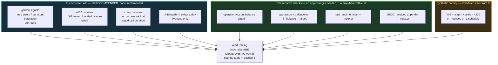

# MedRail — Monitoring


**Purpose:** state exactly what an operator can observe about MedRail today, enumerate the blind spots, and propose a monitoring design proportionate to the system that actually exists.

**Status of this document:** authored 2026-08-21 against commit `32ffd73`. **There is no monitoring.** No metrics, no tracing, no dashboards, no uptime checks, no alerting, no log aggregation — OPS-003, OPS-004 and OPS-005 are all **NOT IMPLEMENTED**, verified by reading the whole of `api/src`. The one observable surface is `GET /v1/health`. Everything from §4 onward is **RECOMMENDED** and none of it is in the repo. **No threshold value below is a number this project has chosen** — every threshold is marked as a decision to make.

---

## 1. What you can observe today

One endpoint. That is the complete list.

### `GET /v1/health` — `api/src/routes/health.ts:7-22`

```json
{
  "ok": true,
  "service": "medrail-api",
  "network": "testnet",
  "consentAppId": 768743428,
  "chain": {
    "operatorAddress": "2WDV2J2FTWF535SMSUVEBOF5IGXF2OTV7ZZTLTCRBXPVS32UMLOPTI64GE",
    "operatorSpendableMicroAlgo": 96000,
    "appAccountAddress": "CCO26Y6Z56DDZ3OELO2UKJMIPJVSIT52I23F2MPMR52JBM3HQZZNUZNOR4",
    "appAccountSpendableMicroAlgo": 3866300,
    "microAlgoPerAuditWrite": 1000,
    "estimatedAuditWritesRemaining": 96,
    "warning": null,
    "sampledAt": "2026-08-22T00:00:00.000Z"
  },
  "chainError": null,
  "time": "2026-08-22T00:00:00.000Z"
}
```

| Field | What it actually proves | What it does not prove |
|---|---|---|
| `ok: true` | The Node process is running and Hono is routing. It is a **hardcoded literal** — it is never computed from anything | Nothing about the facilitator, algod, the contract, or whether any endpoint works |
| `service` | Constant string `"medrail-api"` | — |
| `network` | The value of `config.network`, i.e. the `NETWORK` env var | **Not** that the contract exists on that network. This is the field that would have exposed D-2 |
| `consentAppId` | `config.consentAppId \|\| null` — the resolved App ID, or `null` | **Not** that the app exists, is funded, or that the operator is its admin. `null` here is the D-1 signature — **and `ok` is still `true`** |
| `chain.operatorSpendableMicroAlgo` | `amount − minBalance` on the operator account, from a real algod read | Nothing about whether a *write* will succeed — only that it is affordable |
| `chain.appAccountSpendableMicroAlgo` | The same, for the application account that pays box MBR. `null` when no App ID is configured | — |
| `chain.estimatedAuditWritesRemaining` | The **smaller** of `floor(operatorSpendable / 1000)` and `floor(appSpendable / 22500)` — fee capacity versus box-MBR capacity (`services/algorand.ts:195-197`) | It is an estimate against a fixed 22,500 µALGO box cost, not a reservation. Concurrent grants consume the same headroom |
| `chain.warning` | `null` when healthy; a string below 20 remaining writes; a harder string at 0 | — |
| `chain.sampledAt` | When the reading was taken, which is **not** when the request was served | — |
| `chainError` | Why there is no reading — typically `"not sampled yet"` on a cold process, otherwise the algod error text | — |
| `time` | Server clock | — |

**The block is stale-while-revalidate, and that is deliberate.** `chainAccountHealth()` (`services/algorand.ts:237-241`) returns the last successful sample and kicks off a refresh only if it is older than 30 seconds; the request never awaits algod. `api/src/index.ts:13` primes the first sample at boot. So a slow or unreachable node degrades the *freshness* of `chain`, never the latency or the availability of the probe — which is the correct trade for something a platform health check calls every few seconds. Exactly one of `chain` and `chainError` is populated.

**The single most important property of this endpoint is still that it returns `200 {"ok":true}` in every failure mode this system has.** Facilitator down (R-1)? `200`. `CONSENT_APP_ID` unset (D-1)? `200`, with `consentAppId: null`. `OPERATOR_MNEMONIC` missing? `200`. Pointed at a network with no contract (D-2)? `200`. The `chain` block narrows that in exactly one place — an operator or application account running out of ALGO now shows up as a non-null `warning` *before* the audit writes start failing — and it is the only failure mode on that list this endpoint can now anticipate. Everything else remains invisible, and `ok` stays `true` throughout.

A naive uptime check against `/v1/health` would still have reported 100% availability through every incident in `Incident_Response.md`. **Treat it as a liveness probe with one funding gauge attached, and nothing more.** It is genuinely well-suited to that job (OPS-001, **IMPLEMENTED**). It is now wired to one probe and not the other: `api/fly.toml:37-42` declares an `[[http_service.checks]]` block against `/v1/health`, while `api/Dockerfile` still has no `HEALTHCHECK` (defect D-6, half closed) — and the Fly check has never executed, because nothing has ever been deployed.

### 1.1 Secondary, human-only observation

| Surface | What it gives you | Limitation |
|---|---|---|
| `GET /v1/consent/app-info` (`consent.ts:33-40`) | network, CAIP-2 id, App ID, ARC-56 URL | Static config echo. No liveness signal |
| `GET /` (`app.ts:71-83`) | Service index | Static |
| `web/components/NetworkBadge.tsx` | Polls `/v1/health` and renders a badge | A human must be looking at the page. Not an alerting path |
| stdout of the API process | One `console.log` at boot, `console.error(err)` per unhandled error | Not structured, not shipped, not retained. See `Logging.md` |
| A public block explorer (`https://lora.algokit.io/testnet/application/768743428`) | Everything on-chain | Manual. No polling, no alerting, no history retention by this project |

---

## 2. What does not exist

| Capability | Status | Requirement |
|---|---|---|
| Metrics export (Prometheus, StatsD, OTLP, anything) | **NOT IMPLEMENTED** — zero metric emissions in `api/src` | OPS-003 |
| Distributed tracing across API → facilitator → algod | **NOT IMPLEMENTED** | OPS-004 |
| Alerting of any kind | **NOT IMPLEMENTED** | OPS-005 |
| Dashboards | **NOT IMPLEMENTED** | — |
| External uptime check | **NOT IMPLEMENTED** — nothing is publicly hosted to check | — |
| Log aggregation / retention | **NOT IMPLEMENTED** | OPS-002 |
| Synthetic transaction canary | **NOT IMPLEMENTED** — `api/scripts/e2e-proof.ts` exists and could be one; it has been run manually, never on a schedule | **OPS-060** *(new)* |
| Chain-state monitoring (balances, box MBR, counters) | **NOT IMPLEMENTED** | OPS-005 |
| Container healthcheck wiring | **NOT IMPLEMENTED** | D-6, OPS-054 |
| Request correlation ids | **NOT IMPLEMENTED** | OPS-002, **OPS-061** *(new)* |

---

## 3. Blind spots

These are not gaps in a monitoring stack. **There is no monitoring stack.** These are the specific things that can go wrong in this system where, today, *nobody would ever find out*. Ordered by consequence.

### 3.1 Operator-account ALGO balance — **the most dangerous blind spot in the system**

`logAccess` submits a **real, fee-paying transaction** signed by the operator account (`api/src/services/algorand.ts:146-178`). Nothing anywhere tops that account up automatically, and nothing alerts on it — but it is no longer unobservable. `GET /v1/health` now carries a `chain` block reporting `operatorSpendableMicroAlgo` and an `estimatedAuditWritesRemaining` derived from it, with a `warning` string once that drops below 20 (§1). That converts this from *"nobody would ever find out"* to *"anybody who looks will find out"*, which is a smaller improvement than it sounds: **nothing looks.** There is no probe consuming that field, no alert on it, and no schedule. The gauge exists; the monitoring does not.

**When the operator account runs out of ALGO:**

1. `atc.execute(algod, 4)` throws (`algorand.ts:175`).
2. On the **denied** path of `/v1/records/summary`, this is swallowed — `logAccess(...).catch(() => undefined)` (`records.ts:37`). The caller still gets their 403.
3. On the **allowed** path it is **not** caught (`records.ts:49`). The exception propagates to `app.onError` → **HTTP 500** (`app.ts:58-61`).
4. **The payment has already settled.** The caller paid $0.05 and receives an error.

So: **an empty operator account silently converts every successful, consent-granted, paid records call into a lost payment**, indefinitely, with no signal to anyone. That is R-2 / REL-002 firing continuously from a cause that a single balance check would have caught days earlier. The asymmetry is worth restating — the *rejection* path is defensive, the *success* path is not.

### 3.2 Settlement failure rate

The API never records whether a payment settled, failed, or was rejected. `@x402/hono`'s middleware handles it internally (`app.ts:37-50`) and the application observes nothing. There is **no counter of 402s issued, payments verified, payments settled, or settlements failed.** A facilitator degrading from "working" to "rejecting 40% of settlements" is invisible.

### 3.3 402 → 200 conversion rate

The health of an x402 business is the ratio of challenges issued to resources delivered. Neither number is captured. A change that breaks the challenge (an empty `payTo`, a wrong CAIP-2 network, a client-incompatible header) produces a conversion rate of zero and **exactly the same observable behaviour as a quiet day.**

### 3.4 Revenue actually received at `payTo`

`PAY_TO_ADDRESS` is where money lands (`config.ts:53`, `x402.ts:26`). Nothing verifies that anything arrives. Failure modes that all look identical from inside the process:

- `PAY_TO_ADDRESS` unset ⇒ `402` advertises an empty `payTo`.
- `PAY_TO_ADDRESS` set to an address **not opted in to the USDC ASA** ⇒ the asset transfer cannot be received at all (the Algorand opt-in rule, `Environment_Setup.md` §7.3).
- A config change points revenue at the wrong address, and it stays there until a human happens to check a block explorer.

The API trusts the facilitator's settlement verdict and does **not** independently confirm the settled transaction against algod. That is the standard x402 trust model and not a vulnerability — but it does mean the ledger is the *only* place revenue can be observed, and nothing observes it.

### 3.5 App-account box-MBR headroom

Every new grant box and every audit box raises the application account's minimum balance. When the balance minus min-balance no longer covers the next box, `log_access` fails — which is §3.1's failure again, from a different account. As with §3.1, `/v1/health`'s `chain` block now reports `appAccountSpendableMicroAlgo` and folds it into `estimatedAuditWritesRemaining` at 22,500 µALGO per box — the *conservative* figure, deliberately, not the 22,100 the deployed ABI method under-quotes. Readable; still unwatched.

Measured on-chain today: App `768743428`'s account holds **5,000,000 µALGO** with a **min-balance of 145,000 µALGO** and **2 boxes**. Headroom is comfortable now, and there is no monitoring that would tell you when it stopped being. `fund_mbr` exists (`contract.py:129-138`) and nothing calls it automatically. Note the sizing hazard: `get_grant_box_mbr()` returns **22,100 µALGO** while the true cost is **22,500** (defect C-2) — a backend sizing top-ups from that ABI method under-funds by ~1.8% per box.

### 3.6 Facilitator availability

A hard, uncached, unmonitored dependency. If `facilitator.goplausible.xyz` is unreachable, all three priced routes return **HTTP 500** with no `PAYMENT-REQUIRED` header and no `Retry-After` — not a 402, not a 503 (R-1 / REL-001, reproduced by the reviewer). Free routes keep returning 200 (REL-005, **VALIDATED**), so **the blast radius is exactly the revenue-generating surface** — the part nothing watches.

### 3.7 algod availability, latency and error rate

`new algosdk.Algodv2("", config.algodServer, "")` (`algorand.ts:5`) — **no timeout, no retry, no circuit breaker** (R-4 / REL-003). `atc.execute(algod, 4)` waits ~4 rounds (roughly 14 s) before throwing. A single AlgoNode blip becomes a user-visible 500 on `/v1/consent/status` and `/v1/records/summary`. Nothing measures algod latency, error rate, or the 4-round timeout rate. And AlgoNode is **hardcoded** per network at `config.ts:21-24` with no env override (**OPS-057**), so there is no failover to observe either.

### 3.8 Per-endpoint latency

**No latency is measured anywhere.** The only two observations that exist are single samples taken by the reviewer on a developer laptop: `GET /v1/consent/status` cold at **505 ms** (two sequential algod round-trips), and warm 402 generation on `/v1/triage` at **~15 ms**. These are single observations. **They are not p50/p95/p99, not SLOs, and not a benchmark** (PERF-002, PERF-003 both **NOT IMPLEMENTED**).

### 3.9 Error rate by class

`app.onError` (`app.ts:58-61`) collapses every failure — invalid address (R-3), missing App ID (D-1), missing operator key, facilitator down (R-1), algod timeout (R-4), non-admin `log_access` — into one `console.error(err)` and one HTTP 500 body. **There is no error taxonomy, no error counter, and no way to distinguish a client's malformed input from the operator account being empty.** Any future monitoring must start by separating these, because the responses are indistinguishable.

### 3.10 Abuse of the free, unauthenticated endpoint

`/v1/consent/status` is free, unauthenticated, and performs **two outbound algod calls per request** (`algorand.ts:85, 98`). It is now rate-limited to 60/min per IP (`api/src/rateLimit.ts`), capping both self-exhaustion and amplification into AlgoNode (SEC-013, **NOT IMPLEMENTED**) and no request-rate metric. It is usable both to exhaust the API and to amplify traffic at AlgoNode, and neither would be visible.

### 3.11 Requester impersonation (finding S-1)

`/v1/records/summary` takes `requesterAddress` from the **request body** and never binds it to the identity that paid (`records.ts:5-8, 32`). A paying stranger can name any authorised requester and be served — and the on-chain audit log then records the **claimed** requester (SEC-007, SEC-008, both **NOT IMPLEMENTED**).

**No monitoring can detect this**, and that is worth being blunt about: an exploited request is byte-for-byte identical to a legitimate one at the HTTP layer. Detection would require comparing the payer recovered from the `PAYMENT-SIGNATURE` header against `requesterAddress` — which is the fix, not a monitor. §5.4 proposes logging both as a **detective** control once the payer is recoverable at all.

### 3.12 Deployed version

`/v1/health` reports no version, commit SHA, or image tag. During an incident, "what is running?" has no answer (see `../08_Deployment/CI_CD.md` §7.2).

---

## 4. **RECOMMENDED** monitoring design

Scoped to a hackathon project with one contributor, no hosting, and one live TestNet contract. **Not** an enterprise observability build-out. Four golden signals, four chain-native checks, one canary. That is the whole proposal.



**Deliberate ordering:** the chain-native checks (§5) need **no application change at all** — they are `curl` against public endpoints. Implement those first. They cover §3.1, §3.4 and §3.5, which are the blind spots that cost money.

### 4.1 Golden signals — **RECOMMENDED**

| Signal | Metric | Labels | Why |
|---|---|---|---|
| **Traffic** | `http_requests_total` | `route`, `method`, `status` | Establishes a baseline; makes §3.3 computable |
| **Errors** | `http_requests_total{status=~"5.."}` plus `app_errors_total{class}` | `class` ∈ `facilitator_unavailable`, `app_id_unset`, `operator_key_unset`, `invalid_address`, `algod_timeout`, `log_access_failed`, `not_admin`, `unknown` | Directly fixes §3.9. **The `class` label is the highest-value single change in this document** — without it every incident looks the same |
| **Duration** | `http_request_duration_seconds` histogram | `route` | Fixes §3.8. Also gives the first real latency data this project has ever had |
| **Saturation** | `algod_inflight`, `patient_lock_queue_depth` | — | `patientQueues` (`algorand.ts:129`) is an unbounded in-memory queue. Depth is the leading indicator of audit-write backpressure |

### 4.2 x402-specific counters — **RECOMMENDED**

| Metric | Where it would be emitted | Fixes |
|---|---|---|
| `x402_challenges_total{route}` | when the middleware emits a 402 | §3.3 |
| `x402_settlements_total{route,outcome}` — `outcome` ∈ `settled`/`failed` | after the middleware settles | §3.2 |
| `x402_conversion_ratio` = 200s ÷ 402s per route | derived | §3.3 |
| `paid_request_failed_after_settlement_total{route}` | **critical** — increment when a handler throws after settlement | §3.1, R-2 / REL-002. **Every increment is a customer who paid and got nothing.** This is a page-worthy metric, not a dashboard one |

### 4.3 Chain-integration counters — **RECOMMENDED**

| Metric | Fixes |
|---|---|
| `log_access_total{outcome}` — `ok`/`failed` | §3.1 |
| `log_access_duration_seconds` | the ~14 s `atc.execute(algod, 4)` ceiling |
| `algod_request_duration_seconds{op}` — `getTransactionParams`, `simulate`, `execute` | §3.7 |
| `algod_errors_total{op}` | §3.7 |
| `facilitator_up` (0/1, from a periodic probe of `/supported`) | §3.6 |

---

## 5. Chain-native checks — **RECOMMENDED**, and implementable today with `curl`

These require **no code change to MedRail**. They read public Algorand infrastructure. Any scheduler can run them.

### 5.1 Operator-account ALGO balance — closes §3.1

```bash
OPERATOR=<58-char operator address>
curl -fsS "https://testnet-api.algonode.cloud/v2/accounts/$OPERATOR" \
  | jq '{ microalgos: .amount, minBalance: ."min-balance",
          spendable: (.amount - ."min-balance") }'
```

Alert when `spendable` falls below a chosen floor. **Choosing that floor is a decision, not a number this document can supply** — size it as `(expected log_access calls before the next top-up) × (per-transaction fee)` plus a margin, and revise it once real traffic exists.

The service already computes this for both accounts: `curl -fsS "$API_BASE/v1/health" | jq .chain` returns the same `spendable` figure plus `estimatedAuditWritesRemaining`, cached for 30 seconds so polling it costs algod nothing. Prefer it for a *probe*, because it is one call instead of two and it will not rate-limit the public node. Prefer the direct algod query above for an *investigation*, because it is independent of the process you are investigating — if the API is the thing that is broken, do not ask it how it is.

### 5.2 App-account balance and box-MBR headroom — closes §3.5

```bash
APP_ADDR=CCO26Y6Z56DDZ3OELO2UKJMIPJVSIT52I23F2MPMR52JBM3HQZZNUZNOR4
curl -fsS "https://testnet-api.algonode.cloud/v2/accounts/$APP_ADDR" \
  | jq '{ balance: .amount, minBalance: ."min-balance",
          headroom: (.amount - ."min-balance"),
          boxes: ."total-boxes", boxBytes: ."total-box-bytes" }'
# Verified 2026-08-21: balance 5000000, min-balance 145000, boxes 2, box bytes 100.
```

Express the threshold in **boxes**, not µALGO: `headroom / 22500` = grant boxes still affordable. Use **22,500**, not the 22,100 that `get_grant_box_mbr()` returns — that ABI method under-reports by 400 µALGO/box (defect C-2), and 22,500 is what the ledger actually charges.

### 5.3 Contract global state — closes part of §3.2 and gives the only real usage signal that exists

```bash
curl -fsS "https://testnet-idx.algonode.cloud/v2/applications/768743428" \
  | jq -r '.application.params."global-state"[]
           | "\(.key | @base64d) = \(.value.uint // (.value.bytes))"'
```

Base64 keys, for a monitor that needs them literally:

| Key | Base64 | Live value, 2026-08-21 |
|---|---|---|
| `admin` | `YWRtaW4=` | (byteslice — the admin account) |
| `total_requests` | `dG90YWxfcmVxdWVzdHM=` | `2` |
| `total_grants_active` | `dG90YWxfZ3JhbnRzX2FjdGl2ZQ==` | `0` |
| `total_revocations` | `dG90YWxfcmV2b2NhdGlvbnM=` | `2` |
| `total_audit_entries` | `dG90YWxfYXVkaXRfZW50cmllcw==` | **`0`** |

Two things to watch, and one to note:

- **`total_audit_entries` should increase** whenever a paid `/v1/records/summary` succeeds. If paid records calls are being served and this counter is flat, audit writes are failing — the §3.1 scenario. This is the single best chain-side proxy for "money is being taken without the audit write that justifies it".
- **`admin` must equal the expected operator address.** An unexpected change means `set_admin` was called by someone else — a key-compromise signal (`Incident_Response.md` §C).
- **It reads `0` today.** `log_access` has never executed on Algorand TestNet, and there are zero `s`- and `a`-prefixed boxes on the app. Any monitor built on this counter starts from a baseline that has never moved.

### 5.4 USDC received at `payTo` — closes §3.4

```bash
PAYTO=<your payTo address>
curl -fsS "https://testnet-idx.algonode.cloud/v2/accounts/$PAYTO/transactions?asset-id=10458941&limit=50" \
  | jq -r '.transactions[]
           | select(."asset-transfer-transaction".receiver == $ENV.PAYTO)
           | "\(."confirmed-round") \(."asset-transfer-transaction".amount) \(.id)"'
```

Sum the amounts over a window and compare against `x402_settlements_total{outcome="settled"}` (§4.2). **A divergence between "the API thinks it settled" and "the ledger shows a receipt" is the only true revenue check that exists.** MainNet uses ASA `31566704`.

For reference, the settled payments on record. The first: tx `OYRQRKYA7WUKBVLWTOFJSJMZFBW7VCNGP5VGH5EBUJGRCVFQFJRQ`, ASA `10458941`, amount `20000` base units (= $0.02 at 6 decimals), confirmed round 66091768, fee `0` (fee-sponsored) — sender and receiver are the same address, a self-transfer, disclosed in `docs/PROOF.md` §6. The agent run's three (`DOSKCNKJ…`, `PLBFDDAD…`, `COMJ3TQO…`, `docs/PROOF.md` §10) are not: they arrive at `payTo` from `UYBTLPHS…`, an independent keypair this service does not control, against a grant signed by a third account (`56LFG5EE…`) that is neither the payer nor the payee. Both of those wallets were nonetheless funded from the project's own, and **no external party has paid for this service. Do not build a revenue dashboard that describes any of it as volume.**

### 5.5 Facilitator probe — closes §3.6

```bash
curl -fsS --max-time 10 https://facilitator.goplausible.xyz/supported > /dev/null \
  && echo "facilitator_up 1" || echo "facilitator_up 0"
```

This is the same call the API makes at `x402ResourceServer` initialise. If it fails, all three priced routes will return 500 (R-1) — **so this probe is a leading indicator for a revenue outage and costs one HTTP request.**

---

## 6. Synthetic canary — **RECOMMENDED** (OPS-060)

`api/scripts/e2e-proof.ts` already performs the full flow: `402` → construct and sign a real Algorand payment → settle via GoPlausible → `200` → write the settled tx id to `contracts/artifacts/e2e-proof.json`. It has been run manually. **Run it on a schedule against TestNet and it becomes the only end-to-end health signal this system can have.**

| Property | Value |
|---|---|
| What it proves | The complete revenue path works: challenge generation, facilitator availability, signing, settlement, resource delivery |
| What it costs | $0.02 in TestNet USDC per run, plus zero ALGO (the facilitator sponsors the fee via `extra.feePayer`) |
| Prerequisites | a funded TestNet account holding ALGO and USDC, **opted in to ASA 10458941** |
| Frequency | **a decision to make.** Trade detection latency against faucet-replenishable USDC. Faster is better and the marginal cost is play money |
| Where it runs | a scheduled GitHub Actions job, or any cron host with `npx tsx` |
| Failure signal | non-200, or an absent `settledTransaction` in the output |
| **Never run it against MainNet** | it spends real USDC on every execution, and it needs a funded mnemonic in the scheduler's secret store — see SEC-012 |

**Extension worth building (RECOMMENDED):** a second canary targeting `POST /v1/records/summary` with a pre-granted consent triple. That is the only path that exercises `log_access`, and it would move `total_audit_entries` off zero for the first time — closing the evidence gap behind FR-010/FR-011/FR-012 (see `../07_Testing/Test_Plan.md`). It is worth more as a **test** than as a monitor, but it functions as both.

---

## 7. Alert table — **RECOMMENDED**

**Every threshold below is a decision this project has not made.** They are written as `TBD` deliberately. Do not fill them in with plausible-looking numbers; derive them from a baseline once one exists. Severity definitions are in `Incident_Response.md` §9.

| # | Condition | Threshold | Sev | Immediate action | Blind spot closed |
|---|---|---|---|---|---|
| A1 | `paid_request_failed_after_settlement_total` increases | **any increase** — this is the one threshold that is not a judgement call | **SEV-1** | `Incident_Response.md` §B. Every increment is money taken with nothing delivered | §3.1, R-2 |
| A2 | Operator account spendable ALGO below floor | TBD µALGO — derive from fee × expected calls | **SEV-1** | Top up immediately. At zero, every paid records call becomes a lost payment | §3.1 |
| A3 | `/v1/health` unreachable or non-200 | TBD consecutive failures over TBD window | **SEV-1** | `Incident_Response.md` §H | liveness |
| A4 | `/v1/health` returns `consentAppId: null` | **any occurrence** | **SEV-1** | Config error — D-1. Set `CONSENT_APP_ID` and restart | §3.12, D-1 |
| A5 | `/v1/health` `network` ≠ the network the App ID exists on | **any occurrence** | **SEV-1** | D-2. Fix `NETWORK` and redeploy | D-2 |
| A6 | Canary (§6) fails | TBD consecutive failures | **SEV-1** | Triage: facilitator, API, or chain. `Incident_Response.md` §A | §3.2, §3.3, §3.6 |
| A7 | Facilitator `/supported` probe fails | TBD consecutive failures | **SEV-2** | Priced routes will be 500. `Incident_Response.md` §A | §3.6 |
| A8 | `app_errors_total{class="facilitator_unavailable"}` rate rises | TBD/min | **SEV-2** | Same as A7, observed from inside | §3.6, §3.9 |
| A9 | App-account headroom below N grant boxes | TBD boxes — compute at **22,500 µALGO/box**, not the 22,100 the contract advertises | **SEV-2** | Call `fund_mbr` | §3.5, C-2 |
| A10 | `total_audit_entries` flat while paid records 200s are being served | TBD window | **SEV-2** | Audit writes failing silently on the denied path, or A2 | §3.1 |
| A11 | `admin` global state ≠ expected operator address | **any change** | **SEV-1** | **Suspected key compromise.** `Incident_Response.md` §C | §3.11, SEC-012 |
| A12 | USDC received at `payTo` diverges from settled-count × price | TBD tolerance over TBD window | **SEV-2** | Verify `PAY_TO_ADDRESS` and its ASA opt-in | §3.4 |
| A13 | 5xx rate on any route | TBD % over TBD window | **SEV-2** | Break down by `class` label | §3.9 |
| A14 | `algod_errors_total` rate rises | TBD/min | **SEV-2** | `Incident_Response.md` §F. No retry exists (R-4) | §3.7 |
| A15 | p95 latency on any route above budget | TBD ms — **no budget has ever been set** (PERF-002) | **SEV-3** | Investigate | §3.8 |
| A16 | Request rate to `/v1/consent/status` above normal | TBD/min | **SEV-3** | Possible abuse; no rate limiting exists (SEC-013) | §3.10 |
| A17 | `patient_lock_queue_depth` growing | TBD | **SEV-3** | Audit-write backpressure; check A2 and A14 | §4.1 |

### 7.1 Alerts deliberately **not** proposed

| Not proposed | Why |
|---|---|
| Contract "downtime" | Algorand's availability is not this project's to monitor or influence. Alerting on it produces noise nobody can action |
| Requester-impersonation detection (S-1) | Not detectable at the HTTP layer — the exploit is indistinguishable from legitimate traffic (§3.11). **Fix it in code; do not pretend a monitor covers it** |
| Anything with an SLA or uptime-percentage target | Nothing is hosted. **No availability target exists and none should be invented** |

---

## 8. Dashboards — **RECOMMENDED**

Three panels. Resist more; a hackathon project with one contributor will not maintain twelve.

| Panel | Contents | Answers |
|---|---|---|
| **Money** | 402s issued, settlements succeeded/failed, `paid_request_failed_after_settlement_total`, USDC received at `payTo` from the indexer | "Are we being paid, and is anyone paying for nothing?" |
| **Chain** | Operator ALGO spendable, app headroom in boxes, `total_audit_entries`, `log_access` success/failure, `admin` address unchanged | "Can we still write audit entries tomorrow, and is the admin still us?" |
| **Service** | Request rate / error rate by `class` / latency by route, facilitator up, canary status | "Is it up, and if not, whose fault is it?" |

---

## 9. Requirements traceability

| ID | Statement (abbreviated) | Status | Where |
|---|---|---|---|
| OPS-001 | Health endpoint suitable for an orchestrator probe | **IMPLEMENTED**, unwired (D-6) | §1 |
| OPS-002 | Structured logs with a request correlation id | **NOT IMPLEMENTED** | `Logging.md` |
| OPS-003 | Metrics exported | **NOT IMPLEMENTED** | §2, §4 |
| OPS-004 | Distributed tracing API → facilitator → algod | **NOT IMPLEMENTED** | §2 |
| OPS-005 | Alerting for operator balance, app MBR headroom, settlement failure rate | **NOT IMPLEMENTED** | §7 (A2, A9, A1) |
| PERF-002 | `/v1/consent/status` within a defined latency budget | **NOT IMPLEMENTED** — no budget defined | §3.8, A15 |
| PERF-003 | Paid-endpoint latency measured and published | **NOT IMPLEMENTED** | §3.8 |
| REL-001 | Facilitator outage degrades gracefully | **NOT IMPLEMENTED** | §3.6, A7 |
| REL-002 | A settled payment never consumed without delivering or recording a failure | **NOT IMPLEMENTED** | §3.1, A1 |
| REL-003 | Timeout and bounded retry on algod calls | **NOT IMPLEMENTED** | §3.7, A14 |
| REL-006 | App account holds sufficient balance for box MBR | **PARTIALLY IMPLEMENTED** | §3.5, §5.2, A9 |
| SEC-013 | Public endpoints rate-limited | **NOT IMPLEMENTED** | §3.10, A16 |
| **OPS-060** *(new, added by Monitoring.md)* | A synthetic canary shall exercise 402 → settle → 200 on a schedule. | **NOT IMPLEMENTED** | §6 |

---

## 10. Cross-references

- `Logging.md` — the missing substrate. Most metrics in §4 are cheaper to derive from structured logs than to instrument separately.
- `Incident_Response.md` — every alert in §7 routes to a runbook there.
- `Disaster_Recovery.md` — §5.1/§5.2 balances are also DR inputs; §5.3's `admin` check is the key-compromise tripwire.
- `../08_Deployment/Deployment_Architecture.md` — D-1, D-2, D-6, D-7 and the egress dependency table behind §3.6/§3.7.
- `../08_Deployment/Docker.md` §5, §8.4 — the `HEALTHCHECK` and Fly `[[http_service.checks]]` that would wire `/v1/health` to something.
- `../08_Deployment/CI_CD.md` §7.2 — adding `gitSha` to `/v1/health`, closing §3.12.
- `../02_Requirements/SRS.md`, `../06_Security/Risk_Register.md` (R-1, R-2, R-4, S-1, SEC-012, SEC-013), `../07_Testing/Test_Plan.md`.
