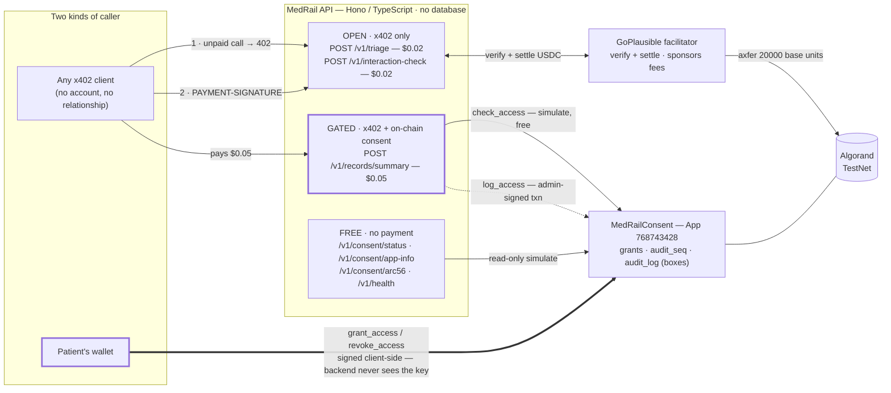

# MedRail — Pitching the Architecture


> **⚠ Correction notice.** Parts of this document were written against a review finding that was
> later proven wrong. Settlement in x402 v2 happens **only** on a sub-400 response, so **no error
> path in MedRail can consume a settled payment** — and consent-denied calls (HTTP 403) are **not
> charged**, contrary to `API.md`, `SECURITY.md`, and the `paidButDenied` field. The audit-sequence
> race causes a **rejected transaction**, not a corrupted log. See
> [`CORRECTIONS.md`](../CORRECTIONS.md) — it supersedes any statement here that contradicts it.

**Purpose:** how to present MedRail's technical architecture to a mixed audience of engineers and non-engineers in under three minutes — one thesis, one diagram, three evidenced claims, and the depth to hold in reserve for Q&A.

**Status of this document:** Pitch guidance, 2026-08-21. Every technical fact and transaction id below was verified against source or the public Algorand TestNet indexer during authoring. No MainNet deployment, public hosting, Bazaar listing, leaderboard presence, or payment volume is claimed — all are pending. Exactly one settled payment exists; it was a self-payment. Judging criteria referenced are per `docs/COMPLIANCE.md:31-33`; the official rules were not independently re-fetched during this review.

Companion documents: [`Demo_Script.md`](Demo_Script.md), [`Winning_Strategy.md`](Winning_Strategy.md), [`Judge_Evaluation.md`](Judge_Evaluation.md), [`../02_Requirements/Requirements_Gap_Analysis.md`](../02_Requirements/Requirements_Gap_Analysis.md), [`../06_Security/Threat_Model.md`](../06_Security/Threat_Model.md).

---

## 1. The one-sentence thesis

> **MedRail turns "who may read my medical records" into a public object the patient signs and can revoke without asking anyone — and then charges per call to read it, using x402, so the permission layer and the payment layer are the same round trip.**

Say it exactly once, at the start. Do not repeat it, do not paraphrase it later, and do not add a second sentence of clarification — the diagram is the clarification.

**If you have five more seconds and the room is non-technical**, add:

> "Today, the only way to find out who read your records is to ask the organisation holding them. That's the thing we changed."

**Two words to avoid.** *Platform* and *ecosystem*. You have one contract, three priced endpoints, and one page. Precision is the pitch.

---

## 2. The one diagram

One diagram carries the whole story. It must show: two categories of endpoint, one contract, one facilitator, no database.



### How to narrate it — 45 seconds, four gestures

1. **Point at the two boxes on the left.** *"Two kinds of caller. A stranger's agent, and a patient. They never meet."*
2. **Trace the top path.** *"Open endpoints. Anyone's agent pays two cents through the facilitator and gets an answer. No account, no API key, no prior relationship with us."*
3. **Trace the thick line from the patient.** *"This is the important one. The patient grants and revokes consent by signing directly against Algorand. Our backend never sees that key, never proxies it, and could not revoke on their behalf if it wanted to."*
4. **Point at the bold gated box.** *"And this endpoint requires both. You pay, and the same call reads the patient's on-chain grant. One round trip that's simultaneously 'you paid for the compute' and 'you were allowed to see this.'"*

### The three things the diagram is designed to make obvious

- **There is no database.** Say it out loud once — *"note what's missing: there's no database anywhere in this system"* — because it looks like an omission and it is a design decision. The only durable state is Algorand box storage plus two static tables.
- **The dotted line is honest.** `log_access` is dotted because it is a *separate transaction*, not part of the payment's atomic group. That is deliberate, defensible, and covered in §4.3.
- **The thick patient line never touches the API.** That is the entire patient-ownership claim, drawn rather than asserted.

---

## 3. Three claims, and the evidence for each

Make exactly these three. Each takes about twenty seconds including its evidence.

### Claim 1 — "The contract is real, and you can verify it without me."

**Evidence:** App **768743428**, created at round **66088624**, `deleted: false`, admin set, 5 ALGO funded, two grant boxes live.

```bash
curl -s https://testnet-idx.algonode.cloud/v2/applications/768743428
```

**Show:** the live terminal output, or https://lora.algokit.io/testnet/application/768743428.

**Say:** *"That's the public indexer. Not our server, not our API, no key, no account. You can run that on your phone right now."*

**Why it works:** it removes you from the trust chain entirely. Most submissions ask a judge to believe a screenshot.

---

### Claim 2 — "A real payment settled, and we didn't build the parts that make it correct."

**Evidence:** transaction `OYRQRKYA7WUKBVLWTOFJSJMZFBW7VCNGP5VGH5EBUJGRCVFQFJRQ` — `axfer`, asset `10458941`, amount **20000** base units, confirmed round **66091768**, **fee 0**.

**Show:** the decoded `PAYMENT-REQUIRED` header (`Demo_Script.md` Beat 3), then the transaction on Lora.

**Say:** *"Twenty thousand base units — exactly two cents at six decimals. Our route config contains the string `$0.02` and nothing else: no asset id, no decimal conversion. The SDK asked the facilitator what USDC is on this network and produced that number. Fee zero, because the facilitator sponsors it — a caller needs USDC and no ALGO at all. We built the thing that asks correctly; the protocol did the rest."*

**Then, unprompted:** *"Sender and receiver on that transaction are the same address. That was our own proof run — we paid ourselves, because it needed one funded account instead of two. It's a genuine facilitator-settled payment with no special-casing, and it's the only one that exists. It's written up in section six of our proof log, before anyone asked."*

**Why it works:** you demonstrate that you know which parts of your own system you didn't write, and you disclose your weakest fact voluntarily. Both read as competence.

---

### Claim 3 — "The patient holds the key, and revocation is real."

**Evidence:** `web/lib/consent.ts:41-60` — the patient's `grant_access`/`revoke_access` transactions are constructed and signed client-side and submitted straight to AlgoNode. There is no key-ingress path anywhere in `api/src/`. On-chain: grant `X2BQ5FD4MW52B75WQGDB67TEULYLN7FHVFO6ZOBNI74PNCAKVOUA`, revoke `OV2J2T5VWMIQG64JYGL7JEGZKKNZNKCMNIQU6AC4PDRQYZ6ZOO5A`.

**Show:** the live grant → check (`granted`) → revoke → check (`not granted`) flow, `Demo_Script.md` Beat 5.

**Say:** *"`check_access` went true to false, and that read is a simulated call — zero fee, nothing submitted. The grant transaction was signed in the browser and submitted straight to Algorand. If our backend disappeared tonight, the patient's consent state and their ability to revoke it would be completely unaffected. That's what 'the patient owns it' has to mean to be worth saying."*

**Why it works:** it converts an abstract claim into an operational one — *the system can die and the property survives*.

---

## 4. Depth to hold in reserve for Q&A

Do **not** put any of this in the three-minute pitch. Each is a complete, satisfying answer to a specific question, and each is worth more when pulled than when pushed.

### 4.1 Box-key derivation, and why boxes rather than local state

`contract.py:95-98`:
```python
def grant_key(patient: Account, requester: Account, scope: String) -> Bytes:
    return op.sha256(patient.bytes + requester.bytes + scope.bytes)
```

32 bytes, fixed length, one box per `(patient, requester, scope)` triple, stored in `BoxMap(Bytes, GrantRecord, key_prefix="g")`.

**Why boxes:** Algorand local state would require every requester — including a stranger's read-only agent — to **opt in** to the application before it could hold a grant. For a pay-per-call endpoint that is absurd; it converts a one-round-trip call into a two-transaction onboarding. Boxes let any triple exist without either party opting in to anything except the box's minimum balance, which the app account funds itself via `fund_mbr`.

**Why sha256 rather than concatenation:** box keys are length-limited and the scope is a free-form string. Hashing gives a fixed 32-byte key for an unbounded input, so scope length never constrains the design.

**The honest cost, if pressed:** the derivation is implemented three times — Python (`contract.py:96-98`), Node (`api/src/services/algorand.ts:64-70`), and WebCrypto in the browser (`web/lib/consent.ts:25-33`) — and there is **no test proving they agree** (`NFR-011`, **UNVALIDATED**). If any one drifts, a grant written by the browser becomes silently unreadable by the backend: no error, just `false`. Volunteering this is worth more than hiding it; it is one of the sharpest things you can say about your own code.

**One more detail worth having:** `scope` is a free-form string, not an enum (`DATA-003`). Adding a fourth endpoint with a new scope requires zero contract changes and zero redeployment.

### 4.2 Why `log_access` is admin-gated

`contract.py:222` — `assert Txn.sender == self.admin.value, "only admin"`.

**The reasoning:** the audit log records that someone *paid and was authorised*. Only the party that observed the settlement can attest to that, and that is the backend. If `log_access` were open, anyone could write arbitrary entries into any patient's trail — which is worse than no audit trail, because an on-chain record carries an implicit claim of trustworthiness.

**The honest limitation, and you must give it:** this makes the operator key a single point of forgery. `OPERATOR_MNEMONIC` sits in an environment variable, is simultaneously the contract `admin`, and that one key can write arbitrary audit entries, rotate `set_admin` to lock out the real owner, and drain the app account via `withdraw_excess`. No multisig, no HSM, no rotation runbook (`SEC-012`, **NOT IMPLEMENTED**). The correct fix is a multisig admin so no single key can write the log. What the chain *does* guarantee today is narrower and true: entries are append-only and cannot be quietly edited afterwards. Make the smaller claim.

**The tested part:** `test_consent.py::test_log_access_rejects_non_admin` and `test_withdraw_excess_admin_only` both pass. The gate itself is validated; the key custody is not.

### 4.3 Why the audit write is not in the payment's atomic group

This is the strongest piece of reasoning in the repository (`docs/ARCHITECTURE.md:102-115`). Have it ready verbatim.

The Algorand `exact` scheme permits up to **16 transactions** in a client's signed payment group. Bundling a `log_access` app-call alongside the payment was therefore *available*, and would have given true ledger-level atomicity.

**It was rejected**, because a generic x402 client — `@x402/fetch`, or any other team's agent — only knows how to construct the transaction described in `paymentRequirements`. Requiring callers to additionally know MedRail's App ID and ABI method signature would make the endpoint uncallable by any off-the-shelf client, which directly destroys the open-endpoint volume strategy that is the whole point of the architecture.

**So:** the facilitator settles through the normal flow, and the backend's operator account — already registered as `admin` — submits `log_access` immediately afterwards. Two real transactions, moments apart, not atomic at the ledger level. The stated mitigation is that `log_access` is admin-gated and only ever called server-side after a facilitator-confirmed settlement.

**The residual risk, which you should name before they do:** if that second transaction fails, the payment has already settled. Today `api/src/routes/records.ts:49` does not guard it, so the caller gets an HTTP 500 with their $0.05 spent (finding R-2, `REL-002` **NOT IMPLEMENTED**). Note the asymmetry: the *denied* path at line 37 wraps `logAccess` in `.catch(() => undefined)`; the *success* path does not. The fix is about ten lines — return the resource with `auditTxId: null` and an explicit `auditWriteFailed` flag — and it is in `Winning_Strategy.md` M3.

**Why this answer lands:** you identify a tempting design, reject it for a stated reason, own the cost, and know the exact line number where the cost bites. That is the shape of an answer that ends a line of questioning.

### 4.4 MBR economics

Algorand box minimum balance is `2500 + 400 × (len(key) + len(value))` µALGO, locked in the **app account** for as long as the box exists.

A grant box: 33-byte effective key (`"g"` prefix + 32-byte digest) + 17-byte `GrantRecord` (1 + 8 + 8, ARC-4 encoded) = **22,500 µALGO**, about 2.25 cents of ALGO per consent grant, refundable when the box is deleted.

**Verified against the live ledger:** app account `CCO26Y6Z56DDZ3OELO2UKJMIPJVSIT52I23F2MPMR52JBM3HQZZNUZNOR4` reports `min-balance = 145,000` with `total-boxes = 2`. 145,000 − 100,000 (base account MBR) = 45,000 = 2 × 22,500. Exactly.

**And here is the defect you should volunteer.** `contract.py:52` computes `GRANT_BOX_MBR = 2_500 + 400 * (32 + 17)` = **22,100** — it omits the 1-byte `"g"` key prefix. The `get_grant_box_mbr()` ABI method, advertised in its own docstring as *"a compile-time constant the backend can quote when sizing `fund_mbr` calls"*, therefore returns a figure **400 µALGO per box too low**. A backend sizing top-ups from it under-funds by 1.8%. Finding C-2; one-line fix, `400 * (33 + 17)`.

**Say it like this:** *"We found that by checking our own advertised constant against the deployed app's actual minimum balance. We haven't shipped the fix, because redeploying gives us a new App ID and destroys every transaction id in our evidence log — and a four-hundred-microalgo error is worth less than the deployment history."*

That answer demonstrates three things at once: you audit your own arithmetic against the ledger, you understand what redeployment costs, and you make trade-offs deliberately rather than by omission.

**Audit boxes**, for completeness: the contract deliberately does *not* hard-code their MBR (`contract.py:53-55`), because `AuditEntry` contains variable-length ARC-4 strings. That is correct, not an oversight.

### 4.5 Why `check_access` costs nothing

`check_access` and `get_audit_count` are `readonly=True` ABI methods executed via `AtomicTransactionComposer.simulate()` (`api/src/services/algorand.ts:80-100`). No fee, nothing submitted, no state change. A consent check is a free read that anyone can perform against the public contract without an account.

**Measured latency:** a cold `GET /v1/consent/status` took **505 ms** — two sequential algod round-trips (`getTransactionParams` then `simulate`). That is a single observation on a laptop, not a benchmark. **Do not quote a percentile**; there is no load test in this repository (`PERF-003`, **NOT IMPLEMENTED**) and a methodology question is one you would lose.

**One non-obvious wrinkle, if someone reads the code:** the *free, unauthenticated* `/v1/consent/status` endpoint has a hard dependency on `OPERATOR_MNEMONIC` being loaded, because `simulate()` still needs a sender and a signer even though nothing is submitted (`algorand.ts:8-14`). It is not a security flaw — no signature is broadcast — but it is a coupling that surprises people, and knowing it is a good look.

---

## 5. Q&A bank

Sixteen questions with honest, strong answers. Every answer here is true as of 2026-08-21. Where a fix changes the answer, both versions are given.

---

**Q1. "Isn't this just a paywall?"**

A paywall sits in front of something that also works without it. Remove x402 from MedRail and there is no rate limiting, no metering, and no monetisation — the paid call *is* the unit of the product. And for the gated endpoint the payment and the authorisation are the same round trip: you pay for the compute, and that same call proves you were allowed to see the result. That composition is the thing we think is new.

---

**Q2. "Why does this need a blockchain?"**

Because the patient has to be able to revoke access *without asking the party holding the data*, and a third party has to be able to verify a grant without trusting us. Put the consent table in our Postgres and "the patient owns their data" is a marketing claim about our own database — we could edit it, and you would never know. On-chain, `check_access` is a free simulated read anyone can run against App 768743428, and the patient signs grants with their own key. If our backend disappeared tonight, their consent state and their ability to revoke would be entirely unaffected.

---

**Q3. "How do you know the caller is who they say they are?"**

*(Before `Winning_Strategy.md` M1 — the honest answer, finding S-1.)*

We don't, and it's the top item on our fix list. `requesterAddress` comes from the request body and nothing binds it to whoever paid. The x402 middleware proves *a* payment settled; it doesn't tell the handler who paid, and the handler doesn't ask. Since grants are public on the ledger — `grant_access` has the patient as sender and the requester as argument zero — valid pairs are enumerable from our own transaction history, so anyone who pays five cents could read as any authorised requester. It's contained in this build only because the response is a fixed synthetic constant, and that's containment, not a control.

The fix is available and small: `@x402/core/http` exports `decodePaymentSignatureHeader`, `@x402/avm` exports `getSenderFromTransaction`. Recover the payer from the signed transaction, 403 unless it matches. About fifteen lines plus a regression test.

And the part that bothers me more than the read: our audit log records the *claimed* requester, so a successful impersonation would write a false attribution into an immutable trail that's trusted precisely because it's on-chain.

*(After M1.)* We decode the `PAYMENT-SIGNATURE` header, recover the address that actually signed the settled payment, and reject with 403 unless it matches the claimed requester — here, let me pay from one wallet and claim to be another.

---

**Q4. "Where's the AI?"**

There isn't one, deliberately. Two deterministic rule engines: eleven weighted red-flag phrases and a fourteen-row interaction table. Both pure functions, both unit-tested, both carrying a non-diagnostic disclaimer that a unit test enforces as a correctness property, not a legal footer.

That's a design position. An opaque model in a clinical triage path is a liability you cannot audit; this one you can read in ninety seconds and check line by line.

And I'll give you the cost before you find it: type *"I have no chest pain"* and it scores thirty-five — urgent. Substring matching has no notion of negation. It's a screening trigger rather than a diagnosis, which is exactly why the disclaimer is there, and leading-negator detection is scoped on our list. The engines sit behind a route boundary, so swapping in a model later doesn't touch the payment or consent layers.

---

**Q5. "What happens when the facilitator goes down?"**

Every priced route returns a 500 — we reproduced it. Not a 402, not a 503, no `Retry-After`. The reason is structural: the asset id and the fee-payer address come from the facilitator's `/supported` endpoint, not our config, so we literally cannot construct a valid 402 offline. Free routes stay up, so the blast radius is the three priced endpoints, and we verified that.

The fix is to cache `/supported` after first success and return a 503 with `Retry-After` when it can't be refreshed. It's finding R-1 in our own gap analysis. Same root cause makes our CI depend on a third party being reachable, which is its own problem.

---

**Q6. "How does this scale?"**

Honestly: not yet, and I can tell you exactly where it breaks. Audit writes serialise through an in-process per-patient promise chain, so a second backend instance sharing the same operator account reintroduces the read-then-write race that lock exists to prevent — and our `fly.toml` permits more than one machine, which contradicts the mitigation documented next to it. There's no rate limiting anywhere, and `/v1/consent/status` is free, unauthenticated, and makes two algod calls per request, so it's usable both to exhaust us and to amplify traffic at AlgoNode.

The real fix is a durable sequence source rather than an in-process one. What *does* scale today is the read path: consent checks are simulated, zero-fee, stateless, and hold no server-side session at all.

---

**Q7. "What stops the admin forging audit entries?"**

Nothing, and that's the honest limitation. `log_access` is admin-only, the operator mnemonic lives in an environment variable, and that same key can rotate the admin and drain the app account. Right fix is a multisig admin so no single key can write the log, plus hardware-backed custody.

What the chain guarantees today is narrower: entries are append-only and can't be quietly edited afterwards. That's a smaller claim than "trustworthy audit trail," and it's the one that's actually true. We documented it as a known limitation rather than pretending it was solved.

---

**Q8. "Has anyone other than you ever paid for this?"**

No. One payment, on TestNet, and I paid myself — it's in section six of our proof log, disclosed before anyone asked. What it proves is that the pipeline settles: real facilitator, real asset transfer, twenty thousand base units, fee-sponsored, independently confirmed on the indexer. What it doesn't prove is demand, and I'm not going to claim it does.

The reason there's no volume is that there's no public URL — the endpoint runs on my laptop. That's a deployment gap, not a design gap, and it's the next thing we do.

---

**Q9. "What's the business model at two cents a call?"**

Not the triage endpoint. Eleven keyword rules aren't worth two cents and I won't argue they are — the price exists to make the metering real and to make the endpoint callable by a stranger's agent with no account.

The asset is the consent registry: a neutral, patient-signed, publicly-queryable permission substrate that a health system could point at without trusting us. That's infrastructure you monetise by being the registry of record — integration and assurance — not by charging per lookup. What we've built is the smallest honest proof that the substrate works, and I'd rather show you that than a revenue slide.

---

**Q10. "Show me an audit entry on-chain."**

*(Before `Winning_Strategy.md` M2.)* I can't. It's implemented, it has two passing simulator tests, and it has never executed on TestNet — `total_audit_entries` on our deployed app reads zero and there are no audit boxes. Everything else in this submission has a transaction id; that one doesn't yet. It needs one successful paid call against a self-granted consent, and we haven't run it.

*(After M2.)* Transaction `<id>` — and `total_audit_entries` reads 1 on App 768743428. Check it on any indexer.

---

**Q11. "Why is the audit write not atomic with the payment?"**

See §4.3 — deliver it in full. Short form: it could be, and we chose compatibility over atomicity, because bundling would make us uncallable by any off-the-shelf x402 client. Two transactions moments apart, admin-gated, submitted only after the facilitator confirms. The residual risk is that the second one can fail after the money moves, and today that returns a 500 to a caller who already paid — finding R-2, roughly ten lines to fix.

---

**Q12. "You have thirty-two tests — what do they actually cover?"**

Fourteen contract tests in the official AVM simulator, including the negative paths that matter: non-admin `log_access` rejection, non-admin `withdraw_excess` rejection, revoking a grant that doesn't exist, expiry, re-grant reactivation, per-patient sequence isolation. Eighteen API tests — thirteen on the two rule engines, five asserting the real 402 shape against the live facilitator.

And I'll give you the gap: zero tests on `routes/records.ts` and zero on `services/algorand.ts` — the two highest-risk files in the repository — no cross-implementation test that our three box-key derivations agree, and no frontend test of any kind. There's one worse than that: our interaction-checker test calls `checkInteractions(["a","b"])`, which returns five spurious severe matches, and asserts only that the disclaimer is present. So the suite executes that defect on every run and structurally cannot see it. Thirty-two tests is a real number; it's also concentrated on the two functions carrying the least risk.

---

**Q13. "Is this production ready?"**

No, and I'd distrust anyone who said yes about a build this age. It's demo ready: every claim on the critical path has a transaction id you can check without me in the room. It is not beta ready — no public host, no payer binding on the gated endpoint, no coverage on the two riskiest modules, and a facilitator outage 500s our priced routes.

I can hand you the list. It's written down, with reproduction commands, in our own gap analysis.

---

**Q14. "Why Algorand rather than another chain?"**

Three concrete reasons, not preference. Box storage gives per-key state without forcing every requester to opt in to the application, which an account-model chain with per-account state would have made unworkable for a stranger's agent. Instant finality means `check_access` reflects a revocation in the next round — for a consent system, probabilistic finality is a genuine correctness problem, not a latency inconvenience. And the facilitator sponsors fees, so a caller needs USDC and zero ALGO, which is what makes a two-cent endpoint callable by an agent that has never heard of us.

---

**Q15. "What's this Sentinel Exchange document in your docs folder?"**

A design proposal for a different product built on the same substrate. It has never been built — the first line of the file says so and enumerates what's absent — and it lives under `docs/future/` for exactly that reason. It isn't part of this submission.

---

**Q16. "What would you do with another week?"**

Bind the payer to the requester — that's the security fix and it's fifteen lines. Run the audit write on TestNet so that story has a transaction id, which is minutes once the operator account is funded. Get the API onto a public URL, because every usage claim depends on it. Then tests on `records.ts` and `algorand.ts`, and graceful degradation when the facilitator is down.

Notice what isn't on that list: no new endpoints, no MainNet, no model. We know what's weak, and it isn't feature count.

---

## 6. Three delivery rules

**1. Volunteer your worst fact before you're asked.** The self-payment, the zero audit entries, the payer binding, the negation defect. Every one of them is findable in under two minutes by a competent judge. Disclosed, each costs one point and buys credibility for everything else; discovered, each costs five and makes every other claim suspect. This submission's single greatest asset is that its claims survive checking — protect that above any individual feature.

**2. Never say "I'll come back to that."** Answer the hard question when it lands, in one breath, then return to your thread. Deferral reads as evasion even when it isn't, and you will not come back to it.

**3. Give a file path or a transaction id with every technical claim.** *"It's in `records.ts` line forty-nine"* is worth more than three sentences of description, and it invites the judge to check rather than to doubt. Your documentation set is built on exactly that principle — speak the way it reads.
