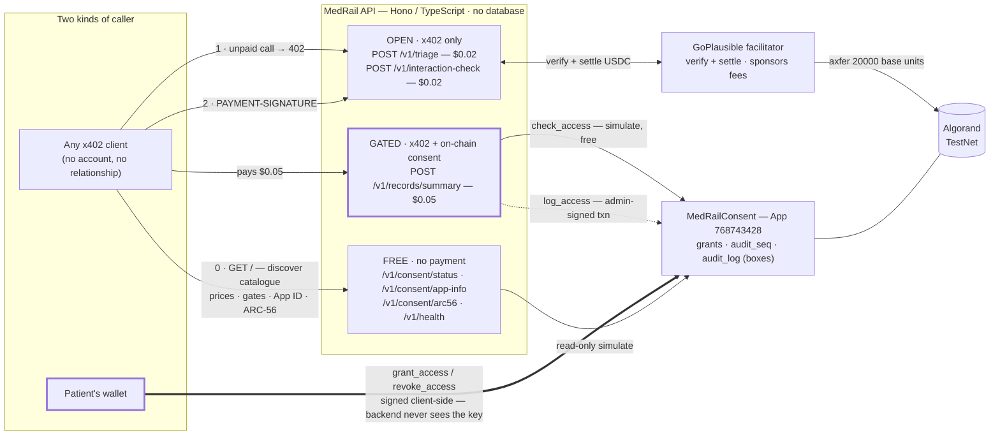

# MedRail — Pitching the Architecture

**Purpose:** how to present MedRail's technical architecture to a mixed audience of engineers and non-engineers in under three minutes — one thesis, one diagram, three evidenced claims, and the depth to hold in reserve for Q&A.

**Status of this document:** Pitch guidance, 2026-08-21. Every technical fact and transaction id below was verified against source or the public Algorand TestNet indexer. No MainNet deployment, public hosting, Bazaar listing, leaderboard presence, or third-party payment volume is claimed — all are pending. **Payments now settle between distinct accounts — the agent pays from a keypair this service does not hold — but the agent's TestNet float was seeded from the project's own wallet, so no external or unrelated party has paid for this service; earlier settlements were self-payments and are labelled as such.** Judging criteria referenced are per `docs/COMPLIANCE.md:31-33`; the official rules were not independently re-fetched during this review.

Companion documents: [`Demo_Script.md`](Demo_Script.md) (the 2- and 5-minute runs, beat by beat), [`Demo_Video_Script.md`](Demo_Video_Script.md) (the ≤3-minute submission video), [`Winning_Strategy.md`](Winning_Strategy.md), [`Judge_Evaluation.md`](Judge_Evaluation.md), [`../02_Requirements/Requirements_Gap_Analysis.md`](../02_Requirements/Requirements_Gap_Analysis.md), [`../06_Security/Threat_Model.md`](../06_Security/Threat_Model.md).

---

## 1. The one-sentence thesis

> **MedRail sells three clinical services an AI agent can discover, use and pay for per call over x402 — and the one that returns a patient's record is gated by consent the patient signed on-chain and can revoke without asking us, so the permission layer and the payment layer are the same round trip.**

Say it exactly once, at the start. Do not repeat it, do not paraphrase it later, and do not add a second sentence of clarification — the diagram is the clarification.

**Lead with the agent, always.** x402 is a machine-to-machine protocol, and an audience that hears "medical records" before it hears "agent" will spend the rest of the pitch mentally placing a human at the keyboard. The patient half is the *differentiator*; the agent half is the *frame*. In that order.

**If you have five more seconds and the room is non-technical**, add:

> "An agent working a patient case needs triage, a drug-interaction check, and the record itself. Today that's three signups and three API keys — and it still can't touch the record, because nobody can prove the patient allowed it."

**If the room is technical and you have ten seconds, don't say anything — run it.** `npx tsx api/scripts/agent-demo.ts` is a better opening than any sentence in this document.

**Two words to avoid.** *Platform* and *ecosystem*. You have one contract, three priced endpoints, and one page. Precision is the pitch.

---

## 2. The one diagram

One diagram carries the whole story. It must show: two categories of endpoint, one contract, one facilitator, no database.



### How to narrate it — 45 seconds, five gestures

1. **Point at the two boxes on the left.** *"Two kinds of caller. A stranger's agent, and a patient. They never meet."*
2. **Trace arrow zero, into the free box.** *"The agent starts by asking what we sell. `GET /` returns the catalogue — every endpoint, its price, whether it's gated, and the App ID and ABI spec of the consent contract. It doesn't need to know anything about us in advance, and it doesn't pay to find out."*
3. **Trace the top path.** *"Open endpoints. Anyone's agent pays two cents through the facilitator and gets an answer. No account, no API key, no prior relationship with us."*
4. **Trace the thick line from the patient.** *"This is the important one. The patient grants and revokes consent by signing directly against Algorand. Our backend never sees that key, never proxies it, and could not revoke on their behalf if it wanted to."*
5. **Point at the bold gated box.** *"And this endpoint requires both. You pay, and the same call reads the patient's on-chain grant. One round trip that's simultaneously 'you paid for the compute' and 'you were allowed to see this.' The agent checks the free oracle first, so it never pays to be told no."*

### The three things the diagram is designed to make obvious

- **There is no database.** Say it out loud once — *"note what's missing: there's no database anywhere in this system"* — because it looks like an omission and it is a design decision. The only durable state is Algorand box storage plus two static tables.
- **The dotted line is honest.** `log_access` is dotted because it is a *separate transaction*, not part of the payment's atomic group. That is deliberate, defensible, and covered in §4.3.
- **The thick patient line never touches the API.** That is the entire patient-ownership claim, drawn rather than asserted.

---

## 3. Three claims, and the evidence for each

Make exactly these three. Each takes about twenty seconds including its evidence.

**If there is a terminal in the room, open with the agent instead of with a claim.** `npx tsx api/scripts/agent-demo.ts` runs the whole thesis — an agent with no account reads `GET /`, learns eight endpoints and their prices, decides what the case needs, checks the **free** consent oracle before spending on the gated call, and settles $0.09 across three Algorand transactions. Sixty seconds. Everything below then lands as a confirmation of something the room already watched happen, rather than as an assertion it has to take on trust. Full detail in Q18; beat-by-beat delivery in [`Demo_Script.md`](Demo_Script.md).

### Claim 1 — "The contract is real, and you can verify it without me."

**Evidence:** App **768743428**, created at round **66088624**, `deleted: false`, admin set, 5 ALGO funded, **12 boxes live** — 6 grant boxes, 5 audit-entry boxes, and 1 per-patient sequence box — with `total_audit_entries = 5` and `total_grants_active = 4` in global state.

```bash
curl -s https://testnet-idx.algonode.cloud/v2/applications/768743428
```

**Show:** the live terminal output, or https://lora.algokit.io/testnet/application/768743428.

**Say:** *"That's the public indexer. Not our server, not our API, no key, no account. You can run that on your phone right now. And look at `total_audit_entries` — five. Every one of those is a paid, consented record access written to a patient's own log by the contract itself."*

**Why it works:** it removes you from the trust chain entirely. Most submissions ask a judge to believe a screenshot.

**If they push harder — and this is the strongest version of the claim:** the deployed approval program is byte-identical to the compilation of the TEAL committed in the repository. The algod compile hash is `W4TMZHJOL7FIN5GIGJCWNB2HVI4C4WGVRDVY6BMUUOMWRFHMBJVSPZZ33U`, 1404 base64 characters, matched exactly against what the indexer serves. *"You can verify that the code you're reading is the code that's running."* **Attach the caveat in the same breath:** that pins the deployed bytecode to the *committed artifacts*, which predate two source-level contract fixes we deliberately have not redeployed — see §5, Q17.

---

### Claim 2 — "A real payment settled, and we didn't build the parts that make it correct."

**Evidence:** transaction `OYRQRKYA7WUKBVLWTOFJSJMZFBW7VCNGP5VGH5EBUJGRCVFQFJRQ` — `axfer`, asset `10458941`, amount **20000** base units, confirmed round **66091768**, **fee 0**.

**Show:** the decoded `PAYMENT-REQUIRED` header (`Demo_Script.md` Beat 3), then the transaction on Lora.

**Say:** *"Twenty thousand base units — exactly two cents at six decimals. Our route config contains the string `$0.02` and nothing else: no asset id, no decimal conversion. The SDK asked the facilitator what USDC is on this network and produced that number. Fee zero, because the facilitator sponsors it — a caller needs USDC and no ALGO at all. We built the thing that asks correctly; the protocol did the rest."*

**Then, unprompted:** *"Sender and receiver on that particular transaction are the same address — that was our first proof run, and we paid ourselves because it needed one funded account instead of two. It's a genuine facilitator-settled payment with no special-casing, and it's labelled as a self-payment in section six of our proof log. Since then the agent pays from its own keypair to a different receiver, and the patient who allowed it is a third account again — section ten, sender ≠ receiver on the indexer, and no two roles sharing an address. What still hasn't happened is anyone unrelated paying us: we funded both those wallets, because TestNet money has no other source."*

**Why it works:** you demonstrate that you know which parts of your own system you didn't write, and you disclose your weakest fact voluntarily. Both read as competence.

---

### Claim 3 — "The patient holds the key, and revocation is real."

**Evidence:** `web/lib/consent.ts:41-60` — the patient's `grant_access`/`revoke_access` transactions are constructed and signed client-side and submitted straight to AlgoNode. There is no key-ingress path anywhere in `api/src/`. On-chain: grant `X2BQ5FD4MW52B75WQGDB67TEULYLN7FHVFO6ZOBNI74PNCAKVOUA`, revoke `OV2J2T5VWMIQG64JYGL7JEGZKKNZNKCMNIQU6AC4PDRQYZ6ZOO5A`.

**Show:** the live grant → check (`granted`) → revoke → check (`not granted`) flow, `Demo_Script.md` Beat 5.

**Say:** *"`check_access` went true to false, and that read is a simulated call — zero fee, nothing submitted. The grant transaction was signed in the browser and submitted straight to Algorand. If our backend disappeared tonight, the patient's consent state and their ability to revoke it would be completely unaffected. That's what 'the patient owns it' has to mean to be worth saying."*

**Why it works:** it converts an abstract claim into an operational one — *the system can die and the property survives*.

---

## 4. Depth to hold in reserve for Q&A

Do **not** put any of this in the three-minute pitch. Each is a complete, satisfying answer to a specific question, and each is worth more when pulled than when pushed.

### 4.1 Box-key derivation, and why boxes rather than local state

`contract.py:95-98`:
```python
def grant_key(patient: Account, requester: Account, scope: String) -> Bytes:
    return op.sha256(patient.bytes + requester.bytes + scope.bytes)
```

32 bytes, fixed length, one box per `(patient, requester, scope)` triple, stored in `BoxMap(Bytes, GrantRecord, key_prefix="g")`.

**Why boxes:** Algorand local state would require every requester — including a stranger's read-only agent — to **opt in** to the application before it could hold a grant. For a pay-per-call endpoint that is absurd; it converts a one-round-trip call into a two-transaction onboarding. Boxes let any triple exist without either party opting in to anything except the box's minimum balance, which the app account funds itself via `fund_mbr`.

**Why sha256 rather than concatenation:** box keys are length-limited and the scope is a free-form string. Hashing gives a fixed 32-byte key for an unbounded input, so scope length never constrains the design.

**The cost of that design, and how it is now controlled:** the derivation is implemented three times — Python (`contract.py:96-98`), Node (`api/src/services/algorand.ts:64-70`), and WebCrypto in the browser (`web/lib/consent.ts:25-33`). If any one drifts, a grant written by the browser becomes silently unreadable by the backend: no error, just `false`. That class of failure is the reason `api/test/fixtures/box-key-vectors.json` exists — a shared golden-vector fixture asserted by `api/test/boxKeyParity.spec.ts` (covering both the Node `createHash` and browser `crypto.subtle` paths) **and** by `contracts/tests/test_box_keys.py`. Three languages, one set of expected bytes, checked on every run. `NFR-011` **VALIDATED**.

**Why to raise this unprompted:** it shows you identified a silent-failure mode in your own design and closed it with the only mechanism that actually works across a language boundary. "We wrote it three times and tested that they agree" is a much better sentence than "we wrote it three times."

**One more detail worth having:** `scope` is a free-form string, not an enum (`DATA-003`). Adding a fourth endpoint with a new scope requires zero contract changes and zero redeployment.

### 4.2 Why `log_access` is admin-gated

`contract.py:222` — `assert Txn.sender == self.admin.value, "only admin"`.

**The reasoning:** the audit log records that someone *paid and was authorised*. Only the party that observed the settlement can attest to that, and that is the backend. If `log_access` were open, anyone could write arbitrary entries into any patient's trail — which is worse than no audit trail, because an on-chain record carries an implicit claim of trustworthiness.

**The honest limitation, and you must give it:** this makes the operator key a single point of forgery. `OPERATOR_MNEMONIC` sits in an environment variable, is simultaneously the contract `admin`, and that one key can write arbitrary audit entries, rotate `set_admin` to lock out the real owner, and drain the app account via `withdraw_excess`. No multisig, no HSM, no rotation runbook (`SEC-012`, **NOT IMPLEMENTED**). The correct fix is a multisig admin so no single key can write the log. What the chain *does* guarantee today is narrower and true: entries are append-only and cannot be quietly edited afterwards. Make the smaller claim.

**The tested part:** `test_consent.py::test_log_access_rejects_non_admin` and `test_withdraw_excess_admin_only` both pass. The gate itself is validated; the key custody is not.

### 4.3 Why the audit write is not in the payment's atomic group

This is the strongest piece of reasoning in the repository (`docs/ARCHITECTURE.md:102-115`). Have it ready verbatim.

The Algorand `exact` scheme permits up to **16 transactions** in a client's signed payment group. Bundling a `log_access` app-call alongside the payment was therefore *available*, and would have given true ledger-level atomicity.

**It was rejected**, because a generic x402 client — `@x402/fetch`, or any other team's agent — only knows how to construct the transaction described in `paymentRequirements`. Requiring callers to additionally know MedRail's App ID and ABI method signature would make the endpoint uncallable by any off-the-shelf client, which directly destroys the open-endpoint volume strategy that is the whole point of the architecture.

**So:** the facilitator settles through the normal flow, and the backend's operator account — already registered as `admin` — submits `log_access` immediately afterwards. Two real transactions, moments apart, not atomic at the ledger level. The stated mitigation is that `log_access` is admin-gated and only ever called server-side after a facilitator-confirmed settlement.

**The residual risk, and the part most people get wrong about it:** if that second transaction fails, the payment has already settled — so the obvious worry is *"the caller paid and got nothing."* **That cannot happen, and the reason is structural rather than something we wrote.** `@x402/hono` calls `processSettlement` **only** when the handler returns a status below 400; any throw or any 4xx/5xx cancels settlement and returns first. So an error response never consumes money. `REL-002` is **VALIDATED, satisfied by the SDK** — credit it to x402 v2 rather than to us.

What was genuinely at risk was the *sale*: an unguarded audit-write failure turned a legitimate, paid, authorised request into a 500. `api/src/routes/records.ts:76-100` now wraps `logAccess` in `try/catch` and returns **200 with the record**, plus `auditStatus: "pending"`, a null `auditTxId`, and a structured `audit_write_failed` event logged server-side.

**Say it like this:** *"You can't be charged for a failure — settlement only happens on a sub-400 response, so an error cancels the payment before the money moves. What we had to fix was the other side: a chain hiccup shouldn't cost you a record you were entitled to. So you get the record, plus an explicit flag telling you the ledger write is outstanding."*

**Why this answer lands:** you identify a tempting design, reject it for a stated reason, own the cost, and then demonstrate that you went and read the SDK's settlement path rather than assuming the worst about your own system. Knowing precisely *which* risk is real and which is imaginary is the shape of an answer that ends a line of questioning.

### 4.4 MBR economics

Algorand box minimum balance is `2500 + 400 × (len(key) + len(value))` µALGO, locked in the **app account** for as long as the box exists.

A grant box: 33-byte effective key (`"g"` prefix + 32-byte digest) + 17-byte `GrantRecord` (1 + 8 + 8, ARC-4 encoded) = **22,500 µALGO**, about 2.25 cents of ALGO per consent grant, refundable when the box is deleted.

**Verified against the live ledger:** app account `CCO26Y6Z56DDZ3OELO2UKJMIPJVSIT52I23F2MPMR52JBM3HQZZNUZNOR4` reports `min-balance = 550,400` across `total-boxes = 12` (6 grant, 5 audit, 1 sequence). The grant-box arithmetic was confirmed when there were exactly two of them: 145,000 − 100,000 (base account MBR) = 45,000 = 2 × 22,500. Exactly.

**And here is the defect you should volunteer.** The deployed contract computes `GRANT_BOX_MBR = 2_500 + 400 * (32 + 17)` = **22,100** — omitting the 1-byte `"g"` key prefix. The `get_grant_box_mbr()` ABI method, advertised in its own docstring as *"a compile-time constant the backend can quote when sizing `fund_mbr` calls"*, therefore returns a figure **400 µALGO per box too low**, under-funding top-ups by 1.8%. Finding C-2. **It is fixed in source** — `contract.py` now reads `2_500 + 400 * (33 + 17)` = 22,500, with a regression test that was verified to fail against the old value — **and deliberately not redeployed.**

**Say it like this:** *"We found that by checking our own advertised constant against the deployed app's actual minimum balance — the ledger disagreed with our own docstring by four hundred microalgos a box. It's fixed in source with a regression test we ran against the old code first, and we haven't redeployed, because our deploy path mints a new App ID and would destroy every transaction id in our evidence log. A four-hundred-microalgo error is worth less than the deployment history."*

That answer demonstrates three things at once: you audit your own arithmetic against the ledger, you understand what redeployment costs, and you make trade-offs deliberately rather than by omission.

**Audit boxes**, for completeness: the contract deliberately does *not* hard-code their MBR (`contract.py:53-55`), because `AuditEntry` contains variable-length ARC-4 strings. That is correct, not an oversight.

### 4.5 Why `check_access` costs nothing

`check_access` and `get_audit_count` are `readonly=True` ABI methods executed via `AtomicTransactionComposer.simulate()` (`api/src/services/algorand.ts:80-100`). No fee, nothing submitted, no state change. A consent check is a free read that anyone can perform against the public contract without an account.

**Measured latency:** a cold `GET /v1/consent/status` took **505 ms** — two sequential algod round-trips (`getTransactionParams` then `simulate`). That is a single observation on a laptop, not a benchmark. **Do not quote a percentile**; there is no load test in this repository (`PERF-003`, **NOT IMPLEMENTED**) and a methodology question is one you would lose.

**One non-obvious wrinkle, if someone reads the code:** the *free, unauthenticated* `/v1/consent/status` endpoint has a hard dependency on `OPERATOR_MNEMONIC` being loaded, because `simulate()` still needs a sender and a signer even though nothing is submitted (`algorand.ts:8-14`). It is not a security flaw — no signature is broadcast — but it is a coupling that surprises people, and knowing it is a good look.

**And the abuse question it raises, answered:** free plus unauthenticated plus two algod round-trips per request is an amplification vector at someone else's public infrastructure. `api/src/rateLimit.ts` caps it at 60 requests per minute per client, with `/v1/consent/arc56` and `/v1/records/summary` at 30, returning 429 with a `Retry-After`. The priced happy paths are deliberately *not* throttled — a caller must settle USDC for each one, so they are economically self-limiting. Be precise about what that control is: fixed-window, in-process, keyed on `X-Forwarded-For`. It is a courtesy guard against accidental hammering, **not a security boundary**, and the code says exactly that in its own header comment.

---

## 5. Q&A bank

Twenty questions with honest, strong answers. Every answer here is true as of 2026-08-21. Three of them (Q3, Q5, Q10) used to be confessions and are now demonstrations — those are the ones to rehearse, because the delivery for a good answer is different from the delivery for a bad one. **Q17 is the sharpest question a well-prepared judge can ask. Q18, Q19 and Q20 are the machine-to-machine set, and Q18 is the one the organisers' own framing puts in a judge's mouth — rehearse it first, and answer it by running something rather than by talking.**

---

**Q1. "Isn't this just a paywall?"**

A paywall sits in front of something that also works without it. Remove x402 from MedRail and there is no rate limiting, no metering, and no monetisation — the paid call *is* the unit of the product. And for the gated endpoint the payment and the authorisation are the same round trip: you pay for the compute, and that same call proves you were allowed to see the result. That composition is the thing we think is new.

---

**Q2. "Why does this need a blockchain?"**

Because the patient has to be able to revoke access *without asking the party holding the data*, and a third party has to be able to verify a grant without trusting us. Put the consent table in our Postgres and "the patient owns their data" is a marketing claim about our own database — we could edit it, and you would never know. On-chain, `check_access` is a free simulated read anyone can run against App 768743428, and the patient signs grants with their own key. If our backend disappeared tonight, their consent state and their ability to revoke would be entirely unaffected.

---

**Q3. "How do you know the caller is who they say they are?"** ★ *the one that flipped*

**The payment is the authentication.** The `PAYMENT-SIGNATURE` header carries a signed Algorand transaction, which already contains a cryptographically proven sender. So `api/src/x402Payer.ts` decodes the verified header, reads the AVM `exact` payload — `{paymentGroup, paymentIndex}` — and recovers the address that actually signed the payment. `api/src/routes/records.ts:41-51` then returns **403** unless that address equals the asserted `requesterAddress`, *before* the consent check and before anything touches the ledger:

```json
{"error":"requesterAddress must match the address that signed the payment",
 "requesterAddress":"NHUPYHPA…","payer":"2WDV2J2F…"}
```

No API keys, no bearer tokens, no session store, nothing to rotate. The identity was already in the envelope; we just started using it as one.

**Then offer to prove it**, because this is the best fifteen seconds available to you: *"Let me show you."* `api/scripts/verify-g01-fix.ts` runs the exact attack against the live TestNet deployment — the patient grants a **third party** consent on-chain, the attacker pays with their own key while claiming the third party's address, and the call is refused; then a control call with a matching identity returns the record and its audit transaction id. Six unit tests in `api/test/x402Payer.spec.ts`; the run is recorded in `contracts/artifacts/g01-verification.json` with `"blocked": true`.

**Why this matters, said in one sentence:** grants are public on the ledger — `grant_access` has the patient as sender and the requester as argument zero — so valid pairs are enumerable from our own transaction history. Without this binding, anyone who paid five cents could read as any authorised requester, **and that fabricated identity would be written into the patient's immutable audit trail**, which is trusted precisely because it is on-chain. Paying is not being.

**The caveat to volunteer if pressed:** this binds the requester to the payer, which is the right control for this endpoint. It does not, and cannot, prove that the human behind that key is the clinician the patient had in mind. On-chain identity is pseudonymous — the patient chose an address, and MedRail enforces that the address is the one that showed up.

---

**Q4. "Where's the AI?"**

There isn't one, deliberately. Two deterministic rule engines: eleven weighted red-flag phrases and a fourteen-row interaction table. Both pure functions, both unit-tested, both carrying a non-diagnostic disclaimer that a unit test enforces as a correctness property, not a legal footer.

That's a design position. An opaque model in a clinical triage path is a liability you cannot audit; this one you can read in ninety seconds and check line by line.

And I'll give you the cost before you find it: type *"I have no chest pain"* and it scores thirty-five — urgent. Substring matching has no notion of negation. It's a screening trigger rather than a diagnosis, which is exactly why the disclaimer is there, and leading-negator detection is scoped on our list. The engines sit behind a route boundary, so swapping in a model later doesn't touch the payment or consent layers.

---

**Q5. "What happens when the facilitator goes down?"**

Every priced route returns **503 with `Retry-After: 30`** and a stable code, `PAYMENT_FACILITATOR_UNAVAILABLE`, with `retryable: true` in the body. Free routes stay up, so the blast radius is the three priced endpoints — we reproduced that.

The underlying dependency is structural and we cannot remove it: the asset id and the fee-payer address come from the facilitator's `/supported` endpoint, not our config, so a valid 402 genuinely cannot be constructed offline. What we control is the answer we give. `api/src/app.ts:69-105` catches exactly that initialisation failure and converts it, re-throwing every other error untouched.

**The reason that distinction is worth thirty seconds:** our callers are agents, not humans with a refresh button. An agent that reads `retryable: true` and a `Retry-After` comes back in thirty seconds. An agent that reads an opaque 500 marks the endpoint dead and may never call again. Formerly finding R-1 in our own gap analysis; closed. One honest note: it still means our CI depends on a third party being reachable, because `api/test/x402-flow.spec.ts` calls the live facilitator at module import.

---

**Q6. "How does this scale?"**

Honestly: it doesn't yet, and I can tell you exactly where it stops. Audit writes serialise through an in-process per-patient promise chain, so a second backend instance sharing the same operator account would reintroduce the read-then-write race that lock exists to prevent. So we pinned the deployment to one machine on purpose — `max_machines_running = 1` in `fly.toml`, with the reason written into the file. That's a correctness-preserving cap, not a scaling story, and I won't dress it up as one.

Rate limiting exists on the free and refundable surface — 60 a minute on `/v1/consent/status`, 30 on the others — because that endpoint is free, unauthenticated, and makes two algod calls per request, so it amplifies traffic at AlgoNode as well as exhausting us. It's in-process and keyed on a spoofable header: a courtesy guard, not a security boundary.

And the thing I'd want you to hold against us: **we have no performance data at all.** No latency percentile, no throughput number, no load test. Anything I could quote would be a laptop, and you'd be right to discount it.

The real fix is a durable sequence source rather than an in-process lock. What *does* scale today is the read path: consent checks are simulated, zero-fee, stateless, and hold no server-side session at all.

---

**Q7. "What stops the admin forging audit entries?"**

Nothing, and that's the honest limitation. `log_access` is admin-only, the operator mnemonic lives in an environment variable, and that same key can rotate the admin and drain the app account. Right fix is a multisig admin so no single key can write the log, plus hardware-backed custody.

What the chain guarantees today is narrower: entries are append-only and can't be quietly edited afterwards. That's a smaller claim than "trustworthy audit trail," and it's the one that's actually true. We documented it as a known limitation rather than pretending it was solved.

---

**Q8. "Has anyone other than you ever paid for this?"**

No — and there are two halves to that, so let me give you both.

**The half that's better than you're expecting:** the payments aren't self-payments any more. The agent runs on its own keypair, `UYBTLPHS…`, which this service doesn't hold; it opted itself in to USDC; the patient is a third account again, `56LFG5EE…`, which granted *that specific address* consent in a transaction it signed itself and which is neither the payer nor the payee; and the indexer will show you sender ≠ receiver on all three settlements — `DOSKCNKJ…`, `PLBFDDAD…`, `COMJ3TQO…`. Three roles, three accounts, three keypairs, all independently checkable. Our earlier settlements, including `OYRQRKYA…`, were straight self-payments and they're labelled that way in our proof log.

**The half that isn't: I funded both of those wallets.** Their TestNet balances came from our own account, because TestNet ALGO and USDC have no other practical source. So **no external or unrelated party has paid for this service**, and none of this may be described as payment volume. What we've proven is the mechanism between distinct accounts. Not demand.

The reason there's no external volume is that there's no public URL — the endpoint runs on my laptop, so there's nowhere for anyone else's agent to discover it. That's a deployment gap, not a design gap, and it's the next thing we do.

**This is still the weakest answer in the bank, and it is the one to be shortest about.** Do not pad it and do not oversell the sender ≠ receiver half — it removes an objection, it does not add a claim. State both halves, name the cause, move on.

---

**Q9. "What's the business model at two cents a call?"**

Not the triage endpoint. Eleven keyword rules aren't worth two cents and I won't argue they are — the price exists to make the metering real and to make the endpoint callable by a stranger's agent with no account.

The asset is the consent registry: a neutral, patient-signed, publicly-queryable permission substrate that a health system could point at without trusting us. That's infrastructure you monetise by being the registry of record — integration and assurance — not by charging per lookup. What we've built is the smallest honest proof that the substrate works, and I'd rather show you that than a revenue slide.

---

**Q10. "Show me an audit entry on-chain."**

Transaction `4YLKLQKKWXXFW3UT5APJVYKXI7T7A6OACTAWCC5YBAN3XGOGHRVQ`, sequence 1 — and `total_audit_entries` on App 768743428 reads **five**, with five `a`-prefixed audit boxes to match. Check it on any indexer; you don't need us.

**Then show the whole thing rather than the artefact.** `api/scripts/e2e-consent-proof.ts` runs grant → free consent check → paid call → on-chain audit append in one pass and prints four clickable Lora links: the grant, the settled payment, the audit write, and the application. It is repeatable, not a recording — the counter goes up while you watch.

**What the entry actually contains, if asked:** the patient, the requester, the scope, the endpoint, an action string, and a per-patient monotonic sequence number. **No clinical content ever goes on-chain** — nothing written to the ledger can be retracted, so nothing that could identify a condition is written to it.

---

**Q11. "Why is the audit write not atomic with the payment?"**

See §4.3 — deliver it in full. Short form: it could be, and we chose compatibility over atomicity, because bundling would make us uncallable by any off-the-shelf x402 client — including the agent I just showed you, which knows nothing about our App ID or our ABI. Two transactions moments apart, admin-gated, submitted only after the facilitator confirms.

And the residual risk is smaller than it looks, for a structural reason rather than one we wrote: **you can't be charged for a failure.** `@x402/hono` settles only on a sub-400 response, so any error cancels the payment before the money moves (`REL-002`, validated, and credit belongs to x402 v2 rather than to us). What we did have to fix was the other side — a chain hiccup shouldn't cost you a record you were entitled to — so `records.ts:76-100` wraps the audit write in `try/catch` and returns **200 with the record**, `auditStatus: "pending"`, and a structured `audit_write_failed` event logged server-side.

---

**Q12. "You have seventy-three tests — what do they actually cover?"**

Twenty-eight contract tests in the official AVM simulator, including the negative paths that matter: non-admin `log_access` rejection, non-admin `withdraw_excess` rejection, revoking a grant that doesn't exist, expiry, re-grant reactivation, per-patient sequence isolation. Forty-five API tests — thirteen on the two rule engines, five asserting the real 402 shape against the live facilitator, six on payer recovery from a payment signature, seven asserting the advertised route list equals the mounted set, and fourteen on cross-language box-key parity.

Two things worth more than the count. **Three of the contract tests were run against the pre-fix code first, to confirm they go red** — a regression test that has never failed hasn't been shown to test anything. And the box-key tests read one shared golden-vector fixture, `api/test/fixtures/box-key-vectors.json`, from *both* toolchains, which is the only honest way to test three independent implementations of one hash.

And I'll give you the gap: `services/algorand.ts` still has no dedicated unit-test file — the lock and both on-chain call paths are only exercised by end-to-end scripts that need funded keys and don't run in CI — and there's no frontend test of any kind. There's one worse than that: our interaction-checker test calls `checkInteractions(["a","b"])`, which returns five spurious severe matches, and asserts only that the disclaimer is present. So the suite executes that defect on every run and structurally cannot see it.

---

**Q13. "Is this production ready?"**

No, and I'd distrust anyone who said yes about a build this age. It's demo ready: every claim on the critical path has a transaction id you can check without me in the room.

Beta ready means publicly reachable, authenticated where it matters, degrades gracefully, covered on the risky modules, and doesn't lose money on a failure path. Four of those five now hold — the gate authenticates and we can show it refuse a live attack, a facilitator outage returns 503 with `Retry-After` instead of an opaque 500, and no error path can consume a settled payment. **What's missing is the first word: publicly reachable.** No public URL, no observability, and no performance measurement of any kind.

I can hand you the list. It's written down, with reproduction commands, in our own gap analysis.

---

**Q14. "Why Algorand rather than another chain?"**

Three concrete reasons, not preference. Box storage gives per-key state without forcing every requester to opt in to the application, which an account-model chain with per-account state would have made unworkable for a stranger's agent. Instant finality means `check_access` reflects a revocation in the next round — for a consent system, probabilistic finality is a genuine correctness problem, not a latency inconvenience. And the facilitator sponsors fees, so a caller needs USDC and zero ALGO, which is what makes a two-cent endpoint callable by an agent that has never heard of us.

---

**Q15. "What's this Sentinel Exchange document in your docs folder?"**

A design proposal for a different product built on the same substrate. It has never been built — the first line of the file says so and enumerates what's absent — and it lives under `docs/future/` for exactly that reason. It isn't part of this submission.

---

**Q16. "What would you do with another week?"**

Get the API onto a public URL — every usage claim depends on it, and until it exists nobody else's agent can even *discover* us, which is the whole pitch. Then re-run all four proof scripts against that URL so every claim in the repo points at something a stranger can reach. Then get one unrelated wallet to run `agent-demo.ts` against it, so the ledger has a payment where the sender isn't the receiver. Then minimal observability — a metric and an alert on the audit-write failure path — and unit tests on `services/algorand.ts`.

Notice what isn't on that list: no new endpoints, no MainNet, no model. We know what's weak, and it isn't feature count.

---

**Q17. "Your contract fixes aren't on the deployed contract, are they?"** ★ *the sharpest question available to a prepared judge — raise it before they do*

No — deliberately, and here's the whole trade. We found two defects in the contract: `request_access` emits its ARC-28 event with `patient` and `requester` swapped, and `GRANT_BOX_MBR` under-reports true box minimum balance by 400 µALGO per box because it omits the one-byte `"g"` key prefix. Both are fixed in `contract.py`. Both are covered by regression tests we ran against the *old* code first, to confirm they go red. Neither is exploitable — one is an event field order, the other is an arithmetic constant our own advertised `get_grant_box_mbr()` quotes.

And App `768743428` is still running the pre-fix bytecode, because `deploy_testnet.py` uses `OnUpdate.AppendApp`, which mints a **new** application. Redeploying doesn't upgrade that app — it abandons it, along with the consent lifecycle, the settled payments and the five audit entries that are the best evidence in this submission. A four-hundred-microalgo error is worth less than the deployment history. When we deploy to MainNet, the fixed source is what ships.

**Why you must say this first.** Our own proof log pins the deployed bytecode to the *committed artifacts*, which predate those fixes — so a judge following our source-to-chain verification gets there on their own. If they find it, "fixed" reads as a claim rather than a change, and they re-examine every other "fixed" in the submission. If you raise it, it is the clearest demonstration in the entry that you reason about consequences rather than checkboxes.

---

**Q18. "x402 is machine-to-machine. Isn't this human-to-machine?"** ★ *do not answer this — run it*

The right response is nine words and a keypress: *"Fair question. Let me show you an agent do it."*

```bash
cd api && npx tsx scripts/agent-demo.ts
```

A clinical triage agent with no MedRail account, no API key and no prior relationship. It reads `GET /` and learns the catalogue — eight endpoints, the price of each, which are gated, the App ID of the consent contract, and the ARC-56 spec URL it would need to build its own ABI client. **Nothing about MedRail is hardcoded in it except the base URL.** Then it decides what the case needs: $0.02 for triage (`EMERGENCY`, score 70), $0.02 for the interaction check (`MAJOR: warfarin + aspirin` — anticoagulant plus antiplatelet, which changes how you manage a suspected cardiac event), and for the record, which is gated, **it checks the free consent oracle before it spends anything.** Granted — so it pays $0.05 and gets the record with `consentVerifiedOnChain: true` and an audit entry written to the patient's trail. $0.09, three settled Algorand transactions, no human in the loop.

**The beat to land on is the free oracle.** *"It refused to spend money to be told no."* Revoke the grant and re-run it and the agent declines the gated call, spends nothing, and reports what it has. That is a service priced for a machine buyer: we give away the permission check precisely so a paying agent can avoid a doomed spend. A service optimising for revenue would charge for the denial.

**If they push on whether it's really autonomous** — and a good judge should — open the file. The only MedRail-specific constant is `API_BASE`; every path, every price and the App ID come out of the discovery response, and the amount it pays is read from the returned catalogue rather than typed in. It is ~270 lines and readable in five minutes.

**The honest caveat, and give it in the same breath as the consent check passing:** the run spans three separate accounts — the agent's own keypair, which we don't hold, paying a different receiver, against a grant signed by a patient account (`56LFG5EE…`) that is neither of those — but **we funded two of them.** Their TestNet balances came from our own wallet, because TestNet money has no other practical source, so no external or unrelated party has paid for this service. Say the strong half first and the funding second, in one breath. See Q8.

---

**Q19. "How would a real agent actually discover you?"**

Two endpoints, both free, both already built for exactly this.

**`GET /`** is a machine-readable service index: every endpoint with its method, path, **price**, and **gate** (`x402`, or `x402 + on-chain consent`), plus the consent contract's App ID, the network, and the URL of its ARC-56 spec. That is enough for an agent to decide what a task costs before committing to it, and enough to know which calls will fail without a permission it doesn't have. `api/test/app.spec.ts` asserts that this list equals the actually-mounted route set, so the catalogue cannot drift from reality — an integrator's first fetch is this document, and a stale one is worse than none.

**`GET /v1/consent/arc56`** serves the contract's ARC-56 spec over HTTP. An agent that wants to check consent itself — rather than trusting our oracle — can build an ABI client against App `768743428` straight from that spec, without cloning our repository and without asking us for anything. That is the difference between an API you integrate with and an API you can be independent of.

Beyond our own surface: the endpoints speak plain x402 v2 with the `exact` scheme, so any off-the-shelf client (`@x402/fetch`, or another team's agent) can pay them with no MedRail-specific code at all. That compatibility is a defended design constraint, not an accident — see §4.3 for why we rejected bundling the audit write into the client's signed payment group.

**And the gap, stated plainly:** none of this is on the public internet yet, so today the only agent that can discover us is one you point at `localhost`. There's no Bazaar listing for the same reason — and I want to be exact about which half is missing. The discovery *extension* is wired: `api/src/x402.ts` registers `bazaarResourceServerExtension`, every priced route declares its real input shape and an output example, and the live 402 carries an `extensions.bazaar` block plus the `x402-global-challenge` tag. But x402 has no registration call — a facilitator catalogues a resource by reading that declaration off a payment it verifies, and the record is keyed on the resource URL. Ours says `localhost`, so we are implemented and not listed, and I'd rather say it that way than let you find the difference yourself.

---

**Q20. "Why does an *agent* need a blockchain for this? Couldn't you just check permissions in a database?"**

Q2 answers this for the patient. The agent's answer is different and sharper, and it comes down to two words: **revocation** and **proof.**

**Revocation, from the patient's side.** The patient has to be able to withdraw access *without asking the party holding the data*. If consent lives in our Postgres, "the patient owns their data" is a marketing claim about a table we control — we could edit it, and neither the patient nor the agent would ever know. On-chain, the patient signs `revoke_access` with their own key and submits it straight to Algorand; our backend never sees that key and couldn't undo it. Instant finality matters here specifically: `check_access` reflects a revocation in the very next round. For a consent system, probabilistic finality is a correctness problem, not a latency inconvenience — "probably revoked" is not a state you want a clinical record to be in.

**Proof, from the agent's side, and this is the part a database genuinely cannot do.** An autonomous agent acting on a patient's record needs to demonstrate *afterwards* that it was allowed to. If the permission lived in our database, the agent's evidence would be a 200 from a vendor — which is a claim about us, verifiable only by asking us, at a moment when we are the party with the strongest incentive to be believed. On-chain, three separate things are independently checkable by anyone, forever, without our cooperation: the patient's signed grant, the settled payment that authenticated the requester, and the audit entry the access produced. The agent doesn't have to trust us and neither does an auditor.

**Then close it in one sentence:** *"An agent that can't prove it was allowed is an agent nobody can safely deploy against real records — and a permission it has to ask us to confirm isn't proof, it's a reference."*

**The caveat to volunteer if pressed:** what the chain guarantees is that entries are append-only and cannot be quietly edited. It does not make the audit trail unforgeable at the point of writing — `log_access` is admin-gated and that admin is a single hot key (§4.2). That's a smaller claim than "trustworthy audit trail", and it's the one that's true.

---

## 6. Three delivery rules

**1. Volunteer your worst fact before you're asked.** **That we funded the agent's wallet ourselves**, the earlier self-payments, the pre-fix bytecode on the deployed app, the negation defect, the absence of any model. Every one of them is findable in under two minutes by a competent judge. Disclosed, each costs one point and buys credibility for everything else; discovered, each costs five and makes every other claim suspect. The funding one is the newest and the most urgent, because it sits directly behind the strongest beat in the demo: say it at the moment the consent check passes, paired with the sender ≠ receiver fact that precedes it, not in the Q&A afterwards. This submission's single greatest asset is that its claims survive checking — protect that above any individual feature.

**2. Never say "I'll come back to that."** Answer the hard question when it lands, in one breath, then return to your thread. Deferral reads as evasion even when it isn't, and you will not come back to it.

**3. Give a file path or a transaction id with every technical claim.** *"It's in `records.ts` line forty-nine"* is worth more than three sentences of description, and it invites the judge to check rather than to doubt. Your documentation set is built on exactly that principle — speak the way it reads.
