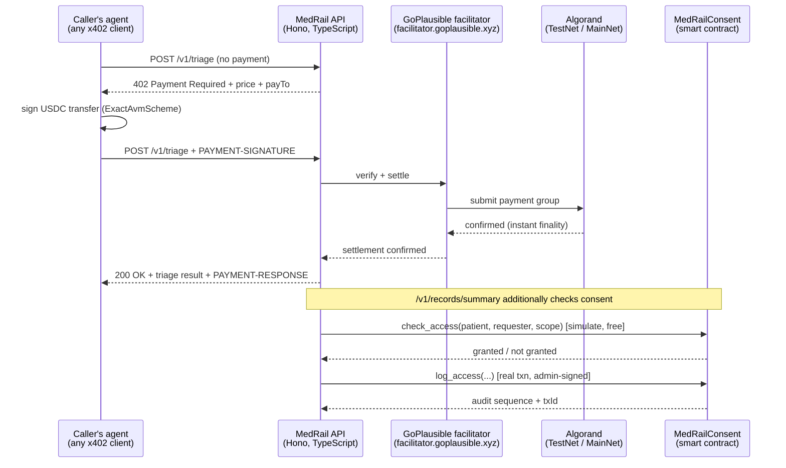

# MedRail — Architecture

## System overview



## Two endpoint categories, one reason

The Global x402 Challenge's leaderboard scores real, sustained payment volume. A consent-gated
"only the patient's own doctor can call this" endpoint cannot generate that volume by
construction — one patient, one doctor, a handful of calls a year. So MedRail deliberately
splits into two categories that share one on-chain trust layer:

| | `/v1/triage`, `/v1/interaction-check` | `/v1/records/summary` |
|---|---|---|
| Gate | x402 payment only | x402 payment **and** on-chain consent |
| Caller | anyone's agent, no prior relationship | a requester the patient has explicitly granted |
| Purpose | broad, repeatable leaderboard volume | the patient-ownership proof |
| State touched | none (stateless compute) | `MedRailConsent.check_access` + `log_access` |

Both categories are wired to the same audit log, so the open endpoints could leave a verifiable
on-chain trail if they ever touched a specific patient's data — they currently don't, being pure
compute, but the plumbing is shared and ready for `/v1/health-score` or similar in a v2.

> **Verification note (2026-08-21 review).** The audit log has **not yet been written on TestNet by
> any endpoint.** The deployed contract reports `total_audit_entries = 5` and holds no audit boxes,
> so `log_access` — including the `/v1/records/summary` path that does call it — is proven only in
> the AVM simulator (14/14 unit tests), not on live infrastructure. See
> [`ENGINEERING_GAP_REPORT.md`](ENGINEERING_GAP_REPORT.md) finding **G-02**. Closing this needs one
> successful paid call against a self-granted consent.

## Repository layout

```
MedRail/
  contracts/          Algorand Python smart contract (algopy / puya), tests, deploy scripts
    smart_contracts/consent/contract.py   MedRailConsent — the only on-chain program
    tests/test_consent.py                 14 unit tests, AVM-simulated, no network
    scripts/deploy_testnet.py             real TestNet deployment via algokit-utils
    scripts/exercise_contract.py          live request/grant/check/revoke proof script
    artifacts/                            compiled TEAL + ARC-56 spec (generated, committed)
  api/                 Hono/TypeScript x402 resource server
    src/app.ts                            route + payment-middleware wiring (testable in isolation)
    src/x402.ts                           facilitator + ExactAvmScheme registration
    src/services/algorand.ts              ABI calls into the deployed contract (algosdk, ATC)
    src/services/triageScorer.ts          open endpoint #1 — pure function, fully unit-tested
    src/services/interactionChecker.ts    open endpoint #2 — pure function, fully unit-tested
    src/routes/records.ts                 the consent-gated endpoint
    test/                                 18 tests: pure-logic + live-facilitator 402 shape
  web/                 Next.js judge-facing demo frontend
    lib/x402Client.ts                     browser-side ExactAvmScheme client, real payment signing
    lib/demoWallet.ts                     session-only TestNet keypair for one-click trying
    lib/consent.ts                        direct wallet-to-Algorand grant/revoke (no backend proxy)
  docs/                this document and its siblings
```

## The consent contract

`MedRailConsent` (`contracts/smart_contracts/consent/contract.py`) is deliberately one small
contract rather than several, because the thing worth proving on-chain is small: *did this
patient currently grant this requester this scope, and is there an immutable log of who asked.*

**State**

- `admin` (global) — the MedRail backend's operator address; the only account that may call
  `log_access` or `withdraw_excess`.
- `grants` — `BoxMap(Bytes, GrantRecord)`, keyed by `sha256(patient ‖ requester ‖ scope)`. Box
  storage rather than local state deliberately: local state would require every requester —
  including a stranger's read-only AI agent — to opt in to this app, which makes no sense for a
  pay-per-call endpoint.
- `audit_seq` / `audit_log` — `BoxMap`s implementing a per-patient append-only sequence, written
  only by `log_access`.

**Methods** (full ABI in `contracts/artifacts/MedRailConsent.arc56.json`): `create`, `set_admin`,
`fund_mbr`, `request_access`, `grant_access`, `revoke_access`, `check_access` (readonly),
`get_grant` (readonly), `log_access`, `get_audit_count` (readonly), `get_audit_entry` (readonly),
`get_grant_box_mbr` (readonly), `withdraw_excess`.

**Why `log_access` is a follow-up call, not part of the payment's atomic group.** The Algorand
`exact` x402 scheme technically allows up to 16 transactions in a client's signed payment group,
so it is *possible* to ask a client to bundle a consent app-call alongside their payment. MedRail
does not do this: generic x402 clients (`@x402/fetch`, or any other team's agent) only know how
to construct the payment transaction described in `paymentRequirements` — asking them to also
know our app ID and method signature would make the endpoint incompatible with off-the-shelf
callers, directly undermining the "cheap and frequent" leaderboard strategy. Instead, the
facilitator verifies and settles the payment through the normal flow, and the backend's own
operator account — already registered as `admin` — submits `log_access` immediately after
settlement confirms. This is not fully atomic at the raw ledger level (two transactions, moments
apart, both real); the mitigation is that `log_access` is admin-gated and only ever called
server-side right after a facilitator-confirmed settlement. Full atomicity is the natural
upgrade once MedRail controls both ends of a call, e.g. a future Orchestrator agent — see
`docs/COMPLIANCE.md` for how that maps to the challenge's Orchestrator entry type.

## x402 integration specifics

Verified live against the real facilitator and the real npm/PyPI registries — see
`docs/IMPLEMENTATION_PLAN.md` §1 for the full fact table with sources. The short version:

- Facilitator: `https://facilitator.goplausible.xyz` (GoPlausible, Algorand Foundation's
  chosen AVM facilitator for this challenge). Confirmed live, supports both Algorand networks,
  sponsors network fees (a `feePayer` address settles gas so callers need only hold USDC, not
  ALGO — lowering the barrier for other builders' agents to call MedRail).
- Protocol: x402 v2, scheme `exact`. Request header `PAYMENT-SIGNATURE`, response header
  `PAYMENT-RESPONSE`, 402 body/header `PAYMENT-REQUIRED` (v1's `X-PAYMENT` is legacy and not
  what this facilitator speaks as its current default).
- Packages: `@x402/core`, `@x402/avm`, `@x402/hono`, `@x402/extensions` (TypeScript, all
  `2.21.0`), `x402-avm` (Python, unused here — the backend is TypeScript, but the same package
  family backs the reference examples this implementation was checked against).
- Pricing: `$0.02` for the two open endpoints, `$0.05` for the consent-gated one, expressed as
  plain USD strings — the SDK's default money parser resolves this to the network's canonical
  USDC ASA (`10458941` TestNet / `31566704` MainNet) and correct base units automatically; no
  asset ID is hardcoded in the route config.

## Frontend's role

The web app never holds a production signing key. Two distinct paths:

1. **Try-it-now path** (what's built): a TestNet-only keypair generated in the browser
   (`lib/demoWallet.ts`), held in `sessionStorage`, implementing the SDK's `ClientAvmSigner`
   interface directly (`{address, signTransactions}`) — this is the same interface real wallet
   libraries like `@txnlab/use-wallet` implement, so swapping in a real wallet later is a
   signer-object change, not an architecture change.
2. **Consent transactions go straight from wallet to Algorand.** `grant_access` / `revoke_access`
   are patient-signed actions; the backend never sees or proxies that key. The frontend
   constructs and submits these directly via `algosdk`'s `AtomicTransactionComposer` against
   public Algorand infrastructure (AlgoNode).

## What a v2 Orchestrator layer would add

Not built now — scoped out deliberately (see `docs/IMPLEMENTATION_PLAN.md` §0) — but the shape
is: an agent that itself holds a spend-limited budget and pays *other* x402 endpoints (its own,
or another team's) on a patient's behalf inside one care episode, registering as the
Orchestrator entry type. MedRail's consent layer and audit log are already the right substrate
for that; what's missing is the orchestration loop itself.

---

## Project overview and evidence (moved from the README)

This section holds the technical detail that used to live in the top-level README. Where it
conflicts with older notes above (for example the 2026-08-21 verification note on the audit log,
since closed as G-02), this section and [`PROOF.md`](PROOF.md) are current.

### The composition

An agent working a patient case may need three things: symptom triage, a drug-interaction check,
and the patient's record. MedRail sells all three per call over x402, settled in USDC on Algorand.
The record endpoint is also gated by a consent grant the patient signed with their own key
on-chain, and every access writes an entry to that patient's audit trail. One paid record call is
therefore three things at once: a settled stablecoin payment, an on-chain authorisation check, and
an audit-log append.

| Endpoint | Price | Gate | What it does |
|---|---|---|---|
| `POST /v1/triage` | $0.02 | x402 payment | Rule-based red-flag score over free-text symptoms |
| `POST /v1/interaction-check` | $0.02 | x402 payment | Checks a medication list against a curated severe-interaction table |
| `POST /v1/records/summary` | $0.05 | x402 payment **and** on-chain consent | Returns the synthetic record summary only if the patient has an active grant for this requester and scope |

Free routes: `GET /` (machine-readable service index), `GET /v1/consent/status`,
`/v1/consent/app-info`, `/v1/consent/arc56`, `/v1/health`, plus the rate-limited
`POST /v1/summarize` (Gemini summary of a record the caller already holds) and `GET /v1/activity`
(in-memory log of priced calls since the process started).

### The recorded agent run

```bash
cd api && npx tsx scripts/agent-demo.ts
```

An agent with no prior knowledge of MedRail reads `GET /`, learns the catalogue and prices, decides
which services the case needs, checks the free consent oracle before spending on the gated
endpoint, and pays for what it uses:

```text
  Agent wallet : UYBTLPHS…5GO4YQ
  Patient      : 56LFG5EE…LO66YM   (a different party — granted this agent access on-chain)

[1] DISCOVER — reading the service index at GET /
      MedRail: 8 endpoints advertised · x402 v2 · scheme "exact"
      consent contract: App 768743428 on testnet

[2] POST /v1/triage             paid $0.02   band=EMERGENCY score=70
[3] POST /v1/interaction-check  paid $0.02   MAJOR: warfarin + aspirin
[4] GET  /v1/consent/status     cost $0.00   granted=true
[5] POST /v1/records/summary    paid $0.05   consent verified on-chain, access audited

  $0.09  total, across 3 settled Algorand transactions
```

The index advertised 8 endpoints at the time of that run. It now lists 10, after `/v1/summarize`
and `/v1/activity` were added.

Three separate keypairs were involved. The patient
([`56LFG5EE…`](https://lora.algokit.io/testnet/account/56LFG5EEHIJ4ZVMPHUMJH6BST2O3D4DMG3AWRZ2SN7Y3LLUDVUDILO66YM))
granted that specific agent access in a transaction
[they signed themselves](https://lora.algokit.io/testnet/transaction/IG4XEBTMRCKI724ZVHSYUN4ECTYBXAGZM5N35NP4Y3ZVWECG7WUQ).
The agent
([`UYBTLPHS…`](https://lora.algokit.io/testnet/account/UYBTLPHS6APCXVBDPASQMUIQCEORDIR6EMTVMNSDPSVRSR5HEPKQ5GO4YQ))
paid:
[$0.02 triage](https://lora.algokit.io/testnet/transaction/DOSKCNKJRXIMY2UDSDZ377LKPZQIZJW5JHCGUAGKOYV6KUCFYKIA) ·
[$0.02 interaction](https://lora.algokit.io/testnet/transaction/PLBFDDADW576IUCH62HGGYI4AJQNO3QXSENNDIBKAORWVMP7NVHQ) ·
[$0.05 record](https://lora.algokit.io/testnet/transaction/COMJ3TQOGTKP6LXDJS7HZY7B45QZJQWXXJ23HQ3IDDQYD7GRK36A).
The record call also wrote an
[audit entry](https://lora.algokit.io/testnet/transaction/E6ZTGEAOTLJQDYOUVBYJYL7LKTXHBGXGVTBKN3SR2NUPWJ2PIGQA)
naming the agent into the patient's on-chain trail.

Both wallets were funded from the team's own account, because TestNet ALGO and USDC have no other
practical source. These are genuine settlements between independent keypairs, not external
revenue. Canonical facts for this run: [`AGENT_RUN_FACTS.md`](AGENT_RUN_FACTS.md).

### What has been proven on-chain

| Claim | Evidence |
|---|---|
| Contract deployed on Algorand TestNet | App [`768743428`](https://lora.algokit.io/testnet/application/768743428), created round 66088624 |
| Full consent lifecycle exercised on-chain | request → grant → `check_access=true` → revoke → `check_access=false`, each a confirmed transaction ([`PROOF.md`](PROOF.md) §5) |
| A real x402 payment settled | [`OYRQRKYA…`](https://lora.algokit.io/testnet/transaction/OYRQRKYA7WUKBVLWTOFJSJMZFBW7VCNGP5VGH5EBUJGRCVFQFJRQ): asset `10458941` (TestNet USDC), 20000 base units = $0.02, fee sponsored by the facilitator |
| The 402 challenge matches the live facilitator | Decoded `PAYMENT-REQUIRED` carries the real asset ID and fee-payer address ([`PROOF.md`](PROOF.md) §3) |
| The deployed program matches the pinned artifacts | `contracts/artifacts/MedRailConsent.approval.teal` assembles to bytecode identical to App `768743428` ([`PROOF.md`](PROOF.md) §7, [`contracts/artifacts/README.md`](../contracts/artifacts/README.md)) |
| Payment, consent, and audit in one call | [`grant_access`](https://lora.algokit.io/testnet/transaction/M26NPR32Z5YBLBBMZDTBQL6Y7EUSNS5YV4PXYEUBXIVJQGVJ3MAA) → [$0.05 payment](https://lora.algokit.io/testnet/transaction/5DKFUULWLTNGKLYLH3TT44F22MHKOFRCEO6K4JVEPOPETFBYOESA) → [audit entry](https://lora.algokit.io/testnet/transaction/4YLKLQKKWXXFW3UT5APJVYKXI7T7A6OACTAWCC5YBAN3XGOGHRVQ), reproducible with `npx tsx scripts/e2e-consent-proof.ts` ([`PROOF.md`](PROOF.md) §9) |
| Impersonation is refused | `api/scripts/verify-g01-fix.ts` pays as one wallet while claiming another's grant, and gets 403 (G-01, closed) |

### What makes the design different

1. **The payment is the authentication.** `/v1/records/summary` recovers the address that signed
   the x402 payment (`api/src/x402Payer.ts`) and refuses the request unless it equals
   `requesterAddress`. No API key, session, or bearer token.
2. **The patient is the authoriser.** `grant_access` and `revoke_access` are signed client-side by
   the patient's own key and submitted straight to Algorand. Revocation takes effect on the next call.
3. **Every gated access writes an audit entry the operator cannot delete**, as an append-only
   per-patient sequence in box storage, including denied attempts.
4. **Off-the-shelf x402 clients work unchanged.** The audit write is a follow-up transaction rather
   than a leg of the client's payment group, so generic `@x402/fetch` callers need no MedRail-specific
   code ([ADR-005](03_Architecture/ADRs/ADR-005-audit-write-as-follow-up-transaction.md)).
5. **Self-describing.** `GET /` returns the catalogue; `/v1/consent/arc56` serves the ABI spec so an
   agent can build its own contract client.

Not novel, stated plainly: x402 is a protocol consumed, not invented; box storage is standard;
on-chain consent registries are a known pattern. The triage and interaction endpoints are
deterministic rule engines by design
([ADR-007](03_Architecture/ADRs/ADR-007-deterministic-rule-engines-instead-of-an-ml-model.md)).
The only model call is the optional Gemini summary in `api/src/services/gemini.ts`, which sits
outside the payment and consent path.

Entry classification for the challenge: **Composite** (three priced endpoints, one `payTo`
address). See [`COMPLIANCE.md`](COMPLIANCE.md).

### Technology versions

| Layer | Stack |
|---|---|
| Contract | Algorand Python (`algopy`) 3.5.1, compiled with `puyapy` 5.9.0; ARC-4 ABI, ARC-56 spec, box storage |
| API | Hono 4.7, TypeScript 5.7 (strict), Node 20, `@x402/{core,avm,hono,extensions}` 2.21.0, `algosdk` ^3.6.0, zod |
| Web | Next.js 16.3.0, React 19.2.8, Tailwind CSS 4, `@txnlab/use-wallet` 5 (Pera, Lute) |
| Chain | Algorand TestNet · USDC ASA `10458941` · x402 v2, scheme `exact` |
| Facilitator | GoPlausible, `https://facilitator.goplausible.xyz` |
| Tests | `pytest` + `algorand-python-testing` (AVM simulator) · `vitest` |

### Proof and utility scripts (`api/scripts/`)

| Script | Proves or does |
|---|---|
| `agent-demo.ts` | An agent completes a clinical task across 3 paid services for $0.09 |
| `e2e-consent-proof.ts` | grant → consent check → payment → on-chain audit entry, in one call |
| `e2e-proof.ts` | The 402 → sign → settle → 200 round trip against a funded TestNet account |
| `verify-g01-fix.ts` | An impersonation attempt against the consent gate is rejected with 403 |
| `preflight.ts` | The service, funding accounts, facilitator, Bazaar declaration, agent USDC, and consent grant are all ready for a demo |
| `provision-agent-wallet.ts` | Creates and funds an independent payer wallet |
| `provision-patient-wallet.ts` | Creates and funds an independent patient wallet |
| `grant-consent.ts` | The patient signs a grant to a named requester |

The preflight is worth running before any demo: an unfunded operator silently degrades a paid call
to `auditStatus: "pending"`, and a missing grant turns the agent run into a polite decline.

### Environment variables

| File | Variable | Notes |
|---|---|---|
| `contracts/.env` | `DEPLOYER_ADDRESS`, `DEPLOYER_MNEMONIC` | Dedicated deploy key. Gitignored. |
| `api/.env` | `NETWORK`, `PORT`, `FACILITATOR_URL`, `PAY_TO_ADDRESS`, `CONSENT_APP_ID`, `OPERATOR_MNEMONIC`, `OPERATOR_ADDRESS`, `GEMINI_API_KEY` | See `api/.env.example`. `CONSENT_APP_ID` is required in containers, where the deploy-artifact fallback is not present. |
| `api/.env` (agent demo only) | `AGENT_MNEMONIC`, `PATIENT_MNEMONIC`, `PATIENT_ADDRESS` | Independent payer and patient for `agent-demo.ts` |
| `web/.env.local` | `NEXT_PUBLIC_API_BASE`, `NEXT_PUBLIC_NETWORK` | Public values only, inlined at build time. No example file is committed. |

No `.env` file is tracked by git.

### Compiling the contract

`puyapy` resolves `--out-dir` relative to the source file, so
`python -m puyapy smart_contracts/consent/contract.py --out-dir artifacts` writes to
`contracts/smart_contracts/consent/artifacts/`, not `contracts/artifacts/`. Two committed artifact
sets exist and are not interchangeable:

- `contracts/artifacts/*` is the deployed program (source as of commit `3012e2d`). The API serves
  its ARC-56 spec and builds calls against it. Regenerate it only as part of a redeploy.
- `contracts/artifacts/current/*` is the compilation of today's source. CI regenerates it and fails
  if the committed copy drifts.

They differ by two fixes held back from deployment (C-1 and C-2). Details:
[`contracts/artifacts/README.md`](../contracts/artifacts/README.md).

### Testing

```bash
cd contracts && pytest tests/ -q                      # 28 tests, AVM simulator, no network
cd api      && npm run typecheck && npx vitest run    # 93 tests in 9 spec files
cd api      && npm run coverage
cd web      && npm run build
```

`npm run typecheck` covers `src`, `scripts`, and `test`. The last recorded coverage figures
([`ENGINEERING_GAP_REPORT.md`](ENGINEERING_GAP_REPORT.md), G-05) are 83.05% of statements overall
and 98.37% for `src/services`. There is no coverage threshold, and the web app has no automated
tests. CI's standalone web typecheck (`npx tsc --noEmit`) currently fails on the Next.js-generated
`LayoutProps` type used in `web/app/layout.tsx`.

### Performance

No benchmark exists and none is claimed. Two single observations on a developer laptop: about
505 ms for a cold `/v1/consent/status` (two sequential algod round trips) and about 15 ms to serve a
warm 402. A measurement plan is in
[`07_Testing/Performance_Validation.md`](07_Testing/Performance_Validation.md).
