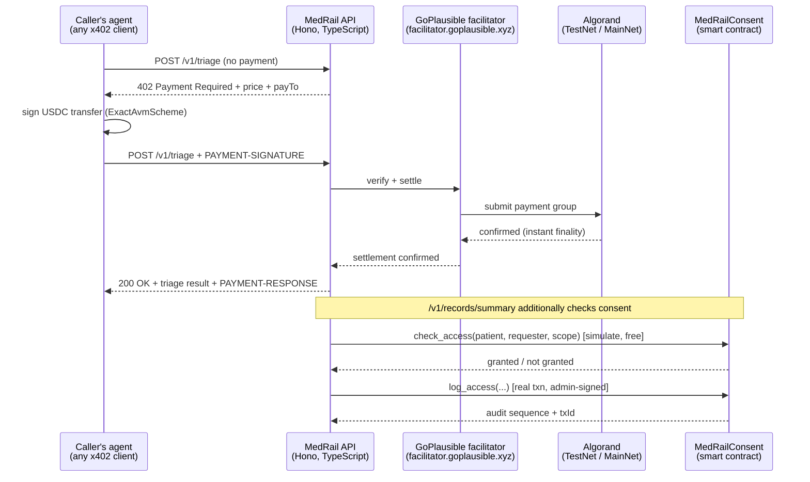

# MedRail — Architecture

## System overview



## Two endpoint categories, one reason

The Global x402 Challenge's leaderboard scores real, sustained payment volume. A consent-gated
"only the patient's own doctor can call this" endpoint cannot generate that volume by
construction — one patient, one doctor, a handful of calls a year. So MedRail deliberately
splits into two categories that share one on-chain trust layer:

| | `/v1/triage`, `/v1/interaction-check` | `/v1/records/summary` |
|---|---|---|
| Gate | x402 payment only | x402 payment **and** on-chain consent |
| Caller | anyone's agent, no prior relationship | a requester the patient has explicitly granted |
| Purpose | broad, repeatable leaderboard volume | the patient-ownership proof |
| State touched | none (stateless compute) | `MedRailConsent.check_access` + `log_access` |

Both categories are wired to the same audit log, so the open endpoints could leave a verifiable
on-chain trail if they ever touched a specific patient's data — they currently don't, being pure
compute, but the plumbing is shared and ready for `/v1/health-score` or similar in a v2.

> **Verification note (2026-08-21 review).** The audit log has **not yet been written on TestNet by
> any endpoint.** The deployed contract reports `total_audit_entries = 0` and holds no audit boxes,
> so `log_access` — including the `/v1/records/summary` path that does call it — is proven only in
> the AVM simulator (14/14 unit tests), not on live infrastructure. See
> [`ENGINEERING_GAP_REPORT.md`](ENGINEERING_GAP_REPORT.md) finding **G-02**. Closing this needs one
> successful paid call against a self-granted consent.

## Repository layout

```
MedRail/
  contracts/          Algorand Python smart contract (algopy / puya), tests, deploy scripts
    smart_contracts/consent/contract.py   MedRailConsent — the only on-chain program
    tests/test_consent.py                 14 unit tests, AVM-simulated, no network
    scripts/deploy_testnet.py             real TestNet deployment via algokit-utils
    scripts/exercise_contract.py          live request/grant/check/revoke proof script
    artifacts/                            compiled TEAL + ARC-56 spec (generated, committed)
  api/                 Hono/TypeScript x402 resource server
    src/app.ts                            route + payment-middleware wiring (testable in isolation)
    src/x402.ts                           facilitator + ExactAvmScheme registration
    src/services/algorand.ts              ABI calls into the deployed contract (algosdk, ATC)
    src/services/triageScorer.ts          open endpoint #1 — pure function, fully unit-tested
    src/services/interactionChecker.ts    open endpoint #2 — pure function, fully unit-tested
    src/routes/records.ts                 the consent-gated endpoint
    test/                                 18 tests: pure-logic + live-facilitator 402 shape
  web/                 Next.js judge-facing demo frontend
    lib/x402Client.ts                     browser-side ExactAvmScheme client, real payment signing
    lib/demoWallet.ts                     session-only TestNet keypair for one-click trying
    lib/consent.ts                        direct wallet-to-Algorand grant/revoke (no backend proxy)
  docs/                this document and its siblings
```

## The consent contract

`MedRailConsent` (`contracts/smart_contracts/consent/contract.py`) is deliberately one small
contract rather than several, because the thing worth proving on-chain is small: *did this
patient currently grant this requester this scope, and is there an immutable log of who asked.*

**State**

- `admin` (global) — the MedRail backend's operator address; the only account that may call
  `log_access` or `withdraw_excess`.
- `grants` — `BoxMap(Bytes, GrantRecord)`, keyed by `sha256(patient ‖ requester ‖ scope)`. Box
  storage rather than local state deliberately: local state would require every requester —
  including a stranger's read-only AI agent — to opt in to this app, which makes no sense for a
  pay-per-call endpoint.
- `audit_seq` / `audit_log` — `BoxMap`s implementing a per-patient append-only sequence, written
  only by `log_access`.

**Methods** (full ABI in `contracts/artifacts/MedRailConsent.arc56.json`): `create`, `set_admin`,
`fund_mbr`, `request_access`, `grant_access`, `revoke_access`, `check_access` (readonly),
`get_grant` (readonly), `log_access`, `get_audit_count` (readonly), `get_audit_entry` (readonly),
`get_grant_box_mbr` (readonly), `withdraw_excess`.

**Why `log_access` is a follow-up call, not part of the payment's atomic group.** The Algorand
`exact` x402 scheme technically allows up to 16 transactions in a client's signed payment group,
so it is *possible* to ask a client to bundle a consent app-call alongside their payment. MedRail
does not do this: generic x402 clients (`@x402/fetch`, or any other team's agent) only know how
to construct the payment transaction described in `paymentRequirements` — asking them to also
know our app ID and method signature would make the endpoint incompatible with off-the-shelf
callers, directly undermining the "cheap and frequent" leaderboard strategy. Instead, the
facilitator verifies and settles the payment through the normal flow, and the backend's own
operator account — already registered as `admin` — submits `log_access` immediately after
settlement confirms. This is not fully atomic at the raw ledger level (two transactions, moments
apart, both real); the mitigation is that `log_access` is admin-gated and only ever called
server-side right after a facilitator-confirmed settlement. Full atomicity is the natural
upgrade once MedRail controls both ends of a call, e.g. a future Orchestrator agent — see
`docs/COMPLIANCE.md` for how that maps to the challenge's Orchestrator entry type.

## x402 integration specifics

Verified live against the real facilitator and the real npm/PyPI registries — see
`docs/IMPLEMENTATION_PLAN.md` §1 for the full fact table with sources. The short version:

- Facilitator: `https://facilitator.goplausible.xyz` (GoPlausible, Algorand Foundation's
  chosen AVM facilitator for this challenge). Confirmed live, supports both Algorand networks,
  sponsors network fees (a `feePayer` address settles gas so callers need only hold USDC, not
  ALGO — lowering the barrier for other builders' agents to call MedRail).
- Protocol: x402 v2, scheme `exact`. Request header `PAYMENT-SIGNATURE`, response header
  `PAYMENT-RESPONSE`, 402 body/header `PAYMENT-REQUIRED` (v1's `X-PAYMENT` is legacy and not
  what this facilitator speaks as its current default).
- Packages: `@x402/core`, `@x402/avm`, `@x402/hono`, `@x402/extensions` (TypeScript, all
  `2.21.0`), `x402-avm` (Python, unused here — the backend is TypeScript, but the same package
  family backs the reference examples this implementation was checked against).
- Pricing: `$0.02` for the two open endpoints, `$0.05` for the consent-gated one, expressed as
  plain USD strings — the SDK's default money parser resolves this to the network's canonical
  USDC ASA (`10458941` TestNet / `31566704` MainNet) and correct base units automatically; no
  asset ID is hardcoded in the route config.

## Frontend's role

The web app never holds a production signing key. Two distinct paths:

1. **Try-it-now path** (what's built): a TestNet-only keypair generated in the browser
   (`lib/demoWallet.ts`), held in `sessionStorage`, implementing the SDK's `ClientAvmSigner`
   interface directly (`{address, signTransactions}`) — this is the same interface real wallet
   libraries like `@txnlab/use-wallet` implement, so swapping in a real wallet later is a
   signer-object change, not an architecture change.
2. **Consent transactions go straight from wallet to Algorand.** `grant_access` / `revoke_access`
   are patient-signed actions; the backend never sees or proxies that key. The frontend
   constructs and submits these directly via `algosdk`'s `AtomicTransactionComposer` against
   public Algorand infrastructure (AlgoNode).

## What a v2 Orchestrator layer would add

Not built now — scoped out deliberately (see `docs/IMPLEMENTATION_PLAN.md` §0) — but the shape
is: an agent that itself holds a spend-limited budget and pays *other* x402 endpoints (its own,
or another team's) on a patient's behalf inside one care episode, registering as the
Orchestrator entry type. MedRail's consent layer and audit log are already the right substrate
for that; what's missing is the orchestration loop itself.
