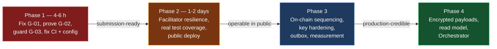

# MedRail — Winning Roadmap

**Purpose:** The remediation sequence, ordered by what most improves technical credibility per hour
spent. Every item is drawn from a verified finding in
[`ENGINEERING_GAP_REPORT.md`](ENGINEERING_GAP_REPORT.md); nothing here is speculative polish.

**Status of this document:** Complete. Effort estimates are the reviewer's judgement, calibrated
against reading the actual code that would change.

**Principle applied throughout:** do not add complexity. Every phase-1 item below either removes a
defect or converts an existing capability into evidence. None of them adds a subsystem. A simple
architecture that is correct and proven beats a more elaborate one that is neither.

---

## Phase 1 — Must fix before submission — **COMPLETE**

All items were implemented and verified on 2026-08-21. Test count went **32 → 73**.

| # | Action | Gap | Status |
|---|---|---|---|
| 1.1 | Bind the payer to `requesterAddress` | G-01 | ✅ `api/src/x402Payer.ts` + 6 unit tests + a **live attack simulation** that grants a third party consent, pays as someone else, and confirms the 403 |
| 1.2 | Payer-binding regression test | G-01, G-05 | ✅ `api/test/x402Payer.spec.ts`; `api/scripts/verify-g01-fix.ts` re-runs the attack against live TestNet |
| 1.3 | Execute `log_access` on TestNet | G-02 | ✅ `total_audit_entries` 0 → 5; `api/scripts/e2e-consent-proof.ts` makes it repeatable |
| 1.4 | Denial billing + success-path guard | G-03 | ✅ Kept 403, corrected `API.md`/`SECURITY.md`, dropped `paidButDenied`, added `charged: false` + free pre-flight hint; `logAccess` guarded → `auditStatus: "pending"` |
| 1.5 | CI branch trigger | G-06 | ✅ `branches: [main, master]` + `workflow_dispatch`, caching, `npm audit`, artifact-freshness gate |
| 1.6 | `fly.toml` defaults | G-07 | ✅ `NETWORK=testnet`, `CONSENT_APP_ID=768743428`, `/v1/health` check, `max_machines_running = 1` |
| 1.7 | `.dockerignore` + `npm ci` | G-13, G-14 | ✅ Both added; secrets excluded from the build context |
| 1.7b | Contract build + CI artifact check | G-28 | ✅ CI recompiles and runs `git diff --exit-code contracts/artifacts/` |
| 1.7c | `npm audit fix` | G-27, G-16 | ✅ Both packages report **0 vulnerabilities** |
| 1.7d | Fail fast on empty `PAY_TO_ADDRESS` | G-30 | ✅ `assertPayToConfigured()` at boot |
| 1.8 | Address checksums + error hygiene | G-10 | ✅ `api/src/validation.ts`; `onError` returns a generic body with a `requestId` |
| — | Rate limiting (pulled forward from Phase 2) | G-09 | ✅ `api/src/rateLimit.ts` — 429 + `Retry-After` on the free/refundable surface |
| — | Facilitator resilience (pulled forward) | G-04 | ✅ 503 + `Retry-After` + stable error code instead of an opaque 500 |
| — | Box-key parity (pulled forward) | G-08 | ✅ Shared golden-vector fixture asserted from **both** TypeScript and Python |
| — | Service index completeness | G-34 | ✅ All 8 routes advertised, with a test pinning it to the mounted set |
| — | Contract defects fixed in source | G-12, G-20 | ✅ Both fixed with regression tests that fail against the old code. **Redeploy deferred** so App `768743428` stays valid |

### What remains before the demo

| Action | Owner | Reference |
|---|---|---|
| Deploy the API publicly and the frontend to Vercel | **You** — needs your accounts | [`08_Deployment/GO_LIVE_RUNBOOK.md`](08_Deployment/GO_LIVE_RUNBOOK.md) §1–2 |
| Re-run the proof scripts (`e2e-proof.ts`, `e2e-consent-proof.ts`, `agent-demo.ts`) against the public URL and paste the tx IDs into `PROOF.md` | **You** | Runbook §1.6 |
| Bazaar listing with the `x402-global-challenge` tag | **You** — competition entry action | Runbook §3 |
| Rehearse the demo | **You** | [`11_Hackathon/Demo_Runbook.md`](11_Hackathon/Demo_Runbook.md) |

## Phase 2 — High-value if time permits

Effort: **~half a day.** Several Phase 2 items were pulled forward and completed (rate limiting,
facilitator resilience, box-key parity). What remains:

| # | Action | Gap | Effort | Value |
|---|---|---|---|---|
| 2.1 | **Graceful facilitator degradation** | G-04 | ~3 h | Cache `/supported` at startup and serve the 402 from cache on failure; otherwise return `503` + `Retry-After`, never `500`. Removes a third-party service from the demo's critical path *and* from CI. |
| 2.2 | **Test `records.ts` and `algorand.ts`** | G-05 | ✅ **Done 2026-08-22.** `api/test/records.spec.ts` (12) and `api/test/algorandService.spec.ts` (26). `src/services` branch coverage 50% → 93.18%, `src/routes` 9.09% → 63.63%, whole suite 40.65% → 65.85%. `npm run coverage`. |
| 2.3 | **Box-key derivation golden vectors** | G-08 | ~2 h | One fixture, three assertions (Python, Node, browser). Cheap insurance against the worst-diagnosed failure mode in the system: consent silently returning `false`. |
| 2.4 | **`withPatientLock` concurrency test** | G-05, G-11 | ✅ **Done 2026-08-22.** Covered in `api/test/algorandService.spec.ts`: concurrent `logAccess` calls for one patient serialise, and calls for different patients do not. |
| 2.5 | **Deploy the API to a public HTTPS URL** | — | ~2 h | Required by the challenge rules and currently the largest single "pending" item. Everything needed is committed; it needs a hosting account. Pin to one machine until 3.1 lands (G-11). |
| 2.6 | **Add per-IP rate limiting on the free routes** | G-09 | ~1 h | `/v1/consent/status` makes two algod calls per unauthenticated request. Necessary before a public URL exists. |
| 2.7 | **Minimal observability** | G-15 | ~3 h | Request-id middleware, structured JSON logs with an explicit never-log list, and a chain-native canary polling the operator balance and `total_audit_entries`. Without this, item 1.4's failure mode is undetectable in production. |
| 2.8 | **Dependency scanning in CI** | G-16 | ~30 m | `npm audit --audit-level=high`, `pip-audit`, Dependabot. |

---

## Phase 3 — Production hardening

Only relevant if MedRail continues past the competition. Ordered by risk reduced.

| # | Action | Gap | Why |
|---|---|---|---|
| 3.1 | **Make the audit box reference resilient** | G-11, G-03 | The contract already self-assigns the sequence — the race is in the client-side **box-reference array**, and its failure mode is a rejected transaction, not a corrupted log (see gap report §7). Retry once with a refreshed `getAuditCount` on a box-reference rejection, and/or declare a window of candidate box names. This plus G-03's guard removes the only hard horizontal-scaling constraint. No contract change required. |
| 3.1b | **Fix the two contract defects in source now; redeploy only *after* the finals** | G-12, G-20 | The `request_access` event field swap (C-1) and the `GRANT_BOX_MBR` constant (C-2) are both one-line fixes, but they only take effect on-chain via a redeploy — and `deploy_testnet.py` uses `OnUpdate.AppendApp`, which **creates a brand-new application rather than updating in place**. A redeploy therefore mints a *new App ID*, leaving `768743428` deployed forever with its two grant boxes and its counters, and invalidating the App ID cited in every document, the demo, and the evidence log. **Do not redeploy before the finals.** Fix in source, add the tests that would have caught both, and present them as diagnosed one-line defects deliberately held back — which is a stronger story than a silent fix. See [`08_Deployment/Rollback_Strategy.md`](08_Deployment/Rollback_Strategy.md). |
| 3.2 | **Harden the admin key** | SEC-012 | The operator mnemonic currently carries three powers in one hot environment variable: forge audit entries, rotate the admin, drain the app account. Move to a multisig or a rekeyed account with hardware custody, and document a rotation runbook. |
| 3.3 | **Move the audit write off the response path** | G-03, G-24 | An outbox table plus a serialised drainer. Removes Algorand confirmation latency from the caller's critical path and makes the write retryable rather than lossy. |
| 3.4 | **Establish a latency budget, then measure it** | G-24 | No performance data exists beyond two single observations. Decide the targets first; measure second. See [`07_Testing/Performance_Validation.md`](07_Testing/Performance_Validation.md). |
| 3.5 | **Define RPO/RTO and a key-custody backup procedure** | OPS-008 | The only irreplaceable assets are two mnemonics. Losing the operator key permanently disables audit writes and strands the app account's ALGO, because both `set_admin` and `withdraw_excess` require it. |
| 3.6 | **Token-boundary matching in the interaction checker** | G-21 | Removes false positives on short or malformed medication names. Measured today: `checkInteractions(["a","b"])` returns five spurious matches, and the existing test suite calls exactly that input without asserting on it. |
| 3.7 | **Negation handling in the triage scorer** | G-26 | Measured today: `scoreTriage("I have no chest pain")` returns band `urgent`. Until this is fixed, the mitigation is disclosure — which is already in place. |
| 3.8 | **Real wallet integration** | G-18 | Replace the demo signer with `@txnlab/use-wallet` or equivalent. The `ClientAvmSigner` seam already exists, so this is a signer swap rather than a rework. |

---

## Phase 4 — Future scale

Genuine product direction, not busywork. Each is a real decision, not a foregone conclusion.

| Direction | What it needs | Honest assessment |
|---|---|---|
| **Off-chain encrypted payloads with on-chain pointers** | Client-side envelope encryption, content-addressed storage, key distribution per grant | This is the step that turns MedRail from a mechanism demo into something that could hold real data. It is also the hardest remaining problem — key distribution on grant, and re-encryption on revoke, are unsolved here. Currently **PLANNED** only (DATA-006). |
| **Off-chain read model over ARC-28 events** | An indexer subscriber and a projection store | Box storage cannot answer "list every requester this patient has granted" — there is no range scan over grant keys. A read model fixes that without weakening the on-chain source of truth. Fix defect C-1 first, or the projection inherits swapped event fields. |
| **Orchestrator entry type** | An agent that itself pays other x402 endpoints under a spend limit | Correctly and explicitly *not* claimed today. The consent layer and audit log are the right substrate; the orchestration loop and budget enforcement are the missing work. Do not claim this until it exists. |
| **Wider endpoint catalogue** | More priced routes sharing the same contract | Cheap to add — `scope` is deliberately a free-form string, so no contract change is needed. But breadth without depth is exactly the trade the project has so far correctly refused to make. Add endpoints only if each is genuinely useful. |

---

## What NOT to do

Listed because the temptation is real and each of these would cost more than it returns.

- **Do not build the Sentinel Exchange system.** The 647-line proposal in
  [`future/SENTINEL_EXCHANGE_PROPOSAL.md`](future/SENTINEL_EXCHANGE_PROPOSAL.md) describes a
  different product — a FastAPI engine, a SQLite database, XGBoost forecasting, a contract-net
  auction. It is a five-day build against a submission that needs six hours of fixes. Starting it
  would leave both systems half-finished.
- **Do not replace the rule engines with an LLM to make the "AI" label true.** It would introduce
  non-determinism, latency, cost, a provider dependency, and a prompt-injection surface into a
  clinical-adjacent decision path — and the current honest position is *stronger* under
  questioning, provided it is stated first rather than discovered. See
  [`09_Intelligence_Layer/`](09_Intelligence_Layer/).
- **Do not add a database.** Nothing in the system needs one. The absence is a defensible
  architectural decision (ADR-002), not a gap.
- **Do not chase test-count metrics.** 32 tests concentrated on pure functions is worth less than
  8 tests on `records.ts` and `algorand.ts`. Coverage where the risk is, not coverage as a number.
- **Do not deploy to MainNet before Phase 1 is complete.** G-01 with real funds and a real
  `payTo` address is a materially different risk than G-01 on TestNet.

---

## Sequencing summary

Phase 1 is the only phase that changes whether this submission survives scrutiny. Everything after
it changes how far the project can go afterwards.

---

## Cross-references

- Findings and reference patches: [`ENGINEERING_GAP_REPORT.md`](ENGINEERING_GAP_REPORT.md)
- Judge-perspective scoring and the hard questions: [`11_Hackathon/Judge_Evaluation.md`](11_Hackathon/Judge_Evaluation.md)
- Tactical framing and answers: [`11_Hackathon/Winning_Strategy.md`](11_Hackathon/Winning_Strategy.md)
- Requirement-level gaps: [`02_Requirements/Requirements_Gap_Analysis.md`](02_Requirements/Requirements_Gap_Analysis.md)
- Competition entry checklist: [`GO_LIVE_CHECKLIST.md`](GO_LIVE_CHECKLIST.md)
